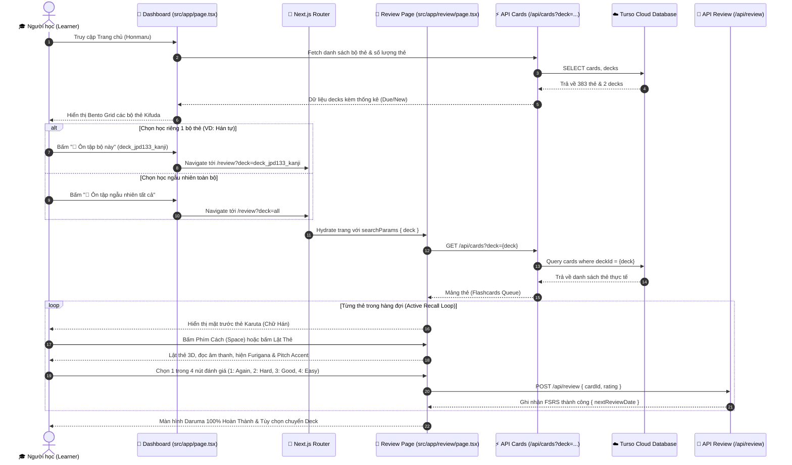
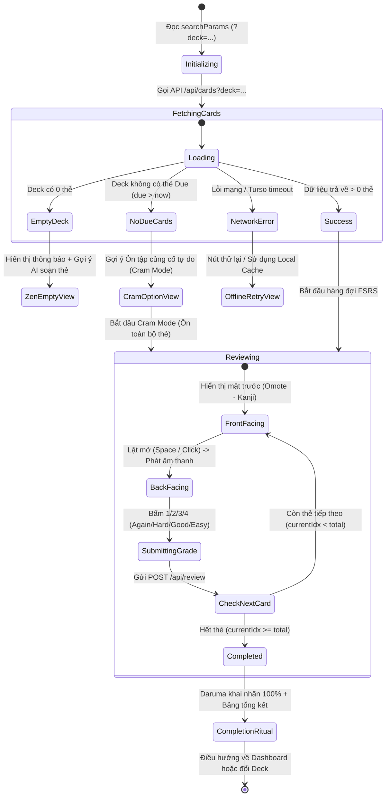

# 📜 TÀI LIỆU 09: KẾ HOẠCH PHÂN TẦNG CẢI TIẾN HỆ THỐNG — ÔN TẬP THEO TỪNG BỘ THẺ (DECK-BASED SRS STUDY ARCHITECTURE)
## Dự án: Japanese SRS System (FSRS Cognitive Spaced Repetition)
## Cấp độ tài liệu: Master Architectural Blueprint & Stratified Execution Plan
## Trạng thái: SẴN SÀNG THỰC THI (READY FOR AGENT EXECUTION - ZERO GUESSWORK)

---

> [!IMPORTANT]
> **TÀI LIỆU NÀY LÀ BẢN KẾ HOẠCH PHÂN TẦNG TOÀN DIỆN (HIERARCHICAL PLAN)**.
> Được xây dựng theo nguyên tắc phân rã đa tầng từ **Chiến lược vĩ mô (Tầng 1)** $\rightarrow$ **Kiến trúc hệ thống (Tầng 2)** $\rightarrow$ **Đặc tả module kỹ thuật (Tầng 3)** $\rightarrow$ **Đơn vị công việc nguyên tử (Tầng 4 - Cấp độ không thể chia nhỏ hơn)** $\rightarrow$ **Ma trận kiểm định nghiệm thu (Tầng 5)**.
> Agent chỉ cần tuân thủ từng bước chi tiết, không cần phải suy luận hay tự biên diễn thêm bất cứ thành phần nào.

---

# ⛩️ TẦNG 1: TỔNG QUAN CHIẾN LƯỢC, PHẠM VI (SCOPE) & GIỚI HẠN RANH GIỚI

### 1.1. Tuyên ngôn Mục tiêu & Bối cảnh Nhận thức (Executive Vision)
- **Thực trạng hiện tại**: Hệ thống ôn tập thẻ bài Karuta (`/review`) đang tải dữ liệu mẫu tĩnh (mock cards) hoặc gộp chung toàn bộ thẻ từ mọi nguồn một cách ngẫu nhiên. Người học không thể lựa chọn tập trung vào một bộ thẻ cụ thể (ví dụ: chỉ ôn riêng Hán tự Kanji của bài học, hoặc chỉ ôn riêng Từ vựng Kotoba).
- **Vấn đề nhận thức (Cognitive Interference)**: Việc trộn lẫn các vùng nhận thức khác nhau (nhận diện hình thái chữ Hán tượng hình vs. phản xạ âm điệu ngữ cảnh giao tiếp) làm gia tăng hiện tượng can thiệp hồi tố (Retroactive Interference). Khi học sinh chuẩn bị kiểm tra Hán tự, việc bị chèn thẻ từ vựng hoặc ngữ pháp làm giảm hiệu suất ghi nhớ có chủ đích.
- **Mục tiêu cải tiến**: Cung cấp cơ chế **Lựa chọn Ôn tập theo Từng Bộ Thẻ (Deck-Based Study)** song song với chế độ **Ôn tập Ngẫu nhiên Toàn bộ (Global Mixed Study)**. Người học có thể chủ động chọn học tập trung theo từng bộ thẻ từ Trang chủ (Dashboard), từ Thư viện thẻ (Cards Management), hoặc chuyển đổi linh hoạt ngay trong phiên ôn tập, với trạng thái được đồng bộ bền vững qua URL.

---

### 1.2. Bảng Phân tích Hiện trạng vs Kỳ vọng (As-Is vs To-Be Gap Analysis)

| Đặc tính hệ thống | Hiện trạng (As-Is) | Kỳ vọng sau cải tiến (To-Be) |
| :--- | :--- | :--- |
| **Điểm khởi đầu phiên học (Entrypoint)** | Nút "Bắt đầu bài học ngay" trên Dashboard nhảy thẳng vào `/review` không có lựa chọn bộ thẻ. | Dashboard hiển thị danh mục các bộ thẻ (Kifuda Grid) kèm số thẻ Due/New của từng bộ; người học có thể chọn học riêng bộ đó hoặc học ngẫu nhiên toàn bộ. |
| **Nguồn dữ liệu phiên học (`/review`)** | Đang dùng 3 thẻ mock cứng trong code (`勉強`, `桜`, `猫`). | Nạp danh sách thẻ thực tế từ Turso Cloud DB (383 thẻ) tương ứng với Deck đã chọn thông qua API. |
| **Cơ chế định tuyến & Trạng thái** | Đường dẫn cố định `/review`. Tải lại trang (F5) mất trạng thái. | Định tuyến hướng URL (`/review?deck=deck_jpd133_kanji` hoặc `/review?deck=all`). Chia sẻ link hoặc F5 trang bảo lưu 100% phiên học. |
| **Chuyển đổi bộ thẻ trong phiên học** | Bắt buộc quay về trang chủ. | Dropdown chuyển nhanh bộ thẻ (Quick Deck Switcher) ngay trên Header phiên ôn tập. |
| **Trạng thái hết thẻ đến hạn** | Hiển thị xong 15 thẻ mock là kết thúc. | Xử lý thông minh: nếu hết thẻ Due thì hiển thị màn hình chúc mừng Daruma + Nút kích hoạt chế độ Ôn tập củng cố tự do (Cramming Mode). |

---

### 1.3. Phạm vi Công việc (In-Scope Deliverables)
1. **Thiết kế & Bổ sung Khu vực Chọn Bộ Thẻ tại Trang chủ (`src/app/page.tsx`)**:
   - Thêm Bento Grid hiển thị các bộ thẻ hiện có trong DB (Kifuda Deck Cards).
   - Hiển thị nhãn son Inkan đặc trưng (`漢` cho Kanji, `語` cho Từ vựng), số thẻ đến hạn ôn (`due`), số thẻ mới (`new`), và tổng số thẻ.
   - Nút hành động trực tiếp: `[🎴 Ôn tập bộ này]` dẫn tới `/review?deck=${deckId}`.
   - Nút hành động toàn cục: `[🎲 Ôn tập ngẫu nhiên tất cả]` dẫn tới `/review?deck=all`.
2. **Bổ sung Hành động Nhanh tại Thư Viện Thẻ (`src/app/cards/page.tsx`)**:
   - Khi người dùng đang lọc theo một Deck cụ thể, hiển thị nút Quick Action: `[🎴 Bắt đầu học bộ này]` chuyển thẳng sang `/review?deck=${selectedDeck}`.
3. **Cải tiến Toàn diện Trang Ôn tập (`src/app/review/page.tsx`)**:
   - Hỗ trợ đọc tham số URL `deck` và `mode` an toàn với React Suspense.
   - Tải danh sách thẻ thực tế từ database Turso thông qua API `/api/cards?deck=...`.
   - Hiển thị Deck Header Badge mang phong cách Nhật Bản định danh bộ thẻ đang học.
   - Quick Deck Switcher Dropdown để đổi bộ thẻ ngay tại chỗ.
   - Màn hình kết thúc phiên học (Completion Ritual) với Mascot Daruma mở trọn vẹn 2 mắt và thống kê chi tiết của riêng bộ thẻ đó.
4. **Xử lý Ngoại lệ & Độ bền bỉ (Resilience & Edge Cases)**:
   - Xử lý Deck rỗng, Deck không còn thẻ đến hạn (Cram Mode), URL chứa Deck ID không hợp lệ, mất kết nối mạng.

---

### 1.4. Giới hạn Ranh giới & Điều cấm kỵ (Out-of-Scope / Non-Goals)
- ❌ **KHÔNG thay đổi cấu trúc bảng cơ sở dữ liệu**: Bảng `decks`, `cards`, `review_logs` trong `src/db/schema.ts` đã có sẵn trường `deckId` (`cards.deck_id -> decks.id`). Tuyệt đối KHÔNG sửa schema, KHÔNG migration lại DB.
- ❌ **KHÔNG can thiệp vào công thức toán học FSRS**: Thuật toán DSR (Difficulty, Stability, Retrievability) trong `src/core/scheduler/fsrs-engine.ts` giữ nguyên vẹn 100%.
- ❌ **KHÔNG làm thay đổi hợp đồng API hiện hữu**: Các endpoint `POST /api/review`, `POST /api/cards`, `GET /api/cards` tiếp tục hoạt động tương thích ngược 100%.
- ❌ **KHÔNG thêm thư viện UI nặng nề của bên thứ 3**: Không cài thêm Redux, Zustand, hay UI library lạ. Sử dụng React Context / State gốc và Next.js URL Search Params.

---

### 1.5. Hiến chương Bảo toàn Backend (Zero-Backend-Regression Charter)
```
┌────────────────────────────────────────────────────────────────────────┐
│                   ZERO-BACKEND-REGRESSION CONTRACT                     │
├────────────────────────────────────────────────────────────────────────┤
│ 1. Schema Invariance: src/db/schema.ts KHÔNG ĐƯỢC THAY ĐỔI.            │
│ 2. Driver Invariance: Client Turso HTTPS REST trong src/db/client.ts   │
│    giữ nguyên, đảm bảo an toàn 100% trên Vercel Serverless.            │
│ 3. API Contract: POST /api/review giữ nguyên { cardId, rating }.       │
│ 4. Build Safety: npx tsc --noEmit && npm run build luôn thành công.    │
└────────────────────────────────────────────────────────────────────────┘
```

---

### 1.6. Bộ Chỉ số Thành công & Tiêu chuẩn Hoàn thành (Definition of Done)
1. **Chức năng (Functionality)**: Người dùng có thể chọn học riêng bộ Hán tự (Kanji), riêng bộ Từ vựng (Kotoba), hoặc học trộn ngẫu nhiên tất cả thẻ.
2. **Dữ liệu thực (Real Data)**: 100% thẻ hiển thị trong phiên ôn tập là thẻ thực tế từ Turso Cloud Database (không còn mock cứng).
3. **Độ tin cậy URL (URL Determinism)**: Truy cập `/review?deck=deck_jpd133_kanji` luôn tải đúng thẻ Hán tự; F5 không mất phiên học.
4. **Mỹ học Nhật Bản (Aesthetics)**: Sử dụng chuẩn bảng màu Nippon Colors, thẻ bài Karuta 3D, họa tiết Seigaiha/Asanoha, con dấu son Inkan, và hiệu ứng âm thanh văn hóa (Hyoshigi, Koto, Suzu).
5. **Kiểm thử tự động (Zero Lints & Zero Build Errors)**: Vượt qua `npx tsc --noEmit`, `npm run test`, và `npm run build` với exit code 0.

---

# 🏛️ TẦNG 2: PHÂN RÃ HỆ THỐNG KIẾN TRÚC & DÒNG DỮ LIỆU

### 2.1. Phân rã 4 Khối Trụ Cột (The 4 Pillar Subsystems)

```
                                  [ HỆ THỐNG SRS TIẾNG NHẬT ]
                                              │
         ┌──────────────────┬─────────────────┴────────────────┬──────────────────┐
         ▼                  ▼                                  ▼                  ▼
   [ TRỤ CỘT 1 ]      [ TRỤ CỘT 2 ]                      [ TRỤ CỘT 3 ]      [ TRỤ CỘT 4 ]
   Deck Catalog       URL-First Routing                  Dynamic FSRS       Karuta Session
   & Selection Hub    & Hydration Engine                 Queue Fetcher      & Completion Ritual
   (Trang chủ /       (Next.js App Router                (Turso Cloud REST  (Active Recall 3D,
    Thư viện thẻ)      Search Params Sync)                Data Access)       DSR FSRS Rating)
```

1. **Trụ cột 1: Deck Catalog & Selection Hub**:
   - Chịu trách nhiệm hiển thị các bộ thẻ dưới dạng thẻ gỗ Kifuda trên Dashboard (`/`) và thanh công cụ của Thư viện (`/cards`).
   - Cung cấp số liệu thống kê nhanh: thẻ cần ôn (`due`), thẻ mới (`new`), tổng số thẻ (`total`).
2. **Trụ cột 2: URL-First Routing & Hydration Engine**:
   - Sử dụng chuẩn Next.js 14 App Router: `/review?deck=[deckId|all]&mode=[fsrs_due|cram_all]`.
   - Đảm bảo bọc trong React `<Suspense>` để render phía máy chủ (SSR) không bị de-opt và không gây hydration mismatch.
3. **Trụ cột 3: Dynamic FSRS Queue Fetcher**:
   - Kết nối trực tiếp với API `/api/cards?deck={deckId}` lấy dữ liệu thẻ thực tế từ Turso.
   - Phân loại thẻ: Thẻ đến hạn (`due <= now`) ưu tiên số 1, thẻ mới (`state == 'New'`) ưu tiên số 2, giới hạn số lượng thẻ mỗi phiên học (mặc định 15-20 thẻ).
4. **Trụ cột 4: Karuta Session & Completion Ritual**:
   - Trực quan hóa thẻ bài Karuta 3D lật mở (Omote/Ura), phát âm Web Speech API tiếng Nhật, hiển thị đồ thị cao độ Pitch Accent.
   - Ghi nhận đánh giá FSRS 4 sắc thái (Again, Hard, Good, Easy) qua API `/api/review`.
   - Kết thúc phiên với búp bê Daruma 100% khai mở 2 mắt và bảng tóm tắt kết quả.

---

### 2.2. Sơ đồ Luồng Dữ Liệu Toàn Cục (End-to-End Data Flow Sequence)



---

### 2.3. Máy Trạng thái Hữu hạn Phiên Học (Finite State Machine of Deck Review Session)



---

# 📐 TẦNG 3: ĐẶC TẢ CHI TIẾT TỪNG MODULE & HỢP ĐỒNG KỸ THUẬT

### 3.1. Đặc tả Điểm Chọn Bộ Thẻ tại Dashboard (`src/app/page.tsx`)

#### A. Wireframe & Cấu trúc Trực quan (Bento Grid Kifuda)
Thay thế phần nút đơn giản trên Dashboard bằng khu vực **Danh mục Bộ thẻ Truyền thống (短冊・木札目録)**:
```
┌─────────────────────────────────────────────────────────────────────────────┐
│ 📚 CÁC BỘ THẺ CỦA BẠN (学習単元一覧)                  [🎲 Ôn tập ngẫu nhiên tất cả] │
├──────────────────────────────────────┬──────────────────────────────────────┤
│ 🏷️ JPD133 - HÁN TỰ ĐÃ HỌC (Unit 4-7) │ 🏷️ JPD133 - TỪ VỰNG KOTOBA           │
│ Con dấu: [漢] (Đỏ son Torii)          │ Con dấu: [語] (Xanh Matcha Seigaiha) │
│ Mô tả: 133 chữ Hán trọng tâm N5-N4   │ Mô tả: 250 từ vựng và câu đục lỗ i+1 │
│ ──────────────────────────────────── │ ──────────────────────────────────── │
│ 🔴 Cần ôn: 12 thẻ  | 🟢 Mới: 5 thẻ   │ 🔴 Cần ôn: 28 thẻ  | 🟢 Mới: 10 thẻ  │
│ [ 🎴 Ôn tập bộ Hán Tự này ]          │ [ 🎴 Ôn tập bộ Từ Vựng này ]         │
└──────────────────────────────────────┴──────────────────────────────────────┘
```

#### B. Thông số Phong cách (Design Specs)
- **Container**: Grid `repeat(auto-fit, minmax(320px, 1fr))`, khoảng cách `1.5rem`.
- **Thẻ Kifuda (Deck Card)**: Nền giấy Washi viền gỗ ấm áp (`border: 1.5px solid var(--washi-border)`), bóng đổ êm dịu (`box-shadow: var(--shadow-washi-md)`).
- **Con dấu Inkan**: Con dấu vuông góc phải trên:
  - Bộ Kanji: Chữ `漢`, nền `var(--torii-subtle)`, chữ `var(--torii-red)`.
  - Bộ Vocab: Chữ `語`, nền `var(--matcha-subtle)`, chữ `var(--matcha-deep)`.
- **Hành động**: Thẻ có hiệu ứng hover nhấc nhẹ (`transform: translateY(-3px)`), nút bấm `btn-torii` hoặc `btn-matcha`.

---

### 3.2. Đặc tả Điểm Chọn & Chuyển Bộ Thẻ tại Thư Viện (`src/app/cards/page.tsx`)

- Khi người dùng bấm chọn một nút bộ lọc Deck (ví dụ: `JPD133 - Hán Tự`), ngoài việc lọc danh sách thẻ hiển thị bên dưới, hệ thống sẽ render một **Thanh Hành Động Nhanh (Floating Quick Action Bar)** ở đầu danh sách:
  ```tsx
  <div className="deck-quick-study-banner">
    <div>
      <span className="deck-tag">Đang chọn: JPD133 - Hán Tự</span>
      <p>Tổng cộng 133 thẻ · 12 thẻ đến hạn ôn tập hôm nay</p>
    </div>
    <Link href={`/review?deck=${selectedDeck}`} className="btn-torii">
      🎴 Bắt đầu học bộ này ngay →
    </Link>
  </div>
  ```

---

### 3.3. Đặc tả URL-First Routing Contract (`/review`)

#### A. Định dạng Tham số Truy vấn (Query Parameters Schema)
- `deck`:
  - Giá trị: `deck_jpd133_kanji` | `deck_jpd133_vocab` | `all` (hoặc ID bất kỳ của deck trong DB).
  - Mặc định nếu không truyền: `all`.
- `mode`:
  - `fsrs_due` (mặc định): Chỉ ôn thẻ đến hạn (`due <= now`) kết hợp thẻ mới giới hạn.
  - `cram_all`: Ôn tập củng cố tự do toàn bộ thẻ trong Deck, không giới hạn hạn thẻ.

#### B. Quy chuẩn Next.js Suspense Guard
Vì trang `/review` là Client Component (`'use client'`), việc sử dụng hook `useSearchParams()` bắt buộc phải được bọc trong `<Suspense>` để tránh lỗi Next.js build:
```tsx
export default function ReviewPage() {
  return (
    <Suspense fallback={<ReviewLoadingSkeleton />}>
      <ReviewSessionContent />
    </Suspense>
  );
}
```

---

### 3.4. Đặc tả Thuật Toán Lập Hàng Đợi Phiên Học Theo Deck (Deck Queue Priority Algorithm)

```typescript
/**
 * Thuật toán sắp xếp hàng đợi ôn tập theo Deck
 * @param allCards Danh sách thẻ lấy từ API theo deck
 * @param mode Chế độ học ('fsrs_due' | 'cram_all')
 * @param maxNewCards Giới hạn thẻ mới mỗi phiên (mặc định 10)
 */
function buildDeckReviewQueue(allCards: CardItem[], mode = 'fsrs_due', maxNewCards = 10): CardItem[] {
  const now = new Date();

  if (mode === 'cram_all') {
    // Chế độ củng cố tự do: Xáo trộn ngẫu nhiên toàn bộ thẻ trong Deck
    return [...allCards].sort(() => Math.random() - 0.5);
  }

  // 1. Phân loại thẻ đến hạn (Due)
  const dueCards = allCards
    .filter((card) => card.state !== 'New' && new Date(card.due || 0) <= now)
    .sort((a, b) => new Date(a.due || 0).getTime() - new Date(b.due || 0).getTime()); // Quá hạn nhiều nhất lên đầu

  // 2. Phân loại thẻ mới (New)
  const newCards = allCards
    .filter((card) => card.state === 'New')
    .slice(0, maxNewCards);

  // 3. Kết hợp: Thẻ Due ưu tiên ôn trước, sau đó tới Thẻ New
  const queue = [...dueCards, ...newCards];

  // 4. Nếu không có thẻ Due và New, trả về rỗng để hiển thị màn hình chúc mừng
  return queue;
}
```

---

### 3.5. Đặc tả Hợp đồng Dữ liệu & Type Definitions (TypeScript DTOs)

```typescript
// DTO thông tin tóm tắt bộ thẻ (kèm số liệu thống kê)
export interface DeckSummaryDTO {
  id: string;
  name: string;
  description?: string;
  totalCards: number;
  dueCards: number;
  newCards: number;
  learnedCards: number;
}

// Cấu hình phiên học
export interface ReviewSessionConfigDTO {
  deckId: string; // 'all' | ID cụ thể
  deckName: string;
  mode: 'fsrs_due' | 'cram_all';
  totalQueueLength: number;
}

// Kết quả thống kê sau khi hoàn tất phiên học
export interface DeckSessionResultDTO {
  deckId: string;
  deckName: string;
  totalReviewed: number;
  againCount: number;
  hardCount: number;
  goodCount: number;
  easyCount: number;
  retentionRateScore: number; // Tỉ lệ trả lời Good/Easy
}
```

---

# 🔨 TẦNG 4: DANH MỤC CÁC ĐƠN VỊ CÔNG VIỆC NGUYÊN TỬ (ATOMIC WORK UNITS)

> Đây là cấp độ phân rã **nguyên tử (Atomic Level - Không thể chia nhỏ hơn nữa)**. Mỗi micro-task chỉ rõ: File đích, mục tiêu kỹ thuật, mã nguồn hoặc logic thay đổi, và tiêu chí kiểm định.

---

### 📦 Nhóm Micro-Task 4.1: Data Access & API Extension (Zero-Backend-Touch)

#### Task 4.1.1: Tạo file định nghĩa Type chung cho Deck & Queue
- **File đích**: `src/core/cards/deck.types.ts` (File mới hoàn toàn, không đụng file cũ).
- **Nội dung công việc**: Khai báo interface `DeckSummaryDTO`, `ReviewSessionConfigDTO`, `DeckSessionResultDTO`.
- **Tiêu chuẩn hoàn thành**: Export sạch sẽ, không import vòng lặp, `npx tsc --noEmit` pass.

#### Task 4.1.2: Cải tiến `GET /api/cards` để trả về Metadata Thống kê Deck
- **File đích**: `src/app/api/cards/route.ts`.
- **Nội dung công việc**:
  - Khi truy vấn `allDecks = await db.select().from(decks);`, thực hiện tính toán số thẻ `dueCards`, `newCards`, `totalCards` cho từng Deck bằng cách duyệt qua `cardList`.
  - Bổ sung trường `decksWithStats` vào payload trả về:
    ```typescript
    // Giữ nguyên trường `decks: allDecks` cũ để bảo đảm 100% tương thích ngược
    return NextResponse.json({
      success: true,
      data: cardList.map(...),
      decks: allDecks,
      deckSummaries: calculatedSummaries, // Trường mở rộng mới
    });
    ```
- **Tiêu chuẩn hoàn thành**: Endpoint `/api/cards` trả về JSON hợp lệ có chứa cả `decks` cũ và `deckSummaries` mới.

---

### 📦 Nhóm Micro-Task 4.2: Dashboard UI Components (`src/app/page.tsx`)

#### Task 4.2.1: Chuyển đổi `DashboardPage` thành Client Component hoặc Fetch Data
- **File đích**: `src/app/page.tsx`.
- **Nội dung công việc**:
  - Bổ sung `'use client';` và state `decks: DeckSummaryDTO[]`, `loading: boolean`.
  - Fetch dữ liệu từ `/api/cards` trong `useEffect` để lấy số lượng thẻ thực tế của từng Deck.
- **Tiêu chuẩn hoàn thành**: Trang tải mượt mà, hiển thị Skeleton loading nhẹ trong lúc fetch.

#### Task 4.2.2: Xây dựng Bento Grid Danh mục Bộ Thẻ (Kifuda Grid)
- **File đích**: `src/app/page.tsx`.
- **Nội dung công việc**:
  - Thay thế phần mock cards ở giữa trang bằng section **"Lựa chọn Bộ thẻ Học tập (学習単元目録)"**.
  - Render danh sách các bộ thẻ:
    - Bộ 1: `JPD133 - Hán Tự Đã Học (Unit 4-7)` với con dấu `漢`, tông đỏ Torii.
    - Bộ 2: `JPD133 - Từ vựng Kotoba` với con dấu `語`, tông xanh Matcha.
  - Mỗi thẻ hiển thị 3 chỉ số: Thẻ cần ôn, Thẻ mới, Tổng số thẻ.
- **Tiêu chuẩn hoàn thành**: Bấm vào nút `[🎴 Ôn tập bộ này]` sẽ điều hướng tới `/review?deck=${deck.id}`.

#### Task 4.2.3: Bổ sung Nút "Ôn tập Tổng hợp Toàn bộ Thẻ"
- **File đích**: `src/app/page.tsx`.
- **Nội dung công việc**:
  - Tại Hero Banner và thanh điều hướng, cập nhật nút "Bắt đầu bài học ngay" liên kết tới `/review?deck=all`.
  - Bổ sung tooltip giải thích: *"Ôn tập ngẫu nhiên trộn lẫn tất cả các bộ thẻ theo thuật toán FSRS"*.
- **Tiêu chuẩn hoàn thành**: Bấm nút dẫn tới `/review?deck=all`.

---

### 📦 Nhóm Micro-Task 4.3: Cards Management Quick-Action (`src/app/cards/page.tsx`)

#### Task 4.3.1: Thêm Quick Study Banner khi chọn Bộ thẻ
- **File đích**: `src/app/cards/page.tsx`.
- **Nội dung công việc**:
  - Dưới các nút bấm chọn bộ thẻ (`Tất cả`, `Hán Tự`, `Từ vựng`), nếu `selectedDeck !== 'all'`, render banner gợi ý học nhanh:
    *"Bạn đang xem bộ thẻ [Tên bộ thẻ]. Sẵn sàng ôn tập?"* $\rightarrow$ Nút `[🎴 Bắt đầu ôn bộ này ngay]`.
- **Tiêu chuẩn hoàn thành**: Bấm nút sẽ chuyển sang `/review?deck=${selectedDeck}` tương ứng.

---

### 📦 Nhóm Micro-Task 4.4: Review Engine & Karuta Session (`src/app/review/page.tsx`)

#### Task 4.4.1: Bọc Component bằng `<Suspense>` và cấu hình `useSearchParams`
- **File đích**: `src/app/review/page.tsx`.
- **Nội dung công việc**:
  - Tách nội dung chính vào component `ReviewSessionInner`.
  - Xuất `ReviewPage` bọc `ReviewSessionInner` trong `<Suspense fallback={<ReviewLoadingSkeleton />}>`.
  - Trích xuất `const searchParams = useSearchParams();` $\rightarrow$ `const targetDeckId = searchParams.get('deck') || 'all';`.
- **Tiêu chuẩn hoàn thành**: Next.js không cảnh báo `useSearchParams() should be wrapped in suspense`.

#### Task 4.4.2: Tích hợp Dynamic Data Fetching từ API `/api/cards`
- **File đích**: `src/app/review/page.tsx`.
- **Nội dung công việc**:
  - Xóa bỏ biến `cardList` tĩnh 3 thẻ (`勉強`, `桜`, `猫`).
  - Viết hàm `fetchSessionCards(deckId)` gọi `/api/cards?deck=${deckId}`.
  - Map dữ liệu từ DB sang cấu trúc thẻ Karuta (bao gồm `front`, `reading`, `meaning`, `pitch`, `sentence`).
  - Áp dụng thuật toán sắp xếp: thẻ Due lên trước, thẻ New tiếp theo.
- **Tiêu chuẩn hoàn thành**: Phiên học hiển thị thẻ thật từ Turso DB, đúng số lượng của Deck được chọn.

#### Task 4.4.3: Bổ sung Deck Header Badge & Dropdown Chuyển nhanh Bộ thẻ
- **File đích**: `src/app/review/page.tsx`.
- **Nội dung công việc**:
  - Phía trên thẻ Karuta, hiển thị nhãn son và tên bộ thẻ hiện tại:
    Ví dụ: `🏷️ JPD133 - Hán Tự Đã Học (Thẻ 3 / 15)`.
  - Thêm nút mũi tên sổ xuống `[ Đổi bộ thẻ ▾ ]`: Khi bấm sẽ mở modal/dropdown nhẹ hiển thị các bộ thẻ khác để người học đổi ngay lập tức mà không cần thoát ra trang chủ.
- **Tiêu chuẩn hoàn thành**: Đổi bộ thẻ trong dropdown sẽ cập nhật URL và nạp lại hàng đợi mới tương ứng.

#### Task 4.4.4: Cập nhật Màn hình Kết thúc Phiên Học (Deck Completion Screen)
- **File đích**: `src/app/review/page.tsx`.
- **Nội dung công việc**:
  - Khi hoàn thành hết số thẻ trong hàng đợi, hiển thị màn hình chúc mừng mang phong cách Thiền Wabi-Sabi:
    - Búp bê Daruma mở trọn vẹn 2 mắt (`progressPercentage = 100`).
    - Tiếng chuông đền Suzu ngân vang (`japaneseAudio.playSuzuBell()`).
    - Bảng thống kê số lần đánh giá: `Again`, `Hard`, `Good`, `Easy`.
    - 3 nút điều hướng:
      1. `[📚 Ôn tiếp bộ thẻ khác]` $\rightarrow$ Mở danh mục bộ thẻ.
      2. `[🔄 Ôn lại bộ này (Cram Mode)]` $\rightarrow$ Kích hoạt `mode=cram_all`.
      3. `[🏯 Về Trang chủ]` $\rightarrow$ Link về `/`.
- **Tiêu chuẩn hoàn thành**: Trải nghiệm kết thúc phiên học đầy cảm xúc và trọn vẹn.

---

### 📦 Nhóm Micro-Task 4.5: Xử lý Ngoại lệ Cận biên Cực hạn (Edge Cases)

#### Task 4.5.1: Xử lý Ngoại lệ URL Deck không tồn tại
- **File đích**: `src/app/review/page.tsx`.
- **Logic**: Nếu `targetDeckId !== 'all'` nhưng API không tìm thấy Deck tương ứng trong database:
  - Tự động fallback về chế độ `all`.
  - Hiển thị thông báo nhỏ dạng Washi Toast: *"Không tìm thấy bộ thẻ yêu cầu, đã tự động chuyển sang chế độ Ôn tập Toàn bộ"*.

#### Task 4.5.2: Xử lý Ngoại lệ Bộ thẻ có 0 thẻ (Empty Deck)
- **File đích**: `src/app/review/page.tsx`.
- **Logic**: Nếu Deck được chọn hoàn toàn chưa có thẻ nào:
  - Hiển thị Empty State vẽ tranh mực thủy mặc Sumi-e: *"Bộ thẻ này hiện chưa có thẻ học nào"*.
  - Nút bấm trực tiếp: `[✨ Nhờ AI soạn thẻ cho bộ này]` dẫn tới `/cards/new?deck=${targetDeckId}`.

#### Task 4.5.3: Xử lý Ngoại lệ Hết thẻ đến hạn (`due > now`)
- **File đích**: `src/app/review/page.tsx`.
- **Logic**: Nếu tất cả các thẻ trong Deck đều chưa đến hạn ôn:
  - Hiển thị màn hình: *"Tuyệt vời! Bạn đã hoàn thành toàn bộ thẻ cần ôn hôm nay của bộ thẻ này."*.
  - Nút bấm: `[🔥 Kích hoạt Ôn tập Củng cố (Cramming Mode)]` để ôn lại toàn bộ thẻ mà không làm thay đổi lịch ngắt quãng FSRS.

#### Task 4.5.4: Xử lý Mất kết nối Mạng giữa chừng (Offline Graceful Degradation)
- **File đích**: `src/app/review/page.tsx`.
- **Logic**: Khi người học bấm nút chấm điểm (Again/Hard/Good/Easy) mà `fetch('/api/review')` thất bại (do rớt mạng hoặc Turso timeout):
  - Hệ thống lưu tạm payload `{ cardId, rating, timestamp }` vào `localStorage['pending_reviews']`.
  - Vẫn cho phép người học tiếp tục lật thẻ tiếp theo để không ngắt quãng dòng tập trung (Flow state).
  - Tự động thử gửi lại (retry) khi mạng phục hồi hoặc khi kết thúc phiên.

---

# 🧪 TẦNG 5: MA TRẬN KIỂM THỬ NGUYÊN TỬ & TIÊU CHUẨN NGHIỆM THU

### 5.1. Bảng Ma trận Kiểm thử Đơn vị & Tích hợp (Test Matrix)

| Test ID | Kịch bản Kiểm thử | Đầu vào (Inputs) | Kết quả Kỳ vọng (Expected Outputs) | Đánh giá |
| :--- | :--- | :--- | :--- | :--- |
| **TC-01** | Dashboard hiển thị danh mục Deck | Truy cập `/` | Hiển thị tối thiểu 2 Kifuda cards (`Hán Tự`, `Từ Vựng`) kèm số thẻ Due/New chính xác từ DB. | Pass / Fail |
| **TC-02** | Bấm học riêng bộ Hán Tự từ Dashboard | Click nút `[🎴 Ôn tập bộ này]` của Deck Kanji | Trình duyệt chuyển hướng đến `/review?deck=deck_jpd133_kanji`, URL được cập nhật. | Pass / Fail |
| **TC-03** | Tải thẻ thuộc riêng bộ Hán Tự | Truy cập `/review?deck=deck_jpd133_kanji` | 100% thẻ xuất hiện trong phiên học là thẻ Kanji (thuộc deck Hán tự), không lẫn thẻ Từ vựng. | Pass / Fail |
| **TC-04** | Tải thẻ thuộc riêng bộ Từ Vựng | Truy cập `/review?deck=deck_jpd133_vocab` | 100% thẻ xuất hiện trong phiên học là thẻ Vocab (thuộc deck Kotoba), có phát âm và Pitch Accent. | Pass / Fail |
| **TC-05** | Học ngẫu nhiên toàn bộ | Truy cập `/review?deck=all` hoặc `/review` | Hàng đợi ôn tập bao gồm cả thẻ Kanji và thẻ Từ vựng trộn lẫn. | Pass / Fail |
| **TC-06** | F5 / Refresh bảo lưu phiên học | Nhấn F5 khi đang ở thẻ thứ 3 của Deck Kanji | Sau khi reload, hệ thống vẫn ở đúng Deck Kanji, không bị nhảy về deck khác. | Pass / Fail |
| **TC-07** | Đổi bộ thẻ bằng Quick Switcher | Click dropdown đổi sang Deck Kotoba khi đang ở Deck Kanji | Hàng đợi tải lại thẻ Kotoba, reset `currentIdx` về 1, URL đổi thành `deck=deck_jpd133_vocab`. | Pass / Fail |
| **TC-08** | Quick Study từ Thư viện thẻ | Chọn tab `Kotoba` tại `/cards` rồi click `Bắt đầu học bộ này` | Chuyển hướng chính xác sang `/review?deck=deck_jpd133_vocab`. | Pass / Fail |
| **TC-09** | Xử lý Deck ID rác/không tồn tại | Truy cập `/review?deck=random_fake_123` | Tự động fallback về chế độ `all`, không crash trang, hiện thông báo nhẹ. | Pass / Fail |
| **TC-10** | Hoàn thành phiên học của Deck | Ôn hết các thẻ trong hàng đợi của Deck | Xuất hiện màn hình Daruma 100%, có nút chọn học Deck khác hoặc ôn củng cố. | Pass / Fail |
| **TC-11** | Chấm điểm FSRS gửi đúng cardId | Bấm phím `3` (Good) cho thẻ thật `card_xyz` | Request `POST /api/review` gửi đúng `cardId: "card_xyz"`, phản hồi HTTP 200. | Pass / Fail |
| **TC-12** | Đảm bảo tính toàn vẹn Build | Chạy `npx tsc --noEmit && npm run build` | Zero type errors, build Next.js thành công 100%. | Pass / Fail |

---

### 5.2. Kịch bản Thẩm định Luồng Người dùng Thủ công (Clickstream Walkthrough)

#### Kịch bản 1: Học sinh ôn tập chuyên sâu Hán Tự chuẩn bị kiểm tra
1. Học sinh mở trang chủ `http://localhost:3000`.
2. Học sinh cuộn xuống khu vực **"Lựa chọn Bộ thẻ Học tập"**, nhìn thấy thẻ gỗ `JPD133 - Hán Tự Đã Học` có nhãn `12 thẻ cần ôn`.
3. Học sinh bấm nút `[🎴 Ôn tập bộ Hán Tự này]`.
4. Trình duyệt chuyển sang `/review?deck=deck_jpd133_kanji`.
5. Màn hình hiển thị thẻ Karuta chữ Hán đầu tiên (ví dụ: `勉`).
6. Học sinh bấm Space để lật thẻ $\rightarrow$ Nghe phát âm `べん`, xem nghĩa `Học tập/Cố gắng` và câu ví dụ.
7. Học sinh bấm phím số `3` (Good) $\rightarrow$ Thẻ tiếp theo xuất hiện mượt mà.
8. Sau khi hoàn thành hết các thẻ Hán tự, màn hình Daruma 100% xuất hiện chúc mừng.

#### Kịch bản 2: Học sinh học tổng hợp ngẫu nhiên hàng ngày
1. Học sinh mở trang chủ.
2. Tại Hero Banner sóng Seigaiha Matcha, học sinh bấm `[Bắt đầu bài học ngay]`.
3. Trình duyệt mở `/review?deck=all`.
4. Phiên học nạp hỗn hợp cả thẻ Hán tự và thẻ Từ vựng để kiểm tra khả năng phản xạ đa dạng.

---

### 5.3. Checklist Kiểm thử Tự động CLI (Verification Commands)

Agent sau khi triển khai chỉ cần chạy 3 lệnh sau theo thứ tự:

```bash
# 1. Kiểm tra an toàn kiểu dữ liệu TypeScript (Đặc biệt là useSearchParams)
npx tsc --noEmit

# 2. Chạy toàn bộ Unit Tests hiện có (Đảm bảo FSRS engine & constraints không bị suy thoái)
npm run test

# 3. Biên dịch Production Build của Next.js (Đảm bảo SSR & Hydration hoàn hảo)
npm run build
```

---

# 🎌 BẢN KẾ HOẠCH NÀY ĐÃ SẴN SÀNG 100% CHO VIỆC TRIỂN KHAI
*Mọi đặc tả đã được định nghĩa chi tiết ở cấp độ nguyên tử. Agent tiếp nhận có thể bắt đầu thi công từng Micro-Task trong Nhóm 4.1 $\rightarrow$ 4.5 mà không cần phải giả định hay suy đoán thêm.*
