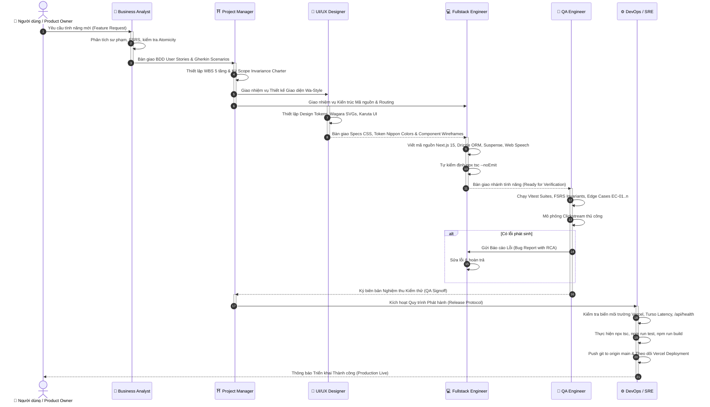

# 👥 TÀI LIỆU 10: CẨM NANG PHỐI HỢP ĐA VAI TRÒ (MULTI-ROLE AGENT COLLABORATION PLAYBOOK)
## Dự án: Japanese SRS System (FSRS Cognitive Spaced Repetition)
## Cấp độ: Master Engineering Lifecycle & Role Interaction Standard
## Phiên bản: 2.0.0 (Enterprise Multi-Agent Edition)

---

> [!IMPORTANT]
> Tài liệu này chuẩn hóa toàn bộ quy trình cộng tác giữa **6 Vai trò Kỹ thuật Phần mềm Chuyên biệt (Roles)** trong hệ sinh thái Japanese SRS System:
> 1. **Business Analyst (BA)**: Chuyên gia Phân tích Nghiệp vụ & Sư phạm Tiếng Nhật
> 2. **Project Manager (PM)**: Quản lý Dự án & Điều phối viên Sprint Phân tầng
> 3. **UI/UX Designer**: Kiến trúc sư Thiết kế Trải nghiệm & Mỹ học Wa-Style
> 4. **Fullstack Software Engineer (Dev)**: Kỹ sư Phần mềm Next.js 15, Drizzle & FSRS
> 5. **Quality Assurance (QA / Tester)**: Kỹ sư Đảm bảo Chất lượng & Kiểm thử Tự động
> 6. **DevOps & Site Reliability Engineer (SRE)**: Kỹ sư Vận hành Đám mây Vercel & Turso

---

## 1. MA TRẬN VAI TRÒ & VỊ TRÍ LƯU TRỮ SKILL (ROLE REPOSITORY MATRIX)

| Role | Mã định danh Skill | Đường dẫn SKILL.md | Trách nhiệm then chốt |
| :--- | :--- | :--- | :--- |
| **BA** | `japanese-srs-business-analyst` | [`.agents/skills/japanese-srs-business-analyst/SKILL.md`](file:///D:/project/japanese-srs-system/.agents/skills/japanese-srs-business-analyst/SKILL.md) | Chuyển hóa mục tiêu sư phạm Nhật ngữ (JLPT N5-N1, Joyo Kanji, Krashen $i+1$) thành BDD/Gherkin User Stories; bảo đảm nguyên tắc Thông tin Tối thiểu (Atomicity). |
| **PM** | `japanese-srs-project-manager` | [`.agents/skills/japanese-srs-project-manager/SKILL.md`](file:///D:/project/japanese-srs-system/.agents/skills/japanese-srs-project-manager/SKILL.md) | Lập cấu trúc phân rã công việc (WBS) 5 tầng; kiểm soát ranh giới phạm vi (Scope Invariance); thực thi Zero-Backend-Regression; chốt cổng phát hành (Release Gate). |
| **Designer**| `japanese-srs-uiux-designer` | [`.agents/skills/japanese-srs-uiux-designer/SKILL.md`](file:///D:/project/japanese-srs-system/.agents/skills/japanese-srs-uiux-designer/SKILL.md) | Thẩm mỹ Wa-Style truyền thống (Wabi-Sabi, Ma, Kanso); bảng màu Nippon Colors; họa tiết Wagara thuần Vector SVG; chuyển động Karuta 3D và Daruma 60 FPS. |
| **Dev** | `japanese-srs-fullstack-engineer`| [`.agents/skills/japanese-srs-fullstack-engineer/SKILL.md`](file:///D:/project/japanese-srs-system/.agents/skills/japanese-srs-fullstack-engineer/SKILL.md) | Lập trình Next.js 15 App Router; bọc Suspense cho searchParams; tối ưu hóa Turso HTTPS REST cho Vercel Serverless; tích hợp FSRS engine và Web Speech API. |
| **QA** | `japanese-srs-qa-engineer` | [`.agents/skills/japanese-srs-qa-engineer/SKILL.md`](file:///D:/project/japanese-srs-system/.agents/skills/japanese-srs-qa-engineer/SKILL.md) | Kiểm chứng bất biến toán học FSRS (Monotonicity, Lapse Bounds); viết test suite Vitest; mô phỏng kịch bản clickstream người dùng; kiểm thử tình huống biên (Edge Cases). |
| **DevOps** | `japanese-srs-devops-sre` | [`.agents/skills/japanese-srs-devops-sre/SKILL.md`](file:///D:/project/japanese-srs-system/.agents/skills/japanese-srs-devops-sre/SKILL.md) | Cấu hình biến môi trường Vercel; đồng bộ dữ liệu Turso Cloud (`sync-turso.ts`); giám sát đường truyền `/api/health`; xử lý timeout và EROFS serverless. |

---

## 2. VÒNG ĐỜI PHỐI HỢP ĐA VAI TRÒ (END-TO-END COLLABORATION LIFECYCLE)

---

## 3. GIAO THỨC BÀN GIAO CHI TIẾT GIỮA CÁC VAI TRÒ (HANDOFF PROTOCOLS)

### Giao thức 1: BA $\rightarrow$ PM (Definition of Ready Handoff)
- **Tài liệu bàn giao**: File PRD / User Story theo chuẩn Gherkin.
- **Tiêu chí nghiệm thu bàn giao (Checklist)**:
  - [ ] Có đầy đủ 3 kịch bản Gherkin: Happy Path, Edge Case, và Network Failure.
  - [ ] Đã xác nhận không vi phạm nguyên tắc Thông tin tối thiểu (Atomicity).
  - [ ] Đã chỉ rõ định dạng trọng âm Tokyo Pitch Accent và phiên âm Furigana.

### Giao thức 2: PM $\rightarrow$ Designer & Dev (Sprint Kickoff Handoff)
- **Tài liệu bàn giao**: Kế hoạch phân tầng WBS (Level 1 $\rightarrow$ Level 5) kèm Scope Charter.
- **Tiêu chí nghiệm thu bàn giao (Checklist)**:
  - [ ] Scope được đóng khung rõ ràng: Danh sách In-Scope và Out-of-Scope (Non-Goals).
  - [ ] Khẳng định ranh giới Zero-Backend-Regression: Schema DB và API contracts giữ nguyên.
  - [ ] Chia nhỏ từng task đến mức micro-task nguyên tử (file nào, hàm nào, prop nào).

### Giao thức 3: Designer $\rightarrow$ Dev (Design Specs Handoff)
- **Tài liệu bàn giao**: Mã CSS Data URI họa tiết Wagara, bảng màu biến CSS, keyframe animations.
- **Tiêu chí nghiệm thu bàn giao (Checklist)**:
  - [ ] 100% họa tiết là Vector Data URI (không dùng ảnh PNG/JPG nặng nề).
  - [ ] Phông chữ chỉ định đúng: `Shippori Mincho` cho Hán tự, `Zen Maru Gothic` cho điều hướng.
  - [ ] Đảm bảo độ tương phản chữ đạt chuẩn WCAG 2.1 AA.

### Giao thức 4: Dev $\rightarrow$ QA (Feature Ready for Test)
- **Tài liệu bàn giao**: Mã nguồn sạch, types rõ ràng, vượt qua `npx tsc --noEmit`.
- **Tiêu chí nghiệm thu bàn giao (Checklist)**:
  - [ ] Component dùng `useSearchParams()` đã được bọc an toàn trong `<Suspense>`.
  - [ ] URL Turso trong `src/db/client.ts` được chuẩn hóa HTTPS.
  - [ ] Không có `any` thoát kiểu trong TypeScript.

### Giao thức 5: QA $\rightarrow$ PM (Quality Signoff)
- **Tài liệu bàn giao**: Báo cáo kết quả chạy `npm run test` (Vitest), bảng kết quả 12 Test Cases.
- **Tiêu chí nghiệm thu bàn giao (Checklist)**:
  - [ ] 100% bài kiểm tra Vitest vượt qua.
  - [ ] Các bất biến toán học của FSRS được bảo toàn.
  - [ ] Toàn bộ tình huống biên (EC-01 đến EC-06) đã được thẩm định.

### Giao thức 6: PM $\rightarrow$ DevOps (Production Release Deployment)
- **Tài liệu bàn giao**: Commit sạch trên git, sẵn sàng cho production build.
- **Tiêu chí nghiệm thu bàn giao (Checklist)**:
  - [ ] `npm run build` kết thúc với exit code 0.
  - [ ] Endpoint `/api/health` phản hồi `status: "healthy"` với độ trễ Turso $< 50\text{ms}$.
  - [ ] Vercel Dashboard đã nạp đủ các biến môi trường Production.

---

## 4. QUY TẮC CHUYỂN ĐỔI VAI TRÒ DÀNH CHO AGENT ĐỘC LẬP (SOLO AGENT MULTI-ROLE MODES)

Khi một AI Agent hoạt động độc lập (pair-programming với người dùng), Agent cần tự giác **luân chuyển tâm thế và bộ kỹ năng (Mental Modes)** theo thứ tự:

1. **Khi tiếp nhận yêu cầu mới**: Kích hoạt kỹ năng **`japanese-srs-business-analyst`** để chất vấn và làm rõ yêu cầu, viết User Story Gherkin.
2. **Trước khi chạm vào code**: Kích hoạt kỹ năng **`japanese-srs-project-manager`** để thiết lập WBS phân tầng, xác định ranh giới Scope và cấm kỵ.
3. **Khi thiết kế giao diện**: Kích hoạt kỹ năng **`japanese-srs-uiux-designer`** để lựa chọn token Nippon Colors và họa tiết Wagara.
4. **Khi gõ mã nguồn**: Kích hoạt kỹ năng **`japanese-srs-fullstack-engineer`** để viết code TypeScript sạch sẽ, bọc Suspense, query Drizzle.
5. **Sau khi viết code**: Kích hoạt kỹ năng **`japanese-srs-qa-engineer`** để chạy `npx tsc --noEmit`, `npm run test` và rà soát tình huống biên.
6. **Trước khi bàn giao kết quả**: Kích hoạt kỹ năng **`japanese-srs-devops-sre`** để chạy `npm run build`, push git và đối soát sức khỏe deployment.
