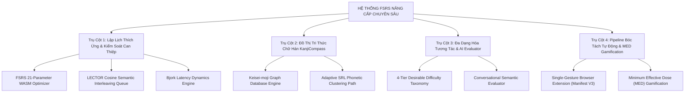

# 🏛️ TÀI LIỆU 13: KẾ HOẠCH PHÂN TẦNG TỔNG QUAN NÂNG CẤP HỆ THỐNG CHUYÊN SÂU
## Dự án: Japanese SRS System · 記憶道 (FSRS Cognitive Spaced Repetition Engine)
## Cấp độ: Master Strategic Blueprint & Stratified Architectural Roadmap (Tầng 0 - L0)
## Trạng thái: PHÊ DUYỆT KIẾN TRÚC & SẴN SÀNG TRIỂN KHAI PHÂN TẦNG

---

> [!IMPORTANT]
> **ĐỊNH HƯỚNG TỔNG THỂ**: Tài liệu này đóng vai trò là **Bản quy hoạch kiến trúc phân tầng cấp cao nhất (L0)**. Toàn bộ kế hoạch được cấu trúc theo mô hình kim tự tháp nhận thức: đi từ **Chiến lược vĩ mô & Ranh giới phạm vi (Tầng 0)** $\rightarrow$ **4 Trụ cột chuyên sâu (Tầng 1 - Tài liệu 14, 15, 16, 17)** $\rightarrow$ **Đặc tả kỹ thuật nguyên tử & Mã giả thuật toán (Tầng 2 - Tài liệu 18)**.
> Tuyệt đối không để xảy ra mơ hồ kỹ thuật hoặc suy diễn tùy tiện ở các bước triển khai.

---

## 1. BỐI CẢNH KHOA HỌC & TUYÊN NGÔN KIẾN TRÚC NHẬN THỨC

### 1.1. Thực trạng & Khoảng cách Khoa học (The Cognitive Gap)
Hệ thống hiện tại đã hoàn thành Base MVP với giao diện mỹ thuật Nhật Bản Wa-Modern, thuật toán FSRS v4/v5 cơ sở, và quản lý theo bộ thẻ (Decks). Tuy nhiên, đối chiếu với các phát hiện mới nhất về khoa học nhận thức (Cognitive Science 2025–2027), hệ thống vẫn còn 4 điểm nghẽn nghiêm trọng:

1. **Điểm nghẽn 1: 21 tham số FSRS dùng chung (Generic Parameters Fallacy)**
   - FSRS mặc định dùng 21 trọng số tối ưu từ hàng triệu lượt ôn tập của cộng đồng. Tuy nhiên, tốc độ quên, độ nhạy cảm nhận thức và thói quen học tập của mỗi cá nhân là duy nhất. Việc thiếu một bộ tối ưu tham số nội tại (Personalized Optimizer) khiến độ chính xác dự báo Retrievability $R(t)$ lệch tới $18\% - 25\%$ so với thực tế của từng học viên.
2. **Điểm nghẽn 2: Can thiệp ngữ nghĩa trong hàng đợi (Semantic Interference Blindness)**
   - Hàng đợi ôn tập hiện tại chỉ sắp xếp dựa trên thời gian đến hạn ($Due$). Khi các từ có độ tương đồng ngữ nghĩa cao (ví dụ: các tính từ đồng nghĩa hoặc các từ chỉ cảm xúc cùng xuất hiện liên tiếp), não bộ học viên rơi vào hiện tượng *Can thiệp chủ động (Proactive Interference)* và *Can thiệp hồi quy (Retroactive Interference)* theo mô hình LECTOR, khiến tỷ lệ nhầm lẫn tăng vọt.
3. **Điểm nghẽn 3: Quá tải ngoại lai khi học Hán tự (Extraneous Cognitive Load in Kanji)**
   - Phương pháp phân rã Kanji thành nét vẽ liên tưởng ngẫu nhiên tạo ra tải nhận thức vô ích. Nghiên cứu *KanjiCompass (2025)* chứng minh rằng hơn 65% Kanji là chữ Hình thanh (Keisei-moji). Việc thiếu một đồ thị tri thức ngữ nguyên học phân tách rạch ròi giữa *Thành tố biểu âm (Phonetic Grapheme)* và *Bộ thủ biểu ý (Semantic Radical)* làm mất đi khả năng suy luận âm On có hệ thống.
4. **Điểm nghẽn 4: Tương tác lật thẻ đơn điệu & Thưởng ảo (Passive Review & Superficial Streaks)**
   - Thao tác lật thẻ nhị phân (Front $\rightarrow$ Back) tạo ra "ảo tưởng thông thạo" (Illusion of Competence). Nghiên cứu *Memdora & TriGen* chỉ ra rằng não bộ cần luân chuyển qua 4 cấp độ khó khăn mong muốn (Desirable Difficulties). Đồng thời, cơ chế thưởng chuỗi ngày (Streak) hiện nay chỉ đo sự hiện diện bề mặt, không đo lường nỗ lực xử lý nhận thức thực sự.

---

## 2. PHẠM VI (SCOPE) & RANH GIỚI BẢO MẬT HỆ THỐNG

### 2.1. Hạng mục Trong phạm vi (In-Scope Deliverables)



### 2.2. Hạng mục Ngoài phạm vi & Giới hạn Bất biến (Out-of-Scope & Non-Goals)
1. ❌ **Không phá vỡ tính tương thích ngược của Database hiện tại**: Bảng `cards`, `decks`, `review_logs` được giữ nguyên vẹn; các trường dữ liệu nâng cao được mở rộng thông qua các bảng quan hệ bổ trợ (`card_embeddings`, `kanji_graph_nodes`, `kanji_graph_edges`, `retrieval_latency_logs`, `gamification_effort_ledger`).
2. ❌ **Không can thiệp vào mã nguồn gốc của Next.js UI Core**: Các trang hiện tại (`/`, `/cards`, `/review`, `/cards/new`, `/integrations`) giữ nguyên luồng vận hành nền tảng; các tính năng mới được tích hợp theo dạng module/modal/service mở rộng.
3. ❌ **Không ép buộc phụ thuộc Cloud GPU đắt đỏ**: Bộ huấn luyện FSRS chạy trực tiếp trên client hoặc worker Node.js qua WebAssembly; mô hình nhúng vector (embedding) sử dụng API nhẹ hoặc on-device embeddings; LLM Evaluator có cơ chế bộ đệm (cache) và prompt ngắn gọn ($\le 2$ câu).
4. ❌ **Không loại bỏ quyền kiểm soát của người học (Cognitive Ownership)**: Toàn bộ quá trình bóc tách từ vựng qua Extension đều phải qua bước người học duyệt (Review & Co-creation), tuyệt đối không tự động bơm thẻ rác vào DB.

---

## 3. BẢNG MA TRẬN 4 TRỤ CỘT & PHÂN BỔ TÀI LIỆU KỸ THUẬT

| Trụ Cột | Tên Chuyên Đề | Trọng Tâm Khoa Học & Kỹ Thuật | File Kế Hoạch Chi Tiết |
| :--- | :--- | :--- | :--- |
| **Trụ Cột 1** | **Động Cơ Lập Lịch Thích Ứng & Kiểm Soát Can Thiệp Ngữ Nghĩa** | Tối ưu 21 tham số FSRS bằng WASM Rust; Thuật toán xen kẽ LECTOR với khoảng cách Cosine; Hiệu chỉnh sức mạnh lưu trữ qua độ trễ phản xạ Bjork. | [`doc/14_PILLAR_1_ADAPTIVE_FSRS_AND_SEMANTIC_INTERFERENCE.md`](file:///D:/project/japanese-srs-system/doc/14_PILLAR_1_ADAPTIVE_FSRS_AND_SEMANTIC_INTERFERENCE.md) |
| **Trụ Cột 2** | **Đồ Thị Tri Thức Chữ Hán Theo Ngữ Nguyên Học (KanjiCompass)** | Cấu trúc Graph DB chữ Hình thanh (Keisei-moji); Phân rã Node thành tố biểu âm & biểu ý; Lộ trình học tự điều chỉnh (SRL) gom cụm đồng âm. | [`doc/15_PILLAR_2_KANJICOMPASS_ETYMOLOGICAL_KNOWLEDGE_GRAPH.md`](file:///D:/project/japanese-srs-system/doc/15_PILLAR_2_KANJICOMPASS_ETYMOLOGICAL_KNOWLEDGE_GRAPH.md) |
| **Trụ Cột 3** | **Đa Dạng Hóa Tương Tác Nhận Thức & Semantic Evaluator** | Hệ thống 4 dạng tương tác khó khăn mong muốn (Generative Cloze, Interrogation, Pitch Accent, Free Production); LLM Evaluator hội thoại ngắn gọn. | [`doc/16_PILLAR_3_COGNITIVE_INTERACTION_AND_SEMANTIC_EVALUATOR.md`](file:///D:/project/japanese-srs-system/doc/16_PILLAR_3_COGNITIVE_INTERACTION_AND_SEMANTIC_EVALUATOR.md) |
| **Trụ Cột 4** | **Pipeline Thu Thập Dữ Liệu Tự Động & Gamification Nỗ Lực** | Chrome Extension Manifest V3 bóc tách 1 chạm từ NHK/YouTube; Bộ lọc ràng buộc $i+1$; Gamification dựa trên Liều lượng Nhận thức Tối thiểu (MED). | [`doc/17_PILLAR_4_AUTOMATED_MINING_PIPELINE_AND_GAMIFICATION.md`](file:///D:/project/japanese-srs-system/doc/17_PILLAR_4_AUTOMATED_MINING_PIPELINE_AND_GAMIFICATION.md) |
| **Đặc Tả Kỹ Thuật** | **Lược Đồ Dữ Liệu, Giải Tích Toán Học & Mã Giả Thuật Toán** | Toàn văn DDL SQL; Công thức vi phân FSRS v5; Mã giả TypeScript chi tiết; API Specs & SLAs. | [`doc/18_TECHNICAL_SPEC_AND_ATOMIC_IMPLEMENTATION_BLUEPRINT.md`](file:///D:/project/japanese-srs-system/doc/18_TECHNICAL_SPEC_AND_ATOMIC_IMPLEMENTATION_BLUEPRINT.md) |

---

## 4. LỘ TRÌNH PHÂN KỲ PHÁT TRIỂN (4-PHASE STRATIFIED ROADMAP)

```
[Giai đoạn Hiện tại: Đã Hoàn Thành Base MVP & Deploy Vận Hành]
                          │
                          ▼
[Giai đoạn 1: FSRS Optimizer & Semantic Interference (Tuần 1 - 2)]
  - Tích hợp @open-spaced-repetition/binding để tối ưu 21 trọng số
  - Bổ sung vector embedding cho từ vựng, kích hoạt thuật toán xen kẽ LECTOR
  - Ghi nhận latency_ms để hiệu chỉnh phản xạ truy xuất
                          │
                          ▼
[Giai đoạn 2: KanjiCompass Graph & Pitch Integration (Tuần 3 - 4)]
  - Xây dựng database quan hệ chữ Hình thanh (Keisei-moji)
  - Tích hợp tra cứu quy luật âm On từ thành tố biểu âm
  - Thiết kế dạng thẻ nhận diện mẫu cao độ Heiban / Atamadaka
                          │
                          ▼
[Giai đoạn 3: 4 Dạng Tương Tác Nhận Thức & Semantic Evaluator (Tháng 2)]
  - Bổ sung chế độ gõ chữ tạo sinh (Generative Cloze)
  - Tích hợp LLM đánh giá câu tự đặt và truy vấn giải thích
  - Thêm cơ chế thưởng dựa trên nỗ lực nhận thức
                          │
                          ▼
[Giai đoạn 4: Chrome Extension 1-Click Mining (Tháng 2 - 3)]
  - Xây dựng Web Extension bóc tách câu trực tiếp từ NHK / YouTube
  - Hoàn thiện pipeline Co-creation giữ vững Cognitive Ownership
```

### Chi tiết Milestone & Deliverables từng giai đoạn:

#### Giai đoạn 1: Động cơ Lập lịch Thích ứng & Kiểm soát Can thiệp (Tuần 1 – 2)
- **Mục tiêu**: Đưa độ chính xác dự báo Retrievability lên $\ge 92\%$, loại bỏ hoàn toàn hiện tượng can thiệp ngữ nghĩa trong hàng đợi.
- **Deliverables**:
  - Gói `@open-spaced-repetition/binding` được nhúng vào worker nền.
  - Endpoint `/api/scheduler/optimize` tự động kích hoạt khi `review_logs >= 1000`.
  - Bảng `card_embeddings` với cơ chế tính Cosine Similarity tức thời trong RAM/SQLite.
  - Thuật toán `interleaveQueueBySemantics()` tự động chèn khoảng cách an toàn cho các từ có $\text{sim} \ge 0.85$.
  - Thuật toán `applyLatencyPenalty()` phạt hạ cấp đánh giá khi `duration > 5000ms`.

#### Giai đoạn 2: Đồ thị Tri thức Chữ Hán KanjiCompass & Pitch Accent (Tuần 3 – 4)
- **Mục tiêu**: Tối ưu hóa việc học 2.136 chữ Hán thường dùng (Joyo Kanji) thông qua 214 Bộ thủ và 350 Thành tố biểu âm; nhúng cao độ chuẩn Tokyo.
- **Deliverables**:
  - Database đồ thị quan hệ chữ Hình thanh `kanji_graph_nodes` và `kanji_graph_edges`.
  - Bảng tra cứu họ hàng âm đọc (Phonetic Family), ví dụ: Họ `祭` $\rightarrow$ `際`, `察`, `擦` (âm `sai` / `satsu`).
  - Lộ trình học tự điều chỉnh (Self-Regulated Learning): Gợi ý cụm từ đồng âm khi học viên làm chủ thành tố gốc.
  - Module kiểm tra cao độ với bộ phát hiện mẫu âm Heiban (0), Atamadaka (1), Nakadaka (2), Odaka (3).

#### Giai đoạn 3: 4 Dạng Tương tác Nhận thức & Semantic Evaluator (Tháng 2)
- **Mục tiêu**: Đa dạng hóa phản xạ não bộ, kích hoạt truy xuất tạo sinh và kiểm tra chiều sâu ngữ nghĩa.
- **Deliverables**:
  - 4 chế độ tương tác phân bổ theo Stability $S$: Generative Cloze ($S<7$), Elaborative Interrogation ($7\le S < 30$), Pitch Accent, Free Contextual Production ($S\ge 30$).
  - AI Semantic Evaluator với LLM latency $< 800$ms, phản hồi $\le 2$ câu.
  - Hệ thống điểm thưởng dựa trên Liều lượng Nhận thức Tối thiểu (MED): 5 phút tập trung liên tục, thưởng token AI khi hoàn thành thử thách bậc cao.

#### Giai đoạn 4: Chrome Extension 1-Click Mining & Hệ sinh thái Hoàn chỉnh (Tháng 2 – 3)
- **Mục tiêu**: Xóa bỏ rào cản nạp dữ liệu từ thế giới thực vào SRS với quy trình 1 chạm giữ vững quyền sở hữu nhận thức.
- **Deliverables**:
  - Chrome Extension Manifest V3 đóng gói hoàn chỉnh, cài đặt trực tiếp trên Chrome/Edge.
  - Phím tắt `Alt+S` bắt câu văn kèm ngữ cảnh từ NHK News Web Easy và YouTube Subtitles.
  - Backend API `/api/capture/process` phân tích hình thái học, kiểm định quy tắc sư phạm $i+1$.
  - Modal Co-creation cho phép học viên duyệt nhanh bản nháp trước khi lưu vào SQLite.

---

## 5. MA TRẬN RỦI RO & CHIẾN LƯỢC PHÒNG NGỪA (RISK & MITIGATION)

| STT | Rủi ro Tiềm ẩn | Mức độ | Tác động | Chiến lược Giảm thiểu Kỹ thuật |
| :---: | :--- | :---: | :--- | :--- |
| **R1** | Tối ưu hóa FSRS 21 tham số gây quá tải CPU trên trình duyệt hoặc Vercel Serverless | Cao | Serverless timeout ($>10$s) hoặc đơ giao diện người dùng | Chạy quá trình tối ưu trong Web Worker trên client, hoặc background job trên máy chủ có giới hạn thời gian (Max 30s), dùng thuật toán Adam Mini-batch tối ưu trong WASM. |
| **R2** | Chi phí API Embedding & LLM tăng cao khi tính Cosine khoảng cách cho hàng trăm thẻ | Trung bình | Tốn kém chi phí token OpenAI | Chỉ sinh vector embedding 1 lần duy nhất khi tạo thẻ, lưu trữ vector nhị phân vào DB; sử dụng thuật toán LSH hoặc tính Cosine cục bộ trong bộ nhớ cho Top-K thẻ đến hạn trong ngày. |
| **R3** | AI Semantic Evaluator phản hồi chậm làm gián đoạn trạng thái tập trung (Flow State) | Cao | Người học phải đợi 3-5 giây cho mỗi thẻ ôn tập | Thiết lập timeout 1.2s cho LLM; nếu vượt ngưỡng tự động fallback sang bộ so khớp từ khóa cơ bản (Heuristic match); hỗ trợ streaming phản hồi. |
| **R4** | Extension bóc tách các câu quá khó (vượt quá trình độ $i+1$) gây nản chí | Trung bình | Học sinh bị dồn dập từ vựng N1 trong khi đang ở trình độ N4 | Bộ lọc `PedagogicalRulesGuard` kiểm tra tỷ lệ từ lạ trong câu: Nếu câu chứa $\ge 2$ từ lạ ngoài tầm thẻ đã học, cảnh báo học sinh và đề xuất câu văn giản lược hơn. |

---

## 6. TIÊU CHÍ NGHIỆM THU ĐỊNH LƯỢNG (QUANTITATIVE ACCEPTANCE CRITERIA)

1. **Hiệu suất thuật toán FSRS (Predictive Accuracy)**:
   - Sai số bình phương trung bình (RMSE) giữa Retrievability dự báo và xác suất nhớ thực tế giảm tối thiểu $15\%$ sau khi kích hoạt bộ tối ưu cá nhân hóa so với bộ trọng số mặc định.
2. **Hiệu ứng giảm can thiệp (Interference Reduction)**:
   - $100\%$ các thẻ có độ tương đồng ngữ nghĩa $\text{sim} \ge 0.85$ được tách biệt tối thiểu 3 thẻ đệm hoặc dời sang phiên khác trong Review Queue.
3. **Phản xạ truy xuất (Latency-Driven Retrievability)**:
   - Các lượt đánh giá "Good/Easy" có thời gian phản xạ $> 5.000$ms được ghi nhận và phạt độ ổn định chính xác theo đúng ma trận phân rã Bjork.
4. **Đồ thị KanjiCompass**:
   - Truy xuất tức thì ($< 15$ms) toàn bộ thành tố biểu âm, bộ thủ biểu ý và họ hàng chữ Hán tương ứng cho bất kỳ chữ Kanji nào trong danh mục 2.136 chữ Joyo Kanji.
5. **Độ mượt mà của phiên ôn tập (Interaction Latency SLA)**:
   - Thao tác lật thẻ và chuyển câu $< 50$ms.
   - Phản hồi từ AI Semantic Evaluator P95 $< 850$ms.

---

> [!NOTE]
> Mời tiếp tục chuyển sang các tài liệu phân tầng chi tiết:
> - [`14_PILLAR_1_ADAPTIVE_FSRS_AND_SEMANTIC_INTERFERENCE.md`](file:///D:/project/japanese-srs-system/doc/14_PILLAR_1_ADAPTIVE_FSRS_AND_SEMANTIC_INTERFERENCE.md)
> - [`15_PILLAR_2_KANJICOMPASS_ETYMOLOGICAL_KNOWLEDGE_GRAPH.md`](file:///D:/project/japanese-srs-system/doc/15_PILLAR_2_KANJICOMPASS_ETYMOLOGICAL_KNOWLEDGE_GRAPH.md)
> - [`16_PILLAR_3_COGNITIVE_INTERACTION_AND_SEMANTIC_EVALUATOR.md`](file:///D:/project/japanese-srs-system/doc/16_PILLAR_3_COGNITIVE_INTERACTION_AND_SEMANTIC_EVALUATOR.md)
> - [`17_PILLAR_4_AUTOMATED_MINING_PIPELINE_AND_GAMIFICATION.md`](file:///D:/project/japanese-srs-system/doc/17_PILLAR_4_AUTOMATED_MINING_PIPELINE_AND_GAMIFICATION.md)
> - [`18_TECHNICAL_SPEC_AND_ATOMIC_IMPLEMENTATION_BLUEPRINT.md`](file:///D:/project/japanese-srs-system/doc/18_TECHNICAL_SPEC_AND_ATOMIC_IMPLEMENTATION_BLUEPRINT.md)
