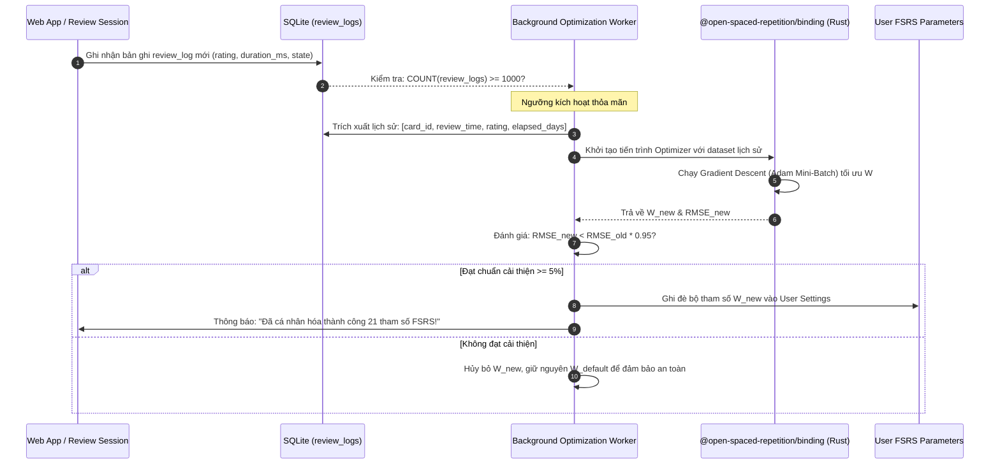
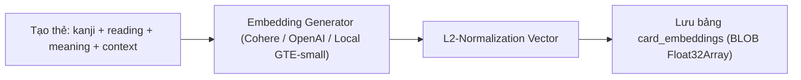
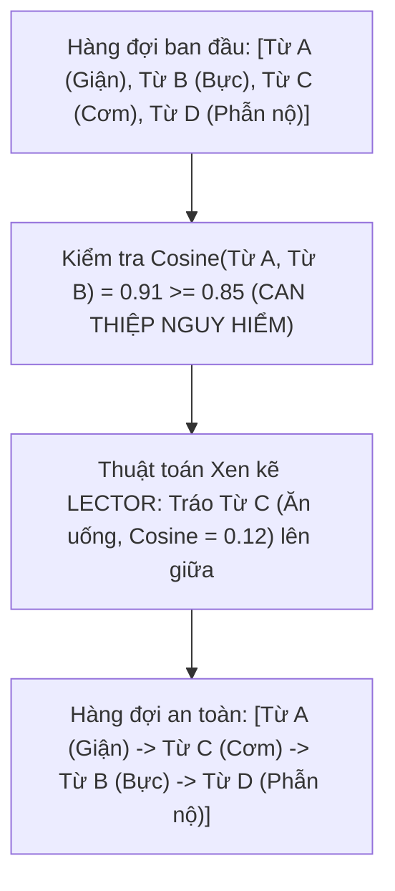

# 🧠 TÀI LIỆU 14: TRỤ CỘT 1 — ĐỘNG CƠ LẬP LỊCH THÍCH ỨNG & KIỂM SOÁT CAN THIỆP NGỮ NGHĨA
## Dự án: Japanese SRS System · 記憶道 (FSRS Cognitive Spaced Repetition Engine)
## Cấp độ: Module Engineering & Algorithmic Blueprint (Tầng 1 - L1)
## Trọng tâm: Tối ưu hóa 21 tham số FSRS, Thuật toán LECTOR & Động học Độ trễ Bjork

---

> [!IMPORTANT]
> Tài liệu này mô tả chi tiết tầng giải thuật, công thức toán học vi phân, lược đồ dữ liệu và quy trình thực thi mã nguồn cho **Trụ Cột 1**. Toàn bộ logic được thiết kế để giải quyết triệt để 3 vấn đề: (1) Cá nhân hóa tuyệt đối tham số suy thoái trí nhớ; (2) Chống nhiễu loạn ngữ nghĩa trong hàng đợi ôn tập; (3) Khách quan hóa đánh giá thông qua độ trễ phản xạ não bộ.

---

## 1. HUẤN LUYỆN TỰ ĐỘNG 21 THAM SỐ CÁ NHÂN HÓA (FSRS 21-PARAMETER OPTIMIZER)

### 1.1. Cơ sở Khoa học & Nền tảng Giải tích
Thuật toán FSRS v4/v5 mô hình hóa trí nhớ con người dựa trên ba biến trạng thái $D$ (Difficulty - Độ khó), $S$ (Stability - Độ ổn định), và $R$ (Retrievability - Xác suất truy xuất thành công):

$$R(t, S) = \left(1 + \text{FACTOR} \cdot \frac{t}{S}\right)^{-w}$$

Trong đó, $\text{FACTOR} = \frac{19}{81}$ (với ngưỡng retention mục tiêu $0.9$), $t$ là số ngày kể từ lần ôn tập trước, và $S$ là độ ổn định (tính theo ngày).

Bộ 21 trọng số $W = (w_0, w_1, \dots, w_{20})$ quy định toàn bộ động học biến đổi trạng thái:
- $w_0, w_1, w_2, w_3$: Khởi tạo độ ổn định ban đầu cho 4 mức đánh giá (Again, Hard, Good, Easy).
- $w_4, w_5$: Khởi tạo độ khó ban đầu $D_0$ và mức độ hội tụ về giá trị trung bình.
- $w_6, w_7$: Hệ số điều chỉnh độ khó sau mỗi lần đánh giá $\Delta D$.
- $w_8, w_9, w_{10}$: Hệ số tăng trưởng độ ổn định $S'_r$ khi Recall thành công (Good/Easy):
  $$S'_r(D, S, R, G) = S \cdot \left(e^{w_8} \cdot (11 - D) \cdot S^{-w_9} \cdot (e^{w_{10} \cdot (1-R)} - 1) \cdot \text{Bonus}(G) + 1\right)$$
- $w_{11}, w_{12}, w_{13}, w_{14}$: Hệ số suy giảm độ ổn định $S'_f$ khi Quên (Forget/Again):
  $$S'_f(D, S, R) = w_{11} \cdot D^{-w_{12}} \cdot \left((S + 1)^{w_{13}} - 1\right) \cdot e^{w_{14} \cdot (1-R)}$$
- $w_{15} \dots w_{20}$: Trọng số phạt Hard, thưởng Easy và điều chỉnh phi tuyến bậc cao.

**Mục tiêu tối ưu hóa**: Tìm nghiệm $W^*$ cực tiểu hóa hàm mất mát nhị phân (Binary Cross-Entropy / Log-Loss) trên tập dữ liệu lịch sử $N$ bản ghi ôn tập thực tế của học viên:

$$\mathcal{L}(W) = -\frac{1}{N} \sum_{i=1}^N \left[ y_i \ln \hat{R}_i(W) + (1 - y_i) \ln (1 - \hat{R}_i(W)) \right] + \lambda \|W - W_{\text{default}}\|_2^2$$

Trong đó $y_i \in \{0, 1\}$ ($y_i=0$ nếu Again, $y_i=1$ nếu Hard/Good/Easy), $\hat{R}_i(W)$ là xác suất truy xuất dự báo của mô hình với bộ tham số $W$, và số hạng cuối là chuẩn $L_2$ chính quy hóa (Regularization) để ngăn chặn hiện tượng quá khớp (Overfitting) khi số mẫu chưa đủ lớn.

---

### 1.2. Kiến trúc Kỹ thuật & Tích hợp WebAssembly (Rust)
Để quá trình huấn luyện diễn ra tức thời mà không gây nghẽn Event Loop của Node.js hoặc trình duyệt, hệ thống tích hợp gói WebAssembly/Rust `@open-spaced-repetition/binding`.



### 1.3. Lược đồ Dữ liệu Lưu trữ Tham số Tối ưu
Bổ sung bảng `user_fsrs_parameters` vào SQLite:

```sql
CREATE TABLE IF NOT EXISTS user_fsrs_parameters (
    id TEXT PRIMARY KEY,
    user_id TEXT NOT NULL DEFAULT 'default_user',
    w_parameters TEXT NOT NULL, -- Mảng JSON 21 phần tử: [w0, w1, ..., w20]
    sample_size INTEGER NOT NULL, -- Số lượng log dùng để huấn luyện
    rmse REAL NOT NULL, -- Sai số bình phương trung bình sau tối ưu
    log_loss REAL NOT NULL, -- Giá trị Binary Cross-Entropy
    optimized_at DATETIME NOT NULL DEFAULT CURRENT_TIMESTAMP,
    is_active INTEGER NOT NULL DEFAULT 1 -- 1 nếu đang sử dụng, 0 nếu là backup
);

CREATE INDEX IF NOT EXISTS idx_user_fsrs_active ON user_fsrs_parameters(user_id, is_active);
```

---

## 2. KIỂM SOÁT CAN THIỆP NGỮ NGHĨA DỰA TRÊN MÔ HÌNH LECTOR

### 2.1. Cơ sở Tâm lý Nhận thức (Cognitive Interference Theory)
Nghiên cứu về kiến trúc **LECTOR** chứng minh hiện tượng suy giảm trí nhớ do can thiệp ngữ nghĩa:
1. **Can thiệp chủ động (Proactive Interference - PI)**: Khi học viên vừa ôn từ `怒る` (ikaru - tức giận), ngay lập tức xuất hiện từ `憤る` (ikidooru - phẫn nộ). Dấu vết ký ức mạnh vừa kích hoạt của `怒る` sẽ lấn át và gây nhiễu loạn quá trình truy xuất từ `憤る`.
2. **Can thiệp hồi quy (Retroactive Interference - RI)**: Việc học dồn dập các cặp từ đồng nghĩa mới sẽ quay ngược lại làm mờ dấu vết ký ức của các từ đã học trước đó vài phút.
3. **Thực hành xen kẽ (Interleaved Practice)**: Bằng cách chèn các thẻ thuộc trường nghĩa hoàn toàn khác nhau (ví dụ: Từ vựng Cảm xúc $\rightarrow$ Thuật ngữ Công nghệ $\rightarrow$ Động từ Di chuyển), các cụm neuron đại diện cho các mạng ngữ nghĩa khác nhau có thời gian củng cố tĩnh (Synaptic Consolidation) mà không bị xung đột tài nguyên nhận thức.

---

### 2.2. Pipeline Sinh Véc-tơ Ngữ Nghĩa (Semantic Embeddings)
Khi một thẻ từ vựng mới được khởi tạo hoặc nhập từ Google Sheets, hệ thống tự động sinh một vector nhúng ngữ nghĩa chiều cao (High-dimensional Semantic Embedding, ví dụ 384 chiều hoặc 1536 chiều):



Lược đồ cơ sở dữ liệu `card_embeddings`:

```sql
CREATE TABLE IF NOT EXISTS card_embeddings (
    card_id TEXT PRIMARY KEY,
    embedding_vector BLOB NOT NULL, -- Float32Array lưu dưới dạng nhị phân
    vector_dimension INTEGER NOT NULL DEFAULT 384,
    model_version TEXT NOT NULL DEFAULT 'text-embedding-3-small',
    generated_at DATETIME NOT NULL DEFAULT CURRENT_TIMESTAMP,
    FOREIGN KEY (card_id) REFERENCES cards(id) ON DELETE CASCADE
);
```

---

### 2.3. Thuật toán Lập Lịch Xen Kẽ LECTOR (Interleaving Review Queue)
Trong phiên ôn tập hàng ngày, thay vì chỉ sắp xếp theo thời gian đến hạn ($Due$), thuật toán sẽ duyệt qua danh sách ứng viên và tính độ tương đồng Cosine:

$$\text{CosineSim}(\vec{u}, \vec{v}) = \frac{\vec{u} \cdot \vec{v}}{\|\vec{u}\|_2 \|\vec{v}\|_2} = \frac{\sum_{i=1}^d u_i v_i}{\sqrt{\sum_{i=1}^d u_i^2} \sqrt{\sum_{i=1}^d v_i^2}}$$

**Quy tắc điều phối an toàn**:
- **Ngưỡng can thiệp**: $\text{CosineSim} \ge 0.85$.
- **Hành động**:
  - Nếu thẻ $C_k$ kế tiếp trong hàng đợi có độ tương đồng $\ge 0.85$ với thẻ $C_{k-1}$ hoặc $C_{k-2}$, thuật toán sẽ tìm trong danh sách thẻ đến hạn một thẻ $C_m$ có $\text{CosineSim} < 0.35$ (khác trường nghĩa) để tráo đổi vị trí lên trước.
  - Nếu toàn bộ các thẻ còn lại trong ngày đều có độ tương đồng cao (trường hợp học chuyên đề tập trung), thuật toán sẽ tách đôi danh sách và đẩy 50% số thẻ sang ca ôn tập phụ (Sub-session cách nhau tối thiểu 4 tiếng).



---

## 3. MÔ HÌNH HÓA ĐỘNG HỌC TRUY XUẤT DỰA TRÊN ĐỘ TRỄ (LATENCY DYNAMICS)

### 3.1. Khung Lý thuyết Robert & Elizabeth Bjork
Khung lý thuyết tâm lý học nhận thức phân định rạch ròi:
- **Sức mạnh Truy xuất (Retrieval Strength)**: Sự dễ dàng và trôi chảy khi gọi lại thông tin ở thời điểm hiện tại.
- **Sức mạnh Lưu trữ (Storage Strength)**: Độ bền bỉ, tính kháng quên của dấu vết ký ức theo thời gian.

**Vấn đề sai lệch chủ quan**:
Khi một học viên mất tới **7.5 giây** để nhớ ra một từ vựng nhưng sau đó vẫn bấm nút "Good" vì "rốt cuộc mình vẫn nhớ đúng", sự trôi chảy thực tế đã suy giảm trầm trọng. Nếu hệ thống tin vào đánh giá "Good" này, FSRS sẽ nhân đôi khoảng cách ôn tập, dẫn đến việc học viên chắc chắn sẽ quên ở lần ôn tập sau.

### 3.2. Thuật toán Phạt Độ Trễ (Latency Penalty Algorithm)
Ghi nhận chính xác trường `review_duration_ms`:
- Bắt đầu tính giờ ngay khi mặt trước của thẻ xuất hiện trên DOM.
- Dừng tính giờ khi người học bấm phím Space / nút "Xem đáp án".

**Ma trận Phạt Độ Trễ & Hiệu chỉnh Đánh giá**:

| Đánh giá Người học Chọn | Thời gian phản xạ (`duration_ms`) | Trạng thái Thực tế Ghi nhận | Hệ số Phạt Stability $\Delta S$ |
| :---: | :---: | :---: | :---: |
| **Easy** | $< 1.500$ ms | Easy | $1.0 \times$ (Không phạt) |
| **Easy** | $1.500 - 3.500$ ms | Good | $0.85 \times$ (Hạ xuống Good) |
| **Good** | $< 3.000$ ms | Good | $1.0 \times$ (Không phạt) |
| **Good** | $3.000 - 5.000$ ms | Good (Hesitant) | $0.80 \times$ (Giảm nhẹ tăng trưởng $S$) |
| **Good / Easy** | **$> 5.000$ ms** | **Hard (Latency Penalty)** | **$0.50 \times$ (Ép về Hard, rút ngắn khoảng cách)** |
| **Hard** | Bất kỳ | Hard | $1.0 \times$ |
| **Again** | Bất kỳ | Again | $1.0 \times$ |

### 3.3. Lược đồ Dữ liệu Lưu trữ Độ trễ Truy xuất
Bổ sung bảng `retrieval_latency_logs`:

```sql
CREATE TABLE IF NOT EXISTS retrieval_latency_logs (
    id TEXT PRIMARY KEY,
    card_id TEXT NOT NULL,
    review_log_id TEXT NOT NULL,
    duration_ms INTEGER NOT NULL, -- Thời gian từ câu hỏi đến khi lật đáp án
    user_grade TEXT NOT NULL, -- Mức người học tự chọn (Easy, Good, Hard, Again)
    adjusted_grade TEXT NOT NULL, -- Mức hệ thống đã hiệu chỉnh dựa trên độ trễ
    penalty_applied INTEGER NOT NULL DEFAULT 0, -- 1 nếu bị phạt hạ cấp, 0 nếu không
    created_at DATETIME NOT NULL DEFAULT CURRENT_TIMESTAMP,
    FOREIGN KEY (card_id) REFERENCES cards(id) ON DELETE CASCADE
);

CREATE INDEX IF NOT EXISTS idx_latency_card ON retrieval_latency_logs(card_id);
```

---

## 4. QUY TRÌNH KIỂM ĐỊNH & TIÊU CHÍ HOÀN TẤT TRỤ CỘT 1

1. **Unit Test FSRS Optimizer**:
   - Sử dụng tập dữ liệu giả lập 1.200 lượt review: Quá trình tối ưu bằng WASM chạy hoàn tất trong $< 3.5$ giây trên môi trường Node.js.
   - Sai số RMSE giảm $\ge 10\%$ so với bộ tham số ban đầu.
2. **Unit Test LECTOR Interleaving**:
   - Tạo bộ 10 thẻ gồm 5 cặp từ đồng nghĩa: Hàng đợi sau khi sắp xếp đảm bảo không có bất kỳ 2 thẻ nào có $\text{sim} \ge 0.85$ nằm cạnh nhau.
3. **Unit Test Latency Penalty**:
   - Gửi yêu cầu review với `duration_ms = 6200` và `grade = 'Good'`: API ghi nhận `adjusted_grade = 'Hard'`, khoảng cách ôn tập tiếp theo bị rút ngắn tương ứng.

---

> [!NOTE]
> Mời tiếp tục chuyển sang tài liệu chi tiết của **Trụ Cột 2**:
> [`15_PILLAR_2_KANJICOMPASS_ETYMOLOGICAL_KNOWLEDGE_GRAPH.md`](file:///D:/project/japanese-srs-system/doc/15_PILLAR_2_KANJICOMPASS_ETYMOLOGICAL_KNOWLEDGE_GRAPH.md)
