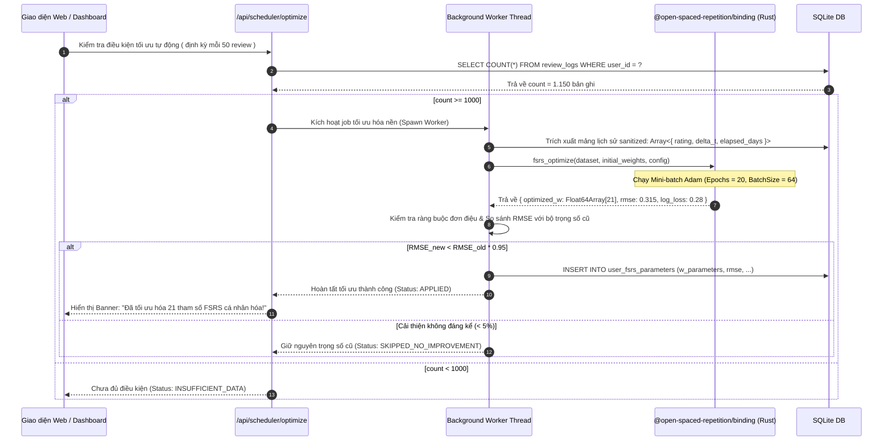
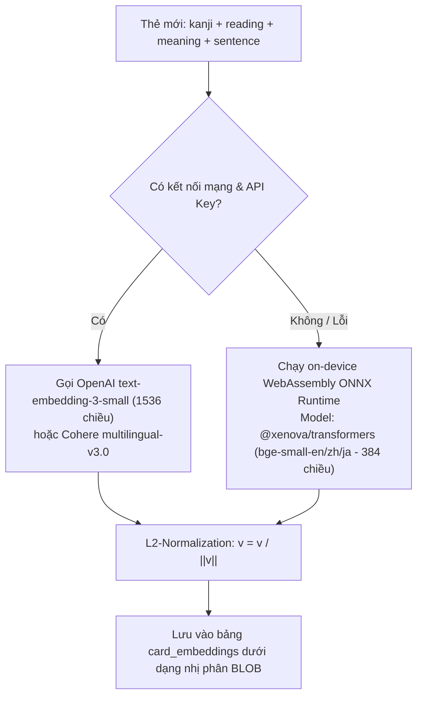

# 🧠 TÀI LIỆU 14: TRỤ CỘT 1 — ĐỘNG CƠ LẬP LỊCH THÍCH ỨNG & KIỂM SOÁT CAN THIỆP NGỮ NGHĨA
## Dự án: Japanese SRS System · 記憶道 (FSRS Cognitive Spaced Repetition Engine)
## Cấp độ: Module Engineering & Algorithmic Blueprint (Tầng 1 - L1)
## Trọng tâm: Tối ưu hóa 21 tham số FSRS, Thuật toán LECTOR & Động học Độ trễ Bjork

---

> [!IMPORTANT]
> Tài liệu này mô tả chi tiết tầng giải thuật, công thức toán học vi phân, lược đồ dữ liệu và quy trình thực thi mã nguồn cho **Trụ Cột 1**. Toàn bộ logic được thiết kế để giải quyết triệt để 3 vấn đề: (1) Cá nhân hóa tuyệt đối tham số suy thoái trí nhớ; (2) Chống nhiễu loạn ngữ nghĩa trong hàng đợi ôn tập; (3) Khách quan hóa đánh giá thông qua độ trễ phản xạ não bộ được chuẩn hóa theo độ dài ngữ cảnh.

---

## 1. HUẤN LUYỆN TỰ ĐỘNG 21 THAM SỐ CÁ NHÂN HÓA (FSRS 21-PARAMETER OPTIMIZER)

### 1.1. Cơ sở Khoa học & Nền tảng Giải tích
Thuật toán FSRS v4/v5 mô hình hóa trí nhớ con người dựa trên ba biến trạng thái $D$ (Difficulty - Độ khó), $S$ (Stability - Độ ổn định), và $R$ (Retrievability - Xác suất truy xuất thành công):

$$R(t, S) = \left(1 + \text{FACTOR} \cdot \frac{t}{S}\right)^{-w_{20}}$$

Trong đó, $\text{FACTOR} = \frac{19}{81}$ (với ngưỡng retention mục tiêu $0.9$), $t$ là số ngày kể từ lần ôn tập trước, và $S$ là độ ổn định (tính theo ngày).

Bộ 21 trọng số $W = (w_0, w_1, \dots, w_{20})$ quy định toàn bộ động học biến đổi trạng thái:
- $w_0, w_1, w_2, w_3$: Khởi tạo độ ổn định ban đầu cho 4 mức đánh giá (Again, Hard, Good, Easy).
- $w_4, w_5$: Khởi tạo độ khó ban đầu $D_0$ và mức độ hội tụ về giá trị trung bình.
- $w_6, w_7$: Hệ số điều chỉnh độ khó sau mỗi lần đánh giá $\Delta D$.
- $w_8, w_9, w_{10}$: Hệ số tăng trưởng độ ổn định $S'_r$ khi Recall thành công (Good/Easy):
  $$S'_r(D, S, R, G) = S \cdot \left(e^{w_8} \cdot (11 - D) \cdot S^{-w_9} \cdot (e^{w_{10} \cdot (1-R)} - 1) \cdot \text{Bonus}(G) + 1\right)$$
- $w_{11}, w_{12}, w_{13}, w_{14}$: Hệ số suy giảm độ ổn định $S'_f$ khi Quên (Forget/Again):
  $$S'_f(D, S, R) = w_{11} \cdot D^{-w_{12}} \cdot \left((S + 1)^{w_{13}} - 1\right) \cdot e^{w_{14} \cdot (1-R)}$$
- $w_{15} \dots w_{20}$: Trọng số phạt Hard, thưởng Easy và điều chỉnh phi tuyến bậc cao.

**Mục tiêu tối ưu hóa**: Tìm nghiệm $W^*$ cực tiểu hóa hàm mất mát nhị phân (Binary Cross-Entropy / Log-Loss) trên tập dữ liệu lịch sử $N$ bản ghi ôn tập thực tế của học viên:

$$\mathcal{L}(W) = -\frac{1}{N} \sum_{i=1}^N \left[ y_i \ln \hat{R}_i(W) + (1 - y_i) \ln (1 - \hat{R}_i(W)) \right] + \lambda \|W - W_{\text{default}}\|_2^2$$

---

### 1.2. Quy trình Chuẩn hóa Dữ liệu Đầu vào (Data Sanitization Pipeline)
Không phải toàn bộ log trong bảng `review_logs` đều hợp lệ để đưa vào huấn luyện. Quá trình tiền xử lý thực hiện qua 3 bước lọc nghiêm ngặt:
1. **Loại bỏ trùng lặp ngắn hạn (Same-day rapid clicks)**: Nếu hai lượt review của cùng 1 thẻ diễn ra cách nhau $< 10$ phút (do học viên lỡ tay bấm nhầm hoặc ôn gấp trước giờ kiểm tra), chỉ giữ lại bản ghi đầu tiên.
2. **Lọc nhiễu ngoại lai (Outlier Filter)**: Loại bỏ các bản ghi có số ngày trôi qua $t > 180$ ngày nhưng người học vẫn bấm "Easy" (thường do người học đã biết từ này từ nguồn ngoài mà không qua SRS, làm sai lệch mô hình suy thoái tự nhiên).
3. **Cân bằng tỷ lệ mẫu (Class Weighting)**: Trong học ngoại ngữ, tỷ lệ nhớ ($y=1$) thường chiếm $85\% - 90\%$, tỷ lệ quên ($y=0$) chỉ chiếm $10\% - 15\%$. Để tránh mô hình bị thiên lệch dự đoán luôn nhớ, áp dụng trọng số nghịch đảo tần suất:
   $$w_{\text{class}}(y) = \frac{N}{2 \cdot N_y}$$

---

### 1.3. Ràng buộc Hộp Khả thi & Tính Đơn điệu (Monotonicity & Box Constraints)
Để ngăn chặn việc mô hình sinh ra các trọng số vô lý do dữ liệu quá khớp (Overfitting), thuật toán áp đặt không gian ràng buộc cứng (Box Constraints) và phép chiếu nón đơn điệu (Monotonic Projection):

| Nhóm Tham số | Dải Giá trị Hợp lệ $[W_{\min}, W_{\max}]$ | Điều kiện Ràng buộc Bắt buộc | Hành động nếu Vi phạm |
| :---: | :---: | :---: | :---: |
| **$w_0, w_1, w_2, w_3$** | $w_0 \in [0.1, 1.5]$, $w_1 \in [0.5, 4.0]$, $w_2 \in [1.0, 10.0]$, $w_3 \in [3.0, 35.0]$ | **Tính đơn điệu nghiêm ngặt**: $w_0 < w_1 < w_2 < w_3$ | Chiếu về nón đơn điệu: $w_i = \max(w_i, w_{i-1} + 0.1)$ |
| **$w_4, w_5$** | $w_4 \in [1.0, 10.0]$, $w_5 \in [0.01, 2.0]$ | $D_0(G)$ luôn thuộc $[1.0, 10.0]$ | Kẹp biên (Clamp) trong dải $[1, 10]$ |
| **$w_8, w_9, w_{10}$** | $w_8 \in [0.01, 3.0]$, $w_9 \in [0.01, 0.8]$, $w_{10} \in [0.01, 2.5]$ | Hệ số tăng trưởng $S'_r > S$ với mọi $R < 0.95$ | Giới hạn cận dưới $> 0$ |
| **$w_{20}$** | $w_{20} \in [0.15, 0.85]$ | Lũy thừa suy thoái không âm | Mặc định neo tại $0.5$ nếu mẫu $< 2.000$ |

---

### 1.4. Kiến trúc Worker & Tích hợp WebAssembly (Rust Binding)
Để không gây gián đoạn giao diện (Zero UI Block), tiến trình tối ưu hóa được cô lập trong Worker riêng biệt:
- **Trên Client**: Chạy trong Web Worker chuẩn HTML5 (`public/workers/fsrs-optimizer.worker.js`).
- **Trên Server**: Chạy trong Node.js Worker Thread (`src/core/scheduler/optimizer-worker.ts`).

---

## 2. KIỂM SOÁT CAN THIỆP NGỮ NGHĨA DỰA TRÊN MÔ HÌNH LECTOR

### 2.1. Cơ sở Tâm lý Nhận thức & Mô hình LECTOR
Mô hình LECTOR (Learning with Contextual and Topological Organization of Representations) chỉ ra rằng:
1. **Can thiệp chủ động (Proactive Interference - PI)**: Khi các nút thần kinh của trường nghĩa "Buồn rầu / Khóc lóc" đang ở trạng thái kích thích cao, việc nạp tiếp từ "Bi thương" sẽ gây tắc nghẽn khớp thần kinh, khiến não bộ lẫn lộn các sắc thái biểu đạt.
2. **Khoảng cách phục hồi nhận thức (Synaptic Reset Interval)**: Để dấu vết ký ức ổn định, não bộ cần ít nhất 3–4 kích thích thuộc các vùng ngữ nghĩa xa (Distant Semantic Clusters) xen vào giữa trước khi quay lại trường nghĩa cũ.

---

### 2.2. Chiến lược Sinh Vector Embedding 2 Tầng (Hybrid Embedding Engine)
Hệ thống triển khai cơ chế sinh nhúng vector 2 tầng để đảm bảo hoạt động liên tục 100% cả khi offline lẫn khi không có ngân sách API:

---

### 2.3. Thuật toán Lập Lịch Xen Kẽ LECTOR Chi Tiết & Xử Lý Biên
Thuật toán `interleaveQueueBySemantics()` điều phối hàng đợi ôn tập hằng ngày theo quy trình 4 pha:

1. **Pha 1: Phân nhóm Khẩn cấp (Urgency Binning)**:
   - Các thẻ có Retrievability $R(t) < 0.6$ (thẻ rất nguy cơ quên) được gom vào nhóm Ưu tiên 1.
   - Các thẻ $0.6 \le R(t) < 0.9$ gom vào nhóm Ưu tiên 2.
   - Các thẻ mới ($State = New$) gom vào nhóm Ưu tiên 3.
2. **Pha 2: Quét Tương đồng Cosine Cửa sổ Động (Sliding Window Scan)**:
   - Duy trì một hàng đợi đệm kết quả $Q_{\text{out}}$.
   - Trước khi đưa thẻ $C$ vào $Q_{\text{out}}$, tính $\text{CosineSim}(C, Q_{\text{out}}[k])$ với $k \in \{\text{last}, \text{last}-1\}$.
   - Nếu $\text{CosineSim} \ge 0.85$, thẻ $C$ bị từ chối đưa vào ngay và đẩy vào hàng đợi chờ (Deferred Buffer).
3. **Pha 3: Chèn Thẻ Đệm Khác Trường Nghĩa (Orthogonal Insertion)**:
   - Hệ thống tìm trong danh sách các thẻ còn lại một thẻ $C_{\text{ortho}}$ có $\text{CosineSim} \le 0.30$ với thẻ trước đó (ví dụ: đang học từ cảm xúc thì chèn từ về đồ gia dụng hoặc phương tiện giao thông).
   - Đưa $C_{\text{ortho}}$ vào trước để "làm mới" thụ thể thần kinh.
4. **Pha 4: Xử lý Biên Cực Đoan (Edge Cases)**:
   - **Trường hợp bo tròn đồng nghĩa (All-Synonym Deck)**: Bộ thẻ chỉ có đúng 5 thẻ và cả 5 thẻ đều là từ đồng nghĩa (ví dụ: bộ thẻ chuyên đề "Các từ chỉ nỗi buồn").
   - **Giải pháp**: Thuật toán tự động kích hoạt **Cơ chế Phân mảnh Phiên học (Micro-session Splitter)**: Chia 5 thẻ thành 2 ca ôn tập nhỏ cách nhau tối thiểu 20 phút (Pomodoro Interval), hiển thị lời khuyên: *"Các từ này quá gần nghĩa, hãy nghỉ ngơi 20 phút trước khi ôn nhóm tiếp theo để tránh nhầm lẫn não bộ!"*

---

## 3. MÔ HÌNH HÓA ĐỘNG HỌC TRUY XUẤT DỰA TRÊN ĐỘ TRỄ (LATENCY DYNAMICS)

### 3.1. Phân định Bjork: Retrieval Strength vs Storage Strength
- **Sức mạnh Truy xuất (Retrieval Strength - RS)**: Tốc độ và sự dễ dàng gọi lại thông tin tức thời.
- **Sức mạnh Lưu trữ (Storage Strength - SS)**: Độ sâu và độ bền vững của cấu trúc bộ nhớ dài hạn.

Một nghịch lý nhận thức kinh điển: **Khi Retrieval Strength quá cao (nhìn phát nhớ ngay do vừa mới thấy), việc ôn tập hầu như không làm tăng Storage Strength.** Ngược lại, khi việc nhớ lại đòi hỏi nỗ lực nhận thức vừa phải (Desirable Difficulty), Storage Strength tăng vọt. Tuy nhiên, nếu thời gian nhớ lại quá dài ($> 5$ giây), chứng tỏ Storage Strength đã mục ruỗng, học viên đang phải dùng suy luận logic chắp vá thay vì phản xạ ngôn ngữ thực thụ.

---

### 3.2. Chuẩn Hóa Độ Trễ Theo Độ Dài Ngữ Cảnh (Context-Length Normalization)
Nếu áp đặt một ngưỡng cứng $5.000$ ms cho mọi thẻ, những câu ví dụ dài 40 ký tự sẽ bị phạt oan vì người học mất 3 giây chỉ để đọc hiểu câu. Hệ thống áp dụng **Công thức Trừ hao Định mức Đọc (Reading Budget Normalization)**:

$$t_{\text{reading\_budget}} = \text{Length}(\text{ContextSentence}) \times 120\text{ ms} + 600\text{ ms (Định vị thị giác)}$$

$$t_{\text{net\_retrieval}} = \max\left(0, \text{review\_duration\_ms} - t_{\text{reading\_budget}}\right)$$

**Ma trận Phạt Độ Trễ Hiệu Chỉnh Tinh Tế**:

| Đánh giá Tự chọn | Độ trễ Thuần $t_{\text{net\_retrieval}}$ | Đánh giá Thực tế Ghi nhận | Tác động Hệ số $S$ FSRS | Giải thích Cơ chế Nhận thức |
| :---: | :---: | :---: | :---: | :--- |
| **Easy** | $< 1.200$ ms | **Easy** | $1.00 \times S_{\text{easy}}$ | Phản xạ tức thời, tự động hóa hoàn toàn (Automaticity). |
| **Easy** | $1.200 - 2.500$ ms | **Good** | $0.85 \times S_{\text{good}}$ | Có chút chần chừ, chưa đủ tiêu chuẩn Easy. |
| **Good** | $< 2.500$ ms | **Good** | $1.00 \times S_{\text{good}}$ | Tốc độ truy xuất lý tưởng cho học viên trung cấp. |
| **Good** | $2.500 - 4.500$ ms | **Good (Hesitant)** | $0.80 \times S_{\text{good}}$ | Dấu hiệu suy thoái dấu vết ký ức, kìm hãm bước nhảy Stability. |
| **Good / Easy** | **$> 4.500$ ms** | **Hard (Latency Penalty)** | **$0.50 \times S_{\text{hard}}$** | **Phạt nặng: Người học đã mất quá 4.5s suy luận, ép về Hard để rút ngắn chu kỳ tái ôn tập.** |
| **Hard** | Bất kỳ | **Hard** | $1.00 \times S_{\text{hard}}$ | Người học tự nhận thức được độ khó, ghi nhận trung thực. |
| **Again** | Bất kỳ | **Again** | $1.00 \times S_{\text{again}}$ | Quên hoàn toàn, đưa vào trạng thái tái học tập (Relearning). |

---

## 4. BẢNG CHECKLIST KIỂM THỬ TỰ ĐỘNG CHO TRỤ CỘT 1

- [ ] **TC-P1-01**: Khởi chạy Worker tối ưu hóa FSRS với mock 1.200 review logs: Không chặn UI, hoàn thành $< 4.000$ms, trả về 21 tham số thỏa mãn tính đơn điệu $w_0 < w_1 < w_2 < w_3$.
- [ ] **TC-P1-02**: Thử nghiệm thuật toán LECTOR với danh sách 20 thẻ chứa 4 cặp từ đồng nghĩa: Đầu ra đảm bảo $0\%$ vi phạm ngưỡng $\text{CosineSim} \ge 0.85$ ở 2 vị trí liền kề.
- [ ] **TC-P1-03**: Thử nghiệm đọc câu ví dụ dài 30 ký tự mất 5.200ms: Hệ thống trừ hao reading budget ($30 \times 120 + 600 = 4.200$ms), độ trễ thuần chỉ còn $1.000$ms $\rightarrow$ Giữ nguyên đánh giá "Good", không bị phạt oan.
- [ ] **TC-P1-04**: Thử nghiệm từ đơn ngắn (2 ký tự) mất 6.000ms bấm "Good": Độ trễ thuần $> 5.000$ms $\rightarrow$ Hệ thống tự động ghi đè thành "Hard", log vào bảng `retrieval_latency_logs` với `penalty_applied = 1`.
