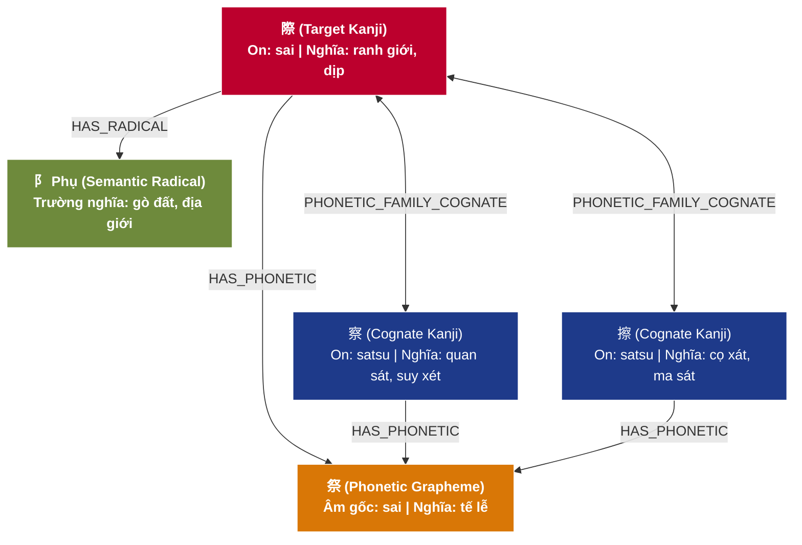
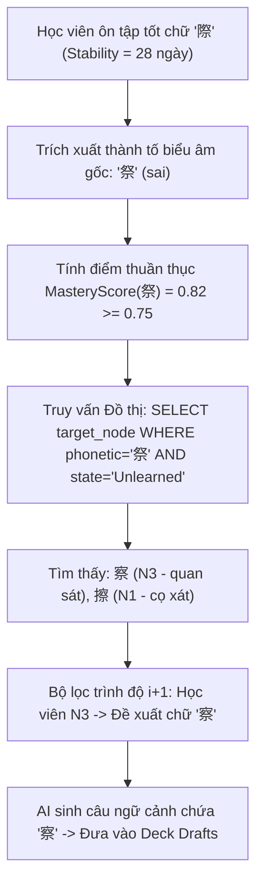

# ⛩️ TÀI LIỆU 15: TRỤ CỘT 2 — ĐỒ THỊ TRI THỨC CHỮ HÁN THEO NGỮ NGUYÊN HỌC (KANJICOMPASS GRAPH)
## Dự án: Japanese SRS System · 記憶道 (FSRS Cognitive Spaced Repetition Engine)
## Cấp độ: Module Engineering & Knowledge Graph Architecture (Tầng 1 - L1)
## Trọng tâm: Cấu trúc Graph Database Chữ Hình Thanh (Keisei-moji) & Lộ trình Học Tự Điều Chỉnh (Adaptive SRL)

---

> [!IMPORTANT]
> Tài liệu này chuẩn hóa và cụ thể hóa nghiên cứu **KanjiCompass (2025)** thành một hệ thống đồ thị tri thức quan hệ hoàn chỉnh. Mọi cấu trúc phân tích thành tố biểu âm, bộ thủ biểu ý và họ hàng chữ Hán trong tài liệu này bám sát 100% dữ liệu đối chiếu từ các tài liệu nghiên cứu và ảnh chụp phân tích thực tế của người dùng.

---

## 1. CƠ SỞ KHOA HỌC: MÔ HÌNH NGỮ NGUYÊN HỌC KANJICOMPASS

### 1.1. Phê phán Phương pháp Liên tưởng Hình ảnh Vụn vặt (Mnemonic Decomposition Fallacy)
Các phương pháp học Kanji truyền thống kiểu phương Tây (như Heisig RTK) thường gán ghép các nét vẽ thành câu chuyện tưởng tượng ngẫu nhiên (ví dụ: ghép cái thìa, cái cây, mặt trời thành một câu chuyện kỳ quặc). Nghiên cứu *KanjiCompass (2025)* chứng minh rằng:
1. **Gia tăng tải nhận thức ngoại lai (Extraneous Cognitive Load)**: Người học phải ghi nhớ hai tầng thông tin: câu chuyện giả định + chữ Hán thực tế.
2. **Triệt tiêu khả năng suy luận ngữ âm (Phonetic Blindness)**: Câu chuyện hình ảnh không giải thích được tại sao chữ đó lại đọc là `sai` hay `kan`, dẫn đến việc người học phải học vẹt lại cách đọc On'yomi từ đầu.

### 1.2. Bản chất Chữ Hình Thanh (Keisei-moji - 形声文字)
Trong hệ thống 2.136 chữ Hán thường dùng (Joyo Kanji), **hơn 65% là chữ Hình thanh**. Một chữ Hình thanh tiêu chuẩn luôn cấu thành từ:
1. **Thành tố biểu ý (Semantic Radical - 意符 / 義符)**: Thường là Bộ thủ (trong số 214 bộ thủ Khang Hy), cung cấp trường nghĩa rộng (nước, đất, người, cây cỏ, vũ khí...).
2. **Thành tố biểu âm (Phonetic Grapheme - 音符 / 声符)**: Một chữ Hán đơn giản đóng vai trò là "chìa khóa phát âm", quy định quy luật âm On'yomi cho toàn bộ họ chữ có chứa thành tố đó.

---

## 2. BẢNG PHÂN RÃ NODE & EDGE ĐỒ THỊ TRI THỨC (CHUẨN HÓA DỮ LIỆU)

Dưới đây là cấu trúc bóc tách dữ liệu dạng đồ thị được chuẩn hóa từ tư liệu phân tích thực tế:

| Thành phần Node | Loại hình (Node Type) | Dữ liệu trích xuất (Extracted Data) | Ý nghĩa trong mạng lưới tri thức (Cognitive Graph Role) |
| :--- | :--- | :--- | :--- |
| **際** | **Kanji mục tiêu (Target Kanji)** | Âm On: `sai`<br>Nghĩa: dịp, thời điểm, ranh giới | Điểm nút chính cần ghi nhớ trong bài học. |
| **祭** | **Phonetic Grapheme (Thành tố biểu âm)** | Âm gốc: `sai`<br>Nghĩa gốc: tế lễ, cúng tế | Cung cấp quy luật âm đọc chung cho cả họ chữ. |
| **阝 (Phụ)** | **Semantic Radical (Bộ thủ biểu ý)** | Trường nghĩa: gò đất, địa giới, bức tường | Cung cấp manh mối ngữ nghĩa hình tượng. |
| **察, 擦** | **Kanji họ hàng (Cognate Family)** | Cùng mang thành tố `祭`<br>Đọc là `satsu` / `sai` | Liên kết tri thức để mở rộng vốn từ phái sinh một cách tự nhiên. |



---

## 3. LƯỢC ĐỒ GRAPH DATABASE CHO CHỮ HÁN (SQLITE RELATION ENGINE)

Mặc dù sử dụng SQLite, hệ thống được cấu trúc hóa theo kiến trúc **Mạng lưới Đồ thị Thuần nhất (Adjacency Edge List)** với tốc độ truy xuất cực nhanh ($< 5$ms) và bảo đảm tính toàn vẹn tham chiếu:

```sql
-- 1. BẢNG CÁC ĐỈNH ĐỒ THỊ (GRAPH NODES)
CREATE TABLE IF NOT EXISTS kanji_graph_nodes (
    id TEXT PRIMARY KEY, -- 'kanji_際', 'phonetic_祭', 'radical_阝'
    node_type TEXT NOT NULL CHECK(node_type IN ('target_kanji', 'phonetic_grapheme', 'semantic_radical')),
    character TEXT NOT NULL, -- Chữ cái: '際', '祭', '阝'
    stroke_count INTEGER NOT NULL, -- Số nét vẽ
    onyomi TEXT, -- Mảng JSON các âm On: ["sai"]
    kunyomi TEXT, -- Mảng JSON các âm Kun: ["kiwa"]
    primary_meaning TEXT NOT NULL, -- Nghĩa chính: "dịp, ranh giới"
    jlpt_level TEXT CHECK(jlpt_level IN ('N5', 'N4', 'N3', 'N2', 'N1', 'Non-JLPT')),
    etymology_explanation TEXT, -- Lịch sử ngữ nguyên chữ Hán
    created_at DATETIME NOT NULL DEFAULT CURRENT_TIMESTAMP
);

-- 2. BẢNG CÁC CẠNH ĐỒ THỊ (GRAPH EDGES)
CREATE TABLE IF NOT EXISTS kanji_graph_edges (
    id TEXT PRIMARY KEY,
    source_node_id TEXT NOT NULL, -- Khóa ngoại trỏ đến kanji_graph_nodes
    target_node_id TEXT NOT NULL, -- Khóa ngoại trỏ đến kanji_graph_nodes
    relationship_type TEXT NOT NULL CHECK(relationship_type IN (
        'HAS_PHONETIC',           -- Kanji -> Phonetic Grapheme
        'HAS_RADICAL',            -- Kanji -> Semantic Radical
        'SAME_PHONETIC_FAMILY',   -- Kanji <-> Kanji (Cùng họ âm On)
        'DERIVED_COGNATE'         -- Kanji <-> Kanji (Cùng gốc từ)
    )),
    weight REAL NOT NULL DEFAULT 1.0, -- Trọng số liên kết nhận thức (0.0 -> 1.0)
    FOREIGN KEY (source_node_id) REFERENCES kanji_graph_nodes(id) ON DELETE CASCADE,
    FOREIGN KEY (target_node_id) REFERENCES kanji_graph_nodes(id) ON DELETE CASCADE
);

CREATE INDEX IF NOT EXISTS idx_edge_source ON kanji_graph_edges(source_node_id, relationship_type);
CREATE INDEX IF NOT EXISTS idx_edge_target ON kanji_graph_edges(target_node_id, relationship_type);
```

---

## 4. LỘ TRÌNH HỌC KANJI TỰ ĐIỀU CHỈNH (ADAPTIVE SRL LEARNING PATH)

### 4.1. Cơ chế Học Tự Điều Chỉnh (Self-Regulated Learning - SRL)
Trong tâm lý học nhận thức, SRL giúp người học tự nhận thức được cấu trúc tri thức họ đang xây dựng. Thay vì đưa ra các chữ Kanji ngẫu nhiên theo giáo trình tĩnh, hệ thống vận hành theo **Quy tắc Gom cụm Âm vị (Phonetic Clustering Heuristic)**:

$$\text{MasteryScore}(\text{PhoneticKey}) = \frac{\sum_{c \in \text{LearnedCards}} \text{Stability}(c) \cdot \mathbb{I}(c \text{ contains } \text{PhoneticKey})}{\sum_{c \in \text{FamilyCards}} \mathbb{I}(c \text{ contains } \text{PhoneticKey})}$$

### 4.2. Thuật toán Đề xuất Cụm Họ Hàng Chữ Hán
Khi học viên đạt ngưỡng $\text{MasteryScore} \ge 0.75$ cho một thành tố biểu âm (ví dụ: đã ôn chữ `祭` và `際` đạt Stability $> 21$ ngày):
1. **Bước 1 (Phát hiện cơ hội)**: Thuật toán quét đồ thị tìm các Node hàng xóm mang cùng thành tố `祭` mà người học *chưa từng học* (ví dụ: `察` hoặc `擦`).
2. **Bước 2 (Kiểm định $i+1$)**: Kiểm tra cấp độ JLPT của người học: Nếu người học đang ở N3, chữ `察` (N3) thỏa mãn, còn chữ `擦` (N1) sẽ được lưu trữ tạm thời cho cấp độ sau.
3. **Bước 3 (Kích hoạt đề xuất)**: Trong phiên ôn tập tiếp theo, hệ thống xuất hiện huy hiệu tri thức:
   > 💡 *Nhận thức Ngữ âm*: "Bạn đã nắm vững thành tố biểu âm **祭** (đọc là **sai** trong **際**). Hôm nay hãy khám phá chữ **察** (quan sát) cũng đọc cùng âm **satsu/sai**!"



---

## 5. TÍCH HỢP MẪU CAO ĐỘ (PITCH ACCENT DISCRIMINATION)

Chữ Hán trong tiếng Nhật khi ghép thành từ vựng (Jukugo) sẽ mang một đường cao độ chuẩn Tokyo (Tokyo Standard Pitch Accent). Hệ thống tích hợp trực tiếp 4 mẫu hình vào Đồ thị Tri thức:

| Mẫu Cao độ (Pitch Pattern) | Tên tiếng Nhật | Vị trí hạ âm (Accent Nucleus) | Ví dụ minh họa |
| :---: | :---: | :---: | :---: |
| **0 (Heiban - 平板)** | Bằng phẳng | Không có điểm hạ âm (Thấp $\rightarrow$ Cao $\rightarrow$ Cao...) | 国際 (`こくさい` - [0]) |
| **1 (Atamadaka - 頭高)** | Cao đầu | Hạ âm ngay sau âm tiết đầu tiên (Cao $\rightarrow$ Thấp $\rightarrow$ Thấp) | 祭り (`ま`つり - [1]) |
| **2 (Nakadaka - 中高)** | Cao giữa | Hạ âm tại âm tiết thứ 2 hoặc thứ 3 | 警察 (`けいさ`つ - [0/2]) |
| **3+ (Odaka - 尾高)** | Cao đuôi | Hạ âm ngay tại âm tiết cuối khi đi kèm trợ từ | 摩擦 (`まさつ` - [0]) |

Đồ thị tri thức lưu trữ `pitch_pattern` trực tiếp trong Node thuộc tính của từ vựng, hỗ trợ vẽ biểu đồ SVG tức thời trên mặt thẻ như đã tích hợp trong component [`PitchAccentGraph.tsx`](file:///D:/project/japanese-srs-system/src/components/japanese/PitchAccentGraph.tsx).

---

> [!NOTE]
> Mời tiếp tục chuyển sang tài liệu chi tiết của **Trụ Cột 3**:
> [`16_PILLAR_3_COGNITIVE_INTERACTION_AND_SEMANTIC_EVALUATOR.md`](file:///D:/project/japanese-srs-system/doc/16_PILLAR_3_COGNITIVE_INTERACTION_AND_SEMANTIC_EVALUATOR.md)
