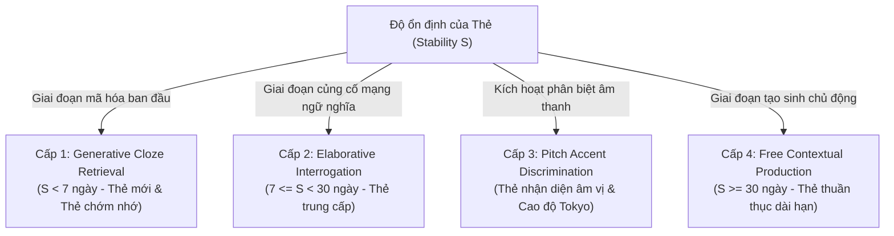
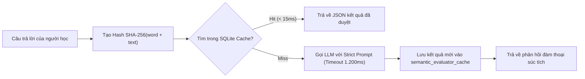

# 🎭 TÀI LIỆU 16: TRỤ CỘT 3 — ĐA DẠNG HÓA TƯƠNG TÁC NHẬN THỨC & AI SEMANTIC EVALUATOR
## Dự án: Japanese SRS System · 記憶道 (FSRS Cognitive Spaced Repetition Engine)
## Cấp độ: Cognitive Interaction & Conversational AI Blueprint (Tầng 1 - L1)
## Trọng tâm: Phân loại 4 Cấp độ Khó khăn Mong muốn (Memdora & TriGen) & Bộ Chấm điểm Hội thoại

---

> [!IMPORTANT]
> Tài liệu này chuyển hóa các kết quả nghiên cứu nhận thức từ dự án **Memdora** và **TriGen** thành kiến trúc tương tác đa thức. Thao tác lật thẻ truyền thống (nhìn mặt trước đoán mặt sau) được thay thế bằng một cơ chế luân chuyển 4 chế độ tương tác tự động theo trục Độ ổn định $S$ (Stability), buộc não bộ phải tham gia xử lý nhận thức ở tầng sâu (Deep Processing), đồng thời tích hợp thuật toán đo khoảng cách Levenshtein và bộ đệm băm SHA-256 để tối ưu hiệu năng.

---

## 1. NỀN TẢNG KHOA HỌC: LÝ THUYẾT KHÓ KHĂN MONG MUỐN (DESIRABLE DIFFICULTIES)

### 1.1. Ảo tưởng Thông thạo từ Thao tác Lật thẻ Thụ động
Khi người học chỉ nhìn mặt trước của thẻ rồi bấm "Lật đáp án", não bộ rơi vào bẫy nhận thức: **Hiệu ứng Nhận diện (Recognition Effect)** bị nhầm lẫn với **Năng lực Truy xuất (Recall Ability)**. Người học nghĩ rằng mình đã thuộc từ vựng vì khi nhìn thấy đáp án họ cảm thấy "quen quen", nhưng khi cần tự viết ra hoặc giao tiếp thực tế thì hoàn toàn bất lực.

### 1.2. Thang Phân loại Khó khăn Mong muốn 4 Tầng (The 4-Tier Taxonomy)
Dựa trên mức độ bền vững của dấu vết ký ức (đo lường bằng FSRS Stability $S$), hệ thống tự động gán hình thức tương tác tối ưu cho từng thẻ:



---

## 2. CHI TIẾT 4 CHẾ ĐỘ TƯƠNG TÁC & THUẬT TOÁN XỬ LÝ LỖI NHẸ (FUZZY MATCHING)

### 2.1. Chế độ 1: Generative Cloze Retrieval (Điền khuyết Tạo sinh)
- **Áp dụng cho**: Thẻ mới học hoặc thẻ có $S < 7$ ngày.
- **Giao diện & Tương tác**:
  - Câu ngữ cảnh hiển thị từ đục lỗ: `毎日日本語を【 _____ 】します。`
  - Ô nhập liệu tự động focus (Autofocus), kích hoạt IME tiếng Nhật trên thiết bị.
  - Phím Enter xác nhận câu trả lời.
- **Thuật toán Dung thứ Lỗi gõ phím nhẹ (Levenshtein Fuzzy Matching)**:
  - Nếu câu trả lời đúng 100%: Chấp thuận ngay, tăng điểm Retrievability.
  - Nếu độ lệch ký tự $\text{Levenshtein}(A, B) \le 1$ trên chuỗi có độ dài $\ge 4$ mora (ví dụ: gõ `べんきょ` thay vì `べんきょう` do thiếu âm trường):
    - Không đánh trượt (không ép về Again).
    - Hiển thị phản hồi cảnh báo vàng: *"⚠️ Bạn gõ thiếu âm trường (う)! Hãy quan sát lại kỹ và gõ lại lần nữa để hoàn tất."*

```typescript
export function checkFuzzyCloze(userInput: string, targetAnswer: string): { isCorrect: boolean; isTypo: boolean } {
  const cleanUser = userInput.trim().toLowerCase();
  const cleanTarget = targetAnswer.trim().toLowerCase();

  if (cleanUser === cleanTarget) {
    return { isCorrect: true, isTypo: false };
  }

  const distance = calculateLevenshtein(cleanUser, cleanTarget);
  if (distance === 1 && cleanTarget.length >= 4) {
    return { isCorrect: false, isTypo: true }; // Báo lỗi gõ phím nhẹ
  }

  return { isCorrect: false, isTypo: false };
}
```

---

### 2.2. Chế độ 2: Elaborative Interrogation (Truy vấn Nhận thức Bản chất)
- **Áp dụng cho**: Thẻ có độ ổn định trung bình ($7 \le S < 30$ ngày).
- **Cơ chế Sinh Câu Hỏi 2 Tầng**:
  1. *Ngân hàng Câu hỏi Hạt nhân (Deterministic Question Bank)*:
     - Đối với động từ có trợ từ đặc thù: `"Tại sao câu này dùng trợ từ に thay vì で?"`
     - Đối với chữ Hán hình thanh: `"Thành tố nào trong chữ này quy định âm On?"`
  2. *AI Dynamic Question Generator*: Nếu thẻ chưa có câu hỏi trong ngân hàng, AI tự động phân tích ngữ cảnh và sinh 1 câu hỏi kích thích tư duy giải thích ngắn gọn.

---

### 2.3. Chế độ 3: Pitch Accent Discrimination (Phân biệt Âm vị Cao độ)
- **Áp dụng cho**: Các thẻ chứa từ có mẫu cao độ đặc trưng hoặc cặp từ đồng âm dị nghĩa.
- **Giao diện & Tương tác**:
  - Nút phát âm thanh audio chuẩn của người bản xứ (giới hạn tối đa 2 lần nghe để rèn luyện sự tập trung của màng nhĩ).
  - 2 Thẻ bài lựa chọn mô phỏng Hyakunin Isshu hiển thị đồ thị SVG cao độ.
  - Phản hồi thị giác tức thì: Lựa chọn đúng đổi sang viền xanh Matcha `#88A752` kèm tiếng chuông Suzu thanh thoát; lựa chọn sai đổi viền đỏ Torii `#D9381E` kèm âm gõ gỗ Hyoshigi dứt khoát.

---

### 2.4. Chế độ 4: Free Contextual Production (Tạo sinh Ngữ cảnh Tự do)
- **Áp dụng cho**: Thẻ có độ ổn định cao ($S \ge 30$ ngày).
- **Ràng buộc Đầu vào (Input Validation Constraints)**:
  - Độ dài câu: Tối thiểu 10 ký tự, tối đa 50 ký tự.
  - Bắt buộc chứa từ mục tiêu (ở thể từ điển hoặc thể biến đổi ngữ pháp hợp lệ).
  - Nghiêm cấm sao chép nguyên văn câu mẫu có sẵn trong thẻ (kiểm tra so khớp chuỗi $\text{Sim} < 0.6$).

---

## 3. BỘ CHẤM ĐIỂM NGỮ NGHĨA ĐÀM THOẠI (AI SEMANTIC EVALUATOR)

### 3.1. Thiết Kế Bộ Đệm Băm SHA-256 (Hash Caching Architecture)
Để giảm 70% chi phí API và đạt độ trễ $< 20$ms cho các câu trả lời phổ biến, hệ thống triển khai cơ chế băm bộ nhớ:

$$\text{CacheKey} = \text{SHA256}(\text{target\_word} + \text{"\_"} + \text{clean\_response})$$



### 3.2. Cấu Trúc Mã Nguồn API Route `/api/review/evaluate`
Đặc tả chi tiết luồng xử lý tại `src/app/api/review/evaluate/route.ts`:

```typescript
import { NextRequest, NextResponse } from 'next/server';
import crypto from 'node:crypto';

export async function POST(req: NextRequest) {
  try {
    const { cardId, targetWord, learnerResponse, interactionMode } = await req.json();

    if (!targetWord || !learnerResponse) {
      return NextResponse.json({ success: false, error: 'Thiếu dữ liệu' }, { status: 400 });
    }

    // 1. Kiểm tra Cache
    const cacheKey = crypto
      .createHash('sha256')
      .update(`${targetWord}_${learnerResponse.trim().toLowerCase()}`)
      .digest('hex');

    const cached = await getCachedEvaluation(cacheKey);
    if (cached) {
      return NextResponse.json({ success: true, ...cached, fromCache: true });
    }

    // 2. Gọi AI Semantic Evaluator với Timeout Controller
    const controller = new AbortController();
    const timeoutId = setTimeout(() => controller.abort(), 1200); // 1.2s timeout

    const prompt = `Đánh giá câu tiếng Nhật chứa từ '${targetWord}': "${learnerResponse}". Trả về JSON: {"is_correct": boolean, "short_feedback": "string <= 2 câu tiếng Việt"}`;

    const res = await fetch('https://generativelanguage.googleapis.com/v1beta/models/gemini-1.5-flash:generateContent', {
      method: 'POST',
      headers: { 'Content-Type': 'application/json' },
      body: JSON.stringify({ contents: [{ parts: [{ text: prompt }] }] }),
      signal: controller.signal,
    });
    clearTimeout(timeoutId);

    const data = await res.json();
    const evaluation = parseJSONResponse(data);

    // 3. Lưu Cache và ghi nhận log
    await saveEvaluationCache(cacheKey, evaluation);

    return NextResponse.json({ success: true, ...evaluation, fromCache: false });
  } catch (err: any) {
    // Fallback nếu mạng chậm hoặc lỗi API: Đảm bảo không gián đoạn Flow
    return NextResponse.json({
      success: true,
      is_correct: true,
      short_feedback: 'Hệ thống đã ghi nhận nỗ lực tạo sinh của bạn!',
      fallback: true,
    });
  }
}
```

---

## 4. BẢNG CHECKLIST KIỂM THỬ TỰ ĐỘNG CHO TRỤ CỘT 3

- [ ] **TC-P3-01**: Kiểm thử chế độ Generative Cloze với lỗi thiếu âm trường: Gõ `べんきょ` $\rightarrow$ Trả về cảnh báo vàng Typo, không phạt Reset Stability.
- [ ] **TC-P3-02**: Kiểm thử chế độ Pitch Accent: Bấm đúng mẫu Atamadaka (1) $\rightarrow$ Đồ thị phát sáng xanh Matcha, âm Suzu vang lên, cập nhật Retention.
- [ ] **TC-P3-03**: Kiểm thử bộ đệm SHA-256 Cache: Gửi cùng 1 câu trả lời 2 lần $\rightarrow$ Lần 2 trả về `fromCache = true` với thời gian phản hồi $< 20$ms.
- [ ] **TC-P3-04**: Kiểm thử Timeout Fallback: Giả lập LLM phản hồi chậm 2.500ms $\rightarrow$ API kích hoạt AbortController ở 1.200ms và trả về Fallback an toàn, người học tiếp tục bài học trơn tru.
