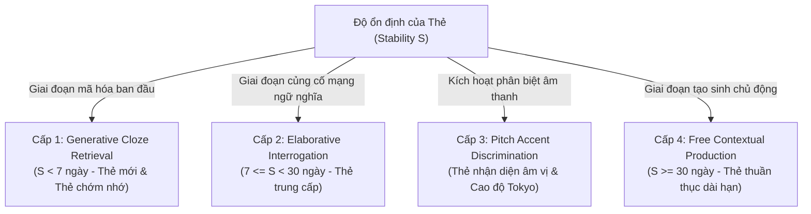
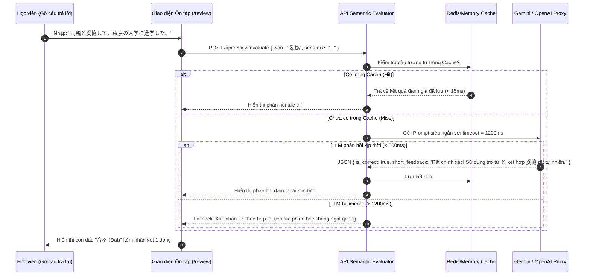

# 🎭 TÀI LIỆU 16: TRỤ CỘT 3 — ĐA DẠNG HÓA TƯƠNG TÁC NHẬN THỨC & AI SEMANTIC EVALUATOR
## Dự án: Japanese SRS System · 記憶道 (FSRS Cognitive Spaced Repetition Engine)
## Cấp độ: Cognitive Interaction & Conversational AI Blueprint (Tầng 1 - L1)
## Trọng tâm: Phân loại 4 Cấp độ Khó khăn Mong muốn (Memdora & TriGen) & Bộ Chấm điểm Hội thoại

---

> [!IMPORTANT]
> Tài liệu này chuyển hóa các kết quả nghiên cứu nhận thức từ dự án **Memdora** và **TriGen** thành kiến trúc tương tác đa thức. Thao tác lật thẻ truyền thống (nhìn mặt trước đoán mặt sau) được thay thế bằng một cơ chế luân chuyển 4 chế độ tương tác tự động theo trục Độ ổn định $S$ (Stability), buộc não bộ phải tham gia xử lý nhận thức ở tầng sâu (Deep Processing).

---

## 1. NỀN TẢNG KHOA HỌC: LÝ THUYẾT KHÓ KHĂN MONG MUỐN (DESIRABLE DIFFICULTIES)

### 1.1. Ảo tưởng Thông thạo từ Thao tác Lật thẻ Thụ động
Khi người học chỉ nhìn mặt trước của thẻ rồi bấm "Lật đáp án", não bộ rơi vào bẫy nhận thức: **Hiệu ứng Nhận diện (Recognition Effect)** bị nhầm lẫn với **Năng lực Truy xuất (Recall Ability)**. Người học nghĩ rằng mình đã thuộc từ vựng vì khi nhìn thấy đáp án họ cảm thấy "quen quen", nhưng khi cần tự viết ra hoặc giao tiếp thực tế thì hoàn toàn bất lực.

### 1.2. Thang Phân loại Khó khăn Mong muốn 4 Tầng (The 4-Tier Taxonomy)
Dựa trên mức độ bền vững của dấu vết ký ức (đo lường bằng FSRS Stability $S$), hệ thống tự động gán hình thức tương tác tối ưu cho từng thẻ:



---

## 2. CHI TIẾT 4 CHẾ ĐỘ TƯƠNG TÁC NHẬN THỨC

### 2.1. Chế độ 1: Generative Cloze Retrieval (Truy xuất Tạo sinh Điền khuyết)
- **Áp dụng cho**: Thẻ mới học hoặc thẻ có $S < 7$ ngày.
- **Cơ chế**:
  - Không hiển thị từ vựng mục tiêu đứng trơ trọi.
  - Hiển thị câu ngữ cảnh chuẩn $i+1$ với từ mục tiêu bị đục lỗ: `毎日日本語を【 _____ 】します。`
  - Yêu cầu người học phải trực tiếp gõ Furigana (`べんきょう`) hoặc Kanji (`勉強`) vào ô input.
- **Tác động thần kinh**: Kích hoạt vùng vỏ não vận động (Motor Cortex) và vùng Broca thông qua thao tác gõ phím, biến dấu vết ký ức từ thụ động thành chủ động.

---

### 2.2. Chế độ 2: Elaborative Interrogation (Truy vấn Nhận thức Bản chất)
- **Áp dụng cho**: Thẻ có độ ổn định trung bình ($7 \le S < 30$ ngày).
- **Cơ chế**:
  - Khi người học truy xuất thành công, hệ thống không kết thúc ngay mà hiển thị một câu hỏi kích hoạt tư duy sâu:
    - *Về ngữ pháp*: "Tại sao trong câu này tác giả dùng trợ từ **に** thay vì **で**?"
    - *Về Hán tự*: "Thành tố nào trong chữ **際** quy định âm đọc On'yomi là **sai**?"
    - *Về sắc thái*: "Từ **寂しい (sabishii)** khác gì với **孤独 (kodoku)** trong ngữ cảnh này?"
  - Người học suy nghĩ hoặc gõ câu trả lời ngắn gọn (1–2 câu).
- **Tác động thần kinh**: Buộc não bộ phải kết nối thông tin mới vào các nút tri thức sẵn có trong mạng ngữ nghĩa (Semantic Web Activation), ngăn chặn sự phân rã ký ức cô lập.

---

### 2.3. Chế độ 3: Pitch Accent Discrimination (Phân biệt Âm vị Cao độ)
- **Áp dụng cho**: Toàn bộ các thẻ có chứa từ đồng âm dị nghĩa hoặc mẫu cao độ đặc trưng.
- **Cơ chế**:
  - Hệ thống phát ngẫu nhiên một đoạn audio phát âm của người bản xứ (ví dụ: phát âm từ `hashi`).
  - Màn hình hiển thị 2 lựa chọn trực quan kèm đồ thị hạ âm SVG:
    - `[A] 箸 (は＼し - [1] Đũa - Atamadaka)`
    - `[B] 橋 (は／し￣ - [2] Cầu - Odaka)`
  - Người học phải lắng nghe và bấm chọn mẫu cao độ đúng.
- **Tác động thần kinh**: Rèn luyện vùng vỏ não thính giác (Auditory Cortex) nhận diện đường viền cao độ tiếng Nhật chuẩn, xóa bỏ hiện tượng "nói tiếng Nhật với ngữ điệu phẳng lì kiểu tiếng Anh".

---

### 2.4. Chế độ 4: Free Contextual Production (Tạo sinh Ngữ cảnh Tự do)
- **Áp dụng cho**: Thẻ có độ ổn định cao ($S \ge 30$ ngày - chuẩn bị bước vào trí nhớ vĩnh viễn).
- **Cơ chế**:
  - Ẩn toàn bộ câu mẫu cũ đã lưu trong thẻ.
  - Hiển thị từ vựng mục tiêu: `妥協 (だきょう - thỏa hiệp)`.
  - Yêu cầu: "Hãy đặt một câu hoàn chỉnh mới trong đời sống hoặc công việc sử dụng từ này, không được lặp lại câu ví dụ cũ!"
  - Người học gõ câu tự sáng tác vào giao diện.
- **Tác động thần kinh**: Đạt mức cao nhất trong Thang đo nhận thức Bloom (Create / Produce), chuyển hóa tri thức tiếp nhận (Passive Knowledge) thành phản xạ giao tiếp tự nhiên (Active Fluency).

---

## 3. BỘ CHẤM ĐIỂM NGỮ NGHĨA ĐÀM THOẠI (AI SEMANTIC EVALUATOR)

### 3.1. Thách thức Kỹ thuật: Bảo toàn Trạng thái Tập trung (Flow State)
Các hệ thống AI truyền thống thường mắc hai lỗi chí mạng:
1. So khớp chuỗi cứng nhắc (Regex / String match) làm sai lệch đánh giá khi người học dùng từ đồng nghĩa hợp lý.
2. Gọi LLM trả về văn bản dài dòng (3–4 đoạn phân tích ngữ pháp), làm cắt đứt hoàn toàn nhịp học của phiên ôn tập Karuta (Flow State bị phá vỡ).

### 3.2. Kiến trúc LLM Prompt Ràng buộc Cực hạn (Ultra-Constrained Prompting)
Để giải quyết bài toán này, AI Semantic Evaluator được thiết kế với Prompt tối ưu hóa độ trễ, ép buộc phản hồi siêu ngắn:

```typescript
export const SEMANTIC_EVALUATOR_SYSTEM_PROMPT = `
Bạn là AI Giám khảo Nhận thức Ngôn ngữ Nhật Bản trong hệ thống SRS "記憶道".
Nhiệm vụ của bạn là đánh giá câu trả lời hoặc câu tự đặt của người học một cách khách quan, súc tích và khích lệ.

QUY TẮC PHẢN HỒI BẮT BUỘC (STRICT CONSTRAINTS):
1. ĐỘ DÀI: Tối đa 2 CÂU NGẮN (<= 45 từ tiếng Việt). Không giải thích dài dòng!
2. NỘI DUNG:
   - Câu 1: Xác nhận đúng/sai bản chất (Đạt chuẩn / Cần hiệu chỉnh).
   - Câu 2: Chỉ ra chính xác 1 lỗi vi tế (nếu có) về trợ từ, sắc thái hoặc tính tự nhiên của người Nhật.
3. FORMAT TRẢ VỀ JSON:
{
  "is_correct": boolean,
  "concept_understood": boolean,
  "short_feedback": "string (<= 2 câu)",
  "suggested_fix": "string (câu tự nhiên hơn nếu có lỗi)"
}
`;
```

### 3.3. Luồng Xử lý Bất đồng bộ với Fallback Cache



---

## 4. LƯỢC ĐỒ DỮ LIỆU ĐÁNH GIÁ TƯƠNG TÁC NHẬN THỨC

Bổ sung bảng `cognitive_interaction_logs`:

```sql
CREATE TABLE IF NOT EXISTS cognitive_interaction_logs (
    id TEXT PRIMARY KEY,
    card_id TEXT NOT NULL,
    interaction_type TEXT NOT NULL CHECK(interaction_type IN (
        'generative_cloze',
        'elaborative_interrogation',
        'pitch_discrimination',
        'free_production'
    )),
    prompt_presented TEXT NOT NULL, -- Câu hỏi hoặc ngữ cảnh hiển thị
    learner_response TEXT NOT NULL, -- Câu trả lời thực tế của người học
    is_correct INTEGER NOT NULL, -- 1 nếu đạt, 0 nếu sai
    evaluator_feedback TEXT, -- Lời nhận xét ngắn gọn của AI
    latency_ms INTEGER NOT NULL, -- Thời gian hoàn thành thử thách
    created_at DATETIME NOT NULL DEFAULT CURRENT_TIMESTAMP,
    FOREIGN KEY (card_id) REFERENCES cards(id) ON DELETE CASCADE
);

CREATE INDEX IF NOT EXISTS idx_cog_card ON cognitive_interaction_logs(card_id, interaction_type);
```

---

> [!NOTE]
> Mời tiếp tục chuyển sang tài liệu chi tiết của **Trụ Cột 4**:
> [`17_PILLAR_4_AUTOMATED_MINING_PIPELINE_AND_GAMIFICATION.md`](file:///D:/project/japanese-srs-system/doc/17_PILLAR_4_AUTOMATED_MINING_PIPELINE_AND_GAMIFICATION.md)
