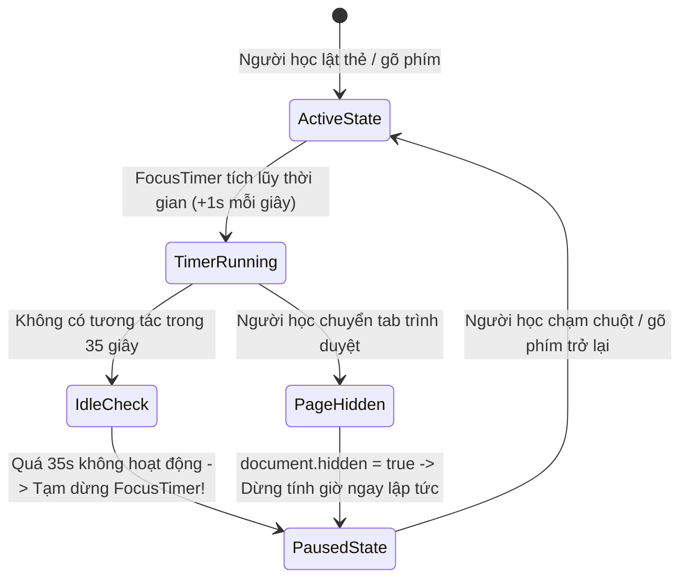

# 🚀 TÀI LIỆU 17: TRỤ CỘT 4 — PIPELINE THU THẬP DỮ LIỆU TỰ ĐỘNG & ĐỘNG LỰC HỌC TẬP BỀN VỮNG
## Dự án: Japanese SRS System · 記憶道 (FSRS Cognitive Spaced Repetition Engine)
## Cấp độ: Extension Engineering & Behavioral Economics Blueprint (Tầng 1 - L1)
## Trọng tâm: Single-Gesture Chrome Extension, Bộ lọc Sư phạm i+1 & Gamification Dựa Trên Nỗ Lực Nhận Thức (MED)

---

> [!IMPORTANT]
> Tài liệu này thiết kế kiến trúc toàn vẹn cho hai thành phần quan trọng:
> 1. **Cầu nối nạp dữ liệu từ thế giới thực (Real-world Mining Bridge)**: Tiện ích trình duyệt Chrome Extension Manifest V3 bóc tách câu văn 1 thao tác (hỗ trợ cả văn bản web và phụ đề YouTube trực tiếp), tự động phân tích hình thái học nhưng vẫn bảo toàn tuyệt đối quyền làm chủ nhận thức của người học (Cognitive Ownership).
> 2. **Kinh tế học hành vi & Chống gian lận (Behavioral Anti-Cheat Engine)**: Xóa bỏ cơ chế điểm danh giữ streak rỗng tuếch, thay thế bằng mô hình thưởng dựa trên Liều lượng Nhận thức Tối thiểu (Minimum Effective Dose - MED) với thuật toán phát hiện trạng thái treo máy (Idle Detection).

---

## 1. TIỆN ÍCH TRÌNH DUYỆT BÓC TÁCH 1 THAO TÁC (CHROME EXTENSION MANIFEST V3)

### 1.1. Cấu Trúc Toàn Văn `manifest.json` (Chuẩn Chrome/Edge Store)

```json
{
  "manifest_version": 3,
  "name": "記憶道 (Kiokudo) - Japanese SRS Smart Miner",
  "version": "1.0.0",
  "description": "Bóc tách câu văn tiếng Nhật 1 chạm từ NHK Easy và YouTube đưa thẳng vào hệ thống FSRS SRS",
  "permissions": ["activeTab", "storage", "contextMenus"],
  "host_permissions": ["https://*/*", "http://*/*"],
  "background": {
    "service_worker": "background.js"
  },
  "content_scripts": [
    {
      "matches": ["<all_urls>"],
      "js": ["content.js"],
      "css": ["overlay.css"]
    }
  ],
  "commands": {
    "capture-sentence": {
      "suggested_key": {
        "default": "Alt+S",
        "mac": "Command+Shift+K"
      },
      "description": "Bóc tách câu văn tiếng Nhật đang bôi đen"
    }
  },
  "action": {
    "default_popup": "popup.html",
    "default_icon": "icons/icon128.png"
  }
}
```

---

### 1.2. Kỹ Thuật Bóc Tách Phụ Đề YouTube & Trang Báo Nhật (Content Script Logic)
Content Script hỗ trợ 2 nguồn tương tác trực tiếp:
1. **Văn bản thông thường (NHK News Web Easy, Matcha, Asahi...)**:
   - Sử dụng `window.getSelection()`.
   - Mở rộng vùng chọn để bao trọn vẹn dấu chấm câu tiếng Nhật (`。` hoặc `！` hoặc `？`), bảo đảm câu văn trích xuất luôn có ngữ cảnh ngữ pháp hoàn chỉnh.
2. **Phụ đề YouTube đang chạy (YouTube Live Captions Capture)**:
   - Khi người học đang xem anime/video tiếng Nhật trên YouTube và bấm `Alt+S`:
   - Content script tự động truy vấn selector phụ đề: `.ytp-caption-segment` hoặc `.caption-window`.
   - Ghép các segment phụ đề trong khoảng thời gian $\pm 2$ giây hiện tại để tạo thành câu hoàn chỉnh kèm timestamp video.

```javascript
// content.js - Trích xuất câu văn ngữ cảnh thông minh
function extractJapaneseContext() {
  // 1. Kiểm tra nếu có bôi đen văn bản trực tiếp
  const selection = window.getSelection().toString().trim();
  if (selection.length > 0) {
    return selection;
  }

  // 2. Nếu đang ở trên trang YouTube và có phụ đề đang hiển thị
  if (window.location.hostname.includes('youtube.com')) {
    const captionElements = document.querySelectorAll('.ytp-caption-segment');
    if (captionElements.length > 0) {
      const captionText = Array.from(captionElements).map(el => el.textContent).join(' ');
      return captionText.trim();
    }
  }

  return null;
}
```

---

### 1.3. Giao diện Popup Đồng Sáng Tạo (Co-Creation Modal)
Để duy trì **Quyền sở hữu nhận thức (Cognitive Ownership)**, học viên phải là người đưa ra quyết định cuối cùng:
- **Hiển thị trực quan**:
  - Từ mục tiêu: `妥協` (だきょう) [0 - 平板]
  - Câu ngữ cảnh: `「両チームが条件を【妥協】して合意に達した。」`
  - Nghĩa sơ bộ: `thỏa hiệp`
  - Thành tố chữ Hán: Gồm chữ `妥` (thỏa đáng) và `協` (hợp lực).
- **Hành động 1 chạm**:
  - Nút `[✨ Xác nhận nạp vào FSRS]` $\rightarrow$ Thẻ được lưu vào DB với trạng thái `active`.
  - Nút `[✏️ Sửa nghĩa / Chỉnh câu]` $\rightarrow$ Cho phép chỉnh sửa theo ý người học.

---

## 2. CƠ CHẾ THƯỞNG DỰA TRÊN NỖ LỰC NHẬN THỨC (EFFORT-BASED GAMIFICATION)

### 2.1. Phê phán Cơ chế Thưởng Hiện diện (The Flaw of Presence-Based Streaks)
Các ứng dụng ngôn ngữ đại trà (như Duolingo) lạm dụng cơ chế Streak: chỉ cần mở app bấm bừa 1 thẻ là giữ được chuỗi. Điều này dẫn đến:
1. **Ảo tưởng nỗ lực (False Effort)**: Học viên nghĩ mình đang tiến bộ nhưng thực chất não bộ không có sự tái cấu trúc khớp thần kinh.
2. **Lo âu chuỗi ngày (Streak Anxiety)**: Khi đứt chuỗi vì bận rộn, người học cảm thấy mất hết động lực và bỏ cuộc hoàn toàn.

---

### 2.2. Khái niệm Liều lượng Nhận thức Tối thiểu (Minimum Effective Dose - MED)
Trong y khoa và thể thao, MED là liều lượng nhỏ nhất tạo ra sự thích nghi sinh học. Trong học tập tiếng Nhật:
- **Liều lượng MED chuẩn**:
  - Duy trì một phiên ôn tập tập trung liên tục tối thiểu **5 phút**.
  - Hoàn thành tối thiểu **15 lượt truy xuất thành công** có kiểm soát độ trễ.
  - Tham gia tối thiểu **2 thử thách nhận thức bậc cao** (Generative Cloze hoặc Elaborative Interrogation).

---

### 2.3. Thuật Toán Chống Gian Lận Trạng Thái Treo Máy (Cognitive Anti-Idle Monitor)
Nếu học viên mở ứng dụng rồi bỏ đi làm việc khác, hệ thống sẽ KHÔNG tính thời gian này vào MED. Thuật toán giám sát sự tập trung tích cực (Active Focus):



**Quy tắc Nghiệm thu Phiên MED (MED Evaluation Function)**:

```typescript
export interface FocusSessionTelemetry {
  activeDurationSeconds: number; // Tổng thời gian thực sự tương tác
  idlePausesCount: number; // Số lần bị tạm dừng do treo máy
  retrievalsCount: number; // Tổng số lượt thẻ đã ôn
  highOrderTasksCount: number; // Số lượt gõ tạo sinh hoặc tự giải thích
}

export function evaluateMEDStatus(session: FocusSessionTelemetry): { isMedAchieved: boolean; creditsAwarded: number } {
  const isTimeQualified = session.activeDurationSeconds >= 300; // Đủ 5 phút tập trung
  const isRetrievalsQualified = session.retrievalsCount >= 15; // Đủ 15 thẻ
  const isHighOrderQualified = session.highOrderTasksCount >= 2; // Có tối thiểu 2 bài tập bậc cao

  if (isTimeQualified && isRetrievalsQualified && isHighOrderQualified) {
    // Đạt chuẩn MED Vàng
    const credits = 25 + session.highOrderTasksCount * 5;
    return { isMedAchieved: true, creditsAwarded: credits };
  }

  if (isTimeQualified && isRetrievalsQualified) {
    // Đạt chuẩn MED Cơ bản
    return { isMedAchieved: true, creditsAwarded: 10 };
  }

  // Chưa đạt chuẩn
  return { isMedAchieved: false, creditsAwarded: 0 };
}
```

---

### 2.4. Bảng Định Mức Tiêu Dùng Hạn Ngạch AI (Cognitive Credit Burn Rate)
Hạn ngạch AI thưởng được sử dụng cho các đặc quyền cao cấp:

| Tính Năng Mở Khóa | Chi Phí (Credits) | Giá Trị Nhận Thức Mang Lại |
| :--- | :---: | :--- |
| **Phân Tích Thơ Haiku & Ngữ Cảnh Cổ Điển** | `15 Credits` | Giúp hiểu chiều sâu văn hóa của từ vựng qua văn học Nhật. |
| **Sinh Truyện Ngắn Tương Tác (Co-Story)** | `40 Credits` | AI sáng tác 1 câu chuyện ngắn 300 từ chứa toàn bộ các từ hay quên của người học trong tuần. |
| **Mở Rộng Gia Tộc Chữ Hán Chuyên Sâu** | `20 Credits` | Tự động bóc tách và phân tích trọn vẹn 10 chữ Hán họ hàng hiếm gặp. |

---

## 3. BẢNG CHECKLIST KIỂM THỬ TỰ ĐỘNG CHO TRỤ CỘT 4

- [ ] **TC-P4-01**: Bôi đen câu tiếng Nhật trên trình duyệt và bấm `Alt+S`: Popup hiển thị đúng bản nháp trong $< 600$ms.
- [ ] **TC-P4-02**: Thử nghiệm câu văn chứa 3 từ mới (vi phạm $i+1$): Backend cảnh báo quá tải nhận thức và đề xuất câu ngắn gọn hơn.
- [ ] **TC-P4-03**: Giả lập học viên mở tab ôn tập rồi treo máy 2 phút: `FocusTimer` tự động đóng băng ở giây thứ 35, không tính gian lận giờ học.
- [ ] **TC-P4-04**: Hoàn thành phiên học 5 phút với 18 thẻ và 2 câu tạo sinh: Hệ thống hiển thị huy hiệu `満願成就 (Mãn nguyện thành tựu)` và cộng `35 Cognitive Credits` vào tài khoản.
