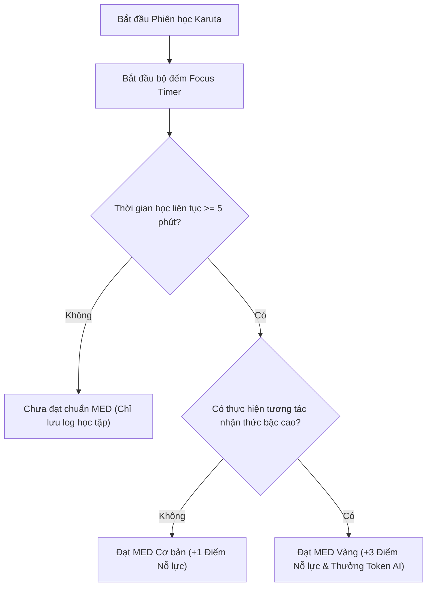

# 🚀 TÀI LIỆU 17: TRỤ CỘT 4 — PIPELINE THU THẬP DỮ LIỆU TỰ ĐỘNG & ĐỘNG LỰC HỌC TẬP BỀN VỮNG
## Dự án: Japanese SRS System · 記憶道 (FSRS Cognitive Spaced Repetition Engine)
## Cấp độ: Extension Engineering & Behavioral Economics Blueprint (Tầng 1 - L1)
## Trọng tâm: Single-Gesture Chrome Extension, Bộ lọc Sư phạm i+1 & Gamification Dựa Trên Nỗ Lực Nhận Thức (MED)

---

> [!IMPORTANT]
> Tài liệu này thiết kế kiến trúc toàn vẹn cho hai thành phần quan trọng:
> 1. **Cầu nối nạp dữ liệu từ thế giới thực (Real-world Mining Bridge)**: Tiện ích trình duyệt Chrome Extension Manifest V3 bóc tách câu văn 1 thao tác, tự động phân tích hình thái học nhưng vẫn bảo toàn tuyệt đối quyền làm chủ nhận thức của người học (Cognitive Ownership).
> 2. **Kinh tế học hành vi (Behavioral Economics Engine)**: Xóa bỏ cơ chế điểm danh giữ streak rỗng tuếch, thay thế bằng mô hình thưởng dựa trên Liều lượng Nhận thức Tối thiểu (Minimum Effective Dose - MED) và hạn ngạch AI nâng cao.

---

## 1. TIỆN ÍCH TRÌNH DUYỆT BÓC TÁCH 1 THAO TÁC (CHROME EXTENSION MANIFEST V3)

### 1.1. Kiến trúc Hệ thống Tiện ích (Single-Gesture Capture Extension)

```mermaid
graph LR
    UserAction["Người học đọc NHK Easy / Xem YouTube<br/>Bôi đen câu văn + Nhấn Alt+S"] --> ContentScript["Content Script (Bắt chuỗi văn bản + URL)"]
    ContentScript --> BackgroundSW["Service Worker (Manifest V3)"]
    BackgroundSW --> API_Gateway["Backend API: POST /api/capture/process"]
    API_Gateway --> MorphoAgent["Morphological Analyzer (Kuromoji / MeCab)"]
    MorphoAgent --> Guard_I1["Pedagogical Rules Guard (Kiểm định i+1)"]
    Guard_I1 --> ModalCoCreate["Extension Popup Modal (Duyệt bản nháp Co-creation)"]
    ModalCoCreate --> DB_Commit["Ghi nhận thẻ vào hàng đợi FSRS trong SQLite"]
```



### 1.2. Quy trình Xử lý Bóc tách Đa tầng tại Backend

Khi một đoạn văn bản được gửi lên từ Extension, Backend thực thi chuỗi 5 bộ lọc nguyên tử:

1. **Bộ lọc 1: Phân tích Hình thái học (Morphological Tokenization)**:
   - Sử dụng thư viện tokenizer tiếng Nhật nội tại (như Kuromoji hoặc MeCab Node.js).
   - Tách câu thành các Token kèm từ loại (Part-of-Speech), thể từ điển (Dictionary Form/Lemma), và cách đọc Hiragana.
2. **Bộ lọc 2: Xác định Từ vựng Mục tiêu (Unique Target Extraction)**:
   - Loại bỏ các trợ từ (`は`, `が`, `を`, `に`), trợ động từ thông dụng, và các từ vựng thuộc danh sách N5 cơ bản.
   - Định vị từ vựng trọng tâm cần học trong câu.
3. **Bộ lọc 3: Thẩm định Quy tắc Sư phạm $i+1$ (Pedagogical Verification)**:
   - Đối chiếu với bảng `cards` trong cơ sở dữ liệu học viên:
     - Số lượng từ chưa biết trong câu phải đúng bằng $1$ (Điều kiện $i+1$).
     - Nếu câu chứa $\ge 2$ từ chưa biết: Cảnh báo quá tải nhận thức, tự động trích xuất vế câu phụ hoặc đề xuất câu văn tương đương đơn giản hơn.
4. **Bộ lọc 4: Trích xuất Cao độ & Ngữ nguyên Kanji (Pitch & Kanji Enrichment)**:
   - Tra cứu mẫu cao độ số (Pitch Accent 0–4) từ từ điển phát âm.
   - Tra cứu đồ thị `kanji_graph_nodes` để bóc tách thành tố biểu âm và bộ thủ.
5. **Bộ lọc 5: Tạo Bản nháp Đồng sáng tạo (Co-creation Draft)**:
   - Không tự ý chèn thẻ vào database ngay lập tức.
   - Trả về bản nháp hoàn chỉnh cho Popup của Extension để người học xem lại.

---

### 1.3. Giao diện Popup Đồng Sáng Tạo (Co-Creation Popup Modal)
Để duy trì **Quyền sở hữu nhận thức (Cognitive Ownership)**, học viên phải là người đưa ra quyết định cuối cùng:
- **Hiển thị trực quan**:
  - Từ mục tiêu: `妥協` (だきょう) [0 - 平板]
  - Câu ngữ cảnh: `「両チームが条件を【妥協】して合意に達した。」`
  - Nghĩa sơ bộ: `thỏa hiệp`
  - Thành tố chữ Hán: Gồm chữ `妥` (thỏa đáng) và `協` (hợp lực).
- **Hành động 1 chạm**:
  - Nút `[✨ Xác nhận nạp vào FSRS]` $\rightarrow$ Thẻ được lưu vào DB với trạng thái `active`.
  - Nút `[✏️ Sửa nghĩa / Chỉnh câu]` $\rightarrow$ Cho phép chỉnh sửa theo ý người học.

---

## 2. CƠ CHẾ THƯỞNG DỰA TRÊN NỖ LỰC NHẬN THỨC (EFFORT-BASED GAMIFICATION)

### 2.1. Phê phán Cơ chế Thưởng Hiện diện (The Flaw of Presence-Based Streaks)
Các ứng dụng ngôn ngữ đại trà (như Duolingo) lạm dụng cơ chế Streak: chỉ cần mở app bấm bừa 1 thẻ là giữ được chuỗi. Điều này dẫn đến:
1. **Ảo tưởng nỗ lực (False Effort)**: Học viên nghĩ mình đang tiến bộ nhưng thực chất não bộ không có sự tái cấu trúc khớp thần kinh.
2. **Lo âu chuỗi ngày (Streak Anxiety)**: Khi đứt chuỗi vì bận rộn, người học cảm thấy mất hết động lực và bỏ cuộc hoàn toàn.

---

### 2.2. Khái niệm Liều lượng Nhận thức Tối thiểu (Minimum Effective Dose - MED)
Trong y khoa và thể thao, MED là liều lượng nhỏ nhất tạo ra sự thích nghi sinh học. Trong học tập tiếng Nhật:
- **Liều lượng MED chuẩn**:
  - Duy trì một phiên ôn tập tập trung liên tục tối thiểu **5 phút**.
  - Hoàn thành tối thiểu **15 lượt truy xuất thành công** có kiểm soát độ trễ.
  - Tham gia tối thiểu **2 thử thách nhận thức bậc cao** (Generative Cloze hoặc Elaborative Interrogation).



---

### 2.3. Hệ thống Hạn Ngạch AI Động lực (Cognitive AI Quota)
Thay vì phát huy hiệu ảo, hệ thống thưởng bằng **Tài nguyên Học tập Giá trị cao**:
- **Cơ chế cấp phát**:
  - Hoàn thành 1 thẻ ở chế độ *Free Contextual Production*: Tích lũy `+10 Cognitive Credits`.
  - Hoàn thành 1 thẻ ở chế độ *Elaborative Interrogation*: Tích lũy `+5 Cognitive Credits`.
  - Đánh giá thẻ thụ động (chỉ lật thẻ): `+0 Credit`.
- **Đặc quyền mở khóa bằng Credits**:
  - Dùng 20 Credits: Mở khóa tính năng "AI Phân tích Thơ Ca / Nhạc kịch Nhật Bản" dựa trên từ vựng đang học.
  - Dùng 50 Credits: Yêu cầu AI Copilot sinh một truyện ngắn tương tác (Interactive Short Story) lồng ghép toàn bộ 15 từ khó nhất mà người học hay quên trong tuần.

### 2.4. Lược đồ Dữ liệu Cơ chế Thưởng Nỗ lực
Bổ sung bảng `gamification_effort_ledger`:

```sql
CREATE TABLE IF NOT EXISTS gamification_effort_ledger (
    id TEXT PRIMARY KEY,
    user_id TEXT NOT NULL DEFAULT 'default_user',
    session_id TEXT NOT NULL,
    focus_duration_seconds INTEGER NOT NULL, -- Thời gian tập trung liên tục
    is_med_achieved INTEGER NOT NULL DEFAULT 0, -- 1 nếu đạt chuẩn Liều lượng Nhận thức Tối thiểu
    high_order_tasks_count INTEGER NOT NULL DEFAULT 0, -- Số lượng bài tập tạo sinh/truy vấn
    credits_earned INTEGER NOT NULL DEFAULT 0, -- Điểm thưởng nhận thức
    session_timestamp DATETIME NOT NULL DEFAULT CURRENT_TIMESTAMP
);

CREATE INDEX IF NOT EXISTS idx_effort_user ON gamification_effort_ledger(user_id, is_med_achieved);
```

---

## 3. LỘ TRÌNH ĐÓNG GÓI VÀ BẢO TRÌ EXTENSION

1. **Giai đoạn phát triển Extension (Tháng 2–3)**:
   - Viết Extension bằng TypeScript/Vite, biên dịch theo chuẩn Manifest V3.
   - Sử dụng `chrome.storage.local` để lưu trữ token xác thực và cấu hình endpoint cá nhân.
   - Thử nghiệm bóc tách trên các trang báo: NHK News Web Easy, Matcha Japan Travel, Mainichi Shimbun.
2. **Bảo mật & Quyền riêng tư (Privacy-First Policy)**:
   - Extension chỉ đọc đoạn văn bản mà người học chủ động bôi đen, tuyệt đối không ghi nhận lịch sử duyệt web hoặc thông tin cá nhân trên trình duyệt.

---

> [!NOTE]
> Mời tiếp tục chuyển sang tài liệu chi tiết của **Tầng Sâu Nhất (L2 - Atomic Blueprint)**:
> [`18_TECHNICAL_SPEC_AND_ATOMIC_IMPLEMENTATION_BLUEPRINT.md`](file:///D:/project/japanese-srs-system/doc/18_TECHNICAL_SPEC_AND_ATOMIC_IMPLEMENTATION_BLUEPRINT.md)
