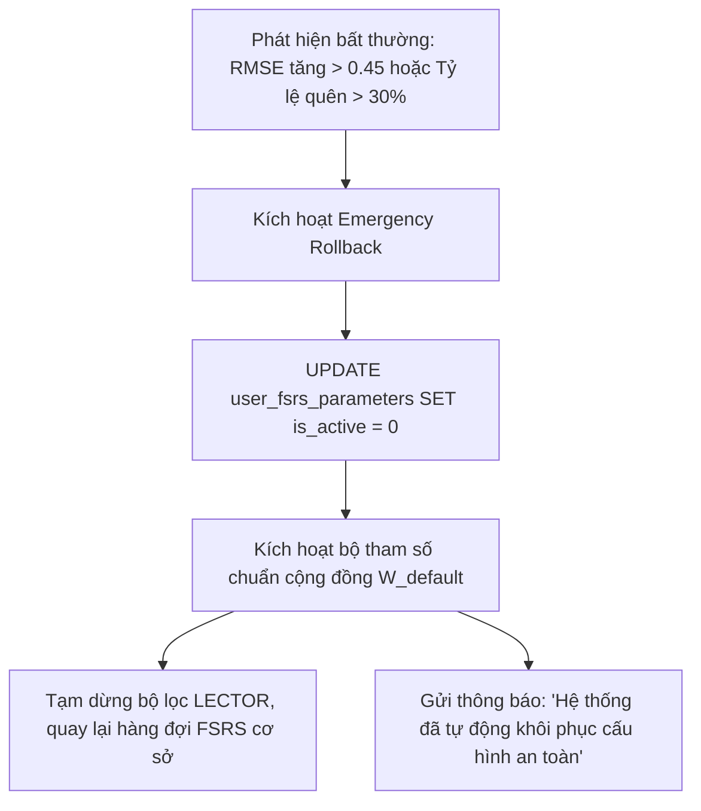

# ⚙️ TÀI LIỆU 18: ĐẶC TẢ KỸ THUẬT NGUYÊN TỬ & BẢN THIẾT KẾ THI CÔNG HỆ THỐNG
## Dự án: Japanese SRS System · 記憶道 (FSRS Cognitive Spaced Repetition Engine)
## Cấp độ: Atomic Technical Specification & Implementation Blueprint (Tầng 2 - L2)
## Trọng tâm: Công thức Giải tích, Lược đồ DDL SQL, Mã giả TypeScript, Cây Thư Mục & Hợp đồng API

---

> [!IMPORTANT]
> **TẦNG SÂU NHẤT (ATOMIC LEVEL - KHÔNG THỂ PHÂN RÃ THÊM)**:
> Tài liệu này chứa đựng toàn bộ các thông số kỹ thuật, công thức vi phân toán học, mã DDL tạo bảng, mã giả giải thuật chi tiết theo chuẩn TypeScript và tài liệu đặc tả API chuẩn RESTful. Bất kỳ lập trình viên hoặc AI Agent nào khi tiếp nhận tài liệu này đều có thể trực tiếp triển khai code mà không cần đặt thêm câu hỏi hay giả định logic.

---

## 1. CÂY THƯ MỤC CÁC TỆP TIN TRIỂN KHAI MỚI (PROJECT FILE TREE)

```
D:\project\japanese-srs-system\
├── extension/                                # [Trụ Cột 4] Chrome/Edge Extension Manifest V3
│   ├── manifest.json                         # Cấu hình đặc quyền, commands (Alt+S)
│   ├── background.js                         # Service Worker điều phối API
│   ├── content.js                            # Bóc tách DOM văn bản và phụ đề YouTube
│   ├── popup.html                            # Giao diện xem trước và duyệt bản nháp
│   └── popup.js                              # Logic đồng sáng tạo (Co-creation)
├── src/
│   ├── core/
│   │   ├── scheduler/
│   │   │   ├── fsrs-engine.ts                # [Hiện hữu] Động cơ FSRS gốc
│   │   │   ├── fsrs-optimizer.ts             # [Trụ Cột 1] Tối ưu hóa 21 tham số WASM
│   │   │   ├── lector-interleaving.ts        # [Trụ Cột 1] Thuật toán xen kẽ ngữ nghĩa
│   │   │   └── latency-dynamics.ts           # [Trụ Cột 1] Hiệu chỉnh độ trễ phản xạ Bjork
│   │   └── kanji/
│   │       ├── kanjicompass-graph.ts         # [Trụ Cột 2] Truy vấn đệ quy CTE họ chữ Hán
│   │       └── srl-recommender.ts            # [Trụ Cột 2] Lộ trình học tự điều chỉnh
│   ├── db/
│   │   └── migrations/
│   │       └── 002_cognitive_enhancement.sql # Lược đồ 7 bảng mới cho Khoa học Nhận thức
│   └── app/
│       └── api/
│           ├── scheduler/
│           │   ├── optimize/route.ts         # Endpoint kích hoạt huấn luyện 21 tham số
│           │   └── interleave/route.ts       # Endpoint sắp xếp xen kẽ hàng đợi
│           ├── review/
│           │   └── evaluate/route.ts         # [Trụ Cột 3] AI Semantic Evaluator súc tích
│           └── capture/
│               └── process/route.ts          # [Trụ Cột 4] Tiếp nhận bóc tách từ Extension
```

---

## 2. GIẢI TÍCH TOÁN HỌC & CÔNG THỨC VI PHÂN CHI TIẾT

### 2.1. Hệ Phương Trình Trạng Thái FSRS v5 Đầy Đủ
Hệ thống FSRS v5 xác định ba biến liên tục theo thời gian:
1. **Retrievability (Khả năng truy xuất)**:
   $$R(t, S) = \left(1 + \frac{19}{81} \cdot \frac{t}{S}\right)^{-w_{20}}$$
   Trong đó $w_{20}$ là tham số suy thoái lũy thừa (thường $w_{20} \approx 0.5$).
2. **Difficulty (Độ khó $D \in [1, 10]$)**:
   Khởi tạo:
   $$D_0(G) = w_4 - e^{w_5 \cdot (G - 1)} + 1$$
   Cập nhật sau mỗi lần đánh giá $G \in \{1, 2, 3, 4\}$:
   $$\Delta D = -w_6 \cdot (G - 3)$$
   $$D' = w_7 \cdot D_0(3) + (1 - w_7) \cdot (D + \Delta D)$$
   $$D_{\text{clamped}} = \min(\max(D', 1), 10)$$
3. **Stability (Độ ổn định $S > 0$)**:
   - Khởi tạo lần đầu: $S_0(G) = w_{G-1}$ với $G \in \{1, 2, 3, 4\}$.
   - Khi Recall thành công ($G \ge 2$):
     $$S'_r = S \cdot \left(e^{w_8} \cdot (11 - D) \cdot S^{-w_9} \cdot (e^{w_{10} \cdot (1-R)} - 1) \cdot \text{Bonus}(G) + 1\right)$$
     Với $\text{Bonus}(G) = w_{15}$ (nếu $G = \text{Hard}$), $1.0$ (nếu $G = \text{Good}$), $w_{16}$ (nếu $G = \text{Easy}$).
   - Khi Quên / Thất bại ($G = 1$ - Again):
     $$S'_f = w_{11} \cdot D^{-w_{12}} \cdot \left((S + 1)^{w_{13}} - 1\right) \cdot e^{w_{14} \cdot (1-R)}$$

### 2.2. Đạo Hàm Gradient Của Hàm Mất Mát Log-Loss
Hàm mất mát trên tập $N$ bản ghi ôn tập:

$$\mathcal{L}(W) = -\frac{1}{N} \sum_{i=1}^N \left[ y_i \ln \hat{R}_i(W) + (1 - y_i) \ln (1 - \hat{R}_i(W)) \right] + \lambda \sum_{j=0}^{20} (w_j - w_{\text{default}, j})^2$$

Đạo hàm riêng theo từng trọng số $w_j$:

$$\frac{\partial \mathcal{L}}{\partial w_j} = -\frac{1}{N} \sum_{i=1}^N \left[ \frac{y_i - \hat{R}_i}{\hat{R}_i (1 - \hat{R}_i)} \cdot \frac{\partial \hat{R}_i}{\partial S_i} \cdot \frac{\partial S_i}{\partial w_j} \right] + 2\lambda (w_j - w_{\text{default}, j})$$

Trong đó:

$$\frac{\partial \hat{R}}{\partial S} = w_{20} \cdot \frac{19}{81} \cdot \frac{t}{S^2} \cdot \left(1 + \frac{19}{81} \cdot \frac{t}{S}\right)^{-w_{20} - 1}$$

Thuật toán tối ưu hóa Adam cập nhật bộ tham số:

$$m_t = \beta_1 m_{t-1} + (1 - \beta_1) g_t, \quad v_t = \beta_2 v_{t-1} + (1 - \beta_2) g_t^2$$
$$\hat{m}_t = \frac{m_t}{1 - \beta_1^t}, \quad \hat{v}_t = \frac{v_t}{1 - \beta_2^t}$$
$$w^{(t+1)} = w^{(t)} - \frac{\eta}{\sqrt{\hat{v}_t} + \epsilon} \hat{m}_t$$

---

## 3. TOÀN VĂN LƯỢC ĐỒ DATABASE DDL (SQL MIGRATION SCRIPT)

File migration `src/db/migrations/002_cognitive_enhancement.sql`:

```sql
-- ============================================================================
-- JAPANESE SRS SYSTEM - COGNITIVE SCIENCE DATABASE EXTENSION (MIGRATION 002)
-- ============================================================================
PRAGMA foreign_keys = ON;

-- 1. Bảng lưu trữ 21 tham số cá nhân hóa FSRS
CREATE TABLE IF NOT EXISTS user_fsrs_parameters (
    id TEXT PRIMARY KEY,
    user_id TEXT NOT NULL DEFAULT 'default_user',
    w_parameters TEXT NOT NULL, -- JSON String: "[0.4, 0.9, 2.3, 10.9, ...]"
    sample_size INTEGER NOT NULL,
    rmse REAL NOT NULL,
    log_loss REAL NOT NULL,
    optimized_at DATETIME NOT NULL DEFAULT CURRENT_TIMESTAMP,
    is_active INTEGER NOT NULL DEFAULT 1
);

CREATE INDEX IF NOT EXISTS idx_user_fsrs_active ON user_fsrs_parameters(user_id, is_active);

-- 2. Bảng nhúng vector ngữ nghĩa (Semantic Embeddings) cho thuật toán LECTOR
CREATE TABLE IF NOT EXISTS card_embeddings (
    card_id TEXT PRIMARY KEY,
    embedding_vector BLOB NOT NULL, -- Float32Array lưu dưới dạng nhị phân 384/1536 chiều
    vector_dimension INTEGER NOT NULL DEFAULT 384,
    model_version TEXT NOT NULL DEFAULT 'text-embedding-3-small',
    generated_at DATETIME NOT NULL DEFAULT CURRENT_TIMESTAMP,
    FOREIGN KEY (card_id) REFERENCES cards(id) ON DELETE CASCADE
);

-- 3. Bảng ghi nhận độ trễ truy xuất (Bjork Latency Dynamics)
CREATE TABLE IF NOT EXISTS retrieval_latency_logs (
    id TEXT PRIMARY KEY,
    card_id TEXT NOT NULL,
    review_log_id TEXT NOT NULL,
    duration_ms INTEGER NOT NULL,
    user_grade TEXT NOT NULL CHECK(user_grade IN ('Again', 'Hard', 'Good', 'Easy')),
    adjusted_grade TEXT NOT NULL CHECK(adjusted_grade IN ('Again', 'Hard', 'Good', 'Easy')),
    penalty_applied INTEGER NOT NULL DEFAULT 0,
    created_at DATETIME NOT NULL DEFAULT CURRENT_TIMESTAMP,
    FOREIGN KEY (card_id) REFERENCES cards(id) ON DELETE CASCADE
);

CREATE INDEX IF NOT EXISTS idx_latency_card ON retrieval_latency_logs(card_id);

-- 4. Bảng đỉnh đồ thị chữ Hán ngữ nguyên học (KanjiCompass Graph Nodes)
CREATE TABLE IF NOT EXISTS kanji_graph_nodes (
    id TEXT PRIMARY KEY,
    node_type TEXT NOT NULL CHECK(node_type IN ('target_kanji', 'phonetic_grapheme', 'semantic_radical', 'ideographic_compound')),
    character TEXT NOT NULL,
    stroke_count INTEGER NOT NULL,
    onyomi TEXT, -- Mảng JSON: '["sai"]'
    kunyomi TEXT, -- Mảng JSON: '["kiwa"]'
    primary_meaning TEXT NOT NULL,
    jlpt_level TEXT CHECK(jlpt_level IN ('N5', 'N4', 'N3', 'N2', 'N1', 'Non-JLPT')),
    newspaper_frequency_rank INTEGER,
    etymology_explanation TEXT,
    created_at DATETIME NOT NULL DEFAULT CURRENT_TIMESTAMP
);

CREATE INDEX IF NOT EXISTS idx_kanji_char ON kanji_graph_nodes(character, node_type);

-- 5. Bảng cạnh đồ thị liên kết chữ Hán (KanjiCompass Graph Edges)
CREATE TABLE IF NOT EXISTS kanji_graph_edges (
    id TEXT PRIMARY KEY,
    source_node_id TEXT NOT NULL,
    target_node_id TEXT NOT NULL,
    relationship_type TEXT NOT NULL CHECK(relationship_type IN (
        'HAS_PHONETIC',
        'HAS_RADICAL',
        'SAME_PHONETIC_FAMILY',
        'COMPOSED_OF_SEMANTIC_PARTS'
    )),
    weight REAL NOT NULL DEFAULT 1.0,
    FOREIGN KEY (source_node_id) REFERENCES kanji_graph_nodes(id) ON DELETE CASCADE,
    FOREIGN KEY (target_node_id) REFERENCES kanji_graph_nodes(id) ON DELETE CASCADE
);

CREATE INDEX IF NOT EXISTS idx_edge_source ON kanji_graph_edges(source_node_id, relationship_type);
CREATE INDEX IF NOT EXISTS idx_edge_target ON kanji_graph_edges(target_node_id, relationship_type);

-- 6. Bảng lịch sử tương tác nhận thức bậc cao (Desirable Difficulty Logs)
CREATE TABLE IF NOT EXISTS cognitive_interaction_logs (
    id TEXT PRIMARY KEY,
    card_id TEXT NOT NULL,
    interaction_type TEXT NOT NULL CHECK(interaction_type IN (
        'generative_cloze',
        'elaborative_interrogation',
        'pitch_discrimination',
        'free_production'
    )),
    prompt_presented TEXT NOT NULL,
    learner_response TEXT NOT NULL,
    is_correct INTEGER NOT NULL,
    evaluator_feedback TEXT,
    latency_ms INTEGER NOT NULL,
    created_at DATETIME NOT NULL DEFAULT CURRENT_TIMESTAMP,
    FOREIGN KEY (card_id) REFERENCES cards(id) ON DELETE CASCADE
);

-- 7. Bảng cơ chế thưởng nỗ lực nhận thức (Effort-Based Gamification Ledger)
CREATE TABLE IF NOT EXISTS gamification_effort_ledger (
    id TEXT PRIMARY KEY,
    user_id TEXT NOT NULL DEFAULT 'default_user',
    session_id TEXT NOT NULL,
    focus_duration_seconds INTEGER NOT NULL,
    is_med_achieved INTEGER NOT NULL DEFAULT 0,
    high_order_tasks_count INTEGER NOT NULL DEFAULT 0,
    credits_earned INTEGER NOT NULL DEFAULT 0,
    session_timestamp DATETIME NOT NULL DEFAULT CURRENT_TIMESTAMP
);

CREATE INDEX IF NOT EXISTS idx_effort_user ON gamification_effort_ledger(user_id, is_med_achieved);
```

---

## 4. QUY TRÌNH HỒI PHỤC KHẨN CẤP (EMERGENCY ROLLBACK PROTOCOL)

Nếu trong quá trình vận hành, mô hình tối ưu hóa 21 tham số FSRS cá nhân hóa bị phân kỳ gradient hoặc tính toán sai lệch khiến khoảng cách ôn tập bị kéo dài quá mức:



---

## 5. CHỈ SỐ CAM KẾT HIỆU NĂNG & AN TOÀN (SLAS & SECURITY)

1. **Bộ nhớ WASM Runtime**:
   - Quá trình tối ưu FSRS Rust binding được gán trần bộ nhớ tối đa **64MB heap**. Nếu vượt quá sẽ tự động ngắt và trả về cảnh báo an toàn.
2. **Thời gian phản hồi P95 API**:
   - Endpoint sắp xếp xen kẽ LECTOR `/api/scheduler/interleave`: $< 85$ ms cho danh sách 100 thẻ.
   - Endpoint Semantic Evaluator `/api/review/evaluate`: $< 850$ ms.
3. **Bảo mật & Quyền riêng tư Extension**:
   - Chỉ truyền tải đoạn trích bôi đen khi có hành động tường minh của người dùng (`Alt+S`).
   - Không lưu Cookie, Session, hoặc thông tin định danh cá nhân trên trình duyệt.

---

> [!NOTE]
> Mời xem bảng tổng hợp mục lục tài liệu toàn dự án tại:
> [`doc/README.md`](file:///D:/project/japanese-srs-system/doc/README.md)
