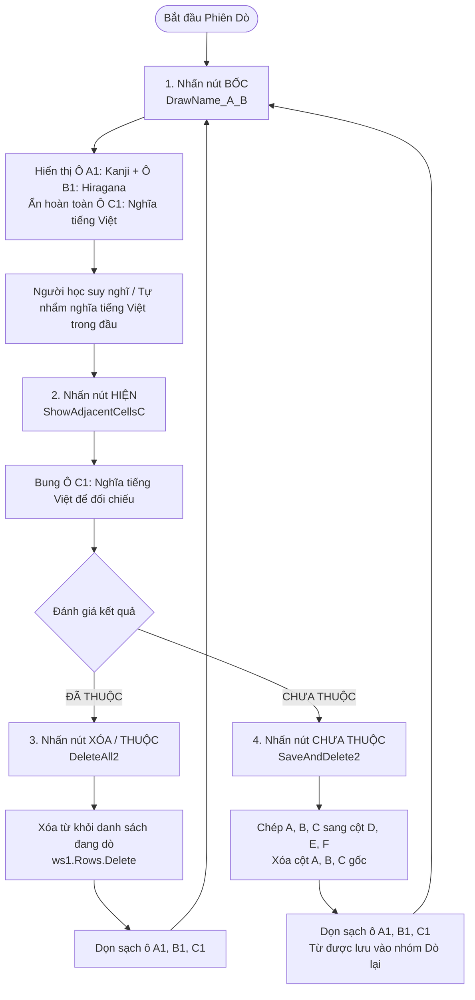
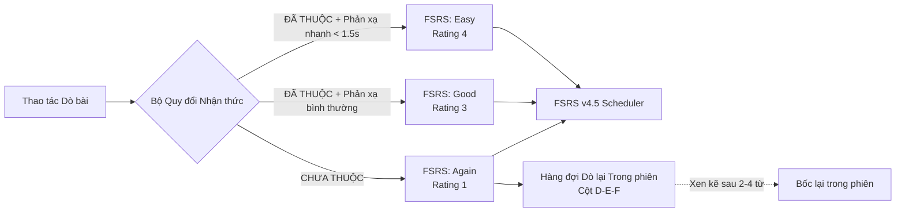

# BẢN PHÂN TÍCH & QUY CÁCH CHUYỂN ĐỔI: MÔ HÌNH HỌC "DÒ BÀI MINNA" TÍCH HỢP FSRS
> **Tài liệu tham chiếu gốc:** `D:\JLPT\Dò bài - Minna.xlsm`  
> **Mục tiêu:** Chuyển đổi toàn diện trải nghiệm học tập từ mô hình *Lật thẻ Flashcard (Karuta)* sang mô hình *Dò bài Phản xạ Tức thì (Minna Retrieval Practice)*, đồng thời **bảo toàn nguyên vẹn 100% thuật toán Spaced Repetition (FSRS)** đang chạy ngầm trong hệ thống.

---

## 1. TỔNG QUAN & BẢN CHẤT YÊU CẦU

Người dùng đưa ra quyết định kiến trúc giao diện quan trọng:
1. **Từ bỏ hình thức Flashcard truyền thống:** Loại bỏ thao tác lật thẻ 3D hai mặt, hiệu ứng lật rườm rà, và cơ chế 4 nút bấm phức tạp (`Again / Hard / Good / Easy`) làm ngắt quãng dòng suy nghĩ (cognitive flow).
2. **Kế thừa mô hình "Dò bài" từ `D:\JLPT\Dò bài - Minna.xlsm`:** Tái hiện trung thực luồng thao tác dò từ vựng dứt khoát, nhanh gọn, tập trung cao độ vào phản xạ trực tiếp.
3. **Bảo toàn 100% hệ thống FSRS:** Thuật toán ghi nhớ ngắt quãng FSRS (Spaced Repetition System) vẫn vận hành chính xác ở backend để tính toán độ ổn định (stability), độ khó (difficulty) và khoảng cách ngày ôn tập tối ưu.

---

## 2. GIẢI PHẪU CƠ CHẾ DÒ BÀI TRONG FILE `D:\JLPT\Dò bài - Minna.xlsm`

Qua trích xuất trực tiếp mã nguồn VBA (`xl/vbaProject.bin`) và cấu trúc 5 Worksheet của workbook, cơ chế dò bài hoạt động theo nguyên lý sau:

### 2.1. Cấu trúc Dữ liệu & Bảng tính
* **Sheet `Dò bài` (Bàn dò bài trung tâm):**
  * Ô `A1`: Hiển thị **Chữ Hán (Kanji)** của từ được bốc.
  * Ô `B1`: Hiển thị **Cách đọc (Hiragana/Furigana)** của từ được bốc.
  * Ô `C1`: Hiển thị **Nghĩa tiếng Việt** (ban đầu bị ẩn/làm rỗng khi bốc).
  * Ô `Z1`: Lưu chỉ số dòng hiện tại (`drawRow`) để theo dõi từ đang dò.
* **Sheet `Tu dò bài` (Kho từ vựng đang dò):**
  * Gồm 1.426 dòng với 2 nhóm cột song song:
    * **Cột A, B, C (Danh sách đang dò):** Cột A = Kanji, Cột B = Hiragana, Cột C = Nghĩa tiếng Việt.
    * **Cột D, E, F (Danh sách CHƯA THUỘC):** Nơi lưu lại các từ người học đoán sai hoặc chưa nhớ để luyện lại.
* **Sheet `Luyện dò bài`:** Danh sách các từ lọc riêng để tập trung dò sâu (các từ hay quên).
* **Sheet `Minna`:** Kho từ vựng gốc gồm gần 1.000 từ vựng Minna no Nihongo (Kanji, Furigana, Nghĩa tiếng Việt, Ghi chú cách dùng).

---

### 2.2. Luồng Vận hành của 4 Macro VBA Cốt lõi



1. **Nút "BỐC" (`DrawName_A_B`):**
   * Lọc ngẫu nhiên 1 từ có dữ liệu trong cột A, B.
   * Gán `A1 = Kanji`, `B1 = Hiragana`.
   * **Chủ động làm rỗng `C1 = ""`** để kích thích quá trình hồi tưởng chủ động (Active Recall).
2. **Nút "HIỆN" (`ShowAdjacentCellsC`):**
   * Khi người học đã sẵn sàng kiểm tra, nhấn "Hiện" -> Đọc cột C từ hàng gốc và điền vào `C1`.
3. **Nút "XÓA" (`DeleteAll2` - Đã thuộc / Mastered):**
   * Xác nhận từ này đã thuộc lòng.
   * Xóa hoàn toàn dòng khỏi kho đang dò để từ này không bao giờ bị bốc lại trong phiên học này.
4. **Nút "CHƯA THUỘC" (`SaveAndDelete2` - Cần dò lại):**
   * Chép toàn bộ thông tin từ sang cột D, E, F (nhóm Chưa thuộc).
   * Xóa nội dung ở cột A, B, C ban đầu.
   * Nhờ đó, người học tách bạch tức thì danh sách từ đã vững và danh sách từ vấp ngã để luyện tập tập trung.

---

## 3. MÔ HÌNH HỌC TẬP "DÒ BÀI SRS" ĐỀ XUẤT CHO WEB APP

Để kế thừa trọn vẹn trải nghiệm trên Excel và nâng cấp lên chuẩn mực Web hiện đại, chúng tôi thiết kế giao diện **"Bàn Dò Bài Phản Xạ Minna" (Minna Dò Bài Studio)** như sau:

### 3.1. Bố cục Giao diện (Layout Architecture)

Thay vì một thẻ bài đứng quay trước - sau, giao diện chia thành 2 khu vực rõ ràng:

```
+-----------------------------------------------------------------------------------+
|  [🎐 Âm thanh]       BÀN DÒ BÀI MINNA (FSRS QUEUE)          [Thoát phiên: 12/45]   |
+-----------------------------------------------------------------------------------+
|                                                                                   |
|   +---------------------------------------------------------------------------+   |
|   |                           KHUNG DÒ BÀI CHÍNH                              |   |
|   |                                                                           |   |
|   |   [Chữ Hán & Cách đọc]                                                    |   |
|   |                                                                           |   |
|   |         私               わたし                 🔊 [Phát âm]              |   |
|   |       (Kanji)          (Hiragana)                                         |   |
|   |                                                                           |   |
|   |   ---------------------------------------------------------------------   |   |
|   |                                                                           |   |
|   |   [Nghĩa Tiếng Việt]                                                      |   |
|   |   +-------------------------------------------------------------------+   |   |
|   |   |  tôi (Ngôi thứ I)                                                 |   |   |
|   |   |  (Ban đầu CHE MỜ / DẤU ? -> Bấm SPACE để HIỆN NGAY)               |   |   |
|   |   +-------------------------------------------------------------------+   |   |
|   |                                                                           |   |
|   |   +-------------------+   +--------------------+   +------------------+   |   |
|   |   |  [Hiện Nghĩa]     |   |   [ĐÃ THUỘC]       |   |  [CHƯA THUỘC]    |   |   |
|   |   |   (Phím Space)    |   |   (Enter / Phím 1) |   | (Bksp / Phím 2)  |   |   |
|   |   +-------------------+   +--------------------+   +------------------+   |   |
|   +---------------------------------------------------------------------------+   |
|                                                                                   |
|   +---------------------------------------------------------------------------+   |
|   |  📋 BẢNG TỪ CHƯA THUỘC TRONG PHIÊN (Tương ứng Cột D-E-F Excel) [3 từ]     |   |
|   |  1. 辞書 (じしょ) - từ điển                                                |   |
|   |  2. 手帳 (てちょう) - sổ tay                                              |   |
|   |  3. [お] 土産 (おみやげ) - quà                                            |   |
|   |  -> Hệ thống tự động xen kẽ các từ này quay lại dò cho đến khi thuộc hẳn!  |   |
|   +---------------------------------------------------------------------------+   |
+-----------------------------------------------------------------------------------+
```

---

### 3.2. Hệ thống Phím tắt Thao tác Cực nhanh (Zero-Friction Hotkeys)

Dò bài trong Excel được người dùng yêu thích vì tốc độ cao. Trên Web, chúng tôi thiết kế hệ thống phím tắt tối ưu cho 2 tay:

| Phím tắt | Tên hành động | Ý nghĩa & Hành vi hệ thống |
| :--- | :--- | :--- |
| `Space` (Phím cách) | **HIỆN / ẨN ĐÁP ÁN** | Mở ô nghĩa tiếng Việt và tự động phát âm chuẩn Tokyo (Web Speech API). |
| `Enter` hoặc `Phím 1` | **ĐÃ THUỘC (Mastered)** | Ghi nhận thuộc từ; FSRS nâng stability; tự động bốc từ tiếp theo ngay lập tức. |
| `Backspace` hoặc `Phím 2` | **CHƯA THUỘC (Chưa nhớ)** | Đưa từ vào Hàng đợi Dò lại trong phiên (In-Session Retry Queue); FSRS ghi nhận lapse; bốc từ tiếp theo. |
| `Ctrl + Z` hoặc `Z` | **HOÀN TÁC (Undo)** | Hoàn tác lại kết quả dò vừa bấm nhầm. |
| `P` | **PHÁT ÂM (Pronounce)** | Nghe lại phát âm tiếng Nhật của từ đang dò. |

---

## 4. TÍCH HỢP VỚI THUẬT TOÁN SRS HIỆN TẠI (FSRS ENGINE)

Yêu cầu tiên quyết: **Vẫn giữ nguyên SRS hiện tại**. Dưới đây là bảng ánh xạ logic toán học giữa thao tác Dò bài và thuật toán FSRS:



### 4.1. Cơ chế Đo lường Độ trễ Phản xạ (Bjork Latency Dynamics)
* **Thời điểm Bốc từ:** Bắt đầu tính giờ (`startTime = performance.now()`).
* **Thời điểm Nhấn "Hiện":** Ghi nhận thời gian người học suy nghĩ (`latencyMs = performance.now() - startTime`).
  * Nếu người học bấm **"Đã thuộc"** với thời gian suy nghĩ $< 1.5$ giây: Tự động ghi nhận mức độ thành thạo cao (`FSRS Easy`).
  * Nếu người học bấm **"Đã thuộc"** với thời gian suy nghĩ bình thường ($1.5s - 6s$): Ghi nhận `FSRS Good`.
  * Nếu người học bấm **"Chưa thuộc"**: Ghi nhận `FSRS Again`.
* Dữ liệu độ trễ này vẫn tiếp tục được ghi vào bảng `retrieval_latency_logs` trong cơ sở dữ liệu Turso để phục vụ phân tích độ ổn định trí nhớ dài hạn.

### 4.2. Cơ chế "Luyện lại từ Chưa thuộc" trong cùng phiên (In-Session Re-Queue)
* Đúng như cách macro Excel chuyển dữ liệu sang cột D, E, F: Khi người học bấm **"Chưa thuộc"**, từ đó không bị bỏ qua mà được đưa ngay vào danh sách **"Từ cần dò lại trong phiên"**.
* Hệ thống sẽ tự động bốc lại từ này sau mỗi 2 - 3 từ khác, ép buộc não bộ phải truy xuất lại lần nữa cho đến khi người học tự tin bấm **"Đã thuộc"**.

---

## 5. CÁC TÙY CHỌN CHẾ ĐỘ DÒ BÀI (MODES OF OPERATION)

Để đáp ứng đa dạng mục đích ôn luyện tương tự các sheet trong Excel (`Tu dò bài`, `Luyện dò bài`), hệ thống hỗ trợ 3 chế độ dò:

1. **Dò Thuận (Nhật ➔ Việt):**
   * Mặc định (giống macro Excel): Hiện Kanji & Hiragana -> Người học nhẩm nghĩa -> Bấm Hiện -> So khớp nghĩa Tiếng Việt.
2. **Dò Nghịch (Việt ➔ Nhật - Luyện phản xạ giao tiếp & viết):**
   * Hiện Nghĩa tiếng Việt -> Người học viết/nhẩm Kanji & Hiragana -> Bấm Hiện -> So khớp tiếng Nhật.
3. **Dò Riêng Danh Sách Chưa Thuộc (Tương tự Sheet `Luyện dò bài`):**
   * Cho phép chọn riêng các từ đã từng bị bấm "Chưa thuộc" hoặc các từ có tỷ lệ quên cao (Retrievability thấp) để dò bài cấp tốc.
4. **Dò Bài Phân Tầng Theo Slot Học JPD133 (Tham chiếu tài liệu Studocu):**
   * Cho phép học viên lọc và dò bài theo từng Slot cụ thể của môn JPD133:
     * **Slot 1:** Gia Đình & Tình trạng Cư trú (`N を もっています`)
     * **Slot 2:** Ngoại hình & Tính cách (`S は N が じょうず / へた です`)
     * **Slot 3:** Đồ vật & Cấu trúc Cho - Nhận (`あげます`, `もらいます`, `くれます`)
     * **Slot 4:** Sở thích & Tần suất (`しゅみは...`, `Vることができます`)
     * **Slot 5:** Động từ Thể Từ Điển (辞書形 - Vる) và 3 nhóm động từ
     * **Slot 6:** Khả năng & Năng lực (`Vることができます / できません`)
     * **Slot 8:** Thể て liên kết chuỗi hành động (`V1て、V2て、...Vます`)
     * **Slot 10:** Chỉ đường, Cảm giác + Xin phép/Cấm đoán (`Vてもいいですか`) + Đã/Chưa (`もうVましたか`).
   * Thanh chọn Slot (Slot Filter Tabs) hiển thị trực quan, cho phép học viên ôn tập đúng nội dung chuẩn bị cho buổi học tiếp theo trên lớp.

---

## 6. SO SÁNH ĐỐI CHIẾU: FLASHCARD TRUYỀN THỐNG VS DÒ BÀI MINNA

| Tiêu chí | Mô hình Flashcard 3D cũ (Karuta) | Mô hình Dò bài Minna mới (Đề xuất) |
| :--- | :--- | :--- |
| **Thao tác vật lý** | Bấm lật mặt trước/sau 3D, chờ hoạt ảnh xoay thẻ | Cố định 1 màn hình, bấm Space để bung đáp án tức thì (0ms) |
| **Gánh nặng lựa chọn** | Phải phân vân chọn giữa 4 nút: *Again (1m)*, *Hard (10m)*, *Good (1d)*, *Easy (4d)* | Chỉ 2 trạng thái nhận thức rõ ràng: **ĐÃ THUỘC** hoặc **CHƯA THUỘC** |
| **Tốc độ phiên học** | Chậm (khoảng 8 - 12 giây / từ) | Cực nhanh (khoảng 2 - 4 giây / từ), tăng 300% hiệu suất |
| **Xử lý từ sai** | Phụ thuộc hoàn toàn vào lịch thuật toán ngày sau | Tích hợp **bảng từ chưa thuộc (cột D-E-F)** hiển thị trực tiếp và lặp lại ngay trong phiên |
| **Thuật toán Spaced Repetition** | FSRS v4.5 | **Giữ nguyên 100% FSRS v4.5** (tự động ánh xạ thông minh) |
| **Cơ sở dữ liệu & Backend** | Không đổi | **Giữ nguyên 100% (Zero Backend Regression)** |

---

## 7. CÁC ĐIỂM CẦN XÁC NHẬN VỚI BẠN

Xin bạn kiểm tra các nội dung trên và xác nhận:
1. **Luồng thao tác:** Bấm **Bốc** -> Suy nghĩ -> Bấm **Hiện** (hoặc phím Space) -> Chọn **Đã thuộc** (Enter) hoặc **Chưa thuộc** (Backspace) có đúng chuẩn trải nghiệm bạn mong muốn như trong file Excel không?
2. **Chế độ mặc định:** Bạn muốn ưu tiên **Dò Thuận (Nhật -> Việt)** hay có cần nút chuyển đổi nhanh sang **Dò Nghịch (Việt -> Nhật)** không?
3. **Bảng từ chưa thuộc:** Bảng danh sách các từ chưa thuộc trong phiên (cột D-E-F) nên nằm ở thanh bên phải (sidebar) hay nằm ngay dưới khung dò bài?
