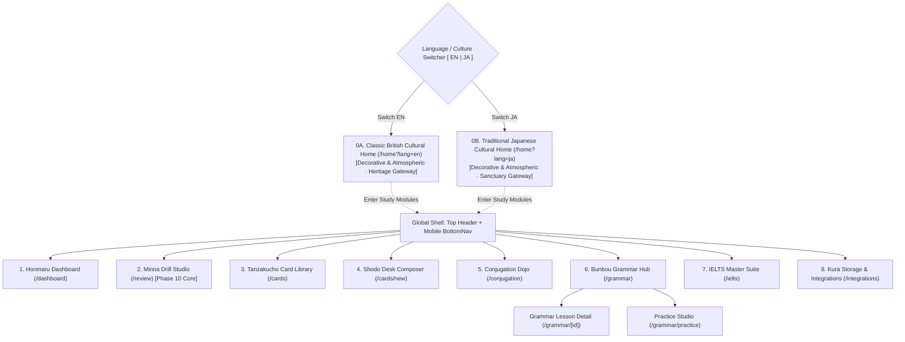
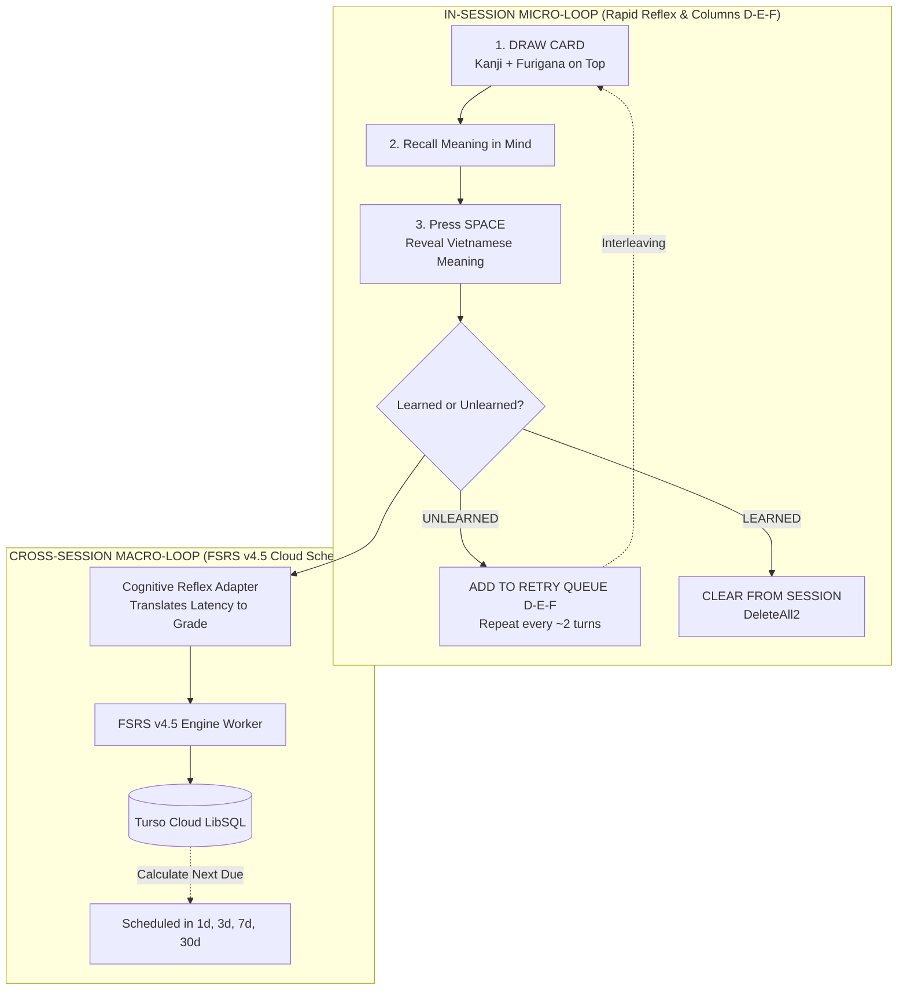

# SYSTEM UI/UX SKETCH ARCHITECTURE
## Project: Japanese SRS System · Kiokudo (FSRS Cognitive Spaced Repetition Engine)
> **Document:** Pure Wireframe & Layout Architecture (Sketch Blocks Only)  
> **File Path:** `doc/SYSTEM_UI_UX_SKETCHES.md`  
> **Scope:** Cultural Portals, Core System Screens, and Minna No Nihongo Rapid Reflex Drill Studio  
> **Layout Model:** 8pt Grid Auto-Layout · Responsive Desktop & Mobile Thumb Zone  
> **Note:** Đã loại bỏ toàn bộ các ràng buộc về màu sắc, hiệu ứng thẩm mỹ, mã HEX và bảng màu để tập trung 100% vào cấu trúc wireframe, phân cấp thông tin và các khối giao diện (Sketch Blocks).

---

## TABLE OF CONTENTS

1. [Information Architecture & Dual-Culture Gateway Flow](#1-information-architecture)
2. [Screen 0A: Cultural Home — Classic British Heritage (`/` when EN selected)](#2-screen-0a-british-home)
3. [Screen 0B: Cultural Home — Traditional Japanese Wabi-Sabi (`/` when JA selected)](#3-screen-0b-japanese-home)
4. [Global Shell & Navigation (Top Header & Mobile BottomNav)](#4-global-shell)
5. [Screen 1: Honmaru Functional Dashboard (`/dashboard`)](#5-screen-1-honmaru-dashboard)
6. [Screen 2: Minna No Nihongo Rapid Reflex Drill Studio (`/review` - Phase 10 Core)](#6-screen-2-minna-drill-studio)
   - [6.1. Dual-Loop Architectural Blueprint](#61-dual-loop-blueprint)
   - [6.2. Desktop Rapid Reflex Drill Board (2-Column Grid 72% / 28%)](#62-desktop-rapid-board)
   - [6.3. State 1: Drawn Card / Masked Answer (Active Neural Retrieval)](#63-state-1-drawn)
   - [6.4. State 2: Revealed & Latency Evaluation](#64-state-2-revealed)
   - [6.5. State 3: Reverse Drill (Vietnamese -> Japanese Recall)](#65-state-3-reverse)
   - [6.6. In-Session Retry Queue Detail (Columns D-E-F Interleaving Engine)](#66-retry-queue-detail)
   - [6.7. Mobile Responsive Drill Layout (390px Thumb Zone)](#67-mobile-drill-layout)
   - [6.8. Cognitive Reflex to FSRS Grade Conversion Matrix](#68-fsrs-matrix)
   - [6.9. Ergonomic Hotkeys Mapping](#69-hotkeys-map)
7. [Screen 3: Karuta Card Arena (`/review?legacy=true`)](#7-screen-3-karuta-legacy)
8. [Screen 4: Tanzakucho Deck & Card Library (`/cards`)](#8-screen-4-tanzakucho)
9. [Screen 5: Shodo Desk Card Composer & AI Copilot (`/cards/new`)](#9-screen-5-shodo-desk)
10. [Screen 6: Conjugation Dojo (`/conjugation`)](#10-screen-6-conjugation-dojo)
11. [Screen 7: Bunbou Grammar Hub (`/grammar`)](#11-screen-7-bunbou-hub)
12. [Screen 8: Grammar Lesson Detail (`/grammar/[lessonId]`)](#12-screen-8-grammar-lesson)
13. [Screen 9: Bunbou Practice Studio (`/grammar/practice`)](#13-screen-9-grammar-practice)
14. [Screen 10: Academic English & IELTS Master Suite (`/ielts`)](#14-screen-10-ielts)
15. [Screen 11: Kura Storage & External Integrations (`/integrations`)](#15-screen-11-kura-integrations)

---

<a id="1-information-architecture"></a>
## 1. INFORMATION ARCHITECTURE & DUAL-CULTURE GATEWAY FLOW

Khi người học truy cập URL gốc (`/`), hệ thống hiển thị màn hình Cổng Văn Hóa tương ứng với nút gạt ngôn ngữ/văn hóa (`EN` hoặc `JA`). Hai cổng này mang tính chất chào đón và truyền cảm hứng thuần túy, không chứa widget thao tác học tập. Người học truy cập các phân hệ chức năng thông qua thanh điều hướng:



---

<a id="2-screen-0a-british-home"></a>
## 2. SCREEN 0A: CULTURAL HOME — CLASSIC BRITISH HERITAGE (`/` WHEN EN SELECTED)

* **Mục đích:** Cổng chào đón văn hóa mang tính truyền cảm hứng học thuật.
* **Đặc tính:** Không chứa widget học tập (không hàng đợi thẻ, không thống kê). Chỉ hiển thị khối trích dẫn, minh họa học thuật và lời tựa.

```
+--------------------------------------------------------------------------------------------------------------------+
| [OXFORD & CAMBRIDGE LEDGER]                                                          [CULTURE: EN | JA] [PORTAL]   |
+--------------------------------------------------------------------------------------------------------------------+
|                                                                                                                    |
|   ~~~~~~~~~~~~~~~~~~~~~~~~~~~~~~~~~~~~~~~~ THE SCHOLAR'S SANCTUARY ~~~~~~~~~~~~~~~~~~~~~~~~~~~~~~~~~~~~~~~~~~~~~~  |
|                                                                                                                    |
|               .--------------------------------------------------------------------------------.                   |
|              /                                                                                / |                  |
|             |        "Knowledge is power; memory is the treasury and guardian of all things."  | |                  |
|             |                                   -- Marcus Tullius Cicero                       | |                  |
|             |                                                                                  | |                  |
|             |   [ Engraving: Bodleian Library Vaults · Oxford University Antiquity ]           | |                  |
|             |   Handcrafted Leather Bookbindings · Antique Brass Astrolabe · Dark Mahogany     | |                  |
|             |                                                                                  | |                  |
|             |   "Reading maketh a full man; conference a ready man; and writing an exact man." | |                  |
|             |                                   -- Sir Francis Bacon, 1597                     | |                  |
|             |                                                                                  | /                   |
|              \________________________________________________________________________________/                    |
|                                                                                                                    |
|   --------------------------------- HERITAGE INSCRIPTION & MOTIFS ------------------------------------------------  |
|                                                                                                                    |
|   [ Motif: Heraldic Crest & Oak Leaf ]           [ Motif: Westminster Chime & Clockwork ]                          |
|   The pursuit of disciplined intellect           Timeless mastery forged through deliberate                        |
|   rooted in centuries of academic rigor.         recollection and steady scholarship.                              |
|                                                                                                                    |
|   ~~~~~~~~~~~~~~~~~~~~~~~~~~~~~~~~~~~~~~~~~~~~~~~~~~~~~~~~~~~~~~~~~~~~~~~~~~~~~~~~~~~~~~~~~~~~~~~~~~~~~~~~~~~~~~~~  |
|   (Decorative Cultural Gateway · Select any module above to enter the Study Pavilions)                            |
+--------------------------------------------------------------------------------------------------------------------+
```

---

<a id="3-screen-0b-japanese-home"></a>
## 3. SCREEN 0B: CULTURAL HOME — TRADITIONAL JAPANESE WABI-SABI (`/` WHEN JA SELECTED)

* **Mục đích:** Cổng chào đón văn hóa mang tính tĩnh tâm và suy ngẫm.
* **Đặc tính:** Không chứa widget học tập. Tập trung vào câu đối Thơ Haiku, triết lý Kintsugi và Nhất kỳ nhất hội.

```
+--------------------------------------------------------------------------------------------------------------------+
| [KIOKUDO] 記憶道                                                                     [CULTURE: JA | EN] [PORTAL]   |
+--------------------------------------------------------------------------------------------------------------------+
|                                                                                                                    |
|   ~~~~~~~~~~~~~~~~~~~~~~~~~~~~~~~~~~~~~~~~~~ 侘 寂 · 静 寂 の 間 ~~~~~~~~~~~~~~~~~~~~~~~~~~~~~~~~~~~~~~~~~~~~~~~~~~  |
|                                                                                                                    |
|               +--------------------------------------------------------------------------------+                   |
|               |                                                                                |                   |
|               |                             閑 さ や                                           |                   |
|               |                             岩 に 染 み 入 る                                 |                   |
|               |                             蝉 の 声                                           |                   |
|               |                                                                                |                   |
|               |                    (Tiếng ve ngân ngấm sâu vào khe đá cổ,                     |                   |
|               |                     vạn vật chìm vào tĩnh lặng tuyệt đối.)                     |                   |
|               |                                                                                |                   |
|               |                                  -- Matsuo Basho (松尾芭蕉 · 1689)             |                   |
|               |                                                                                |                   |
|               |   [ Họa đồ: Thềm gỗ Engawa nhìn ra Vườn đá thiền Karesansui ]                 |                   |
|               |   Bonsai Tùng Bách bách niên · Trà đạo Chasen · Giấy thủ công Washi viền vàng  |                   |
|               +--------------------------------------------------------------------------------+                   |
|                                                                                                                    |
|   --------------------------------- TRIẾT LÝ NHẬN THỨC VĂN HÓA NHẬT BẢN -------------------------------------------  |
|                                                                                                                    |
|   [ Điểm xuyết: Hoa văn gợn sóng Seigaiha ]      [ Điểm xuyết: Trúc thanh phong Shippo ]                           |
|   Kintsugi (Hàn gắn khuyết điểm bằng vàng):     Nhất kỳ nhất hội (Trân quý từng khoảnh khắc):                     |
|   Mỗi lần quên và khắc phục là một vết gãy      Mỗi chữ Hán học hôm nay là một nhân duyên                         |
|   được bọc vàng rực rỡ trong trí nhớ.           sâu sắc trong hành trình tri thức đời người.                       |
|                                                                                                                    |
|   ~~~~~~~~~~~~~~~~~~~~~~~~~~~~~~~~~~~~~~~~~~~~~~~~~~~~~~~~~~~~~~~~~~~~~~~~~~~~~~~~~~~~~~~~~~~~~~~~~~~~~~~~~~~~~~~~  |
|   (Bản Doanh Nghệ Thuật Văn Hóa · Chọn các phân hệ phía trên để bắt đầu tiến hành việc học)                        |
+--------------------------------------------------------------------------------------------------------------------+
```

---

<a id="4-global-shell"></a>
## 4. GLOBAL SHELL & NAVIGATION

### 4.1. Desktop Top Navigation Bar (Width >= 1024px)
Thanh điều hướng cố định trên cùng màn hình máy tính:

```
+--------------------------------------------------------------------------------------------------------------------+
| [KIOKUDO] JAPANESE SRS       |  [Home]  [Dashboard]  [Decks]  [Verbs]  [Grammar]  [New Card]  [Drill]  | [EN|JA] [User] |
+--------------------------------------------------------------------------------------------------------------------+
```
* **Con dấu Logo (`[KIOKUDO]`):** Khối biểu trưng thương hiệu.
* **Các nút điều hướng:** Home, Dashboard, Decks, Verbs, Grammar, New Card.
* **Nút CTA nổi bật (`[Drill]`):** Nút truy cập nhanh vào Bàn Dò Bài phản xạ.
* **Cụm điều khiển phải:** Nút chuyển đổi ngôn ngữ/văn hóa, trạng thái người dùng và đèn chỉ báo đồng bộ.

### 4.2. Mobile Floating Bottom Navigation (Width <= 768px)
Thanh điều hướng dạng viên thuốc (floating pill) nổi phía dưới đáy màn hình điện thoại:

```
+------------------------------------------------------------------------+
|                                                                        |
|    +--------------------------------------------------------------+    |
|    |     [Home]     [Decks]     [Grammar]     [Drill]     [User]   |    |
|    +--------------------------------------------------------------+    |
+------------------------------------------------------------------------+
```

---

<a id="5-screen-1-honmaru-dashboard"></a>
## 5. SCREEN 1: HONMARU FUNCTIONAL DASHBOARD (`/dashboard`)

Bố cục dạng lưới Bento Grid thể hiện các chỉ số FSRS và hàng đợi ôn tập:

```
+--------------------------------------------------------------------------------------------------------------------+
| HONMARU DASHBOARD                                                                             Sun, Oct 05 | EN / VI|
+--------------------------------------------------------------------------------------------------------------------+
|                                                                                                                    |
|   +------------------------------------------------------------------------------------------------------------+   |
|   | WELCOME HERO BANNER                                                                                        |   |
|   |   Daruma Progress: Active Eye Marked                                                                       |   |
|   |   Good morning, Cassius! Long-term memory reinforcement session is ready.                                  |   |
|   |   12 cards are due for cognitive retrieval under FSRS v4.5 scheduler.                     [ DRILL NOW ]   |   |
|   +------------------------------------------------------------------------------------------------------------+   |
|                                                                                                                    |
|   +-----------------------+  +-----------------------+  +-----------------------+  +-----------------------+       |
|   | TOTAL CARDS           |  | DUE TODAY             |  | RETENTION TARGET      |  | BJORK LATENCY         |       |
|   | 676 cards             |  | 12 cards              |  | 94%                   |  | 1.4s                  |       |
|   | [=== Stable Metric =] |  | [=== Urgent Queue ==] |  | [=== Target Metric =] |  | [=== Latency Metric =]|       |
|   +-----------------------+  +-----------------------+  +-----------------------+  +-----------------------+       |
|                                                                                                                    |
|   ==================== LEFT COLUMN: STUDY QUEUE (58%) =================   ==== RIGHT COLUMN: DECK CATALOG (42%) ===|
|   |                                                                   |   |                                       |
|   |  PRIORITY STUDY QUEUE                                             |   |  DECK CATALOG                         |
|   |  --------------------------------------------------------------   |   |  -----------------------------------  |
|   |                                                                   |   |                                       |
|   |  1. あいまい                                                      |   |  [Kotoba] JPD133 - Vocabulary Kotoba  |
|   |     曖　昧   (Mơ hồ, không rõ ràng) • Atamadaka [1]               |   |     252 cards • 250 new • 2 learned   |
|   |     Ví dụ: 曖昧な返事をするな (Đừng trả lời mập mờ)               |   |     [ Start Study ]                   |
|   |     [S: 4.2d | Reps: 5]                            [ Study Card ] |   |                                       |
|   |                                                                   |   |  [Kanji] JPD133 - Kanji Characters    |
|   |  2. ちゅうちょ                                                    |   |     232 cards • 232 learned [ Review ]|
|   |     躊　躇   (Do dự, chần chừ) • Heiban [0]                       |   |                                       |
|   |     Ví dụ: 躊躇せずに発言する (Phát biểu không ngần ngại)         |   |  [JLPT N5] JLPT N5 - Core Vocabulary  |
|   |     [S: 6.8d | Reps: 7]                            [ Study Card ] |   |     78 cards • 78 new       [ Start ] |
|   |                                                                   |   |                                       |
|   |  3. こもれび                                                      |   |  [Grammar] JPD133 - Bunbou Grammar    |
|   |     木漏れ日 (Ánh nắng xuyên qua kẽ lá) • Nakadaka [3]            |   |     96 cards • 32 rules     [ Practice ]|
|   |     [S: 12.1d | Reps: 9]                           [ Study Card ] |   |                                       |
|   |                                                                   |   |  -----------------------------------  |
|   |  4. いちごいちえ                                                  |   |  JPD133 BUNBOU ENGINE                 |
|   |     一期一会 (Đời người gặp một lần, quý trọng duyên)             |   |  32 grammar patterns • 204 exercises  |
|   |     [S: 18.5d | Reps: 11]                          [ Study Card ] |   |  Unit 8: Adjectives (Completed 8/8)   |
|   |                                                                   |   |  [ Grammar Hub ]  [ Practice Studio ] |
|   |  5. せっさたくま                                                  |   |                                       |
|   |     切磋琢磨 (Cùng nhau nỗ lực rèn giũa nâng cao thực lực)        |   |                                       |
|   |     [S: 24.0d | Reps: 14]                          [ Study Card ] |   |                                       |
|   =====================================================================   =========================================|
+--------------------------------------------------------------------------------------------------------------------+
```

---

<a id="6-screen-2-minna-drill-studio"></a>
## 6. SCREEN 2: MINNA NO NIHONGO RAPID REFLEX DRILL STUDIO (`/review` - PHASE 10 CORE)

<a id="61-dual-loop-blueprint"></a>
### 6.1. Dual-Loop Architectural Blueprint



<a id="62-desktop-rapid-board"></a>
### 6.2. Desktop Rapid Reflex Drill Board (2-Column Grid: 72% / 28%)

```
+--------------------------------------------------------------------------------------------------------------------+
| MINNA DRILL STUDIO                           Progress: [=========......] 14/45  | Mode: [Forward JA -> VI v] | Audio|
| CURRICULUM SLOT:  [All]  [Slot 1]  [Slot 2]  [Slot 3 (Active)]  [Slot 4]  [Slot 5]  [Slot 6]  [Slot 8]  [Slot 10]    |
+--------------------------------------------------------------------------------------------------------------------+
|                                                                                    |                               |
|   ======================== MAIN DRILL VIEW (72% WIDTH) ===========================   |  === RETRY QUEUE (28%) ===  |
|   |                                                                            |   |                               |
|   |   +--------------------------------------------------------------------+   |   |  UNLEARNED RETRY QUEUE        |
|   |   |  TAG: JPD133 · Slot 3 · Giving / Receiving                         |   |   |  (Interleaved during session) |
|   |   |                                                                    |   |   |                               |
|   |   |                               あげる                               |   |   |  1. じしょ                    |
|   |   |                               上　げる                             |   |   |     辞　書   (từ điển)        |
|   |   |             (cho, tặng - tôi cho người khác)                       |   |   |     [Retry in 1 turn]         |
|   |   |                                                                    |   |   |                               |
|   |   |             あげる (あげます)     [ Audio (P) ]                    |   |   |  2. てちょう                  |
|   |   |                                                                    |   |   |     手　帳   (sổ tay)         |
|   |   |   - - - - - - - - - - - - - - - - - - - - - - - - - - - - - - - -  |   |   |     [Retry in 3 turns]        |
|   |   |                                                                    |   |   |                               |
|   |   |   [ VIETNAMESE MEANING & CONTEXT EXAMPLES (MASKED OR EXPANDED) ]   |   |   |  3. おみやげ                  |
|   |   |   cho, tặng (tôi cho người khác)                                   |   |   |     お土産   (quà lưu niệm)   |
|   |   |   Ví dụ: 私は山田さんに本をあげました。                            |   |   |     [Retry in 4 turns]        |
|   |   |   (Tôi đã tặng sách cho bạn Yamada.)                               |   |   |                               |
|   |   +--------------------------------------------------------------------+   |   |  ---------------------------  |
|   |                                                                            |   |  Total Queue: 3 cards         |
|   |   Bjork Latency: 1.1s  •  Grade: FSRS Easy             [ Undo (Z) ]        |   |  [Clear all to complete]      |
|   |                                                                            |   |                               |
|   |   +---------------------------------+  +-------------------------------+   |   |                               |
|   |   |    UNLEARNED (Bksp / 2)         |  |     LEARNED (Enter / 1)       |   |   |                               |
|   |   |    • Queue into Retry Queue     |  |     • Increase FSRS Stability |   |   |                               |
|   |   |    • Interleaved after ~2 turns |  |     • Draw next card          |   |   |                               |
|   |   +---------------------------------+  +-------------------------------+   |   |                               |
|   ==============================================================================   =================================
|                                                                                                                    |
|   [ HOTKEYS:  Space: Reveal Answer  |  Enter / 1: Learned  |  Bksp / 2: Unlearned  |  Z: Undo  |  P: Audio ]           |
+--------------------------------------------------------------------------------------------------------------------+
```

<a id="63-state-1-drawn"></a>
### 6.3. State 1: Drawn Card / Masked Answer (Active Neural Retrieval)

```
+---------------------------------------------------------------------------------------+
|  TAG: JPD133 · Slot 3 · Giving & Receiving                        Card Progress: 14/45|
|                                                                                       |
|                                       あげる                                          |
|                                       上　げる                                        |
|                             (cho, tặng - tôi tặng người khác)                         |
|                                                                                       |
|                                  あげる (あげます)                                    |
|                                  [ Audio Play (P) ]                                   |
|                                                                                       |
|   + - - - - - - - - - - - - - - - - - - - - - - - - - - - - - - - - - - - - - - - +   |
|   |  MASKED VIETNAMESE MEANING                                                    |   |
|   |                                                                               |   |
|   |     Recall meaning in memory... Press SPACE or click below to REVEAL ANSWER   |   |
|   |                                                                               |   |
|   + - - - - - - - - - - - - - - - - - - - - - - - - - - - - - - - - - - - - - - - +   |
|                                                                                       |
|   Measuring Bjork retrieval latency...                                                |
|                                                                                       |
|   +-------------------------------------------------------------------------------+   |
|   |                                                                               |   |
|   |                     [  REVEAL MEANING (Press Space)  ]                        |   |
|   |                                                                               |   |
|   +-------------------------------------------------------------------------------+   |
|                                                                                       |
|      (Learned & Unlearned action buttons are disabled until answer is revealed)       |
+---------------------------------------------------------------------------------------+
```

<a id="64-state-2-revealed"></a>
### 6.4. State 2: Revealed & Latency Evaluation

```
+---------------------------------------------------------------------------------------+
|  TAG: JPD133 · Slot 3 · Giving & Receiving                        Card Progress: 14/45|
|                                                                                       |
|                                       あげる                                          |
|                                       上　げる                                        |
|                             (cho, tặng - tôi tặng người khác)                         |
|                                                                                       |
|                                  あげる (あげます)                                    |
|                                  [ Audio Playing... ]                                 |
|                                                                                       |
|   +-------------------------------------------------------------------------------+   |
|   |  PRIMARY MEANING (VIETNAMESE):                                                |   |
|   |  cho, tặng (tôi cho người khác)                                               |   |
|   |  • Cấu trúc: [Người cho] は [Người nhận] に N を あげます                     |   |
|   |                                                                               |   |
|   |  CONTEXT SENTENCE (i+1):                                                      |   |
|   |  私は山田さんに本をあげました。 (Tôi đã tặng sách cho bạn Yamada.)            |   |
|   +-------------------------------------------------------------------------------+   |
|                                                                                       |
|   Retrieval Latency: 1.1s  •  Grade: [ FSRS Easy (Fast Recall) ]                      |
|                                                                                       |
|   +---------------------------------------+   +-----------------------------------+   |
|   |                                       |   |                                   |   |
|   |       UNLEARNED                       |   |       LEARNED                     |   |
|   |       (Backspace / Key 2)             |   |       (Enter / Key 1)             |   |
|   |       • Queue into Columns D-E-F      |   |       • Increase FSRS Stability   |   |
|   |       • Retry scheduled in ~2 turns   |   |       • Draw next new card        |   |
|   |                                       |   |                                   |   |
|   +---------------------------------------+   +-----------------------------------+   |
|                                                                                       |
|                               [ Undo Misclick (Ctrl+Z / Z) ]                          |
+---------------------------------------------------------------------------------------+
```

<a id="65-state-3-reverse"></a>
### 6.5. State 3: Reverse Drill (Vietnamese -> Japanese Recall)

```
+---------------------------------------------------------------------------------------+
|  DRILL MODE: REVERSE (VIETNAMESE -> JAPANESE)                     Card Progress: 08/45|
|                                                                                       |
|                                cho, tặng (tôi tặng người khác)                        |
|                                Ngữ cảnh: Tặng sách cho Yamada                         |
|                                                                                       |
|   + - - - - - - - - - - - - - - - - - - - - - - - - - - - - - - - - - - - - - - - +   |
|   |  MASKED JAPANESE KANJI & HIRAGANA                                             |   |
|   |     Recall Kanji & Kana in memory... Press SPACE to VERIFY                    |   |
|   + - - - - - - - - - - - - - - - - - - - - - - - - - - - - - - - - - - - - - - - +   |
|                                                                                       |
|   +-------------------------------------------------------------------------------+   |
|   |                     [  REVEAL JAPANESE ANSWER (Space)  ]                      |   |
|   +-------------------------------------------------------------------------------+   |
+---------------------------------------------------------------------------------------+
```

<a id="66-retry-queue-detail"></a>
### 6.6. In-Session Retry Queue Detail (Columns D-E-F Interleaving Engine)

```
+-----------------------------------+
| RETRY QUEUE (COLUMNS D-E-F)       |
| In-session interleaving queue     |
+-----------------------------------+
|                                   |
| +-------------------------------+ |
| | じしょ                        | |
| | 辞　書   (từ điển)            | |
| | - - - - - - - - - - - - - - - | |
| | Queue #1     [Retry in 1 turn]| |
| +-------------------------------+ |
|                                   |
| +-------------------------------+ |
| | てちょう                      | |
| | 手　帳   (sổ tay)             | |
| | - - - - - - - - - - - - - - - | |
| | Queue #2    [Retry in 3 turns]| |
| +-------------------------------+ |
|                                   |
| +-------------------------------+ |
| | おみやげ                      | |
| | お土産   (quà lưu niệm)       | |
| | - - - - - - - - - - - - - - - | |
| | Queue #3    [Retry in 4 turns]| |
| +-------------------------------+ |
|                                   |
| --------------------------------- |
| Session completes when retry      |
| queue count reaches 0.            |
+-----------------------------------+
```

<a id="67-mobile-drill-layout"></a>
### 6.7. Mobile Responsive Drill Layout (Width 390px)

```
+-----------------------------------------+
| [KIOKUDO] Minna Drill Board      [14/45]|
+-----------------------------------------+
| [All] [Slot 3: Giving/Receiving] [Slot 4|
+-----------------------------------------+
|                                         |
|                 あげる                  |
|                 上　げる                |
|      (cho, tặng - tôi cho người khác)   |
|                                         |
|            あげる (あげます)            |
|               [ Audio (P) ]             |
|                                         |
|  +-----------------------------------+  |
|  | cho, tặng (tôi cho người khác)    |  |
|  | 私は山田さんに本をあげました。    |  |
|  +-----------------------------------+  |
|                                         |
|  Latency: 1.1s • FSRS Easy              |
|                                         |
|  +-----------------------------------+  |
|  |   LEARNED (Action Button)         |  |
|  +-----------------------------------+  |
|  |   UNLEARNED (Action Button)       |  |
|  +-----------------------------------+  |
|                                         |
|  +-----------------------------------+  |
|  | Retry Queue: 3 items [Expand]     |  |
|  | 1. 辞書 • 2. 手帳 • 3. お土産     |  |
|  +-----------------------------------+  |
+-----------------------------------------+
```

<a id="68-fsrs-matrix"></a>
### 6.8. Cognitive Reflex to FSRS Grade Conversion Matrix

| Thao tác người dùng | Khoảng thời gian độ trễ ($\Delta t$) | Xếp loại FSRS tương đương | Tác động toán học FSRS | Xử lý trong phiên học |
| :--- | :--- | :--- | :--- | :--- |
| **LEARNED** | $\Delta t < 1.5\text{s}$ | **`Easy` (Grade 4)** | $S_{\text{new}} = S \cdot (1 + \text{bonus} \cdot 1.3)$ | Xóa khỏi hàng đợi phiên ngay lập tức |
| **LEARNED** | $1.5\text{s} \le \Delta t \le 6.0\text{s}$ | **`Good` (Grade 3)** | $S_{\text{new}} = S \cdot (1 + \text{bonus})$ | Xóa khỏi hàng đợi phiên ngay lập tức |
| **LEARNED** | $\Delta t > 6.0\text{s}$ | **`Hard` (Grade 2)** | $S_{\text{new}} = S \cdot 1.15$ | Xóa khỏi hàng đợi phiên ngay lập tức |
| **UNLEARNED** | Bất kỳ thời lượng nào | **`Again` (Grade 1)** | $S_{\text{lapse}} = w_{11} \cdot D^{-w_{12}} \dots$ | **Đẩy vào Hàng đợi Cột nợ D-E-F** |

<a id="69-hotkeys-map"></a>
### 6.9. Ergonomic Hotkeys Mapping

| Phím bấm | Tương tác mục tiêu | Phản hồi giao diện | Công thái học nhận thức |
| :--- | :--- | :--- | :--- |
| `Space` | Bật / Tắt Hiện nghĩa | Mở khung nghĩa tức thì 0ms | Ngón cái đặt tự nhiên trên phím Space |
| `Enter` hoặc `1` | Đánh dấu **ĐÃ THUỘC** | Hiệu ứng nhấn nút, chuyển từ tiếp theo | Ngón trỏ phải hoặc bàn phím số |
| `Backspace` hoặc `2` | Đánh dấu **CHƯA THUỘC** | Hiệu ứng nhấn nút, đẩy vào Cột nợ D-E-F | Kích hoạt phản xạ khi quên từ |
| `P` | Phát âm từ vựng | Gọi Web Speech API tổng hợp giọng đọc | Củng cố kênh thính giác |
| `Z` hoặc `Ctrl+Z` | Hoàn tác thao tác nhầm | Phục hồi thẻ trước đó từ lịch sử | Bảo vệ an toàn chống bấm nhầm |

---

<a id="7-screen-3-karuta-legacy"></a>
## 7. SCREEN 3: KARUTA CARD ARENA (`/review?legacy=true`)

```
+---------------------------------------------------------------------------------------+
| Review Queue: All Cards                                            Question 14 of 45  |
| [===========================================================........................]  |
+---------------------------------------------------------------------------------------+
|                                                                                       |
|   +-------------------------------------------------------------------------------+   |
|   | [REVEALED]                                                                    |   |
|   |                                    あいまい                                   |   |
|   |                                    曖　昧                                     |   |
|   |                           (Mơ hồ, không rõ ràng)                              |   |
|   |                                                                               |   |
|   |   +-----------------------------+   +-----------------------------+           |   |
|   |   | KUN-YOMI (Native Japanese)  |   | ON-YOMI (Sino-Japanese)     |           |   |
|   |   | あいまい                    |   | アイマイ                    |           |   |
|   |   +-----------------------------+   +-----------------------------+           |   |
|   |                                                                               |   |
|   |   Tokyo Pitch Accent: Atamadaka [1]  •──•\____•____•                          |   |
|   |                                                                               |   |
|   |   +-----------------------------------------------------------------------+   |   |
|   |   | VIETNAMESE MEANING: Mơ hồ, không rõ ràng, mập mờ                      |   |   |
|   |   +-----------------------------------------------------------------------+   |   |
|   |                                                                               |   |
|   |   +-----------------------------------------------------------------------+   |   |
|   |   | CONTEXT SENTENCE (i+1):                                               |   |   |
|   |   | 「曖昧な返事をするな」 (Đừng trả lời mập mờ dứt khoát)                |   |   |
|   |   +-----------------------------------------------------------------------+   |   |
|   |                                                                               |   |
|   +-------------------------------------------------------------------------------+   |
|                                                                                       |
|   +---------------+   +---------------+   +---------------+   +---------------+       |
|   |     AGAIN     |   |     HARD      |   |     GOOD      |   |     EASY      |       |
|   |    < 1 min    |   |   ~ 1.2 d     |   |   ~ 3.5 d     |   |   ~ 7.0 d     |       |
|   |    (Key 1)    |   |   (Key 2)     |   |   (Key 3)     |   |   (Key 4)     |       |
|   +---------------+   +---------------+   +---------------+   +---------------+       |
+---------------------------------------------------------------------------------------+
```

---

<a id="8-screen-4-tanzakucho"></a>
## 8. SCREEN 4: TANZAKUCHO DECK & CARD LIBRARY (`/cards`)

```
+--------------------------------------------------------------------------------------------------------------------+
| TANZAKUCHO CARD LIBRARY (676 Cards Total)                                                                          |
+--------------------------------------------------------------------------------------------------------------------+
|                                                                                                                    |
|   [ Search Kanji, Hiragana... ]   [ Deck: All v ]   [ Status: All v ]   [ Sort: Stability v ]   [ + New Card ]     |
|                                                                                                                    |
|   +------------------------------------------------------------------------------------------------------------+   |
|   | KANJI & FURIGANA    | READING & PHONETICS      | VIETNAMESE MEANING             | DECK       | FSRS    | ACTION|   |
|   |---------------------|--------------------------|--------------------------------|------------|---------|-------|   |
|   | あいまい            | あいまい                 | Mơ hồ, không rõ ràng           | Chuukyuu   | S: 4.2d | Edit  |   |
|   | 曖　昧              | (Atamadaka [1])          |                                |            |         | Delete|   |
|   |                     |                          |                                |            |         |       |   |
|   | ちゅうちょ          | ちゅうちょ               | Do dự, chần chừ, ngập ngừng    | Chuukyuu   | S: 6.8d | Edit  |   |
|   | 躊　躇              | (Heiban [0])             |                                |            |         | Delete|   |
|   |                     |                          |                                |            |         |       |   |
|   | こもれび            | こもれび                 | Ánh nắng xuyên qua kẽ lá       | Life       | S: 12.1d| Edit  |   |
|   | 木漏れ日            | (Nakadaka [3])           |                                |            |         | Delete|   |
|   |                     |                          |                                |            |         |       |   |
|   | あげる              | あげます                 | cho, tặng (tôi cho người khác) | JPD133     | S: 0.8d | Edit  |   |
|   | 上　げる            | (Slot 3)                 |                                |            |         | Delete|   |
|   |                     |                          |                                |            |         |       |   |
|   | りょうしん          | りょうしん               | bố mẹ, song thân gia đình      | JPD133     | S: 28.0d| Edit  |   |
|   | 両　親              | (Slot 1)                 |                                |            |         | Delete|   |
|   +------------------------------------------------------------------------------------------------------------+   |
|                                                                                                                    |
|   Showing 1 - 20 of 676 cards                                                     [ << Prev ] [ 1 ] [ 2 ] [ Next >>]|
+--------------------------------------------------------------------------------------------------------------------+
```

---

<a id="9-screen-5-shodo-desk"></a>
## 9. SCREEN 5: SHODO DESK CARD COMPOSER & AI COPILOT (`/cards/new`)

```
+--------------------------------------------------------------------------------------------------------------------+
| SHODO DESK & AI CARD COMPOSER                                                                                      |
+--------------------------------------------------------------------------------------------------------------------+
|                                                                                                                    |
|   ================ INPUT EDITOR (58%) =================   ================ LIVE PREVIEW (42%) ================     |
|   |                                                   |   |                                                  |     |
|   |  1. SELECT DECK:                                  |   |  LIVE CARD PREVIEW                               |     |
|   |  [ JPD133 - Vocabulary Kotoba                  v ]|   |  +--------------------------------------------+  |     |
|   |                                                   |   |  | [QUESTION]                                 |  |     |
|   |  2. KANJI HEADWORD / TARGET VOCABULARY:           |   |  |                                            |  |     |
|   |  [ あげる                                       ] |   |  |                    あげる                  |  |     |
|   |                                                   |   |  |                    上　げる                |  |     |
|   |  3. HIRAGANA FURIGANA READING:                    |   |  |        (cho, tặng - tôi cho người khác)    |  |     |
|   |  [ あげる (あげます)                            ] |   |  |                                            |  |     |
|   |                                                   |   |  |             あげる (あげます)              |  |     |
|   |  4. VIETNAMESE MEANING & USAGE NOTES:             |   |  |                                            |  |     |
|   |  [ cho, tặng (tôi cho người khác)               ] |   |  | +----------------------------------------+ |  |     |
|   |  [ [Người cho] は [Người nhận] に N を あげます ] |   |  | | cho, tặng (tôi cho người khác)         | |  |     |
|   |                                                   |   |  | | [Người cho] は [Người nhận] に N       | |  |     |
|   |  5. CONTEXT SENTENCE (SUPPORTS {{c1::cloze}}):    |   |  | +----------------------------------------+ |  |     |
|   |  [ 私は山田さんに本を {{c1::あげました}}。      ] |   |  |                                            |  |     |
|   |                                                   |   |  | 私は山田さんに本をあげました。              |  |     |
|   |  AI COPILOT RECOMMENDATION:                       |   |  | (Tôi đã tặng sách cho bạn Yamada.)        |  |     |
|   |  • Identified Minna Lesson 7 Giving/Receiving rule|   |  +--------------------------------------------+  |     |
|   |  • Auto-assigned Tokyo Pitch Accent Heiban [0]    |   |                                                  |     |
|   |                                  [ Apply Copilot ]|   |                                                  |     |
|   |                                                   |   |                                                  |     |
|   |  [ SAVE CARD (Enter) ]   [ Save & Create Next ]   |   |                                                  |     |
|   =====================================================   ====================================================     |
+--------------------------------------------------------------------------------------------------------------------+
```

---

<a id="10-screen-6-conjugation-dojo"></a>
## 10. SCREEN 6: CONJUGATION DOJO (`/conjugation`)

```
+--------------------------------------------------------------------------------------------------------------------+
| CONJUGATION DOJO                                                                   Score: 850 pts • Streak: 12     |
+--------------------------------------------------------------------------------------------------------------------+
|                                                                                                                    |
|   SELECT FORM: [Te-form (Active)]  [Nai-form]  [Ta-form]  [Dictionary]  [Potential]  [Volitional]  [Passive]       |
|                                                                                                                    |
|   +------------------------------------------------------------------------------------------------------------+   |
|   | CURRENT CHALLENGE:                                                                        Question 08 / 20 |   |
|   |                                                                                                            |   |
|   |                                                  たべる                                                    |   |
|   |                                                  食　べる   (Ăn)                                           |   |
|   |                                    Group 2 Verb (Ichidan)                                                  |   |
|   |                                                                                                            |   |
|   |                                 Prompt: Conjugate into TE-FORM (V-te)                                      |   |
|   |                                                                                                            |   |
|   |                    [ Enter Romaji or Hiragana: tabete...                   ]   [ SUBMIT (Enter) ]          |   |
|   |                                                                                                            |   |
|   |   Group 2 Rule: Drop final る -> append て (食べる -> 食べて)                                              |   |
|   +------------------------------------------------------------------------------------------------------------+   |
|                                                                                                                    |
|   VERB GROUP ACCURACY MATRIX:                                                                                      |
|   • Group 1 (Godan): 82% accuracy  |  • Group 2 (Ichidan): 96% accuracy  |  • Group 3 (Irregular): 91% accuracy    |
+--------------------------------------------------------------------------------------------------------------------+
```

---

<a id="11-screen-7-bunbou-hub"></a>
## 11. SCREEN 7: BUNBOU GRAMMAR HUB (`/grammar`)

```
+--------------------------------------------------------------------------------------------------------------------+
| JPD133 BUNBOU GRAMMAR HUB                                                     32 Rules • 204 Exercises • JLPT N5/N4|
+--------------------------------------------------------------------------------------------------------------------+
|                                                                                                                    |
|   [ Search grammar rules: V-te imasu, te mo ii... ]      Filter Unit: [All] [Unit 8 (Active)] [Unit 9] [Unit 10]    |
|                                                                                                                    |
|   +------------------------------------------------------------------------------------------------------------+   |
|   | UNIT 8: ADJECTIVES い & な (STATE & PROPERTY DESCRIPTIONS)                         Progress: 8/8 patterns  |   |
|   |                                                                                                            |   |
|   |   +------------------------------------+  +------------------------------------+  +--------------------+   |   |
|   |   | Pattern 1: N は A(い)/A(な) です   |  | Pattern 2: N は A(い)くない        |  | Pattern 3: とても  |   |   |
|   |   | Khẳng định tính chất của chủ ngữ   |  | Phủ định tính chất của sự vật      |  | Phó từ chỉ mức độ  |   |   |
|   |   | Ví dụ: この本はおもしろいです。     |  | Ví dụ: 富士山は高くありません。    |  | Ví dụ: とても寒い  |   |   |
|   |   | [ Details ] [ Practice 8 Qs ]      |  | [ Details ] [ Practice 6 Qs ]      |  | [ Details ]        |   |   |
|   |   +------------------------------------+  +------------------------------------+  +--------------------+   |   |
|   +------------------------------------------------------------------------------------------------------------+   |
|                                                                                                                    |
|   +------------------------------------------------------------------------------------------------------------+   |
|   | UNIT 9: PREFERENCES, CAPABILITIES & CAUSES (から)                                  Progress: 6/8 patterns  |   |
|   |   • Pattern 9: N が 好き / 嫌い です (Sở thích)      • Pattern 10: N が 上手 / 下手 です (Năng lực)            |   |
|   |   • Pattern 11: N が わかります / あります (Hiểu)    • Pattern 12: S1 から, S2 (Nguyên nhân kết quả)            |   |
|   +------------------------------------------------------------------------------------------------------------+   |
+--------------------------------------------------------------------------------------------------------------------+
```

---

<a id="12-screen-8-grammar-lesson"></a>
## 12. SCREEN 8: GRAMMAR LESSON DETAIL (`/grammar/[lessonId]`)

```
+--------------------------------------------------------------------------------------------------------------------+
| UNIT 8 GRAMMAR · PATTERN 01                                                                    [ Back to Hub ]     |
| [STRUCTURE]: Subject + は + Adjective (い / な) + です                                                             |
+--------------------------------------------------------------------------------------------------------------------+
|                                                                                                                    |
|   +------------------------------------------------------------------------------------------------------------+   |
|   | CONJUGATION RULES:                                                                                         |   |
|   |   • い-Adjective: Keep い + です                                                                           |   |
|   |     ふじさん                                                                                               |   |
|   |     富士山は 高い です。(Núi Phú Sĩ thì cao.)                                                              |   |
|   |   • な-Adjective: Drop な + です                                                                           |   |
|   |     さくらさんは きれい です。(Bạn Sakura thì đẹp.)                                                        |   |
|   +------------------------------------------------------------------------------------------------------------+   |
|                                                                                                                    |
|   +------------------------------------------------------------------------------------------------------------+   |
|   | FREQUENT PITFALLS FOR VIETNAMESE LEARNERS:                                                                 |   |
|   |   Incorrect: さくらさんは きれいな です。(Thừa chữ な khi đứng trước です)                                  |   |
|   |   Correct:   さくらさんは きれい です。                                                                    |   |
|   +------------------------------------------------------------------------------------------------------------+   |
|                                                                                                                    |
|   CONTEXT EXAMPLES:                                                                                                |
|   1. 日本の食べ物はおいしいですが、高いです。(Đồ ăn Nhật ngon nhưng đắt.)                                          |
|   2. この部屋は静かですか。…いいえ、あまり静かじゃありません。(Căn phòng này có yên tĩnh không? Không lắm.)         |
|                                                                                                                    |
|   [ Practice 12 Exercises Now ]     [ View FSRS Grammar Cards ]                                                    |
+--------------------------------------------------------------------------------------------------------------------+
```

---

<a id="13-screen-9-grammar-practice"></a>
## 13. SCREEN 9: BUNBOU PRACTICE STUDIO (`/grammar/practice`)

```
+--------------------------------------------------------------------------------------------------------------------+
| BUNBOU PRACTICE STUDIO                                                    Question: 14 / 204 • Accuracy: 92%       |
+--------------------------------------------------------------------------------------------------------------------+
|                                                                                                                    |
|   +------------------------------------------------------------------------------------------------------------+   |
|   | EXERCISE TYPE: FILL IN THE APPROPRIATE PARTICLE                                            JLPT N5 · Unit 9|   |
|   |                                                                                                            |   |
|   | Prompt:                                                                                                    |   |
|   | 「わたしは イタリアりょうり ( ___ ) すきです。」                                                            |   |
|   |                                                                                                            |   |
|   | Select correct option:                                                                                     |   |
|   |   (A) を (o)                                                                                               |   |
|   |   (B) が (ga)  <-- [ SELECTED ]                                                                            |   |
|   |   (C) に (ni)                                                                                              |   |
|   |   (D) で (de)                                                                                              |   |
|   |                                                                                                            |   |
|   |   +----------------------------------------------------------------------------------------------------+   |   |
|   |   | CORRECT ANSWER!                                                                                    |   |   |
|   |   | Pedagogical note:                                                                                  |   |   |
|   |   | Tính từ chỉ sở thích「すき / きらい」bắt buộc đi với trợ từ「gà」để chỉ đối tượng của sở thích.    |   |   |
|   |   | Người học hay nhầm với trợ từ「を」do ảnh hưởng của ngữ pháp tiếng Việt ("thích món Ý").            |   |   |
|   |   +----------------------------------------------------------------------------------------------------+   |   |
|   |                                                                                                            |   |
|   |                                                               [ NEXT QUESTION (Enter) >> ]                 |   |
|   +------------------------------------------------------------------------------------------------------------+   |
+--------------------------------------------------------------------------------------------------------------------+
```

---

<a id="14-screen-10-ielts"></a>
## 14. SCREEN 10: ACADEMIC ENGLISH & IELTS MASTER SUITE (`/ielts`)

```
+--------------------------------------------------------------------------------------------------------------------+
| IELTS ACADEMIC MASTER SUITE (CAMBRIDGE LEDGER)                                 Target Band: 7.5 • Exam Year: 2026   |
+--------------------------------------------------------------------------------------------------------------------+
|                                                                                                                    |
|   +-----------------------+  +-----------------------+  +-----------------------+  +-----------------------+       |
|   | READING BAND          |  | LISTENING BAND        |  | WRITING TRACKER       |  | SPEAKING LOG          |       |
|   | 7.5 (34/40)           |  | 8.0 (36/40)           |  | Task 2: 6.5           |  | Fluency: 7.0          |       |
|   | [Hover for details]   |  | [Hover for details]   |  | [Hover for details]   |  | [Hover for details]   |       |
|   +-----------------------+  +-----------------------+  +-----------------------+  +-----------------------+       |
|                                                                                                                    |
|   ================ TEST LOGS (60%) ===================   ============= MISTAKE LOGBOOK (40%) =============         |
|   |                                                  |   |                                               |         |
|   |  • Cam 18 - Test 3 Reading: 35/40 (Band 8.0)     |   |  1. True/False/Not Given Traps                |         |
|   |  • Cam 17 - Test 1 Listening: 33/40 (Band 7.5)   |   |     Nhầm lẫn giữa False và Not Given          |         |
|   |  • Road to IELTS - Mock Test 4: 31/40 (Band 7.0) |   |                                               |         |
|   |                                                  |   |  2. Singular/Plural Spelling                  |         |
|   |  [ + Log New Test Result ]                       |   |     Thiếu 's' ở câu hỏi số 14 Section 1       |         |
|   ====================================================   =================================================         |
+--------------------------------------------------------------------------------------------------------------------+
```

---

<a id="15-screen-11-kura-integrations"></a>
## 15. SCREEN 11: KURA STORAGE & EXTERNAL INTEGRATIONS (`/integrations`)

```
+--------------------------------------------------------------------------------------------------------------------+
| KURA STORAGE & INTEGRATIONS VAULT                                                                                  |
+--------------------------------------------------------------------------------------------------------------------+
|                                                                                                                    |
|   +------------------------------------------------------------------------------------------------------------+   |
|   | TURSO CLOUD LIBSQL CONNECTION STATUS (HTTPS REST EDGE)                                                     |   |
|   |   • Status: Optimal Connection (Query Latency: ~42ms)                                                      |   |
|   |   • Secured Cloud Flashcards: 676 cards (Zero-Regression backend invariant verified)                       |   |
|   |   • Offline Buffer: Dexie.js IndexedDB (100% synchronized)                                                 |   |
|   |   • Health Indicator: [ Operational Bar: 100% ]                                                            |   |
|   +------------------------------------------------------------------------------------------------------------+   |
|                                                                                                                    |
|   +------------------------------------------------------------------------------------------------------------+   |
|   | IMPORT & EXPORT SUITE:                                                                                     |   |
|   |   [ Import Anki (.apkg) ]        [ Import Minna Excel (.xlsx) ]        [ Export Backup Snapshot ]          |   |
|   +------------------------------------------------------------------------------------------------------------+   |
+--------------------------------------------------------------------------------------------------------------------+
```

---
*Bản tài liệu này chỉ lưu giữ các khối wireframe ASCII, sơ đồ kiến trúc nhận thức và luồng điều hướng của hệ thống Kiokudo.*
