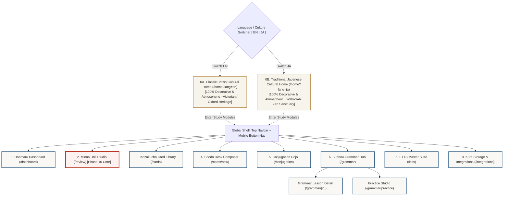
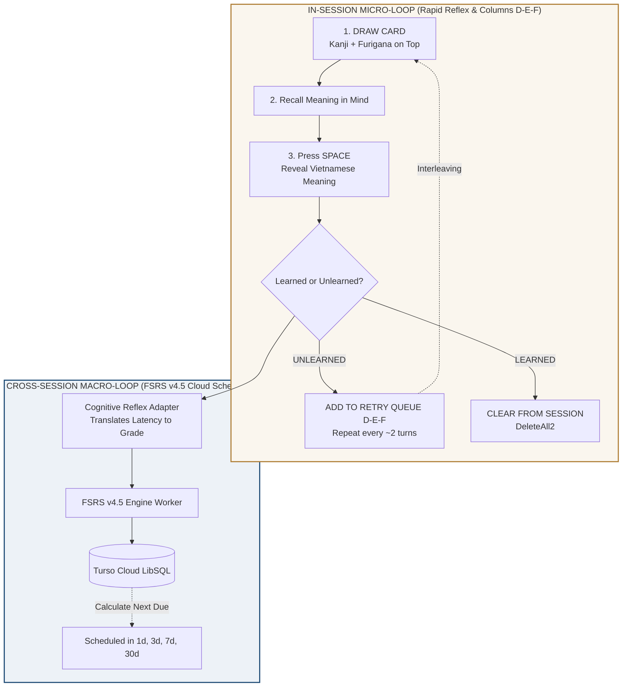

# SYSTEM UI/UX SKETCH SPECIFICATION
## Project: Japanese SRS System · Kiokudo (FSRS Cognitive Spaced Repetition Engine)
> **Document:** Comprehensive Wireframe & Layout Architecture Specification  
> **File Path:** `doc/SYSTEM_UI_UX_SKETCH_SPECIFICATION.md`  
> **Version:** `4.0.0-CULTURAL-PORTALS-AND-COMPLETE-DOBAI`  
> **Scope:** Cultural Portals (UK & Japan), All 11 Core System Screens, and Comprehensive **Minna No Nihongo Rapid Reflex Drill Studio (Phase 10)**  
> **Design Philosophy:** Wabi-Sabi & British Classic · Nippon Traditional Colors · 8pt Grid Auto-Layout · WCAG 2.1 AA  
> **Language Standards:** UI Chrome & Controls in English · Learning Vocabulary & Explanations in Vietnamese · Furigana over all Kanji + Meaning

---

## TABLE OF CONTENTS

1. [Information Architecture & Dual-Culture Gateway Flow](#1-information-architecture)
2. [Screen 0A: Cultural Home — Classic British Heritage (`/` when EN selected)](#2-screen-0a-british-home)
3. [Screen 0B: Cultural Home — Traditional Japanese Wabi-Sabi (`/` when JA selected)](#3-screen-0b-japanese-home)
4. [Global Shell & Navigation (Torii Header & Kirie BottomNav)](#4-global-shell)
5. [Screen 1: Honmaru Functional Dashboard (`/dashboard`)](#5-screen-1-honmaru-dashboard)
6. [Screen 2: Minna No Nihongo Rapid Reflex Drill Studio (`/review` - Phase 10 Core)](#6-screen-2-minna-drill-studio)
   - [6.1. Dual-Loop Architectural Blueprint (Excel Micro-Loop + FSRS Macro-Loop)](#61-dual-loop-blueprint)
   - [6.2. Desktop Rapid Reflex Drill Board (2-Column Bento Grid 72% / 28%)](#62-desktop-rapid-board)
   - [6.3. State 1: Drawn Card / Masked Answer (Active Neural Retrieval)](#63-state-1-drawn)
   - [6.4. State 2: Revealed & Latency Evaluation (Bjork Dynamics & Ombre Feedback)](#64-state-2-revealed)
   - [6.5. State 3: Reverse Drill (Vietnamese -> Japanese Recall)](#65-state-3-reverse)
   - [6.6. In-Session Retry Queue Detail (Columns D-E-F Interleaving Engine)](#66-retry-queue-detail)
   - [6.7. Mobile Responsive Drill Layout (390px Thumb Zone)](#67-mobile-drill-layout)
   - [6.8. Cognitive Reflex to FSRS Mathematical Grade Conversion Matrix](#68-fsrs-matrix)
   - [6.9. Ergonomic Hotkeys Mapping](#69-hotkeys-map)
7. [Screen 3: Karuta Card Arena (`/review?legacy=true`)](#7-screen-3-karuta-legacy)
8. [Screen 4: Tanzakucho Deck & Card Library (`/cards`)](#8-screen-4-tanzakucho)
9. [Screen 5: Shodo Desk Card Composer & AI Copilot (`/cards/new`)](#9-screen-5-shodo-desk)
10. [Screen 6: Conjugation Dojo (`/conjugation`)](#10-screen-6-conjugation-dojo)
11. [Screen 7: Bunbou Grammar Hub (`/grammar`)](#11-screen-7-bunbou-hub)
12. [Screen 8: Grammar Lesson Detail (`/grammar/[lessonId]`)](#12-screen-8-grammar-lesson)
13. [Screen 9: Bunbou Practice Studio (`/grammar/practice`)](#13-screen-9-grammar-practice)
14. [Screen 10: Academic English & IELTS Master Suite (`/ielts`)](#14-screen-10-ielts)
15. [Screen 11: Kura Storage & External Integrations (`/integrations`)](#15-screen-11-kura-integrations)
16. [Design Tokens & Nippon Colors Palette](#16-design-tokens)

---

<a id="1-information-architecture"></a>
## 1. INFORMATION ARCHITECTURE & DUAL-CULTURE GATEWAY FLOW

When learners access the root URL (`/`), the system presents an **Immersive Cultural Home Portal** corresponding to the selected culture switch (`EN` or `JA`). These two home portals contain **strictly decorative and cultural artwork**, with zero operational widgets. From the top navigation or entry seal, learners access the functional modules:



---

<a id="2-screen-0a-british-home"></a>
## 2. SCREEN 0A: CULTURAL HOME — CLASSIC BRITISH HERITAGE (`/` WHEN EN SELECTED)

> **Purpose:** Purely decorative and atmospheric cultural greeting portal.  
> **Functional Constraints:** **Zero operational widgets** (No card queues, no review buttons, no study statistics). Pure visual and literary inspiration.  
> **Aesthetic Theme:** Victorian Oxford/Cambridge Library, Mahogany Paneling, Brass Accents, Deep Forest Green & Burgundy, Antique Bookbindings, Fine Serif Typography.

```
+--------------------------------------------------------------------------------------------------------------------+
| [OXFORD & CAMBRIDGE LEDGER]                                                          [CULTURE: EN | JA] [PORTAL]   |
+--------------------------------------------------------------------------------------------------------------------+
|                                                                                                                    |
|   ~~~~~~~~~~~~~~~~~~~~~~~~~~~~~~~~~~~~~~~~ THE SCHOLAR'S SANCTUARY ~~~~~~~~~~~~~~~~~~~~~~~~~~~~~~~~~~~~~~~~~~~~~~  |
|                                                                                                                    |
|               .--------------------------------------------------------------------------------.                   |
|              /                                                                                / |                  |
|             |        "Knowledge is power; memory is the treasury and guardian of all things."  | |                  |
|             |                                   -- Marcus Tullius Cicero                       | |                  |
|             |                                                                                  | |                  |
|             |   [ Engraving: Bodleian Library Vaults · Oxford University Antiquity ]           | |                  |
|             |   Handcrafted Leather Bookbindings · Antique Brass Astrolabe · Dark Mahogany     | |                  |
|             |                                                                                  | |                  |
|             |   "Reading maketh a full man; conference a ready man; and writing an exact man." | |                  |
|             |                                   -- Sir Francis Bacon, 1597                     | |                  |
|             |                                                                                  | /                   |
|              \________________________________________________________________________________/                    |
|                                                                                                                    |
|   --------------------------------- HERITAGE INSCRIPTION & MOTIFS ------------------------------------------------  |
|                                                                                                                    |
|   [ Motif: Heraldic Crest & Oak Leaf ]           [ Motif: Westminster Chime & Clockwork ]                          |
|   The pursuit of disciplined intellect           Timeless mastery forged through deliberate                        |
|   rooted in centuries of academic rigor.         recollection and steady scholarship.                              |
|                                                                                                                    |
|   ~~~~~~~~~~~~~~~~~~~~~~~~~~~~~~~~~~~~~~~~~~~~~~~~~~~~~~~~~~~~~~~~~~~~~~~~~~~~~~~~~~~~~~~~~~~~~~~~~~~~~~~~~~~~~~~~  |
|   (Decorative Cultural Gateway · Select any module above to enter the Study Pavilions)                            |
+--------------------------------------------------------------------------------------------------------------------+
```

---

<a id="3-screen-0b-japanese-home"></a>
## 3. SCREEN 0B: CULTURAL HOME — TRADITIONAL JAPANESE WABI-SABI (`/` WHEN JA SELECTED)

> **Purpose:** Purely decorative and atmospheric cultural greeting portal.  
> **Functional Constraints:** **Zero operational widgets** (No card queues, no review buttons, no study statistics). Pure visual contemplation and Zen stillness.  
> **Aesthetic Theme:** Wabi-Sabi, Zen Rock Garden (Karesansui), Engawa Veranda, Tokonoma Alcove, Pine Bonsai, Hanging Scroll (Kakejiku), Shippori Mincho Calligraphy, Washi Paper Textures.

```
+--------------------------------------------------------------------------------------------------------------------+
| [KIOKUDO] 記憶道                                                                     [CULTURE: JA | EN] [PORTAL]   |
+--------------------------------------------------------------------------------------------------------------------+
|                                                                                                                    |
|   ~~~~~~~~~~~~~~~~~~~~~~~~~~~~~~~~~~~~~~~~~~ 侘 寂 · 静 寂 の 間 ~~~~~~~~~~~~~~~~~~~~~~~~~~~~~~~~~~~~~~~~~~~~~~~~~~  |
|                                                                                                                    |
|               +--------------------------------------------------------------------------------+                   |
|               |                                                                                |                   |
|               |                             閑 さ や                                           |                   |
|               |                             岩 に 染 み 入 る                                 |                   |
|               |                             蝉 の 声                                           |                   |
|               |                                                                                |                   |
|               |                    (Tiếng ve ngân ngấm sâu vào khe đá cổ,                     |                   |
|               |                     vạn vật chìm vào tĩnh lặng tuyệt đối.)                     |                   |
|               |                                                                                |                   |
|               |                                  -- Matsuo Basho (松尾芭蕉 · 1689)             |                   |
|               |                                                                                |                   |
|               |   [ Họa đồ: Thềm gỗ Engawa nhìn ra Vườn đá thiền Karesansui ]                 |                   |
|               |   Bonsai Tùng Bách bách niên · Trà đạo Chasen · Giấy thủ công Washi viền vàng  |                   |
|               +--------------------------------------------------------------------------------+                   |
|                                                                                                                    |
|   --------------------------------- TRIẾT LÝ NHẬN THỨC VĂN HÓA NHẬT BẢN -------------------------------------------  |
|                                                                                                                    |
|   [ Điểm xuyết: Hoa văn gợn sóng Seigaiha ]      [ Điểm xuyết: Trúc thanh phong Shippo ]                           |
|   Kintsugi (Hàn gắn khuyết điểm bằng vàng):     Nhất kỳ nhất hội (Trân quý từng khoảnh khắc):                     |
|   Mỗi lần quên và khắc phục là một vết gãy      Mỗi chữ Hán học hôm nay là một nhân duyên                         |
|   được bọc vàng rực rỡ trong trí nhớ.           sâu sắc trong hành trình tri thức đời người.                       |
|                                                                                                                    |
|   ~~~~~~~~~~~~~~~~~~~~~~~~~~~~~~~~~~~~~~~~~~~~~~~~~~~~~~~~~~~~~~~~~~~~~~~~~~~~~~~~~~~~~~~~~~~~~~~~~~~~~~~~~~~~~~~~  |
|   (Bản Doanh Nghệ Thuật Văn Hóa · Chọn các phân hệ phía trên để bắt đầu tiến hành việc học)                        |
+--------------------------------------------------------------------------------------------------------------------+
```

---

<a id="4-global-shell"></a>
## 4. GLOBAL SHELL & NAVIGATION

### 4.1. Desktop Top Navigation Bar (Width >= 1024px)
Fixed header height: 64px. Deep Indigo (Aizome `#16253B`) with Silk Gold (Kincha `#AF7E36`) accent border:

```
+--------------------------------------------------------------------------------------------------------------------+
| [KIOKUDO] JAPANESE SRS       |  [Home]  [Dashboard]  [Decks]  [Verbs]  [Grammar]  [New Card]  [Drill]  | [EN|JA] [User] |
+--------------------------------------------------------------------------------------------------------------------+
```
* **Hanko Seal Badge (`KIOKUDO`):** Deep Red Bengara (`#9E3223`), border radius 4px, white serif typography.
* **Active Navigation State:** Pill container with Aizome Light (`#20507B`), 6px rounded corners.
* **Rapid Drill CTA (`[Drill]`):** Silk Gold font (`#F6D89B`), font weight 800.
* **Right Control Cluster:** Language switcher, User profile pill, Offline IndexedDB sync indicator dot.

### 4.2. Mobile Floating Bottom Navigation (Width <= 768px)
Floating pill container positioned 14px above the viewport bottom, height 62px, Kirie deep shadow:

```
+------------------------------------------------------------------------+
|                                                                        |
|    +--------------------------------------------------------------+    |
|    |     [Home]     [Decks]     [Grammar]     [Drill]     [User]   |    |
|    +--------------------------------------------------------------+    |
+------------------------------------------------------------------------+
```

---

<a id="5-screen-1-honmaru-dashboard"></a>
## 5. SCREEN 1: HONMARU FUNCTIONAL DASHBOARD (`/dashboard`)

Bento Grid layout displaying active FSRS scheduling stats and queue summaries:

```
+--------------------------------------------------------------------------------------------------------------------+
| HONMARU DASHBOARD                                                                             Sun, Oct 05 | EN / VI|
+--------------------------------------------------------------------------------------------------------------------+
|                                                                                                                    |
|   +------------------------------------------------------------------------------------------------------------+   |
|   | WELCOME HERO BANNER                                                                                        |   |
|   |   Daruma Progress: Active Eye Marked                                                                       |   |
|   |   Good morning, Cassius! Long-term memory reinforcement session is ready.                                  |   |
|   |   12 cards are due for cognitive retrieval under FSRS v4.5 scheduler.                     [ DRILL NOW ]   |   |
|   +------------------------------------------------------------------------------------------------------------+   |
|                                                                                                                    |
|   +-----------------------+  +-----------------------+  +-----------------------+  +-----------------------+       |
|   | TOTAL CARDS           |  | DUE TODAY             |  | RETENTION TARGET      |  | BJORK LATENCY         |       |
|   | 676 cards             |  | 12 cards              |  | 94%                   |  | 1.4s                  |       |
|   | [=== Green Stable ==] |  | [=== Red Urgent ===]  |  | [=== Ombre Metric ==] |  | [=== Ombre Metric ==] |       |
|   +-----------------------+  +-----------------------+  +-----------------------+  +-----------------------+       |
|                                                                                                                    |
|   ==================== LEFT COLUMN: STUDY QUEUE (58%) =================   ==== RIGHT COLUMN: DECK CATALOG (42%) ===|
|   |                                                                   |   |                                       |
|   |  PRIORITY STUDY QUEUE                                             |   |  DECK CATALOG                         |
|   |  --------------------------------------------------------------   |   |  -----------------------------------  |
|   |                                                                   |   |                                       |
|   |  1. あいまい                                                      |   |  [Kotoba] JPD133 - Vocabulary Kotoba  |
|   |     曖　昧   (Mơ hồ, không rõ ràng) • Atamadaka [1]               |   |     252 cards • 250 new • 2 learned   |
|   |     Ví dụ: 曖昧な返事をするな (Đừng trả lời mập mờ)               |   |     [ Start Study ]                   |
|   |     [S: 4.2d | Reps: 5]                            [ Study Card ] |   |                                       |
|   |                                                                   |   |  [Kanji] JPD133 - Kanji Characters    |
|   |  2. ちゅうちょ                                                    |   |     232 cards • 232 learned [ Review ]|
|   |     躊　躇   (Do dự, chần chừ) • Heiban [0]                       |   |                                       |
|   |     Ví dụ: 躊躇せずに発言する (Phát biểu không ngần ngại)         |   |  [JLPT N5] JLPT N5 - Core Vocabulary  |
|   |     [S: 6.8d | Reps: 7]                            [ Study Card ] |   |     78 cards • 78 new       [ Start ] |
|   |                                                                   |   |                                       |
|   |  3. こもれび                                                      |   |  [Grammar] JPD133 - Bunbou Grammar    |
|   |     木漏れ日 (Ánh nắng xuyên qua kẽ lá) • Nakadaka [3]            |   |     96 cards • 32 rules     [ Practice ]|
|   |     [S: 12.1d | Reps: 9]                           [ Study Card ] |   |                                       |
|   |                                                                   |   |  -----------------------------------  |
|   |  4. いちごいちえ                                                  |   |  JPD133 BUNBOU ENGINE                 |
|   |     一期一会 (Đời người gặp một lần, quý trọng duyên)             |   |  32 grammar patterns • 204 exercises  |
|   |     [S: 18.5d | Reps: 11]                          [ Study Card ] |   |  Unit 8: Adjectives (Completed 8/8)   |
|   |                                                                   |   |  [ Grammar Hub ]  [ Practice Studio ] |
|   |  5. せっさたくま                                                  |   |                                       |
|   |     切磋琢磨 (Cùng nhau nỗ lực rèn giũa nâng cao thực lực)        |   |                                       |
|   |     [S: 24.0d | Reps: 14]                          [ Study Card ] |   |                                       |
|   =====================================================================   =========================================|
+--------------------------------------------------------------------------------------------------------------------+
```

---

<a id="6-screen-2-minna-drill-studio"></a>
## 6. SCREEN 2: MINNA NO NIHONGO RAPID REFLEX DRILL STUDIO (`/review` - PHASE 10 CORE)

This is the **heart of Phase 10**, translating the rapid reflex workbook flow of Excel `D:\JLPT\Dò bài - Minna.xlsm` into a responsive single-screen drill studio with Zero-Regression backend safety.

<a id="61-dual-loop-blueprint"></a>
### 6.1. Dual-Loop Architectural Blueprint



<a id="62-desktop-rapid-board"></a>
### 6.2. Desktop Rapid Reflex Drill Board (2-Column Bento Grid: 72% / 28%)

```
+--------------------------------------------------------------------------------------------------------------------+
| MINNA DRILL STUDIO                           Progress: [=========......] 14/45  | Mode: [Forward JA -> VI v] | Audio|
| CURRICULUM SLOT:  [All]  [Slot 1]  [Slot 2]  [Slot 3 (Active)]  [Slot 4]  [Slot 5]  [Slot 6]  [Slot 8]  [Slot 10]    |
+--------------------------------------------------------------------------------------------------------------------+
|                                                                                    |                               |
|   ======================== MAIN DRILL VIEW (72% WIDTH) ===========================   |  === RETRY QUEUE (28%) ===  |
|   |                                                                            |   |                               |
|   |   +--------------------------------------------------------------------+   |   |  UNLEARNED RETRY QUEUE        |
|   |   |  TAG: JPD133 · Slot 3 · Giving / Receiving                         |   |   |  (Interleaved during session) |
|   |   |                                                                    |   |   |                               |
|   |   |                               あげる                               |   |   |  1. じしょ                    |
|   |   |                               上　げる                             |   |   |     辞　書   (từ điển)        |
|   |   |             (cho, tặng - tôi cho người khác)                       |   |   |     [Retry in 1 turn]         |
|   |   |                                                                    |   |   |                               |
|   |   |             あげる (あげます)     [ Audio (P) ]                    |   |   |  2. てちょう                  |
|   |   |                                                                    |   |   |     手　帳   (sổ tay)         |
|   |   |   - - - - - - - - - - - - - - - - - - - - - - - - - - - - - - - -  |   |   |     [Retry in 3 turns]        |
|   |   |                                                                    |   |   |                               |
|   |   |   [ VIETNAMESE MEANING & CONTEXT EXAMPLES (MASKED OR EXPANDED) ]   |   |   |  3. おみやげ                  |
|   |   |   cho, tặng (tôi cho người khác)                                   |   |   |     お土産   (quà lưu niệm)   |
|   |   |   Ví dụ: 私は山田さんに本をあげました。                            |   |   |     [Retry in 4 turns]        |
|   |   |   (Tôi đã tặng sách cho bạn Yamada.)                               |   |   |                               |
|   |   +--------------------------------------------------------------------+   |   |  ---------------------------  |
|   |                                                                            |   |  Total Queue: 3 cards         |
|   |   Bjork Latency: 1.1s  •  Grade: FSRS Easy             [ Undo (Z) ]        |   |  [Clear all to complete]      |
|   |                                                                            |   |                               |
|   |   +---------------------------------+  +-------------------------------+   |   |                               |
|   |   |    UNLEARNED (Bksp / 2)         |  |     LEARNED (Enter / 1)       |   |   |                               |
|   |   |    • Queue into Retry Queue     |  |     • Increase FSRS Stability |   |   |                               |
|   |   |    • Interleaved after ~2 turns |  |     • Draw next card          |   |   |                               |
|   |   +---------------------------------+  +-------------------------------+   |   |                               |
|   ==============================================================================   =================================
|                                                                                                                    |
|   [ HOTKEYS:  Space: Reveal Answer  |  Enter / 1: Learned  |  Bksp / 2: Unlearned  |  Z: Undo  |  P: Audio ]           |
+--------------------------------------------------------------------------------------------------------------------+
```

<a id="63-state-1-drawn"></a>
### 6.3. State 1: Drawn Card / Masked Answer (Active Neural Retrieval)

```
+---------------------------------------------------------------------------------------+
|  TAG: JPD133 · Slot 3 · Giving & Receiving                        Card Progress: 14/45|
|                                                                                       |
|                                       あげる                                          |
|                                       上　げる                                        |
|                             (cho, tặng - tôi tặng người khác)                         |
|                                                                                       |
|                                  あげる (あげます)                                    |
|                                  [ Audio Play (P) ]                                   |
|                                                                                       |
|   + - - - - - - - - - - - - - - - - - - - - - - - - - - - - - - - - - - - - - - - +   |
|   |  MASKED VIETNAMESE MEANING                                                    |   |
|   |                                                                               |   |
|   |     Recall meaning in memory... Press SPACE or click below to REVEAL ANSWER   |   |
|   |                                                                               |   |
|   + - - - - - - - - - - - - - - - - - - - - - - - - - - - - - - - - - - - - - - - +   |
|                                                                                       |
|   Measuring Bjork retrieval latency...                                                |
|                                                                                       |
|   +-------------------------------------------------------------------------------+   |
|   |                                                                               |   |
|   |                     [  REVEAL MEANING (Press Space)  ]                        |   |
|   |                                                                               |   |
|   +-------------------------------------------------------------------------------+   |
|                                                                                       |
|      (Learned & Unlearned action buttons are disabled until answer is revealed)       |
+---------------------------------------------------------------------------------------+
```

<a id="64-state-2-revealed"></a>
### 6.4. State 2: Revealed & Latency Evaluation (Bjork Dynamics & Ombre Feedback)

```
+---------------------------------------------------------------------------------------+
|  TAG: JPD133 · Slot 3 · Giving & Receiving                        Card Progress: 14/45|
|                                                                                       |
|                                       あげる                                          |
|                                       上　げる                                        |
|                             (cho, tặng - tôi tặng người khác)                         |
|                                                                                       |
|                                  あげる (あげます)                                    |
|                                  [ Audio Playing... ]                                 |
|                                                                                       |
|   +-------------------------------------------------------------------------------+   |
|   |  PRIMARY MEANING (VIETNAMESE):                                                |   |
|   |  cho, tặng (tôi cho người khác)                                               |   |
|   |  • Cấu trúc: [Người cho] は [Người nhận] に N を あげます                     |   |
|   |                                                                               |   |
|   |  CONTEXT SENTENCE (i+1):                                                      |   |
|   |  私は山田さんに本をあげました。 (Tôi đã tặng sách cho bạn Yamada.)            |   |
|   +-------------------------------------------------------------------------------+   |
|                                                                                       |
|   Retrieval Latency: 1.1s  •  Grade: [ FSRS Easy (Fast Recall) ]                      |
|                                                                                       |
|   +---------------------------------------+   +-----------------------------------+   |
|   |                                       |   |                                   |   |
|   |       UNLEARNED                       |   |       LEARNED                     |   |
|   |       (Backspace / Key 2)             |   |       (Enter / Key 1)             |   |
|   |       • Queue into Columns D-E-F      |   |       • Increase FSRS Stability   |   |
|   |       • Retry scheduled in ~2 turns   |   |       • Draw next new card        |   |
|   |                                       |   |                                   |   |
|   +---------------------------------------+   +-----------------------------------+   |
|                                                                                       |
|                               [ Undo Misclick (Ctrl+Z / Z) ]                          |
+---------------------------------------------------------------------------------------+
```

<a id="65-state-3-reverse"></a>
### 6.5. State 3: Reverse Drill (Vietnamese -> Japanese Recall)

```
+---------------------------------------------------------------------------------------+
|  DRILL MODE: REVERSE (VIETNAMESE -> JAPANESE)                     Card Progress: 08/45|
|                                                                                       |
|                                cho, tặng (tôi tặng người khác)                        |
|                                Ngữ cảnh: Tặng sách cho Yamada                         |
|                                                                                       |
|   + - - - - - - - - - - - - - - - - - - - - - - - - - - - - - - - - - - - - - - - +   |
|   |  MASKED JAPANESE KANJI & HIRAGANA                                             |   |
|   |     Recall Kanji & Kana in memory... Press SPACE to VERIFY                    |   |
|   + - - - - - - - - - - - - - - - - - - - - - - - - - - - - - - - - - - - - - - - +   |
|                                                                                       |
|   +-------------------------------------------------------------------------------+   |
|   |                     [  REVEAL JAPANESE ANSWER (Space)  ]                      |   |
|   +-------------------------------------------------------------------------------+   |
+---------------------------------------------------------------------------------------+
```

<a id="66-retry-queue-detail"></a>
### 6.6. In-Session Retry Queue Detail (Columns D-E-F Interleaving Engine)

```
+-----------------------------------+
| RETRY QUEUE (COLUMNS D-E-F)       |
| In-session interleaving queue     |
+-----------------------------------+
|                                   |
| +-------------------------------+ |
| | じしょ                        | |
| | 辞　書   (từ điển)            | |
| | - - - - - - - - - - - - - - - | |
| | Queue #1     [Retry in 1 turn]| |
| +-------------------------------+ |
|                                   |
| +-------------------------------+ |
| | てちょう                      | |
| | 手　帳   (sổ tay)             | |
| | - - - - - - - - - - - - - - - | |
| | Queue #2    [Retry in 3 turns]| |
| +-------------------------------+ |
|                                   |
| +-------------------------------+ |
| | おみやげ                      | |
| | お土産   (quà lưu niệm)       | |
| | - - - - - - - - - - - - - - - | |
| | Queue #3    [Retry in 4 turns]| |
| +-------------------------------+ |
|                                   |
| --------------------------------- |
| Session completes when retry      |
| queue count reaches 0.            |
+-----------------------------------+
```

<a id="67-mobile-drill-layout"></a>
### 6.7. Mobile Responsive Drill Layout (Width 390px)

```
+-----------------------------------------+
| [KIOKUDO] Minna Drill Board      [14/45]|
+-----------------------------------------+
| [All] [Slot 3: Giving/Receiving] [Slot 4|
+-----------------------------------------+
|                                         |
|                 あげる                  |
|                 上　げる                |
|      (cho, tặng - tôi cho người khác)   |
|                                         |
|            あげる (あげます)            |
|               [ Audio (P) ]             |
|                                         |
|  +-----------------------------------+  |
|  | cho, tặng (tôi cho người khác)    |  |
|  | 私は山田さんに本をあげました。    |  |
|  +-----------------------------------+  |
|                                         |
|  Latency: 1.1s • FSRS Easy              |
|                                         |
|  +-----------------------------------+  |
|  |   LEARNED (Matcha Green)          |  |
|  +-----------------------------------+  |
|  |   UNLEARNED (Shu-iro Red)         |  |
|  +-----------------------------------+  |
|                                         |
|  +-----------------------------------+  |
|  | Retry Queue: 3 items [Expand]     |  |
|  | 1. 辞書 • 2. 手帳 • 3. お土産     |  |
|  +-----------------------------------+  |
+-----------------------------------------+
```

<a id="68-fsrs-matrix"></a>
### 6.8. Cognitive Reflex to FSRS Mathematical Grade Conversion Matrix

| User Action | Latency Interval ($\Delta t$) | Equivalent FSRS Grade | FSRS Stability Mathematical Impact | Session Handling |
| :--- | :--- | :--- | :--- | :--- |
| **LEARNED** | $\Delta t < 1.5\text{s}$ | **`Easy` (Grade 4)** | $S_{\text{new}} = S \cdot (1 + \text{bonus} \cdot 1.3)$ | Cleared from session queue immediately |
| **LEARNED** | $1.5\text{s} \le \Delta t \le 6.0\text{s}$ | **`Good` (Grade 3)** | $S_{\text{new}} = S \cdot (1 + \text{bonus})$ | Cleared from session queue immediately |
| **LEARNED** | $\Delta t > 6.0\text{s}$ | **`Hard` (Grade 2)** | $S_{\text{new}} = S \cdot 1.15$ | Cleared from session queue immediately |
| **UNLEARNED** | Any duration | **`Again` (Grade 1)** | $S_{\text{lapse}} = w_{11} \cdot D^{-w_{12}} \dots$ | **Pushed to Columns D-E-F Retry Queue** |

<a id="69-hotkeys-map"></a>
### 6.9. Ergonomic Hotkeys Mapping

| Key Code | Target Interaction | Visual Feedback | Cognitive Ergonomics |
| :--- | :--- | :--- | :--- |
| `Space` | Toggle Reveal / Mask | 0ms instant height transition, Washi paper sound | Thumbs resting on spacebar |
| `Enter` or `1` | Mark **LEARNED** | Matcha Green button ripple, next card drawn | Right index or numpad reflex |
| `Backspace` or `2` | Mark **UNLEARNED** | Shu-iro Red button ripple, item queued to D-E-F | Left/Right thumb error trigger |
| `P` | Pronounce Headword | Web Speech API speech synthesis (`ja-JP`) | Auditory reinforcement |
| `Z` or `Ctrl+Z` | Undo last rating | Pop previous card from history stack | Misclick safe protection |

---

<a id="7-screen-3-karuta-legacy"></a>
## 7. SCREEN 3: KARUTA CARD ARENA (`/review?legacy=true`)

The 3D Karuta card interface preserved for cognitive benchmarking:

```
+---------------------------------------------------------------------------------------+
| Review Queue: All Cards                                            Question 14 of 45  |
| [===========================================================........................]  |
+---------------------------------------------------------------------------------------+
|                                                                                       |
|   +-------------------------------------------------------------------------------+   |
|   | [REVEALED]                                                                    |   |
|   |                                    あいまい                                   |   |
|   |                                    曖　昧                                     |   |
|   |                           (Mơ hồ, không rõ ràng)                              |   |
|   |                                                                               |   |
|   |   +-----------------------------+   +-----------------------------+           |   |
|   |   | KUN-YOMI (Native Japanese)  |   | ON-YOMI (Sino-Japanese)     |           |   |
|   |   | あいまい                    |   | アイマイ                    |           |   |
|   |   +-----------------------------+   +-----------------------------+           |   |
|   |                                                                               |   |
|   |   Tokyo Pitch Accent: Atamadaka [1]  •──•\____•____•                          |   |
|   |                                                                               |   |
|   |   +-----------------------------------------------------------------------+   |   |
|   |   | VIETNAMESE MEANING: Mơ hồ, không rõ ràng, mập mờ                      |   |   |
|   |   +-----------------------------------------------------------------------+   |   |
|   |                                                                               |   |
|   |   +-----------------------------------------------------------------------+   |   |
|   |   | CONTEXT SENTENCE (i+1):                                               |   |   |
|   |   | 「曖昧な返事をするな」 (Đừng trả lời mập mờ dứt khoát)                |   |   |
|   |   +-----------------------------------------------------------------------+   |   |
|   |                                                                               |   |
|   +-------------------------------------------------------------------------------+   |
|                                                                                       |
|   +---------------+   +---------------+   +---------------+   +---------------+       |
|   |     AGAIN     |   |     HARD      |   |     GOOD      |   |     EASY      |       |
|   |    < 1 min    |   |   ~ 1.2 d     |   |   ~ 3.5 d     |   |   ~ 7.0 d     |       |
|   |    (Key 1)    |   |   (Key 2)     |   |   (Key 3)     |   |   (Key 4)     |       |
|   +---------------+   +---------------+   +---------------+   +---------------+       |
+---------------------------------------------------------------------------------------+
```

---

<a id="8-screen-4-tanzakucho"></a>
## 8. SCREEN 4: TANZAKUCHO DECK & CARD LIBRARY (`/cards`)

Comprehensive catalogue of 676 cards modeled after classic scroll codices:

```
+--------------------------------------------------------------------------------------------------------------------+
| TANZAKUCHO CARD LIBRARY (676 Cards Total)                                                                          |
+--------------------------------------------------------------------------------------------------------------------+
|                                                                                                                    |
|   [ Search Kanji, Hiragana... ]   [ Deck: All v ]   [ Status: All v ]   [ Sort: Stability v ]   [ + New Card ]     |
|                                                                                                                    |
|   +------------------------------------------------------------------------------------------------------------+   |
|   | KANJI & FURIGANA    | READING & PHONETICS      | VIETNAMESE MEANING             | DECK       | FSRS    | ACTION|   |
|   |---------------------|--------------------------|--------------------------------|------------|---------|-------|   |
|   | あいまい            | あいまい                 | Mơ hồ, không rõ ràng           | Chuukyuu   | S: 4.2d | Edit  |   |
|   | 曖　昧              | (Atamadaka [1])          |                                |            |         | Delete|   |
|   |                     |                          |                                |            |         |       |   |
|   | ちゅうちょ          | ちゅうちょ               | Do dự, chần chừ, ngập ngừng    | Chuukyuu   | S: 6.8d | Edit  |   |
|   | 躊　躇              | (Heiban [0])             |                                |            |         | Delete|   |
|   |                     |                          |                                |            |         |       |   |
|   | こもれび            | こもれび                 | Ánh nắng xuyên qua kẽ lá       | Life       | S: 12.1d| Edit  |   |
|   | 木漏れ日            | (Nakadaka [3])           |                                |            |         | Delete|   |
|   |                     |                          |                                |            |         |       |   |
|   | あげる              | あげます                 | cho, tặng (tôi cho người khác) | JPD133     | S: 0.8d | Edit  |   |
|   | 上　げる            | (Slot 3)                 |                                |            |         | Delete|   |
|   |                     |                          |                                |            |         |       |   |
|   | りょうしん          | りょうしん               | bố mẹ, song thân gia đình      | JPD133     | S: 28.0d| Edit  |   |
|   | 両　親              | (Slot 1)                 |                                |            |         | Delete|   |
|   +------------------------------------------------------------------------------------------------------------+   |
|                                                                                                                    |
|   Showing 1 - 20 of 676 cards                                                     [ << Prev ] [ 1 ] [ 2 ] [ Next >>]|
+--------------------------------------------------------------------------------------------------------------------+
```

---

<a id="9-screen-5-shodo-desk"></a>
## 9. SCREEN 5: SHODO DESK CARD COMPOSER & AI COPILOT (`/cards/new`)

Split-screen layout pairing Calligraphic Editor with Live Preview:

```
+--------------------------------------------------------------------------------------------------------------------+
| SHODO DESK & AI CARD COMPOSER                                                                                      |
+--------------------------------------------------------------------------------------------------------------------+
|                                                                                                                    |
|   ================ INPUT EDITOR (58%) =================   ================ LIVE PREVIEW (42%) ================     |
|   |                                                   |   |                                                  |     |
|   |  1. SELECT DECK:                                  |   |  LIVE CARD PREVIEW                               |     |
|   |  [ JPD133 - Vocabulary Kotoba                  v ]|   |  +--------------------------------------------+  |     |
|   |                                                   |   |  | [QUESTION]                                 |  |     |
|   |  2. KANJI HEADWORD / TARGET VOCABULARY:           |   |  |                                            |  |     |
|   |  [ あげる                                       ] |   |  |                    あげる                  |  |     |
|   |                                                   |   |  |                    上　げる                |  |     |
|   |  3. HIRAGANA FURIGANA READING:                    |   |  |        (cho, tặng - tôi cho người khác)    |  |     |
|   |  [ あげる (あげます)                            ] |   |  |                                            |  |     |
|   |                                                   |   |  |             あげる (あげます)              |  |     |
|   |  4. VIETNAMESE MEANING & USAGE NOTES:             |   |  |                                            |  |     |
|   |  [ cho, tặng (tôi cho người khác)               ] |   |  | +----------------------------------------+ |  |     |
|   |  [ [Người cho] は [Người nhận] に N を あげます ] |   |  | | cho, tặng (tôi cho người khác)         | |  |     |
|   |                                                   |   |  | | [Người cho] は [Người nhận] に N       | |  |     |
|   |  5. CONTEXT SENTENCE (SUPPORTS {{c1::cloze}}):    |   |  | +----------------------------------------+ |  |     |
|   |  [ 私は山田さんに本を {{c1::あげました}}。      ] |   |  |                                            |  |     |
|   |                                                   |   |  | 私は山田さんに本をあげました。              |  |     |
|   |  AI COPILOT RECOMMENDATION:                       |   |  | (Tôi đã tặng sách cho bạn Yamada.)        |  |     |
|   |  • Identified Minna Lesson 7 Giving/Receiving rule|   |  +--------------------------------------------+  |     |
|   |  • Auto-assigned Tokyo Pitch Accent Heiban [0]    |   |                                                  |     |
|   |                                  [ Apply Copilot ]|   |                                                  |     |
|   |                                                   |   |                                                  |     |
|   |  [ SAVE CARD (Enter) ]   [ Save & Create Next ]   |   |                                                  |     |
|   =====================================================   ====================================================     |
+--------------------------------------------------------------------------------------------------------------------+
```

---

<a id="10-screen-6-conjugation-dojo"></a>
## 10. SCREEN 6: CONJUGATION DOJO (`/conjugation`)

Fast-paced verb form drill matrix covering all 3 Japanese verb groups:

```
+--------------------------------------------------------------------------------------------------------------------+
| CONJUGATION DOJO                                                                   Score: 850 pts • Streak: 12     |
+--------------------------------------------------------------------------------------------------------------------+
|                                                                                                                    |
|   SELECT FORM: [Te-form (Active)]  [Nai-form]  [Ta-form]  [Dictionary]  [Potential]  [Volitional]  [Passive]       |
|                                                                                                                    |
|   +------------------------------------------------------------------------------------------------------------+   |
|   | CURRENT CHALLENGE:                                                                        Question 08 / 20 |   |
|   |                                                                                                            |   |
|   |                                                  たべる                                                    |   |
|   |                                                  食　べる   (Ăn)                                           |   |
|   |                                    Group 2 Verb (Ichidan)                                                  |   |
|   |                                                                                                            |   |
|   |                                 Prompt: Conjugate into TE-FORM (V-te)                                      |   |
|   |                                                                                                            |   |
|   |                    [ Enter Romaji or Hiragana: tabete...                   ]   [ SUBMIT (Enter) ]          |   |
|   |                                                                                                            |   |
|   |   Group 2 Rule: Drop final る -> append て (食べる -> 食べて)                                              |   |
|   +------------------------------------------------------------------------------------------------------------+   |
|                                                                                                                    |
|   VERB GROUP ACCURACY MATRIX:                                                                                      |
|   • Group 1 (Godan): 82% accuracy  |  • Group 2 (Ichidan): 96% accuracy  |  • Group 3 (Irregular): 91% accuracy    |
+--------------------------------------------------------------------------------------------------------------------+
```

---

<a id="11-screen-7-bunbou-hub"></a>
## 11. SCREEN 7: BUNBOU GRAMMAR HUB (`/grammar`)

Modular repository of 32 JPD133 grammar structures for Minna Units 8 through 11:

```
+--------------------------------------------------------------------------------------------------------------------+
| JPD133 BUNBOU GRAMMAR HUB                                                     32 Rules • 204 Exercises • JLPT N5/N4|
+--------------------------------------------------------------------------------------------------------------------+
|                                                                                                                    |
|   [ Search grammar rules: V-te imasu, te mo ii... ]      Filter Unit: [All] [Unit 8 (Active)] [Unit 9] [Unit 10]    |
|                                                                                                                    |
|   +------------------------------------------------------------------------------------------------------------+   |
|   | UNIT 8: ADJECTIVES い & な (STATE & PROPERTY DESCRIPTIONS)                         Progress: 8/8 patterns  |   |
|   |                                                                                                            |   |
|   |   +------------------------------------+  +------------------------------------+  +--------------------+   |   |
|   |   | Pattern 1: N は A(い)/A(な) です   |  | Pattern 2: N は A(い)くない        |  | Pattern 3: とても  |   |   |
|   |   | Khẳng định tính chất của chủ ngữ   |  | Phủ định tính chất của sự vật      |  | Phó từ chỉ mức độ  |   |   |
|   |   | Ví dụ: この本はおもしろいです。     |  | Ví dụ: 富士山は高くありません。    |  | Ví dụ: とても寒い  |   |   |
|   |   | [ Details ] [ Practice 8 Qs ]      |  | [ Details ] [ Practice 6 Qs ]      |  | [ Details ]        |   |   |
|   |   +------------------------------------+  +------------------------------------+  +--------------------+   |   |
|   +------------------------------------------------------------------------------------------------------------+   |
|                                                                                                                    |
|   +------------------------------------------------------------------------------------------------------------+   |
|   | UNIT 9: PREFERENCES, CAPABILITIES & CAUSES (から)                                  Progress: 6/8 patterns  |   |
|   |   • Pattern 9: N が 好き / 嫌い です (Sở thích)      • Pattern 10: N が 上手 / 下手 です (Năng lực)            |   |
|   |   • Pattern 11: N が わかります / あります (Hiểu)    • Pattern 12: S1 から, S2 (Nguyên nhân kết quả)            |   |
|   +------------------------------------------------------------------------------------------------------------+   |
+--------------------------------------------------------------------------------------------------------------------+
```

---

<a id="12-screen-8-grammar-lesson"></a>
## 12. SCREEN 8: GRAMMAR LESSON DETAIL (`/grammar/[lessonId]`)

Detailed linguistic reference for each pattern:

```
+--------------------------------------------------------------------------------------------------------------------+
| UNIT 8 GRAMMAR · PATTERN 01                                                                    [ Back to Hub ]     |
| [STRUCTURE]: Subject + は + Adjective (い / な) + です                                                             |
+--------------------------------------------------------------------------------------------------------------------+
|                                                                                                                    |
|   +------------------------------------------------------------------------------------------------------------+   |
|   | CONJUGATION RULES:                                                                                         |   |
|   |   • い-Adjective: Keep い + です                                                                           |   |
|   |     ふじさん                                                                                               |   |
|   |     富士山は 高い です。(Núi Phú Sĩ thì cao.)                                                              |   |
|   |   • な-Adjective: Drop な + です                                                                           |   |
|   |     さくらさんは きれい です。(Bạn Sakura thì đẹp.)                                                        |   |
|   +------------------------------------------------------------------------------------------------------------+   |
|                                                                                                                    |
|   +------------------------------------------------------------------------------------------------------------+   |
|   | FREQUENT PITFALLS FOR VIETNAMESE LEARNERS:                                                                 |   |
|   |   Incorrect: さくらさんは きれいな です。(Thừa chữ な khi đứng trước です)                                  |   |
|   |   Correct:   さくらさんは きれい です。                                                                    |   |
|   +------------------------------------------------------------------------------------------------------------+   |
|                                                                                                                    |
|   CONTEXT EXAMPLES:                                                                                                |
|   1. 日本の食べ物はおいしいですが、高いです。(Đồ ăn Nhật ngon nhưng đắt.)                                          |
|   2. この部屋は静かですか。…いいえ、あまり静かじゃありません。(Căn phòng này có yên tĩnh không? Không lắm.)         |
|                                                                                                                    |
|   [ Practice 12 Exercises Now ]     [ View FSRS Grammar Cards ]                                                    |
+--------------------------------------------------------------------------------------------------------------------+
```

---

<a id="13-screen-9-grammar-practice"></a>
## 13. SCREEN 9: BUNBOU PRACTICE STUDIO (`/grammar/practice`)

Interactive workbook engine featuring 204 exercises with instant pedagogical feedback:

```
+--------------------------------------------------------------------------------------------------------------------+
| BUNBOU PRACTICE STUDIO                                                    Question: 14 / 204 • Accuracy: 92%       |
+--------------------------------------------------------------------------------------------------------------------+
|                                                                                                                    |
|   +------------------------------------------------------------------------------------------------------------+   |
|   | EXERCISE TYPE: FILL IN THE APPROPRIATE PARTICLE                                            JLPT N5 · Unit 9|   |
|   |                                                                                                            |   |
|   | Prompt:                                                                                                    |   |
|   | 「わたしは イタリアりょうり ( ___ ) すきです。」                                                            |   |
|   |                                                                                                            |   |
|   | Select correct option:                                                                                     |   |
|   |   (A) を (o)                                                                                               |   |
|   |   (B) が (ga)  <-- [ SELECTED ]                                                                            |   |
|   |   (C) に (ni)                                                                                              |   |
|   |   (D) で (de)                                                                                              |   |
|   |                                                                                                            |   |
|   |   +----------------------------------------------------------------------------------------------------+   |   |
|   |   | CORRECT ANSWER!                                                                                    |   |   |
|   |   | Pedagogical note:                                                                                  |   |   |
|   |   | Tính từ chỉ sở thích「すき / きらい」bắt buộc đi với trợ từ「gà」để chỉ đối tượng của sở thích.    |   |   |
|   |   | Người học hay nhầm với trợ từ「を」do ảnh hưởng của ngữ pháp tiếng Việt ("thích món Ý").            |   |   |
|   |   +----------------------------------------------------------------------------------------------------+   |   |
|   |                                                                                                            |   |
|   |                                                               [ NEXT QUESTION (Enter) >> ]                 |   |
|   +------------------------------------------------------------------------------------------------------------+   |
+--------------------------------------------------------------------------------------------------------------------+
```

---

<a id="14-screen-10-ielts"></a>
## 14. SCREEN 10: ACADEMIC ENGLISH & IELTS MASTER SUITE (`/ielts`)

British academic ledger tracking IELTS test metrics:

```
+--------------------------------------------------------------------------------------------------------------------+
| IELTS ACADEMIC MASTER SUITE (CAMBRIDGE LEDGER)                                 Target Band: 7.5 • Exam Year: 2026   |
+--------------------------------------------------------------------------------------------------------------------+
|                                                                                                                    |
|   +-----------------------+  +-----------------------+  +-----------------------+  +-----------------------+       |
|   | READING BAND          |  | LISTENING BAND        |  | WRITING TRACKER       |  | SPEAKING LOG          |       |
|   | 7.5 (34/40)           |  | 8.0 (36/40)           |  | Task 2: 6.5           |  | Fluency: 7.0          |       |
|   | [Hover for details]   |  | [Hover for details]   |  | [Hover for details]   |  | [Hover for details]   |       |
|   +-----------------------+  +-----------------------+  +-----------------------+  +-----------------------+       |
|                                                                                                                    |
|   ================ TEST LOGS (60%) ===================   ============= MISTAKE LOGBOOK (40%) =============         |
|   |                                                  |   |                                               |         |
|   |  • Cam 18 - Test 3 Reading: 35/40 (Band 8.0)     |   |  1. True/False/Not Given Traps                |         |
|   |  • Cam 17 - Test 1 Listening: 33/40 (Band 7.5)   |   |     Nhầm lẫn giữa False và Not Given          |         |
|   |  • Road to IELTS - Mock Test 4: 31/40 (Band 7.0) |   |                                               |         |
|   |                                                  |   |  2. Singular/Plural Spelling                  |         |
|   |  [ + Log New Test Result ]                       |   |     Thiếu 's' ở câu hỏi số 14 Section 1       |         |
|   ====================================================   =================================================         |
+--------------------------------------------------------------------------------------------------------------------+
```

---

<a id="15-screen-11-kura-integrations"></a>
## 15. SCREEN 11: KURA STORAGE & EXTERNAL INTEGRATIONS (`/integrations`)

Data orchestration, file import/export, and cloud synchronization:

```
+--------------------------------------------------------------------------------------------------------------------+
| KURA STORAGE & INTEGRATIONS VAULT                                                                                  |
+--------------------------------------------------------------------------------------------------------------------+
|                                                                                                                    |
|   +------------------------------------------------------------------------------------------------------------+   |
|   | TURSO CLOUD LIBSQL CONNECTION STATUS (HTTPS REST EDGE)                                                     |   |
|   |   • Status: Optimal Connection (Query Latency: ~42ms)                                                      |   |
|   |   • Secured Cloud Flashcards: 676 cards (Zero-Regression backend invariant verified)                       |   |
|   |   • Offline Buffer: Dexie.js IndexedDB (100% synchronized)                                                 |   |
|   |   • Health Indicator: [ Green Bar: 100% Operational ]                                                      |   |
|   +------------------------------------------------------------------------------------------------------------+   |
|                                                                                                                    |
|   +------------------------------------------------------------------------------------------------------------+   |
|   | IMPORT & EXPORT SUITE:                                                                                     |   |
|   |   [ Import Anki (.apkg) ]        [ Import Minna Excel (.xlsx) ]        [ Export Backup Snapshot ]          |   |
|   +------------------------------------------------------------------------------------------------------------+   |
+--------------------------------------------------------------------------------------------------------------------+
```

---

<a id="16-design-tokens"></a>
## 16. DESIGN TOKENS & NIPPON COLORS PALETTE

### 16.1. Traditional Nippon Palette
| Color Name | HEX Code | UI Role | Cultural Context |
| :--- | :--- | :--- | :--- |
| **Bengara (弁柄色)** | `#9E3223` | Reveal Answer CTA, Hanko Seal, Red Metric Ombre extreme | Torii shrine cinnabar, dispels fatigue, stimulates reflex |
| **Shu-iro (朱色)** | `#B5301E` | **Unlearned button**, Retry Queue alert badge | Deep red lacquer, signals attention without sensory harshness |
| **Matcha (抹茶色)** | `#386641` | **Learned button**, Retention completed badge, Green Ombre extreme | Zen tea green, brings calm and cognitive closure |
| **Aizome (藍染色)** | `#16253B` | Top Header, Navigation tabs, High-contrast surface | Samurai indigo, enhances mental clarity and focus |
| **Kincha (金茶色)** | `#AF7E36` | Accent borders, Active slot badges, Session progress bar | Antique silk gold, creates elegance and dignity |
| **Washi-iro (和紙色)** | `#FAF8F5` | Global canvas background | Textured handcrafted paper, eliminates glare, eye comfort |
| **Koke (苔色)** | `#485642` | Secondary vocabulary notes, Accent borders | Muted garden moss green |
| **Sumi (墨色)** | `#1A1918` | Primary Kanji headword typography | Calligraphic pine soot ink, maximal contrast against Washi |

### 16.2. British Classic Heritage Palette (UK Cultural Home)
| Color Name | HEX Code | UI Role | Cultural Context |
| :--- | :--- | :--- | :--- |
| **Oxford Mahogany** | `#2B170E` | Heavy timber borders, Engraving frame | Antique dark oak and library book stacks |
| **Westminster Deep** | `#0D1B2A` | Background atmospheric shading | Classic London evening sky |
| **Cambridge Green** | `#1B4332` | Book cloth texture, Inscription highlights | Traditional academic study lamp and felt table |
| **Parchment Antique**| `#F4EBD9` | Document backdrop canvas | Aged botanical vellum and manuscript paper |
| **Antique Brass** | `#C5A059` | Instrument frames, Rule dividers | Vintage astrolabe and pocket watch alloy |

### 16.3. Red-to-Green Dynamic Ombre Gradient Specification
When cards are due or retention fluctuates, status indicators render an adaptive linear gradient between Bengara Red (`#9E3223`) and Matcha Green (`#386641`):

```css
/* CSS Ombre Gradient Token */
.metric-bar-ombre {
  background: linear-gradient(90deg, #9E3223 0%, #AF7E36 50%, #386641 100%);
  transition: all 0.4s cubic-bezier(0.16, 1, 0.3, 1);
}
```
* **Score <= 60%:** Weighted toward Bengara Red (`#9E3223`).
* **Score 60% - 85%:** Blended through Kincha Silk Gold (`#AF7E36`).
* **Score >= 85%:** Settles into Matcha Zen Green (`#386641`).

### 16.4. Typography & Furigana Rule
* **Kanji Typography:** `Shippori Mincho` (`700 / 800`) — Size $44\text{px} - 64\text{px}$.
* **Furigana Line (Top):** `Zen Maru Gothic` (`500 / 700`) — Size $14\text{px} - 18\text{px}$ positioned directly above corresponding Kanji characters.
* **Vietnamese Meaning (Next / Below):** `Zen Maru Gothic` (`400 / 500`) — Clear, readable font for definitions and examples.
* **Numbers & Metric Data:** `Plus Jakarta Sans` (`600 / 700`) — Crisp modern numerals.

---
*This refined specification reflects all user review notes: zero icons, English interface labels, Vietnamese learning content, furigana over all Kanji, dynamic red-to-green ombre indicators, hover-triggered metric details, dual-culture decorative home portals, and comprehensive rapid reflex drill studio wireframes.*
