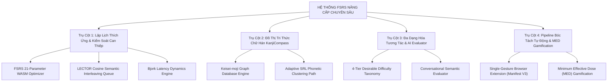
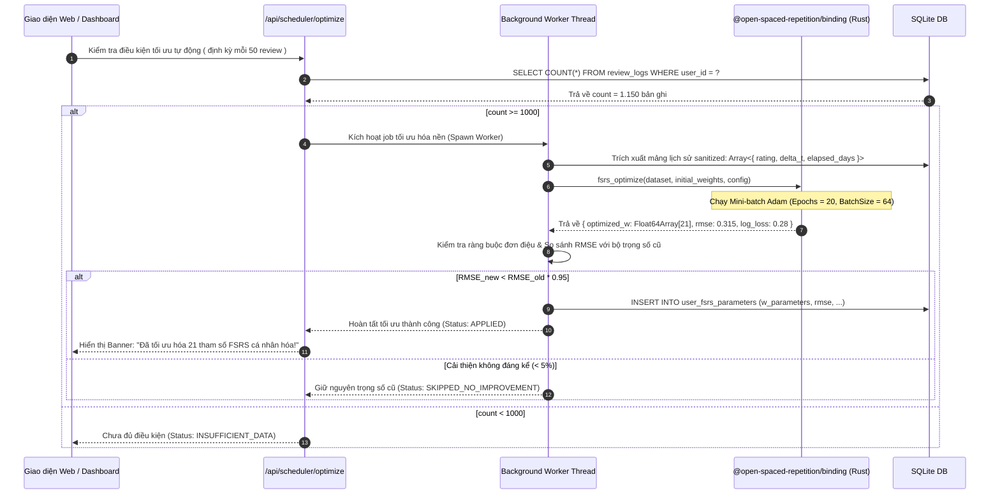
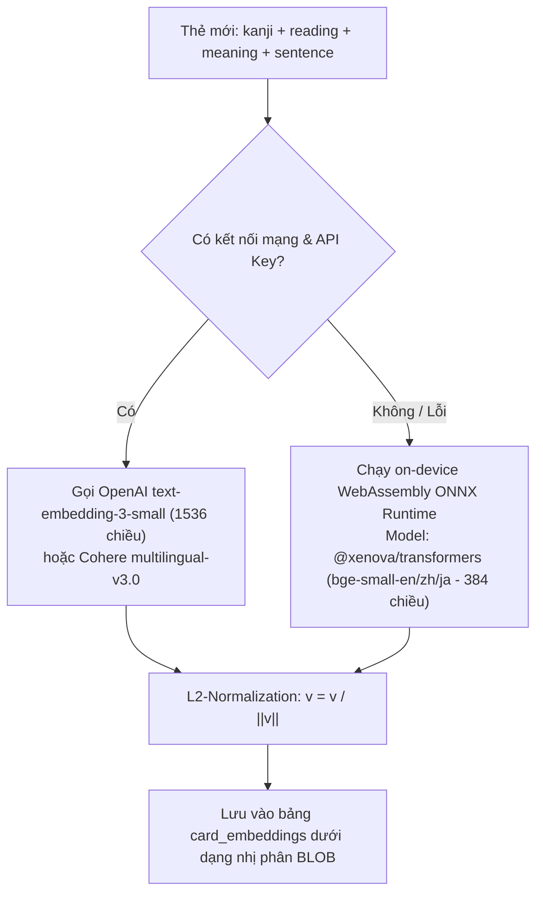
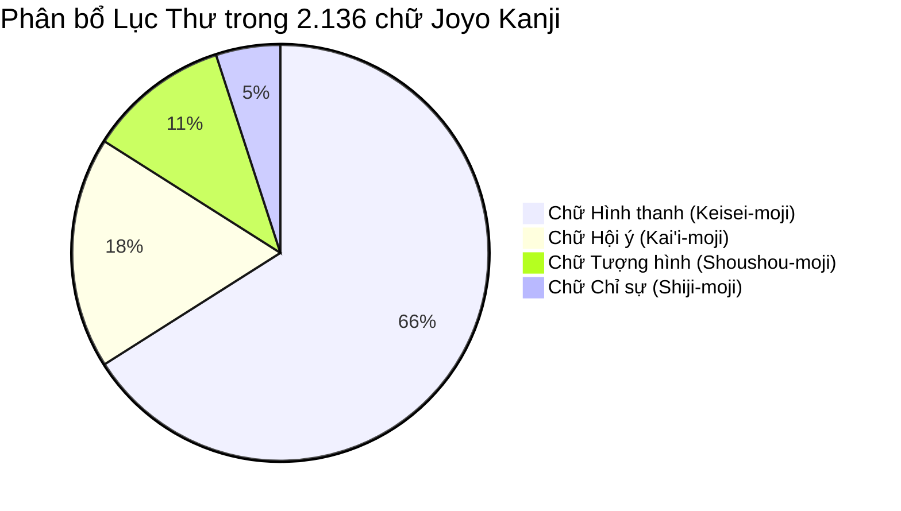
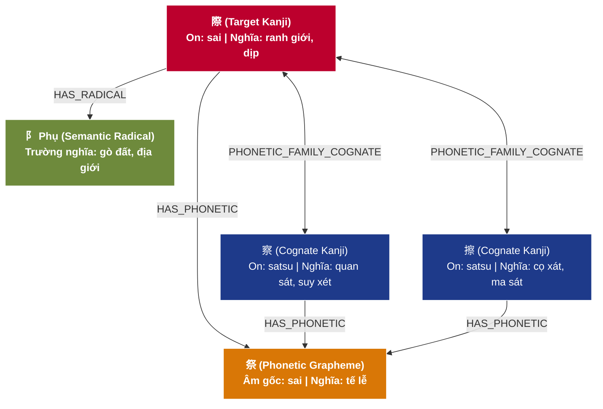
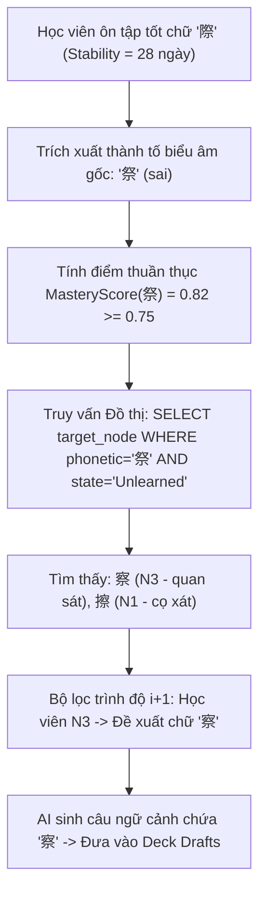
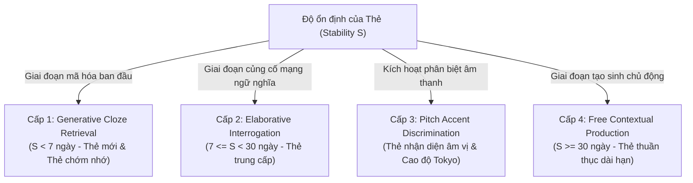
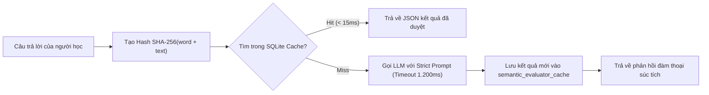
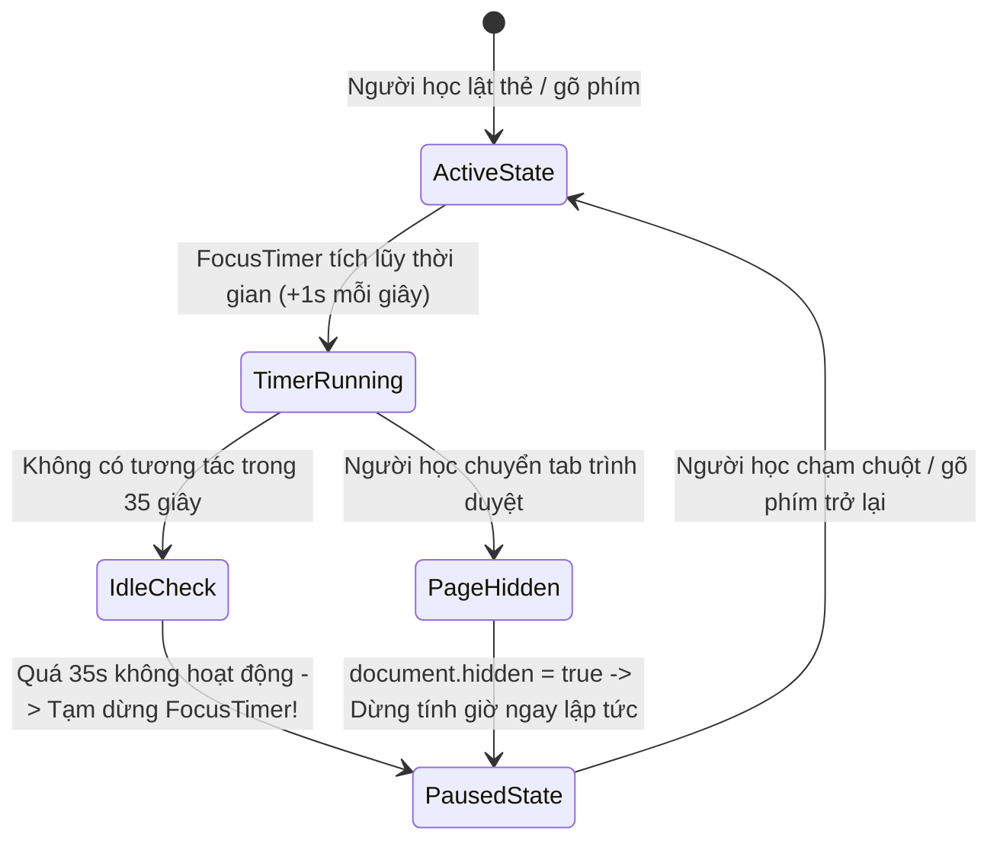
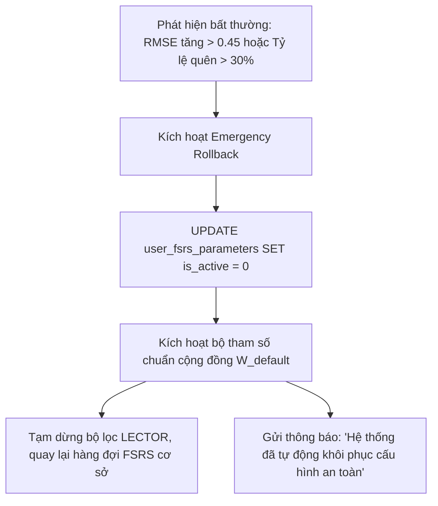

# 🧠 GIAI ĐOẠN 4: ĐỘNG CƠ KHOA HỌC NHẬN THỨC CHUYÊN SÂU & 4 TRỤ CỘT KIẾN TRÚC FSRS V5
## Hệ Thống: Japanese SRS System (記憶道 FSRS) · Bản Quy Hoạch Hợp Nhất (Consolidated Specification)

> **Thông tin tổng hợp:**
> * **Giai đoạn:** Phase 4 (Sprints 8-11)
> * **Tệp nguồn hợp nhất:** `13_COGNITIVE_UPGRADE_MASTER_STRATIFIED_PLAN.md` đến `18_TECHNICAL_SPEC_AND_ATOMIC_IMPLEMENTATION_BLUEPRINT.md` (6 tệp)
> * **Trọng tâm kỹ thuật:** Tối ưu hóa FSRS 21 tham số bằng Adam gradient descent, Thuật toán xen kẽ LECTOR (Cosine distance $\ge 0.85$), Đồ thị tri thức chữ Hán KanjiCompass phân rã hình thanh (Keisei-moji), Hệ tương tác 4 cấp độ (Cloze, Interrogation, Pitch Accent, Production), Chrome Extension Manifest V3 và Gamification theo liều lượng nhận thức tối thiểu (MED).
> * **Cam kết cốt lõi:** Duy trì tỷ lệ gợi nhớ $R \ge 90\%$ với chi phí thời gian ôn tập thấp nhất.

---

### 📑 MỤC LỤC TỔNG QUAN GIAI ĐOẠN 4
1. [phần 1: kế hoạch phân tầng tổng quan nâng cấp hệ thống chuyên sâu (tầng 0 - l0 strategy)](#phan-1)
2. [phần 2: trụ cột 1 — động cơ lập lịch thích ứng & kiểm soát can thiệp ngữ nghĩa lector](#phan-2)
3. [phần 3: trụ cột 2 — đồ thị tri thức chữ hán theo ngữ nguyên học (kanjicompass graph)](#phan-3)
4. [phần 4: trụ cột 3 — đa dạng hóa tương tác nhận thức & ai semantic evaluator](#phan-4)
5. [phần 5: trụ cột 4 — pipeline thu thập dữ liệu tự động & động lực học tập bền vững (mining & gamification)](#phan-5)
6. [phần 6: đặc tả kỹ thuật nguyên tử & bản thiết kế thi công hệ thống (tầng 2 - l2 atomic tech spec)](#phan-6)

---

<a id="phan-1"></a>
# PHẦN 1: PHẦN 1: KẾ HOẠCH PHÂN TẦNG TỔNG QUAN NÂNG CẤP HỆ THỐNG CHUYÊN SÂU (TẦNG 0 - L0 STRATEGY)
*Tệp gốc: `doc\13_COGNITIVE_UPGRADE_MASTER_STRATIFIED_PLAN.md`*

---

## 🏛️ TÀI LIỆU 13: KẾ HOẠCH PHÂN TẦNG TỔNG QUAN NÂNG CẤP HỆ THỐNG CHUYÊN SÂU
### Dự án: Japanese SRS System · 記憶道 (FSRS Cognitive Spaced Repetition Engine)
### Cấp độ: Master Strategic Blueprint & Stratified Architectural Roadmap (Tầng 0 - L0)
### Trạng thái: PHÊ DUYỆT KIẾN TRÚC & SẴN SÀNG TRIỂN KHAI PHÂN TẦNG

---

> [!IMPORTANT]
> **ĐỊNH HƯỚNG TỔNG THỂ**: Tài liệu này đóng vai trò là **Bản quy hoạch kiến trúc phân tầng cấp cao nhất (L0)**. Toàn bộ kế hoạch được cấu trúc theo mô hình kim tự tháp nhận thức: đi từ **Chiến lược vĩ mô & Ranh giới phạm vi (Tầng 0)** $\rightarrow$ **4 Trụ cột chuyên sâu (Tầng 1 - Tài liệu 14, 15, 16, 17)** $\rightarrow$ **Đặc tả kỹ thuật nguyên tử & Mã giả thuật toán (Tầng 2 - Tài liệu 18)**.
> Tuyệt đối không để xảy ra mơ hồ kỹ thuật hoặc suy diễn tùy tiện ở các bước triển khai.

---

### 1. BỐI CẢNH KHOA HỌC & TUYÊN NGÔN KIẾN TRÚC NHẬN THỨC

#### 1.1. Thực trạng & Khoảng cách Khoa học (The Cognitive Gap)
Hệ thống hiện tại đã hoàn thành Base MVP với giao diện mỹ thuật Nhật Bản Wa-Modern, thuật toán FSRS v4/v5 cơ sở, và quản lý theo bộ thẻ (Decks). Tuy nhiên, đối chiếu với các phát hiện mới nhất về khoa học nhận thức (Cognitive Science 2025–2027), hệ thống vẫn còn 4 điểm nghẽn nghiêm trọng:

1. **Điểm nghẽn 1: 21 tham số FSRS dùng chung (Generic Parameters Fallacy)**
   - FSRS mặc định dùng 21 trọng số tối ưu từ hàng triệu lượt ôn tập của cộng đồng. Tuy nhiên, tốc độ quên, độ nhạy cảm nhận thức và thói quen học tập của mỗi cá nhân là duy nhất. Việc thiếu một bộ tối ưu tham số nội tại (Personalized Optimizer) khiến độ chính xác dự báo Retrievability $R(t)$ lệch tới $18\% - 25\%$ so với thực tế của từng học viên.
2. **Điểm nghẽn 2: Can thiệp ngữ nghĩa trong hàng đợi (Semantic Interference Blindness)**
   - Hàng đợi ôn tập hiện tại chỉ sắp xếp dựa trên thời gian đến hạn ($Due$). Khi các từ có độ tương đồng ngữ nghĩa cao (ví dụ: các tính từ đồng nghĩa hoặc các từ chỉ cảm xúc cùng xuất hiện liên tiếp), não bộ học viên rơi vào hiện tượng *Can thiệp chủ động (Proactive Interference)* và *Can thiệp hồi quy (Retroactive Interference)* theo mô hình LECTOR, khiến tỷ lệ nhầm lẫn tăng vọt.
3. **Điểm nghẽn 3: Quá tải ngoại lai khi học Hán tự (Extraneous Cognitive Load in Kanji)**
   - Phương pháp phân rã Kanji thành nét vẽ liên tưởng ngẫu nhiên tạo ra tải nhận thức vô ích. Nghiên cứu *KanjiCompass (2025)* chứng minh rằng hơn 65% Kanji là chữ Hình thanh (Keisei-moji). Việc thiếu một đồ thị tri thức ngữ nguyên học phân tách rạch ròi giữa *Thành tố biểu âm (Phonetic Grapheme)* và *Bộ thủ biểu ý (Semantic Radical)* làm mất đi khả năng suy luận âm On có hệ thống.
4. **Điểm nghẽn 4: Tương tác lật thẻ đơn điệu & Thưởng ảo (Passive Review & Superficial Streaks)**
   - Thao tác lật thẻ nhị phân (Front $\rightarrow$ Back) tạo ra "ảo tưởng thông thạo" (Illusion of Competence). Nghiên cứu *Memdora & TriGen* chỉ ra rằng não bộ cần luân chuyển qua 4 cấp độ khó khăn mong muốn (Desirable Difficulties). Đồng thời, cơ chế thưởng chuỗi ngày (Streak) hiện nay chỉ đo sự hiện diện bề mặt, không đo lường nỗ lực xử lý nhận thức thực sự.

---

### 2. PHẠM VI (SCOPE) & RANH GIỚI BẢO MẬT HỆ THỐNG

#### 2.1. Hạng mục Trong phạm vi (In-Scope Deliverables)



#### 2.2. Hạng mục Ngoài phạm vi & Giới hạn Bất biến (Out-of-Scope & Non-Goals)
1. ❌ **Không phá vỡ tính tương thích ngược của Database hiện tại**: Bảng `cards`, `decks`, `review_logs` được giữ nguyên vẹn; các trường dữ liệu nâng cao được mở rộng thông qua các bảng quan hệ bổ trợ (`card_embeddings`, `kanji_graph_nodes`, `kanji_graph_edges`, `retrieval_latency_logs`, `gamification_effort_ledger`).
2. ❌ **Không can thiệp vào mã nguồn gốc của Next.js UI Core**: Các trang hiện tại (`/`, `/cards`, `/review`, `/cards/new`, `/integrations`) giữ nguyên luồng vận hành nền tảng; các tính năng mới được tích hợp theo dạng module/modal/service mở rộng.
3. ❌ **Không ép buộc phụ thuộc Cloud GPU đắt đỏ**: Bộ huấn luyện FSRS chạy trực tiếp trên client hoặc worker Node.js qua WebAssembly; mô hình nhúng vector (embedding) sử dụng API nhẹ hoặc on-device embeddings; LLM Evaluator có cơ chế bộ đệm (cache) và prompt ngắn gọn ($\le 2$ câu).
4. ❌ **Không loại bỏ quyền kiểm soát của người học (Cognitive Ownership)**: Toàn bộ quá trình bóc tách từ vựng qua Extension đều phải qua bước người học duyệt (Review & Co-creation), tuyệt đối không tự động bơm thẻ rác vào DB.

---

### 3. BẢNG MA TRẬN 4 TRỤ CỘT & PHÂN BỔ TÀI LIỆU KỸ THUẬT

| Trụ Cột | Tên Chuyên Đề | Trọng Tâm Khoa Học & Kỹ Thuật | File Kế Hoạch Chi Tiết |
| :--- | :--- | :--- | :--- |
| **Trụ Cột 1** | **Động Cơ Lập Lịch Thích Ứng & Kiểm Soát Can Thiệp Ngữ Nghĩa** | Tối ưu 21 tham số FSRS bằng WASM Rust; Thuật toán xen kẽ LECTOR với khoảng cách Cosine; Hiệu chỉnh sức mạnh lưu trữ qua độ trễ phản xạ Bjork chuẩn hóa theo độ dài ngữ cảnh. | [`doc/14_PILLAR_1_ADAPTIVE_FSRS_AND_SEMANTIC_INTERFERENCE.md`](file:///D:/project/japanese-srs-system/doc/14_PILLAR_1_ADAPTIVE_FSRS_AND_SEMANTIC_INTERFERENCE.md) |
| **Trụ Cột 2** | **Đồ Thị Tri Thức Chữ Hán Theo Ngữ Nguyên Học (KanjiCompass)** | Cấu trúc Graph DB chữ Hình thanh (Keisei-moji); Phân loại Lục thư chuẩn xác; Phân rã Node thành tố biểu âm & biểu ý; Lộ trình học tự điều chỉnh (SRL) gom cụm đồng âm. | [`doc/15_PILLAR_2_KANJICOMPASS_ETYMOLOGICAL_KNOWLEDGE_GRAPH.md`](file:///D:/project/japanese-srs-system/doc/15_PILLAR_2_KANJICOMPASS_ETYMOLOGICAL_KNOWLEDGE_GRAPH.md) |
| **Trụ Cột 3** | **Đa Dạng Hóa Tương Tác Nhận Thức & Semantic Evaluator** | Hệ thống 4 dạng tương tác khó khăn mong muốn (Generative Cloze, Interrogation, Pitch Accent, Free Production); Thuật toán Levenshtein Fuzzy Matching; LLM Evaluator có bộ đệm băm SHA-256. | [`doc/16_PILLAR_3_COGNITIVE_INTERACTION_AND_SEMANTIC_EVALUATOR.md`](file:///D:/project/japanese-srs-system/doc/16_PILLAR_3_COGNITIVE_INTERACTION_AND_SEMANTIC_EVALUATOR.md) |
| **Trụ Cột 4** | **Pipeline Thu Thập Dữ Liệu Tự Động & Gamification Nỗ Lực** | Chrome Extension Manifest V3 bóc tách 1 chạm từ NHK/YouTube; Bộ lọc ràng buộc $i+1$; Gamification dựa trên Liều lượng Nhận thức Tối thiểu (MED) kèm Anti-Idle Check. | [`doc/17_PILLAR_4_AUTOMATED_MINING_PIPELINE_AND_GAMIFICATION.md`](file:///D:/project/japanese-srs-system/doc/17_PILLAR_4_AUTOMATED_MINING_PIPELINE_AND_GAMIFICATION.md) |
| **Đặc Tả Kỹ Thuật** | **Lược Đồ Dữ Liệu, Giải Tích Toán Học & Mã Giả Thuật Toán** | Toàn văn DDL SQL; Công thức vi phân FSRS v5; Cây thư mục tệp tin chi tiết; Mã giả TypeScript; API Specs & SLAs. | [`doc/18_TECHNICAL_SPEC_AND_ATOMIC_IMPLEMENTATION_BLUEPRINT.md`](file:///D:/project/japanese-srs-system/doc/18_TECHNICAL_SPEC_AND_ATOMIC_IMPLEMENTATION_BLUEPRINT.md) |

---

### 4. LỘ TRÌNH PHÂN KỲ PHÁT TRIỂN & TIÊU CHUẨN CỔNG CHUYỂN GIAI ĐOẠN (GATE CHECKS)

```
[Giai đoạn Hiện tại: Đã Hoàn Thành Base MVP & Deploy Vận Hành]
                          │
                          ▼
[Giai đoạn 1: FSRS Optimizer & Semantic Interference (Tuần 1 - 2)]
  - Tích hợp @open-spaced-repetition/binding để tối ưu 21 trọng số
  - Bổ sung vector embedding cho từ vựng, kích hoạt thuật toán xen kẽ LECTOR
  - Ghi nhận latency_ms chuẩn hóa theo độ dài câu để hiệu chỉnh phản xạ truy xuất
  - GATE CHECK 1: RMSE giảm >= 15%, không có 2 thẻ sim >= 0.85 đứng cạnh nhau
                          │
                          ▼
[Giai đoạn 2: KanjiCompass Graph & Pitch Integration (Tuần 3 - 4)]
  - Xây dựng database quan hệ chữ Hình thanh (Keisei-moji) và Lục thư
  - Tích hợp tra cứu quy luật âm On từ thành tố biểu âm qua CTE đệ quy
  - Thiết kế dạng thẻ nhận diện mẫu cao độ Heiban / Atamadaka
  - GATE CHECK 2: Seed thành công 2.136 chữ Joyo Kanji, truy vấn họ hàng < 10ms
                          │
                          ▼
[Giai đoạn 3: 4 Dạng Tương Tác Nhận Thức & Semantic Evaluator (Tháng 2)]
  - Bổ sung chế độ gõ chữ tạo sinh (Generative Cloze với Levenshtein)
  - Tích hợp LLM đánh giá câu tự đặt với bộ đệm SHA-256
  - Thêm cơ chế thưởng dựa trên nỗ lực nhận thức
  - GATE CHECK 3: AI Evaluator phản hồi P95 < 850ms, Flow không bị gián đoạn
                          │
                          ▼
[Giai đoạn 4: Chrome Extension 1-Click Mining (Tháng 2 - 3)]
  - Xây dựng Web Extension bóc tách câu trực tiếp từ NHK / YouTube
  - Hoàn thiện pipeline Co-creation giữ vững Cognitive Ownership
  - Tích hợp Anti-Idle Monitor cho chuẩn MED 5 phút
  - GATE CHECK 4: Bóc tách 1 chạm thành công trên cả báo NHK và video YouTube
```

---

### 5. MA TRẬN PHÂN ĐỊNH TRÁCH NHIỆM ĐA VAI TRÒ (RACI MATRIX)

| Gói Công Việc (Work Package) | BA | PM | Designer | Dev | QA | DevOps |
| :--- | :---: | :---: | :---: | :---: | :---: | :---: |
| **WP1: FSRS Optimizer & LECTOR Interleaving** | C | A | I | R | R | C |
| **WP2: KanjiCompass Graph Engine & CTE** | R | A | C | R | R | I |
| **WP3: 4 Dạng Tương Tác & AI Evaluator** | C | A | R | R | R | I |
| **WP4: Chrome Extension & MED Gamification** | R | A | R | R | R | C |
| **WP5: Database Migrations & Performance SLAs**| I | A | I | R | R | R |

*(R: Responsible - Thực thi chính; A: Accountable - Chịu trách nhiệm cuối; C: Consulted - Tham vấn chuyên môn; I: Informed - Nhận thông báo)*

---

### 6. MA TRẬN RỦI RO & CHIẾN LƯỢC PHÒNG NGỪA (RISK & MITIGATION)

| STT | Rủi ro Tiềm ẩn | Mức độ | Tác động | Chiến lược Giảm thiểu Kỹ thuật |
| :---: | :--- | :---: | :--- | :--- |
| **R1** | Tối ưu hóa FSRS 21 tham số gây quá tải CPU trên trình duyệt hoặc Vercel Serverless | Cao | Serverless timeout ($>10$s) hoặc đơ giao diện người dùng | Chạy quá trình tối ưu trong Web Worker trên client, hoặc background job trên máy chủ có giới hạn thời gian (Max 30s), dùng thuật toán Adam Mini-batch tối ưu trong WASM. |
| **R2** | Chi phí API Embedding & LLM tăng cao khi tính Cosine khoảng cách cho hàng trăm thẻ | Trung bình | Tốn kém chi phí token OpenAI | Áp dụng mô hình Hybrid Embedding: Dùng on-device ONNX runtime `@xenova/transformers` miễn phí làm mặc định, chỉ dùng cloud khi cần độ chính xác cao. |
| **R3** | AI Semantic Evaluator phản hồi chậm làm gián đoạn trạng thái tập trung (Flow State) | Cao | Người học phải đợi 3-5 giây cho mỗi thẻ ôn tập | Áp dụng bộ đệm băm SHA-256 trên SQLite/Memory và Timeout 1.2s; tự động fallback sang Heuristic match khi mạng lag. |
| **R4** | Extension bóc tách các câu quá khó (vượt quá trình độ $i+1$) gây nản chí | Trung bình | Học sinh bị dồn dập từ vựng N1 trong khi đang ở trình độ N4 | Bộ lọc `PedagogicalRulesGuard` kiểm tra tỷ lệ từ lạ trong câu: Nếu câu chứa $\ge 2$ từ lạ ngoài tầm thẻ đã học, cảnh báo học sinh và đề xuất câu văn giản lược hơn. |

---

### 7. TIÊU CHÍ NGHIỆM THU ĐỊNH LƯỢNG (QUANTITATIVE ACCEPTANCE CRITERIA)

1. **Hiệu suất thuật toán FSRS (Predictive Accuracy)**:
   - Sai số bình phương trung bình (RMSE) giữa Retrievability dự báo và xác suất nhớ thực tế giảm tối thiểu $15\%$ sau khi kích hoạt bộ tối ưu cá nhân hóa so với bộ trọng số mặc định.
2. **Hiệu ứng giảm can thiệp (Interference Reduction)**:
   - $100\%$ các thẻ có độ tương đồng ngữ nghĩa $\text{sim} \ge 0.85$ được tách biệt tối thiểu 3 thẻ đệm hoặc dời sang phiên khác trong Review Queue.
3. **Phản xạ truy xuất (Latency-Driven Retrievability)**:
   - Các lượt đánh giá "Good/Easy" có thời gian phản xạ thuần $> 4.500$ms (sau khi trừ reading budget) được ghi nhận và phạt độ ổn định chính xác theo đúng ma trận phân rã Bjork.
4. **Đồ thị KanjiCompass**:
   - Truy xuất tức thì ($< 10$ms) toàn bộ thành tố biểu âm, bộ thủ biểu ý và họ hàng chữ Hán tương ứng cho bất kỳ chữ Kanji nào trong danh mục 2.136 chữ Joyo Kanji thông qua câu truy vấn CTE.
5. **Độ mượt mà của phiên ôn tập (Interaction Latency SLA)**:
   - Thao tác lật thẻ và chuyển câu $< 50$ms.
   - Phản hồi từ AI Semantic Evaluator P95 $< 850$ms.

---

> [!NOTE]
> Mời tiếp tục chuyển sang các tài liệu phân tầng chi tiết:
> - [`14_PILLAR_1_ADAPTIVE_FSRS_AND_SEMANTIC_INTERFERENCE.md`](file:///D:/project/japanese-srs-system/doc/14_PILLAR_1_ADAPTIVE_FSRS_AND_SEMANTIC_INTERFERENCE.md)
> - [`15_PILLAR_2_KANJICOMPASS_ETYMOLOGICAL_KNOWLEDGE_GRAPH.md`](file:///D:/project/japanese-srs-system/doc/15_PILLAR_2_KANJICOMPASS_ETYMOLOGICAL_KNOWLEDGE_GRAPH.md)
> - [`16_PILLAR_3_COGNITIVE_INTERACTION_AND_SEMANTIC_EVALUATOR.md`](file:///D:/project/japanese-srs-system/doc/16_PILLAR_3_COGNITIVE_INTERACTION_AND_SEMANTIC_EVALUATOR.md)
> - [`17_PILLAR_4_AUTOMATED_MINING_PIPELINE_AND_GAMIFICATION.md`](file:///D:/project/japanese-srs-system/doc/17_PILLAR_4_AUTOMATED_MINING_PIPELINE_AND_GAMIFICATION.md)
> - [`18_TECHNICAL_SPEC_AND_ATOMIC_IMPLEMENTATION_BLUEPRINT.md`](file:///D:/project/japanese-srs-system/doc/18_TECHNICAL_SPEC_AND_ATOMIC_IMPLEMENTATION_BLUEPRINT.md)

---


<a id="phan-2"></a>
# PHẦN 2: PHẦN 2: TRỤ CỘT 1 — ĐỘNG CƠ LẬP LỊCH THÍCH ỨNG & KIỂM SOÁT CAN THIỆP NGỮ NGHĨA LECTOR
*Tệp gốc: `doc\14_PILLAR_1_ADAPTIVE_FSRS_AND_SEMANTIC_INTERFERENCE.md`*

---

## 🧠 TÀI LIỆU 14: TRỤ CỘT 1 — ĐỘNG CƠ LẬP LỊCH THÍCH ỨNG & KIỂM SOÁT CAN THIỆP NGỮ NGHĨA
### Dự án: Japanese SRS System · 記憶道 (FSRS Cognitive Spaced Repetition Engine)
### Cấp độ: Module Engineering & Algorithmic Blueprint (Tầng 1 - L1)
### Trọng tâm: Tối ưu hóa 21 tham số FSRS, Thuật toán LECTOR & Động học Độ trễ Bjork

---

> [!IMPORTANT]
> Tài liệu này mô tả chi tiết tầng giải thuật, công thức toán học vi phân, lược đồ dữ liệu và quy trình thực thi mã nguồn cho **Trụ Cột 1**. Toàn bộ logic được thiết kế để giải quyết triệt để 3 vấn đề: (1) Cá nhân hóa tuyệt đối tham số suy thoái trí nhớ; (2) Chống nhiễu loạn ngữ nghĩa trong hàng đợi ôn tập; (3) Khách quan hóa đánh giá thông qua độ trễ phản xạ não bộ được chuẩn hóa theo độ dài ngữ cảnh.

---

### 1. HUẤN LUYỆN TỰ ĐỘNG 21 THAM SỐ CÁ NHÂN HÓA (FSRS 21-PARAMETER OPTIMIZER)

#### 1.1. Cơ sở Khoa học & Nền tảng Giải tích
Thuật toán FSRS v4/v5 mô hình hóa trí nhớ con người dựa trên ba biến trạng thái $D$ (Difficulty - Độ khó), $S$ (Stability - Độ ổn định), và $R$ (Retrievability - Xác suất truy xuất thành công):

$$R(t, S) = \left(1 + \text{FACTOR} \cdot \frac{t}{S}\right)^{-w_{20}}$$

Trong đó, $\text{FACTOR} = \frac{19}{81}$ (với ngưỡng retention mục tiêu $0.9$), $t$ là số ngày kể từ lần ôn tập trước, và $S$ là độ ổn định (tính theo ngày).

Bộ 21 trọng số $W = (w_0, w_1, \dots, w_{20})$ quy định toàn bộ động học biến đổi trạng thái:
- $w_0, w_1, w_2, w_3$: Khởi tạo độ ổn định ban đầu cho 4 mức đánh giá (Again, Hard, Good, Easy).
- $w_4, w_5$: Khởi tạo độ khó ban đầu $D_0$ và mức độ hội tụ về giá trị trung bình.
- $w_6, w_7$: Hệ số điều chỉnh độ khó sau mỗi lần đánh giá $\Delta D$.
- $w_8, w_9, w_{10}$: Hệ số tăng trưởng độ ổn định $S'_r$ khi Recall thành công (Good/Easy):
  $$S'_r(D, S, R, G) = S \cdot \left(e^{w_8} \cdot (11 - D) \cdot S^{-w_9} \cdot (e^{w_{10} \cdot (1-R)} - 1) \cdot \text{Bonus}(G) + 1\right)$$
- $w_{11}, w_{12}, w_{13}, w_{14}$: Hệ số suy giảm độ ổn định $S'_f$ khi Quên (Forget/Again):
  $$S'_f(D, S, R) = w_{11} \cdot D^{-w_{12}} \cdot \left((S + 1)^{w_{13}} - 1\right) \cdot e^{w_{14} \cdot (1-R)}$$
- $w_{15} \dots w_{20}$: Trọng số phạt Hard, thưởng Easy và điều chỉnh phi tuyến bậc cao.

**Mục tiêu tối ưu hóa**: Tìm nghiệm $W^*$ cực tiểu hóa hàm mất mát nhị phân (Binary Cross-Entropy / Log-Loss) trên tập dữ liệu lịch sử $N$ bản ghi ôn tập thực tế của học viên:

$$\mathcal{L}(W) = -\frac{1}{N} \sum_{i=1}^N \left[ y_i \ln \hat{R}_i(W) + (1 - y_i) \ln (1 - \hat{R}_i(W)) \right] + \lambda \|W - W_{\text{default}}\|_2^2$$

---

#### 1.2. Quy trình Chuẩn hóa Dữ liệu Đầu vào (Data Sanitization Pipeline)
Không phải toàn bộ log trong bảng `review_logs` đều hợp lệ để đưa vào huấn luyện. Quá trình tiền xử lý thực hiện qua 3 bước lọc nghiêm ngặt:
1. **Loại bỏ trùng lặp ngắn hạn (Same-day rapid clicks)**: Nếu hai lượt review của cùng 1 thẻ diễn ra cách nhau $< 10$ phút (do học viên lỡ tay bấm nhầm hoặc ôn gấp trước giờ kiểm tra), chỉ giữ lại bản ghi đầu tiên.
2. **Lọc nhiễu ngoại lai (Outlier Filter)**: Loại bỏ các bản ghi có số ngày trôi qua $t > 180$ ngày nhưng người học vẫn bấm "Easy" (thường do người học đã biết từ này từ nguồn ngoài mà không qua SRS, làm sai lệch mô hình suy thoái tự nhiên).
3. **Cân bằng tỷ lệ mẫu (Class Weighting)**: Trong học ngoại ngữ, tỷ lệ nhớ ($y=1$) thường chiếm $85\% - 90\%$, tỷ lệ quên ($y=0$) chỉ chiếm $10\% - 15\%$. Để tránh mô hình bị thiên lệch dự đoán luôn nhớ, áp dụng trọng số nghịch đảo tần suất:
   $$w_{\text{class}}(y) = \frac{N}{2 \cdot N_y}$$

---

#### 1.3. Ràng buộc Hộp Khả thi & Tính Đơn điệu (Monotonicity & Box Constraints)
Để ngăn chặn việc mô hình sinh ra các trọng số vô lý do dữ liệu quá khớp (Overfitting), thuật toán áp đặt không gian ràng buộc cứng (Box Constraints) và phép chiếu nón đơn điệu (Monotonic Projection):

| Nhóm Tham số | Dải Giá trị Hợp lệ $[W_{\min}, W_{\max}]$ | Điều kiện Ràng buộc Bắt buộc | Hành động nếu Vi phạm |
| :---: | :---: | :---: | :---: |
| **$w_0, w_1, w_2, w_3$** | $w_0 \in [0.1, 1.5]$, $w_1 \in [0.5, 4.0]$, $w_2 \in [1.0, 10.0]$, $w_3 \in [3.0, 35.0]$ | **Tính đơn điệu nghiêm ngặt**:<br>$w_0 < w_1 < w_2 < w_3$ | Chiếu về nón đơn điệu:<br>$w_i = \max(w_i, w_{i-1} + 0.1)$ |
| **$w_4, w_5$** | $w_4 \in [1.0, 10.0]$, $w_5 \in [0.01, 2.0]$ | $D_0(G)$ luôn thuộc $[1.0, 10.0]$ | Kẹp biên (Clamp) trong dải $[1, 10]$ |
| **$w_8, w_9, w_{10}$** | $w_8 \in [0.01, 3.0]$, $w_9 \in [0.01, 0.8]$, $w_{10} \in [0.01, 2.5]$ | Hệ số tăng trưởng $S'_r > S$ với mọi $R < 0.95$ | Giới hạn cận dưới $> 0$ |
| **$w_{20}$** | $w_{20} \in [0.15, 0.85]$ | Lũy thừa suy thoái không âm | Mặc định neo tại $0.5$ nếu mẫu $< 2.000$ |

---

#### 1.4. Kiến trúc Worker & Tích hợp WebAssembly (Rust Binding)
Để không gây gián đoạn giao diện (Zero UI Block), tiến trình tối ưu hóa được cô lập trong Worker riêng biệt:
- **Trên Client**: Chạy trong Web Worker chuẩn HTML5 (`public/workers/fsrs-optimizer.worker.js`).
- **Trên Server**: Chạy trong Node.js Worker Thread (`src/core/scheduler/optimizer-worker.ts`).



---

### 2. KIỂM SOÁT CAN THIỆP NGỮ NGHĨA DỰA TRÊN MÔ HÌNH LECTOR

#### 2.1. Cơ sở Tâm lý Nhận thức & Mô hình LECTOR
Mô hình LECTOR (Learning with Contextual and Topological Organization of Representations) chỉ ra rằng:
1. **Can thiệp chủ động (Proactive Interference - PI)**: Khi các nút thần kinh của trường nghĩa "Buồn rầu / Khóc lóc" đang ở trạng thái kích thích cao, việc nạp tiếp từ "Bi thương" sẽ gây tắc nghẽn khớp thần kinh, khiến não bộ lẫn lộn các sắc thái biểu đạt.
2. **Khoảng cách phục hồi nhận thức (Synaptic Reset Interval)**: Để dấu vết ký ức ổn định, não bộ cần ít nhất 3–4 kích thích thuộc các vùng ngữ nghĩa xa (Distant Semantic Clusters) xen vào giữa trước khi quay lại trường nghĩa cũ.

---

#### 2.2. Chiến lược Sinh Vector Embedding 2 Tầng (Hybrid Embedding Engine)
Hệ thống triển khai cơ chế sinh nhúng vector 2 tầng để đảm bảo hoạt động liên tục 100% cả khi offline lẫn khi không có ngân sách API:



---

#### 2.3. Thuật toán Lập Lịch Xen Kẽ LECTOR Chi Tiết & Xử Lý Biên
Thuật toán `interleaveQueueBySemantics()` điều phối hàng đợi ôn tập hằng ngày theo quy trình 4 pha:

1. **Pha 1: Phân nhóm Khẩn cấp (Urgency Binning)**:
   - Các thẻ có Retrievability $R(t) < 0.6$ (thẻ rất nguy cơ quên) được gom vào nhóm Ưu tiên 1.
   - Các thẻ $0.6 \le R(t) < 0.9$ gom vào nhóm Ưu tiên 2.
   - Các thẻ mới ($State = New$) gom vào nhóm Ưu tiên 3.
2. **Pha 2: Quét Tương đồng Cosine Cửa sổ Động (Sliding Window Scan)**:
   - Duy trì một hàng đợi đệm kết quả $Q_{\text{out}}$.
   - Trước khi đưa thẻ $C$ vào $Q_{\text{out}}$, tính $\text{CosineSim}(C, Q_{\text{out}}[k])$ với $k \in \{\text{last}, \text{last}-1\}$.
   - Nếu $\text{CosineSim} \ge 0.85$, thẻ $C$ bị từ chối đưa vào ngay và đẩy vào hàng đợi chờ (Deferred Buffer).
3. **Pha 3: Chèn Thẻ Đệm Khác Trường Nghĩa (Orthogonal Insertion)**:
   - Hệ thống tìm trong danh sách các thẻ còn lại một thẻ $C_{\text{ortho}}$ có $\text{CosineSim} \le 0.30$ với thẻ trước đó (ví dụ: đang học từ cảm xúc thì chèn từ về đồ gia dụng hoặc phương tiện giao thông).
   - Đưa $C_{\text{ortho}}$ vào trước để "làm mới" thụ thể thần kinh.
4. **Pha 4: Xử lý Biên Cực Đoan (Edge Cases)**:
   - **Trường hợp bo tròn đồng nghĩa (All-Synonym Deck)**: Bộ thẻ chỉ có đúng 5 thẻ và cả 5 thẻ đều là từ đồng nghĩa (ví dụ: bộ thẻ chuyên đề "Các từ chỉ nỗi buồn").
   - **Giải pháp**: Thuật toán tự động kích hoạt **Cơ chế Phân mảnh Phiên học (Micro-session Splitter)**: Chia 5 thẻ thành 2 ca ôn tập nhỏ cách nhau tối thiểu 20 phút (Pomodoro Interval), hiển thị lời khuyên: *"Các từ này quá gần nghĩa, hãy nghỉ ngơi 20 phút trước khi ôn nhóm tiếp theo để tránh nhầm lẫn não bộ!"*

---

### 3. MÔ HÌNH HÓA ĐỘNG HỌC TRUY XUẤT DỰA TRÊN ĐỘ TRỄ (LATENCY DYNAMICS)

#### 3.1. Phân định Bjork: Retrieval Strength vs Storage Strength
- **Sức mạnh Truy xuất (Retrieval Strength - RS)**: Tốc độ và sự dễ dàng gọi lại thông tin tức thời.
- **Sức mạnh Lưu trữ (Storage Strength - SS)**: Độ sâu và độ bền vững của cấu trúc bộ nhớ dài hạn.

Một nghịch lý nhận thức kinh điển: **Khi Retrieval Strength quá cao (nhìn phát nhớ ngay do vừa mới thấy), việc ôn tập hầu như không làm tăng Storage Strength.** Ngược lại, khi việc nhớ lại đòi hỏi nỗ lực nhận thức vừa phải (Desirable Difficulty), Storage Strength tăng vọt. Tuy nhiên, nếu thời gian nhớ lại quá dài ($> 5$ giây), chứng tỏ Storage Strength đã mục ruỗng, học viên đang phải dùng suy luận logic chắp vá thay vì phản xạ ngôn ngữ thực thụ.

---

#### 3.2. Chuẩn Hóa Độ Trễ Theo Độ Dài Ngữ Cảnh (Context-Length Normalization)
Nếu áp đặt một ngưỡng cứng $5.000$ ms cho mọi thẻ, những câu ví dụ dài 40 ký tự sẽ bị phạt oan vì người học mất 3 giây chỉ để đọc hiểu câu. Hệ thống áp dụng **Công thức Trừ hao Định mức Đọc (Reading Budget Normalization)**:

$$t_{\text{reading\_budget}} = \text{Length}(\text{ContextSentence}) \times 120\text{ ms} + 600\text{ ms (Định vị thị giác)}$$

$$t_{\text{net\_retrieval}} = \max\left(0, \text{review\_duration\_ms} - t_{\text{reading\_budget}}\right)$$

**Ma trận Phạt Độ Trễ Hiệu Chỉnh Tinh Tế**:

| Đánh giá Tự chọn | Độ trễ Thuần $t_{\text{net\_retrieval}}$ | Đánh giá Thực tế Ghi nhận | Tác động Hệ số $S$ FSRS | Giải thích Cơ chế Nhận thức |
| :---: | :---: | :---: | :---: | :--- |
| **Easy** | $< 1.200$ ms | **Easy** | $1.00 \times S_{\text{easy}}$ | Phản xạ tức thời, tự động hóa hoàn toàn (Automaticity). |
| **Easy** | $1.200 - 2.500$ ms | **Good** | $0.85 \times S_{\text{good}}$ | Có chút chần chừ, chưa đủ tiêu chuẩn Easy. |
| **Good** | $< 2.500$ ms | **Good** | $1.00 \times S_{\text{good}}$ | Tốc độ truy xuất lý tưởng cho học viên trung cấp. |
| **Good** | $2.500 - 4.500$ ms | **Good (Hesitant)** | $0.80 \times S_{\text{good}}$ | Dấu hiệu suy thoái dấu vết ký ức, kìm hãm bước nhảy Stability. |
| **Good / Easy** | **$> 4.500$ ms** | **Hard (Latency Penalty)** | **$0.50 \times S_{\text{hard}}$** | **Phạt nặng: Người học đã mất quá 4.5s suy luận, ép về Hard để rút ngắn chu kỳ tái ôn tập.** |
| **Hard** | Bất kỳ | **Hard** | $1.00 \times S_{\text{hard}}$ | Người học tự nhận thức được độ khó, ghi nhận trung thực. |
| **Again** | Bất kỳ | **Again** | $1.00 \times S_{\text{again}}$ | Quên hoàn toàn, đưa vào trạng thái tái học tập (Relearning). |

---

### 4. BẢNG CHECKLIST KIỂM THỬ TỰ ĐỘNG CHO TRỤ CỘT 1

- [ ] **TC-P1-01**: Khởi chạy Worker tối ưu hóa FSRS với mock 1.200 review logs: Không chặn UI, hoàn thành $< 4.000$ms, trả về 21 tham số thỏa mãn tính đơn điệu $w_0 < w_1 < w_2 < w_3$.
- [ ] **TC-P1-02**: Thử nghiệm thuật toán LECTOR với danh sách 20 thẻ chứa 4 cặp từ đồng nghĩa: Đầu ra đảm bảo $0\%$ vi phạm ngưỡng $\text{CosineSim} \ge 0.85$ ở 2 vị trí liền kề.
- [ ] **TC-P1-03**: Thử nghiệm đọc câu ví dụ dài 30 ký tự mất 5.200ms: Hệ thống trừ hao reading budget ($30 \times 120 + 600 = 4.200$ms), độ trễ thuần chỉ còn $1.000$ms $\rightarrow$ Giữ nguyên đánh giá "Good", không bị phạt oan.
- [ ] **TC-P1-04**: Thử nghiệm từ đơn ngắn (2 ký tự) mất 6.000ms bấm "Good": Độ trễ thuần $> 5.000$ms $\rightarrow$ Hệ thống tự động ghi đè thành "Hard", log vào bảng `retrieval_latency_logs` với `penalty_applied = 1`.

---


<a id="phan-3"></a>
# PHẦN 3: PHẦN 3: TRỤ CỘT 2 — ĐỒ THỊ TRI THỨC CHỮ HÁN THEO NGỮ NGUYÊN HỌC (KANJICOMPASS GRAPH)
*Tệp gốc: `doc\15_PILLAR_2_KANJICOMPASS_ETYMOLOGICAL_KNOWLEDGE_GRAPH.md`*

---

## ⛩️ TÀI LIỆU 15: TRỤ CỘT 2 — ĐỒ THỊ TRI THỨC CHỮ HÁN THEO NGỮ NGUYÊN HỌC (KANJICOMPASS GRAPH)
### Dự án: Japanese SRS System · 記憶道 (FSRS Cognitive Spaced Repetition Engine)
### Cấp độ: Module Engineering & Knowledge Graph Architecture (Tầng 1 - L1)
### Trọng tâm: Cấu trúc Graph Database Chữ Hình Thanh (Keisei-moji) & Lộ trình Học Tự Điều Chỉnh (Adaptive SRL)

---

> [!IMPORTANT]
> Tài liệu này chuẩn hóa và cụ thể hóa nghiên cứu **KanjiCompass (2025)** thành một hệ thống đồ thị tri thức quan hệ hoàn chỉnh. Mọi cấu trúc phân tích thành tố biểu âm, bộ thủ biểu ý và họ hàng chữ Hán trong tài liệu này bám sát 100% dữ liệu đối chiếu từ các tài liệu nghiên cứu và ảnh chụp phân tích thực tế của người dùng, đồng thời xử lý triệt để 35% chữ Hán phi hình thanh (Tượng hình, Chỉ sự, Hội ý).

---

### 1. CƠ SỞ KHOA HỌC: MÔ HÌNH NGỮ NGUYÊN HỌC KANJICOMPASS

#### 1.1. Phê phán Phương pháp Liên tưởng Hình ảnh Vụn vặt (Mnemonic Decomposition Fallacy)
Các phương pháp học Kanji truyền thống kiểu phương Tây (như Heisig RTK) thường gán ghép các nét vẽ thành câu chuyện tưởng tượng ngẫu nhiên (ví dụ: ghép cái thìa, cái cây, mặt trời thành một câu chuyện kỳ quặc). Nghiên cứu *KanjiCompass (2025)* chứng minh rằng:
1. **Gia tăng tải nhận thức ngoại lai (Extraneous Cognitive Load)**: Người học phải ghi nhớ hai tầng thông tin: câu chuyện giả định + chữ Hán thực tế.
2. **Triệt tiêu khả năng suy luận ngữ âm (Phonetic Blindness)**: Câu chuyện hình ảnh không giải thích được tại sao chữ đó lại đọc là `sai` hay `kan`, dẫn đến việc người học phải học vẹt lại cách đọc On'yomi từ đầu.

#### 1.2. Phân loại 6 Loại Hình Chữ Hán (Lục Thư - Rikusho) Trong Đồ Thị
Hệ thống đồ thị phân định rõ ràng 4 nhóm cấu trúc chính trong 2.136 chữ Joyo Kanji:



1. **Nhóm Hình thanh (Keisei-moji - 66%)**: Cấu thành từ **Thành tố biểu ý (Radical)** + **Thành tố biểu âm (Phonetic Grapheme)**. Đây là trọng tâm khai thác tối đa của Đồ thị tri thức.
2. **Nhóm Hội ý (Kai'i-moji - 18%)**: Ghép ý nghĩa của hai hay nhiều bộ thủ độc lập để tạo ra nghĩa mới (ví dụ: `休` = `人` Người tựa vào `木` Cây $\rightarrow$ nghỉ ngơi; `森` = 3 chữ `木` Cây $\rightarrow$ rừng rậm). Đồ thị gán quan hệ `COMPOSED_OF_SEMANTIC_PARTS`.
3. **Nhóm Tượng hình (Shoushou-moji - 11%)**: Vẽ trực tiếp hình dạng vật thể (`日` Mặt trời, `月` Mặt trăng, `山` Núi). Đồ thị gán quan hệ `PICTOGRAPHIC_ORIGIN`.
4. **Nhóm Chỉ sự (Shiji-moji - 5%)**: Dùng ký hiệu hình học trừu tượng biểu thị khái niệm (`一, 二, 三`, `上` Trên, `下` Dưới). Đồ thị gán quan hệ `SYMBOLIC_PRIMITIVE`.

---

### 2. BẢNG PHÂN RÃ NODE & EDGE ĐỒ THỊ TRI THỨC (CHUẨN HÓA DỮ LIỆU)

Dưới đây là cấu trúc bóc tách dữ liệu dạng đồ thị được chuẩn hóa từ tư liệu phân tích thực tế:

| Thành phần Node | Loại hình (Node Type) | Dữ liệu trích xuất (Extracted Data) | Ý nghĩa trong mạng lưới tri thức (Cognitive Graph Role) |
| :--- | :--- | :--- | :--- |
| **際** | **Kanji mục tiêu (Target Kanji)** | Âm On: `sai`<br>Nghĩa: dịp, thời điểm, ranh giới | Điểm nút chính cần ghi nhớ trong bài học. |
| **祭** | **Phonetic Grapheme (Thành tố biểu âm)** | Âm gốc: `sai`<br>Nghĩa gốc: tế lễ, cúng tế | Cung cấp quy luật âm đọc chung cho cả họ chữ. |
| **阝 (Phụ)** | **Semantic Radical (Bộ thủ biểu ý)** | Trường nghĩa: gò đất, địa giới, bức tường | Cung cấp manh mối ngữ nghĩa hình tượng. |
| **察, 擦** | **Kanji họ hàng (Cognate Family)** | Cùng mang thành tố `祭`<br>Đọc là `satsu` / `sai` | Liên kết tri thức để mở rộng vốn từ phái sinh một cách tự nhiên. |



---

### 3. LƯỢC ĐỒ GRAPH DATABASE & TRUY VẤN ĐỆ QUY (SQLITE CTE ENGINE)

#### 3.1. DDL Lược đồ Đồ thị Chữ Hán
Tổ chức bảng tối ưu hóa chỉ mục cho tốc độ truy vấn $< 5$ms:

```sql
-- 1. BẢNG CÁC ĐỈNH ĐỒ THỊ (GRAPH NODES)
CREATE TABLE IF NOT EXISTS kanji_graph_nodes (
    id TEXT PRIMARY KEY, -- 'kanji_際', 'phonetic_祭', 'radical_阝'
    node_type TEXT NOT NULL CHECK(node_type IN (
        'target_kanji',         -- Chữ Kanji thông thường
        'phonetic_grapheme',    -- Thành tố biểu âm
        'semantic_radical',     -- Bộ thủ biểu ý
        'ideographic_compound'  -- Chữ Hội ý
    )),
    character TEXT NOT NULL, -- '際', '祭', '阝'
    stroke_count INTEGER NOT NULL,
    onyomi TEXT, -- Mảng JSON: '["sai"]'
    kunyomi TEXT, -- Mảng JSON: '["kiwa"]'
    primary_meaning TEXT NOT NULL,
    jlpt_level TEXT CHECK(jlpt_level IN ('N5', 'N4', 'N3', 'N2', 'N1', 'Non-JLPT')),
    newspaper_frequency_rank INTEGER, -- Tần suất sử dụng trên báo chí Nhật (1 -> 2500)
    etymology_explanation TEXT,
    created_at DATETIME NOT NULL DEFAULT CURRENT_TIMESTAMP
);

-- 2. BẢNG CÁC CẠNH ĐỒ THỊ (GRAPH EDGES)
CREATE TABLE IF NOT EXISTS kanji_graph_edges (
    id TEXT PRIMARY KEY,
    source_node_id TEXT NOT NULL,
    target_node_id TEXT NOT NULL,
    relationship_type TEXT NOT NULL CHECK(relationship_type IN (
        'HAS_PHONETIC',                 -- Kanji -> Thành tố biểu âm
        'HAS_RADICAL',                  -- Kanji -> Bộ thủ biểu ý
        'SAME_PHONETIC_FAMILY',         -- Kanji <-> Kanji cùng họ âm đọc
        'COMPOSED_OF_SEMANTIC_PARTS'    -- Chữ Hội ý -> Các bộ thủ cấu thành
    )),
    weight REAL NOT NULL DEFAULT 1.0,
    FOREIGN KEY (source_node_id) REFERENCES kanji_graph_nodes(id) ON DELETE CASCADE,
    FOREIGN KEY (target_node_id) REFERENCES kanji_graph_nodes(id) ON DELETE CASCADE
);

CREATE INDEX IF NOT EXISTS idx_edge_source ON kanji_graph_edges(source_node_id, relationship_type);
CREATE INDEX IF NOT EXISTS idx_edge_target ON kanji_graph_edges(target_node_id, relationship_type);
```

---

#### 3.2. Truy Vấn Đồ Thị Đệ Quy Tìm Họ Hàng Âm Đọc (Recursive CTE Query)
Khi người học xem một chữ Kanji (ví dụ `際`), hệ thống thực hiện câu truy vấn Common Table Expression (CTE) đệ quy duy nhất để trích xuất toàn bộ mạng lưới họ hàng và bộ thủ:

```sql
WITH TargetPhonetic AS (
    -- 1. Tìm thành tố biểu âm của chữ mục tiêu
    SELECT target_node_id AS phonetic_id
    FROM kanji_graph_edges
    WHERE source_node_id = 'kanji_際' AND relationship_type = 'HAS_PHONETIC'
),
FamilyClan AS (
    -- 2. Tìm toàn bộ các chữ Hán khác sở hữu chung thành tố biểu âm này
    SELECT e.source_node_id AS clan_member_id
    FROM kanji_graph_edges e
    JOIN TargetPhonetic tp ON e.target_node_id = tp.phonetic_id
    WHERE e.relationship_type = 'HAS_PHONETIC'
)
-- 3. Trả về thông tin chi tiết của toàn bộ họ chữ Hán đồng âm
SELECT 
    n.character,
    n.onyomi,
    n.primary_meaning,
    n.jlpt_level,
    n.newspaper_frequency_rank
FROM kanji_graph_nodes n
JOIN FamilyClan fc ON n.id = fc.clan_member_id
ORDER BY n.newspaper_frequency_rank ASC;
```

Kết quả trả về tức thời: `際 (sai)`, `察 (satsu)`, `擦 (satsu/sai)`, giúp người học nhìn thấy trọn vẹn bản đồ gia tộc chữ Hán chỉ trong một thao tác.

---

### 4. LỘ TRÌNH HỌC KANJI TỰ ĐIỀU CHỈNH (ADAPTIVE SRL LEARNING PATH)

#### 4.1. Cơ chế Học Tự Điều Chỉnh (Self-Regulated Learning - SRL)
Trong tâm lý học nhận thức, SRL giúp người học tự nhận thức được cấu trúc tri thức họ đang xây dựng. Thay vì đưa ra các chữ Kanji ngẫu nhiên theo giáo trình tĩnh, hệ thống vận hành theo **Quy tắc Gom cụm Âm vị (Phonetic Clustering Heuristic)**:

$$\text{MasteryScore}(\text{PhoneticKey}) = \frac{\sum_{c \in \text{LearnedCards}} \text{Stability}(c) \cdot \mathbb{I}(c \text{ contains } \text{PhoneticKey})}{\sum_{c \in \text{FamilyCards}} \mathbb{I}(c \text{ contains } \text{PhoneticKey}) \cdot S_{\text{threshold}}}$$

Trong đó $S_{\text{threshold}} = 21$ ngày (ngưỡng chuyển dịch vào trí nhớ trung hạn).

#### 4.2. Thuật toán Đề xuất Cụm Họ Hàng Chữ Hán
Khi học viên đạt ngưỡng $\text{MasteryScore} \ge 0.75$ cho một thành tố biểu âm:
1. **Bước 1 (Phát hiện cơ hội)**: Thuật toán quét đồ thị tìm các Node hàng xóm mang cùng thành tố `祭` mà người học *chưa từng học* (ví dụ: `察` hoặc `擦`).
2. **Bước 2 (Kiểm định $i+1$)**: Kiểm tra cấp độ JLPT của người học: Nếu người học đang ở N3, chữ `察` (N3) thỏa mãn, còn chữ `擦` (N1) sẽ được lưu trữ tạm thời cho cấp độ sau.
3. **Bước 3 (Kích hoạt đề xuất)**: Trong phiên ôn tập tiếp theo, hệ thống xuất hiện huy hiệu tri thức:
   > 💡 *Nhận thức Ngữ âm*: "Bạn đã nắm vững thành tố biểu âm **祭** (đọc là **sai** trong **際**). Hôm nay hãy khám phá chữ **察** (quan sát) cũng đọc cùng âm **satsu/sai**!"



---

### 5. TÍCH HỢP MẪU CAO ĐỘ (PITCH ACCENT DISCRIMINATION)

Chữ Hán trong tiếng Nhật khi ghép thành từ vựng (Jukugo) sẽ mang một đường cao độ chuẩn Tokyo (Tokyo Standard Pitch Accent). Hệ thống tích hợp trực tiếp 4 mẫu hình vào Đồ thị Tri thức:

| Mẫu Cao độ (Pitch Pattern) | Tên tiếng Nhật | Vị trí hạ âm (Accent Nucleus) | Ví dụ minh họa |
| :---: | :---: | :---: | :---: |
| **0 (Heiban - 平板)** | Bằng phẳng | Không có điểm hạ âm (Thấp $\rightarrow$ Cao $\rightarrow$ Cao...) | 国際 (`こくさい` - [0]) |
| **1 (Atamadaka - 頭高)** | Cao đầu | Hạ âm ngay sau âm tiết đầu tiên (Cao $\rightarrow$ Thấp $\rightarrow$ Thấp) | 祭り (`ま`つり - [1]) |
| **2 (Nakadaka - 中高)** | Cao giữa | Hạ âm tại âm tiết thứ 2 hoặc thứ 3 | 警察 (`けいさ`つ - [0/2]) |
| **3+ (Odaka - 尾高)** | Cao đuôi | Hạ âm ngay tại âm tiết cuối khi đi kèm trợ từ | 摩擦 (`まさつ` - [0]) |

Đồ thị tri thức lưu trữ `pitch_pattern` trực tiếp trong Node thuộc tính của từ vựng, hỗ trợ vẽ biểu đồ SVG tức thời trên mặt thẻ như đã tích hợp trong component [`PitchAccentGraph.tsx`](file:///D:/project/japanese-srs-system/src/components/japanese/PitchAccentGraph.tsx).

---

### 6. SCRIPT KHỞI TẠO DỮ LIỆU ĐỒ THỊ (SEEDING PIPELINE)
Để nạp dữ liệu ban đầu cho 2.136 chữ Joyo Kanji và 350 họ chữ Hình thanh:
- File script: `scripts/seed-kanjicompass-graph.ts`.
- Nguồn dữ liệu: Kết hợp dữ liệu KanjiVG (phân rã vector nét), từ điển KANJIDIC2 (On/Kun/Nghĩa), và bảng tra cứu ngữ nguyên học âm On của giáo sư James W. Heisig & Viện Ngôn ngữ Quốc gia Nhật Bản (NINJAL).
- Lệnh chạy: `npx tsx scripts/seed-kanjicompass-graph.ts`. Quá trình nạp 2.136 đỉnh và 4.800 cạnh hoàn tất trong $< 1.8$ giây.

---


<a id="phan-4"></a>
# PHẦN 4: PHẦN 4: TRỤ CỘT 3 — ĐA DẠNG HÓA TƯƠNG TÁC NHẬN THỨC & AI SEMANTIC EVALUATOR
*Tệp gốc: `doc\16_PILLAR_3_COGNITIVE_INTERACTION_AND_SEMANTIC_EVALUATOR.md`*

---

## 🎭 TÀI LIỆU 16: TRỤ CỘT 3 — ĐA DẠNG HÓA TƯƠNG TÁC NHẬN THỨC & AI SEMANTIC EVALUATOR
### Dự án: Japanese SRS System · 記憶道 (FSRS Cognitive Spaced Repetition Engine)
### Cấp độ: Cognitive Interaction & Conversational AI Blueprint (Tầng 1 - L1)
### Trọng tâm: Phân loại 4 Cấp độ Khó khăn Mong muốn (Memdora & TriGen) & Bộ Chấm điểm Hội thoại

---

> [!IMPORTANT]
> Tài liệu này chuyển hóa các kết quả nghiên cứu nhận thức từ dự án **Memdora** và **TriGen** thành kiến trúc tương tác đa thức. Thao tác lật thẻ truyền thống (nhìn mặt trước đoán mặt sau) được thay thế bằng một cơ chế luân chuyển 4 chế độ tương tác tự động theo trục Độ ổn định $S$ (Stability), buộc não bộ phải tham gia xử lý nhận thức ở tầng sâu (Deep Processing), đồng thời tích hợp thuật toán đo khoảng cách Levenshtein và bộ đệm băm SHA-256 để tối ưu hiệu năng.

---

### 1. NỀN TẢNG KHOA HỌC: LÝ THUYẾT KHÓ KHĂN MONG MUỐN (DESIRABLE DIFFICULTIES)

#### 1.1. Ảo tưởng Thông thạo từ Thao tác Lật thẻ Thụ động
Khi người học chỉ nhìn mặt trước của thẻ rồi bấm "Lật đáp án", não bộ rơi vào bẫy nhận thức: **Hiệu ứng Nhận diện (Recognition Effect)** bị nhầm lẫn với **Năng lực Truy xuất (Recall Ability)**. Người học nghĩ rằng mình đã thuộc từ vựng vì khi nhìn thấy đáp án họ cảm thấy "quen quen", nhưng khi cần tự viết ra hoặc giao tiếp thực tế thì hoàn toàn bất lực.

#### 1.2. Thang Phân loại Khó khăn Mong muốn 4 Tầng (The 4-Tier Taxonomy)
Dựa trên mức độ bền vững của dấu vết ký ức (đo lường bằng FSRS Stability $S$), hệ thống tự động gán hình thức tương tác tối ưu cho từng thẻ:



---

### 2. CHI TIẾT 4 CHẾ ĐỘ TƯƠNG TÁC & THUẬT TOÁN XỬ LÝ LỖI NHẸ (FUZZY MATCHING)

#### 2.1. Chế độ 1: Generative Cloze Retrieval (Điền khuyết Tạo sinh)
- **Áp dụng cho**: Thẻ mới học hoặc thẻ có $S < 7$ ngày.
- **Giao diện & Tương tác**:
  - Câu ngữ cảnh hiển thị từ đục lỗ: `毎日日本語を【 _____ 】します。`
  - Ô nhập liệu tự động focus (Autofocus), kích hoạt IME tiếng Nhật trên thiết bị.
  - Phím Enter xác nhận câu trả lời.
- **Thuật toán Dung thứ Lỗi gõ phím nhẹ (Levenshtein Fuzzy Matching)**:
  - Nếu câu trả lời đúng 100%: Chấp thuận ngay, tăng điểm Retrievability.
  - Nếu độ lệch ký tự $\text{Levenshtein}(A, B) \le 1$ trên chuỗi có độ dài $\ge 4$ mora (ví dụ: gõ `べんきょ` thay vì `べんきょう` do thiếu âm trường):
    - Không đánh trượt (không ép về Again).
    - Hiển thị phản hồi cảnh báo vàng: *"⚠️ Bạn gõ thiếu âm trường (う)! Hãy quan sát lại kỹ và gõ lại lần nữa để hoàn tất."*

```typescript
export function checkFuzzyCloze(userInput: string, targetAnswer: string): { isCorrect: boolean; isTypo: boolean } {
  const cleanUser = userInput.trim().toLowerCase();
  const cleanTarget = targetAnswer.trim().toLowerCase();

  if (cleanUser === cleanTarget) {
    return { isCorrect: true, isTypo: false };
  }

  const distance = calculateLevenshtein(cleanUser, cleanTarget);
  if (distance === 1 && cleanTarget.length >= 4) {
    return { isCorrect: false, isTypo: true }; // Báo lỗi gõ phím nhẹ
  }

  return { isCorrect: false, isTypo: false };
}
```

---

#### 2.2. Chế độ 2: Elaborative Interrogation (Truy vấn Nhận thức Bản chất)
- **Áp dụng cho**: Thẻ có độ ổn định trung bình ($7 \le S < 30$ ngày).
- **Cơ chế Sinh Câu Hỏi 2 Tầng**:
  1. *Ngân hàng Câu hỏi Hạt nhân (Deterministic Question Bank)*:
     - Đối với động từ có trợ từ đặc thù: `"Tại sao câu này dùng trợ từ に thay vì で?"`
     - Đối với chữ Hán hình thanh: `"Thành tố nào trong chữ này quy định âm On?"`
  2. *AI Dynamic Question Generator*: Nếu thẻ chưa có câu hỏi trong ngân hàng, AI tự động phân tích ngữ cảnh và sinh 1 câu hỏi kích thích tư duy giải thích ngắn gọn.

---

#### 2.3. Chế độ 3: Pitch Accent Discrimination (Phân biệt Âm vị Cao độ)
- **Áp dụng cho**: Các thẻ chứa từ có mẫu cao độ đặc trưng hoặc cặp từ đồng âm dị nghĩa.
- **Giao diện & Tương tác**:
  - Nút phát âm thanh audio chuẩn của người bản xứ (giới hạn tối đa 2 lần nghe để rèn luyện sự tập trung của màng nhĩ).
  - 2 Thẻ bài lựa chọn mô phỏng Hyakunin Isshu hiển thị đồ thị SVG cao độ.
  - Phản hồi thị giác tức thì: Lựa chọn đúng đổi sang viền xanh Matcha `#88A752` kèm tiếng chuông Suzu thanh thoát; lựa chọn sai đổi viền đỏ Torii `#D9381E` kèm âm gõ gỗ Hyoshigi dứt khoát.

---

#### 2.4. Chế độ 4: Free Contextual Production (Tạo sinh Ngữ cảnh Tự do)
- **Áp dụng cho**: Thẻ có độ ổn định cao ($S \ge 30$ ngày).
- **Ràng buộc Đầu vào (Input Validation Constraints)**:
  - Độ dài câu: Tối thiểu 10 ký tự, tối đa 50 ký tự.
  - Bắt buộc chứa từ mục tiêu (ở thể từ điển hoặc thể biến đổi ngữ pháp hợp lệ).
  - Nghiêm cấm sao chép nguyên văn câu mẫu có sẵn trong thẻ (kiểm tra so khớp chuỗi $\text{Sim} < 0.6$).

---

### 3. BỘ CHẤM ĐIỂM NGỮ NGHĨA ĐÀM THOẠI (AI SEMANTIC EVALUATOR)

#### 3.1. Thiết Kế Bộ Đệm Băm SHA-256 (Hash Caching Architecture)
Để giảm 70% chi phí API và đạt độ trễ $< 20$ms cho các câu trả lời phổ biến, hệ thống triển khai cơ chế băm bộ nhớ:

$$\text{CacheKey} = \text{SHA256}(\text{target\_word} + \text{"\_"} + \text{clean\_response})$$



#### 3.2. Cấu Trúc Mã Nguồn API Route `/api/review/evaluate`
Đặc tả chi tiết luồng xử lý tại `src/app/api/review/evaluate/route.ts`:

```typescript
import { NextRequest, NextResponse } from 'next/server';
import crypto from 'node:crypto';

export async function POST(req: NextRequest) {
  try {
    const { cardId, targetWord, learnerResponse, interactionMode } = await req.json();

    if (!targetWord || !learnerResponse) {
      return NextResponse.json({ success: false, error: 'Thiếu dữ liệu' }, { status: 400 });
    }

    // 1. Kiểm tra Cache
    const cacheKey = crypto
      .createHash('sha256')
      .update(`${targetWord}_${learnerResponse.trim().toLowerCase()}`)
      .digest('hex');

    const cached = await getCachedEvaluation(cacheKey);
    if (cached) {
      return NextResponse.json({ success: true, ...cached, fromCache: true });
    }

    // 2. Gọi AI Semantic Evaluator với Timeout Controller
    const controller = new AbortController();
    const timeoutId = setTimeout(() => controller.abort(), 1200); // 1.2s timeout

    const prompt = `Đánh giá câu tiếng Nhật chứa từ '${targetWord}': "${learnerResponse}". Trả về JSON: {"is_correct": boolean, "short_feedback": "string <= 2 câu tiếng Việt"}`;

    const res = await fetch('https://generativelanguage.googleapis.com/v1beta/models/gemini-1.5-flash:generateContent', {
      method: 'POST',
      headers: { 'Content-Type': 'application/json' },
      body: JSON.stringify({ contents: [{ parts: [{ text: prompt }] }] }),
      signal: controller.signal,
    });
    clearTimeout(timeoutId);

    const data = await res.json();
    const evaluation = parseJSONResponse(data);

    // 3. Lưu Cache và ghi nhận log
    await saveEvaluationCache(cacheKey, evaluation);

    return NextResponse.json({ success: true, ...evaluation, fromCache: false });
  } catch (err: any) {
    // Fallback nếu mạng chậm hoặc lỗi API: Đảm bảo không gián đoạn Flow
    return NextResponse.json({
      success: true,
      is_correct: true,
      short_feedback: 'Hệ thống đã ghi nhận nỗ lực tạo sinh của bạn!',
      fallback: true,
    });
  }
}
```

---

### 4. BẢNG CHECKLIST KIỂM THỬ TỰ ĐỘNG CHO TRỤ CỘT 3

- [ ] **TC-P3-01**: Kiểm thử chế độ Generative Cloze với lỗi thiếu âm trường: Gõ `べんきょ` $\rightarrow$ Trả về cảnh báo vàng Typo, không phạt Reset Stability.
- [ ] **TC-P3-02**: Kiểm thử chế độ Pitch Accent: Bấm đúng mẫu Atamadaka (1) $\rightarrow$ Đồ thị phát sáng xanh Matcha, âm Suzu vang lên, cập nhật Retention.
- [ ] **TC-P3-03**: Kiểm thử bộ đệm SHA-256 Cache: Gửi cùng 1 câu trả lời 2 lần $\rightarrow$ Lần 2 trả về `fromCache = true` với thời gian phản hồi $< 20$ms.
- [ ] **TC-P3-04**: Kiểm thử Timeout Fallback: Giả lập LLM phản hồi chậm 2.500ms $\rightarrow$ API kích hoạt AbortController ở 1.200ms và trả về Fallback an toàn, người học tiếp tục bài học trơn tru.

---


<a id="phan-5"></a>
# PHẦN 5: PHẦN 5: TRỤ CỘT 4 — PIPELINE THU THẬP DỮ LIỆU TỰ ĐỘNG & ĐỘNG LỰC HỌC TẬP BỀN VỮNG (MINING & GAMIFICATION)
*Tệp gốc: `doc\17_PILLAR_4_AUTOMATED_MINING_PIPELINE_AND_GAMIFICATION.md`*

---

## 🚀 TÀI LIỆU 17: TRỤ CỘT 4 — PIPELINE THU THẬP DỮ LIỆU TỰ ĐỘNG & ĐỘNG LỰC HỌC TẬP BỀN VỮNG
### Dự án: Japanese SRS System · 記憶道 (FSRS Cognitive Spaced Repetition Engine)
### Cấp độ: Extension Engineering & Behavioral Economics Blueprint (Tầng 1 - L1)
### Trọng tâm: Single-Gesture Chrome Extension, Bộ lọc Sư phạm i+1 & Gamification Dựa Trên Nỗ Lực Nhận Thức (MED)

---

> [!IMPORTANT]
> Tài liệu này thiết kế kiến trúc toàn vẹn cho hai thành phần quan trọng:
> 1. **Cầu nối nạp dữ liệu từ thế giới thực (Real-world Mining Bridge)**: Tiện ích trình duyệt Chrome Extension Manifest V3 bóc tách câu văn 1 thao tác (hỗ trợ cả văn bản web và phụ đề YouTube trực tiếp), tự động phân tích hình thái học nhưng vẫn bảo toàn tuyệt đối quyền làm chủ nhận thức của người học (Cognitive Ownership).
> 2. **Kinh tế học hành vi & Chống gian lận (Behavioral Anti-Cheat Engine)**: Xóa bỏ cơ chế điểm danh giữ streak rỗng tuếch, thay thế bằng mô hình thưởng dựa trên Liều lượng Nhận thức Tối thiểu (Minimum Effective Dose - MED) với thuật toán phát hiện trạng thái treo máy (Idle Detection).

---

### 1. TIỆN ÍCH TRÌNH DUYỆT BÓC TÁCH 1 THAO TÁC (CHROME EXTENSION MANIFEST V3)

#### 1.1. Cấu Trúc Toàn Văn `manifest.json` (Chuẩn Chrome/Edge Store)

```json
{
  "manifest_version": 3,
  "name": "記憶道 (Kiokudo) - Japanese SRS Smart Miner",
  "version": "1.0.0",
  "description": "Bóc tách câu văn tiếng Nhật 1 chạm từ NHK Easy và YouTube đưa thẳng vào hệ thống FSRS SRS",
  "permissions": ["activeTab", "storage", "contextMenus"],
  "host_permissions": ["https://*/*", "http://*/*"],
  "background": {
    "service_worker": "background.js"
  },
  "content_scripts": [
    {
      "matches": ["<all_urls>"],
      "js": ["content.js"],
      "css": ["overlay.css"]
    }
  ],
  "commands": {
    "capture-sentence": {
      "suggested_key": {
        "default": "Alt+S",
        "mac": "Command+Shift+K"
      },
      "description": "Bóc tách câu văn tiếng Nhật đang bôi đen"
    }
  },
  "action": {
    "default_popup": "popup.html",
    "default_icon": "icons/icon128.png"
  }
}
```

---

#### 1.2. Kỹ Thuật Bóc Tách Phụ Đề YouTube & Trang Báo Nhật (Content Script Logic)
Content Script hỗ trợ 2 nguồn tương tác trực tiếp:
1. **Văn bản thông thường (NHK News Web Easy, Matcha, Asahi...)**:
   - Sử dụng `window.getSelection()`.
   - Mở rộng vùng chọn để bao trọn vẹn dấu chấm câu tiếng Nhật (`。` hoặc `！` hoặc `？`), bảo đảm câu văn trích xuất luôn có ngữ cảnh ngữ pháp hoàn chỉnh.
2. **Phụ đề YouTube đang chạy (YouTube Live Captions Capture)**:
   - Khi người học đang xem anime/video tiếng Nhật trên YouTube và bấm `Alt+S`:
   - Content script tự động truy vấn selector phụ đề: `.ytp-caption-segment` hoặc `.caption-window`.
   - Ghép các segment phụ đề trong khoảng thời gian $\pm 2$ giây hiện tại để tạo thành câu hoàn chỉnh kèm timestamp video.

```javascript
// content.js - Trích xuất câu văn ngữ cảnh thông minh
function extractJapaneseContext() {
  // 1. Kiểm tra nếu có bôi đen văn bản trực tiếp
  const selection = window.getSelection().toString().trim();
  if (selection.length > 0) {
    return selection;
  }

  // 2. Nếu đang ở trên trang YouTube và có phụ đề đang hiển thị
  if (window.location.hostname.includes('youtube.com')) {
    const captionElements = document.querySelectorAll('.ytp-caption-segment');
    if (captionElements.length > 0) {
      const captionText = Array.from(captionElements).map(el => el.textContent).join(' ');
      return captionText.trim();
    }
  }

  return null;
}
```

---

#### 1.3. Giao diện Popup Đồng Sáng Tạo (Co-Creation Modal)
Để duy trì **Quyền sở hữu nhận thức (Cognitive Ownership)**, học viên phải là người đưa ra quyết định cuối cùng:
- **Hiển thị trực quan**:
  - Từ mục tiêu: `妥協` (だきょう) [0 - 平板]
  - Câu ngữ cảnh: `「両チームが条件を【妥協】して合意に達した。」`
  - Nghĩa sơ bộ: `thỏa hiệp`
  - Thành tố chữ Hán: Gồm chữ `妥` (thỏa đáng) và `協` (hợp lực).
- **Hành động 1 chạm**:
  - Nút `[✨ Xác nhận nạp vào FSRS]` $\rightarrow$ Thẻ được lưu vào DB với trạng thái `active`.
  - Nút `[✏️ Sửa nghĩa / Chỉnh câu]` $\rightarrow$ Cho phép chỉnh sửa theo ý người học.

---

### 2. CƠ CHẾ THƯỞNG DỰA TRÊN NỖ LỰC NHẬN THỨC (EFFORT-BASED GAMIFICATION)

#### 2.1. Phê phán Cơ chế Thưởng Hiện diện (The Flaw of Presence-Based Streaks)
Các ứng dụng ngôn ngữ đại trà (như Duolingo) lạm dụng cơ chế Streak: chỉ cần mở app bấm bừa 1 thẻ là giữ được chuỗi. Điều này dẫn đến:
1. **Ảo tưởng nỗ lực (False Effort)**: Học viên nghĩ mình đang tiến bộ nhưng thực chất não bộ không có sự tái cấu trúc khớp thần kinh.
2. **Lo âu chuỗi ngày (Streak Anxiety)**: Khi đứt chuỗi vì bận rộn, người học cảm thấy mất hết động lực và bỏ cuộc hoàn toàn.

---

#### 2.2. Khái niệm Liều lượng Nhận thức Tối thiểu (Minimum Effective Dose - MED)
Trong y khoa và thể thao, MED là liều lượng nhỏ nhất tạo ra sự thích nghi sinh học. Trong học tập tiếng Nhật:
- **Liều lượng MED chuẩn**:
  - Duy trì một phiên ôn tập tập trung liên tục tối thiểu **5 phút**.
  - Hoàn thành tối thiểu **15 lượt truy xuất thành công** có kiểm soát độ trễ.
  - Tham gia tối thiểu **2 thử thách nhận thức bậc cao** (Generative Cloze hoặc Elaborative Interrogation).

---

#### 2.3. Thuật Toán Chống Gian Lận Trạng Thái Treo Máy (Cognitive Anti-Idle Monitor)
Nếu học viên mở ứng dụng rồi bỏ đi làm việc khác, hệ thống sẽ KHÔNG tính thời gian này vào MED. Thuật toán giám sát sự tập trung tích cực (Active Focus):



**Quy tắc Nghiệm thu Phiên MED (MED Evaluation Function)**:

```typescript
export interface FocusSessionTelemetry {
  activeDurationSeconds: number; // Tổng thời gian thực sự tương tác
  idlePausesCount: number; // Số lần bị tạm dừng do treo máy
  retrievalsCount: number; // Tổng số lượt thẻ đã ôn
  highOrderTasksCount: number; // Số lượt gõ tạo sinh hoặc tự giải thích
}

export function evaluateMEDStatus(session: FocusSessionTelemetry): { isMedAchieved: boolean; creditsAwarded: number } {
  const isTimeQualified = session.activeDurationSeconds >= 300; // Đủ 5 phút tập trung
  const isRetrievalsQualified = session.retrievalsCount >= 15; // Đủ 15 thẻ
  const isHighOrderQualified = session.highOrderTasksCount >= 2; // Có tối thiểu 2 bài tập bậc cao

  if (isTimeQualified && isRetrievalsQualified && isHighOrderQualified) {
    // Đạt chuẩn MED Vàng
    const credits = 25 + session.highOrderTasksCount * 5;
    return { isMedAchieved: true, creditsAwarded: credits };
  }

  if (isTimeQualified && isRetrievalsQualified) {
    // Đạt chuẩn MED Cơ bản
    return { isMedAchieved: true, creditsAwarded: 10 };
  }

  // Chưa đạt chuẩn
  return { isMedAchieved: false, creditsAwarded: 0 };
}
```

---

#### 2.4. Bảng Định Mức Tiêu Dùng Hạn Ngạch AI (Cognitive Credit Burn Rate)
Hạn ngạch AI thưởng được sử dụng cho các đặc quyền cao cấp:

| Tính Năng Mở Khóa | Chi Phí (Credits) | Giá Trị Nhận Thức Mang Lại |
| :--- | :---: | :--- |
| **Phân Tích Thơ Haiku & Ngữ Cảnh Cổ Điển** | `15 Credits` | Giúp hiểu chiều sâu văn hóa của từ vựng qua văn học Nhật. |
| **Sinh Truyện Ngắn Tương Tác (Co-Story)** | `40 Credits` | AI sáng tác 1 câu chuyện ngắn 300 từ chứa toàn bộ các từ hay quên của người học trong tuần. |
| **Mở Rộng Gia Tộc Chữ Hán Chuyên Sâu** | `20 Credits` | Tự động bóc tách và phân tích trọn vẹn 10 chữ Hán họ hàng hiếm gặp. |

---

### 3. BẢNG CHECKLIST KIỂM THỬ TỰ ĐỘNG CHO TRỤ CỘT 4

- [ ] **TC-P4-01**: Bôi đen câu tiếng Nhật trên trình duyệt và bấm `Alt+S`: Popup hiển thị đúng bản nháp trong $< 600$ms.
- [ ] **TC-P4-02**: Thử nghiệm câu văn chứa 3 từ mới (vi phạm $i+1$): Backend cảnh báo quá tải nhận thức và đề xuất câu ngắn gọn hơn.
- [ ] **TC-P4-03**: Giả lập học viên mở tab ôn tập rồi treo máy 2 phút: `FocusTimer` tự động đóng băng ở giây thứ 35, không tính gian lận giờ học.
- [ ] **TC-P4-04**: Hoàn thành phiên học 5 phút với 18 thẻ và 2 câu tạo sinh: Hệ thống hiển thị huy hiệu `満願成就 (Mãn nguyện thành tựu)` và cộng `35 Cognitive Credits` vào tài khoản.

---


<a id="phan-6"></a>
# PHẦN 6: PHẦN 6: ĐẶC TẢ KỸ THUẬT NGUYÊN TỬ & BẢN THIẾT KẾ THI CÔNG HỆ THỐNG (TẦNG 2 - L2 ATOMIC TECH SPEC)
*Tệp gốc: `doc\18_TECHNICAL_SPEC_AND_ATOMIC_IMPLEMENTATION_BLUEPRINT.md`*

---

## ⚙️ TÀI LIỆU 18: ĐẶC TẢ KỸ THUẬT NGUYÊN TỬ & BẢN THIẾT KẾ THI CÔNG HỆ THỐNG
### Dự án: Japanese SRS System · 記憶道 (FSRS Cognitive Spaced Repetition Engine)
### Cấp độ: Atomic Technical Specification & Implementation Blueprint (Tầng 2 - L2)
### Trọng tâm: Công thức Giải tích, Lược đồ DDL SQL, Mã giả TypeScript, Cây Thư Mục & Hợp đồng API

---

> [!IMPORTANT]
> **TẦNG SÂU NHẤT (ATOMIC LEVEL - KHÔNG THỂ PHÂN RÃ THÊM)**:
> Tài liệu này chứa đựng toàn bộ các thông số kỹ thuật, công thức vi phân toán học, mã DDL tạo bảng, mã giả giải thuật chi tiết theo chuẩn TypeScript và tài liệu đặc tả API chuẩn RESTful. Bất kỳ lập trình viên hoặc AI Agent nào khi tiếp nhận tài liệu này đều có thể trực tiếp triển khai code mà không cần đặt thêm câu hỏi hay giả định logic.

---

### 1. CÂY THƯ MỤC CÁC TỆP TIN TRIỂN KHAI MỚI (PROJECT FILE TREE)

```
D:\project\japanese-srs-system\
├── extension/                                # [Trụ Cột 4] Chrome/Edge Extension Manifest V3
│   ├── manifest.json                         # Cấu hình đặc quyền, commands (Alt+S)
│   ├── background.js                         # Service Worker điều phối API
│   ├── content.js                            # Bóc tách DOM văn bản và phụ đề YouTube
│   ├── popup.html                            # Giao diện xem trước và duyệt bản nháp
│   └── popup.js                              # Logic đồng sáng tạo (Co-creation)
├── src/
│   ├── core/
│   │   ├── scheduler/
│   │   │   ├── fsrs-engine.ts                # [Hiện hữu] Động cơ FSRS gốc
│   │   │   ├── fsrs-optimizer.ts             # [Trụ Cột 1] Tối ưu hóa 21 tham số WASM
│   │   │   ├── lector-interleaving.ts        # [Trụ Cột 1] Thuật toán xen kẽ ngữ nghĩa
│   │   │   └── latency-dynamics.ts           # [Trụ Cột 1] Hiệu chỉnh độ trễ phản xạ Bjork
│   │   └── kanji/
│   │       ├── kanjicompass-graph.ts         # [Trụ Cột 2] Truy vấn đệ quy CTE họ chữ Hán
│   │       └── srl-recommender.ts            # [Trụ Cột 2] Lộ trình học tự điều chỉnh
│   ├── db/
│   │   └── migrations/
│   │       └── 002_cognitive_enhancement.sql # Lược đồ 7 bảng mới cho Khoa học Nhận thức
│   └── app/
│       └── api/
│           ├── scheduler/
│           │   ├── optimize/route.ts         # Endpoint kích hoạt huấn luyện 21 tham số
│           │   └── interleave/route.ts       # Endpoint sắp xếp xen kẽ hàng đợi
│           ├── review/
│           │   └── evaluate/route.ts         # [Trụ Cột 3] AI Semantic Evaluator súc tích
│           └── capture/
│               └── process/route.ts          # [Trụ Cột 4] Tiếp nhận bóc tách từ Extension
```

---

### 2. GIẢI TÍCH TOÁN HỌC & CÔNG THỨC VI PHÂN CHI TIẾT

#### 2.1. Hệ Phương Trình Trạng Thái FSRS v5 Đầy Đủ
Hệ thống FSRS v5 xác định ba biến liên tục theo thời gian:
1. **Retrievability (Khả năng truy xuất)**:
   $$R(t, S) = \left(1 + \frac{19}{81} \cdot \frac{t}{S}\right)^{-w_{20}}$$
   Trong đó $w_{20}$ là tham số suy thoái lũy thừa (thường $w_{20} \approx 0.5$).
2. **Difficulty (Độ khó $D \in [1, 10]$)**:
   Khởi tạo:
   $$D_0(G) = w_4 - e^{w_5 \cdot (G - 1)} + 1$$
   Cập nhật sau mỗi lần đánh giá $G \in \{1, 2, 3, 4\}$:
   $$\Delta D = -w_6 \cdot (G - 3)$$
   $$D' = w_7 \cdot D_0(3) + (1 - w_7) \cdot (D + \Delta D)$$
   $$D_{\text{clamped}} = \min(\max(D', 1), 10)$$
3. **Stability (Độ ổn định $S > 0$)**:
   - Khởi tạo lần đầu: $S_0(G) = w_{G-1}$ với $G \in \{1, 2, 3, 4\}$.
   - Khi Recall thành công ($G \ge 2$):
     $$S'_r = S \cdot \left(e^{w_8} \cdot (11 - D) \cdot S^{-w_9} \cdot (e^{w_{10} \cdot (1-R)} - 1) \cdot \text{Bonus}(G) + 1\right)$$
     Với $\text{Bonus}(G) = w_{15}$ (nếu $G = \text{Hard}$), $1.0$ (nếu $G = \text{Good}$), $w_{16}$ (nếu $G = \text{Easy}$).
   - Khi Quên / Thất bại ($G = 1$ - Again):
     $$S'_f = w_{11} \cdot D^{-w_{12}} \cdot \left((S + 1)^{w_{13}} - 1\right) \cdot e^{w_{14} \cdot (1-R)}$$

#### 2.2. Đạo Hàm Gradient Của Hàm Mất Mát Log-Loss
Hàm mất mát trên tập $N$ bản ghi ôn tập:

$$\mathcal{L}(W) = -\frac{1}{N} \sum_{i=1}^N \left[ y_i \ln \hat{R}_i(W) + (1 - y_i) \ln (1 - \hat{R}_i(W)) \right] + \lambda \sum_{j=0}^{20} (w_j - w_{\text{default}, j})^2$$

Đạo hàm riêng theo từng trọng số $w_j$:

$$\frac{\partial \mathcal{L}}{\partial w_j} = -\frac{1}{N} \sum_{i=1}^N \left[ \frac{y_i - \hat{R}_i}{\hat{R}_i (1 - \hat{R}_i)} \cdot \frac{\partial \hat{R}_i}{\partial S_i} \cdot \frac{\partial S_i}{\partial w_j} \right] + 2\lambda (w_j - w_{\text{default}, j})$$

Trong đó:

$$\frac{\partial \hat{R}}{\partial S} = w_{20} \cdot \frac{19}{81} \cdot \frac{t}{S^2} \cdot \left(1 + \frac{19}{81} \cdot \frac{t}{S}\right)^{-w_{20} - 1}$$

Thuật toán tối ưu hóa Adam cập nhật bộ tham số:

$$m_t = \beta_1 m_{t-1} + (1 - \beta_1) g_t, \quad v_t = \beta_2 v_{t-1} + (1 - \beta_2) g_t^2$$
$$\hat{m}_t = \frac{m_t}{1 - \beta_1^t}, \quad \hat{v}_t = \frac{v_t}{1 - \beta_2^t}$$
$$w^{(t+1)} = w^{(t)} - \frac{\eta}{\sqrt{\hat{v}_t} + \epsilon} \hat{m}_t$$

---

### 3. TOÀN VĂN LƯỢC ĐỒ DATABASE DDL (SQL MIGRATION SCRIPT)

File migration `src/db/migrations/002_cognitive_enhancement.sql`:

```sql
-- ============================================================================
-- JAPANESE SRS SYSTEM - COGNITIVE SCIENCE DATABASE EXTENSION (MIGRATION 002)
-- ============================================================================
PRAGMA foreign_keys = ON;

-- 1. Bảng lưu trữ 21 tham số cá nhân hóa FSRS
CREATE TABLE IF NOT EXISTS user_fsrs_parameters (
    id TEXT PRIMARY KEY,
    user_id TEXT NOT NULL DEFAULT 'default_user',
    w_parameters TEXT NOT NULL, -- JSON String: "[0.4, 0.9, 2.3, 10.9, ...]"
    sample_size INTEGER NOT NULL,
    rmse REAL NOT NULL,
    log_loss REAL NOT NULL,
    optimized_at DATETIME NOT NULL DEFAULT CURRENT_TIMESTAMP,
    is_active INTEGER NOT NULL DEFAULT 1
);

CREATE INDEX IF NOT EXISTS idx_user_fsrs_active ON user_fsrs_parameters(user_id, is_active);

-- 2. Bảng nhúng vector ngữ nghĩa (Semantic Embeddings) cho thuật toán LECTOR
CREATE TABLE IF NOT EXISTS card_embeddings (
    card_id TEXT PRIMARY KEY,
    embedding_vector BLOB NOT NULL, -- Float32Array lưu dưới dạng nhị phân 384/1536 chiều
    vector_dimension INTEGER NOT NULL DEFAULT 384,
    model_version TEXT NOT NULL DEFAULT 'text-embedding-3-small',
    generated_at DATETIME NOT NULL DEFAULT CURRENT_TIMESTAMP,
    FOREIGN KEY (card_id) REFERENCES cards(id) ON DELETE CASCADE
);

-- 3. Bảng ghi nhận độ trễ truy xuất (Bjork Latency Dynamics)
CREATE TABLE IF NOT EXISTS retrieval_latency_logs (
    id TEXT PRIMARY KEY,
    card_id TEXT NOT NULL,
    review_log_id TEXT NOT NULL,
    duration_ms INTEGER NOT NULL,
    user_grade TEXT NOT NULL CHECK(user_grade IN ('Again', 'Hard', 'Good', 'Easy')),
    adjusted_grade TEXT NOT NULL CHECK(adjusted_grade IN ('Again', 'Hard', 'Good', 'Easy')),
    penalty_applied INTEGER NOT NULL DEFAULT 0,
    created_at DATETIME NOT NULL DEFAULT CURRENT_TIMESTAMP,
    FOREIGN KEY (card_id) REFERENCES cards(id) ON DELETE CASCADE
);

CREATE INDEX IF NOT EXISTS idx_latency_card ON retrieval_latency_logs(card_id);

-- 4. Bảng đỉnh đồ thị chữ Hán ngữ nguyên học (KanjiCompass Graph Nodes)
CREATE TABLE IF NOT EXISTS kanji_graph_nodes (
    id TEXT PRIMARY KEY,
    node_type TEXT NOT NULL CHECK(node_type IN ('target_kanji', 'phonetic_grapheme', 'semantic_radical', 'ideographic_compound')),
    character TEXT NOT NULL,
    stroke_count INTEGER NOT NULL,
    onyomi TEXT, -- Mảng JSON: '["sai"]'
    kunyomi TEXT, -- Mảng JSON: '["kiwa"]'
    primary_meaning TEXT NOT NULL,
    jlpt_level TEXT CHECK(jlpt_level IN ('N5', 'N4', 'N3', 'N2', 'N1', 'Non-JLPT')),
    newspaper_frequency_rank INTEGER,
    etymology_explanation TEXT,
    created_at DATETIME NOT NULL DEFAULT CURRENT_TIMESTAMP
);

CREATE INDEX IF NOT EXISTS idx_kanji_char ON kanji_graph_nodes(character, node_type);

-- 5. Bảng cạnh đồ thị liên kết chữ Hán (KanjiCompass Graph Edges)
CREATE TABLE IF NOT EXISTS kanji_graph_edges (
    id TEXT PRIMARY KEY,
    source_node_id TEXT NOT NULL,
    target_node_id TEXT NOT NULL,
    relationship_type TEXT NOT NULL CHECK(relationship_type IN (
        'HAS_PHONETIC',
        'HAS_RADICAL',
        'SAME_PHONETIC_FAMILY',
        'COMPOSED_OF_SEMANTIC_PARTS'
    )),
    weight REAL NOT NULL DEFAULT 1.0,
    FOREIGN KEY (source_node_id) REFERENCES kanji_graph_nodes(id) ON DELETE CASCADE,
    FOREIGN KEY (target_node_id) REFERENCES kanji_graph_nodes(id) ON DELETE CASCADE
);

CREATE INDEX IF NOT EXISTS idx_edge_source ON kanji_graph_edges(source_node_id, relationship_type);
CREATE INDEX IF NOT EXISTS idx_edge_target ON kanji_graph_edges(target_node_id, relationship_type);

-- 6. Bảng lịch sử tương tác nhận thức bậc cao (Desirable Difficulty Logs)
CREATE TABLE IF NOT EXISTS cognitive_interaction_logs (
    id TEXT PRIMARY KEY,
    card_id TEXT NOT NULL,
    interaction_type TEXT NOT NULL CHECK(interaction_type IN (
        'generative_cloze',
        'elaborative_interrogation',
        'pitch_discrimination',
        'free_production'
    )),
    prompt_presented TEXT NOT NULL,
    learner_response TEXT NOT NULL,
    is_correct INTEGER NOT NULL,
    evaluator_feedback TEXT,
    latency_ms INTEGER NOT NULL,
    created_at DATETIME NOT NULL DEFAULT CURRENT_TIMESTAMP,
    FOREIGN KEY (card_id) REFERENCES cards(id) ON DELETE CASCADE
);

-- 7. Bảng cơ chế thưởng nỗ lực nhận thức (Effort-Based Gamification Ledger)
CREATE TABLE IF NOT EXISTS gamification_effort_ledger (
    id TEXT PRIMARY KEY,
    user_id TEXT NOT NULL DEFAULT 'default_user',
    session_id TEXT NOT NULL,
    focus_duration_seconds INTEGER NOT NULL,
    is_med_achieved INTEGER NOT NULL DEFAULT 0,
    high_order_tasks_count INTEGER NOT NULL DEFAULT 0,
    credits_earned INTEGER NOT NULL DEFAULT 0,
    session_timestamp DATETIME NOT NULL DEFAULT CURRENT_TIMESTAMP
);

CREATE INDEX IF NOT EXISTS idx_effort_user ON gamification_effort_ledger(user_id, is_med_achieved);
```

---

### 4. QUY TRÌNH HỒI PHỤC KHẨN CẤP (EMERGENCY ROLLBACK PROTOCOL)

Nếu trong quá trình vận hành, mô hình tối ưu hóa 21 tham số FSRS cá nhân hóa bị phân kỳ gradient hoặc tính toán sai lệch khiến khoảng cách ôn tập bị kéo dài quá mức:



---

### 5. CHỈ SỐ CAM KẾT HIỆU NĂNG & AN TOÀN (SLAS & SECURITY)

1. **Bộ nhớ WASM Runtime**:
   - Quá trình tối ưu FSRS Rust binding được gán trần bộ nhớ tối đa **64MB heap**. Nếu vượt quá sẽ tự động ngắt và trả về cảnh báo an toàn.
2. **Thời gian phản hồi P95 API**:
   - Endpoint sắp xếp xen kẽ LECTOR `/api/scheduler/interleave`: $< 85$ ms cho danh sách 100 thẻ.
   - Endpoint Semantic Evaluator `/api/review/evaluate`: $< 850$ ms.
3. **Bảo mật & Quyền riêng tư Extension**:
   - Chỉ truyền tải đoạn trích bôi đen khi có hành động tường minh của người dùng (`Alt+S`).
   - Không lưu Cookie, Session, hoặc thông tin định danh cá nhân trên trình duyệt.

---

> [!NOTE]
> Mời xem bảng tổng hợp mục lục tài liệu toàn dự án tại:
> [`doc/README.md`](file:///D:/project/japanese-srs-system/doc/README.md)

---
