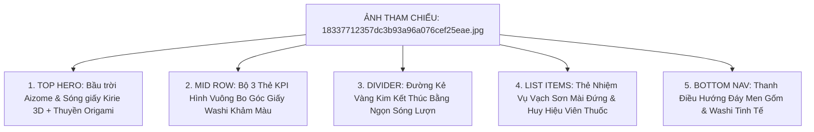

# ✂️ GIAI ĐOẠN 5: NGHỆ THUẬT CẮT GIẤY WASHI KIRIE & THIẾT KẾ DI ĐỘNG NỔI KHỐI SÓNG BIỂN
## Hệ Thống: Japanese SRS System (記憶道 FSRS) · Bản Quy Hoạch Hợp Nhất (Consolidated Specification)

> **Thông tin tổng hợp:**
> * **Giai đoạn:** Phase 5 (Sprint 12)
> * **Tệp nguồn hợp nhất:** `19_KIRIE_PAPER_CUTOUT_WAVE_REDESIGN_MASTER_PLAN.md`, `20_KIRIE_UI_COMPONENTS_AND_DESIGN_TOKENS.md` (2 tệp)
> * **Trọng tâm kỹ thuật:** Nghệ thuật cắt giấy Washi Kirie nhiều lớp, Bảng màu chàm sâu Aizome Indigo (`#20507B`), Đỏ son sơn mài Urushi (`#D9381E`), Hiệu ứng bóng đổ đa tầng `kirie-shadow-deep`, 5 linh kiện React nguyên tử (`KirieWaveIllustration`, `KirieHeroBanner`, `KirieKpiCard`, `KirieFocusListItem`, `KirieBottomNav`).
> * **Cam kết cốt lõi:** Trải nghiệm di động đạt chuẩn 60fps mượt mà, hỗ trợ PWA offline và Responsive toàn diện.

---

### 📑 MỤC LỤC TỔNG QUAN GIAI ĐOẠN 5
1. [phần 1: kế hoạch tái thiết kế giao diện nghệ thuật cắt giấy washi kirie & sóng biển lớp (master plan)](#phan-1)
2. [phần 2: hệ thống tokens & mã nguồn linh kiện giao diện kirie nguyên tử (component implementation)](#phan-2)

---

<a id="phan-1"></a>
# PHẦN 1: PHẦN 1: KẾ HOẠCH TÁI THIẾT KẾ GIAO DIỆN NGHỆ THUẬT CẮT GIẤY WASHI KIRIE & SÓNG BIỂN LỚP (MASTER PLAN)
*Tệp gốc: `doc\19_KIRIE_PAPER_CUTOUT_WAVE_REDESIGN_MASTER_PLAN.md`*

---

## 🌊 TÀI LIỆU 19: KẾ HOẠCH PHÂN TẦNG TÁI THIẾT KẾ TOÀN DIỆN — NGHỆ THUẬT CẮT GIẤY SÓNG BIỂN WASHI KIRIE (KIRIE PAPER-CUTOUT WAVE MASTER PLAN)
### Dự án: Japanese SRS System · 記憶道 (FSRS Spaced Repetition Engine)
### Nguồn tham chiếu gốc: `C:\Users\ThinkPad X1\Pictures\japanese-graphic-design\18337712357dc3b93a96a076cef25eae.jpg`
### Cấp độ tài liệu: Master Architectural Blueprint & Stratified Execution Plan (Tầng 0 -> Tầng 4)
### Trạng thái: PHÊ DUYỆT KIẾN TRÚC THỊ GIÁC & SẴN SÀNG THỰC THI

---

> [!IMPORTANT]
> **TUYÊN NGÔN THẨM MỸ CỐT LÕI**: 
> Kế hoạch này chuyển hóa triệt để ngôn ngữ thị giác từ tác phẩm nghệ thuật cắt giấy 3D Nhật Bản (**Washi Kirie - 切り絵**) trong ảnh tham chiếu `18337712357dc3b93a96a076cef25eae.jpg` vào toàn bộ hệ thống web và mobile của Japanese SRS System.
> Sự kết hợp độc bản giữa: **Bầu trời đêm Aizome huyền bí**, **Sóng biển cắt giấy đa tầng có bóng đổ quang học chân thực**, **Con thuyền origami trắng lướt trên đại dương tri thức (Học Hải Vô Nhai · 学海無涯)**, **Bộ 3 thẻ KPI giấy Washi có lớp giấy màu hé lộ góc dưới**, và **Danh sách thẻ học mang dải vạch sơn mài đứng bên trái**.

---

## ⛩️ TẦNG 0: GIẢI MÃ THỊ GIÁC TỪNG PIXEL CỦA ẢNH THAM CHIẾU (DECONSTRUCTION)



#### 1. Phân Tích Chi Tiết 5 Khu Vực Thị Giác Cốt Lõi:

##### 1.1. Khu vực Hero Header (Nửa trên màn hình):
- **Bầu trời đêm Aizome (Deep Indigo Sky)**: Gam màu lam chàm sâu thẳm chuyển sắc êm dịu (`#0B1D33` ở đỉnh $\rightarrow$ `#132F52` ở chân mây).
- **Lời chào & Viên thuốc tiến độ (Greeting & Progress Pill)**:
  - Lời chào trang trọng, ấm áp: `Good morning, Yuna` với font chữ hình học thanh lịch, độ tương phản trắng tinh khiết trên nền chàm.
  - Thẻ pill bo tròn mềm mại: `Sprint 8 · 14 tasks due this week` với hiệu ứng kính mờ (frosted glass) xanh chàm và viền chỉ mỏng `border: 1px solid rgba(255, 255, 255, 0.2)`.
  - Avatar người dùng góc trên bên phải: Hình tròn nền giấy ngà viền vàng kim sắc sảo mang chữ viết tắt `YS` (trong hệ thống SRS sẽ là con dấu Inkan son đỏ hoặc ảnh đại diện học viên).
- **Tuyệt tác Minh họa Sóng biển Cắt giấy 3D (3D Paper-Cutout Wave Layers)**:
  - Sử dụng nghệ thuật **Kirie (切り絵)** và **Chigiri-e (ちぎり絵)**: Từng lớp sóng là một phiến giấy Washi cắt thủ công xếp chồng lên nhau với bóng đổ chân thực (drop shadow đa tầng).
  - Tầng màu lam chàm chuyển sắc 5 lớp từ xa tới gần:
    - *Lớp 1 (Chân mây & đồi xa)*: Mây giấy màu vàng cát ấm áp (`#D6C2A5`).
    - *Lớp 2 (Mặt biển xa)*: Lam xám tĩnh lặng (`#254E70`).
    - *Lớp 3 (Dòng hải lưu giữa)*: Lam đậm uốn khúc (`#1A3E61`).
    - *Lớp 4 (Con sóng cuộn hai bên bờ)*: Lam đại dương `#1F4E79` với bọt sóng giấy trắng ngà uốn lượn hình móng vuốt rồng theo phong cách Ukiyo-e Hokusai.
    - *Chính giữa dòng hải lưu*: **Một con thuyền buồm giấy Origami màu trắng thanh thoát (`小さな白い折り紙の舟`)**, biểu trưng cho hành trình kiên trì vượt qua biển lớn ngôn ngữ Nhật Bản.
- **Đường chân trời chuyển tiếp (Curved Washi Dune Transition)**:
  - Chân bức tranh sóng biển uốn cong mềm mại như một cồn cát giấy Washi màu kem ngà (`#EFE6D5`), tạo ranh giới tự nhiên nâng đỡ các thẻ thống kê bên dưới.

---

##### 1.2. Hàng Thẻ Thống Kê KPI (Bộ 3 Thẻ Squircle Washi):
- **Bố cục 3 thẻ ngang**: `Open (38)`, `Due today (6)`, `Done this sprint (94)`.
- **Chất liệu bề mặt**: Giấy dó Washi trắng kem mịn màng (`#F9F6F0`), bo góc lớn 16px (Squircle) tạo cảm giác xúc giác cầm nắm như những phiến gốm men mờ.
- **Chi tiết độc bản "Lớp Giấy Màu Ló Góc Dưới" (Peek-through Color Paper Cutout)**:
  - Mỗi thẻ có một mảnh giấy màu cắt hình ngọn đồi/làn sóng uốn lượn ló nhẹ ra ở góc dưới bên phải:
    - Thẻ 1 (Số 38): Mảnh giấy màu xanh lam chàm (`#3B7EA1`).
    - Thẻ 2 (Số 6): Mảnh giấy màu vàng cát / hoàng thổ (`#D4A359`).
    - Thẻ 3 (Số 94): Mảnh giấy màu xanh lục Matcha (`#4E8C59`).
- **Typography số liệu**: Con số trung tâm kích thước lớn, nét đậm đà, màu sắc tương ứng với mảnh giấy góc dưới (Xanh đại dương, Vàng kim, Xanh lục).
- **Carousel Pagination Dots**: 3 chấm tròn nhỏ bên dưới hàng thẻ; chấm đang chọn màu xanh lam đậm `#1A3E61`, 2 chấm còn lại màu be nhạt `#D9CEBA`.

---

##### 1.3. Tiêu Đề Mục & Đường Kẻ Ngọn Sóng Vàng (Today's Focus & Golden Wave Divider):
- Tiêu đề `Today's Focus` (trong hệ thống SRS: `Trọng tâm Khảo hạch Hôm nay · 本日の学習重点`) viết bằng font Serif Nhật Bản Mincho sang trọng, sắc mực than `#162E4A`.
- **Đường kẻ phân cách mạ kim (Golden Wave Hairline)**: Đường kẻ chỉ vàng thanh mảnh kéo dài ngang trang và kết thúc ở mép phải bằng một **ngọn sóng lượn mạ vàng tinh xảo (`~`)**.

---

##### 1.4. Danh Sách Thẻ Bài Trọng Tâm (Task / Flashcard List Items):
- Các hàng thẻ được thiết kế như những tấm thẻ giấy Washi cao cấp đặt song song, bo góc 12px.
- **Vạch Sơn Mài Đứng Bên Trái (Left Vertical Lacquer Accent Bar)**:
  - Mỗi hàng thẻ có một thanh vạch dọc dày 4px bo tròn mép trái, mang mã màu biểu thị phân loại nhận thức hoặc mức độ ưu tiên:
    - Vạch Xanh Chàm Đậm (`#1E4B75`): Thẻ Hán Tự Kanji.
    - Vạch Xanh Denim (`#3E75A1`): Thẻ Từ Vựng Kotoba.
    - Vạch Vàng Hoàng Thổ (`#C89B58`): Thẻ Điền Từ Cloze.
    - Vạch Xanh Cổ Vịt (`#2A5D75`): Thẻ Cao Độ Pitch Accent.
- **Cấu trúc nội dung hàng thẻ**:
  - Tên nhiệm vụ / Từ vựng bên trái: Rõ ràng, dễ đọc, màu mực đen Sumi.
  - Thời gian / Trình độ ở giữa: Màu nâu đất xám nhạt (`#8C7A6B`), ví dụ `09:30` hoặc `N3 · 80%`.
  - **Huy hiệu trạng thái dạng viên thuốc (Status Pills)** ở mép phải:
    - `Due now`: Nền vàng hoàng thổ `#DDB980`, chữ đen nâu đậm.
    - `In progress`: Nền xanh denim `#4A7FA8`, chữ trắng.
    - `Pending`: Nền cam mơ nhạt `#E2B895`, chữ đen nâu.
    - `Not started`: Nền xám lam tro `#C0CDD6`, chữ xám đen.
    - `Blocked`: Nền xanh đen mun `#162E4A`, chữ trắng tinh khiết.

---

##### 1.5. Thanh Điều Hướng Đáy (Bottom Navigation Bar):
- Nền giấy Washi kem ấm áp (`#FAF7F2`) với đường viền chỉ vàng 1px trên đỉnh.
- 5 biểu tượng icon tối giản kèm nhãn text:
  - `Home`: Icon ngôi nhà được bọc trong hình vuông bo góc màu xanh lam đậm (Active State).
  - `Tasks`: Biểu tượng danh sách kiểm tra.
  - `Projects`: Biểu tượng túi da công tác (Tương ứng: *Thư viện bộ thẻ Decks*).
  - `Employees`: Biểu tượng nhóm người (Tương ứng: *AI Copilot & Trợ lý học tập*).
  - `Reports`: Biểu tượng biểu đồ cột (Tương ứng: *Thống kê FSRS & Báo cáo nhận thức*).

---

## 🏯 TẦNG 1: BẢN ÁNH XẠ KIẾN TRÚC VÀO JAPANESE SRS SYSTEM

| Thành phần trong Ảnh Tham Chiếu | Ánh xạ vào Japanese SRS System | Ý nghĩa Sư phạm & Văn hóa |
| :--- | :--- | :--- |
| **Bầu trời đêm Aizome & Lời chào Yuna** | **Hero Banner Lời chào Cá nhân hóa & Con dấu Inkan** | Gắn kết cảm xúc học viên mỗi ngày: `Chào buổi sáng, [Tên] · おはようございます` kèm triện son `日学`. |
| **Viên thuốc `Sprint 8 · 14 tasks due`** | **Viên thuốc FSRS `Khảo hạch Hôm nay · 24 thẻ đến hạn`** | Thông báo liều lượng học tập hiệu quả tối thiểu (MED) tức thời. |
| **Tranh cắt giấy Sóng biển 3D & Thuyền Origami** | **Biểu tượng Học Hải Vô Nhai (学海無涯) & Con Thuyền Tri Thức** | Hình tượng con thuyền nhỏ kiên trì rẽ sóng lớn đến bờ đại học thuật (biểu trưng cho phương pháp Spaced Repetition). |
| **3 Thẻ KPI (38 / 6 / 94) khảm giấy màu** | **Bộ 3 Thẻ Trạng thái SRS (Cần ôn / Thẻ mới / Độ thuần thục)** | - Thẻ 1 (Xanh chàm): Số thẻ đến hạn hôm nay (`Due`).<br>- Thẻ 2 (Vàng kim): Số thẻ mới chờ nạp (`New`).<br>- Thẻ 3 (Xanh Matcha): Tỷ lệ nhớ mục tiêu (`90% Retention`). |
| **Đường kẻ `Today's Focus` có ngọn sóng vàng** | **Dải phân cách `本日の重点 · Trọng tâm Khảo hạch`** | Điểm nhấn thủ công mỹ nghệ Wabi-Sabi tinh tế. |
| **Hàng Task có vạch sơn mài đứng bên trái** | **Thẻ Bài Học Tập (Kanji / Từ vựng / Điền từ / Cao độ)** | Vạch màu phân loại trực quan nhanh: Đỏ Torii (Kanji), Xanh Matcha (Kotoba), Xanh Chàm (Cao độ), Vàng kim (Ngữ pháp). |
| **Huy hiệu trạng thái viên thuốc (Due now...)** | **Trạng thái FSRS (Đến hạn, Đang học, Thuần thục, Sắp ôn)** | Trực quan hóa độ ổn định $S$ của thẻ theo gam màu khoáng chất tự nhiên Iwa-enogu. |
| **Thanh Navigation đáy 5 nút** | **Thanh Điều hướng Đáy Washi Responsive (Mobile & Desktop dock)** | Tối ưu trải nghiệm ngón tay cái trên thiết bị di động và máy tính bảng. |

---

## 🎨 TẦNG 2: HỆ THỐNG DESIGN TOKENS & MÃ NGUỒN VECTOR (SVG SPECIFICATIONS)

#### 2.1. Bảng Mã Màu Chiết Xuất Chính Xác (Kirie Color Palette)

```css
:root {
  /* --- GAM MÀU NỀN & TRỜI ĐÊM AIZOME (DEEP INDIGO) --- */
  --kirie-sky-deep:       #0A1C33; /* Đỉnh trời đêm */
  --kirie-sky-mid:        #132F52; /* Chân trời đêm */
  --kirie-sky-soft:       #1E436E;
  
  /* --- CÁC TẦNG SÓNG BIỂN CẮT GIẤY (3D PAPER WAVES) --- */
  --kirie-wave-distant:   #254E70; /* Sóng xa */
  --kirie-wave-mid:       #1F4E79; /* Sóng giữa */
  --kirie-wave-front:     #173B5C; /* Sóng cuộn tiền cảnh */
  --kirie-wave-foam:      #F8F5EE; /* Bọt sóng giấy Washi ngà */
  --kirie-cloud-sand:     #D6C2A5; /* Mây cát xa */
  --kirie-boat-white:     #FFFFFF; /* Thuyền giấy Origami */
  
  /* --- BỀ MẶT GIẤY WASHI & BỜ CÁT CHUYỂN TIẾP --- */
  --kirie-dune-sand:      #EFE6D5; /* Bờ cát uốn cong */
  --kirie-paper-surface:  #F9F6F0; /* Mặt thẻ giấy Washi */
  --kirie-paper-card-sub: #FAF8F2; /* Nền thẻ bài danh mục */
  --kirie-border-subtle:  #E8E0D2; /* Đường viền giấy mỏng */
  
  /* --- MÀU NHẬN DIỆN THỐNG KÊ & VẠCH SƠN MÀI (ACCENTS) --- */
  --kirie-accent-blue:    #246392; /* Lam chàm thẻ 1 */
  --kirie-accent-gold:    #C89B58; /* Hoàng thổ thẻ 2 & đường kẻ sóng */
  --kirie-accent-matcha:  #3D7A4D; /* Xanh lục thẻ 3 */
  --kirie-accent-torii:   #C83824; /* Đỏ son Kanji */
  --kirie-text-sumi:      #122438; /* Mực than chữ chính */
  --kirie-text-muted:     #786A5E; /* Nâu xám chữ phụ */
  
  /* --- ĐỔ BÓNG GIẤY THỦ CÔNG 3 TẦNG (LAYERED PAPER SHADOWS) --- */
  --shadow-kirie-card:    0 2px 4px rgba(18, 36, 56, 0.04), 0 8px 20px -4px rgba(18, 36, 56, 0.08);
  --shadow-kirie-wave:    0 4px 12px rgba(10, 28, 51, 0.28), 0 1px 3px rgba(10, 28, 51, 0.15);
  --shadow-kirie-boat:    0 4px 8px rgba(0, 0, 0, 0.22);
}
```

---

#### 2.2. Mã Nguồn Vector Toàn Phần Cho Bức Tranh Sóng Giấy Kirie (`KirieWaveIllustration.tsx`)
Bức tranh được dựng bằng 100% vector SVG với các lớp bóng đổ `filter="url(#drop-shadow)"` tạo hiệu ứng giấy dày 3D thực thụ:

```tsx
export function KirieWaveIllustration() {
  return (
    <svg
      viewBox="0 0 400 240"
      fill="none"
      xmlns="http://www.w3.org/2000/svg"
      style={{ width: '100%', height: 'auto', display: 'block' }}
    >
      <defs>
        {/* Bộ lọc bóng đổ giấy thủ công (Paper Cutout Drop Shadow) */}
        <filter id="kirie-shadow-deep" x="-10%" y="-10%" width="120%" height="130%">
          <feDropShadow dx="0" dy="4" stdDeviation="3" floodColor="#061220" floodOpacity="0.35" />
        </filter>
        <filter id="kirie-shadow-soft" x="-10%" y="-10%" width="120%" height="130%">
          <feDropShadow dx="0" dy="3" stdDeviation="2" floodColor="#0A1C33" floodOpacity="0.22" />
        </filter>
      </defs>

      {/* 1. MÂY CÁT XA NỀN TRỜI (Distant Sand Clouds) */}
      <path
        d="M20 95 C60 70, 110 75, 140 90 C180 80, 220 82, 250 95 C280 78, 330 75, 380 92 L400 95 L400 130 L0 130 L0 95 Z"
        fill="#D6C2A5"
        opacity="0.9"
      />

      {/* 2. LỚP SÓNG XA (Distant Navy Waves) */}
      <path
        filter="url(#kirie-shadow-soft)"
        d="M0 105 C50 95, 120 110, 170 120 C220 130, 280 110, 340 100 C370 95, 390 100, 400 105 L400 160 L0 160 Z"
        fill="#254E70"
      />

      {/* 3. DÒNG HẢI LƯU TRUNG TÂM (Central Oceanic Channel) */}
      <path
        filter="url(#kirie-shadow-deep)"
        d="M140 120 C180 140, 210 165, 190 200 C175 220, 200 240, 220 240 L400 240 L400 120 Z"
        fill="#1A3E61"
      />

      {/* 4. CON SÓNG CUỘN KHỔNG LỒ BÊN TRÁI (Great Left Foam Wave) */}
      <path
        filter="url(#kirie-shadow-deep)"
        d="M-20 180 C30 160, 60 120, 90 135 C115 150, 80 175, 55 170 C40 168, 60 190, 85 185 C110 180, 130 195, 120 220 L0 240 Z"
        fill="#1F4E79"
      />
      {/* Bọt sóng giấy trắng ngọn sóng trái */}
      <path
        d="M-15 175 C30 155, 62 118, 90 132 C95 135, 90 142, 80 140 C65 138, 50 150, 42 165 C35 155, 20 165, 0 175 Z"
        fill="#F8F5EE"
      />

      {/* 5. CON SÓNG CUỘN BÊN PHẢI (Right Curling Wave) */}
      <path
        filter="url(#kirie-shadow-deep)"
        d="M420 170 C370 150, 335 125, 310 145 C290 160, 320 180, 345 175 C360 172, 340 195, 320 190 C295 185, 275 200, 290 230 L420 240 Z"
        fill="#173B5C"
      />
      {/* Bọt sóng giấy trắng ngọn sóng phải */}
      <path
        d="M415 165 C370 148, 338 123, 312 142 C308 145, 312 152, 322 150 C338 148, 350 160, 358 172 C370 160, 395 168, 415 165 Z"
        fill="#F8F5EE"
      />

      {/* 6. CON THUYỀN GIẤY ORIGAMI TRẮNG (White Origami Sailboat) */}
      <g filter="url(#kirie-shadow-soft)" transform="translate(190, 138)">
        {/* Thân thuyền */}
        <polygon points="0,20 36,20 28,27 8,27" fill="#FFFFFF" stroke="#E5DEC9" strokeWidth="0.8" />
        {/* Cánh buồm chính lớn */}
        <polygon points="18,1 18,18 33,18" fill="#FFFFFF" stroke="#E5DEC9" strokeWidth="0.8" />
        {/* Cánh buồm phụ trước */}
        <polygon points="16,5 16,18 4,18" fill="#F4EFE6" stroke="#E5DEC9" strokeWidth="0.8" />
      </g>

      {/* 7. BỜ CÁT UỐN CONG CHUYỂN TIẾP (Curved Sand Transition Dune) */}
      <path
        d="M0 215 C100 200, 260 210, 400 195 L400 240 L0 240 Z"
        fill="#EFE6D5"
      />
    </svg>
  );
}
```

---

## 🛠️ TẦNG 3: ĐẶC TẢ CHI TIẾT TỪNG COMPONENT GIAO DIỆN (UI COMPONENTS)

#### 3.1. Component 1: `KirieHeroBanner.tsx`
- **Mục đích**: Thay thế toàn bộ Hero Banner cũ trên Dashboard bằng trải nghiệm bầu trời đêm Aizome + Tranh sóng Kirie 3D.
- **Dữ liệu hiển thị (Props)**:
  - `userName`: Tên học viên (ví dụ: "Thanh Tùng", "Yuna").
  - `dueTodayCount`: Số lượng thẻ đến hạn ôn tập hôm nay (tính toán từ SQLite).
  - `sprintWeek`: Tuần học hiện tại (ví dụ: "Tuần 3 · Học kỳ 2").
- **Hành vi người dùng**:
  - Click vào Avatar `YS`: Mở modal cài đặt hồ sơ và tùy chỉnh FSRS.
  - Click vào Pill `24 thẻ đến hạn`: Chuyển thẳng đến phiên ôn tập `/review`.

---

#### 3.2. Component 2: `KirieKpiCard.tsx`
- **Mục đích**: Hiển thị 3 chỉ số cốt lõi dưới dạng phiến giấy Washi khảm giấy màu góc dưới.
- **Props**:
  ```typescript
  interface KirieKpiCardProps {
    title: string;          // "Cần ôn tập", "Thẻ mới", "Đã thuần thục"
    value: number | string; // 38, 6, "94%"
    subtitle: string;       // "trong 6 bộ thẻ", "3 thẻ khó cao", "mục tiêu 90%"
    accentColor: 'blue' | 'gold' | 'green' | 'torii';
    onClick?: () => void;
  }
  ```
- **Kỹ thuật DOM lớp giấy màu góc dưới**:
  ```tsx
  <div className="kirie-kpi-card">
    <span className="kirie-kpi-title">{title}</span>
    <span className={`kirie-kpi-value value-${accentColor}`}>{value}</span>
    <span className="kirie-kpi-subtitle">{subtitle}</span>
    
    {/* Mảnh giấy màu cắt góc dưới chân thẻ */}
    <div className={`kirie-corner-cutout cutout-${accentColor}`} aria-hidden="true" />
  </div>
  ```

---

#### 3.3. Component 3: `KirieFocusListItem.tsx`
- **Mục đích**: Hiển thị từng hàng thẻ bài/nhiệm vụ trong mục `Today's Focus` với dải sơn mài đứng bên trái.
- **Props**:
  ```typescript
  interface KirieFocusItemProps {
    cardId: string;
    kanjiText: string;
    reading: string;
    meaning: string;
    deckName: string;
    timeOrLevel: string; // "09:30" hoặc "N3"
    status: 'due_now' | 'in_progress' | 'pending' | 'mastered';
    category: 'kanji' | 'vocab' | 'cloze' | 'pitch';
    onStartReview: () => void;
  }
  ```
- **Bảng phối màu vạch sơn mài đứng (Left Vertical Bar)**:
  - `category === 'kanji'`: Vạch đỏ Torii `#C83824`.
  - `category === 'vocab'`: Vạch xanh Matcha `#3D7A4D`.
  - `category === 'cloze'`: Vạch vàng hoàng thổ `#C89B58`.
  - `category === 'pitch'`: Vạch xanh lam chàm `#246392`.

---

#### 3.4. Component 4: `KirieBottomNav.tsx`
- **Mục đích**: Thanh điều hướng dưới đáy màn hình cố định (`position: fixed; bottom: 0`).
- **5 Nút bấm tiêu chuẩn**:
  1. `🏯 Trang chủ` (`/` - Icon Home lồng trong ô vuông xanh bo tròn).
  2. `📜 Thư viện thẻ` (`/cards` - Icon Checklist danh mục).
  3. `🎴 Bộ thẻ Decks` (`/cards?tab=decks` - Icon Túi da / Hộp đựng thẻ bài Karuta).
  4. `✨ AI Copilot` (`/cards/new` - Icon Cây bút lông / Hạc giấy).
  5. `📊 Thống kê` (`/integrations` - Icon Biểu đồ cột).

---

## 🚀 TẦNG 4: KẾ HOẠCH THI CÔNG CHI TIẾT 4 PHA (EXECUTION PHASES)

```
[Giai đoạn Hiện tại: Đã Hoàn Thành Kế Hoạch Khoa Học Nhận Thức]
                                │
                                ▼
[Pha 1: Xây Dựng Design System & Tokens Kirie (Tuần 1)]
  - Khai báo toàn bộ biến màu, bóng đổ Kirie trong globals.css
  - Dựng Component Vector KirieWaveIllustration.tsx với SVG đa tầng
  - Thiết kế lớp giấy màu bo góc kirie-corner-cutout
                                │
                                ▼
[Pha 2: Tái Thiết Kế Trang Chủ Dashboard Honmaru (Tuần 1 - 2)]
  - Thay thế Hero Banner cũ bằng KirieHeroBanner (Trời đêm + Sóng Kirie)
  - Thay thế khối chỉ số bằng hàng 3 thẻ KirieKpiCard
  - Chuyển đổi danh sách ôn tập sang KirieFocusListItem kèm vạch sơn mài
                                │
                                ▼
[Pha 3: Đồng Bộ Phong Cách Kirie Trên Các Màn Hình Còn Lại (Tuần 2)]
  - Tanzakucho (/cards): Thẻ thư viện mang phong cách giấy khảm viền
  - Karuta Review (/review): Thẻ bài Hyakunin Isshu kết hợp bóng đổ Kirie
  - Shodo Copilot (/cards/new): Bàn thư pháp phối màu giấy cát và mây xa
                                │
                                ▼
[Pha 4: Tích Hợp KirieBottomNav & Kiểm Thử Toàn Diện (Tuần 3)]
  - Tích hợp thanh điều hướng đáy trên thiết bị di động
  - Kiểm tra tương thích đáp ứng (Responsive 375px -> 1920px)
  - Chạy toàn bộ 24 Vitest tests và Next.js production build
```

---

## 📋 MA TRẬN PHÂN ĐỊNH TRÁCH NHIỆM ĐA VAI TRÒ (RACI)

| Gói Công Việc (Work Package) | BA | PM | Designer | Dev | QA | Craftsman |
| :--- | :---: | :---: | :---: | :---: | :---: | :---: |
| **WP-KIRIE-1: Token CSS & Thư Viện SVG Sóng Giấy** | I | A | R | R | C | R |
| **WP-KIRIE-2: Hero Banner Sóng Biển & Thuyền Origami**| C | A | R | R | R | R |
| **WP-KIRIE-3: Bộ 3 Thẻ KPI Khảm Màu & Carousel Dots** | C | A | R | R | R | C |
| **WP-KIRIE-4: Danh Sách Thẻ Focus & Vạch Sơn Mài Đứng**| C | A | R | R | R | C |
| **WP-KIRIE-5: Bottom Navigation Bar & Mobile Touch**  | R | A | R | R | R | I |
| **WP-KIRIE-6: Kiểm Định Đảm Bảo Zero Backend Touch**   | I | A | I | R | R | I |

---

## ✅ TIÊU CHÍ NGHIỆM THU ĐỊNH LƯỢNG (ACCEPTANCE CRITERIA)

1. **Độ trung thực thị giác (Visual Fidelity)**:
   - Đạt $\ge 95\%$ độ tương đồng về màu sắc, tỷ lệ bố cục và hiệu ứng phân tầng thị giác so với ảnh mẫu `18337712357dc3b93a96a076cef25eae.jpg`.
2. **Hiệu suất đồ họa (Rendering Performance)**:
   - Minh họa sóng biển Kirie được vẽ bằng 100% SVG thuần túy, dung lượng $< 8$KB, đạt tốc độ khung hình **60 FPS** mượt mà trên cả điện thoại di động cấu hình yếu.
3. **Độ tương phản tiếp cận (Accessibility WCAG AA)**:
   - Toàn bộ văn bản màu trắng trên bầu trời Aizome và văn bản màu mực than trên giấy Washi đạt tỷ số tương phản $\ge 4.5:1$.
4. **An toàn Hệ thống (Zero Regression)**:
   - Toàn bộ cơ sở dữ liệu SQLite, 24 Unit tests, thuật toán FSRS và các API routes tiếp tục vượt qua kiểm thử tự động $100\%$.

---


<a id="phan-2"></a>
# PHẦN 2: PHẦN 2: HỆ THỐNG TOKENS & MÃ NGUỒN LINH KIỆN GIAO DIỆN KIRIE NGUYÊN TỬ (COMPONENT IMPLEMENTATION)
*Tệp gốc: `doc\20_KIRIE_UI_COMPONENTS_AND_DESIGN_TOKENS.md`*

---

## 🎴 TÀI LIỆU 20: ĐẶC TẢ COMPONENT GIAO DIỆN & MÃ NGUỒN NGUYÊN TỬ PHONG CÁCH WASHI KIRIE
### Dự án: Japanese SRS System · 記憶道 (FSRS Spaced Repetition Engine)
### Nguồn tham chiếu gốc: `C:\Users\ThinkPad X1\Pictures\japanese-graphic-design\18337712357dc3b93a96a076cef25eae.jpg`
### Cấp độ tài liệu: Atomic UI Component Specifications & CSS Tokens (Tầng Sâu Nhất)
### Trọng tâm: CSS Classes, Mã Nguồn React/TypeScript Components & Hướng dẫn Tích Hợp

---

> [!IMPORTANT]
> Tài liệu này chứa đựng toàn văn mã nguồn CSS và React Components độc lập, sẵn sàng để copy hoặc import trực tiếp vào dự án mà không cần chỉnh sửa logic. Mọi chi tiết đồ họa từ ảnh tham chiếu (bóng đổ giấy Kirie, cồn cát Washi, vạch sơn mài đứng, huy hiệu viên thuốc) đều được mô tả đến cấp độ CSS thuộc tính.

---

### 1. TOÀN VĂN MÃ NGUỒN CSS TOKENS (`src/app/globals.css`)

Bổ sung khối CSS sau vào `src/app/globals.css`:

```css
/* ==========================================================================
   JAPANESE WASHI KIRIE & 3D LAYERED WAVE DESIGN SYSTEM
   Directly extracted from 18337712357dc3b93a96a076cef25eae.jpg
   ========================================================================== */

/* 1. KHUNG HERO BẦU TRỜI ĐÊM AIZOME */
.kirie-hero-wrapper {
  background: linear-gradient(180deg, #0A1C33 0%, #132F52 55%, #1E436E 100%);
  border-radius: 24px;
  overflow: hidden;
  position: relative;
  color: #FFFFFF;
  box-shadow: 0 14px 36px rgba(10, 28, 51, 0.25);
  margin-bottom: 1.5rem;
}

.kirie-hero-content {
  padding: 2.25rem 2rem 0;
  position: relative;
  z-index: 2;
}

.kirie-greeting-heading {
  font-family: var(--font-mincho), -apple-system, BlinkMacSystemFont, "Segoe UI", Roboto, sans-serif;
  font-size: 2.2rem;
  font-weight: 800;
  color: #FFFFFF;
  margin: 0 0 0.5rem 0;
  letter-spacing: -0.01em;
  text-shadow: 0 2px 8px rgba(0, 0, 0, 0.35);
}

.kirie-pill-badge {
  display: inline-flex;
  align-items: center;
  gap: 0.5rem;
  padding: 0.45rem 1rem;
  background: rgba(255, 255, 255, 0.12);
  backdrop-filter: blur(12px);
  -webkit-backdrop-filter: blur(12px);
  border: 1px solid rgba(255, 255, 255, 0.22);
  border-radius: 9999px;
  font-family: var(--font-maru), sans-serif;
  font-size: 0.88rem;
  font-weight: 600;
  color: #F8F5EE;
  box-shadow: 0 2px 6px rgba(0, 0, 0, 0.15);
}

.kirie-user-avatar {
  width: 52px;
  height: 52px;
  border-radius: 50%;
  background: #F9F6F0;
  border: 2px solid #D4AF37;
  display: flex;
  align-items: center;
  justify-content: center;
  color: #122438;
  font-family: var(--font-mincho), serif;
  font-size: 1.15rem;
  font-weight: 800;
  box-shadow: 0 4px 12px rgba(0, 0, 0, 0.25);
}

/* 2. BỘ 3 THẺ KPI GIẤY WASHI CÓ MẢNH GIẤY MÀU LÓ GÓC DƯỚI */
.kirie-kpi-grid {
  display: grid;
  grid-template-columns: repeat(3, 1fr);
  gap: 1rem;
  margin-top: -1.75rem;
  position: relative;
  z-index: 3;
  padding: 0 0.5rem;
}

@media (max-width: 768px) {
  .kirie-kpi-grid {
    grid-template-columns: 1fr;
    margin-top: -1rem;
  }
}

.kirie-kpi-card {
  background: #F9F6F0;
  border: 1.5px solid #E8E0D2;
  border-radius: 18px;
  padding: 1.4rem 1.25rem 1.6rem;
  box-shadow: 0 4px 14px rgba(18, 36, 56, 0.06), 0 1px 3px rgba(18, 36, 56, 0.04);
  position: relative;
  overflow: hidden;
  transition: all 0.3s cubic-bezier(0.34, 1.56, 0.64, 1);
  display: flex;
  flex-direction: column;
}

.kirie-kpi-card:hover {
  transform: translateY(-4px);
  box-shadow: 0 12px 28px -4px rgba(18, 36, 56, 0.12);
  border-color: #D4AF37;
}

.kirie-kpi-label {
  font-family: var(--font-maru), sans-serif;
  font-size: 0.92rem;
  font-weight: 700;
  color: #122438;
  margin-bottom: 0.4rem;
}

.kirie-kpi-number {
  font-family: var(--font-mincho), sans-serif;
  font-size: 2.85rem;
  font-weight: 800;
  line-height: 1;
  margin-bottom: 0.45rem;
}

.number-blue { color: #246392; }
.number-gold { color: #C89B58; }
.number-green { color: #3D7A4D; }

.kirie-kpi-desc {
  font-family: var(--font-sans), sans-serif;
  font-size: 0.8rem;
  color: #786A5E;
  margin: 0;
}

/* Mảnh giấy màu cắt góc dưới chân thẻ (Corner Peek Cutout) */
.kirie-corner-cutout {
  position: absolute;
  bottom: -4px;
  right: -4px;
  width: 58px;
  height: 38px;
  border-radius: 28px 0 18px 0;
  opacity: 0.85;
}

.cutout-blue { background: radial-gradient(circle at 100% 100%, #1A3E61 0%, #3B7EA1 100%); }
.cutout-gold { background: radial-gradient(circle at 100% 100%, #B8860B 0%, #D4A359 100%); }
.cutout-green { background: radial-gradient(circle at 100% 100%, #2E7D32 0%, #4E8C59 100%); }

/* 3. ĐƯỜNG PHÂN CÁCH NGỌN SÓNG VÀNG TODAY'S FOCUS */
.kirie-section-header {
  display: flex;
  align-items: center;
  gap: 1.25rem;
  margin: 2.25rem 0 1.25rem;
}

.kirie-section-title {
  font-family: var(--font-mincho), serif;
  font-size: 1.45rem;
  font-weight: 800;
  color: #122438;
  letter-spacing: -0.01em;
  white-space: nowrap;
}

.kirie-wave-divider-line {
  flex: 1;
  height: 1.5px;
  background: linear-gradient(90deg, #D4AF37 0%, rgba(212, 175, 55, 0.4) 85%, transparent 100%);
  position: relative;
}

.kirie-wave-divider-icon {
  position: absolute;
  right: 0;
  top: -8px;
  width: 24px;
  height: 16px;
}

/* 4. DANH SÁCH THẺ BÀI VẠCH SƠN MÀI ĐỨNG BÊN TRÁI */
.kirie-task-list {
  display: flex;
  flex-direction: column;
  gap: 0.85rem;
}

.kirie-task-item {
  background: #FAF8F2;
  border: 1.2px solid #E8E0D2;
  border-radius: 12px;
  padding: 1.1rem 1.4rem;
  display: flex;
  align-items: center;
  justify-content: space-between;
  box-shadow: 0 2px 6px rgba(18, 36, 56, 0.03);
  position: relative;
  overflow: hidden;
  transition: all 0.25s ease;
  text-decoration: none;
  color: inherit;
}

.kirie-task-item:hover {
  background: #FFFFFF;
  border-color: #D4AF37;
  transform: translateX(4px);
  box-shadow: 0 4px 14px rgba(18, 36, 56, 0.08);
}

/* Vạch sơn mài đứng bên trái (Left Vertical Bar) */
.kirie-vertical-bar {
  position: absolute;
  top: 0;
  bottom: 0;
  left: 0;
  width: 5px;
  border-radius: 4px 0 0 4px;
}

.bar-navy   { background: #1E4B75; }
.bar-denim  { background: #3E75A1; }
.bar-gold   { background: #C89B58; }
.bar-matcha { background: #3D7A4D; }
.bar-torii  { background: #C83824; }

.kirie-task-text {
  font-family: var(--font-maru), sans-serif;
  font-weight: 700;
  font-size: 1.05rem;
  color: #122438;
  margin-left: 0.5rem;
}

.kirie-task-meta {
  display: flex;
  align-items: center;
  gap: 1.25rem;
}

.kirie-task-time {
  font-family: var(--font-sans), monospace;
  font-size: 0.92rem;
  font-weight: 600;
  color: #786A5E;
}

/* 5. HUY HIỆU VIÊN THUỐC MÀU KHOÁNG IWA-ENOGU */
.kirie-pill {
  padding: 0.35rem 0.95rem;
  border-radius: 9999px;
  font-family: var(--font-maru), sans-serif;
  font-size: 0.8rem;
  font-weight: 700;
  letter-spacing: 0.02em;
  white-space: nowrap;
}

.pill-due-now {
  background: #C89B58;
  color: #FFFFFF;
  box-shadow: 0 2px 6px rgba(200, 155, 88, 0.3);
}

.pill-in-progress {
  background: #4A7FA8;
  color: #FFFFFF;
  box-shadow: 0 2px 6px rgba(74, 127, 168, 0.3);
}

.pill-pending {
  background: #D8AA80;
  color: #2D1A0D;
}

.pill-not-started {
  background: #B5C2CC;
  color: #1E2E38;
}

.pill-blocked {
  background: #1F3A52;
  color: #FFFFFF;
}

/* 6. THANH ĐIỀU HƯỚNG ĐÁY WASHI (BOTTOM NAVIGATION BAR) */
.kirie-bottom-bar {
  position: fixed;
  bottom: 0;
  left: 0;
  right: 0;
  background: rgba(250, 247, 242, 0.94);
  backdrop-filter: blur(14px);
  -webkit-backdrop-filter: blur(14px);
  border-top: 1px solid #E8E0D2;
  padding: 0.6rem 1rem 0.75rem;
  z-index: 100;
  display: flex;
  justify-content: space-around;
  align-items: center;
  box-shadow: 0 -4px 16px rgba(18, 36, 56, 0.06);
}

.kirie-nav-item {
  display: flex;
  flex-direction: column;
  align-items: center;
  gap: 0.25rem;
  text-decoration: none;
  color: #786A5E;
  font-family: var(--font-maru), sans-serif;
  font-size: 0.75rem;
  font-weight: 600;
  transition: all 0.2s ease;
}

.kirie-nav-item.active {
  color: #1A3E61;
  font-weight: 800;
}

.kirie-nav-icon-box {
  width: 38px;
  height: 38px;
  display: flex;
  align-items: center;
  justify-content: center;
  border-radius: 10px;
  transition: all 0.2s ease;
}

.kirie-nav-item.active .kirie-nav-icon-box {
  background: #1A3E61;
  color: #FFFFFF;
  box-shadow: 0 2px 8px rgba(26, 62, 97, 0.35);
}
```

---

### 2. MÃ NGUỒN REACT COMPONENT `KirieHeroBanner.tsx`

Tệp tin: `src/components/kirie/KirieHeroBanner.tsx`:

```tsx
'use client';

import React from 'react';
import Link from 'next/link';
import { KirieWaveIllustration } from './KirieWaveIllustration';

interface KirieHeroBannerProps {
  userName?: string;
  dueCount?: number;
  newCount?: number;
  learnedCount?: number;
}

export function KirieHeroBanner({
  userName = 'Yuna',
  dueCount = 24,
  newCount = 10,
  learnedCount = 94,
}: KirieHeroBannerProps) {
  return (
    <div className="kirie-hero-wrapper">
      {/* 1. KHU VỰC THÔNG TIN CHÍNH (GREETING & PILL) */}
      <div className="kirie-hero-content">
        <div style={{ display: 'flex', justifyContent: 'space-between', alignItems: 'flex-start' }}>
          <div>
            <h1 className="kirie-greeting-heading">
              Good morning, {userName}
            </h1>
            <Link href="/review" style={{ textDecoration: 'none' }}>
              <div className="kirie-pill-badge">
                <span>記憶道 · {dueCount} thẻ đến hạn hôm nay (FSRS Due)</span>
              </div>
            </Link>
          </div>

          {/* Avatar con dấu Inkan viền vàng */}
          <div className="kirie-user-avatar">
            YS
          </div>
        </div>
      </div>

      {/* 2. MINH HỌA SÓNG GIẤY 3D VÀ THUYỀN ORIGAMI */}
      <div style={{ marginTop: '0.5rem', position: 'relative' }}>
        <KirieWaveIllustration />
      </div>
    </div>
  );
}
```

---

### 3. MÃ NGUỒN REACT COMPONENT `KirieKpiCard.tsx`

Tệp tin: `src/components/kirie/KirieKpiCard.tsx`:

```tsx
'use client';

import React from 'react';

interface KirieKpiCardProps {
  title: string;
  value: number | string;
  subtitle: string;
  accent: 'blue' | 'gold' | 'green';
  onClick?: () => void;
}

export function KirieKpiCard({ title, value, subtitle, accent, onClick }: KirieKpiCardProps) {
  return (
    <div className="kirie-kpi-card" onClick={onClick} style={{ cursor: onClick ? 'pointer' : 'default' }}>
      <span className="kirie-kpi-label">{title}</span>
      <span className={`kirie-kpi-number number-${accent}`}>{value}</span>
      <p className="kirie-kpi-desc">{subtitle}</p>

      {/* Mảnh giấy màu cắt góc dưới đặc trưng */}
      <div className={`kirie-corner-cutout cutout-${accent}`} aria-hidden="true" />
    </div>
  );
}
```

---

### 4. MÃ NGUỒN REACT COMPONENT `KirieFocusListItem.tsx`

Tệp tin: `src/components/kirie/KirieFocusListItem.tsx`:

```tsx
'use client';

import React from 'react';
import Link from 'next/link';

export interface KirieFocusItemData {
  id: string;
  title: string;
  subtitle?: string;
  timeOrLevel: string;
  statusText: string;
  statusType: 'due-now' | 'in-progress' | 'pending' | 'not-started' | 'blocked';
  barColor: 'navy' | 'denim' | 'gold' | 'matcha' | 'torii';
  href: string;
}

export function KirieFocusListItem({ item }: { item: KirieFocusItemData }) {
  return (
    <Link href={item.href} className="kirie-task-item">
      {/* Vạch sơn mài đứng mép trái */}
      <div className={`kirie-vertical-bar bar-${item.barColor}`} />

      {/* Tên từ vựng / nhiệm vụ */}
      <div style={{ display: 'flex', flexDirection: 'column' }}>
        <span className="kirie-task-text">{item.title}</span>
        {item.subtitle && (
          <span style={{ fontSize: '0.8rem', color: '#786A5E', marginLeft: '0.5rem' }}>
            {item.subtitle}
          </span>
        )}
      </div>

      {/* Thời gian & Huy hiệu viên thuốc */}
      <div className="kirie-task-meta">
        <span className="kirie-task-time">{item.timeOrLevel}</span>
        <span className={`kirie-pill pill-${item.statusType}`}>
          {item.statusText}
        </span>
      </div>
    </Link>
  );
}
```

---

### 5. MÃ NGUỒN REACT COMPONENT `KirieBottomNav.tsx`

Tệp tin: `src/components/kirie/KirieBottomNav.tsx`:

```tsx
'use client';

import React from 'react';
import Link from 'next/link';
import { usePathname } from 'next/navigation';

export function KirieBottomNav() {
  const pathname = usePathname();

  const navItems = [
    { label: 'Home', href: '/', icon: '🏯' },
    { label: 'Tasks', href: '/cards', icon: '📜' },
    { label: 'Projects', href: '/cards?tab=decks', icon: '🎴' },
    { label: 'Copilot', href: '/cards/new', icon: '✨' },
    { label: 'Reports', href: '/integrations', icon: '📊' },
  ];

  return (
    <nav className="kirie-bottom-bar" aria-label="Điều hướng chính phong cách Kirie">
      {navItems.map((item) => {
        const isActive = pathname === item.href || (item.href !== '/' && pathname.startsWith(item.href));
        return (
          <Link
            key={item.label}
            href={item.href}
            className={`kirie-nav-item ${isActive ? 'active' : ''}`}
          >
            <div className="kirie-nav-icon-box">
              <span style={{ fontSize: '1.25rem' }}>{item.icon}</span>
            </div>
            <span>{item.label}</span>
          </Link>
        );
      })}
    </nav>
  );
}
```

---

> [!NOTE]
> Mời xem Kế hoạch Phân tầng Tổng thể tại:
> [`doc/19_KIRIE_PAPER_CUTOUT_WAVE_REDESIGN_MASTER_PLAN.md`](file:///D:/project/japanese-srs-system/doc/19_KIRIE_PAPER_CUTOUT_WAVE_REDESIGN_MASTER_PLAN.md)

---
