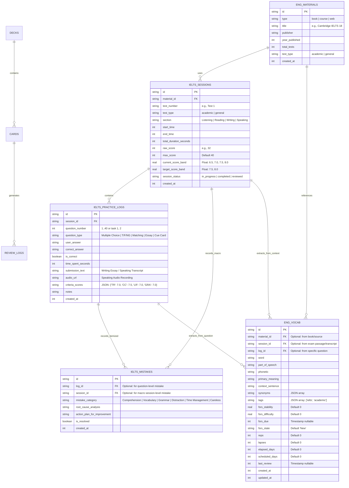

# 🇬🇧 GIAI ĐOẠN 8: HỆ THỐNG THEO DÕI HỌC TẬP TIẾNG ANH & IELTS (ENGLISH STUDY TRACKING ENGINE)

## 📌 1. TẦM NHÌN & KIẾN TRÚC TỔNG THỂ (OVERALL VISION & ARCHITECTURE)

Giai đoạn 8 đánh dấu sự mở rộng hệ thống 記憶道 (Kiokudō) từ một nền tảng chuyên biệt học tiếng Nhật thành một hệ sinh thái học tập đa ngôn ngữ (Polyglot Ecosystem). Mục tiêu của giai đoạn này là xây dựng một module **English Study Tracking** độc lập, chuyên sâu cho việc ôn luyện IELTS, đồng thời giữ vững nguyên tắc **Zero Backend Regression**, đảm bảo tính khả mở (scalability) và khả năng tích hợp trơn tru với thuật toán lặp lại ngắt quãng FSRS.

### 1.1 Mục tiêu thiết kế cốt lõi (Core Design Objectives)
1.  **Độc lập nhưng khả chuyển cao (Independent & Forward-Compatible)**: Module IELTS hoạt động độc lập (theo dõi điểm số, phân tích lỗi sai, bấm giờ làm đề), đồng thời sở hữu cấu trúc dữ liệu tương thích 100% với hệ thống thẻ FSRS hiện có.
2.  **Theo dõi độ phân giải cao đa kỹ năng (Multi-Skill High-Resolution Tracking)**: Không chỉ dừng lại ở trắc nghiệm khách quan (Reading/Listening), mà còn hỗ trợ theo dõi bài viết (Writing Task 1 & 2 với bộ đếm từ trực tiếp) và ghi chú phản tư bài nói (Speaking Transcription & Self-Evaluation).
3.  **Thẩm mỹ học Anh Quốc cổ điển (British Classic Aesthetics)**: Tách biệt hoàn toàn về mặt không gian thị giác: khi vào module tiếng Anh, toàn bộ giao diện chuyển sang phong cách hàn lâm Cambridge/Oxford (màu Oxford Blue `#002147`, Cambridge Blue `#A3C1AD`, Parchment White `#FDFBF7`, typography serif cổ điển và đường viền kép chứng chỉ học thuật).
4.  **Kiến trúc URL-First & Đồng bộ Trạng thái Tuyệt đối**: Chuyển đổi ngữ cảnh thông qua Next.js 15 App Router (`/ielts`, `/ielts/session`, `/ielts/review`) kết hợp Store toàn cục, ngăn chặn triệt để tình trạng lệch pha theme hoặc vỡ mỹ học Wa-Style ở các trang học tiếng Nhật.

---

## 🏛️ 2. THIẾT KẾ CƠ SỞ DỮ LIỆU (DATABASE ERD & SCALABILITY)

### 2.1 Tư duy thiết kế Scalability & Zero Backend Regression
- **Namespace Isolation via Prefixes**: Toàn bộ các bảng mới sử dụng tiền tố `eng_` hoặc `ielts_` (`eng_materials`, `ielts_sessions`, `ielts_practice_logs`, `ielts_mistakes`, `eng_vocab`).
- **Khắc phục lỗi kiểu dữ liệu Band Score**: Điểm IELTS có bước nhảy thập phân 0.5 (ví dụ 6.5, 7.5), do đó `current_score_band` và `target_score_band` bắt buộc phải là kiểu **`REAL`** (số thực), không được dùng `INTEGER`.
- **Phân loại Module thi**: Bổ sung trường `test_type: 'academic' | 'general'` ở cấp độ tài liệu và session để phục vụ chính xác thuật toán quy đổi Band Reading.
- **Tương thích toàn diện FSRS**: Bảng `eng_vocab` được trang bị đầy đủ các trường trạng thái của thuật toán FSRS (`fsrs_stability`, `fsrs_difficulty`, `fsrs_due: timestamp`, `fsrs_state`, `reps`, `lapses`, `elapsed_days`, `scheduled_days`, `last_review`). Khi kích hoạt SRS, dữ liệu có thể dễ dàng chuyển vào bảng `cards` thông qua một bộ thẻ riêng `deck_ielts_vocab` mà không cần sử dụng trigger phức tạp.

### 2.2 Sơ đồ ERD Hoàn Chỉnh (Corrected Mermaid Diagram)

### 2.3 Cấu trúc DDL chi tiết (TypeScript / Drizzle ORM Specification)

Đã được triển khai hoàn chỉnh vào `src/db/schema.ts` và cơ chế khởi tạo cục bộ `src/db/client.ts`:

1.  **`engMaterials`**: Quản lý giáo trình (Cambridge 10-18, Road to IELTS,...), hỗ trợ phân biệt module `academic` và `general`.
2.  **`ieltsSessions`**: Quản lý phiên thi với điểm `rawScore` (0-40) và `currentScoreBand` dạng số thực (`real`) tránh làm tròn sai lệch.
3.  **`ieltsPracticeLogs`**: Lưu trữ câu trả lời, đồng thời mở rộng các cột `submissionText`, `audioUrl`, `criteriaScores` để hỗ trợ kỹ năng Writing và Speaking.
4.  **`ieltsMistakes`**: Cho phép ghi nhận phân tích lỗi ở cả cấp độ vi mô (từng câu thông qua `logId`) và cấp độ vĩ mô (toàn phiên thi thông qua `sessionId`, ví dụ lỗi phân bổ thời gian).
5.  **`engVocab`**: Kho từ vựng trích xuất linh hoạt từ bài đọc, bài nghe hoặc câu hỏi, sở hữu trọn vẹn 9 tham số FSRS.

---

## 🎨 3. MỸ HỌC & TRẢI NGHIỆM NGƯỜI DÙNG (CLASSIC BRITISH AESTHETICS & UX)

### 3.1 Bộ chuyển đổi Ngữ cảnh Toàn cục Đồng bộ URL-First
- Nút bấm `LanguageSwitcher` trên thanh điều hướng nhận diện chính xác `pathname`:
  - Khi đang ở các trang tiếng Nhật (`/`, `/cards`, `/grammar`,...): Hiển thị nhãn `🇯🇵 日本語`. Bấm vào sẽ chuyển hướng sang `/ielts` và kích hoạt theme tiếng Anh.
  - Khi đang ở module IELTS (`/ielts/*`): Hiển thị nhãn `🇬🇧 IELTS Mode`. Bấm vào sẽ đưa người dùng trở về trang chủ tiếng Nhật `/` và gỡ bỏ class `.english-mode`.
- Class `.english-mode` chỉ được kích hoạt khi đang ở route `/ielts/*`, bảo vệ trọn vẹn tính toàn vẹn của mỹ học Wabi-Sabi ở các trang học tiếng Nhật.

### 3.2 Hệ thống Token Thiết kế Anh Quốc (British Design Tokens)
*   **Typography**:
    *   *Headings*: `Playfair Display` hoặc `Crimson Text` (Serif cổ điển, tạo cảm giác như trang sách đại học Oxford/Cambridge).
    *   *Body/UI*: `Inter` hoặc `Roboto` (Sans-serif sạch sẽ, hiện đại để dễ đọc dữ liệu tracking và bảng biểu).
*   **Bảng màu (Royal Academic Palette)**:
    *   `Oxford Blue`: `#002147` (Primary - Màu chủ đạo cho Navbar, nút bấm chính).
    *   `Cambridge Blue`: `#A3C1AD` (Secondary / Accent - Dùng cho các thành phần highlight, tiến độ).
    *   `Crimson Red`: `#990000` (Error / Mistakes - Dùng để highlight lỗi sai hoặc cảnh báo điểm thấp).
    *   `Parchment White`: `#FDFBF7` (Background - Màu nền tựa như giấy da cừu cũ, cổ kính).
    *   `Tweed Gray`: `#4A4A4A` (Text - Màu chữ chính).
*   **Họa tiết & Khung viền**:
    *   Đường viền kép học thuật (`british-border: 3px double var(--primary-color)`).
    *   Họa tiết Tartan mờ nhẹ 5% (`tartan-bg`).

### 3.3 Ba Màn Hình Trọng Tâm Đã Triển Khai
1.  **Dashboard (The Study - `/ielts`)**:
    *   Hiển thị KPI mục tiêu Band điểm và điểm hiện tại dạng số thực (`7.0`, `8.0`).
    *   Thanh tiến độ 4 kỹ năng Listening, Reading, Writing, Speaking.
    *   Bảng phân tích tỷ lệ lỗi sai theo Cây Phân loại Lỗi (Mistake Taxonomy).
    *   Lịch sử các phiên thi gần nhất.
2.  **Session Tracker (The Examination Room - `/ielts/session`)**:
    *   Đồng hồ đếm ngược tương tác (Interactive Countdown Timer) tự động thay đổi thời lượng theo kỹ năng:
        *   **Reading**: 60 phút
        *   **Writing**: 60 phút (Kèm khung soạn thảo Task 1 & Task 2 có bộ đếm từ thời gian thực)
        *   **Listening**: 35 phút
        *   **Speaking**: 15 phút
    *   Phiếu điền đáp án nhanh (Quick Answer Grid) 40 câu có các nút bấm nhanh: `T`, `F`, `NG` và `A`, `B`, `C`, `D`.
    *   Cơ chế **Auto-save / Draft Persistence** qua `localStorage`: bảo toàn dữ liệu bài làm và đồng hồ khi người dùng tải lại trang (F5).
3.  **Review & Analysis (The Tutor's Desk - `/ielts/review`)**:
    *   Thuật toán tính toán Band điểm tự động theo bảng chuẩn Cambridge.
    *   Hộp thoại **Analyze Mistake** với đầy đủ 6 phân loại nguyên nhân, Root Cause Analysis và Action Plan.
    *   Kho từ vựng **Vocabulary Vault** cho phép trích xuất từ mới kèm phiên âm, từ loại và câu ngữ cảnh.

---

## ⚙️ 4. LOGIC NGHIỆP VỤ & THUẬT TOÁN (BUSINESS LOGIC ENGINE)

### 4.1 Thuật toán Quy đổi Điểm thô sang Band IELTS (Conversion Engine)
Quy chuẩn số câu đúng (Raw Score) / 40 sang Band điểm 0.0 - 9.0:

| Raw Score (trên 40 câu) | Listening Band | Reading Academic Band | Reading General Band |
| :---: | :---: | :---: | :---: |
| **39 - 40** | **9.0** | **9.0** | **9.0** (40) / **8.5** (39) |
| **37 - 38** | **8.5** | **8.5** | **8.0** |
| **35 - 36** | **8.0** | **8.0** | **7.5** (36) / **7.0** (34-35) |
| **32 - 34** | **7.5** (32-34) | **7.5** (33-34) | **6.5** (32-33) |
| **30 - 31** | **7.0** | **7.0** (30-32) | **6.0** (30-31) |
| **26 - 29** | **6.5** | **6.5** (27-29) | **5.5** (27-29) |
| **23 - 25** | **6.0** | **6.0** (23-26) | **5.0** (23-26) |
| **18 - 22** | **5.5** | **5.5** (19-22) | **4.5** (19-22) |
| **16 - 17** | **5.0** | **5.0** (15-18) | **4.0** (15-18) |

### 4.2 Cây Phân loại Lỗi Sai Chuẩn Hóa (Standardized Mistake Taxonomy)
Chuẩn hóa 6 danh mục lỗi giúp tổng hợp thống kê chính xác:
1.  **`Comprehension`**: Đọc không hiểu cấu trúc câu phức, nghe không bắt kịp tốc độ audio.
2.  **`Vocabulary`**: Không nhận biết từ đồng nghĩa (paraphrase) hoặc hiểu sai ngữ nghĩa từ vựng.
3.  **`Grammar`**: Sai cấu trúc thì, chia động từ, trật tự từ hoặc liên từ đối lập.
4.  **`Distraction`**: Sập bẫy thông tin gây nhiễu của đề thi (thông tin xuất hiện trong bài nhưng bị phủ định ngay sau đó).
5.  **`Time Management`**: Thiếu thời gian làm bài, phân bổ thời lượng không hợp lý dẫn đến làm vội ở các đoạn cuối.
6.  **`Careless`**: Viết sai chính tả, vượt quá số từ quy định (`NO MORE THAN TWO WORDS`), điền nhầm hàng.

### 4.3 Kiến trúc Khả mở Tích hợp FSRS (Safe FSRS Bridge Architecture)
Thay vì sử dụng SQLite Trigger hai chiều phức tạp gây rủi ro phá vỡ nguyên tắc Zero Backend Regression:
1.  Toàn bộ từ vựng lưu trữ trong `eng_vocab` đã có đầy đủ 9 trường FSRS tương thích với bảng `cards`.
2.  Khi người dùng bật tính năng ôn tập từ vựng tiếng Anh qua SRS:
    *   Hệ thống khởi tạo bộ thẻ `deck_ielts_vocab` trong bảng `decks`.
    *   Một tiến trình một chiều an toàn (Safe One-Way Migration / View Projector) sẽ ánh xạ các từ từ `eng_vocab` vào `cards` thuộc `deck_ielts_vocab`.
    *   Người dùng có thể tận dụng ngay lập tức toàn bộ hệ thống ôn tập Karuta và thuật toán FSRS sẵn có mà không gây ảnh hưởng đến 111 bài kiểm thử hiện hành.

---

## 🚀 5. TIẾN ĐỘ THỰC HIỆN (EXECUTION STATUS)

- [x] **Bước 1**: Thiết lập State Management toàn cục (`useLanguageStore`) đồng bộ router Next.js 15.
- [x] **Bước 2**: Khởi tạo và sửa đổi DDL Database trong `src/db/schema.ts` & `src/db/client.ts` (Band score kiểu `real`, hỗ trợ `testType`, `criteriaScores`, FSRS parameters).
- [x] **Bước 3**: Xây dựng bộ Token CSS Variables và class `.english-mode` trong `src/app/globals.css`.
- [x] **Bước 4**: Tối ưu hóa `LanguageSwitcher` và điều hướng URL-first, ngăn ngừa xung đột giao diện.
- [x] **Bước 5**: Triển khai `IeltsSessionTracker` với đồng hồ thông minh theo kỹ năng, Answer Grid linh hoạt và LocalStorage draft auto-save.
- [x] **Bước 6**: Triển khai `IeltsReviewDesk` với bộ tính điểm Cambridge chính xác, modal phân tích lỗi chuẩn 6 danh mục và kho lưu trữ từ vựng.
- [x] **Bước 7**: Kiểm thử toàn diện test suite của dự án (Đạt 100% 21/21 test files, 111/111 tests).
