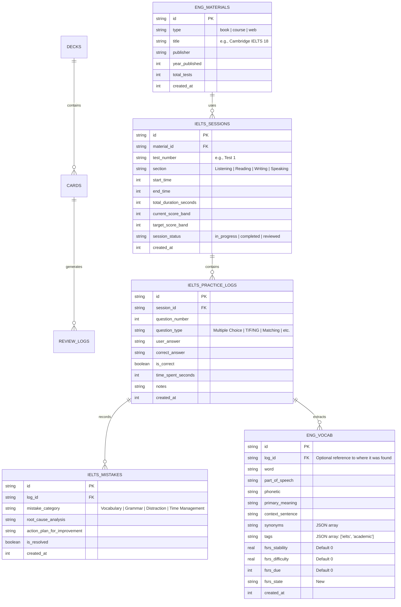

# 🇬🇧 GIAI ĐOẠN 8: HỆ THỐNG THEO DÕI HỌC TẬP TIẾNG ANH & IELTS (ENGLISH STUDY TRACKING ENGINE)

## 📌 1. TẦM NHÌN & KIẾN TRÚC TỔNG THỂ (OVERALL VISION & ARCHITECTURE)

Giai đoạn 8 đánh dấu sự mở rộng hệ thống 記憶道 (Kiokudō) từ một nền tảng chuyên biệt học tiếng Nhật thành một hệ sinh thái học tập đa ngôn ngữ (Polyglot Ecosystem). Mục tiêu của giai đoạn này là xây dựng một module **English Study Tracking** độc lập, chuyên sâu cho việc ôn luyện IELTS, nhưng vẫn giữ được khả năng kết nối (scalability) và mở rộng linh hoạt với hệ thống FSRS SRS trong tương lai.

### 1.1 Mục tiêu thiết kế cốt lõi (Core Design Objectives)
1.  **Độc lập nhưng có thể tương tác (Independent yet Interoperable)**: Hệ thống tiếng Anh hoạt động độc lập (không cần thiết phải chạy SRS ngay lúc này), nhưng schema database được thiết kế để có thể dễ dàng chuyển đổi hoặc đồng bộ sang hệ thống thẻ FSRS nếu người dùng có nhu cầu trong tương lai.
2.  **Theo dõi độ phân giải cao (High-Resolution Tracking)**: Ghi nhận chi tiết từng session học, từng lesson, từng câu hỏi (Cambridge IELTS), phân loại lỗi sai (Mistake Taxonomy) và đo lường sự tiến bộ (Improvement Metrics).
3.  **Thẩm mỹ học Anh Quốc cổ điển (British Classic Aesthetics)**: Nếu như module tiếng Nhật mang đậm tinh thần Wabi-Sabi và Wa-style (Nippon Colors), thì module tiếng Anh sẽ được thiết kế với ngôn ngữ hình ảnh "Classic British/Cambridge", sử dụng typography serif truyền thống, màu sắc hoàng gia (Royal Blue, Crimson, Forest Green), và các họa tiết hàn lâm.
4.  **Kiến trúc mở rộng (Scalable Architecture)**: Thiết kế ERD dự phòng cho các Use Case tương lai như: so sánh song ngữ (Cross-language references), hoặc tích hợp AI chấm điểm Writing/Speaking.

---

## 🏛️ 2. THIẾT KẾ CƠ SỞ DỮ LIỆU (DATABASE ERD & SCALABILITY)

### 2.1 Tư duy thiết kế Scalability
Để đảm bảo khả năng mở rộng, chúng ta áp dụng mẫu thiết kế **"Namespace Isolation via Prefixes"** thay vì tạo ra một cơ sở dữ liệu vật lý mới. Tất cả các bảng liên quan đến hệ thống tiếng Anh sẽ có tiền tố `eng_` hoặc `ielts_`.

Hơn nữa, bảng `eng_vocab` được thiết kế với cấu trúc tương tự bảng `cards`, bao gồm các trường chuẩn bị sẵn cho SRS (`due`, `stability`, `difficulty`, `state`), mặc dù chúng có thể được bỏ trống hoặc đặt giá trị mặc định trong giai đoạn đầu. Điều này cho phép một script migration đơn giản trong tương lai có thể chuyển (hoặc chiếu) dữ liệu `eng_vocab` vào bảng `cards` chính thức nếu cần chạy FSRS.

### 2.2 Sơ đồ ERD (Mermaid Diagram)

### 2.3 Cấu trúc DDL chi tiết (TypeScript / Drizzle ORM Plan)

Khi triển khai vào `src/db/schema.ts`, chúng ta sẽ thêm các bảng sau. Lưu ý các trường FSRS tương thích chéo:

1.  **`eng_materials`**: Lưu trữ danh mục sách/tài liệu (vd: Cambridge 11-18, Road to IELTS).
2.  **`ielts_sessions`**: Lõi của hệ thống tracking. Mỗi khi user ngồi xuống giải 1 đề Reading hay Listening, một session được tạo. Lưu trữ thời gian bắt đầu, kết thúc, band điểm đạt được so với mục tiêu.
3.  **`ielts_practice_logs`**: Chi tiết đến độ phân giải từng câu hỏi (High-Resolution Tracking). Lưu trữ câu trả lời của user, đáp án đúng, và thời gian tiêu tốn cho câu đó (giúp phát hiện nút thắt thời gian).
4.  **`ielts_mistakes`**: Phân tích lỗi sai sâu sắc. Không chỉ ghi "sai", mà yêu cầu user nhập "Tại sao sai?" (Root Cause) và "Làm sao để sửa?" (Action Plan). Đây là nền tảng của *Deliberate Practice*.
5.  **`eng_vocab`**: Kho từ vựng trích xuất từ các bài đọc/nghe. Bảng này sở hữu các cột `fsrs_stability`, `fsrs_difficulty`, `fsrs_due`, `fsrs_state` để sẵn sàng biến thành Flashcards khi user bật tính năng SRS cho tiếng Anh.

---

## 🎨 3. MỸ HỌC & TRẢI NGHIỆM NGƯỜI DÙNG (CLASSIC BRITISH AESTHETICS & UX)

### 3.1 Bộ chuyển đổi Ngữ cảnh Toàn cục (Global Language Switcher)
Chúng ta sẽ triển khai một `Context Switcher` ở cấp độ Root Layout (NavBar/Header).
-   **Trạng thái 1: 🇯🇵 Japanese Mode (Kiokudō)**: Sử dụng Theme hiện tại (Wabi-Sabi, Nippon Colors, Sakura, Kirie Shadow).
-   **Trạng thái 2: 🇬🇧 English Mode (Cambridge / IELTS)**: Ngay khi switch, toàn bộ CSS Variables toàn cục sẽ thay đổi (Theme Swapping).

### 3.2 Hệ thống Token Thiết kế Anh Quốc (British Design Tokens)
Để mang lại cảm giác hàn lâm, cổ điển và trang trọng (Academic & Classic), UI của tab Tiếng Anh sẽ sử dụng bộ màu sắc và typography riêng:

*   **Typography**:
    *   *Headings*: `Playfair Display` hoặc `Crimson Text` (Serif cổ điển, tạo cảm giác như trang sách đại học Oxford/Cambridge).
    *   *Body/UI*: `Inter` hoặc `Roboto` (Sans-serif sạch sẽ, hiện đại để dễ đọc dữ liệu tracking và bảng biểu).
*   **Bảng màu (Royal Color Palette)**:
    *   `Oxford Blue`: `#002147` (Primary - Màu chủ đạo cho Navbar, nút bấm chính).
    *   `Cambridge Blue`: `#A3C1AD` (Secondary / Accent - Dùng cho các thành phần highlight, tiến độ).
    *   `Crimson Red`: `#990000` (Error / Mistakes - Dùng để highlight lỗi sai hoặc cảnh báo điểm thấp).
    *   `Parchment White`: `#FDFBF7` (Background - Màu nền tựa như giấy da cừu cũ, cổ kính).
    *   `Tweed Gray`: `#4A4A4A` (Text - Màu chữ chính).
*   **Họa tiết & Đồ họa (Motifs & Graphics)**:
    *   Thay thế các họa tiết Wagara (Nhật) bằng các họa tiết *Tartan* (Sọc caro Scotland) với độ mờ 5%, hoặc *Damask* (Hoa văn dệt) tinh tế ở background.
    *   Sử dụng các đường viền kép (Double-line borders) hoặc viền khung kiểu chứng chỉ học thuật.

### 3.3 Giao diện Người dùng Cốt lõi (Core Views)

1.  **Dashboard (The Study)**:
    *   Biểu đồ đường (Line chart) hiển thị sự tiến bộ của Band điểm (Overall, Reading, Listening) qua thời gian.
    *   Heatmap hiển thị tần suất luyện tập.
    *   Widget "Recent Mistakes" - Hiển thị các lỗi sai gần nhất cần ôn lại.
2.  **Session Tracker (The Examination Room)**:
    *   Giao diện bấm giờ (Timer) đếm ngược 60 phút kiểu dáng đồng hồ cổ (Antique pocket watch logic).
    *   Bảng điền đáp án nhanh (Quick Answer Grid) mô phỏng phiếu điền đáp án (Answer Sheet).
3.  **Review & Analysis (The Tutor's Desk)**:
    *   Sau khi kết thúc Session, người dùng vào trang này để đối chiếu đáp án.
    *   Tại mỗi câu sai, bấm nút "Analyze Mistake" để mở Modal nhập lý do sai (Grammar, Vocab, Distraction,...).
    *   Highlight từ mới và bấm "Add to Vocab" để ném thẳng vào bảng `eng_vocab`.

---

## ⚙️ 4. LOGIC NGHIỆP VỤ & ĐỘ PHỨC TẠP (BUSINESS LOGIC & COMPLEXITY)

### 4.1 Khai thác dữ liệu & Điểm chuẩn hóa (Scoring Engine)
-   Hệ thống cần tích hợp một thuật toán chuyển đổi (Conversion Algorithm) tự động dịch từ số câu đúng (Raw Score) sang Band điểm IELTS (0 - 9.0).
-   *Độ phức tạp*: Bảng điểm Reading Academic khác với Reading General. Listening thì giống nhau. Database `ielts_sessions` phải ghi nhận loại bài thi để áp dụng thuật toán tính Band cho chuẩn xác.

### 4.2 Cây Phân loại Lỗi Sai (Mistake Taxonomy Tree)
Việc theo dõi lỗi sai không thể là string tự do (Free-text), mà cần được chuẩn hóa để vẽ biểu đồ phân tích.
*   **Level 1 Category**:
    *   `Comprehension` (Đọc không hiểu / Nghe không ra).
    *   `Vocabulary` (Không biết từ khóa).
    *   `Distraction` (Sập bẫy của đề thi).
    *   `Time Management` (Thiếu thời gian làm bài).
    *   `Careless` (Sai chính tả, điền nhầm chỗ).
*   *Phân tích dữ liệu*: Dashboard sẽ tổng hợp dữ liệu này (SQL `GROUP BY`) để chỉ ra điểm yếu chí mạng của user (ví dụ: "70% lỗi của bạn đến từ việc Sập bẫy Distraction ở phần Multiple Choice").

### 4.3 Khả năng mở rộng tới FSRS (FSRS Bridge Pipeline)
Khi User quyết định muốn ôn tập từ vựng tiếng Anh bằng hệ thống FSRS hiện có:
-   Tạo một nút "Enable SRS for English".
-   Hệ thống sẽ chạy một script tạo một Deck mới mang tên "English Master Deck" trong bảng `decks`.
-   Sau đó, hệ thống ánh xạ các bản ghi từ `eng_vocab` vào `cards`, liên kết khóa ngoại tới `deck_id` của "English Master Deck".
-   *Thiết kế tương lai*: Xây dựng một Trigger hoặc View trong SQLite để đồng bộ hóa 2 chiều giữa `eng_vocab` và `cards` nếu hệ thống thực sự hợp nhất.

---

## 🚀 5. LỘ TRÌNH TRIỂN KHAI (IMPLEMENTATION ROADMAP)

- [ ] **Bước 1**: Thiết lập State Management toàn cục (Zustand/Context API) cho biến `AppLanguageMode: 'ja' | 'en'`.
- [ ] **Bước 2**: Khởi tạo cấu trúc bảng Database DDL mới vào `src/db/schema.ts` theo đúng sơ đồ Mermaid.
- [ ] **Bước 3**: Xây dựng bộ Token CSS Variables toàn cục cho Theme "Classic British".
- [ ] **Bước 4**: Tạo Layout Navigation Switcher (Chuyển đổi giao diện mà không load lại trang, dựa vào App Router Next.js 15).
- [ ] **Bước 5**: Xây dựng API Routes (Turso/Drizzle) để tạo Session, lưu Practice Logs và cập nhật Band Scores.
- [ ] **Bước 6**: Triển khai các màn hình UI: Dashboard tiếng Anh, Session Tracker, và Post-Exam Analysis Desk.
