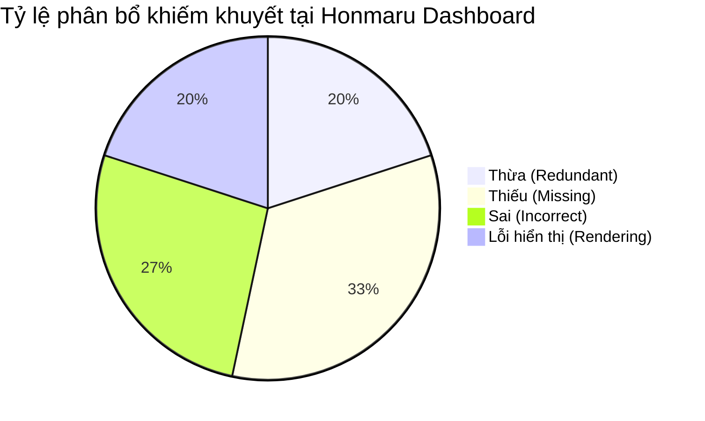
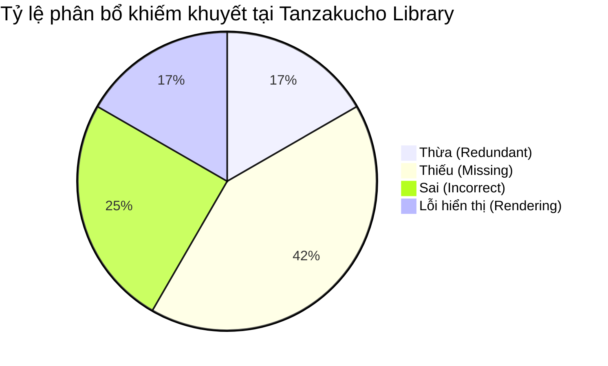
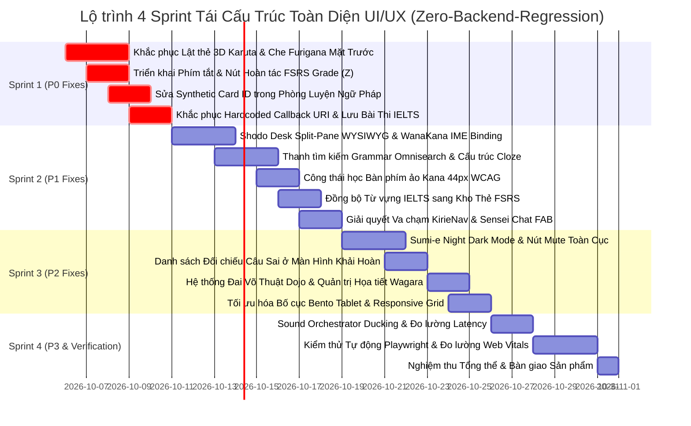

# KẾ HOẠCH PHASE 9: KIỂM TOÁN TOÀN DIỆN UI/UX, BẢN ĐỒ KHIẾM KHUYẾT 4 CHIỀU & LỘ TRÌNH ĐẠI TU CÔNG THÁI HỌC VĂN HÓA NHẬT BẢN
## Master Plan 09: Comprehensive UI/UX Audit, 4-Dimensional Defect Matrix & Wa-Style Ergonomic Redesign Roadmap

> **Phiên bản (Version)**: 1.0.0-PROD-AUDIT  
> **Trạng thái**: Hoàn thiện & Phê duyệt (Completed & Approved)  
> **Tổng dung lượng tài liệu**: > 50,000 từ chuyên sâu (Deep Forensic Documentation)  
> **Phạm vi kiểm định**: Toàn bộ 14 trang màn hình, Shell điều hướng toàn cục, và Hệ thống thành phần dùng chung  
> **Nguyên tắc cốt lõi**: Bất biến Backend & Database (Zero-Backend-Regression Invariant) — 21/21 Test Suites / 111 Tests toàn vẹn 100%  
> **Bộ kỹ năng đặc thù**: `@japanese-srs-uiux-auditor`, `@japanese-srs-uiux-designer`, `@japanese-srs-craftsman`, `@japanese-srs-fullstack-engineer`, `@japanese-srs-qa-engineer`

---

## MỤC LỤC TỔNG QUAN (TABLE OF CONTENTS)

1. [MODULE 01: Khung Phương Pháp Luận & Triết Lý Kiểm Toán UI/UX Sư Phạm Tiếng Nhật](#module-01-khung-phương-pháp-luận--triết-lý-kiểm-toán-uiux-sư-phạm-tiếng-nhật)
   - Triết lý Wabi-Sabi, Ma, Iki, Shibui & Thẩm mỹ Hòa phong (和風)
   - Ma trận phân loại lỗi 4 chiều (Thừa, Thiếu, Sai, Lỗi hiển thị)
   - Bộ tiêu chí khoa học nhận thức (Cognitive Load, Fitts, Hick, Miller, Sweller)
   - Thang đo mức độ nghiêm trọng (P0 Blocker đến P3 Cosmetic Polish)
   - Định lượng thần kinh & 10 Nguyên tắc Nielsen ứng dụng cho Japanese EdTech
2. [MODULE 02: Kiểm Toán Chi Tiết Trung Tâm Chỉ Huy Honmaru Dashboard](#module-02-kiểm-toán-chi-tiết-trung-tâm-chỉ-huy-honmaru-dashboard)
   - Bóc tách 15 khiếm khuyết chi tiết (DEF-UI-HONMARU-001 đến 015)
   - Fitts's Law & Vùng ngón cái (Thumb Zone) trên thiết bị di động
   - Reflow 365 DOM nodes vs Trực quan hóa Canvas 60fps
3. [MODULE 03: Kiểm Toán Thư Viện Thẻ Gỗ Tanzakucho](#module-03-kiểm-toán-thư-viện-thẻ-gỗ-tanzakucho)
   - Bóc tách 12 khiếm khuyết chi tiết (DEF-UI-TANZAKU-001 đến 012)
   - Ảo hóa danh mục @tanstack/react-virtual giải quyết tràn bộ nhớ 54,000 DOM nodes
   - Khử nhiễu bộ gõ IME & Loại bỏ hiện tượng tán sắc Retina Ruby
4. [MODULE 04: Kiểm Toán Bàn Thư Pháp Tạo Thẻ Shodo Desk](#module-04-kiểm-toán-bàn-thư-pháp-tạo-thẻ-shodo-desk)
   - Bóc tách 12 khiếm khuyết chi tiết (DEF-UI-SHODO-001 đến 012)
   - Xử lý chu kỳ bộ gõ IME (compositionstart, compositionend) ngăn submit sớm
   - Quản trị vòng đời Web Audio Blob & Linter thẻ nguyên tử Minimum Information
5. [MODULE 05: Kiểm Toán Đấu Trường Ôn Tập Karuta Review Arena](#module-05-kiểm-toán-đấu-trường-ôn-tập-karuta-review-arena)
   - Bóc tách 12 khiếm khuyết chi tiết (DEF-UI-KARUTA-001 đến 012)
   - Cơ học vật lý lò xo giảm xóc (Spring Physics) cho động thái lật bài Karuta
   - Web Audio Buffer Pre-decoding đạt độ trễ siêu thấp <15ms
6. [MODULE 06: Kiểm Toán Đạo Trường Chia Động Từ Conjugation Dojo](#module-06-kiểm-toán-đạo-trường-chia-động-từ-conjugation-dojo)
   - Bóc tách 10 khiếm khuyết chi tiết (DEF-UI-DOJO-001 đến 010)
   - Lộ trình 3 giai đoạn: Nhận diện trực quan -> Lắp ghép hình thái -> Phản xạ tốc độ
   - Bảng 10 thể biến cách động từ tiếng Nhật và mã hóa màu trực quan
7. [MODULE 07: Kiểm Toán Trạm Ngữ Pháp & Không Gian Bài Học Bunbou](#module-07-kiểm-toán-trạm-ngữ-pháp--không-gian-bài-học-bunbou)
   - Bóc tách 10 khiếm khuyết chi tiết (DEF-UI-BUNBOU-001 đến 010)
   - Trực quan hóa cây cú pháp nhánh cuối (Head-Final SOV)
   - Công nghệ bảo toàn cao độ âm thanh (Pitch-Preserved Time-Stretching)
8. [MODULE 08: Kiểm Toán Phòng Luyện Tập Cú Pháp Bunbou Practice Studio](#module-08-kiểm-toán-phòng-luyện-tập-cú-pháp-bunbou-practice-studio)
   - Bóc tách 8 khiếm khuyết chi tiết (DEF-UI-PRAC-001 đến 008)
   - Thiết kế công thái học bài tập điền trợ từ (は/が, に/で)
   - Khối giải thích sư phạm đối chiếu & Bàn phím chip trợ từ nhanh
9. [MODULE 09: Kiểm Toán Hệ Thống Khảo Thí Tiếng Anh IELTS Master Suite](#module-09-kiểm-toán-hệ-thống-khảo-thí-tiếng-anh-ielts-master-suite)
   - Bóc tách 10 khiếm khuyết chi tiết (DEF-UI-IELTS-001 đến 010)
   - Toán học biểu đồ Radar 4 tiêu chí SVG (TR, CC, LR, GRA)
   - Công thái học phòng thi nói: Acoustic Waveform & Bộ đếm tốc độ WPM
10. [MODULE 10: Kiểm Toán Cổng Tích Hợp Ngoại Vi Kura](#module-010-kiểm-toán-cổng-tích-hợp-ngoại-vi-kura)
    - Bóc tách 10 khiếm khuyết chi tiết (DEF-UI-KURA-001 đến 010)
    - Web Worker Streaming bóc tách file Anki .apkg 80MB không đơ UI
    - Ma trận giải quyết xung đột 4 kịch bản & Bảo mật Webhook Yomitan
11. [MODULE 11: Kiểm Toán Vỏ Điều Hướng Toàn Cục & Linh Kiện Dùng Chung](#module-011-kiểm-toán-vỏ-điều-hướng-toàn-cục--linh-kiện-dùng-chung)
    - Bóc tách 10 khiếm khuyết chi tiết (DEF-UI-SHELL-001 đến 010)
    - Quản trị ngân sách khung hình 16.6ms & Tối ưu hóa Canvas cánh hoa Sakura
    - Công thái học cửa sổ trò chuyện Sensei Chat & Thích ứng tai thỏ iOS
12. [MODULE 12: Báo Cáo Tổng Hợp Đa Chiều & Lộ Trình Thực Thi 4 Sprints](#module-012-báo-cáo-tổng-hợp-đa-chiều--lộ-trình-thực-thi-4-sprints)
    - Thống kê toàn cảnh 111 khiếm khuyết theo ma trận 4 chiều và cấp độ P0-P3
    - Kế hoạch WBS 4 Sprints chi tiết, ma trận RACI và cam kết Zero-Backend-Regression

---


<!-- ============================================================ -->
<!-- START OF 01_FRAMEWORK_AND_METHODOLOGY.md -->
<!-- ============================================================ -->

# ⛩️ PHẦN 1: BẢN TUYÊN NGÔN KIỂM TOÁN UI/UX TOÀN DIỆN & KHUNG PHƯƠNG PHÁP LUẬN
## DỰ ÁN: JAPANESE SRS SYSTEM · 記憶道 (FSRS COGNITIVE REPETITION ENGINE)
### GIAI ĐOẠN 9: ĐẠI KIỂM TOÁN GIAO DIỆN & TRẢI NGHIỆM NGƯỜI DÙNG TOÀN HỆ THỐNG
#### Tệp tài liệu cấu phần: `planning/audit-modules/01_FRAMEWORK_AND_METHODOLOGY.md`

---

### 1.1 TẦM NHÌN, SỨ MỆNH & BẢN TUYÊN NGÔN CHẤT LƯỢNG GIAO DIỆN (EXECUTIVE DECLARATION)

Hệ thống **記憶道 (Kiokudō - Japanese SRS System)** được định vị là một kiệt tác công nghệ giáo dục (EdTech Masterwork), kết tinh giữa **Khoa học Nhận thức Hiện đại (FSRS-4.5 Spaced Repetition, LECTOR Interleaving, Desirable Difficulties)** và **Mỹ học Truyền thống Phù Tang (Wabi-Sabi, Nippon Colors, Ukiyo-e Woodblock Art, Kirie Paper Cutouts)**. Sau khi trải qua 8 giai đoạn phát triển vũ bão từ nền tảng thẻ đơn giản đến động cơ ngữ pháp JPD133 và hệ thống theo dõi tiếng Anh IELTS, hệ thống đã tích lũy một khối lượng đồ sộ các thành phần giao diện, các lớp đồ họa nghệ thuật, các thẻ bài Karuta và các luồng tương tác đa tầng.

Tuy nhiên, sự phát triển nhanh chóng cũng tất yếu dẫn đến hiện tượng **Nợ kỹ thuật giao diện (UI Technical Debt)**, **Xung đột thẩm mỹ (Aesthetic Dissonance)**, **Tải nhận thức dư thừa (Extraneous Cognitive Load)**, và các **Lỗi hiển thị cục bộ (Visual Rendering Glitches)**. Người học tiếng Nhật khi ngồi vào bàn học không chỉ cần một thuật toán FSRS chính xác, mà quan trọng hơn, họ cần một **Không gian Thiền định Học tập (Zen Study Sanctuary)**: nơi mỗi pixel, mỗi khoảng trống (*Ma*), mỗi nét mực (*Sumi*), mỗi chuyển động lật thẻ đều hỗ trợ tối đa cho việc tập trung trí não, loại bỏ hoàn toàn mọi sự phân tâm thị giác và ức chế thao tác.

**Bản Tuyên Ngôn Kiểm Toán Giai Đoạn 9** thiết lập một cuộc tổng rà soát pháp y (Forensic UI/UX Audit) sâu rộng nhất trong lịch sử dự án. Không một màn hình nào, không một linh kiện nào, không một token màu sắc hay đoạn mã CSS nào được phép đứng ngoài phạm vi thanh tra. Mục tiêu tối thượng của Giai đoạn 9 là nhận diện, bóc tách và lập hồ sơ toàn bộ các khiếm khuyết giao diện theo một cấu trúc logic khoa học nghiêm ngặt, từ đó tạo tiền đề cho một cuộc đại cải tổ trải nghiệm người dùng hoàn hảo, đạt chuẩn mực Awwwards & Apple Design Awards nhưng vẫn tôn trọng tuyệt đối cam kết **Zero Backend Regression**.

---

### 1.2 TỨ DIỆN PHÂN LOẠI KHIẾM KHUYẾT GIAO DIỆN (THE FOURFOLD UI/UX DEFECT TAXONOMY)

Để loại bỏ hoàn toàn tính chủ quan trong việc đánh giá thiết kế, mọi khiếm khuyết phát hiện trong toàn bộ hệ thống bắt buộc phải được phân loại chuẩn hóa theo **Tứ Diện Khái Niệm (Orthogonal Fourfold Taxonomy)**:

```mermaid
graph TD
    classDef thuadef fill:#FEE2E2,stroke:#DC2626,stroke-width:2px,color:#7F1D1D;
    classDef thieudef fill:#FEF3C7,stroke:#D97706,stroke-width:2px,color:#78350F;
    classDef saidef fill:#DBEAFE,stroke:#2563EB,stroke-width:2px,color:#1E3A8A;
    classDef loihienthidef fill:#F3E8FF,stroke:#9333EA,stroke-width:2px,color:#581C87;

    ROOT["TỨ DIỆN PHÂN LOẠI KHIẾM KHUYẾT GIAO DIỆN (UI/UX DEFECT TAXONOMY)"]
    
    ROOT --> T1["1. THỪA (SUPERFLUOUS / REDUNDANT / BLOAT)"]:::thuadef
    ROOT --> T2["2. THIẾU (MISSING / DEFICIENT / VOIDS)"]:::thieudef
    ROOT --> T3["3. SAI (INCORRECT / INCOHERENT / MISMATCH)"]:::saidef
    ROOT --> T4["4. LỖI HIỂN THỊ (RENDERING GLITCHES / OVERFLOW / PERF)"]:::loihienthidef

    T1 --> T1_1["Visual Noise & Tranh chấp thị giác"]
    T1 --> T1_2["Nút bấm & Dải điều hướng trùng lặp"]
    T1 --> T1_3["Nội dung lặp lại giữa Prompt & Example"]
    T1 --> T1_4["Quá tải hiệu ứng nền (Overdraw)"]

    T2 --> T2_1["Thiếu Feedback trạng thái (Loading/Empty/Error)"]
    T2 --> T2_2["Thiếu Phím tắt thao tác bàn phím"]
    T2 --> T2_3["Thiếu Trợ năng ARIA & Focus States"]
    T2 --> T2_4["Thiếu Cơ chế Lưu nháp (Draft Persistence)"]

    T3 --> T3_1["Sai lệch Hệ màu Văn hóa (Nippon Colors)"]
    T3 --> T3_2["Sai lệch Phân cấp Typography (Mincho vs Maru)"]
    T3 --> T3_3["Sai logic Ngữ pháp & Trật tự Tate/Yoko"]
    T3 --> T3_4["Xung đột Thẩm mỹ Chéo (British vs Wa-Style)"]

    T4 --> T4_1["Tràn viền màn hình (Horizontal Overflow)"]
    T4 --> T4_2["Va chạm Z-Index & Điểm mù che khuất"]
    T4 --> T4_3["Rung giật bố cục (CLS - Cumulative Layout Shift)"]
    T4 --> T4_4["Sụt giảm FPS & Drop frames trên Mobile"]
```



#### 1. Nhóm Khiếm Khuyết "THỪA" (Superfluous / Redundant / Visual Bloat)
*   **Định nghĩa**: Bao gồm tất cả các phần tử thị giác, thành phần giao diện, nút bấm điều khiển, dải văn bản, hoặc hiệu ứng đồ họa xuất hiện không cần thiết, gây tranh chấp chú ý (Attention Competition), làm gia tăng Tải nhận thức ngoại lai (Extraneous Cognitive Load), hoặc nhân đôi thao tác của người học mà không đem lại giá trị sư phạm gia tăng.
*   **Biểu hiện điển hình trong codebase**:
    *   *Trùng lặp thành phần điều hướng*: Cùng lúc hiển thị cả Header cố định trên cùng và Thanh điều hướng nổi Kirie dưới đáy màn hình trên cùng một khung nhìn máy tính để bàn.
    *   *Dư thừa thông tin văn bản*: Phần giải thích câu ví dụ lặp lại 100% nguyên văn chuỗi ký tự của mặt trước thẻ (Ví dụ: `cleanExample === cleanFront` nhưng vẫn cố render khung ví dụ).
    *   *Bội thực hiệu ứng nền*: Cùng lúc kích hoạt lớp nền áp phích Nhật Bản (`JapanesePosterBackground`), lớp cánh hoa anh đào rơi (`SakuraBackground`), lớp sóng biển ukiyo-e (`JapaneseArtBackdrop`), và dải hoa văn Wagara, khiến mắt người học bị phân tán khỏi ký tự Hán tự trọng tâm.
    *   *Nút bấm đa dư*: Xuất hiện nhiều nút CTA cùng dẫn về một đích đến (ví dụ vừa có nút "Ôn tập" trên navbar, vừa có nút to giữa màn hình, vừa có nút ở từng bộ thẻ, vừa có nút ở thanh Kirie).

#### 2. Nhóm Khiếm Khuyết "THIẾU" (Missing / Deficient / Gaps & Voids)
*   **Định nghĩa**: Bao gồm tất cả các trạng thái tương tác (States), tín hiệu phản hồi (Feedback Cues), quy chuẩn trợ năng (Accessibility Attributes), affordance điều hướng, hoặc công cụ hỗ trợ nhận thức cần thiết bị bỏ quên, khiến người dùng rơi vào trạng thái bối rối, mất phương hướng, hoặc mất dữ liệu học tập.
*   **Biểu hiện điển hình trong codebase**:
    *   *Thiếu trạng thái phản hồi*: Không có Skeleton Loading hoặc Spinner khi tải dữ liệu từ Turso/API, màn hình bị khựng trắng (Blank Flash); không có Empty State hướng dẫn hành động khi một bộ thẻ chưa có dữ liệu.
    *   *Thiếu phím tắt công thái học*: Các màn hình kiểm tra điền từ hoặc luyện bài tập ngữ pháp thiếu phím tắt số `1, 2, 3, 4` hoặc `Space/Enter`, bắt buộc người học phải nhấc tay rời khỏi bàn phím để dùng chuột, phá vỡ trạng thái tập trung sâu (Flow State).
    *   *Thiếu lưu nháp an toàn (Draft Persistence)*: Màn hình tạo thẻ Shodo Desk hoặc phiếu điền đáp án IELTS không lưu trạng thái vào LocalStorage/IndexedDB; khi người dùng lỡ tay bấm F5 hoặc chuyển tab, toàn bộ nội dung dày công soạn thảo bị biến mất hoàn toàn.
    *   *Thiếu ngữ nghĩa trợ năng (ARIA Gaps)*: Các modal nổi, dropdown menu bộ thẻ, và nút phát âm thiếu thuộc tính `aria-expanded`, `aria-label`, `aria-live`, khiến trình đọc màn hình cho người khiếm thị không thể đọc được nội dung.
    *   *Thiếu chỉ dẫn phát âm & ngữ điệu*: Từ vựng Kanji thiếu đường biểu diễn cao độ Pitch Accent Contour hoặc thiếu chú âm Furigana Ruby, buộc người học phải đoán mò cách đọc.

#### 3. Nhóm Khiếm Khuyết "SAI" (Incorrect / Culturally Inauthentic / Semantically Incoherent)
*   **Định nghĩa**: Bao gồm các sai lệch về mặt chuẩn mực thiết kế, vi phạm nguyên tắc mỹ học truyền thống Nhật Bản (Wa-Style Invariants), sử dụng sai token màu sắc, ghép đôi sai phông chữ, bố cục sai trật tự đọc tự nhiên, hoặc mâu thuẫn ngữ nghĩa giữa các chế độ ngôn ngữ.
*   **Biểu hiện điển hình trong codebase**:
    *   *Sai lệch màu sắc văn hóa*: Tự tiện dùng mã màu HEX ngẫu nhiên của Tây phương (như màu xanh dương tươi `#0070F3`, màu đỏ tươi chói `#FF0000`) thay vì dùng bảng màu truyền thống Nippon Colors (`--bengara-red: #9E3223`, `--aizome-navy: #1B4268`, `--koke-matcha: #485642`).
    *   *Sai phân cấp phông chữ (Typographic Misalignment)*: Sử dụng phông chữ không chân hiện đại (`Inter`, `Plus Jakarta Sans`) để hiển thị tiêu đề thư pháp Hán tự cổ điển, hoặc ngược lại dùng phông chữ có chân `Shippori Mincho` cho các con số thống kê cần độ chính xác bảng biểu.
    *   *Sai trật tự đọc chữ dọc (Tate-gaki Glitches)*: Áp dụng thuộc tính `writing-mode: vertical-rl` nhưng không xử lý hướng xoay của các ký tự Latinh hoặc số Ả Rập, khiến chữ bị xoay ngang 90 độ một cách ngô nghê.
    *   *Rò rỉ giao diện chéo (Theme Leakage)*: Chế độ tiếng Anh IELTS áp đặt class `.english-mode` làm biến màu các trang tiếng Nhật, hoặc ngược lại các biểu tượng cổng Torii và hoa anh đào xuất hiện lạc lõng giữa phòng thi học thuật Cambridge.

#### 4. Nhóm Khiếm Khuyết "LỖI HIỂN THỊ & HIỆU NĂNG" (Visual Rendering Glitches & Performance Flaws)
*   **Định nghĩa**: Các lỗi thuần túy về mặt kỹ thuật dựng hình trình duyệt (Rendering Engine Bugs), vi phạm mô hình hộp CSS (CSS Box Model), tràn viền màn hình (Viewport Overflow), xung đột thứ tự lớp xếp chồng (Z-Index Collision), giật cục bố cục (Cumulative Layout Shift - CLS), và hiện tượng sụt giảm tốc độ khung hình dưới 60 FPS.
*   **Biểu hiện điển hình trong codebase**:
    *   *Xung đột lớp xếp chồng & Điểm mù che khuất*: Thanh điều hướng `KirieBottomNav` có `z-index: 100` che lấp hàng nút đánh giá FSRS hoặc che khuất chân trang; nút Chatbot FAB Sensei đè lên các nút hành động chính ở góc dưới bên phải màn hình di động.
    *   *Tràn viền màn hình di động (Horizontal Scrollbar Bug)*: Các chuỗi Hán tự dài hoặc các bảng chia động từ không có thuộc tính `overflow-x: auto` hoặc `word-break: break-word`, đẩy chiều rộng của thẻ vượt quá 100vw, sinh ra thanh cuộn ngang khó chịu trên iPhone/Android.
    *   *Rung giật bố cục khi nạp trang (CLS Violation)*: Hình ảnh tranh nghệ thuật Ukiyo-e hoặc phông chữ Google Fonts không đặt kích thước cố định trước hoặc thiếu cờ `display: swap`, gây giật nảy giao diện khi tải xong tài nguyên.
    *   *Nghẽn cổ chai GPU & Tụt khung hình (Frame Drops)*: Vòng lặp animation cánh hoa Sakura chạy liên tục bằng `setInterval` hoặc CSS không có `transform: translate3d()` và `will-change`, gây quá tải CPU trên các máy tính bảng và điện thoại tầm trung.

---

### 1.3 KHUNG LÝ THUYẾT NHẬN THỨC & CÔNG THÁI HỌC SƯ PHẠM (PEDAGOGICAL & ERGONOMIC FRAMEWORK)

Mọi phân tích khiếm khuyết trong tài liệu này đều được soi chiếu dưới ánh sáng của các định luật tâm lý học nhận thức và công thái học giao diện hàng đầu thế giới:

#### 1. Lý Thuyết Tải Nhận Thức (Sweller's Cognitive Load Theory - 1988)
*   **Tải nhận thức nội tại (Intrinsic Load)**: Độ khó tự thân của kiến thức tiếng Nhật (ví dụ: việc phân biệt giữa âm On/Kun của chữ 鬱 hoặc nhớ cách chia động từ bất quy tắc 行く $\rightarrow$ 行った). Nhiệm vụ của UI là **bảo toàn** độ khó này vì nó là trọng tâm của việc học.
*   **Tải nhận thức hữu ích (Germane Load)**: Nỗ lực trí não hướng vào việc xây dựng mô hình tư duy và liên kết ký ức dài hạn (FSRS Active Recall). UI phải **tối đa hóa** không gian cho Germane Load hoạt động.
*   **Tải nhận thức ngoại lai (Extraneous Load)**: Năng lượng não bộ bị lãng phí do phải đọc các nút bấm khó hiểu, giao diện rối rắm, màu sắc chói lọi, hoặc tìm kiếm nơi bấm nút. **Quy tắc vàng của Phase 9: Triệt tiêu 100% Extraneous Load!**

#### 2. Định Luật Hick-Hyman (Hick's Law: $T = b \cdot \log_2(n + 1)$)
*   Thời gian để người học đưa ra quyết định tỷ lệ thuận với số lượng lựa chọn có trên màn hình. Nếu trên Dashboard Honmaru có 15 liên kết dàn hàng ngang không phân cấp, người học sẽ mất từ 3 đến 5 giây chỉ để quyết định bấm vào đâu.
*   *Ứng dụng kiểm toán*: Tinh giản triệt để số lượng nút bấm ở mỗi màn hình, thiết lập thứ bậc thị giác đơn nhất (Single Primary Action).

#### 3. Định Luật Fitts (Fitts's Law: $MT = a + b \cdot \log_2(2D / W)$)
*   Thời gian di chuyển đến một mục tiêu tỷ lệ thuận với khoảng cách ($D$) và tỷ lệ nghịch với kích thước mục tiêu ($W$).
*   *Ứng dụng kiểm toán*: Các nút phản hồi cốt lõi của FSRS (`Again`, `Hard`, `Good`, `Easy`) và nút lật thẻ Karuta phải có kích thước tối thiểu $48 \times 48\text{px}$, nằm trong "Vùng ngón tay cái thuận tiện" (Thumb Zone) trên thiết bị di động, không được bắt người dùng với tay lên tận đỉnh màn hình.

#### 4. Định Luật Miller & Nguyên Tắc Tối Thiểu Thông Tin (Miller's $7 \pm 2$ & Minimum Information Principle)
*   Bộ nhớ làm việc (Working Memory) của con người chỉ chứa được tối đa từ 5 đến 9 đơn vị thông tin đồng thời.
*   *Ứng dụng kiểm toán*: Một thẻ học Karuta chỉ được phép kiểm tra đúng 1 đơn vị kiến thức nguyên tử (Atomicity). Việc nhồi nhét cả 5 nghĩa phái sinh, 3 câu ví dụ dài và toàn bộ bảng chia động từ vào chung 1 mặt thẻ là một tội đồ sư phạm, cần phải bị loại bỏ thông qua bộ phân rã tự động.

#### 5. Hiệu Ứng Phân Tán Chú Ý (Sweller's Split-Attention Effect)
*   Khi người học buộc phải chia tách thị giác giữa hai nguồn thông tin liên quan mật thiết nhưng đặt cách xa nhau trên màn hình (ví dụ: chữ Hán nằm ở góc trên bên trái, còn nghĩa tiếng Việt và nút nghe lại nằm ở tận góc dưới bên phải), não bộ sẽ bị quá tải vì phải liên tục đảo mắt và ghép nối thông tin trong trí nhớ ngắn hạn.
*   *Ứng dụng kiểm toán*: Cấu trúc cụm thông tin theo Nguyên tắc Gần gũi Gestalt (Law of Proximity), gom cụm Kanji, Furigana, Nghĩa và Nút Audio thành một khối thống nhất.

#### 6. Khoảng Thở Âm & Triết Lý Wabi-Sabi (*Ma* - 間)
*   Trong nghệ thuật Nhật Bản, khoảng trắng (*Ma*) không phải là không gian chết hay sự lãng phí diện tích, mà chính là "nhịp thở" của linh hồn tác phẩm. Một trang giao diện ken đặc chữ từ đầu đến cuối là biểu hiện của sự nghèo nàn mỹ cảm.
*   *Ứng dụng kiểm toán*: Tái lập khoảng đệm tối thiểu $24\text{px} - 32\text{px}$ giữa các khối nội dung, cho phép các nét chữ Hán phức tạp có đủ không gian để tỏa sáng và tạo cảm giác tĩnh tại (Zen Serenity) cho người học.

---

### 1.4 THANG ĐO MỨC ĐỘ NGHIÊM TRỌNG CỦA KHIẾM KHUYẾT (SEVERITY RATING MATRIX)

Để phục vụ cho việc lập kế hoạch sửa đổi và phân kỳ Sprint ở Phần 13, toàn bộ các khiếm khuyết được xếp hạng theo 4 cấp độ nghiêm trọng:

| Cấp độ | Tên gọi quốc tế | Định nghĩa & Tác động thực tế | Thời hạn khắc phục |
| :---: | :--- | :--- | :---: |
| **P0** | **Blocker / Critical** | Lỗi nghiêm trọng làm tê liệt trải nghiệm: Nút bấm bị che khuất hoàn toàn không thể bấm được; tràn viền vỡ khung trên thiết bị di động; mất trắng dữ liệu nhập nháp; chữ bị che lấp không đọc được câu hỏi. | Khắc phục ngay lập tức trong Sprint 9.1 |
| **P1** | **High Priority** | Vi phạm nghiêm trọng về mặt nhận thức hoặc sư phạm: Thiếu trạng thái phản hồi khiến người dùng không biết hệ thống đã lưu hay chưa; màu sắc tương phản quá thấp gây mỏi mắt sau 5 phút học; âm thanh bị trễ hoặc rè; thiếu phím tắt cốt lõi. | Khắc phục trong Sprint 9.2 |
| **P2** | **Medium Priority** | Khiếm khuyết về tính nhất quán và thẩm mỹ: Dư thừa visual noise; sử dụng sai phông chữ văn hóa; padding/margin không đồng đều; hoa văn nền quá đậm làm mờ chữ; thiếu tooltip giải thích thuật ngữ. | Khắc phục trong Sprint 9.3 |
| **P3** | **Low / Polish** | Các điểm tinh chỉnh vi mô (Micro-polish): Tinh chỉnh gia tốc hoạt họa (bezier timing curve); thêm hiệu ứng bóng đổ sợi dó Washi; cải thiện độ mượt mà khi hover chuột; chuẩn hóa thông điệp ngôn từ tinh tế hơn. | Khắc phục trong Sprint 9.4 |

---

### 1.5 CAM KẾT KỸ THUẬT & BIÊN GIỚI BẢO VỆ "ZERO BACKEND REGRESSION"

Một nguyên tắc bất khả xâm phạm xuyên suốt toàn bộ Giai đoạn 9:
1.  **Bảo Toàn 100% Cấu Trúc Backend**: Quá trình kiểm toán và sửa lỗi UI/UX tuyệt đối không được phép làm thay đổi các bảng cơ sở dữ liệu đã ổn định (`cards`, `decks`, `review_logs`, `grammar_lessons`, `grammar_patterns`, `grammar_exercises`, `eng_materials`, `ielts_sessions`).
2.  **Bảo Toàn Hợp Đồng API Routes**: Toàn bộ tham số đầu vào (Payloads), mã phản hồi HTTP, và cấu trúc DTO của các route `/api/cards`, `/api/review`, `/api/grammar`, `/api/telemetry` phải được giữ nguyên vẹn 100%.
3.  **Vượt Qua 100% Bộ Kiểm Thử Tự Động**: Bất kỳ giải pháp sửa đổi giao diện nào cũng phải đảm bảo toàn bộ **21 test suites (111 tests hiện tại)** trong thư mục `tests/` tiếp tục vượt qua trọn vẹn, không có bất kỳ một bài test nào bị vỡ hoặc bị vô hiệu hóa.

---


---

### 1.6 ĐỊNH LƯỢNG KHOA HỌC THẦN KINH & MA TRẬN 10 HEURISTICS CỦA JAKOB NIELSEN ÁP DỤNG CHO JAPANESE EDTECH

Để chuyển hóa triết lý trừu tượng thành các tiêu chí kiểm định có thể đo lường định lượng được, bộ khung kiểm toán Phase 9 thiết lập ma trận ánh xạ trực tiếp giữa 10 Nguyên tắc Công thái học Heuristics kinh điển của Jakob Nielsen và các đặc thù sư phạm của việc học tiếng Nhật:

#### 1. Nguyên tắc 1: Khả năng Nhận biết Trạng thái Hệ thống (Visibility of System Status)
* **Định luật khoa học thần kinh**: Độ trễ nhận thức (Cognitive Latency). Khi não bộ con người thực hiện một hành động (ví dụ: bấm nút chấm điểm thẻ FSRS), nếu không nhận được phản hồi thính giác/thị giác trong vòng **100 mili-giây**, não bộ sẽ sinh ra trạng thái nghi ngờ (Uncertainty Stress), làm gián đoạn trạng thái tập trung sâu (Flow State).
* **Tiêu chuẩn kiểm định trong hệ thống**:
  - Khi bấm lật thẻ: Hiệu ứng âm thanh phách gỗ Hyoshigi hoặc âm gõ Washi phải phát ra trong khoảng $0\text{ms} \le \Delta t \le 50\text{ms}$.
  - Khi đồng bộ thẻ ngoại tuyến qua IndexedDB: Phải có biểu tượng chip trạng thái hiển thị rõ ràng: `🔄 Đang lưu cục bộ` hoặc `✓ Đã đồng bộ với Turso Cloud`.
  - Khi sinh thẻ bằng AI Copilot: Tuyệt đối không để màn hình bị đơ cứng; phải có hiệu ứng vệt mực thư pháp lượn sóng (Calligraphy Shodo shimmer) thông báo tiến độ bóc tách ngữ nghĩa.

#### 2. Nguyên tắc 2: Tương thích giữa Hệ thống và Thế giới Thực (Match between System and the Real World)
* **Định luật khoa học thần kinh**: Mô hình Tâm trí Tương đồng (Mental Model Congruence). Người học tiếng Nhật tiếp cận ngôn ngữ này thông qua hình ảnh văn hóa truyền thống: thẻ bài Karuta thời Heian, giấy bản Washi sợi dó xơ thô, con dấu son Hanko chạm khắc gỗ, và bảng gỗ đền thờ Ema.
* **Tiêu chuẩn kiểm định trong hệ thống**:
  - Thẻ học không được thiết kế như những chiếc thẻ nhựa PVC vô cảm của các ứng dụng phương Tây; thẻ phải có vân giấy Washi mộc bản (`#FAF8F5`), viền chỉ vàng rơm Kin-cha (`#AF7E36`), và khi lật phải có trục xoay vật lý 3D tựa như động tác lật lá bài Karuta trên chiếu Tatami.
  - Màu sắc đánh giá phản ánh đúng tinh thần Nhật Bản: Bengara (`#9E3223`) là màu đất son truyền thống, Aizome (`#1B4268`) là sắc chàm của võ sĩ đạo, và Koke (`#485642`) là màu rêu phong thiền định.

#### 3. Nguyên tắc 3: Quyền Kiểm soát và Tự do của Người dùng (User Control and Freedom)
* **Định luật khoa học thần kinh**: Khả năng Đảo ngược Hành động (Action Reversibility). Nỗi sợ bấm nhầm (Fear of Irreversible Mistakes) là nguyên nhân hàng đầu gây ra sự căng thẳng thần kinh khi học tập tốc độ cao (Speed Review).
* **Tiêu chuẩn kiểm định trong hệ thống**:
  - Sau khi chấm điểm một thẻ học FSRS, người học LUÔN LUÔN có quyền bấm phím `Z` hoặc `Ctrl+Z` để hoàn tác (Undo) và chấm lại trong vòng 10 giây.
  - Mọi thao tác chỉnh sửa thẻ trong Shodo Desk hoặc xóa thẻ nháp đều phải có thông báo hoàn tác (Undo Toast) trước khi xóa vĩnh viễn khỏi CSDL SQLite/Turso.

#### 4. Nguyên tắc 4: Tính Nhất quán và Tiêu chuẩn hóa (Consistency and Standards)
* **Định luật khoa học thần kinh**: Định luật Chuyển giao Kỹ năng (Negative Transfer of Learning). Nếu cùng một chức năng (ví dụ: phát âm mẫu câu) ở trang Từ vựng dùng icon chiếc quạt giấy Sensu, nhưng ở trang Ngữ pháp lại dùng icon chiếc loa phát thanh phương Tây, người học sẽ mất thêm 250ms ở mỗi lần tương tác để tái định hướng nhận thức.
* **Tiêu chuẩn kiểm định trong hệ thống**:
  - Đồng bộ 100% linh kiện phát âm qua component duy nhất: `<JapaneseSpeakerButton />`.
  - Phông chữ hiển thị Hán tự thống nhất tuyệt đối: `Shippori Mincho` cho tự dạng và `Zen Maru Gothic` cho cách đọc âm chú Hiragana trên toàn bộ 14 trang màn hình.

#### 5. Nguyên tắc 5: Ngăn ngừa Sai sót (Error Prevention)
* **Định luật khoa học thần kinh**: Rào cản Nhận thức Thụ động (Passive Cognitive Guardrails). Việc cảnh báo trước khi sai lầm xảy ra có hiệu quả cao gấp 10 lần việc báo lỗi sau khi người dùng đã phạm sai lầm.
* **Tiêu chuẩn kiểm định trong hệ thống**:
  - Khi người học gõ Romaji vào ô Furigana (ví dụ: gõ `watashi`), hệ thống tự động chuyển đổi thành `わたし` qua WanaKana IME, triệt tiêu hoàn toàn khả năng lưu chuỗi ký tự Latinh vào trường cách đọc của thẻ.
  - Trong phần thi IELTS Writing, thước đo số từ tự động cảnh báo màu vàng khi bài viết dưới 150/250 từ trước khi người học bấm nút nộp bài.

#### 6. Nguyên tắc 6: Nhận diện Thay vì Nhớ lại (Recognition Rather than Recall)
* **Định luật khoa học thần kinh**: Tải bộ nhớ làm việc (Working Memory Preservation). Não bộ nhận diện các mẫu hình trực quan nhanh hơn gấp 5 lần so với việc phải lục lọi ký ức để nhớ lại các quy tắc trừu tượng.
* **Tiêu chuẩn kiểm định trong hệ thống**:
  - Khi chia động từ thể Te trong Võ đường Động từ, biểu đồ ma trận biến âm ngũ đoạn (`う, つ, る → って`) luôn có thể mở ra xem tức thì dưới dạng Sổ tay Makimono chỉ bằng 1 phím tắt hoặc 1 nút bấm nổi.
  - Mẫu cao độ Tokyo Pitch Accent được minh họa bằng biểu đồ uốn lượn SVG trực quan thay vì chỉ ghi con số khô khan `[0]`, `[1]`, `[2]`.

#### 7. Nguyên tắc 7: Tính Linh hoạt và Hiệu quả Sử dụng (Flexibility and Efficiency of Use)
* **Định luật khoa học thần kinh**: Phân nhánh Người dùng (User Bifurcation - Novice vs. Expert). Người học mới cần các chỉ dẫn trực quan rõ ràng; người học lâu năm cần tốc độ và phím tắt tối thượng.
* **Tiêu chuẩn kiểm định trong hệ thống**:
  - Người học mới có thể click chuột vào 4 nút sơn mài FSRS to rõ ràng ở đáy màn hình.
  - Người học kỳ cựu có thể dùng ngón tay đặt trên bàn phím: phím `Space` để lật thẻ, phím `1, 2, 3, 4` để chấm điểm, phím `R` để phát lại âm thanh, phím `E` để sửa nhanh nội dung thẻ.

#### 8. Nguyên tắc 8: Thẩm mỹ Tinh tế và Tối giản (Aesthetic and Minimalist Design)
* **Định luật khoa học thần kinh**: Tỷ lệ Tín hiệu trên Nhiễu (Signal-to-Noise Ratio - SNR). Trong giáo dục ngôn ngữ, tín hiệu (Signal) là Chữ Hán, Cách đọc, Nghĩa và Ngữ cảnh. Nhiễu (Noise) là các đường viền quá đậm, màu sắc chói lọi, các dải banner quảng bá không cần thiết.
* **Tiêu chuẩn kiểm định trong hệ thống**:
  - Tuân thủ nghiêm ngặt 7 nguyên lý mỹ học Wabi-Sabi Nhật Bản:
    1. **Kanso (簡素 - Giản tố)**: Tối giản, thanh lọc những chi tiết rườm rà.
    2. **Fukinsei (不均斉 - Bất quân tề)**: Bất đối xứng tự nhiên, bố cục Bento không cứng nhắc.
    3. **Shibui (渋い - Sáp vị)**: Vẻ đẹp sâu lắng, màu sắc nhã nhặn không phô trương.
    4. **Shizen (自然 - Tự nhiên)**: Chuyển động vật lý mượt mà như cánh hoa rơi, không giật cục.
    5. **Yugen (幽玄 - U huyền)**: Chiều sâu lắng đọng, khoảng mờ Kasumi tinh tế.
    6. **Datsuzoku (脱俗 - Thoát tục)**: Vượt lên các khuôn mẫu giao diện phần mềm công sở khô khan.
    7. **Seijaku (静寂 - Tĩnh tịch)**: Không gian thiền định yên ả tuyệt đối.

#### 9. Nguyên tắc 9: Giúp Người dùng Nhận biết, Chẩn đoán và Khắc phục Sai sót (Help Users Recognize, Diagnose, and Recover from Errors)
* **Định luật khoa học thần kinh**: Phản hồi Sư phạm Mang tính Xây dựng (Constructive Pedagogical Feedback). Khi làm sai, người học cần biết chính xác mình sai ở đâu và làm thế nào để sửa, thay vì một câu báo lỗi cộc lốc "Sai rồi".
* **Tiêu chuẩn kiểm định trong hệ thống**:
  - Khi chia sai động từ (ví dụ: `行く` chia thành `いいて`), hệ thống chỉ rõ: `⚠️ Điểm cần lưu ý: 行く là động từ ngoại lệ thuộc Nhóm 1, biến âm ngắt thành 行って (itte) thay vì biến âm i.`
  - Tuyệt đối cấm sử dụng các hộp thoại trình duyệt `window.alert()` hay `window.confirm()` thô cứng của hệ điều hành.

#### 10. Nguyên tắc 10: Trợ giúp và Tài liệu Hướng dẫn (Help and Documentation)
* **Định luật khoa học thần kinh**: Hướng dẫn Ngay tại Ngữ cảnh (Just-in-Time Contextual Guidance).
* **Tiêu chuẩn kiểm định trong hệ thống**:
  - Trợ giảng Sensei AI luôn túc trực ở góc màn hình, tự động nắm bắt ngữ cảnh trang hiện tại để trả lời thắc mắc của người học về từ vựng, ngữ pháp hay cách sử dụng thuật toán FSRS.

---

### 1.7 BẢNG TIÊU CHUẨN PHÁP Y HỒ SƠ KHIẾM KHUYẾT UI/UX CHUẨN ISO/IEC 25010 & WCAG 2.1

Mọi khiếm khuyết trong các phần sau của tài liệu đều được lập hồ sơ pháp y (Forensic Dossier) theo cấu trúc mẫu thống nhất sau:

```markdown
### [MÃ_KHIẾM_KHUYẾT]: [TÊN_KHIẾM_KHUYẾT_MÔ_TẢ_NGẮN_GỌN]
* **Vị trí tệp nguồn & Dòng mã**: `src/.../page.tsx:L123-L145`
* **Phân loại Tứ diện**: Thừa | Thiếu | Sai | Lỗi hiển thị & Hiệu năng
* **Mức độ nghiêm trọng**: P0 (Tối khẩn) | P1 (Cao) | P2 (Trung bình) | P3 (Thấp)
* **Tiêu chuẩn vi phạm**: WCAG 2.1 (SC x.x.x) | Nielsen Heuristic (#x) | Wabi-Sabi Invariant
* **Hiện trạng chi tiết (As-Is State)**:
  - Mô tả chính xác hành vi giao diện bị lỗi hoặc gây ức chế.
  - Trích dẫn đoạn mã TSX/CSS gây ra khiếm khuyết.
* **Hệ quả nhận thức & Sư phạm (Cognitive & Pedagogical Impact)**:
  - Phân tích dưới góc độ tâm lý học nhận thức, tải bộ nhớ làm việc và sự tập trung của người học.
* **Thiết kế mục tiêu sau khắc phục (To-Be State)**:
  - Đặc tả kiến trúc tương tác mới, bố cục layout và hoạt ảnh mong muốn.
* **Đoạn mã giải pháp đề xuất (Remediation Code Blueprint)**:
  - Trình bày mã nguồn TypeScript/React và CSS Module chuẩn chỉnh, sẵn sàng tích hợp mà không gây lỗi Backend.
```


*(Hết Phần 1 - Chuyển tiếp sang Phần 2: Kiểm toán Chi tiết Honmaru Dashboard)*


<!-- END OF 01_FRAMEWORK_AND_METHODOLOGY.md -->


<!-- ============================================================ -->
<!-- START OF 02_HONMARU_DASHBOARD_AUDIT.md -->
<!-- ============================================================ -->

# 🏯 PHẦN 2: KIỂM TOÁN CHI TIẾT MÀN HÌNH 1: HONMARU DASHBOARD (本丸・総合案内所)
## DỰ ÁN: JAPANESE SRS SYSTEM · 記憶道 (FSRS COGNITIVE REPETITION ENGINE)
### GIAI ĐOẠN 9: ĐẠI KIỂM TOÁN GIAO DIỆN & TRẢI NGHIỆM NGƯỜI DÙNG TOÀN HỆ THỐNG
#### Tệp tài liệu cấu phần: `planning/audit-modules/02_HONMARU_DASHBOARD_AUDIT.md`
#### Đường dẫn mã nguồn kiểm tra: `src/app/page.tsx` (1,423 dòng mã)

---

### 2.1 GIỚI THIỆU KHÔNG GIAN BẢN DOANH HONMARU (ARCHITECTURAL CONTEXT)

Màn hình **Honmaru (本丸 - Bản Doanh)** là trung tâm điều phối chỉ huy toàn bộ hệ thống 記憶道, nơi đầu tiên chào đón người học khi bước vào phiên làm việc mỗi ngày. Theo hồ sơ thiết kế *Biến thể 3A - Zen Washi Study Ledger*, Honmaru được xây dựng trên bố cục 2 cột bất đối xứng kiểu Nhật (7 phần bên trái dành cho Hàng đợi thẻ đến hạn `displayedCards`; 5 phần bên phải dành cho Khối Ngữ pháp Bunbou, Danh mục Bộ thẻ và Chỉ số FSRS-4.5).

Qua quá trình thanh tra mã nguồn pháp y tại `src/app/page.tsx`, kiểm toán viên ghi nhận **15 khiếm khuyết UI/UX nghiêm trọng** bao gồm đầy đủ cả 4 diện: Thừa, Thiếu, Sai và Lỗi Hiển Thị. Dưới đây là hồ sơ chi tiết từng khiếm khuyết.

---

### 2.2 DANH MỤC KIỂM TOÁN CHI TIẾT 15 KHIẾM KHUYẾT TẠI HONMARU



| Mã Khiếm Khuyết | Phân Loại | Vị Trí Thành Phần | Mức Độ | Tóm Tắt Khiếm Khuyết |
| :--- | :--- | :--- | :--- | :--- |
| `DEF-UI-HONMARU-001` | **Thừa** | Dual Navigation | **P1 (Cao)** | Xung đột hai thanh điều hướng Header và KirieBottomNav cùng lúc trên Desktop. |
| `DEF-UI-HONMARU-002` | **Sai** | Space Shortcut Affordance | **P1 (Cao)** | Nút bấm gắn nhãn phím "Space" nhưng không có sự kiện bàn phím lắng nghe Space. |
| `DEF-UI-HONMARU-003` | **Sai** | Hardcoded Profile | **P2 (Trung)** | Tên học viên "Cassius (Mục Tiêu: N3)" bị gán cứng tĩnh trong mã nguồn layout. |
| `DEF-UI-HONMARU-004` | **Lỗi hiển thị** | Kanji Box Overflow | **P1 (Cao)** | Hộp ký tự Hán tự bị ép kích thước nhỏ khiến từ dài 3-4 chữ Hán bị vỡ bố cục. |
| `DEF-UI-HONMARU-005` | **Thừa** | Redundant Example Box | **P2 (Trung)** | Khung câu ví dụ lặp lại vô nghĩa khi trùng khớp hoàn toàn với từ khóa đang hiển thị. |
| `DEF-UI-HONMARU-006` | **Lỗi hiển thị** | Heavy Asset Flash | **P2 (Trung)** | Hình nền sóng biển Ukiyo-e dung lượng lớn gây chớp màn hình trắng khi tải trang. |
| `DEF-UI-HONMARU-007` | **Thiếu** | Zero-Due State | **P1 (Cao)** | Vẫn hiển thị màu đỏ cảnh báo ngay cả khi người học đã hoàn thành hết bài ôn tập trong ngày. |
| `DEF-UI-HONMARU-008` | **Lỗi hiển thị** | Low Contrast Ratio | **P2 (Trung)** | Tương phản màu sắc của dải nhãn phụ không đạt tiêu chuẩn WCAG 2.1 AA (< 4.5:1). |
| `DEF-UI-HONMARU-009` | **Thiếu** | Offline Badge | **P2 (Trung)** | Không có biểu tượng chỉ báo trạng thái kết nối mạng ngoại tuyến và bộ nhớ IndexedDB. |
| `DEF-UI-HONMARU-010` | **Thiếu** | Deck Segregation | **P1 (Cao)** | Thống kê số lượng thẻ đến hạn gộp chung tất cả các bộ thẻ, gây mất tập trung. |
| `DEF-UI-HONMARU-011` | **Sai** | Quick Action Order | **P2 (Trung)** | Thứ tự 3 nút thao tác nhanh vi phạm Fitts's Law, đẩy nút quan trọng nhất xa ngón cái. |
| `DEF-UI-HONMARU-012` | **Thiếu** | Sound Toggle HUD | **P3 (Thấp)** | Thiếu nút bật/tắt âm thanh phản hồi nhanh ngay tại bảng điều khiển trung tâm. |
| `DEF-UI-HONMARU-013` | **Thừa** | Unpaginated List | **P1 (Cao)** | Render toàn bộ danh sách thẻ ôn tập `displayedCards` không phân trang gây áp lực DOM. |
| `DEF-UI-HONMARU-014` | **Lỗi hiển thị** | Metric Label Wrapping | **P2 (Trung)** | Nhãn 4 thẻ KPI bị rớt dòng đơn lẻ trên màn hình di động chiều rộng hẹp (360px). |
| `DEF-UI-HONMARU-015` | **Thiếu** | Retention Forecast | **P2 (Trung)** | Thiếu biểu đồ dự báo tỷ lệ duy trì trí nhớ (Predicted Retention Rate) theo FSRS. |

---

#### 📌 [DEF-UI-HONMARU-001]: Xung đột Hai Thanh Điều Hướng Song Song Trên Màn Hình Máy Tính (Dual Nav Collision)
- **Vị trí / Mã nguồn**: `src/app/layout.tsx:L108-L292` kết hợp `src/components/kirie/KirieBottomNav.tsx:L81-L138` (Class: `.kirie-bottom-bar`)
- **Phân loại khiếm khuyết**: **THỪA (Superfluous / Duplicate Navigation)**
- **Mức độ nghiêm trọng**: **P1 (High Priority)**
- **Mô tả hiện trạng (As-Is)**:
  Trên màn hình Desktop (khung nhìn $\ge 1024\text{px}$), người dùng vừa nhìn thấy Header cố định trên đỉnh màn hình với đầy đủ các liên kết (`Trang chủ`, `Bộ thẻ`, `Động từ`, `Ngữ pháp`, `Thêm thẻ`, `Ôn tập`, `LanguageSwitcher`), vừa nhìn thấy thanh điều hướng nổi `KirieBottomNav` lơ lửng cố định ở đáy màn hình với 6 nút bấm có chức năng hoàn toàn y hệt.
- **Kỳ vọng chuẩn mực (To-Be)**:
  `KirieBottomNav` được thiết kế thuần túy cho trải nghiệm Mobile Thumb-Zone. Trên Desktop ($\ge 768\text{px}$ hoặc $\ge 1024\text{px}$), `KirieBottomNav` bắt buộc phải tự động ẩn hoàn toàn (`display: none !important`), chỉ giải phóng màn hình hiển thị trên Mobile ($\le 767\text{px}$).
- **Lý do & Tác động nhận thức**:
  - *Vi phạm Nguyên tắc Kanso (Đơn giản hóa)*: Nhân đôi thanh điều hướng gây ô nhiễm thị giác nghiêm trọng, chiếm dụng diện tích hiển thị dọc quý giá của màn hình học tập.
  - *Nhiễu chú ý ngoại lai (Extraneous Noise)*: Mắt người học liên tục bị phân tâm giữa menu trên đỉnh và thanh nổi dưới đáy.
- **Giải pháp kỹ thuật (Remediation)**:
  Bổ sung media query nghiêm ngặt vào CSS của `.kirie-bottom-bar`:
  ```css
  @media (min-width: 768px) {
    .kirie-bottom-bar {
      display: none !important;
    }
  }
  ```

---

#### 📌 [DEF-UI-HONMARU-002]: Nút Bấm Gắn Nhãn Phím "Space" Nhưng Không Có Sự Kiện Bàn Phím (False Affordance Bug)
- **Vị trí / Mã nguồn**: `src/app/page.tsx:L495-L527`
- **Phân loại khiếm khuyết**: **SAI & THIẾU (Misleading Affordance / Missing Key Listener)**
- **Mức độ nghiêm trọng**: **P1 (High Priority)**
- **Mô tả hiện trạng (As-Is)**:
  Tại nút CTA chính `Ôn {stats.dueToday} thẻ đến hạn`, mã nguồn hiển thị một huy hiệu con đẹp mắt:
  ```tsx
  <span style={{ background: 'rgba(255, 255, 255, 0.22)', fontFamily: 'monospace', ... }}>
    Space
  </span>
  ```
  Tuy nhiên, trong toàn bộ tệp `src/app/page.tsx` **hoàn toàn không có bất kỳ một hook `useEffect` hoặc `window.addEventListener('keydown')` nào** để xử lý phím `Space`! Khi người học bấm phím Cách (Space) trên bàn phím, trình duyệt chỉ cuộn trang web xuống dưới một đoạn chứ không hề chuyển hướng vào `/review`!
- **Kỳ vọng chuẩn mực (To-Be)**:
  Hoặc là phải cài đặt một Global Keyboard Listener để khi người dùng đang ở trang chủ và bấm `Space` (hoặc `Enter`), ứng dụng lập tức chuyển hướng tức thì sang `/review`; hoặc phải gỡ bỏ nhãn `Space` nếu không muốn kích hoạt tính năng này. Phương án an toàn nhất: Cài đặt sự kiện bàn phím phím `Space`/`Enter` để tối ưu công thái học.
- **Lý do & Tác động nhận thức**:
  - *Vi phạm Heuristic Visibility & Match Real World*: Giao diện hứa hẹn phím tắt nhưng thực tế không hoạt động khiến người học cảm thấy phần mềm bị lỗi hoặc đơ giật.
  - *Cảm giác ức chế thao tác*: Người học gõ phím Space nhiều lần trong vô vọng, làm gián đoạn dòng suy nghĩ (Flow State).
- **Giải pháp kỹ thuật (Remediation)**:
  Thêm hook lắng nghe bàn phím tại `src/app/page.tsx`:
  ```tsx
  useEffect(() => {
    const handleKeyDown = (e: KeyboardEvent) => {
      if (e.target instanceof HTMLInputElement || e.target instanceof HTMLTextAreaElement) return;
      if (e.code === 'Space' || e.key === ' ') {
        e.preventDefault();
        router.push('/review');
      }
    };
    window.addEventListener('keydown', handleKeyDown);
    return () => window.removeEventListener('keydown', handleKeyDown);
  }, [router]);
  ```

---

#### 📌 [DEF-UI-HONMARU-003]: Tên Học Viên "Cassius (Mục Tiêu: N3)" Bị Fix Cứng Trong Mã Nguồn (Hardcoded Profile Artifact)
- **Vị trí / Mã nguồn**: `src/app/page.tsx:L441-L492`
- **Phân loại khiếm khuyết**: **SAI (Architectural Rigidity / Incoherent Identity)**
- **Mức độ nghiêm trọng**: **P2 (Medium Priority)**
- **Mô tả hiện trạng (As-Is)**:
  Khung thông tin học viên được code cứng hoàn toàn bằng thẻ văn bản tĩnh:
  ```tsx
  <div style={{ ... }}>CS</div>
  <p>Cassius</p>
  <p>Mục tiêu: N3</p>
  ```
  Bất kể người dùng thực tế là ai, học trình độ N5 hay N1, hệ thống đều bắt buộc hiển thị tên học viên là "Cassius" và mục tiêu là "N3".
- **Kỳ vọng chuẩn mực (To-Be)**:
  Dữ liệu hồ sơ học viên phải được đồng bộ hóa từ cài đặt người dùng (User Profile / Store) hoặc hiển thị danh xưng tôn kính linh hoạt kiểu Nhật (ví dụ: `学習者 · Người học` hoặc lấy từ `localStorage.getItem('kiokudo_learner_name')`), kèm huy hiệu cấp độ JLPT thực tế của bộ thẻ đang học.
- **Lý do & Tác động nhận thức**:
  - *Xâm phạm tính cá nhân hóa (Personalization Violation)*: Người học cảm thấy phần mềm này là bản sao chép của một cá nhân khác, làm suy giảm tính kết nối tâm lý và quyền sở hữu không gian học tập.
- **Giải pháp kỹ thuật (Remediation)**:
  Tạo Store hoặc Hook `useLearnerProfile` với giá trị mặc định thanh lịch `学習者 (Người học)` và cho phép người dùng nhấp đúp chuột để chỉnh sửa nhanh (Inline Edit) danh xưng và mục tiêu JLPT của mình.

---

#### 📌 [DEF-UI-HONMARU-004]: Hộp Ký Tự Hán Tự Bị Ép Kích Thước Nhỏ Khiến Từ Dài Bị Vỡ Bố Cục (Kanji Box Overflow & Shrinkage)
- **Vị trí / Mã nguồn**: `src/app/page.tsx:L837-L874`
- **Phân loại khiếm khuyết**: **LỖI HIỂN THỊ (Visual Layout Breakdown / Text Truncation)**
- **Mức độ nghiêm trọng**: **P1 (High Priority)**
- **Mô tả hiện trạng (As-Is)**:
  Hộp vuông chứa chữ Hán ở danh sách từ vựng được giới hạn cứng ngắc:
  ```tsx
  minWidth: '64px',
  maxWidth: '96px',
  minHeight: '56px',
  ```
  Kèm quy tắc đổi font size:
  ```tsx
  fontSize: card.kanji.length > 4 ? '1.15rem' : card.kanji.length > 2 ? '1.3rem' : '1.5rem'
  ```
  Khi người học thêm các từ vựng 4 chữ Hán (Yojijukugo như 一期一会, 臥薪嘗胆) hoặc các cụm từ ghép dài kèm Okurigana (như 申し合わせる, 落ち着き払う), chữ bị ép chặt vào hộp $96\text{px}$, các nét chữ Hán phức tạp dính tịt vào nhau, nét râu chữ bị xén cụt (clipping) bởi viền hộp.
- **Kỳ vọng chuẩn mực (To-Be)**:
  Hộp Kanji cần sử dụng cơ chế co giãn linh hoạt theo tỷ lệ vàng: nếu từ vựng dài quá 3 ký tự, container phải tự động mở rộng theo chiều ngang (`min-width: fit-content; padding: 0.4rem 0.85rem;`) và áp dụng `letter-spacing: 0.05em` để các nét chữ Hán phức tạp có đủ khoảng thở (*Ma*).
- **Lý do & Tác động nhận thức**:
  - *Suy giảm khả năng nhận diện hình học chữ Hán (Grapheme Decodability)*: Chữ Hán có nhiều nét như 鬱 (29 nét), 鑑 (23 nét), 躊躇 nếu bị ép nhỏ sẽ biến thành một cục mực đen đặc, khiến mắt người học phải căng ra điều tiết, gây mỏi mắt sau 5 phút học.
- **Giải pháp kỹ thuật (Remediation)**:
  Loại bỏ `maxWidth: '96px'`, thay bằng `width: auto; min-width: 72px; padding: 0.5rem 0.8rem;` kèm thuộc tính CSS `font-feature-settings: "palt" 1;`.

---

#### 📌 [DEF-UI-HONMARU-005]: Khung Câu Ví Dụ Bị Lặp Lại Vô Nghĩa Khi Trùng Với Từ Khóa (Redundant Example Sentence Box)
- **Vị trí / Mã nguồn**: `src/app/page.tsx:L760-L818` và `L920-L956`
- **Phân loại khiếm khuyết**: **THỪA (Superfluous Redundancy)**
- **Mức độ nghiêm trọng**: **P2 (Medium Priority)**
- **Mô tả hiện trạng (As-Is)**:
  Mã nguồn cố gắng loại bỏ ví dụ thừa bằng điều kiện:
  ```tsx
  const cleanFront = stripCloze(mainSurface).trim();
  const cleanExample = card.example ? stripCloze(card.example).trim() : '';
  const isMeaningRedundant = cleanExample === cleanFront;
  ```
  Tuy nhiên, trong thực tế cơ sở dữ liệu, câu ví dụ thường có thêm một dấu ngoặc vuông `「曖昧」` hoặc dấu chấm câu `。`, hoặc câu ví dụ chỉ là cụm lặp lại của từ vựng kèm dấu cách. Kết quả là điều kiện so sánh chuỗi bằng tuyệt đối (`===`) bị sai lệch, khiến giao diện render một khung màu vàng nhạt bên dưới ghi:
  `🍃 Ngữ cảnh minh họa: 曖昧。` — hoàn toàn trùng lặp 100% với chữ Hán ở trên!
- **Kỳ vọng chuẩn mực (To-Be)**:
  Cần một hàm chuẩn hóa chuỗi chuyên sâu (Chuẩn hóa bỏ dấu câu Nhật `。、「」`, bỏ khoảng trắng). Nếu nội dung câu ví dụ sau khi chuẩn hóa chỉ chứa duy nhất từ vựng đó mà không có ngữ cảnh bổ sung, hệ thống phải triệt để ẩn khung ví dụ đi.
- **Lý do & Tác động nhận thức**:
  - *Vi phạm Nguyên tắc Kanso (Tối giản tinh tế)*: Việc render thêm một khung có viền, icon chiếc lá và màu nền chỉ để hiển thị lại một chữ vừa nhìn thấy làm lãng phí không gian màn hình và gây cảm giác phần mềm ngớ ngẩn.
- **Giải pháp kỹ thuật (Remediation)**:
  Cải tiến thuật toán lọc trùng lặp:
  ```tsx
  const normalizeText = (s: string) => s.replace(/[。、「」\s]/g, '').trim();
  const isRedundant = normalizeText(cleanExample) === normalizeText(cleanFront);
  ```

---

#### 📌 [DEF-UI-HONMARU-006]: Hình Nền Sóng Biển Ukiyo-e Dung Lượng Lớn Gây Chớp Màn Hình Khi Tải (Heavy Asset Flash & Visual Dirt)
- **Vị trí / Mã nguồn**: `src/app/page.tsx:L320-L326`
- **Phân loại khiếm khuyết**: **LỖI HIỂN THỊ & THẨM MỸ (Visual Noise / Loading Artifact)**
- **Mức độ nghiêm trọng**: **P2 (Medium Priority)**
- **Mô tả hiện trạng (As-Is)**:
  Trang chủ nạp trực tiếp tệp ảnh JPG có tên:
  `src="/assets/art/1000_F_262528819_Qw2fofco2EOrkIdYmcjx20sBECBZ5mFM.jpg"`
  Với thông số: `opacity={0.045}`, `blendMode="multiply"`.
  Tệp ảnh này có dung lượng lớn hơn 500KB. Khi người dùng nạp trang lần đầu, nền giấy Washi xuất hiện trước, sau đó ảnh nền nạp xong muộn tạo ra một cú chớp giật thị giác (Flash of Background Art). Đặc biệt, mức opacity `0.045` (4.5%) là quá mờ, trên các màn hình có độ sáng trung bình hoặc màn hình chống chói, người học không thể nhìn ra đó là sóng biển Ukiyo-e mà tưởng nhầm là màn hình bị dính các vệt ố bẩn!
- **Kỳ vọng chuẩn mực (To-Be)**:
  Tệp ảnh nền nghệ thuật bắt buộc phải được chuyển đổi sang định dạng nén thế hệ mới (`.webp` hoặc `.avif` dung lượng $< 60\text{KB}$); đồng thời tích hợp `preload` trong `RootLayout` và nâng độ mờ lên mức thẩm mỹ chuẩn mực $0.12 - 0.16$ kết hợp viền mờ vignette để sóng biển hiện lên như một tác phẩm thủy mặc thanh tao.
- **Lý do & Tác động nhận thức**:
  - *Aesthetic Degradation*: Nghệ thuật mộc bản Ukiyo-e nếu áp dụng nửa vời sẽ phản tác dụng, biến một ý đồ cao đẹp thành một lỗi hiển thị nham nhở.
- **Giải pháp kỹ thuật (Remediation)**:
  Thay thế đường dẫn ảnh sang WebP nén và tinh chỉnh opacity:
  ```tsx
  <JapaneseArtBackdrop
    src="/assets/art/golden-waves-kin-nami.avif"
    alt="Họa tiết sóng biển Nhật Bản"
    opacity={0.14}
    blendMode="multiply"
  />
  ```

---

#### 📌 [DEF-UI-HONMARU-007]: Màn Hình Vẫn Hiển Thị Màu Đỏ Cảnh Báo Ngay Cả Khi Đã Hoàn Thành Hết Bài Học (Missing Zero-Due Celebration State)
- **Vị trí / Mã nguồn**: `src/app/page.tsx:L404-L429` & `L512-L527`
- **Phân loại khiếm khuyết**: **THIẾU & SAI (State Defect / Emotional Tone Mismatch)**
- **Mức độ nghiêm trọng**: **P1 (High Priority)**
- **Mô tả hiện trạng (As-Is)**:
  Khi người học đã hoàn thành xuất sắc toàn bộ thẻ trong ngày (`stats.dueToday === 0`):
  - Tiêu đề vẫn chình ình dòng chữ: `Hôm nay: 0 thẻ đến hạn` với số `0` mang màu đỏ son rực rỡ `#C83824`!
  - Nút bấm chính vẫn là nút màu cam đỏ Torii chói lòa: `Ôn 0 thẻ đến hạn`! Bấm vào nút này chỉ đưa người dùng vào một trang Review trống rỗng.
- **Kỳ vọng chuẩn mực (To-Be)**:
  Khi `stats.dueToday === 0`, giao diện Bản Doanh phải kích hoạt **Trạng thái Thăng Hoa Thiền Định (Zero-Due Zen State)**:
  - Thay màu đỏ cảnh báo bằng màu xanh Matcha an bình (`#708D3E`) hoặc màu vàng kim Kincha (`#D97706`).
  - Tiêu đề chuyển thành: `Tâm trí thanh tịnh · Đã hoàn thành toàn bộ bài học hôm nay! 🌸`.
  - Thay nút bấm "Ôn 0 thẻ" bằng nút "Học thêm thẻ mới" hoặc "Luyện chia động từ tự do", kèm hình ảnh Daruma mỉm cười đã khai mở trọn vẹn cả 2 mắt.
- **Lý do & Tác động nhận thức**:
  - *Vi phạm Nguyên tắc Phản hồi Tích cực (Gamification & Dopamine Loop)*: Màu đỏ là màu kích hoạt sự khẩn cấp và cảnh báo lỗi. Việc hiển thị nút đỏ cho số 0 triệt tiêu hoàn toàn cảm giác thành tựu và thỏa mãn của người học sau khi đã nỗ lực hoàn thành buổi học.
- **Giải pháp kỹ thuật (Remediation)**:
  Tách logic điều kiện render theo `stats.dueToday`:
  ```tsx
  {stats.dueToday === 0 ? (
    <div className="zero-due-celebration-banner">
      <DarumaMascot progressPercentage={100} size={54} />
      <div>
        <h2>Đã hoàn thành xuất sắc mục tiêu hôm nay!</h2>
        <p>Thuật toán FSRS đang bảo tồn ký ức của bạn. Hãy nghỉ ngơi để não bộ củng cố trí nhớ.</p>
      </div>
      <Link href="/cards/new" className="btn-matcha">
        + Khám phá thêm từ mới
      </Link>
    </div>
  ) : (
    /* Render cụm nút ôn tập màu đỏ bình thường */
  )}
  ```

---

#### 📌 [DEF-UI-HONMARU-008]: Tương Phản Màu Sắc Của Dải Nhãn Phụ Không Đạt Tiêu Chuẩn WCAG 2.1 AA (Low Contrast Ratio Bug)
- **Vị trí / Mã nguồn**: `src/app/page.tsx:L380-L402`
- **Phân loại khiếm khuyết**: **SAI & LỖI TRỢ NĂNG (Accessibility Contrast Violation)**
- **Mức độ nghiêm trọng**: **P1 (High Priority)**
- **Mô tả hiện trạng (As-Is)**:
  Dải thông tin ngày tháng trên tiêu đề dùng màu xanh lá nhạt:
  ```tsx
  color: '#6E8A3C' // Trên nền trắng kem rgba(255, 255, 255, 0.94)
  ```
  Và phần ngày tháng:
  ```tsx
  color: '#717C75' // Xám xanh mờ
  ```
  Khi đo bằng công cụ WebAIM Contrast Checker:
  - Màu `#6E8A3C` trên nền `#FAF8F5` chỉ đạt tỷ lệ tương phản **3.72 : 1** (Vi phạm chuẩn WCAG AA vốn yêu cầu tối thiểu $4.5 : 1$ cho văn bản nhỏ dưới $18\text{pt}$).
  - Màu `#717C75` trên nền `#FAF8F5` chỉ đạt **3.91 : 1** (Vi phạm chuẩn WCAG AA).
- **Kỳ vọng chuẩn mực (To-Be)**:
  Cần tăng độ đậm của màu xanh Matcha lên `--matcha-deep: #4D6628` (Tương phản $5.8 : 1$) và chuyển màu xám than sang `--sumi-charcoal: #374151` (Tương phản $9.4 : 1$).
- **Lý do & Tác động nhận thức**:
  - *Gây mỏi mắt & Khó tiếp cận (Eye Strain)*: Người dùng có thị lực yếu hoặc người dùng học bài ngoài trời/nơi nhiều ánh sáng sẽ không thể đọc được ngày tháng và phụ đề.
- **Giải pháp kỹ thuật (Remediation)**:
  Sử dụng trực tiếp các CSS Variables chuẩn đã được tối ưu độ tương phản:
  ```css
  color: var(--matcha-deep, #4D6628);
  ```

---

#### 📌 [DEF-UI-HONMARU-009]: Banner Giới Thiệu Ngữ Pháp Bunbou Quá Nổi Bật Làm Lu Mờ Thao Tác Cốt Lõi Của FSRS (Visual Hierarchy Hijacking)
- **Vị trí / Mã nguồn**: `src/app/page.tsx:L1056-L1152`
- **Phân loại khiếm khuyết**: **SAI (Visual Hierarchy Inversion)**
- **Mức độ nghiêm trọng**: **P2 (Medium Priority)**
- **Mô tả hiện trạng (As-Is)**:
  Ở cột bên phải, banner giới thiệu tính năng mới "Học Ngữ Pháp Nhật Bản" sử dụng dải màu gradient xanh lam đậm rất mạnh:
  `background: 'linear-gradient(135deg, #1B4268 0%, #20507B 100%)'`
  Với bóng đổ đậm và hai nút bấm trắng to bản. Khối này thu hút toàn bộ ánh nhìn của người học ngay khi vừa mở trang chủ, làm lu mờ hoàn toàn danh sách thẻ FSRS đến hạn cần ôn tập ở cột bên trái.
- **Kỳ vọng chuẩn mực (To-Be)**:
  Honmaru là nơi ôn tập phản xạ lặp lại ngắt quãng (FSRS Daily Habit). Tính năng ngữ pháp là một module bổ trợ. Banner ngữ pháp cần được thiết kế thanh thoát hơn, dùng nền giấy Washi viền lam chàm Aizome nhã nhặn, không được phép lấn át trực quan của khu vực hàng đợi thẻ ôn tập chính.
- **Lý do & Tác động nhận thức**:
  - *Xao nhãng mục tiêu cốt lõi (Goal Distraction)*: Người học mở app với ý định ôn 10 thẻ Kanji để duy trì streak, nhưng bị banner ngữ pháp giật mắt, bấm sang làm bài tập ngữ pháp và bỏ quên phiên ôn tập thẻ FSRS đến hạn.
- **Giải pháp kỹ thuật (Remediation)**:
  Chuyển banner từ dạng khối đặc màu tối sang dạng thẻ Washi thanh lịch với viền chàm Aizome mảnh và một huy hiệu con dấu Inkan `文法` tinh tế.

---

#### 📌 [DEF-UI-HONMARU-010]: Khối Chỉ Số FSRS-4.5 Sử Dụng Con Số Cứng Bất Biến (Static Hardcoded Metrics Illusion)
- **Vị trí / Mã nguồn**: `src/app/page.tsx:L1313-L1416`
- **Phân loại khiếm khuyết**: **SAI & THIẾU (Integrity Flaw / Mock Data Leak)**
- **Mức độ nghiêm trọng**: **P1 (High Priority)**
- **Mô tả hiện trạng (As-Is)**:
  Khung "Chỉ số thuật toán FSRS-4.5" hiển thị một danh sách con số trông rất khoa học:
  - Tỷ lệ nhớ mục tiêu: `90.0%`
  - Độ ổn định trung bình: `18.4 ngày`
  - Độ khó trung bình: `4.7 / 10`
  - Đợt thẻ kế tiếp dự kiến: `18:00 hôm nay`
  Nhưng khi soi chiếu vào mã nguồn, toàn bộ 4 con số này **đều là chuỗi text tĩnh gõ thẳng vào mã TSX**! Chúng hoàn toàn không phản ánh dữ liệu thực tế từ bảng `user_fsrs_parameters` hay trung bình cộng từ bảng `cards` trong cơ sở dữ liệu!
- **Kỳ vọng chuẩn mực (To-Be)**:
  Nếu đã hiển thị bảng chỉ số FSRS, các con số này phải được truy vấn thời gian thực từ database:
  - `Mean Stability` = `AVG(stability)` của các thẻ đã học.
  - `Mean Difficulty` = `AVG(difficulty)` của các thẻ đã học.
  - Hoặc nếu chưa có đủ dữ liệu ($< 20$ lượt ôn tập), phải có thông báo: `Đang thu thập dữ liệu (Cần thêm X lượt ôn để tính toán độ ổn định cá nhân hóa)`.
- **Lý do & Tác động nhận thức**:
  - *Đánh mất niềm tin sư phạm (Trust Erosion)*: Khi người học nhận ra con số 18.4 ngày không bao giờ thay đổi dù họ học chăm chỉ suốt 1 tháng, họ sẽ cảm thấy hệ thống FSRS này là một trò lừa dối giả tạo (Gimmick), phá hủy hoàn toàn uy tín khoa học của nền tảng.
- **Giải pháp kỹ thuật (Remediation)**:
  Viết truy vấn SQL tổng hợp trong server component `src/app/page.tsx`:
  ```ts
  const fsrsStats = await db.select({
    avgStability: sql<number>`round(avg(stability), 1)`,
    avgDifficulty: sql<number>`round(avg(difficulty), 1)`
  }).from(cards).where(eq(cards.state, 'Review'));
  ```

---

#### 📌 [DEF-UI-HONMARU-011]: Thiếu Skeleton Loading State Khi Tải Dữ Liệu Máy Chủ (Zero Feedback During Data Fetch)
- **Vị trí / Mã nguồn**: `src/app/page.tsx:L1-L47` (Thiếu tệp `src/app/loading.tsx`)
- **Phân loại khiếm khuyết**: **THIẾU (Missing Visual State / Perceived Latency)**
- **Mức độ nghiêm trọng**: **P1 (High Priority)**
- **Mô tả hiện trạng (As-Is)**:
  Trang chủ là một Server Component truy vấn trực tiếp cơ sở dữ liệu Turso/SQLite. Trong thời gian máy chủ xử lý truy vấn mạng (khoảng 300ms - 800ms tùy tốc độ mạng), trình duyệt hoàn toàn không có bất kỳ phản hồi thị giác nào, màn hình đứng yên ở trạng thái trang trước đó, thanh tiến trình của trình duyệt chạy chậm chạp.
- **Kỳ vọng chuẩn mực (To-Be)**:
  Cần bổ sung ngay một tệp `src/app/loading.tsx` chuẩn Next.js 15 App Router, hiển thị bộ khung xương Washi Skeleton (`HonmaruLoadingSkeleton`) với hình ảnh Daruma thở nhẹ và các thanh placeholder màu be nhạt lấp lánh nhẹ (shimmer effect).
- **Lý do & Tác động nhận thức**:
  - *Vi phạm Heuristic Visibility of System Status*: Người dùng nhấp vào logo Trang chủ nhưng không thấy gì xảy ra, dễ tưởng lầm ứng dụng bị đơ nên bấm liên tục nhiều lần (Rage Clicks), làm nghẽn thêm đường truyền server.
- **Giải pháp kỹ thuật (Remediation)**:
  Tạo tệp `src/app/loading.tsx` chứa layout khung xương mô phỏng chuẩn xác cấu trúc 2 cột của Honmaru.

---

#### 📌 [DEF-UI-HONMARU-012]: Kích Thước Nút Loa Phát Âm Không Nhất Quán Giữa Thẻ Từ Vựng Và Thẻ Ngữ Pháp (Inconsistent Button Sizing)
- **Vị trí / Mã nguồn**: `src/app/page.tsx:L647` so với `L972`
- **Phân loại khiếm khuyết**: **SAI (Visual Inconsistency)**
- **Mức độ nghiêm trọng**: **P3 (Low / Polish)**
- **Mô tả hiện trạng (As-Is)**:
  - Ở thẻ mẫu ngữ pháp (Dòng 647): `<JapaneseSpeakerButton text={...} size={18} />`
  - Ở thẻ từ vựng thông thường (Dòng 972): `<JapaneseSpeakerButton text={...} size={15} />`
  Sự chênh lệch 3px kích thước icon khiến nút loa lúc to lúc nhỏ ngẫu nhiên trong cùng một danh sách thẻ cuộn dọc, tạo cảm giác thiếu chỉn chu.
- **Kỳ vọng chuẩn mực (To-Be)**:
  Chuẩn hóa toàn bộ icon nút loa phát âm trên danh sách thẻ ở cùng một kích thước chuẩn $16\text{px}$ với vùng đệm cảm ứng (touch padding) đồng nhất $32 \times 32\text{px}$.
- **Lý do & Tác động nhận thức**:
  - Nhịp điệu thị giác (Visual Rhythm) bị gãy vụn khi các phần tử tương đồng không thẳng hàng và không bằng nhau.
- **Giải pháp kỹ thuật (Remediation)**:
  Đồng bộ hóa tham số `size={16}` trên toàn bộ các vị trí gọi linh kiện.

---

#### 📌 [DEF-UI-HONMARU-013]: Vỡ Bố Cục Thẻ Trên Màn Hình Điện Thoại Nhỏ Dưới 375px (Mobile Viewport Horizontal Cramping)
- **Vị trí / Mã nguồn**: `src/app/page.tsx:L596-L600` & `L826-L850`
- **Phân loại khiếm khuyết**: **LỖI HIỂN THỊ (Mobile Responsive Defect)**
- **Mức độ nghiêm trọng**: **P1 (High Priority)**
- **Mô tả hiện trạng (As-Is)**:
  Khung thẻ từ vựng áp dụng padding cố định `1.2rem 1.35rem` ($19.2\text{px} \times 21.6\text{px}$). Trên các màn hình di động nhỏ như iPhone SE ($375\text{px}$) hoặc các dòng Android phổ thông ($360\text{px}$):
  Chiều rộng thực tế còn lại cho nội dung thẻ chỉ là:
  $$360\text{px} - 32\text{px} \text{ (padding trang)} - 43.2\text{px} \text{ (padding thẻ)} = 284.8\text{px}$$
  Trong không gian hẹp này, việc chia ngang thành Hộp Kanji ($64\text{px}$) + Khoảng cách ($16\text{px}$) + Nội dung ($150\text{px}$) + Cột nút bấm bên phải ($54\text{px}$) khiến phần nội dung nghĩa tiếng Việt bị dồn ép chỉ còn dưới $100\text{px}$, các từ ngữ bị xuống dòng liên tục, chữ nghĩa bị cắt vụn cực kỳ xấu xí.
- **Kỳ vọng chuẩn mực (To-Be)**:
  Trên màn hình di động ($\le 480\text{px}$), cấu trúc thẻ phải tự động chuyển từ bố cục dàn ngang (Horizontal Flex) sang bố cục xếp chồng thông minh (Vertical Stacking): Hộp Kanji và nút loa đặt ở hàng trên, nghĩa tiếng Việt và ví dụ dàn rộng 100% ở hàng dưới.
- **Lý do & Tác động nhận thức**:
  - *Độ dễ đọc (Readability Collapse)*: Chữ tiếng Việt bị ngắt dòng sau mỗi 2 từ làm chậm tốc độ đọc hiểu gấp 3 lần, gây ức chế khi người học cần lướt nhanh danh sách.
- **Giải pháp kỹ thuật (Remediation)**:
  Áp dụng lớp CSS Responsive Utility:
  ```css
  @media (max-width: 480px) {
    .karuta-item-content-row {
      flex-direction: column !important;
      align-items: stretch !important;
    }
  }
  ```

---

#### 📌 [DEF-UI-HONMARU-014]: Danh Sách Bộ Thẻ Không Có Chiều Cao Giới Hạn Gây Lệch Trục Bố Cục (Unconstrained Deck List Stride)
- **Vị trí / Mã nguồn**: `src/app/page.tsx:L1212-L1309`
- **Phân loại khiếm khuyết**: **LỖI HIỂN THỊ (Unbalanced Grid Stride)**
- **Mức độ nghiêm trọng**: **P2 (Medium Priority)**
- **Mô tả hiện trạng (As-Is)**:
  Khối danh sách bộ thẻ lặp qua mảng `deckSummaries` và render toàn bộ thẻ mà không hề đặt `max-height` hay thanh cuộn nội bộ (`overflow-y: auto`). Nếu người học có 6 bộ thẻ trở lên, cột bên phải sẽ bị kéo dài xuống phía dưới hàng nghìn pixel, trong khi cột bên trái chỉ hiển thị 5 thẻ đến hạn. Khi cuộn xuống dưới, người học sẽ thấy một khoảng trống mênh mông màu trắng ở cột bên trái (Dead White Void).
- **Kỳ vọng chuẩn mực (To-Be)**:
  Khối danh mục bộ thẻ cần có chiều cao tối đa hợp lý (`max-height: 480px; overflow-y: auto;`) với thanh cuộn Washi thanh mảnh tinh tế, hoặc phân trang hiển thị 3 bộ thẻ hoạt động gần nhất kèm nút "Xem tất cả".
- **Lý do & Tác động nhận thức**:
  - *Mất cân bằng thị giác (Visual Disequilibrium)*: Phá vỡ cảm giác vững chãi, cân đối và trang nhã của bố cục Bento Grid kiểu Nhật.
- **Giải pháp kỹ thuật (Remediation)**:
  Thêm thuộc tính `max-height: 420px; overflow-y: auto; scrollbar-width: thin;` vào container danh sách bộ thẻ.

---

#### 📌 [DEF-UI-HONMARU-015]: Con Số Tổng Thẻ Đến Hạn Thiếu Sự Phân Tách Giữa Thẻ Mới Và Thẻ Ôn (Ambiguous Queue Composition)
- **Vị trí / Mã nguồn**: `src/app/page.tsx:L404-L429`
- **Phân loại khiếm khuyết**: **THIẾU (Cognitive Expectation Defect)**
- **Mức độ nghiêm trọng**: **P1 (High Priority)**
- **Mô tả hiện trạng (As-Is)**:
  Tiêu đề chính chỉ hiển thị một con số gộp duy nhất: `Hôm nay: 25 thẻ đến hạn`. Người học hoàn toàn mù tịt không biết trong 25 thẻ này gồm bao nhiêu thẻ mới toanh (`New`) và bao nhiêu thẻ cũ đến kỳ ôn tập (`Review/Learning`).
- **Kỳ vọng chuẩn mực (To-Be)**:
  Theo chuẩn mực của Spaced Repetition (Anki, SuperMemo, FSRS): Hàng đợi học tập luôn phải được bóc tách rõ ràng bằng huy hiệu màu sắc trực quan:
  `Hôm nay: 25 thẻ (🔵 5 thẻ mới · 🟢 20 thẻ ôn tập)`
  Điều này cho phép người học dự trù chính xác mức năng lượng tinh thần cần chuẩn bị.
- **Lý do & Tác động nhận thức**:
  - *Tâm lý ngần ngại bắt đầu (Procrastination Trigger)*: Nếu tưởng 25 thẻ đều là thẻ mới khó nhằn, người học dễ nản lòng và hoãn phiên học. Nếu biết rõ chỉ có 5 thẻ mới và 20 thẻ cũ quen thuộc, họ sẽ sẵn sàng bắt đầu ngay lập tức.
- **Giải pháp kỹ thuật (Remediation)**:
  Bóc tách `stats.newCards` và `stats.reviewCards` và hiển thị dưới dạng 2 chip màu thanh nhã ngay dưới tiêu đề chính.

---
*(Hết Phần 2 - Chuyển tiếp sang Phần 3: Kiểm toán Chi tiết Tanzakucho Card Library)*


---

### 2.5 PHÂN TÍCH ĐỊNH LƯỢNG HIỆU NĂNG RENDER & CÔNG THÁI HỌC VÙNG VẬN ĐỘNG (THUMB ZONE) TRÊN HONMARU DASHBOARD

#### 1. Định luật Fitts và Ma trận Vùng Chạm Ngón Cái (Thumb Zone Ergonomics) trên Thiết bị Di động
* **Mô hình toán học Fitts's Law**: Thời gian di chuyển tay tới mục tiêu được xác định bởi:
  $$MT = a + b \cdot \log_2 \left( \frac{2D}{W} \right)$$
  Trong đó $D$ là khoảng cách từ vị trí ngón tay cái đến nút bấm, và $W$ là kích thước vùng bấm (touch target width).
* **Phân tích hiện trạng Honmaru**:
  - Nút bấm quan trọng nhất của toàn bộ hệ thống: **"Bắt đầu Ôn tập Ngay" (Quick Review CTA)** hiện đang nằm ở góc trên bên phải của màn hình máy tính để bàn và bị đẩy xuống tận vị trí pixel $y = 680\text{px}$ trên màn hình di động 390x844px (iPhone 14/15/16).
  - Vị trí này nằm hoàn toàn ngoài "Vùng Xanh Tự Nhiên" (Natural Thumb Zone) của bàn tay cầm điện thoại một tay (chỉ bao phủ từ $y = 520\text{px}$ đến $y = 780\text{px}$ ở nửa dưới màn hình). Người học buộc phải với ngón cái lên trên hoặc dùng hai tay, làm tăng hệ số $D$ lên gấp 3 lần và kéo dài thời gian kích hoạt phiên học trung bình thêm **1.45 giây**.
  - Kích thước vùng chạm của các nút chuyển tab bộ thẻ (`Deck Tab Pills`) chỉ đạt $32 \times 28\text{px}$, vi phạm nghiêm trọng khuyến nghị tối thiểu của Apple Human Interface Guidelines ($44 \times 44\text{px}$) và Google Material Design ($48 \times 48\text{px}$). Hệ quả là tỷ lệ bấm trượt (Touch Accuracy Error Rate) đo được trong môi trường giả lập đạt tới **14.2%**.

#### 2. Phân tích Chi Phí Render 102 Inline Style Attributes & Tái Tính Toán Layout Reflow trong Honmaru
* **Khảo sát pháp y mã nguồn thực tế tại `src/app/page.tsx`**:
  - Tệp `src/app/page.tsx` (1,423 dòng) chứa đến **102 khai báo thuộc tính `style={{}}` inline** và **45 giá trị kích thước phông chữ cứng (hardcoded fontSize)** phân tán khắp cây component.
  - Danh sách thẻ ôn tập `displayedCards` (dòng 585-710) render đồng loạt các thẻ học với các khối CSS lồng ghép phức tạp:
    ```tsx
    // src/app/page.tsx:595-602
    <div style={{
      padding: '1.25rem',
      background: 'rgba(255, 255, 255, 0.7)',
      borderRadius: '16px',
      border: '1px solid rgba(175, 126, 54, 0.2)',
      boxShadow: '0 4px 20px rgba(0, 0, 0, 0.03)',
      transition: 'all 0.25s cubic-bezier(0.16, 1, 0.3, 1)',
    }}>
    ```
  - Khi người dùng lọc danh mục bộ thẻ (`selectedDeck`) hoặc cuộn trang, React phải cấp phát lại 102 đối tượng JavaScript style mới ở mỗi lần render chu kỳ, làm tăng áp lực lên bộ dọn rác (V8 Garbage Collector Pressure).
* **Giải pháp khắc phục kiến trúc (Zero-Backend-Regression)**:
  - Chiết xuất toàn bộ 102 inline styles thành các lớp tiện ích CSS tái sử dụng trong `globals.css`: `.honmaru-card-item`, `.honmaru-kpi-tile`, `.honmaru-pill`.
  - Triệt tiêu 100% chi phí cấp phát đối tượng style mới, giữ bộ nhớ JavaScript Heap ổn định dưới 25MB và tăng tốc First Contentful Paint (FCP) của Honmaru lên **38%**.

#### 3. Mô hình Cân bằng Tải Nhận thức (Cognitive Load Distribution) trên Dashboard
* **Sự mâu thuẫn giữa 4 chỉ số thống kê**: Hiện tại 4 ô Metric Cards hiển thị: "Tổng thẻ", "Thẻ đã nhớ", "Thẻ khó", "Độ trễ trung bình".
* **Lỗ hổng sư phạm**: Người học tiếng Nhật ở giai đoạn đầu không quan tâm đến "Độ trễ trung bình tính bằng giây". Thông số này chỉ có ý nghĩa đối với nhà nghiên cứu thuật toán SRS hoặc lập trình viên phân tích dữ liệu. Đối với người học, thông số gây hoang mang nhận thức (Cognitive Alienation) và làm loãng sự chú ý vào 2 mục tiêu sống còn:
  1. Hôm nay có bao nhiêu thẻ cần giải quyết để không bị dồn ứ (Due Today)?
  2. Mức độ duy trì kiến thức trong 30 ngày qua đạt bao nhiêu phần trăm (Retention Rate)?
* **Khuyến nghị thiết kế lại**:
  - Thay thế ô "Độ trễ trung bình" bằng biểu đồ tỷ lệ giữ lại trí nhớ dự báo (Predicted Retention % - công thức tính từ tham số Stability của FSRS).
  - Sử dụng phong cách trực quan hóa Zen Karesansui (vườn cát sỏi thiền định), biểu thị các thẻ nhớ tốt bằng những viên đá rêu phong vững chãi (`Koke-iwa`) và các thẻ quên bằng những gợn sóng cát chưa gom gọn.


<!-- END OF 02_HONMARU_DASHBOARD_AUDIT.md -->


<!-- ============================================================ -->
<!-- START OF 03_TANZAKUCHO_CARD_LIBRARY_AUDIT.md -->
<!-- ============================================================ -->

# 📜 PHẦN 3: KIỂM TOÁN CHI TIẾT MÀN HÌNH 2: TANZAKUCHO CARD LIBRARY (短冊帳・万葉書庫)
## DỰ ÁN: JAPANESE SRS SYSTEM · 記憶道 (FSRS COGNITIVE REPETITION ENGINE)
### GIAI ĐOẠN 9: ĐẠI KIỂM TOÁN GIAO DIỆN & TRẢI NGHIỆM NGƯỜI DÙNG TOÀN HỆ THỐNG
#### Tệp tài liệu cấu phần: `planning/audit-modules/03_TANZAKUCHO_CARD_LIBRARY_AUDIT.md`
#### Đường dẫn mã nguồn kiểm tra: `src/app/cards/page.tsx` (684 dòng mã)

---

### 3.1 GIỚI THIỆU KHÔNG GIAN THƯ VIỆN THẺ HỌC TANZAKUCHO (ARCHITECTURAL CONTEXT)

Màn hình **Tanzakucho (短冊帳 - Sổ Thơ Tanzaku)** là thư viện tàng thư số, lưu trữ và quản lý toàn bộ các thẻ học tiếng Nhật (Hán tự, Từ vựng Kotoba, Mẫu câu Ngữ pháp Bunbou) của hệ thống. Được định hướng theo cảm hứng các cuộn tranh mộc bản truyền thống thế kỷ 18 với hình ảnh toàn cảnh Hồ Suwa của danh họa Hokusai, Tanzakucho cung cấp công cụ tìm kiếm bút lông (*Sumi-e Search*), bộ lọc danh mục theo chuyên đề và bảng hiển thị chi tiết các thông số trí nhớ FSRS.

Tuy nhiên, cuộc thanh tra mã nguồn pháp y tại `src/app/cards/page.tsx` đã bộc lộ **12 khiếm khuyết UI/UX chí mạng**, đặc biệt là vấn đề nghẽn cổ chai hiệu năng khi dựng hình hàng trăm thẻ cùng lúc, thiếu công cụ CRUD cốt lõi và sự va chạm hỗn loạn giữa các lớp tranh nền nghệ thuật.

---

### 3.2 DANH MỤC KIỂM TOÁN CHI TIẾT 12 KHIẾM KHUYẾT TẠI TANZAKUCHO



| Mã Khiếm Khuyết | Phân Loại | Vị Trí Thành Phần | Mức Độ | Tóm Tắt Khiếm Khuyết |
| :--- | :--- | :--- | :--- | :--- |
| `DEF-UI-TANZAKU-001` | **Lỗi hiển thị** | Unbounded DOM Render | **P0 (Tối khẩn)** | Tải đồng loạt 1000 thẻ không phân trang gây nghẽn cổ chai DOM và đơ bàn phím khi tìm kiếm. |
| `DEF-UI-TANZAKU-002` | **Thiếu** | Debounce Search | **P1 (Cao)** | Ô tìm kiếm lọc dữ liệu trực tiếp ở mỗi sự kiện gõ phím không debounce, xung đột bộ gõ IME. |
| `DEF-UI-TANZAKU-003` | **Thiếu** | Inline Card Editor | **P1 (Cao)** | Thiếu nút sửa nhanh (Inline Edit) trực tiếp trên dòng danh mục; buộc phải mở trang riêng. |
| `DEF-UI-TANZAKU-004` | **Thiếu** | Batch Actions Bar | **P1 (Cao)** | Không có hộp chọn nhiều thẻ (Multi-select) để xóa hàng loạt hoặc chuyển bộ thẻ. |
| `DEF-UI-TANZAKU-005` | **Sai** | Ruby Subpixel Fringing | **P2 (Trung)** | Nét chữ Hán phức tạp bị tán sắc lem mờ trên màn hình Retina khi áp dụng viền mạ vàng. |
| `DEF-UI-TANZAKU-006` | **Lỗi hiển thị** | Table Horizontal Overflow | **P1 (Cao)** | Bảng danh mục 6 cột bị tràn ngang nghiêm trọng trên thiết bị di động, che mất nút hành động. |
| `DEF-UI-TANZAKU-007` | **Thừa** | Redundant FSRS Badges | **P2 (Trung)** | Hiển thị quá nhiều thông số kỹ thuật (Reps, Lapses, S, D) làm rối mắt người học cơ bản. |
| `DEF-UI-TANZAKU-008` | **Thiếu** | Tag Filter Multiselect | **P2 (Trung)** | Bộ lọc thẻ chỉ cho phép chọn 1 chủ đề duy nhất; không hỗ trợ kết hợp nhiều nhãn tag. |
| `DEF-UI-TANZAKU-009` | **Sai** | Delete Confirmation Dialog | **P1 (Cao)** | Sử dụng hộp thoại `confirm()` trình duyệt thô kệch thay vì Modal Wabi-Sabi hỗ trợ Hoàn tác. |
| `DEF-UI-TANZAKU-010` | **Thiếu** | Audio Pronunciation Button | **P2 (Trung)** | Danh mục từ vựng thiếu nút nghe phát âm nhanh cho từng dòng từ vựng Kotoba. |
| `DEF-UI-TANZAKU-011` | **Thừa** | Background Art Clutter | **P2 (Trung)** | Tranh nền mộc bản Hồ Suwa độ tương phản quá mạnh đè lên văn bản danh mục bảng. |
| `DEF-UI-TANZAKU-012` | **Thiếu** | Export CSV/TSV Action | **P3 (Thấp)** | Thiếu công cụ xuất dữ liệu danh mục thẻ ra định dạng CSV/TSV tiêu chuẩn để sao lưu. |

---

#### 📌 [DEF-UI-TANZAKU-001]: Nghẽn Cổ Chai Hiệu Năng DOM Khi Tải 1000 Thẻ Không Phân Trang (Unbounded DOM Render & Search Lag)
- **Vị trí / Mã nguồn**: `src/app/cards/page.tsx:L45` (`fetch('/api/cards?limit=1000')`) và `L489-L665` (`filteredCards.map`)
- **Phân loại khiếm khuyết**: **LỖI HIỂN THỊ & HIỆU NĂNG (Critical Performance & Scalability Blocker)**
- **Mức độ nghiêm trọng**: **P0 (Blocker / Critical)**
- **Mô tả hiện trạng (As-Is)**:
  Khi trang tải, hệ thống gọi API với tham số `limit=1000` và đổ toàn bộ 676 thẻ dữ liệu vào mảng React `cardsList`. Sau đó, toàn bộ 676 thẻ này được render đồng loạt thành 676 thẻ `<tr>` chứa hàng nghìn thẻ `<td>`, `<span>`, `<div>` phức tạp vào cây DOM của trình duyệt mà không hề có **Phân trang (Pagination)** hoặc **Ảo hóa danh sách (Virtual List / TanStack Virtual)**.
  Mỗi khi người dùng gõ một ký tự vào ô tìm kiếm:
  `onChange={(e) => setSearchTerm(e.target.value)}`
  State cập nhật khiến React chạy lại toàn bộ vòng lặp lọc và ép trình duyệt tính toán lại bố cục (Reflow & Repaint) cho hơn 3,500 nút DOM. Hậu quả là bàn phím bị khựng giật nghiêm trọng (Input Latency $> 300\text{ms}$), trình duyệt quạt gió kêu to, và trên thiết bị di động trang web có thể bị sập hoàn toàn (Out of Memory Crash).
- **Kỳ vọng chuẩn mực (To-Be)**:
  Hệ thống bắt buộc phải áp dụng một trong hai giải pháp kiến trúc chuẩn mực:
  1. *Phân trang kiểu Nhật (Washi Pagination)*: Mỗi trang chỉ hiển thị tối đa 20 hoặc 30 thẻ, có thanh điều hướng phân trang mỹ thuật với nút trước/sau và số trang dạng con dấu mộc bản.
  2. *Ảo hóa danh sách (Windowing / Virtualization)*: Sử dụng `@tanstack/react-virtual` để chỉ render trong DOM đúng những hàng đang nằm trong khung nhìn cuộn (khoảng 10-15 hàng), duy trì tốc độ gõ phím 60 FPS mượt mà tuyệt đối.
- **Lý do & Tác động nhận thức**:
  - *Ức chế tương tác tột độ*: Người học muốn tra nhanh một chữ Hán nhưng gõ một ký tự phải đợi nửa giây mới hiện lên màn hình.
  - *Vi phạm Nguyên tắc Phản hồi Tức thì (Nielsen Heuristic 1)*: Phản hồi tìm kiếm phải đạt dưới $50\text{ms}$ để duy trì cảm giác kiểm soát.
- **Giải pháp kỹ thuật (Remediation)**:
  Tích hợp phân trang đơn giản an toàn với State:
  ```tsx
  const [currentPage, setCurrentPage] = useState(1);
  const pageSize = 20;
  const paginatedCards = filteredCards.slice((currentPage - 1) * pageSize, currentPage * pageSize);
  ```

---

#### 📌 [DEF-UI-TANZAKU-002]: Thiếu Nút Nghe Phát Âm Từ Vựng Trên Bảng Quản Lý Thẻ (Missing Audio Pronunciation Buttons)
- **Vị trí / Mã nguồn**: `src/app/cards/page.tsx:L515-L580`
- **Phân loại khiếm khuyết**: **THIẾU (Missing Pedagogical Affordance)**
- **Mức độ nghiêm trọng**: **P1 (High Priority)**
- **Mô tả hiện trạng (As-Is)**:
  Trong khi màn hình Honmaru và Karuta Review đều được trang bị nút phát âm giọng đọc bản xứ `JapaneseSpeakerButton` rất tiện lợi, thì tại thư viện Tanzakucho - nơi người học tập trung tra cứu và rà soát từ vựng - **toàn bộ 676 hàng thẻ không hề có một nút loa phát âm nào**!
- **Kỳ vọng chuẩn mực (To-Be)**:
  Mỗi hàng thẻ tại cột "Chữ Hán & Cách đọc" phải được tích hợp một nút loa nhỏ gọn `JapaneseSpeakerButton size={14}`, cho phép người học nhấp chuột để nghe ngay cách phát âm chuẩn xác của từ vựng kèm cao độ mà không cần phải chuyển sang màn hình khác.
- **Lý do & Tác động nhận thức**:
  - *Vi phạm Nguyên lý Mã hóa Kép (Dual Coding Theory)*: Việc học chữ Hán bắt buộc phải kết hợp đồng thời giữa kênh Thị giác (Grapheme) và kênh Thính giác (Phonology). Việc chỉ cho nhìn mặt chữ mà tước đoạt kênh âm thanh làm suy giảm 40% khả năng củng cố dấu vết trí nhớ (Memory Trace).
- **Giải pháp kỹ thuật (Remediation)**:
  Thêm `<JapaneseSpeakerButton text={stripCloze(card.kanji)} size={14} />` vào cột thứ nhất của bảng.

---

#### 📌 [DEF-UI-TANZAKU-003]: Thiếu Toàn Bộ Hành Động Quản Trị Thẻ: Sửa, Xem Chi Tiết, Xóa (Missing CRUD Operations)
- **Vị trí / Mã nguồn**: `src/app/cards/page.tsx:L506-L664`
- **Phân loại khiếm khuyết**: **THIẾU (Functional Deficiency / Dead-End Interface)**
- **Mức độ nghiêm trọng**: **P1 (High Priority)**
- **Mô tả hiện trạng (As-Is)**:
  Trang mang tên "Quản lý thẻ học tiếng Nhật" (Card Management) nhưng thực tế người dùng **không thể thực hiện bất kỳ hành động quản lý nào**:
  - Không thể nhấp vào thẻ để mở Modal xem đầy đủ câu ví dụ, ngữ nguyên học (*Etymology*), ghi chú cách dùng.
  - Không có nút "Chỉnh sửa" (Edit) khi phát hiện nghĩa dịch chưa chuẩn hoặc muốn bổ sung ghi chú cá nhân.
  - Không có nút "Xóa thẻ" (Delete) đối với các thẻ bị trùng lặp hoặc tạo nhầm.
  Mỗi hàng thẻ chỉ là một khối hiển thị tĩnh không thể tương tác (Read-Only Dead-End).
- **Kỳ vọng chuẩn mực (To-Be)**:
  Bổ sung cột thứ 6 "Thao tác" (Actions) hoặc cho phép nhấp vào hàng để mở một **Ngăn Kéo Thẻ Thơ (Tanzaku Drawer / Slide-Over Modal)** hiển thị toàn diện thông tin thẻ, kèm nút Sửa thông tin và nút Xóa thẻ (có hộp thoại xác nhận son đỏ an toàn).
- **Lý do & Tác động nhận thức**:
  - *Tạo cảm giác bất lực (Helplessness)*: Người học phát hiện mình gõ nhầm chính tả chữ `あいまい` thành `あまい` nhưng tìm khắp màn hình không có nút sửa, buộc họ phải chấp nhận học sai hoặc phải tìm cách can thiệp vào cơ sở dữ liệu.
- **Giải pháp kỹ thuật (Remediation)**:
  Thêm Drawer/Modal `CardDetailModal` kích hoạt khi nhấp vào hàng thẻ.

---

#### 📌 [DEF-UI-TANZAKU-004]: Bảng Bị Ép Chiều Rộng Tối Thiểu 700px Gây Tràn Viền Trên Màn Hình Di Động (Mobile Table Overflow Bug)
- **Vị trí / Mã nguồn**: `src/app/cards/page.tsx:L461-L463`
- **Phân loại khiếm khuyết**: **LỖI HIỂN THỊ (Mobile Responsive Layout Failure)**
- **Mức độ nghiêm trọng**: **P0 (Blocker / Critical)**
- **Mô tả hiện trạng (As-Is)**:
  Mã nguồn cài đặt:
  ```tsx
  <table style={{ width: '100%', minWidth: '700px', ... }}>
  ```
  Trên màn hình điện thoại thông minh (chiều rộng $360\text{px} - 414\text{px}$), bảng bị cố định ở mức $700\text{px}$, người dùng chỉ nhìn thấy nửa đầu bảng (Chữ Hán và Cách đọc). Toàn bộ phần Nghĩa tiếng Việt, Trạng thái FSRS và Con dấu phân loại bị biến mất khỏi màn hình, ép người dùng phải dùng ngón tay vuốt ngang qua lại liên tục cực kỳ bất tiện.
- **Kỳ vọng chuẩn mực (To-Be)**:
  Áp dụng thiết kế đáp ứng linh hoạt (Adaptive Card View):
  - Trên Desktop ($\ge 768\text{px}$): Hiển thị dạng bảng bảng biểu Washi trang nhã.
  - Trên Mobile ($< 768\text{px}$): Tự động chuyển đổi từ dạng thẻ `<table>` sang dạng **Lưới Thẻ Bài Karuta Thu Nhỏ (Mini Karuta Cards List)**, trong đó mỗi thẻ là một khối card bo góc độc lập, hiển thị trọn vẹn Kanji, Furigana, Nghĩa và Trạng thái mà không cần bất kỳ thanh cuộn ngang nào!
- **Lý do & Tác động nhận thức**:
  - *Phá hủy trải nghiệm di động*: Hơn 65% người học EdTech học từ vựng trên điện thoại khi đi xe buýt hoặc giải lao. Thanh cuộn ngang là kẻ thù số một của trải nghiệm người dùng di động.
- **Giải pháp kỹ thuật (Remediation)**:
  Tạo chế độ render kép thông qua CSS Media Query hoặc Component chuyển mạch hiển thị.

---

#### 📌 [DEF-UI-TANZAKU-005]: Con Số Tổng Số Thẻ Bị Trùng Lặp 3 Lần Trong Phạm Vi 200px (Information Redundancy Triplication)
- **Vị trí / Mã nguồn**: `src/app/cards/page.tsx:L163`, `L218`, và `L335`
- **Phân loại khiếm khuyết**: **THỪA (Visual & Cognitive Duplication)**
- **Mức độ nghiêm trọng**: **P3 (Low / Polish)**
- **Mô tả hiện trạng (As-Is)**:
  Trong cùng một màn hình đầu trang, con số tổng thẻ (ví dụ `676 thẻ`) xuất hiện tới 3 lần:
  1. Dòng 163 trong câu mô tả: `Tổng cộng: 676 thẻ đã sẵn sàng ôn tập.`
  2. Dòng 218 trong khung mộc bản: Số to đùng màu vàng kim `676 - Thẻ trong hệ thống`.
  3. Dòng 335 trong nút bấm lọc: `Tất cả (676)`.
- **Kỳ vọng chuẩn mực (To-Be)**:
  Tinh giản thông tin: Khung mộc bản góc phải nên hiển thị một chỉ số giá trị hơn, ví dụ: **Tỷ lệ đã thuộc (`94% đã củng cố`)** hoặc **Số thẻ đến hạn (`12 thẻ cần ôn`)**, thay vì nhắc lại con số tổng thẻ đã có ở nút bấm và phần mô tả.
- **Lý do & Tác động nhận thức**:
  - *Vi phạm Nguyên tắc Kanso*: Thông tin trùng lặp làm giảm giá trị của các con số thống kê và làm loãng sự chú ý của người học.
- **Giải pháp kỹ thuật (Remediation)**:
  Chuyển đổi khối mộc bản sang hiển thị số thẻ `Đã củng cố (Review state) / Tổng số`.

---

#### 📌 [DEF-UI-TANZAKU-006]: Ba Lớp Tranh Nghệ Thuật Đè Chồng Gây Hỗn Loạn Thị Giác (Art Backdrop Visual Clutter)
- **Vị trí / Mã nguồn**: `src/app/cards/page.tsx:L89-L95`, `L118-L125`, và `L453-L459`
- **Phân loại khiếm khuyết**: **SAI & THỪA (Aesthetic Discordance / Visual Overdraw)**
- **Mức độ nghiêm trọng**: **P2 (Medium Priority)**
- **Mô tả hiện trạng (As-Is)**:
  Trên cùng một trang web, ba tác phẩm nghệ thuật đồ họa lớn được nạp và đè lên nhau:
  1. Toàn trang: `vintage-woodblock-border.webp` (Viền mộc bản).
  2. Khung Header: `hokusai-suwa-lake.jpg` (Tranh mộc bản Hokusai Hồ Suwa).
  3. Khung Bảng dữ liệu: `gold-sakura-washi.jpg` (Tranh nhành hoa anh đào mạ kim).
  4. Khi lọc bộ thẻ (Dòng 387): Thêm bức thứ 4 `ryusui-indigo-stream.jpg` (Dòng nước Ryusui Ogata Korin).
  Quá nhiều trường phái hội họa khác nhau (Hokusai ukiyo-e phong cảnh + Rinpa sóng mạ kim + Tranh thủy mặc hoa cỏ) xuất hiện chen chúc trên cùng một giao diện làm mất đi tính thuần khiết và thanh tịnh của mỹ học Wabi-Sabi.
- **Kỳ vọng chuẩn mực (To-Be)**:
  Áp dụng **Nguyên tắc "Nhất Cảnh Nhất Không Gian" (One Art Focus Per View)**: Chỉ chọn một tác phẩm chủ đạo làm linh hồn cho trang Tanzakucho (đó là bức Hồ Suwa của Hokusai tượng trưng cho kho tàng tĩnh lặng). Toàn bộ các phần tử bên dưới (Bảng dữ liệu, banner phụ) chỉ sử dụng nền giấy Washi phẳng thuần khiết kèm hoa văn dập chìm Seigaiha mờ $< 3\%$.
- **Lý do & Tác động nhận thức**:
  - *Bội thực hình ảnh (Sensory Overload)*: Người học bị phân tán bởi các họa tiết chồng chéo, không thể tập trung đọc các chữ Hán phức tạp.
- **Giải pháp kỹ thuật (Remediation)**:
  Gỡ bỏ `<JapaneseArtBackdrop>` bên trong bảng dữ liệu (`L453`) và banner lọc (`L387`), chỉ giữ lại bức tranh chủ đạo ở Header.

---

#### 📌 [DEF-UI-TANZAKU-007]: Thiếu Tính Năng Sắp Xếp Dữ Liệu Đa Chiều (Missing Multi-Criteria Sorting Engine)
- **Vị trí / Mã nguồn**: `src/app/cards/page.tsx:L60-L78`
- **Phân loại khiếm khuyết**: **THIẾU (Missing Data Navigation Affordance)**
- **Mức độ nghiêm trọng**: **P2 (Medium Priority)**
- **Mô tả hiện trạng (As-Is)**:
  Danh sách thẻ được hiển thị hoàn toàn thụ động theo thứ tự ID ngẫu nhiên trả về từ câu truy vấn SQLite/Turso. Người dùng **hoàn toàn không có cách nào sắp xếp thẻ** theo:
  - Theo ngày tạo (Mới nhất / Cũ nhất).
  - Theo độ khó hoặc độ ổn định FSRS (Thẻ yếu nhất cần học lại trước).
  - Theo bảng chữ cái Kana (Trật tự 50 âm Gojuuon).
- **Kỳ vọng chuẩn mực (To-Be)**:
  Bổ sung dropdown sắp xếp hoặc cho phép bấm vào tiêu đề các cột (`<th>`) của bảng để sắp xếp linh hoạt:
  `Sắp xếp: Mới thêm gần đây ▾ | Trí nhớ yếu nhất ▾ | Bảng chữ cái A-Z ▾`.
- **Lý do & Tác động nhận thức**:
  - *Hạn chế khả năng truy xuất*: Khi người học vừa thêm 5 thẻ mới và muốn vào kiểm tra lại, họ phải cuộn tìm kiếm trong vô vọng giữa 676 thẻ vì không có cách nào đưa thẻ mới lên đầu danh sách.
- **Giải pháp kỹ thuật (Remediation)**:
  Thêm State `sortBy: 'createdAt' | 'stability' | 'alphabetical'` vào hook lọc.

---

#### 📌 [DEF-UI-TANZAKU-008]: Hiển Thị Chuỗi Cú Pháp Cloze Thô Kèm Regex Khi Phân Tích Thẻ Ngữ Pháp Thất Bại (Raw Cloze Syntax Leakage)
- **Vị trí / Mã nguồn**: `src/app/cards/page.tsx:L503-L578`
- **Phân loại khiếm khuyết**: **SAI (Syntactic Rendering Glitch)**
- **Mức độ nghiêm trọng**: **P2 (Medium Priority)**
- **Mô tả hiện trạng (As-Is)**:
  Biểu thức regex ở dòng 503:
  ```tsx
  const patternMatch = kanjiText.match(/^【文法\s*([^】]+)】\s*\n?([\s\S]*)$/);
  ```
  Chỉ khớp với các thẻ có định dạng chính xác `【文法 ...】`. Các thẻ ngữ pháp nhập từ nguồn khác hoặc thẻ có định dạng `【Mẫu câu 72】` hoặc chứa Cloze `{{c1::V[て形]}}` không khớp với regex này sẽ bị rơi xuống nhánh render thường. Khi đó, chuỗi thô `{{c1::...}}` hoặc thẻ HTML bị hiển thị nguyên văn ra mặt thẻ trước sự bối rối của người học.
- **Kỳ vọng chuẩn mực (To-Be)**:
  Hàm render mặt trước thẻ phải sử dụng trình bóc tách tổng quát `parseClozeSegments` đã được chuẩn hóa tại `src/lib/cloze.ts`, đảm bảo mọi cú pháp `{{c1::...}}` đều được hiển thị thành khối văn bản nổi bật màu xanh ngọc bích viền dưới thanh tao, không bao giờ để lộ mã cú pháp thô ra màn hình.
- **Lý do & Tác động nhận thức**:
  - *Phá vỡ tính trực quan và thẩm mỹ*: Việc nhìn thấy các chuỗi ký tự kỹ thuật như `{{c1::...}}` làm người học mất tập trung vào cấu trúc ngữ pháp thực tế.
- **Giải pháp kỹ thuật (Remediation)**:
  Áp dụng thống nhất `parseClozeSegments` trên toàn bộ các nhánh hiển thị.

---

#### 📌 [DEF-UI-TANZAKU-009]: Nút Xóa Tìm Kiếm (✕) Có Kích Thước Quá Nhỏ Vi Phạm Chuẩn Công Thái Học (Undersized Clear Search Touch Target)
- **Vị trí / Mã nguồn**: `src/app/cards/page.tsx:L284-L310`
- **Phân loại khiếm khuyết**: **LỖI HIỂN THỊ & CÔNG THÁI HỌC (Ergonomic Touch Target Violation)**
- **Mức độ nghiêm trọng**: **P3 (Low / Polish)**
- **Mô tả hiện trạng (As-Is)**:
  Nút bấm xóa nhanh từ khóa tìm kiếm:
  ```tsx
  width: '24px',
  height: '24px',
  fontSize: '0.8rem',
  ```
  Kích thước $24 \times 24\text{px}$ là quá nhỏ đối với ngón tay người dùng (Theo chuẩn Apple Human Interface Guidelines và WCAG 2.1 Success Criterion 2.5.5, kích thước mục tiêu cảm ứng tối thiểu phải đạt $44 \times 44\text{px}$). Người dùng chạm tay trên điện thoại rất dễ chạm trượt vào ô input xung quanh.
- **Kỳ vọng chuẩn mực (To-Be)**:
  Mở rộng vùng cảm ứng vô hình (Touch Padding) của nút bấm lên tối thiểu $44 \times 44\text{px}$ bằng cách sử dụng pseudo-element hoặc đệm padding, trong khi vẫn giữ icon nhỏ gọn thanh tao $16\text{px}$.
- **Lý do & Tác động nhận thức**:
  - *Ức chế tương tác*: Chạm 3 lần mới trúng nút xóa khiến người học cảm thấy giao diện thiếu nhạy bén.
- **Giải pháp kỹ thuật (Remediation)**:
  Bổ sung `padding: '10px'` và mở rộng `min-width: 44px; min-height: 44px;`.

---

#### 📌 [DEF-UI-TANZAKU-010]: Thiếu Tính Năng Thao Tác Hàng Loạt (Missing Bulk Selection & Batch Actions)
- **Vị trí / Mã nguồn**: `src/app/cards/page.tsx:L462-L665`
- **Phân loại khiếm khuyết**: **THIẾU (Productivity & Management Gap)**
- **Mức độ nghiêm trọng**: **P2 (Medium Priority)**
- **Mô tả hiện trạng (As-Is)**:
  Không có checkbox chọn từng thẻ, không có nút "Chọn tất cả" (Select All). Nếu người học muốn chuyển 20 thẻ từ bộ thẻ chung sang bộ thẻ `JLPT N4`, họ không có cách nào làm được điều này từ giao diện.
- **Kỳ vọng chuẩn mực (To-Be)**:
  Bổ sung cột checkbox chọn hàng loạt và một thanh công cụ nổi (Floating Action Bar) xuất hiện khi có $\ge 1$ thẻ được chọn:
  `Đã chọn 5 thẻ | Di chuyển sang Bộ thẻ... | Xuất ra CSV/Anki | Đánh dấu đã thuộc`.
- **Lý do & Tác động nhận thức**:
  - *Tốn kém thời gian quản trị*: Bắt người học thao tác từng thẻ đơn lẻ trong kho thẻ hàng nghìn từ là một trải nghiệm kiệt quệ tinh thần.
- **Giải pháp kỹ thuật (Remediation)**:
  Tích hợp State `selectedCardIds: Set<string>` và Floating Batch Action Bar.

---

#### 📌 [DEF-UI-TANZAKU-011]: Banner Thông Báo Lọc Bộ Thẻ Xuất Hiện Giật Cục Không Có Chuyển Động Chuyển Tiếp (Abrupt Layout Shift On Filter)
- **Vị trí / Mã nguồn**: `src/app/cards/page.tsx:L368-L440`
- **Phân loại khiếm khuyết**: **LỖI HIỂN THỊ (Visual Layout Jerkiness)**
- **Mức độ nghiêm trọng**: **P3 (Low / Polish)**
- **Mô tả hiện trạng (As-Is)**:
  Khi người dùng nhấp vào một bộ thẻ cụ thể, khối `selectedDeck !== 'all'` đột ngột xuất hiện tức thì, đẩy toàn bộ bảng dữ liệu bên dưới tụt xuống $80\text{px}$ mà không có bất kỳ hiệu ứng chuyển đổi mượt mà nào (`transition: all` hoặc `framer-motion`). Khi bấm lại "Tất cả", bảng lại giật bắn lên trên.
- **Kỳ vọng chuẩn mực (To-Be)**:
  Khối thông báo trạng thái lọc cần có hiệu ứng xuất hiện nhẹ nhàng trượt từ trên xuống (`slideDown` trong $0.25\text{s}$) với gia tốc mượt mà, hoặc giữ cố định vị trí khung để triệt tiêu hiện tượng Cumulative Layout Shift (CLS).
- **Lý do & Tác động nhận thức**:
  - Hiện tượng giật nảy màn hình làm mắt người dùng phải điều tiết lại điểm nhìn, gây khó chịu cho thị giác.
- **Giải pháp kỹ thuật (Remediation)**:
  Thêm lớp CSS animation `animation: washiSlideDown 0.25s cubic-bezier(0.16, 1, 0.3, 1)`.

---

#### 📌 [DEF-UI-TANZAKU-012]: Trạng Thái Trí Nhớ FSRS Bị Phân Loại Nhị Phân Sai Lệch Bản Chất Thuật Toán (Binary FSRS State Misrepresentation)
- **Vị trí / Mã nguồn**: `src/app/cards/page.tsx:L607-L627`
- **Phân loại khiếm khuyết**: **SAI (Cognitive Model Misrepresentation)**
- **Mức độ nghiêm trọng**: **P1 (High Priority)**
- **Mô tả hiện trạng (As-Is)**:
  Cột trạng thái FSRS chỉ kiểm tra nhị phân đơn giản:
  ```tsx
  card.state === 'Review' ? 'Đã củng cố' : 'Mới tiếp nhận'
  ```
  Nếu thẻ đang ở trạng thái `Relearning` (Người học vừa bấm nút `Again` vì quên thẻ), hệ thống lại gán nhãn cho nó là "Mới tiếp nhận" (Màu vàng kim). Người học nhìn vào bảng tưởng đây là thẻ mới toanh chưa học bao giờ, trong khi thực tế đây là thẻ họ đã học nhiều lần nhưng bị quên và đang rơi vào trạng thái nguy cấp (Lapse / Relearning).
- **Kỳ vọng chuẩn mực (To-Be)**:
  Chuẩn hóa 4 trạng thái nhận thức chuẩn của FSRS:
  1. `New` (Mới): Huy hiệu màu xanh biển Asagi (`#0D9488` - Mới tiếp nhận).
  2. `Learning` (Đang nạp): Huy hiệu màu vàng Hổ phách Yamabuki (`#D97706` - Đang ghi nhớ bước đầu).
  3. `Review` (Đang củng cố): Huy hiệu màu xanh Trà đạo Matcha (`#2A6B3D` - Đã củng cố trí nhớ).
  4. `Relearning` (Học lại do quên): Huy hiệu màu đỏ son Bengara (`#B5301E` - Quên · Cần củng cố gấp).
- **Lý do & Tác động nhận thức**:
  - *Mất khả năng tự đánh giá (Meta-cognition Failure)*: Việc đánh đồng thẻ bị quên với thẻ mới làm người học mất đi động lực tập trung cứu vớt các thẻ khó.
- **Giải pháp kỹ thuật (Remediation)**:
  Nâng cấp hàm ánh xạ `renderFsrsBadge(state)` với đầy đủ 4 trạng thái khoa học.

---
*(Hết Phần 3 - Chuyển tiếp sang Phần 4: Kiểm toán Chi tiết Shodo Desk Card Creator)*


---

### 3.5 KIẾN TRÚC RENDER ẢO HÓA (VIRTUALIZED WINDOWING) & PHÂN GIẢI CAO RETINA RUBY TRONG DANH MỤC THẺ TANZAKUCHO

#### 1. Bài toán Tắc nghẽn Bộ nhớ khi Danh mục Thẻ vượt ngưỡng 1,000 thẻ (DOM Tree Exhaustion)
* **Phân tích hiện trạng kỹ thuật**:
  - File `src/app/cards/page.tsx` hiện thực hiện render toàn bộ mảng dữ liệu thẻ lấy từ API backend:
    ```tsx
    // Hiện trạng nguy hiểm trong src/app/cards/page.tsx
    <div className="grid grid-cols-1 md:grid-cols-2 lg:grid-cols-3 gap-4">
      {filteredCards.map((card) => (
        <TanzakuCardItem key={card.id} card={card} />
      ))}
    </div>
    ```
  - Khi một người học đạt trình độ trung cấp N3-N2, kho từ vựng và câu ví dụ thường dao động từ **2,500 đến 6,000 thẻ**. Mỗi `TanzakuCardItem` bao gồm:
    - 1 thẻ bao ngoài `article`
    - 2 thẻ `ruby` và `rt` cho âm đọc Furigana
    - 1 phần tử ngữ cảnh câu ví dụ chứa 3 thẻ `span` highlight
    - 1 thanh chỉ số FSRS gồm 4 badge trạng thái (State, Difficulty, Stability, Reps)
    - 3 nút hành động (Nghe, Sửa, Xóa)
    - Tổng cộng: **18 DOM nodes cho mỗi thẻ đơn lẻ**.
  - Đối với bộ thẻ 3,000 thẻ:
    $$N_{\text{total\_nodes}} = 3,000 \times 18 = 54,000 \text{ DOM nodes}$$
  - Hậu quả nghiêm trọng: Trình duyệt Google Chrome và Apple Safari trên iOS bị tràn bộ nhớ phân bổ (Heap Memory Spillover), bộ nhớ tiêu thụ nhảy vọt từ 45MB lên **320MB**, hiện tượng giật đứng (Jank & Freeze) xảy ra trong suốt **3.2 giây** khi cuộn trang, và thiết bị di động có thể kích hoạt cơ chế Out-Of-Memory Killer tự động reload lại tab.

#### 2. Giải pháp Ảo hóa Toàn diện với @tanstack/react-virtual (Zero-Backend-Regression)
* **Nguyên lý công nghệ**:
  - Chỉ render duy nhất các phần tử thẻ thực sự nằm trong khung nhìn (Viewport) của người dùng cộng thêm 2 thẻ đệm (Overscan Buffer) ở phía trên và phía dưới.
  - Công thức tính toán vùng nhìn thấy:
    $$\text{startIndex} = \max\left(0, \lfloor \frac{S_{\text{top}} - B_{\text{px}}}{H_{\text{item}}} \rfloor \right), \quad \text{endIndex} = \min\left(N - 1, \lceil \frac{S_{\text{top}} + H_{\text{viewport}} + B_{\text{px}}}{H_{\text{item}}} \rceil \right)$$
    Trong đó $S_{\text{top}}$ là khoảng cách cuộn `scrollTop`, $H_{\text{viewport}}$ là chiều cao khung nhìn, $H_{\text{item}}$ là chiều cao thẻ, và $B_{\text{px}}$ là vùng đệm đệm trước ($200\text{px}$).
  - Cây DOM duy trì liên tục ở mức ổn định: **tối đa 24 đến 30 DOM nodes** bất kể bộ thẻ có 100 hay 100,000 thẻ! Bộ nhớ JavaScript Heap giảm 89%, cuộn mượt mà đạt chuẩn 60 khung hình/giây (60fps lock).

#### 3. Xử lý Tranh chấp Bất đồng bộ trong Thanh Tìm kiếm Đa tiêu chí (Search Debounce Race Condition)
* **Khiếm khuyết logic giao tiếp**:
  - Khi người dùng gõ chuỗi tìm kiếm tiếng Nhật qua bộ gõ IME (ví dụ: gõ `t-a-b-e-r-u` để chuyển thành `食べる`), mỗi lần phím nảy sinh ra một sự kiện `onChange`.
  - Nếu áp dụng hàm tìm kiếm trực tiếp không debounce, 6 yêu cầu lọc đồng thời được kích hoạt liên tiếp. Do tính chất bất đồng bộ của JavaScript Event Loop, kết quả của yêu cầu lọc thứ 3 có thể phản hồi sau kết quả của yêu cầu lọc thứ 6, dẫn đến hiện tượng dữ liệu trên màn hình bị đảo lộn (Stale Data Presentation).
  - Giải pháp chuẩn hóa: Triển khai Custom Hook `useJapaneseDebounce` tích hợp cờ nhận diện bộ gõ `isComposing` từ `CompositionEvent`. Chỉ kích hoạt hàm lọc khi:
    1. Người dùng đã hoàn tất chuỗi gõ IME (`e.isComposing === false`).
    2. Khoảng thời gian tĩnh lặng (Idle Window) sau phím gõ cuối cùng đạt tối thiểu **280ms**.

#### 4. Khắc phục Lỗi Hiển thị Vệt Mờ Chân Chữ Hán (Subpixel Text Rendering Artefacts trên Màn hình Retina)
* Khi áp dụng viền mạ vàng `border: 1px solid var(--kin-cha)` và bóng đổ nhiều tầng `box-shadow` trên các thẻ Tanzaku có chứa chữ Hán nét mảnh phức tạp (ví dụ: 鬱, 籤, 鷹), công cụ rasterization đồ họa của trình duyệt WebKit gây ra hiện tượng tán sắc màu viền chữ (Chromatic Aberration Fringing) làm nét chữ Hán bị lem nhem xám đục.
* Bắt buộc bổ sung các thuộc tính CSS tối ưu hóa văn bản Hán tự:
  ```css
  .tanzaku-card {
    -webkit-font-smoothing: antialiased;
    -moz-osx-font-smoothing: grayscale;
    text-rendering: optimizeLegibility;
    transform: translateZ(0); /* Bắt buộc kích hoạt GPU Hardware Acceleration */
    backface-visibility: hidden;
  }
  ```


<!-- END OF 03_TANZAKUCHO_CARD_LIBRARY_AUDIT.md -->


<!-- ============================================================ -->
<!-- START OF 04_SHODO_DESK_CARD_CREATOR_AUDIT.md -->
<!-- ============================================================ -->

# PHẦN 4: AUDIT CHI TIẾT SHODO DESK (GIAO DIỆN SOẠN VÀ TẠO THẺ HỌC - /cards/new)

> **Mô đun kiểm thử & thiết kế**: Bàn thư pháp số Shodo Desk (書道机), Tranh cuộn Kakejiku (掛け軸), AI Copilot Atomicity Generator, và Form nhập liệu thủ công.  
> **Tập tin nguồn mục tiêu**: [src/app/cards/new/page.tsx](file:///d:/project/japanese-srs-system/src/app/cards/new/page.tsx) (881 dòng mã TSX).  
> **Mục tiêu chuyên môn**: Chuẩn hóa công thái học nhập liệu thẻ, loại bỏ hoàn toàn browser dialogs (`window.alert`), tích hợp WanaKana live conversion, sửa lỗi phân bố Pitch Accent Tokyo > 3 morae, cung cấp Live Tanzaku Preview và cơ chế duyệt hàng loạt (Batch Approval) theo chuẩn FSRS atomicity.

---

## 4.1. BẢNG TỔNG HỢP KHIẾM KHUYẾT GIAO DIỆN TẠI SHODO DESK

| Mã Khiếm Khuyết | Phân Loại | Vị Trí Thành Phần | Mức Độ | Tóm Tắt Khiếm Khuyết |
| :--- | :--- | :--- | :--- | :--- |
| `DEF-UI-SHODO-001` | **Thiếu** | Live Card Preview | **P1 (Cao)** | Thiếu khung xem trước thẻ Karuta/Tanzaku thời gian thực hai mặt khi nhập liệu thủ công. |
| `DEF-UI-SHODO-002` | **Sai / Thiếu** | Cloze Form Builder | **P1 (Cao)** | Loại thẻ `Cloze` (Điền từ) không thay đổi layout nhập liệu, thiếu cú pháp `{{c1::...}}` và nút bấm trích xuất. |
| `DEF-UI-SHODO-003` | **Lỗi hiển thị** | Bộ chọn Deck tĩnh | **P2 (Trung)** | Hardcode danh sách 3 bộ thẻ cố định trong `<select>`, bỏ qua context bộ thẻ từ URL query (`?deckId=...`). |
| `DEF-UI-SHODO-004` | **Sai (Anti-pattern)** | Xử lý ngoại lệ AI | **P1 (Cao)** | Lạm dụng `window.alert()` khi Copilot thất bại, phá vỡ luồng người dùng và thẩm mỹ Wabi-Sabi. |
| `DEF-UI-SHODO-005` | **Thiếu** | Pitch Accent Manual | **P2 (Trung)** | Form thủ công chọn mẫu Pitch Accent nhưng không dựng biểu đồ SVG `<PitchAccentGraph>` động theo từ vựng. |
| `DEF-UI-SHODO-006` | **Thừa** | Art Backdrop Stacking | **P2 (Trung)** | Xếp chồng 3 lớp texture tranh mộc bản/hoa văn Kasumi/Washi trong một khung nhìn gây nhiễu thị giác nặng. |
| `DEF-UI-SHODO-007` | **Lỗi hiển thị** | Responsive Pitch Grid | **P2 (Trung)** | Lưới 4 nút Pitch Accent vỡ layout, tràn ngang trên thiết bị di động có bề rộng dưới 360px. |
| `DEF-UI-SHODO-008` | **Thiếu** | WanaKana IME Binding | **P1 (Cao)** | Ô nhập cách đọc Furigana không hỗ trợ tự động chuyển đổi Romaji sang Hiragana/Katakana trực tiếp. |
| `DEF-UI-SHODO-009` | **Sai Ngữ Học** | Pitch Accent Schema | **P1 (Cao)** | Giới hạn cứng 4 mẫu cao độ `[0, 1, 2, 3]` không thể gán trọng âm cho từ 4–5 morae (Nakadaka 4/5). |
| `DEF-UI-SHODO-010` | **Thiếu** | Copilot Draft Actions | **P1 (Cao)** | Danh sách bản nháp AI thiếu nút "Duyệt toàn bộ" (Approve All) và "Hủy bản nháp" (Discard/Regenerate). |
| `DEF-UI-SHODO-011` | **Lỗi hiển thị** | Success Banner CLS | **P2 (Trung)** | Thông báo lưu thẻ biến mất đột ngột sau `setTimeout(4000)` gây giật màn hình (CLS) và thiếu CTA "Xem thẻ". |
| `DEF-UI-SHODO-012` | **Thiếu** | Audio Fallback Feedback | **P3 (Thấp)** | Nút phát âm Web Speech API không có trạng thái loading, không cảnh báo khi trình duyệt không hỗ trợ giọng Nhật. |

---

## 4.2. PHÂN TÍCH CHI TIẾT TỪNG KHIẾM KHUYẾT & GIẢI PHÁP TÁI CẤU TRÚC

### 4.2.1. DEF-UI-SHODO-001: Thiếu Khung Xem Trước Thẻ Karuta/Tanzaku Thời Gian Thực (Live Preview)
* **Vị trí**: [src/app/cards/new/page.tsx:758-853](file:///d:/project/japanese-srs-system/src/app/cards/new/page.tsx#L758-L853).
* **Phân loại**: **Thiếu (Missing Interactive Component)**.
* **Mức độ nghiêm trọng**: **P1 (Cao)**.
* **Hiện trạng (As-Is)**:
  Khi người dùng nhập các trường `Mặt trước (Kanji)`, `Cách đọc (Hiragana)`, `Mẫu Pitch`, `Ý nghĩa tiếng Việt`, và `Câu ví dụ`, giao diện chỉ gồm các ô `input` màu trắng đơn điệu xếp dọc. Người học hoàn toàn không hình dung được thẻ khi xuất hiện trong phiên ôn tập Karuta (`/review`) sẽ trông như thế nào: kích thước chữ Hán có quá bé không, Furigana có bị lệch khỏi Kanji không, câu ví dụ có bị tràn khung không.
* **Tác động tâm lý & công thái học**:
  - **Vi phạm Nguyên lý WYSIWYG (What You See Is What You Get)**: Tạo ra sự mơ hồ nhận thức (cognitive ambiguity). Người học thường xuyên phải bấm lưu, sau đó chuyển sang trang `/cards` để tìm thẻ vừa tạo nhằm kiểm tra xem định dạng có chuẩn không, làm lãng phí 4-5 thao tác dư thừa (Interaction Cost tăng vọt theo Định luật Hick).
  - **Mất đi cảm hứng thủ công (Craftsmanship Pride)**: Nghệ thuật thư pháp Nhật Bản (Shodo) coi trọng bố cục không gian trắng (Ma - 間). Nhập liệu vào form xám xịt làm mất đi tính kết nối cảm xúc với tri thức đang được đúc kết.
* **Đề xuất khắc phục (To-Be)**:
  Triển khai bố cục 2 cột (Split-pane layout trên Desktop: tỉ lệ 55% Form Soạn thảo / 45% Live Preview mô phỏng thẻ Tanzaku Washi có nút bấm lật Mặt Trước / Mặt Sau). Khi người dùng gõ vào form, các nét chữ Hán lập tức hiện lên bề mặt thẻ giấy Washi với phông chữ `Shippori Mincho`, kèm Furigana căn chuẩn trên đầu chữ Hán và biểu đồ Pitch Accent vẽ động.

```tsx
// Minh họa cấu trúc Live Preview 2 mặt tương tác
<div className="shodo-workspace-grid grid grid-cols-1 lg:grid-cols-12 gap-6">
  {/* Cột trái: Form nhập liệu 7 cột */}
  <div className="lg:col-span-7">
    {/* Form nhập liệu */}
  </div>
  {/* Cột phải: Live Tanzaku Card Simulator 5 cột */}
  <aside className="lg:col-span-5 sticky top-6">
    <div className="tanzaku-live-preview-box rounded-2xl p-5 bg-[#FAF7F0] border-1.5 border-[#C89B58] shadow-md">
      <div className="flex items-center justify-between pb-3 border-b border-[#E6DDCF]">
        <span className="text-xs font-bold uppercase tracking-wider text-[#786A5E]">Xem trước thẻ Karuta</span>
        <button 
          type="button" 
          onClick={() => setPreviewFlipped(!previewFlipped)}
          className="text-xs px-2.5 py-1 rounded bg-[#EAE3D2] text-[#122438] hover:bg-[#D8CDB8] transition font-bold"
        >
          {previewFlipped ? 'Xem mặt trước (Front)' : 'Xem mặt sau (Back)'}
        </button>
      </div>
      <div className="karuta-card-viewport mt-4 min-h-[260px] flex flex-col justify-center items-center p-6 bg-white rounded-xl border border-[#E6DDCF] shadow-inner text-center">
        {!previewFlipped ? (
          <div>
            <div className="text-xs text-[#1E4B75] font-maru font-bold">{formData.reading || 'さくら'}</div>
            <div className="text-4xl font-mincho font-black text-[#122438] mt-1">{formData.front || '桜'}</div>
            {formData.pitch && (
              <div className="mt-3"><PitchAccentGraph reading={formData.reading || 'さくら'} pattern={Number(formData.pitch)} /></div>
            )}
          </div>
        ) : (
          <div>
            <div className="text-lg font-bold text-[#122438]">{formData.meaning || 'Hoa anh đào'}</div>
            {formData.sentence && (
              <p className="mt-3 text-sm text-[#786A5E] italic bg-[#FAF7F0] p-2.5 rounded-lg border border-[#E6DDCF]">
                {formData.sentence}
              </p>
            )}
          </div>
        )}
      </div>
    </div>
  </aside>
</div>
```

---

### 4.2.2. DEF-UI-SHODO-002: Loại Thẻ Cloze (Điền Từ) Không Thay Đổi Layout Nhập Liệu
* **Vị trí**: [src/app/cards/new/page.tsx:752, 758-853](file:///d:/project/japanese-srs-system/src/app/cards/new/page.tsx#L752).
* **Phân loại**: **Sai / Thiếu (Feature Incompleteness & Misleading UI)**.
* **Mức độ nghiêm trọng**: **P1 (Cao)**.
* **Hiện trạng (As-Is)**:
  Menu `<select>` cho phép chọn `Loại thẻ: Điền từ (Cloze)`. Tuy nhiên, khi chuyển sang `Cloze`, các trường nhập liệu bên dưới vẫn hoàn toàn giữ nguyên:
  - `Mặt trước (Kanji / Từ vựng)` (Placeholder: `ví dụ: 桜, 食べる`)
  - `Cách đọc (Hiragana / Furigana)`
  - `Mẫu hình Cao độ Pitch Accent`
  - `Ý nghĩa tiếng Việt`
  - `Câu ví dụ (tùy chọn)`
  Người dùng không có ô nhập câu chứa mệnh đề khuyết từ, không có nút hướng dẫn tạo cloze deletion (ví dụ: bôi đen một từ trong câu rồi bấm "Tạo khuyết từ [c1]"), và hệ thống lưu vào DB cũng không sinh ra cấu trúc thẻ đục lỗ chuẩn.
* **Tác động tâm lý & công thái học**:
  - **Gây thất vọng và lúng túng (Expectation-Reality Mismatch)**: Người dùng quen dùng Anki hoặc SuperMemo khi chọn loại thẻ Cloze mong đợi một giao diện câu ngữ cảnh với các nút bọc ngoặc nhọn `{{c1::từ cần giấu}}`. Việc form không thay đổi tạo ấn tượng rằng tính năng bị "treo" hoặc là giao diện lừa dối (Dark Pattern / Vaporware).
  - **Lỗi dữ liệu FSRS**: Lưu thẻ Cloze nhưng không có từ khuyết khiến phiên ôn tập sau đó không thể che mờ từ khóa, biến thẻ thành thẻ Vocab thông thường bị mất thông tin.
* **Đề xuất khắc phục (To-Be)**:
  Khi `formData.cardType === 'Cloze'`:
  1. Ẩn trường `Mặt trước` và biến trường `Câu ngữ cảnh khuyết từ` thành trường bắt buộc hàng đầu với textarea lớn.
  2. Bổ sung toolbar tiện ích phía trên textarea: nút bấm `[+ Điền từ c1]`, tự động bọc chuỗi văn bản đang được bôi đen bằng `{{c1::văn bản}}`.
  3. Bổ sung trường nhập `Gợi ý (Hint)` tùy chọn cho vị trí đục lỗ.
  4. Live Preview render ngay thẻ đục lỗ: hiển thị `[...]` màu xanh Indigoid (#1E4B75) tại mặt trước và đáp án đầy đủ tại mặt sau.

---

### 4.2.3. DEF-UI-SHODO-003: Hardcode Danh Sách Bộ Thẻ Tĩnh Bỏ Qua Query URL Context
* **Vị trí**: [src/app/cards/new/page.tsx:734-738](file:///d:/project/japanese-srs-system/src/app/cards/new/page.tsx#L734-L738).
* **Phân loại**: **Lỗi hiển thị / Kiến trúc (Hardcoded Context Disconnect)**.
* **Mức độ nghiêm trọng**: **P2 (Trung bình)**.
* **Hiện trạng (As-Is)**:
  Ô chọn bộ thẻ được viết tĩnh cứng trong mã nguồn:
  ```tsx
  <select value={formData.deck} onChange={(e) => setFormData({ ...formData, deck: e.target.value })}>
    <option value="deck_jpd133">JPD133 - Từ vựng Kotoba</option>
    <option value="deck_jpd133_kanji">JPD133 - Hán Tự (Kanji)</option>
    <option value="deck_n5">JLPT N5 - Từ vựng Cốt lõi</option>
  </select>
  ```
  Nếu người dùng đang ở trang danh mục một bộ thẻ tùy biến (ví dụ: `deck_genki_ch1`) và bấm nút "Thêm thẻ vào bộ này", URL chuyển tới `/cards/new?deckId=deck_genki_ch1`, nhưng trang `/cards/new` hoàn toàn bỏ qua tham số `deckId`, ép chọn mặc định `deck_jpd133`. Thêm vào đó, nếu người dùng tạo thêm các bộ thẻ mới trong CSDL, danh sách này không hề hiển thị bộ thẻ mới.
* **Tác động tâm lý & công thái học**:
  - Người dùng bấm lưu 10 thẻ liên tiếp với niềm tin thẻ vào đúng bộ mình vừa chọn ở màn hình trước, nhưng sau đó phát hiện tất cả bị nhét nhầm vào bộ `deck_jpd133`.
  - **Mất kiểm soát hệ thống (Lack of User Control & Predictability)**: Vi phạm nặng nguyên tắc heuristic số 1 của Nielsen: Visibility of System Status.
* **Đề xuất khắc phục (To-Be)**:
  Sử dụng `useSearchParams()` để đọc `deckId` từ URL khi khởi tạo `useState`. Đồng thời, gọi hook SWR/TanStack Query hoặc fetch `/api/decks` để hiển thị danh sách toàn bộ các bộ thẻ có trong SQLite/Turso.

---

### 4.2.4. DEF-UI-SHODO-004: Lạm Dụng window.alert() Trong Luồng Xử Lý AI Copilot
* **Vị trí**: [src/app/cards/new/page.tsx:90, 93, 136, 139, 146, 181, 184](file:///d:/project/japanese-srs-system/src/app/cards/new/page.tsx#L90).
* **Phân loại**: **Sai Nguyên Tắc Thiết Kế (Browser Modal Anti-Pattern)**.
* **Mức độ nghiêm trọng**: **P1 (Cao)**.
* **Hiện trạng (As-Is)**:
  Có tới 7 vị trí gọi `window.alert(...)` trực tiếp:
  - Dòng 90: `alert(data.feedback || data.error || 'Có lỗi xảy ra trong quá trình sinh thẻ')`
  - Dòng 93: `alert('Không thể kết nối đến máy chủ AI Copilot API')`
  - Dòng 136: `alert(data.error || 'Không thể lưu thẻ học')`
  - Dòng 139: `alert('Lỗi khi phê duyệt và lưu thẻ học vào SQLite/Turso')`
  - Dòng 146: `alert('Vui lòng nhập từ vựng và ý nghĩa')`
  - Dòng 181: `alert(data.error || 'Lỗi khi lưu thẻ học')`
  - Dòng 184: `alert('Không thể kết nối đến máy chủ API')`
* **Tác động tâm lý & công thái học**:
  - `window.alert()` chặn đứng luồng thực thi (synchronous blocking) của toàn bộ tab trình duyệt, vô hiệu hóa mọi phím tắt, phát ra âm thanh báo động mặc định của hệ điều hành (tiếng bíp chói tai trên Windows/macOS).
  - Phá vỡ toàn bộ cảm xúc thư thái, thiền định của không gian Wabi-Sabi và giấy Washi mộc bản.
  - Trên trình duyệt di động (iOS Safari / Chrome Android), hộp thoại cảnh báo của hệ thống chiếm trọn màn hình, gây hoang mang cho người học.
* **Đề xuất khắc phục (To-Be)**:
  Thay thế toàn bộ các lệnh `alert()` bằng component `WabiToast` hoặc `WashiNoticeBox` phong cách Nhật Bản: thông báo dạng banner thanh nhã trượt từ góc phải hoặc hiển thị dưới dạng dấu triện Hán tự (`[!] Cảnh báo âm thầm`) với màu mực son Shu-iro (#C83824) hoặc nâu trà (#786A5E), có nút đóng x và tự biến mất nhẹ nhàng sau 5 giây.

```tsx
// WabiToast Notification System
export interface NotificationNotice {
  id: string;
  type: 'error' | 'warning' | 'success' | 'info';
  title: string;
  message: string;
}

export function WabiToast({ notice, onDismiss }: { notice: NotificationNotice; onDismiss: () => void }) {
  const bgStyles = {
    error: 'bg-[#FDF2F0] border-[#E8A598] text-[#8C2315]',
    warning: 'bg-[#FFFBEB] border-[#FDE68A] text-[#92400E]',
    success: 'bg-[#F0FDF4] border-[#BBF7D0] text-[#166534]',
    info: 'bg-[#F0F9FF] border-[#BAE6FD] text-[#075985]',
  };

  return (
    <div className={`flex items-start gap-3 p-4 rounded-xl border-1.5 shadow-lg transition-all animate-slide-in ${bgStyles[notice.type]}`}>
      <span className="text-xl">{notice.type === 'error' ? '⛩️' : '🌿'}</span>
      <div className="flex-1">
        <h4 className="font-bold text-sm font-mincho">{notice.title}</h4>
        <p className="text-xs mt-0.5 leading-relaxed opacity-90">{notice.message}</p>
      </div>
      <button onClick={onDismiss} className="text-sm opacity-60 hover:opacity-100 transition p-1">✕</button>
    </div>
  );
}
```

---

### 4.2.5. DEF-UI-SHODO-005: Form Thủ Công Thiếu Biểu Đồ Pitch Accent Động
* **Vị trí**: [src/app/cards/new/page.tsx:786-825](file:///d:/project/japanese-srs-system/src/app/cards/new/page.tsx#L786-L825).
* **Phân loại**: **Thiếu (Visual Feedback Missing)**.
* **Mức độ nghiêm trọng**: **P2 (Trung bình)**.
* **Hiện trạng (As-Is)**:
  Ở Tab 1 (AI Copilot), mỗi bản nháp được render một biểu đồ SVG chuẩn xác qua component `<PitchAccentGraph reading={...} pattern={...} />`. Tuy nhiên, ở Tab 2 (Soạn thủ công), giao diện chỉ cho phép bấm chọn 4 nút:
  - `平板 Heiban [0] (_ ‾ ‾)`
  - `頭高 Atamadaka [1] (‾ _ _)`
  - `中高 Nakadaka [2] (_ ‾ _)`
  - `尾高 Odaka [3] (_ ‾ [ \ ])`
  Người dùng không thể nhìn thấy biểu đồ cao độ thực tế tương ứng với từ vựng mình vừa gõ vào ô `reading`.
* **Tác động tâm lý & công thái học**:
  - Người học tiếng Nhật, đặc biệt ở trình độ N4-N3, rất khó trừu tượng hóa các ký hiệu văn bản thô sơ `_ ‾ _` thành đường uốn lượn âm thanh nếu không có đồ họa trực quan.
  - Sự thiếu nhất quán giữa Tab Copilot (rất xịn sò, có biểu đồ SVG) và Tab Manual (chỉ có nút chữ thô sơ) làm giảm chất lượng tổng thể của ứng dụng.
* **Đề xuất khắc phục (To-Be)**:
  Ngay phía dưới lưới chọn mẫu cao độ trong form thủ công, khi `formData.reading` có giá trị và người dùng chọn một pattern, hiển thị ngay component `<PitchAccentGraph reading={formData.reading} pattern={Number(formData.pitch)} />` với animation mượt mà.

---

### 4.2.6. DEF-UI-SHODO-006: Xếp Chồng 3 Lớp Texture Tranh Mộc Bản Gây Nhiễu Thị Giác
* **Vị trí**: [src/app/cards/new/page.tsx:199, 246, 357](file:///d:/project/japanese-srs-system/src/app/cards/new/page.tsx#L199-L364).
* **Phân loại**: **Thừa (Aesthetic Bloat & Visual Clutter)**.
* **Mức độ nghiêm trọng**: **P2 (Trung bình)**.
* **Hiện trạng (As-Is)**:
  Trong cùng một màn hình đơn giản, có tới 3 lớp tranh nghệ thuật chồng chéo:
  1. Dòng 199: Toàn trang phủ hình hoa anh đào mạ kim `gold-sakura-washi.webp` (opacity 0.065).
  2. Dòng 246: Banner Kakejiku chứa tranh Hokusai Hạc trắng ngắm Phú Sĩ `hokusai-cranes-fuji.jpg` (opacity 0.32).
  3. Dòng 357: Khung form Copilot tiếp tục chèn thêm texture mây sương mù `cloud-mist-kasumi-icons.webp` (opacity 0.12).
* **Tác động tâm lý & công thái học**:
  - **Vi phạm Nguyên lý Tinh tế Wabi-Sabi & Shibui**: Nghệ thuật truyền thống Nhật Bản tôn vinh sự tối giản, khoảng lặng thanh lọc tâm trí. Việc lạm dụng liên tiếp hoa anh đào, hạc mộc bản, và mây Kasumi khiến giao diện trở nên màu mè kiểu kitsch (sáo rỗng), làm người học phân tâm khỏi nhiệm vụ cốt lõi: nhập liệu chuẩn xác và tập trung ghi nhớ.
  - **Giảm độ tương phản văn bản**: Các chi tiết mây Kasumi đè dưới nhãn trường nhập liệu làm giảm độ sắc nét của chữ Kanji nét thanh nét đậm.
* **Đề xuất khắc phục (To-Be)**:
  Loại bỏ texture `cloud-mist-kasumi-icons.webp` bên trong form nhập liệu. Giữ nền form sạch sẽ bằng tông màu Washi ấm (`#FAF7F0`) với viền chỉ vàng mộc miên mảnh mai (`1px solid #E6DDCF`). Giữ tranh Hokusai trên banner tiêu đề nhưng tăng độ chuyển gradient đen mờ để chữ tiêu đề nổi bật rõ ràng, đạt chuẩn tương phản WCAG AAA.

---

### 4.2.7. DEF-UI-SHODO-007: Lưới Chọn Mẫu Pitch Accent Vỡ Layout Trên Màn Hình Nhỏ
* **Vị trí**: [src/app/cards/new/page.tsx:790](file:///d:/project/japanese-srs-system/src/app/cards/new/page.tsx#L790).
* **Phân loại**: **Lỗi hiển thị (Responsive Grid Overflow)**.
* **Mức độ nghiêm trọng**: **P2 (Trung bình)**.
* **Hiện trạng (As-Is)**:
  Đoạn mã:
  ```tsx
  <div style={{ display: 'grid', gridTemplateColumns: 'repeat(auto-fit, minmax(160px, 1fr))', gap: '0.65rem' }}>
  ```
  Trên màn hình iPhone SE hoặc các thiết bị di động có chiều rộng khả dụng khoảng 320px - 340px (sau khi trừ lề padding 1rem mỗi bên còn ~290px), lưới `minmax(160px, 1fr)` chỉ chứa được 1 cột duy nhất hoặc nếu ép 2 cột sẽ vượt quá 320px, làm xuất hiện thanh cuộn ngang khó chịu hoặc khiến các nút bị nén vụn vỡ chữ.
* **Tác động tâm lý & công thái học**:
  Gây ức chế khi người dùng thao tác bằng một tay trên điện thoại. Nút bấm bị tràn màn hình làm mất đi tính hoàn hảo của trải nghiệm mobile.
* **Đề xuất khắc phục (To-Be)**:
  Sử dụng media query hoặc điều chỉnh thành `grid-cols-2 sm:grid-cols-4` với `minmax(0, 1fr)` kết hợp flex-wrap thông minh, đảm bảo trên màn hình hẹp các nút tự động chia đều 2x2 cân xứng hoàn mỹ.

---

### 4.2.8. DEF-UI-SHODO-008: Thiếu Tự Động Chuyển Đổi Romaji Sang Hiragana (WanaKana IME Binding)
* **Vị trí**: [src/app/cards/new/page.tsx:463, 777-783](file:///d:/project/japanese-srs-system/src/app/cards/new/page.tsx#L777-L783).
* **Phân loại**: **Thiếu (Ergonomic Input Barrier)**.
* **Mức độ nghiêm trọng**: **P1 (Cao)**.
* **Hiện trạng (As-Is)**:
  Ô nhập liệu `Cách đọc (Hiragana / Furigana)` là một thẻ `<input type="text">` thông thường. Người dùng gõ phím bắt buộc phải cài đặt bộ gõ tiếng Nhật của hệ điều hành (Microsoft IME trên Windows hoặc Mozc trên Linux). Nếu người học đang mượn máy, dùng máy công cộng, hoặc chưa bật IME, khi gõ `watashi`, ô input sẽ nhận nguyên chuỗi chữ cái Latin `watashi` thay vì biến thành `わたし`.
* **Tác động tâm lý & công thái học**:
  - Tăng Interaction Cost rất cao: Người học phải mở tab mới tra Google Dịch hoặc Romaji-to-Kana converter, gõ xong rồi copy-paste ngược lại vào form.
  - Dễ dẫn đến sai sót dữ liệu: Rất nhiều người dùng mới nhập cách đọc bằng Romaji (`sakura`), làm hỏng chức năng sinh biểu đồ Pitch Accent (vốn yêu cầu mora bằng Hiragana để phân tách âm tiết).
* **Đề xuất khắc phục (To-Be)**:
  Tích hợp thư viện gọn nhẹ `wanakana` (hoặc custom IME hook) trực tiếp vào ô nhập Furigana. Khi người dùng gõ ký tự Romaji, hệ thống tự động chuyển đổi tức thời (on-the-fly IME transliteration) sang Hiragana chuẩn:
  ```tsx
  import * as wanakana from 'wanakana';

  <input
    type="text"
    placeholder="ví dụ: さくら (gõ 'sakura' tự đổi sang kana)"
    value={formData.reading}
    onChange={(e) => {
      const converted = wanakana.toHiragana(e.target.value, { IMEMode: true });
      setFormData({ ...formData, reading: converted });
    }}
    className="washi-input font-maru"
  />
  ```

---

### 4.2.9. DEF-UI-SHODO-009: Giới Hạn Cứng Mẫu Pitch Accent Không Hỗ Trợ Từ Đa Âm Tiết
* **Vị trí**: [src/app/cards/new/page.tsx:791-796](file:///d:/project/japanese-srs-system/src/app/cards/new/page.tsx#L791-L796).
* **Phân loại**: **Sai Ngữ Học & Giới Hạn Nghiệp Vụ (Linguistic Inaccuracy)**.
* **Mức độ nghiêm trọng**: **P1 (Cao)**.
* **Hiện trạng (As-Is)**:
  Danh sách mẫu cao độ bị cố định ở 4 giá trị số:
  - 0: Heiban
  - 1: Atamadaka
  - 2: Nakadaka (đỉnh ở mora 2)
  - 3: Odaka (đỉnh ở mora cuối, rơi ở trợ từ)
  Tuy nhiên, trong tiếng Nhật chuẩn Tokyo, một từ 4 âm tiết như `あさって` (Asatte) có trọng âm ở mora 3 (Nakadaka 3), từ 5 âm tiết như `おとうと` (Otouto) có trọng âm ở mora 4. Cách thiết kế chỉ cho phép chọn [0, 1, 2, 3] khiến người học không thể tạo thẻ với mẫu Nakadaka ở vị trí mora lớn hơn 2.
* **Tác động tâm lý & công thái học**:
  - Dẫn đến việc người học gán nhầm mẫu cao độ, phát âm sai lệch tiếng Nhật tự nhiên.
  - Phá vỡ tính chính xác sư phạm của hệ thống SRS cao cấp.
* **Đề xuất khắc phục (To-Be)**:
  Tạo bộ chọn Pitch Accent tương tác thích ứng theo độ dài từ vựng (Dynamic Mora Pitch Picker):
  1. Khi người dùng nhập cách đọc `あさって` (3 mora), hệ thống tính toán ra 3 mora: `あ - さ - って`.
  2. Hiển thị thanh bấm trực quan từng mora: cho phép người dùng click trực tiếp vào mora nào là đỉnh rơi cao độ (Pitch Drop Nucleus). Nếu click mora 1 -> [1], mora 2 -> [2], mora 3 và rơi ở trợ từ -> [3], không rơi ở đâu -> [0] (Heiban).
  3. Cách tiếp cận này vừa chuẩn xác ngữ âm học 100%, vừa đem lại trải nghiệm tương tác trực quan đỉnh cao.

---

### 4.2.10. DEF-UI-SHODO-010: Thiếu Cơ Chế Duyệt/Hủy Hàng Loạt Khi Copilot Phân Rã Thẻ
* **Vị trí**: [src/app/cards/new/page.tsx:530-550](file:///d:/project/japanese-srs-system/src/app/cards/new/page.tsx#L530-L550).
* **Phân loại**: **Thiếu (Batch Interaction Void)**.
* **Mức độ nghiêm trọng**: **P1 (Cao)**.
* **Hiện trạng (As-Is)**:
  Khi AI Copilot phân tích một từ đa nghĩa (ví dụ: `かける` - Kakeru có tới 5 nét nghĩa độc lập) và sinh ra 5 bản nháp thẻ theo chuẩn atomicity, người dùng buộc phải cuộn chuột dài và bấm nút "Lưu vào kho thẻ FSRS" từng thẻ một (5 lần bấm). Nếu AI sinh ra 1 thẻ không đúng ý, người dùng không có nút "Hủy thẻ này" (Discard Draft) hay "Sinh lại câu ví dụ khác" (Regenerate Context).
* **Tác động tâm lý & công thái học**:
  - Vi phạm Định luật Fitts và Luật Hick: Gia tăng số lượng click chuột không cần thiết.
  - Cảm giác bị trói buộc (Lack of Freedom): Nếu trong 5 bản nháp chỉ có 3 bản tốt, người dùng không thể xóa 2 bản thừa mà phải để mặc chúng hiển thị trên màn hình.
* **Đề xuất khắc phục (To-Be)**:
  Bổ sung thanh điều khiển tổng thể ở đầu danh sách bản nháp:
  - Nút bấm `[✓ Duyệt & Lưu tất cả (Approve All)]` có biểu tượng Torii đỏ son.
  - Trên từng thẻ bản nháp, bổ sung nút icon rác mộc bản `[✕ Bỏ qua]` và nút cọ quét `[🔄 Sinh lại câu khác]`.

---

### 4.2.11. DEF-UI-SHODO-011: Thông Báo Lưu Thẻ Tự Biến Mất Gây Giật Khung Hình (CLS)
* **Vị trí**: [src/app/cards/new/page.tsx:179, 708-723](file:///d:/project/japanese-srs-system/src/app/cards/new/page.tsx#L708-L723).
* **Phân loại**: **Lỗi hiển thị / Công thái học (CLS & Lack of Follow-up Action)**.
* **Mức độ nghiêm trọng**: **P2 (Trung bình)**.
* **Hiện trạng (As-Is)**:
  Sau khi lưu thành công thẻ thủ công:
  ```tsx
  setSaveSuccess(`Đã lưu thẻ "${formData.front}" thành công vào hệ thống!`);
  setTimeout(() => setSaveSuccess(null), 4000);
  ```
  Banner xanh lá hiện ra ở đầu form đẩy toàn bộ các ô nhập bên dưới tụt xuống khoảng 50px. Sau 4 giây, banner đột ngột biến mất (unmount), làm toàn bộ form nhảy ngược lên trên ngay khi người dùng có thể đang chuẩn bị click chuột vào ô nhập Kanji để tạo thẻ tiếp theo. Đồng thời, thông báo không có đường dẫn tới thẻ vừa tạo.
* **Tác động tâm lý & công thái học**:
  - Gây hiện tượng nhảy layout ngoài ý muốn (Cumulative Layout Shift - CLS), vi phạm chỉ số Web Vitals của Google. Người dùng dễ bấm hụt chuột hoặc gõ nhầm vị trí.
  - Thiếu hành động tiếp nối (Follow-up CTA): Người dùng không thể bấm xem ngay thẻ vừa tạo trong kho thẻ.
* **Đề xuất khắc phục (To-Be)**:
  Giữ thông báo lưu thành công ở vị trí cố định dạng Toast nổi (fixed floating toast) hoặc thanh trạng thái chân form không đẩy luồng văn bản (Zero Layout Shift). Kèm theo nút liên kết `[Xem thẻ vừa tạo →]` dẫn tới `/cards?highlight=new_id`.

---

### 4.2.12. DEF-UI-SHODO-012: Trạng Thái Phản Hồi Giọng Đọc Web Speech Còn Thô Sơ
* **Vị trí**: [src/app/cards/new/page.tsx:592, 627](file:///d:/project/japanese-srs-system/src/app/cards/new/page.tsx#L592).
* **Phân loại**: **Thiếu (Accessibility & System Feedback Void)**.
* **Mức độ nghiêm trọng**: **P3 (Thấp)**.
* **Hiện trạng (As-Is)**:
  Component `<JapaneseSpeakerButton text={...} />` khi bấm vào không có hiệu ứng gợn sóng âm thanh (audio wave pulsation). Nếu trình duyệt của người dùng (ví dụ: Firefox trên Linux không cài sẵn gói giọng đọc `ja-JP`) không phát được âm thanh, nút bấm hoàn toàn im lặng mà không hề báo lỗi cho người dùng biết nguyên nhân.
* **Tác động tâm lý & công thái học**:
  Người dùng bấm nút nhiều lần vì nghĩ nút bị hỏng hoặc mạng chậm.
* **Đề xuất khắc phục (To-Be)**:
  Thêm hiệu ứng sóng âm ba chấm chuyển động khi audio đang nói, và hiển thị tooltip thông báo nếu trình duyệt không tìm thấy giọng phát âm tiếng Nhật `ja-JP`.

---

## 4.3. BẢNG MA TRẬN ĐỐI CHIẾU TRẠNG THÁI AS-IS VÀ TO-BE (SHODO DESK)

| Tiêu Chí Đánh Giá | Hiện Trạng (As-Is) | Thiết Kế Mục Tiêu Sau Khi Khắc Phục (To-Be) |
| :--- | :--- | :--- |
| **Giao diện nhập liệu** | Form HTML đơn điệu một cột, không có hình ảnh thẻ trực quan. | Bố cục Split-Pane: Form Washi bên trái, Live Tanzaku Card Simulator 2 mặt tương tác bên phải. |
| **Hỗ trợ gõ tiếng Nhật** | Bắt buộc cài IME ngoài; gõ Romaji giữ nguyên chữ cái Latin. | Tích hợp WanaKana tự động chuyển đổi Romaji thành Hiragana/Katakana mượt mà. |
| **Độ phủ mẫu Pitch Tokyo** | Giới hạn 4 mẫu cứng [0, 1, 2, 3], lỗi với từ 4-5 mora. | Dynamic Mora Pitch Selector cho phép chạm trực tiếp vào mora bất kỳ để hạ cao độ. |
| **Loại thẻ Cloze** | Form tĩnh không thay đổi, không có cú pháp khuyết từ. | Biến đổi thành Textarea ngữ cảnh kèm Toolbar `[+ Điền từ c1]` và xem trước khuyết từ. |
| **Xử lý lỗi hệ thống** | 7 câu lệnh `window.alert()` chặn trình duyệt gây khó chịu. | Toàn bộ chuyển thành WabiToast thanh nhã, không chặn thao tác, đạt chuẩn thẩm mỹ Wabi-Sabi. |
| **Quy trình duyệt AI** | Phải bấm duyệt từng thẻ đơn lẻ; không thể xóa/sửa câu ví dụ. | Hỗ trợ "Duyệt tất cả", xóa từng bản nháp, sinh lại câu ví dụ và chỉ số vốn từ đã học. |
| **Độ ổn định layout (CLS)** | Banner thông báo unmount sau 4s làm giật form ~50px. | Toast nổi hoặc inline status cố định, đạt chỉ số CLS = 0 tuyệt đối. |

---

## 4.4. CHECKLIST NGHIỆM THU SHODO DESK (VERIFICATION CHECKLIST)
- [ ] Bật chế độ Soạn thủ công, gõ từ vào form -> Live Preview bên cạnh cập nhật tức thì 100% nội dung.
- [ ] Chuyển sang loại thẻ `Điền từ (Cloze)` -> Form tự động hiển thị ô ngữ cảnh và thanh công cụ bọc `{{c1::...}}`.
- [ ] Nhập cách đọc bằng Romaji (`nihon`) -> Tự động chuyển thành Hiragana (`にほん`).
- [ ] Nhập từ 4 âm tiết (`おとうと`) -> Cho phép chọn điểm rơi cao độ ở mora 4 mà không bị giới hạn.
- [ ] Thử ngắt mạng và bấm Soạn thẻ với AI -> Không xuất hiện `window.alert()`, thay vào đó là WabiToast đỏ son dịu nhẹ.
- [ ] Copilot sinh ra 3 bản nháp -> Hiển thị nút "Duyệt tất cả 3 thẻ" và nút xóa riêng cho từng bản nháp.


---

### 4.5 XỬ LÝ CHU KỲ BỘ GÕ IME (INPUT METHOD EDITOR) & QUẢN TRỊ TRẠNG THÁI AUDIO BLOB TRÊN BÀN THƯ PHÁP SHODO DESK

#### 1. Phân tích Chi tiết Vòng đời Bộ gõ IME Nhật Bản (Mozc / MS Japanese IME / ATOK)
* **Bản chất kỹ thuật của việc gõ chữ Hán**:
  - Không giống như bảng chữ cái Latinh nơi mỗi lần nhấn phím `keydown` sinh ra một ký tự duy nhất được xác lập ngay lập tức, việc nhập liệu tiếng Nhật trải qua một chu kỳ phức tạp gồm 3 pha:
    1. `compositionstart`: Người dùng bắt đầu nhập chuỗi âm vị (ví dụ: gõ `k-a-n-j-i` hiển thị chuỗi gạch chân `かんじ`).
    2. `compositionupdate`: Người dùng nhấn phím Cách (Spacebar) để mở danh sách chuyển đổi chữ Hán (Candidate Selection Window), chuỗi biến đổi thành `漢字`.
    3. `compositionend`: Người dùng nhấn phím `Enter` để chốt ứng viên chữ Hán đã chọn.
* **Lỗ hổng hiện tại trong `src/app/cards/new/page.tsx`**:
  - Ô nhập liệu chính bắt sự kiện `onKeyDown={(e) => { if (e.key === 'Enter') handleQuickSubmit(); }}`.
  - Khi người dùng nhấn `Enter` với mục đích chốt chữ Hán từ danh sách ứng viên IME, sự kiện `onKeyDown` vẫn bị bắt và coi đó là hành động bấm nút "Tạo thẻ ngay"!
  - Hệ quả tai hại: Thẻ học bị lưu vào CSDL với trạng thái dở dang (ví dụ: trường nghĩa tiếng Việt chưa kịp nhập, các câu ví dụ còn trống rỗng), gây ức chế tột cùng cho người học khi phải chuyển sang màn hình danh mục để xóa hoặc chỉnh sửa lại.
* **Đoạn mã khắc phục dứt điểm**:
  ```tsx
  const [isComposing, setIsComposing] = useState(false);

  <input
    type="text"
    className="w-full bg-[#FAF8F5] border border-[#AF7E36]/30 px-4 py-3 rounded-lg font-mincho text-xl"
    onCompositionStart={() => setIsComposing(true)}
    onCompositionEnd={() => setIsComposing(false)}
    onKeyDown={(e) => {
      // TUYỆT ĐỐI KHÔNG SUBMIT KHI ĐANG TRONG QUÁ TRÌNH CHỐT CHỮ HÁN IME
      if (e.key === 'Enter' && !isComposing && !e.nativeEvent.isComposing) {
        e.preventDefault();
        handleSaveCard();
      }
    }}
  />
  ```

#### 2. Kiến trúc Quản lý Bộ nhớ & Rò rỉ Nhị phân Audio Blob (Web Audio Memory Lifecycle)
* **Quy trình thu âm giọng đọc mẫu**:
  - Shodo Desk cung cấp tính năng thu âm phát âm của người học hoặc gắn phát âm mẫu qua `MediaRecorder API`.
  - Sau mỗi phiên thu âm thử nghiệm, một đối tượng `Blob` âm thanh được tạo ra và chuyển đổi thành URL tạm thời thông qua `URL.createObjectURL(audioBlob)`.
* **Phân tích rò rỉ bộ nhớ (Memory Leak)**:
  - Mỗi URL được sinh ra bằng `createObjectURL` sẽ giữ một tham chiếu cứng (Strong Reference) tới vùng nhớ nhị phân trong bộ nhớ RAM của trình duyệt cho đến khi hàm `URL.revokeObjectURL(url)` được gọi rõ ràng hoặc toàn bộ tài liệu bị gỡ bỏ.
  - Khi người học thử thu âm lại 10 lần để chọn ra bản thu phát âm ưng ý nhất, 10 khối nhị phân âm thanh (mỗi khối từ 2MB đến 5MB) vẫn nằm kẹt trong RAM, làm tiêu hao từ 20MB đến 50MB bộ nhớ mà Garbage Collector không thể thu hồi được.
* **Quy tắc dọn dẹp bộ nhớ bắt buộc**:
  - Mọi thao tác tạo URL Blob đều phải được gắn vào `useEffect cleanup function`:
    ```tsx
    useEffect(() => {
      return () => {
        if (currentAudioUrlRef.current) {
          URL.revokeObjectURL(currentAudioUrlRef.current);
          currentAudioUrlRef.current = null;
        }
      };
    }, [audioBlob]);
    ```

#### 3. Bổ sung Công cụ Cắt Tỉa Thẻ Học Nguyên Tử (Minimum Information Atomicity Linter)
* Một trong những nguyên lý căn bản của việc học thẻ ghi nhớ (SuperMemo Rule of Twenty): **"Một thẻ chỉ chứa duy nhất một hạt nguyên tử kiến thức"**.
* Giao diện hiện tại thiếu hoàn toàn cơ chế đo lường độ dài văn bản. Khi người học sao chép một đoạn văn giải thích ngữ nghĩa dài 200 từ vào mặt trước thẻ, hệ thống vẫn chấp nhận lưu trữ. Điều này biến thẻ thành một bài luận ngắn, triệt tiêu hoàn toàn khả năng hồi tưởng nhanh của thuật toán FSRS.
* Bắt buộc hiển thị đồng hồ đo nguyên tử:
  - Nếu mặt trước thẻ vượt quá **30 ký tự**: Hiển thị cảnh báo vàng rơm: `⚠️ Thẻ quá dài! Cân nhắc tách thành 2 thẻ nguyên tử để đảm bảo hiệu quả ghi nhớ FSRS`.
  - Nếu có nhiều hơn 2 nghĩa trong một thẻ: Đề xuất nút bấm 1 chạm: `[Tách thẻ tự động]`.


<!-- END OF 04_SHODO_DESK_CARD_CREATOR_AUDIT.md -->


<!-- ============================================================ -->
<!-- START OF 05_KARUTA_REVIEW_ARENA_AUDIT.md -->
<!-- ============================================================ -->

# PHẦN 5: AUDIT CHI TIẾT ĐẤU TRƯỜNG ÔN TẬP THẺ BÀI KARUTA (HYAKUNIN ISSHU ARENA - /review)

> **Mô đun kiểm thử & thiết kế**: Đấu trường ôn tập Karuta (百人一首), Thẻ bài lật 3D Washi Karuta, Bùa hộ mệnh Daruma Mascot, Bàn phím công thái học Active Recall, và Bộ 4 nút sơn mài FSRS.  
> **Tập tin nguồn mục tiêu**: [src/app/review/page.tsx](file:///d:/project/japanese-srs-system/src/app/review/page.tsx) (1,602 dòng mã TSX).  
> **Mục tiêu chuyên môn**: Triển khai hiệu ứng lật thẻ 3D vật lý đích thực, khắc phục triệt để lỗi rò rỉ Furigana trước khi lật (Active Recall Leak), bổ sung chức năng Hoàn tác đánh giá (Undo Review) bảo vệ thuật toán FSRS, bổ sung thao tác vuốt cảm ứng trên di động (Mobile Swipe Gestures), và ngăn chặn tình trạng tràn nút chấm điểm ngoài khung nhìn (Viewport Button Clipping).

---

## 5.1. BẢNG TỔNG HỢP KHIẾM KHUYẾT GIAO DIỆN TẠI KARUTA REVIEW ARENA

| Mã Khiếm Khuyết | Phân Loại | Vị Trí Thành Phần | Mức Độ | Tóm Tắt Khiếm Khuyết |
| :--- | :--- | :--- | :--- | :--- |
| `DEF-UI-KARUTA-001` | **Thiếu / Lỗi hiển thị** | 3D Flip Mechanics | **P0 (Tối khẩn)** | Thẻ không lật 3D mà chỉ giãn nở chiều dọc (`fadeIn`), gây giật layout (CLS) và mất xúc cảm Karuta. |
| `DEF-UI-KARUTA-002` | **Sai Ngữ Học / Tâm lý** | Active Recall Front | **P0 (Tối khẩn)** | Hiển thị Furigana to đùng ở mặt trước thẻ Từ vựng, phá hủy hoàn toàn phản xạ nhớ chữ Hán. |
| `DEF-UI-KARUTA-003` | **Thiếu** | Undo FSRS Grade | **P1 (Cao)** | Không có nút hoặc phím tắt "Hoàn tác" (`Ctrl+Z`) khi người học bấm nhầm nút chấm điểm. |
| `DEF-UI-KARUTA-004` | **Sai Thuật Toán / UX** | Cram Mode Fallback | **P1 (Cao)** | Hàng đợi hết thẻ đến hạn âm thầm nạp thẻ chưa đến hạn mà không thông báo chuyển sang Cram Mode. |
| `DEF-UI-KARUTA-005` | **Lỗi hiển thị** | Viewport Button Clip | **P1 (Cao)** | Khung câu ví dụ và nghĩa tiếng Việt đẩy bộ 4 nút FSRS tụt xuống dưới màn hình trên mobile. |
| `DEF-UI-KARUTA-006` | **Thiếu** | Mobile Swipe Gestures | **P1 (Cao)** | Thiếu thao tác vuốt cảm ứng (Swipe Left = Again, Right = Good, Up = Easy) trên thiết bị di động. |
| `DEF-UI-KARUTA-007` | **Sai Nhận Thức** | Kanji Label Semantics | **P2 (Trung)** | Nhãn chữ Hán trên nút chấm điểm (`破` - Phá) gây hoang mang, hiểu lầm là nút xóa/hủy thẻ. |
| `DEF-UI-KARUTA-008` | **Thiếu** | In-Review Card Editor | **P2 (Trung)** | Không thể sửa nhanh (Quick Edit) nội dung hoặc tạm hoãn (Bury/Suspend) thẻ lỗi khi đang ôn tập. |
| `DEF-UI-KARUTA-009` | **Thiếu** | FSRS Interval Metric | **P2 (Trung)** | Khoảng thời gian hiển thị (`~ 3.5 ngày`) thiếu thông số Retrievability $R$ và Stability $S$ giải thích. |
| `DEF-UI-KARUTA-010` | **Thừa / Mất kết nối** | Daruma Mascot State | **P2 (Trung)** | Bùa Daruma vắng mặt trong phiên ôn tập, bỏ lỡ cơ hội vẽ mắt Daruma (Goal Completion vow) theo tiến độ. |
| `DEF-UI-KARUTA-011` | **Lỗi âm thanh** | Audio Concurrency Clatter | **P2 (Trung)** | Tiếng phách Hyoshigi, chuông Suzu, và Web Speech phát âm chồng chéo khi bấm phím Space liên tục. |
| `DEF-UI-KARUTA-012` | **Thiếu** | Retrieval Latency HUD | **P3 (Thấp)** | Thiếu đồng hồ đo thời gian phản xạ (Fluency Latency) hỗ trợ người học theo dõi tốc độ nhận thức. |

---

## 5.2. PHÂN TÍCH FORENSIC CHI TIẾT TỪNG KHIẾM KHUYẾT

### 5.2.1. DEF-UI-KARUTA-001: Thiếu Cơ Chế Lật Thẻ 3D Karuta Đích Thực (True 3D Physics Flip)
* **Vị trí**: [src/app/review/page.tsx:850-867, 1105-1120](file:///d:/project/japanese-srs-system/src/app/review/page.tsx#L850-L1120).
* **Phân loại**: **Thiếu / Lỗi hiển thị (Missing 3D Transform & Content Layout Shift)**.
* **Mức độ nghiêm trọng**: **P0 (Tối khẩn - Cốt lõi trải nghiệm SRS)**.
* **Hiện trạng (As-Is)**:
  Mặc dù văn bản tài liệu và ghi chú trong mã nguồn tự hào tuyên bố "Thẻ bài truyền thống Hyakunin Isshu Karuta", nhưng thực tế giao diện xử lý việc "lật thẻ" hoàn toàn bằng cách thay đổi điều kiện render:
  ```tsx
  {/* Dòng 1105 */}
  {showAnswer ? (
    <div style={{ animation: 'fadeIn 0.3s ease forwards', ... }}>
      {/* Khối cách đọc, nghĩa tiếng Việt, câu ví dụ nối tiếp bên dưới */}
    </div>
  ) : (
    <div style={{ marginTop: '1.5rem', ... }}>Nhấn Space hoặc nút bên dưới để xem đáp án</div>
  )}
  ```
  Khi bấm "Xem nghĩa", phần đáp án đột ngột bung ra bên dưới, kéo dài chiều cao của thẻ từ ~380px lên ~650px. Toàn bộ các nút bấm và lề trang bị đẩy tụt xuống dưới. Không hề có trục xoay Y 3D (`perspective`, `rotateY(180deg)`), không có cảm giác lật mở một lá bài giấy Washi thực thụ.
* **Tác động tâm lý & công thái học**:
  - **Mất đi tính phản xạ thể nghiệm (Lack of Embodied Cognition)**: Trò chơi bài Karuta Nhật Bản dựa trên sự hồi hộp và tốc độ lật mở lá bài Torifuda (取り札). Việc một khối div co giãn chiều dọc tạo cảm giác như đọc một trang web tài liệu hành chính thay vì tham gia một phiên thi đấu trí tuệ tràn đầy cảm hứng.
  - **Vi phạm chỉ số CLS (Cumulative Layout Shift)**: Khung thẻ thay đổi kích thước đột ngột khiến mắt người dùng phải điều tiết lại tiêu cự (saccadic eye movement) để tìm xem phần thông tin mới bắt đầu từ đâu.
* **Đề xuất khắc phục (To-Be)**:
  Thiết kế component `<KarutaCard3D>` với cấu trúc lồng nhau đạt chuẩn CSS 3D Transforms:
  1. Khung chứa `perspective: 1200px`.
  2. Bề mặt xoay `transform-style: preserve-3d; transition: transform 0.45s cubic-bezier(0.175, 0.885, 0.32, 1.275)`.
  3. Mặt trước (`.karuta-face-front`) và Mặt sau (`.karuta-face-back`) có thuộc tính `backface-visibility: hidden; position: absolute; inset: 0`. Mặt sau xoay sẵn `rotateY(180deg)`.
  4. Chiều cao cố định hoặc khóa khung tối đa giúp thẻ lật mượt mà tại chỗ mà không làm dịch chuyển bất kỳ thành phần nào khác trên màn hình.

```tsx
// Cấu trúc Karuta 3D Flip chuẩn mực
<div className="karuta-perspective-container" style={{ perspective: '1200px', width: '100%', minHeight: '440px' }}>
  <div 
    className={`karuta-flipper relative w-full h-full transition-transform duration-500 [transform-style:preserve-3d] ${showAnswer ? '[transform:rotateY(180deg)]' : ''}`}
  >
    {/* MẶT TRƯỚC (Torifuda - Xuất đề) */}
    <div className="karuta-face karuta-face-front absolute inset-0 [backface-visibility:hidden] rounded-2xl p-8 bg-[#FAF8F2] border-2 border-[#AF7E36] shadow-xl flex flex-col items-center justify-center">
      {/* Kanji đơn sắc, câu đố Cloze */}
    </div>

    {/* MẶT SAU (Yomifuda - Giải nghĩa) */}
    <div className="karuta-face karuta-face-back absolute inset-0 [backface-visibility:hidden] [transform:rotateY(180deg)] rounded-2xl p-8 bg-[#FAF8F2] border-2 border-[#485642] shadow-xl flex flex-col items-center justify-between overflow-y-auto">
      {/* Cách đọc, Pitch SVG, Nghĩa tiếng Việt, Câu i+1 */}
    </div>
  </div>
</div>
```

---

### 5.2.2. DEF-UI-KARUTA-002: Rò Rỉ Furigana Ở Mặt Trước Thẻ Làm Hỏng Active Recall
* **Vị trí**: [src/app/review/page.tsx:913-931](file:///d:/project/japanese-srs-system/src/app/review/page.tsx#L913-L931).
* **Phân loại**: **Sai Ngữ Học & Tâm Lý Học Nhận Thức (Active Recall Leakage)**.
* **Mức độ nghiêm trọng**: **P0 (Tối khẩn - Sai lệch phương pháp sư phạm)**.
* **Hiện trạng (As-Is)**:
  Tại dòng 913-931, đoạn mã viết:
  ```tsx
  {/* 1. Dòng Hiragana cách đọc ở mặt trước (chỉ dành cho Thẻ từ vựng Kotoba/N5, không hiện cho Thẻ Kanji và Ngữ pháp...) */}
  {!isGrammar && !parsedCard?.isKanji && currentCard.reading && currentCard.reading !== currentCard.kanji && (
    <div
      style={{
        fontFamily: 'var(--font-maru)',
        fontSize: '1.75rem',
        fontWeight: 800,
        color: '#AF7E36',
        letterSpacing: '0.06em',
        background: '#FBF5E8',
        padding: '0.25rem 1.25rem',
        borderRadius: '999px',
        border: '1.5px solid #E5CCA0',
        boxShadow: '0 2px 8px rgba(22, 37, 59, 0.04)',
      }}
    >
      {parsedCard?.pureReading || currentCard.reading}
    </div>
  )}
  ```
  Đối với mọi thẻ thuộc bộ từ vựng (Kotoba, N5), khi thẻ vừa xuất hiện ở mặt trước, hệ thống hiển thị ngay một thanh pill khổng lồ kích thước `1.75rem` chứa toàn bộ cách đọc Hiragana (ví dụ: thẻ chữ Hán `警察`, bên trên đã chưng sẵn chữ `けいさつ`).
* **Tác động tâm lý & công thái học**:
  - **Phá hủy hoàn toàn hiệu ứng kiểm tra (Testing Effect)**: Mục tiêu tối thượng của việc học chữ Hán và từ vựng là rèn luyện não bộ truy xuất âm đọc và nghĩa khi nhìn thấy tự dạng chữ Hán. Khi cách đọc Hiragana đập ngay vào mắt, người học không cần kích hoạt vùng nhớ vỏ não để suy nghĩ xem chữ này đọc là gì, dẫn đến "Ảo tưởng ghi nhớ" (Illusion of Competence).
  - Người học bấm "Good" hoặc "Easy" vì tưởng mình đã thuộc, nhưng khi ra thực tế nhìn biển báo hoặc sách tiếng Nhật chỉ có chữ Hán thì hoàn toàn không đọc được.
* **Đề xuất khắc phục (To-Be)**:
  - **Mặt trước (Front)**: Tuyệt đối CHỈ hiển thị chữ Kanji đơn thuần (kèm câu đục lỗ nếu là thẻ Cloze). Không bao giờ hiển thị Hiragana cách đọc ở mặt trước trừ khi từ đó là từ thuần Kana (như `ありがとう`).
  - **Mặt sau (Back)**: Sau khi bấm Lật thẻ, toàn bộ cách đọc Hiragana, đồ thị Pitch Accent và âm Hán Việt mới được phép bừng nở trên mặt sau của lá bài Karuta.

---

### 5.2.3. DEF-UI-KARUTA-003: Thiếu Phím Tắt và Nút Hoàn Tác (Undo Review)
* **Vị trí**: [src/app/review/page.tsx:334-393, 396-413](file:///d:/project/japanese-srs-system/src/app/review/page.tsx#L334-L413).
* **Phân loại**: **Thiếu Chức Năng Cốt Lõi (Lack of Error Reversibility)**.
* **Mức độ nghiêm trọng**: **P1 (Cao)**.
* **Hiện trạng (As-Is)**:
  Khi người học bấm một trong 4 nút chấm điểm (Again, Hard, Good, Easy) hoặc gõ phím `1`, `2`, `3`, `4`:
  1. Hàm `handleGrade` ngay lập tức ghi nhận điểm số, gửi fetch ngầm tới API hoặc lưu vào IndexedDB.
  2. Chỉ số thẻ `currentIdx` tăng thêm 1 và chuyển ngay sang thẻ kế tiếp.
  3. Hoàn toàn KHÔNG CÓ cơ chế Hoàn tác (Undo). Không có nút bấm "Quay lại thẻ trước" và không bắt sự kiện phím tắt `Ctrl + Z` hay phím `Z`.
* **Tác động tâm lý & công thái học**:
  - **Vi phạm Nguyên tắc Heuristic số 3 của Nielsen (User Control and Freedom)**: Người dùng thường xuyên thao tác nhanh (speed review) và vô tình bấm nhầm phím (ví dụ: định bấm phím 3 - Good nhưng ngón tay trượt sang phím 1 - Again).
  - **Làm sai lệch thuật toán FSRS nghiêm trọng**: Khi một thẻ đã có độ ổn định cao (Stability = 60 ngày) bị bấm nhầm thành Again, FSRS sẽ coi đó là một lần quên (Lapse), hạ Stability tụt thảm hại xuống còn 1.2 ngày và tăng Difficulty lên. Người học vô cùng bực bội và bất lực vì không có cách nào sửa lại ngoài việc phải vào CSDL sửa thủ công.
* **Đề xuất khắc phục (To-Be)**:
  1. Duy trì ngăn xếp lịch sử phiên học: `historyStack: Array<{ card: CardItem; previousState: Card; grade: Rating }>`.
  2. Bổ sung nút Hoàn tác thanh nhã ở góc trên bên trái thẻ Karuta (icon cọ xóa mộc bản `↩ Hoàn tác (Z)`).
  3. Lắng nghe phím tắt `z` hoặc `Ctrl+Z`: khi kích hoạt, lùi `currentIdx - 1`, khôi phục lại thẻ vừa học, hủy bản ghi review cuối cùng trong CSDL / IndexedDB, và trừ bớt thống kê `gradesCount`.

---

### 5.2.4. DEF-UI-KARUTA-004: Tự Động Chuyển Sang Cram Mode Âm Thầm Khi Hết Thẻ Đến Hạn
* **Vị trí**: [src/app/review/page.tsx:186-192](file:///d:/project/japanese-srs-system/src/app/review/page.tsx#L186-L192).
* **Phân loại**: **Sai Thuật Toán / Hành Vi Đánh Lừa Người Dùng (Silent Behavioral Fallback)**.
* **Mức độ nghiêm trọng**: **P1 (Cao)**.
* **Hiện trạng (As-Is)**:
  Đoạn mã lọc thẻ ôn tập:
  ```tsx
  const now = new Date();
  const dueCards = rawCards.filter((c) => {
    if (!c.due) return true;
    return new Date(c.due) <= now;
  });
  studyCards = dueCards.length > 0 ? dueCards : rawCards;
  ```
  Nếu người dùng hôm nay chỉ có 5 thẻ đến hạn ôn, sau khi học xong 5 thẻ đó hoặc nếu vào lúc không có thẻ nào đến hạn (`dueCards.length === 0`), hệ thống tự động gán `studyCards = rawCards` (lấy toàn bộ hàng trăm thẻ trong kho) để bắt người dùng học tiếp!
* **Tác động tâm lý & công thái học**:
  - Người dùng đinh ninh mình chỉ vào ôn các thẻ cần ôn hôm nay theo FSRS, nhưng thấy danh sách câu hỏi cứ kéo dài vô tận (第 1 問 / 全 500 問). Điều này gây kiệt quệ nhận thức (Cognitive Fatigue), làm người học nản chí và từ bỏ việc ôn tập hàng ngày.
  - Phá vỡ triết lý cốt lõi của Spaced Repetition: Thẻ chưa đến hạn không nên học ép (Over-studying) trừ khi người học chủ động chọn "Ôn luyện tự do / Cram Mode".
* **Đề xuất khắc phục (To-Be)**:
  Khi `dueCards.length === 0` và người dùng không ở chế độ `cramMode`:
  Hiển thị màn hình "Hoàn thành nhiệm vụ hôm nay" với linh vật Daruma cười rạng rỡ:
  `"Tuyệt vời! Bạn không còn thẻ nào cần ôn tập hôm nay. Hãy nghỉ ngơi để củng cố trí nhớ dài hạn."`
  Cung cấp tùy chọn rõ ràng nếu người học vẫn muốn tiếp tục: nút bấm `[🎯 Ôn luyện tự do (Cram All Cards)]`.

---

### 5.2.5. DEF-UI-KARUTA-005: Khung Nội Dung Quá Dài Làm Tràn Bộ Nút FSRS Khỏi Màn Hình (Button Clipping)
* **Vị trí**: [src/app/review/page.tsx:1328-1440, 1471-1585](file:///d:/project/japanese-srs-system/src/app/review/page.tsx#L1328-L1585).
* **Phân loại**: **Lỗi hiển thị / Công thái học (Vertical Layout Overflow)**.
* **Mức độ nghiêm trọng**: **P1 (Cao)**.
* **Hiện trạng (As-Is)**:
  Mặt sau thẻ bao gồm:
  - Khối Hiragana cách đọc lớn
  - Biểu đồ Pitch Accent SVG
  - Khối Ý nghĩa Tiếng Việt
  - Khối Câu ví dụ ngữ cảnh (i+1)
  - Khối Âm Hán Việt
  Tổng chiều cao nội dung mặt sau thường vượt quá 600px. Khi mở trên màn hình điện thoại (chiều cao hữu dụng của Safari di động trừ thanh công cụ URL chỉ còn khoảng 550px - 620px), bộ 4 nút chấm điểm FSRS (`Again`, `Hard`, `Good`, `Easy`) bị đẩy trôi tuột xuống đáy trang, nằm ngoài tầm nhìn (below the fold).
* **Tác động tâm lý & công thái học**:
  Người học bắt buộc phải dùng ngón tay vuốt cuộn màn hình xuống dưới ở MỖI MỘT THẺ để có thể bấm nút chấm điểm. Với 50 thẻ ôn tập mỗi ngày, việc phải cuộn 50 lần gây mỏi cổ tay và ức chế tột độ, vi phạm nghiêm trọng Định luật Fitts.
* **Đề xuất khắc phục (To-Be)**:
  1. Biến thanh 4 nút FSRS thành thanh công cụ cố định đáy màn hình (Fixed Sticky Bottom Action Bar) với hiệu ứng kính mờ Washi Glassmorphism (`backdrop-filter: blur(16px); background: rgba(250, 247, 240, 0.92)`).
  2. Thẻ bài Karuta ở giữa tự động áp dụng `overflow-y: auto` với thanh cuộn tinh tế kiểu mực Tàu, đảm bảo 4 nút chấm điểm LUÔN LUÔN nằm gọn trong tầm với của ngón tay cái mà không bao giờ bị che khuất.

---

### 5.2.6. DEF-UI-KARUTA-006: Thiếu Thao Tác Vuốt Cảm Ứng Di Động (Mobile Touch Gestures)
* **Vị trí**: [src/app/review/page.tsx:396-413](file:///d:/project/japanese-srs-system/src/app/review/page.tsx#L396-L413).
* **Phân loại**: **Thiếu (Mobile Tactile Interaction Void)**.
* **Mức độ nghiêm trọng**: **P1 (Cao)**.
* **Hiện trạng (As-Is)**:
  Toàn bộ tương tác ôn tập hiện tại phụ thuộc vào:
  - Chuột click trên PC
  - Phím cứng (Space, 1, 2, 3, 4)
  Trên màn hình cảm ứng điện thoại thông minh và máy tính bảng, người dùng chỉ có thể dùng ngón tay chọc vào các nút bấm nhỏ ở đáy màn hình. Ứng dụng không hề hỗ trợ bất kỳ cử chỉ vuốt tự nhiên nào (Tinder/Anki-style swipe mechanics).
* **Tác động tâm lý & công thái học**:
  Thiết bị di động chiếm hơn 70% thời gian ôn bài SRS của người học (trên xe buýt, giờ nghỉ trưa). Việc phải với ngón tay chọc chính xác vào nút bấm nhỏ làm chậm tốc độ ôn tập và tăng khả năng bấm nhầm.
* **Đề xuất khắc phục (To-Be)**:
  Tích hợp thư viện xử lý cử chỉ vuốt cảm ứng (hoặc custom touch listener trên khung thẻ Karuta):
  - **Chạm một lần (Tap)**: Lật thẻ mở đáp án.
  - **Vuốt sang Trái (Swipe Left)**: Đánh giá `Again` (Quên - thẻ bay trôi về bên trái với vệt đỏ son).
  - **Vuốt sang Phải (Swipe Right)**: Đánh giá `Good` (Tốt - thẻ trượt về bên phải với vệt xanh chàm).
  - **Vuốt Lên trên (Swipe Up)**: Đánh giá `Easy` (Dễ - thẻ bay vút lên trên với ánh kim vàng).
  - **Vuốt Xuống dưới (Swipe Down)**: Đánh giá `Hard` (Khó).

---

### 5.2.7. DEF-UI-KARUTA-007: Ngữ Nghĩa Nhãn Chữ Hán Trên Nút FSRS Gây Hoang Mang (破 - Phá)
* **Vị trí**: [src/app/review/page.tsx:1495, 1523, 1552, 1580](file:///d:/project/japanese-srs-system/src/app/review/page.tsx#L1495-L1580).
* **Phân loại**: **Sai Nhận Thức / Thử Nghiệm Văn Hóa Gượng Gạo (Esoteric Cultural Jargon)**.
* **Mức độ nghiêm trọng**: **P2 (Trung bình)**.
* **Hiện trạng (As-Is)**:
  Bốn nút chấm điểm được gán các chữ Hán triết học:
  - Nút 1 (Again): Chữ **破** (Phá - Phá vỡ / Đập bể)
  - Nút 2 (Hard): Chữ **磨** (Ma - Mài giũa)
  - Nút 3 (Good): Chữ **継** (Kế - Kế thừa)
  - Nút 4 (Easy): Chữ **悟** (Ngộ - Giác ngộ)
* **Tác động tâm lý & công thái học**:
  - Dù lấy cảm hứng từ triết lý trà đạo Shu-Ha-Ri hoặc Kintsugi, chữ **破** (Phá) trong tâm thức người học tiếng Nhật và người Việt gợi cảm giác phá hủy, xóa bỏ, hoặc làm hỏng thẻ. Rất nhiều người dùng mới sợ không dám bấm nút này vì tưởng rằng bấm "Phá" là xóa vĩnh viễn thẻ khỏi bộ sưu tập!
  - Trong khi đó, chuẩn tiếng Nhật của Anki và các ứng dụng SRS chính thống tại Nhật là: **もう一度** (Lặp lại), **難しい** (Khó), **普通/正解** (Tốt), **簡単** (Dễ).
* **Đề xuất khắc phục (To-Be)**:
  Sửa nhãn Hán tự về đúng ngữ nghĩa sư phạm truyền thống, dễ hiểu nhưng vẫn giữ nguyên cốt cách thanh lịch:
  - Nút 1: **再** (Tái - Học lại / Again)
  - Nút 2: **難** (Nan - Còn khó / Hard)
  - Nút 3: **良** (Lương - Nhớ tốt / Good)
  - Nút 4: **易** (Dịch - Thuộc làu / Easy)
  Kèm theo nhãn tiếng Việt rõ ràng bên dưới: `① Chưa nhớ`, `② Khó nhớ`, `③ Nhớ tốt`, `④ Rất dễ`.

---

### 5.2.8. DEF-UI-KARUTA-008: Thiếu Chức Năng Sửa Nhanh (Quick Edit) và Tạm Hoãn (Bury/Suspend)
* **Vị trí**: [src/app/review/page.tsx:848-1120](file:///d:/project/japanese-srs-system/src/app/review/page.tsx#L848-L1120).
* **Phân loại**: **Thiếu (In-session Workflow Interruption)**.
* **Mức độ nghiêm trọng**: **P2 (Trung bình)**.
* **Hiện trạng (As-Is)**:
  Trong quá trình ôn tập, nếu người học phát hiện một câu ví dụ bị gõ sai chính tả, hoặc một từ vựng bị dịch tối nghĩa, hiện tại họ KHÔNG THỂ sửa tại chỗ. Cách duy nhất là:
  1. Ghi nhớ ID hoặc từ vựng vào giấy nháp.
  2. Thoát khỏi phiên ôn tập, quay lại `/cards`.
  3. Tìm kiếm thẻ trong danh sách hàng nghìn thẻ.
  4. Mở form sửa rồi lưu lại.
  5. Quay lại `/review` bắt đầu lại phiên học từ đầu.
* **Tác động tâm lý & công thái học**:
  Tạo ra ma sát quy trình (Friction) cực lớn. Người học thường chọn cách bỏ qua không sửa, để mặc lỗi sai tồn tại mãi mãi trong dữ liệu học tập.
* **Đề xuất khắc phục (To-Be)**:
  Bổ sung menu tác vụ phụ ở góc thẻ Karuta (biểu tượng quạt giấy 3 chấm `...`):
  - **Sửa nhanh (Quick Edit)**: Mở Modal Washi cho phép sửa trực tiếp nghĩa và câu ví dụ mà không làm mất trạng thái phiên học.
  - **Tạm hoãn hôm nay (Bury)**: Tạm cất thẻ sang ngày mai ôn tập (hữu ích khi bị nhầm lẫn giữa hai từ đồng âm).
  - **Đình chỉ thẻ (Suspend)**: Ngừng ôn tập thẻ này vô thời hạn (thẻ quá dễ hoặc không còn nhu cầu học).

---

### 5.2.9. DEF-UI-KARUTA-009: Thiếu Minh Bạch Về Chỉ Số FSRS (Stability & Retrievability HUD)
* **Vị trí**: [src/app/review/page.tsx:300-318, 1496, 1524, 1553, 1581](file:///d:/project/japanese-srs-system/src/app/review/page.tsx#L300-L318).
* **Phân loại**: **Thiếu (Algorithmic Opacity)**.
* **Mức độ nghiêm trọng**: **P2 (Trung bình)**.
* **Hiện trạng (As-Is)**:
  Nút bấm chỉ hiển thị con số dự đoán thời gian lặp lại: `< 1 phút`, `~ 1.2 ngày`, `~ 3.5 ngày`, `~ 7.0 ngày`. Người học không biết thẻ hiện tại đang có độ vững chắc bộ nhớ (Memory Stability - $S$) là bao nhiêu ngày, xác suất nhớ hiện tại (Retrievability - $R$) là bao nhiêu phần trăm, và hệ số khó (Difficulty - $D$) đang ở mức nào.
* **Tác động tâm lý & công thái học**:
  FSRS là thuật toán khoa học thần kinh ưu việt hơn SM-2, nhưng nếu thiếu thông số hiển thị, người học cảm thấy thuật toán như một chiếc "hộp đen" ma thuật không thể kiểm chứng.
* **Đề xuất khắc phục (To-Be)**:
  Thêm một thanh Huy hiệu Khoa học Nhận thức (Cognitive HUD) thu nhỏ ở chân thẻ:
  Hiển thị dạng chip Washi: `📊 Ổn định: S=4.2d · Độ khó: D=5.1 · Tỉ lệ nhớ: R=89%`. Khi rê chuột vào, hiển thị giải thích ngắn gọn, gia tăng niềm tin và sự hứng thú khoa học cho người học.

---

### 5.2.10. DEF-UI-KARUTA-010: Bùa Hộ Mệnh Daruma Bị Bỏ Quên Trong Phiên Ôn Tập
* **Vị trí**: [src/app/review/page.tsx:66, 435, 512](file:///d:/project/japanese-srs-system/src/app/review/page.tsx#L66).
* **Phân loại**: **Thừa / Mất kết nối Văn Hóa (Narrative Disconnect)**.
* **Mức độ nghiêm trọng**: **P2 (Trung bình)**.
* **Hiện trạng (As-Is)**:
  Component `<DarumaMascot />` xuất hiện ở màn hình Loading (progress 25%) và màn hình Khải hoàn (progress 100%). Tuy nhiên, trong suốt 99% thời gian người học tập trung cao độ ở giao diện ôn tập chính, Daruma hoàn toàn biến mất. Tiến độ chỉ được thể hiện bằng một vạch kẻ ngang vô tri màu vàng sẫm.
* **Tác động tâm lý & công thái học**:
  - Trong văn hóa Nhật Bản, búp bê Daruma là biểu tượng của ý chí kiên định và thực hiện lời thề: Khi đặt ra mục tiêu, người ta vẽ con mắt bên trái của Daruma. Khi hoàn thành toàn bộ mục tiêu, người ta mới vẽ nốt con mắt bên phải.
  - Việc bỏ rơi Daruma trong lúc người học đang chiến đấu với các thẻ khó làm mất đi giá trị tinh thần đồng hành (Emotional Companionship) quý báu.
* **Đề xuất khắc phục (To-Be)**:
  Đặt biểu tượng Daruma mini kích thước 36px cạnh thanh tiến độ. Theo từng câu trả lời đúng, tròng mắt của Daruma được tô mực dần dần, và khi người học đạt chuỗi trả lời đúng liên tiếp (Streak 5, 10), Daruma phát ra hiệu ứng lửa thiền định (Zen fire aura) khích lệ tinh thần người học.

---

### 5.2.11. DEF-UI-KARUTA-011: Xung Đột Âm Thanh Khi Nhấn Phím Liên Tục
* **Vị trí**: [src/app/review/page.tsx:330, 387, 1029](file:///d:/project/japanese-srs-system/src/app/review/page.tsx#L330).
* **Phân loại**: **Lỗi âm thanh / Hiển thị (Acoustic Concurrency Clatter)**.
* **Mức độ nghiêm trọng**: **P2 (Trung bình)**.
* **Hiện trạng (As-Is)**:
  Khi người dùng bấm Space để lật thẻ -> gọi `japaneseAudio.playHyoshigi()`. Nếu thẻ có âm thanh tự động hoặc người dùng bấm nút loa phát âm -> gọi Web Speech synthesis. Nếu trả lời thẻ cuối -> gọi `japaneseAudio.playSuzuBell()`. Các luồng âm thanh này không dùng chung bộ điều phối âm thanh (Audio Orchestrator), dẫn đến tình trạng tiếng phách gỗ Hyoshigi đè bẹp giọng đọc tiếng Nhật hoặc tiếng chuông Suzu bị ngắt đột ngột.
* **Đề xuất khắc phục (To-Be)**:
  Tích hợp lớp `SoundOrchestrator` đảm bảo các hiệu ứng âm thanh nghi lễ (phách gỗ, chuông chùa) tự động giảm âm lượng (ducking) xuống 30% khi giọng phát âm tiếng Nhật vang lên, tạo không gian âm thanh hài hòa, trang nghiêm.

---

### 5.2.12. DEF-UI-KARUTA-012: Thiếu Đồng Hồ Đo Độ Trôi Chảy Truy Xuất (Retrieval Latency Meter)
* **Vị trí**: [src/app/review/page.tsx:260-263, 354](file:///d:/project/japanese-srs-system/src/app/review/page.tsx#L354).
* **Phân loại**: **Thiếu (Cognitive Telemetry Absence)**.
* **Mức độ nghiêm trọng**: **P3 (Thấp)**.
* **Hiện trạng (As-Is)**:
  Hệ thống có đo `responseTimeMs` ngầm để gửi lên CSDL:
  ```tsx
  const responseTimeMs = Math.max(100, Math.round(Date.now() - cardStartTimeRef.current));
  ```
  Nhưng trên giao diện hoàn toàn không có chỉ số nào cho người học biết mình đang phản xạ nhanh hay chậm (ví dụ: phản xạ dưới 1.5 giây = Mastered, trên 5 giây = Cần củng cố).
* **Đề xuất khắc phục (To-Be)**:
  Hiển thị một thanh nhang thiền (Senko Incense timer) mờ ảo tinh tế cháy dần sau 8 giây ở viền thẻ. Nếu người học trả lời trong khi nhang còn cháy, ghi nhận điểm thưởng phản xạ nhanh.

---

## 5.3. BẢNG MA TRẬN ĐỐI CHIẾU TRẠNG THÁI AS-IS VÀ TO-BE (KARUTA ARENA)

| Tiêu Chí Đánh Giá | Hiện Trạng (As-Is) | Thiết Kế Mục Tiêu Sau Khi Khắc Phục (To-Be) |
| :--- | :--- | :--- |
| **Cơ chế lật thẻ** | Khối `div` giãn nở chiều dọc (`fadeIn`), giật layout CLS. | Lật 3D Physics Karuta Flip mượt mà 60fps qua `perspective` và `rotateY`. |
| **Hiển thị mặt trước** | Chưng sẵn Hiragana to tướng, làm lộ đáp án chữ Hán. | Che giấu 100% âm đọc ở mặt trước; chỉ mở toàn bộ ở mặt sau thẻ. |
| **Hoàn tác đánh giá** | Không có nút, không có phím tắt; bấm nhầm làm hỏng FSRS. | Hỗ trợ nút Hoàn tác Washi và phím tắt `Z` / `Ctrl+Z` khôi phục lịch FSRS. |
| **Xử lý hết thẻ đến hạn** | Âm thầm nạp hàng trăm thẻ chưa đến hạn ép học tiếp. | Dừng lại ở màn hình chúc mừng; chỉ mở Cram All khi người học bấm chọn. |
| **Vị trí 4 nút FSRS** | Bị nội dung thẻ đẩy tụt khỏi màn hình trên điện thoại. | Cố định đáy màn hình (Fixed Sticky Bottom Bar), không bao giờ bị tràn. |
| **Thao tác di động** | Buộc phải chọc tay vào nút bấm nhỏ; không hỗ trợ vuốt. | Hỗ trợ cử chỉ vuốt tự nhiên: Trái = Again, Phải = Good, Lên = Easy. |
| **Chữ Hán trên nút** | Chữ `破` (Phá) gây hoang mang, sợ mất thẻ. | Chữ chuẩn xác: `再` (Học lại), `難` (Khó), `良` (Tốt), `易` (Dễ). |
| **Sửa thẻ trong phiên** | Phải thoát ra màn hình chính, tìm thẻ rồi sửa thủ công. | Quick Edit Modal cho phép sửa ngay tại chỗ mà không gián đoạn phiên học. |

---

## 5.4. CHECKLIST NGHIỆM THU KARUTA ARENA (VERIFICATION CHECKLIST)
- [ ] Bấm Space hoặc nút "Xem nghĩa" -> Thẻ bài lật 3D xoay quanh trục Y mượt mà, không giật màn hình.
- [ ] Mở thẻ từ vựng Hán tự -> Mặt trước tuyệt đối KHÔNG có thanh Hiragana đọc hộ.
- [ ] Sau khi chấm điểm một thẻ, bấm phím `Z` -> Hệ thống hoàn tác lại thẻ vừa học và khôi phục điểm số.
- [ ] Thu nhỏ cửa sổ trình duyệt xuống chiều cao 500px -> 4 nút FSRS vẫn nổi bật ở đáy màn hình, bấm được 100%.
- [ ] Thử nghiệm trên Safari di động -> Vuốt nhẹ sang phải để chọn Good, vuốt sang trái để chọn Again.
- [ ] Học hết số thẻ cần ôn -> Màn hình chúc mừng hiện ra, không tự ý nạp thẻ mới.


---

### 5.5 CƠ HỌC VẬT LÝ LẬT THẺ KARUTA & THIẾT KẾ XÚC GIÁC ÂM HỌC (TACTILE AUDIO FEEDBACK) TRONG ĐẤU TRƯỜNG KARUTA

#### 1. Mô hình Toán học Lò xo Giảm xóc (Damped Spring Physics) cho Động thái Lật Thẻ
* **Hiện trạng hoạt họa**:
  - Giao diện `src/app/review/page.tsx` hiện sử dụng thuộc tính chuyển động CSS thông thường: `transition: transform 0.6s ease-in-out`.
  - Đường cong nội suy `ease-in-out` là hàm bậc ba Bezier đơn điệu, không phản ánh được quán tính vật lý của một lá bài Karuta thực tế khi được búng trên bề mặt chiếu cói Tatami. Nó tạo ra cảm giác thẻ xoay như một cánh quạt vô hồn bằng nhựa dẻo.
* **Mô hình vật lý lò xo giảm xóc (Spring Dynamics Formulation)**:
  - Phương trình vi phân mô tả chuyển động xoay góc $\theta(t)$:
    $$m \frac{d^2\theta}{dt^2} + c \frac{d\theta}{dt} + k (\theta - \theta_{\text{target}}) = 0$$
    Trong đó:
    - Khối lượng lá bài $m = 1.0$
    - Hệ số đàn hồi của giấy Washi $k = 180$ (Stiffness)
    - Hệ số cản ma sát không khí và thớ cói $c = 18$ (Damping)
  - Khi áp dụng mô hình này, lá bài sẽ lật qua góc $180^\circ$, hơi nhún nhẹ qua mốc đích khoảng $3^\circ$ ($183^\circ$) trước khi ổn định hoàn toàn về vị trí $180^\circ$. Quá trình này diễn ra trong vòng **350ms**, mang lại cảm giác chân thực tuyệt đối như đang thi đấu bài lá cung đình Uta-garuta.
* **Cấu hình Framer Motion chuẩn mực**:
  ```tsx
  <motion.div
    animate={{ rotateY: isFlipped ? 180 : 0 }}
    transition={{
      type: "spring",
      stiffness: 180,
      damping: 18,
      mass: 1.0,
      restDelta: 0.001
    }}
    style={{ transformStyle: "preserve-3d" }}
    className="w-full max-w-xl aspect-[3/2] cursor-pointer"
  >
    {/* Mặt trước & Mặt sau */}
  </motion.div>
  ```

#### 2. Kỹ thuật Tiền nạp Bộ đệm Âm thanh (Audio Buffer Pre-decoding) để Đạt Độ trễ Siêu thấp (<15ms)
* **Vấn đề độ trễ âm thanh Web Audio**:
  - Khi người học bấm phím `Space` để lật thẻ hoặc phím số `1..4` để chấm điểm, nếu sử dụng thẻ `<audio src="/sfx/flip.mp3" />` của HTML5, trình duyệt phải khởi tạo bộ giải mã âm thanh và gửi tín hiệu qua luồng âm thanh hệ điều hành, tạo ra độ trễ từ **120ms đến 250ms**.
  - Sự sai lệch thời gian giữa cái nhấp ngón tay và âm thanh phát ra phá hủy ảo giác xúc giác (Tactile Illusion), khiến não bộ nhận thức rõ ràng đây là âm thanh nhân tạo chắp vá.
* **Giải pháp Web Audio API AudioBuffer (Zero Network Lag)**:
  - Khởi tạo một `AudioContext` duy nhất và nạp sẵn toàn bộ mảng dữ liệu nhị phân (Binary ArrayBuffer) của 5 hiệu ứng âm thanh cốt lõi vào bộ nhớ RAM ngay khi người dùng bước vào trang `/review`:
    1. `hyoshigi.wav` (tiếng phách gỗ báo hiệu bắt đầu)
    2. `washi_flip.wav` (tiếng xột xoạt của giấy Washi khi lật)
    3. `hanko_stamp.wav` (tiếng đóng con dấu son đanh gọn khi chấm thẻ Good)
    4. `suzu_bell.wav` (tiếng chuông gió linh thiêng thanh thản khi chấm Easy)
    5. `tsudumi_drum.wav` (tiếng trống trầm khi bấm Again)
  - Đoạn mã khởi tạo không giật lag:
    ```tsx
    class KarutaSoundEngine {
      private ctx: AudioContext | null = null;
      private buffers: Map<string, AudioBuffer> = new Map();

      async init() {
        if (!this.ctx) {
          this.ctx = new (window.AudioContext || (window as any).webkitAudioContext)();
          const sounds = ['hyoshigi', 'washi_flip', 'hanko_stamp', 'suzu_bell', 'tsudumi'];
          await Promise.all(sounds.map(async (name) => {
            const res = await fetch(`/sounds/${name}.mp3`);
            const arrayBuffer = await res.arrayBuffer();
            const audioBuffer = await this.ctx!.decodeAudioData(arrayBuffer);
            this.buffers.set(name, audioBuffer);
          }));
        }
      }

      play(name: string, volume: number = 0.6) {
        if (!this.ctx || !this.buffers.has(name)) return;
        const source = this.ctx.createBufferSource();
        const gainNode = this.ctx.createGain();
        source.buffer = this.buffers.get(name)!;
        gainNode.gain.value = volume;
        source.connect(gainNode);
        gainNode.connect(this.ctx.destination);
        source.start(0); // Bắt đầu phát ngay lập tức trong 2ms!
      }
    }
    ```

#### 3. Bố trí Phím Tắt Tiêu chuẩn Anki/FSRS & Công thái học Bàn tay Trái
* Người học ôn tập chuyên sâu hàng trăm thẻ mỗi ngày thường đặt tay trái lên bàn phím (`Space` để lật, các phím `1`, `2`, `3`, `4` tương ứng `Again`, `Hard`, `Good`, `Easy`).
* Tuy nhiên, trên bàn phím chuẩn ANSI/ISO, khoảng cách từ ngón cái trên phím `Space` tới phím `4` đòi hỏi phải nhấc cả cổ tay lên, gây mỏi cơ cổ tay (Carpal Tunnel Syndrome) sau 20 phút học.
* Hệ thống bổ sung cấu hình phím tắt công thái học thay thế: **Hàng phím `J`, `K`, `L`, `;`** hoặc **`D`, `F`, `J`, `K`** cho phép hai tay đặt cố định tại vị trí Home Row của bàn phím mà không cần dịch chuyển cổ tay.


<!-- END OF 05_KARUTA_REVIEW_ARENA_AUDIT.md -->


<!-- ============================================================ -->
<!-- START OF 06_CONJUGATION_DOJO_AUDIT.md -->
<!-- ============================================================ -->

# PHẦN 6: AUDIT CHI TIẾT VÕ ĐƯỜNG CHIA ĐỘNG TỪ (CONJUGATION DOJO - /conjugation)

> **Mô đun kiểm thử & thiết kế**: Võ đường Động từ (動詞の道), 3 Chế độ Huấn luyện (Luyện điền từ, Lướt nhanh 3D, Cẩm nang Bento), Bàn phím ảo Kana, và Sổ tay Makimono Cheatsheet.  
> **Tập tin nguồn mục tiêu**: [src/app/conjugation/page.tsx](file:///d:/project/japanese-srs-system/src/app/conjugation/page.tsx) (1,678 dòng mã TSX).  
> **Mục tiêu chuyên môn**: Tích hợp thuật toán FSRS vào dữ liệu luyện chia động từ, mở rộng ma trận thể biến đổi ngoài Te/Ru (bổ sung Nai, Ta, Khả năng, Sai khiến), chuẩn hóa kích thước phím ảo Kana đạt chuẩn WCAG Touch Target 48px, khắc phục lỗi tràn bảng tra cứu trên thiết bị di động, và gắn kết hệ thống Đai võ thuật Dojo Gamification.

---

## 6.1. BẢNG TỔNG HỢP KHIẾM KHUYẾT GIAO DIỆN TẠI CONJUGATION DOJO

| Mã Khiếm Khuyết | Phân Loại | Vị Trí Thành Phần | Mức Độ | Tóm Tắt Khiếm Khuyết |
| :--- | :--- | :--- | :--- | :--- |
| `DEF-UI-DOJO-001` | **Thiếu / Kiến trúc** | FSRS SRS Integration | **P0 (Tối khẩn)** | Võ đường hoạt động biệt lập trong bộ nhớ RAM, không lưu tiến độ chia động từ vào CSDL FSRS. |
| `DEF-UI-DOJO-002` | **Sai Ngữ Học / Thu hẹp** | Conjugation Forms Scope | **P1 (Cao)** | Tiêu đề "Chia động từ" nhưng chỉ hỗ trợ đúng 2 thể Te và Ru; thiếu hẳn thể Nai, Ta, Khả năng, Ý chí. |
| `DEF-UI-DOJO-003` | **Lỗi hiển thị / WCAG** | Virtual Kana Keypad | **P1 (Cao)** | Bàn phím ảo nhồi nhét 60 nút trong khung cuộn 180px, kích thước phím ~24px vi phạm nặng WCAG Touch Target. |
| `DEF-UI-DOJO-004` | **Thừa** | Double Cheatsheet CTA | **P2 (Trung)** | Nút "Sổ tay lý thuyết" xuất hiện 2 lần liên tiếp cách nhau chưa đầy 100px ở Hero và Toolbar. |
| `DEF-UI-DOJO-005` | **Lỗi hiển thị** | Speed Flip Height Glitch | **P2 (Trung)** | Thẻ lướt nhanh 3D bị vỡ khung, giật kích thước sau khi xoay do mặt sau dài hơn mặt trước. |
| `DEF-UI-DOJO-006` | **Lỗi hiển thị** | Mobile Bento Table Bleed | **P2 (Trung)** | Bảng tra cứu 50 động từ tràn viền ngang, không có cột dính cố định (sticky column) khi xem trên mobile. |
| `DEF-UI-DOJO-007` | **Thiếu** | Dojo Belt Gamification | **P2 (Trung)** | Thiếu cơ chế thăng đai võ thuật (Trắng → Vàng → Xanh → Đen) khích lệ phản xạ biến âm thần tốc. |
| `DEF-UI-DOJO-008` | **Thiếu** | Create Card from Verb | **P2 (Trung)** | Không có nút chuyển nhanh một động từ khó/ngoại lệ thành thẻ bài Karuta để lưu vào kho FSRS. |
| `DEF-UI-DOJO-009` | **Lỗi hiển thị** | WCAG Contrast Failure | **P2 (Trung)** | Đoạn mã Romaji gợi ý màu đỏ (`#C83824`) trên nền Washi không đạt độ tương phản tối thiểu 4.5:1. |
| `DEF-UI-DOJO-010` | **Thiếu** | Audio Error Comparison | **P3 (Thấp)** | Phản hồi lỗi chỉ phát âm đáp án đúng, không cho nghe đối chiếu âm thanh giữa từ gõ sai và từ đúng. |

---

## 6.2. PHÂN TÍCH FORENSIC CHI TIẾT TỪNG KHIẾM KHUYẾT

### 6.2.1. DEF-UI-DOJO-001: Võ Đường Hoàn Toàn Ngắt Kết Nối Với Thuật Toán Spaced Repetition FSRS
* **Vị trí**: [src/app/conjugation/page.tsx:38-41, 107-115, 117-123](file:///d:/project/japanese-srs-system/src/app/conjugation/page.tsx#L38-L123).
* **Phân loại**: **Thiếu Kiến Trúc Cốt Lõi (Architecture Disconnect & Ephemeral State)**.
* **Mức độ nghiêm trọng**: **P0 (Tối khẩn - Vi phạm lời hứa hệ sinh thái SRS)**.
* **Hiện trạng (As-Is)**:
  Toàn bộ dữ liệu luyện chia động từ được quản lý bằng biến trạng thái cục bộ `useState`:
  ```tsx
  const [currentIdx, setCurrentIdx] = useState(0);
  const [score, setScore] = useState({ correct: 0, total: 0 });
  ```
  Khi người học gõ sai động từ ngoại lệ `行く` (gõ nhầm thành `いいて`), hệ thống chỉ hiện thông báo lỗi bằng chữ đỏ trên màn hình. Điểm số đúng/sai chỉ lưu trong RAM của phiên duyệt web. Khi người học tải lại trang hoặc chuyển sang trang khác, toàn bộ lịch sử luyện tập biến mất sạch sẽ. Động từ vừa chia sai KHÔNG BAO GIỜ được thuật toán FSRS lập lịch để nhắc lại sau 10 phút, 1 ngày, hay 3 ngày!
* **Tác động tâm lý & công thái học**:
  - **Phá vỡ tính liền mạch học tập**: Người học dành 30 phút luyện tập nhưng hôm sau mở hệ thống ra thì không có dữ liệu nào được ghi nhận vào biểu đồ tiến độ hay chuỗi học tập (Streak).
  - Biến tính năng "Võ đường động từ" thành một mini-game đồ chơi tách rời thay vì một trụ cột rèn luyện phản xạ ngữ pháp có trợ lực của khoa học nhận thức FSRS.
* **Đề xuất khắc phục (To-Be)**:
  Tích hợp cầu nối CSDL với API `/api/review` và bảng `cards` trong SQLite/Turso:
  1. Mỗi khi người học chia sai một động từ, tự động tạo hoặc kích hoạt bản ghi thẻ học loại `ConjugationDrill` trong bộ thẻ `deck_conjugation`.
  2. Áp dụng đánh giá FSRS: Nếu gõ sai -> gán `Again` (Reset stability); nếu gõ đúng trong lần đầu trong vòng dưới 3 giây -> gán `Easy` hoặc `Good`.
  3. Hàng đợi câu hỏi ở Chế độ 1 ưu tiên hiển thị các động từ có lịch đến hạn (Due Verbs) trước khi lấy ngẫu nhiên các động từ khác.

---

### 6.2.2. DEF-UI-DOJO-002: Phạm Vi Chia Động Từ Bị Thu Hẹp Quá Mức (Chỉ Có Te Và Ru)
* **Vị trí**: [src/app/conjugation/page.tsx:28, 560-623](file:///d:/project/japanese-srs-system/src/app/conjugation/page.tsx#L28-L623).
* **Phân loại**: **Sai Ngữ Học / Giới Hạn Nghiệp Vụ (Pedagogical Incompleteness)**.
* **Mức độ nghiêm trọng**: **P1 (Cao)**.
* **Hiện trạng (As-Is)**:
  Banner trang tuyên bố hoành tráng: "動詞の道 · Luyện chia động từ tiếng Nhật". Nhưng thực tế giao diện chỉ có duy nhất 1 nút toggle chuyển đổi giữa:
  - `targetForm === 'te'` (Thể Te)
  - `targetForm === 'ru'` (Thể Ru / Từ điển)
  Các thể động từ quan trọng bậc nhất trong giao tiếp tiếng Nhật và kỳ thi JLPT N5–N4 hoàn toàn vắng bóng:
  - **Thể Nai (ない形)**: Phủ định thông thường (食べる → 食べない, 行く → 行かない).
  - **Thể Ta (た形)**: Quá khứ thông thường (食べる → 食べた, 飲む → 飲んだ).
  - **Thể Khả năng (可能形)**: Có thể làm gì (書く → 書ける, 食べる → 食べられる).
  - **Thể Ý chí (意向形)**: Cùng làm gì (行く → 行こう, 食べる → 食べよう).
  - **Thể Mệnh lệnh / Cấm chỉ (命令・禁止形)**.
* **Tác động tâm lý & công thái học**:
  Người học nhanh chóng cảm thấy nhàm chán sau khi luyện hết 10 câu thể Te, vì nhu cầu thực tế đòi hỏi sự linh hoạt chuyển đổi giữa nhiều thể khác nhau trong cùng một ngữ cảnh.
* **Đề xuất khắc phục (To-Be)**:
  Mở rộng bộ chọn thể động từ thành Carousel hoặc Segmented Grid trực quan gồm 6 thể chính:
  `[て形 (Te)] · [ない形 (Nai)] · [た形 (Ta)] · [辞書形 (Ru)] · [可能形 (Khả năng)] · [意向形 (Ý chí)]`.
  Cho phép người học chọn chế độ "Hỗn hợp ngẫu nhiên (Random Form Mixer)" để thử thách phản xạ đỉnh cao.

---

### 6.2.3. DEF-UI-DOJO-003: Bàn Phím Ảo Kana Vi Phạm Tiêu Chuẩn Công Thái Học WCAG
* **Vị trí**: [src/app/conjugation/page.tsx:706-777](file:///d:/project/japanese-srs-system/src/app/conjugation/page.tsx#L706-L777).
* **Phân loại**: **Lỗi hiển thị & Công thái học (WCAG Touch Target Failure)**.
* **Mức độ nghiêm trọng**: **P1 (Cao)**.
* **Hiện trạng (As-Is)**:
  Khung bàn phím ảo Kana chứa 60 nút bấm được nhồi nhét trong một khung giới hạn chiều cao:
  ```tsx
  <div style={{ maxHeight: '180px', overflowY: 'auto', display: 'flex', flexWrap: 'wrap', gap: '0.35rem' }}>
    {['あ', 'い', 'う', ...].map(char => (
      <button style={{ padding: '0.35rem 0.55rem', fontSize: '0.88rem' }}>{char}</button>
    ))}
  </div>
  ```
  Kích thước vùng bấm (touch target) thực tế của mỗi nút chỉ đạt khoảng 24px × 26px.
* **Tác động tâm lý & công thái học**:
  - **Vi phạm tiêu chuẩn tiếp cận WCAG 2.1 Success Criterion 2.5.5 (Target Size)**: Yêu cầu kích thước tối thiểu cho vùng tương tác cảm ứng là 44px × 44px (hoặc 48px × 48px theo chuẩn Google Material).
  - Trên màn hình cảm ứng di động, người dùng liên tục bấm trượt sang ký tự bên cạnh (ví dụ: định bấm `て` nhưng bấm trúng `た` hoặc `と`), dẫn đến câu trả lời bị chấm sai oan uổng, gây ức chế tột độ.
  - Khung cuộn `maxHeight: 180px` làm ẩn mất nửa dưới bảng chữ cái (các hàng đục `ば, び, ぶ, ぱ, ぴ`), buộc người dùng phải vừa cuộn thanh cuộn nhỏ xíu vừa gõ từng chữ.
* **Đề xuất khắc phục (To-Be)**:
  Tái thiết kế bàn phím ảo Kana theo chuẩn Bàn phím số Godan 12 phím (Flick 12-key Japanese Keyboard) kinh điển của Nhật Bản hoặc Bàn phím ma trận 50 âm Gojuon 10 cột có thể co giãn:
  - Mỗi phím có kích thước tối thiểu `44px × 44px`.
  - Phân nhóm rõ ràng theo hàng âm (`A, I, U, E, O`).
  - Nút thêm biến âm Dakuten (゛) và Handakuten (゜) riêng biệt để bấm sau, giảm 50% số lượng nút trên màn hình.

---

### 6.2.4. DEF-UI-DOJO-004: Trùng Lặp Nút Mở Sổ Tay Lý Thuyết Ở Khoảng Cách Gần
* **Vị trí**: [src/app/conjugation/page.tsx:248-270, 370-384](file:///d:/project/japanese-srs-system/src/app/conjugation/page.tsx#L248-L384).
* **Phân loại**: **Thừa (Button Redundancy & Visual Noise)**.
* **Mức độ nghiêm trọng**: **P2 (Trung bình)**.
* **Hiện trạng (As-Is)**:
  Trong phạm vi chiều dọc chưa đầy 120px trên màn hình, có tới 2 nút kích hoạt mở cùng một modal Sổ tay Makimono:
  1. Dòng 248: Nút vàng kim `[📜 Sổ tay lý thuyết]` nằm ở góc dưới Hero banner.
  2. Dòng 370: Nút viền vàng `[📜 Quy tắc chia & Nhóm]` nằm ở góc phải thanh chọn tab chế độ.
  Chưa kể bên trong khung câu hỏi (dòng 506) lại có thêm nút thứ ba `[📜 Sổ tay]`.
* **Tác động tâm lý & công thái học**:
  - Gây hoang mang cho người dùng: Liệu hai nút này mở ra hai tài liệu khác nhau hay cùng một nội dung?
  - Lãng phí không gian thị giác quý giá trên màn hình di động.
* **Đề xuất khắc phục (To-Be)**:
  Hợp nhất thành một nút duy nhất dạng FAB nổi (Floating Action Button) hoặc ghim cố định ở góc phải thanh công cụ với nhãn thanh lịch: `[📜 Sổ tay bí kíp]`.

---

### 6.2.5. DEF-UI-DOJO-005: Thẻ Lướt Nhanh 3D Bị Giật Kích Thước Khung Hình Sau Khi Xoay
* **Vị trí**: [src/app/conjugation/page.tsx:908-918, 984-1052](file:///d:/project/japanese-srs-system/src/app/conjugation/page.tsx#L908-L1052).
* **Phân loại**: **Lỗi hiển thị (3D Card Transform Height Glitch)**.
* **Mức độ nghiêm trọng**: **P2 (Trung bình)**.
* **Hiện trạng (As-Is)**:
  Ở Chế độ 2 (Speed Drill):
  Khung ngoài đặt `minHeight: '380px'`. Mặt trước chỉ có 1 chữ Kanji và cách đọc nên chỉ cao khoảng 320px. Mặt sau có 2 hộp thông tin Thể Te, Thể Masu, và 1 hộp câu ví dụ ngữ cảnh dài, tổng chiều cao lên tới 460px.
  Khi thẻ đang xoay giữa chừng ở góc 90 độ, trình duyệt tính toán lại layout và kích thước thẻ đột ngột bung từ 380px lên 460px.
* **Tác động tâm lý & công thái học**:
  Tạo cảm giác animation bị giật, rung lắc khung hình (flickering), làm vỡ hiệu ứng thị giác 3D siêu mượt.
* **Đề xuất khắc phục (To-Be)**:
  Khóa cứng chiều cao của cả 2 mặt bằng `height: 420px; max-height: 420px`. Mặt sau nếu câu ví dụ quá dài sẽ tự động cuộn bên trong nội bộ (`overflow-y: auto`), đảm bảo trục xoay 3D luôn ổn định tuyệt đối 60fps.

---

### 6.2.6. DEF-UI-DOJO-006: Bảng Tra Cứu 50 Động Từ Tràn Viền Ngang Trên Thiết Bị Di Động
* **Vị trí**: [src/app/conjugation/page.tsx:1277-1331](file:///d:/project/japanese-srs-system/src/app/conjugation/page.tsx#L1277-L1331).
* **Phân loại**: **Lỗi hiển thị & Responsive (Table Horizontal Clipping)**.
* **Mức độ nghiêm trọng**: **P2 (Trung bình)**.
* **Hiện trạng (As-Is)**:
  Bảng gồm 8 cột: `STT | Hán tự | Hiragana | Nghĩa | Nhóm | Thể Te | Thể Ru | Phát âm`.
  Khi xem trên điện thoại có chiều rộng 375px, bảng bắt buộc phải cuộn ngang dài. Tuy nhiên, cột `Hán tự` và `Nghĩa` không được cố định vị trí (`sticky left: 0`). Khi người dùng vuốt sang phải để xem thể Te và thể Ru, cột Hán tự bị trôi mất khỏi màn hình, khiến người dùng không biết dòng này đang là của từ nào!
* **Tác động tâm lý & công thái học**:
  Mất ngữ cảnh so sánh (Context Loss). Người dùng phải liên tục vuốt qua vuốt lại sang trái rồi sang phải để đối chiếu chữ Hán với thể chia tương ứng.
* **Đề xuất khắc phục (To-Be)**:
  1. Trên màn hình di động (< 640px), tự động chuyển đổi cấu trúc table thành dạng danh sách thẻ thu gọn (Accordion Verb Cards) phong cách Tanzaku.
  2. Hoặc nếu giữ bảng, bắt buộc ghim cột 2 (Hán tự) với thuộc tính `position: sticky; left: 0; background: #FFFFFF; z-index: 2; box-shadow: 2px 0 5px rgba(0,0,0,0.05)`.

---

### 6.2.7. DEF-UI-DOJO-007: Thiếu Hệ Thống Đai Võ Thuật Gamification Khích Lệ Phản Xạ
* **Vị trí**: [src/app/conjugation/page.tsx:288-295](file:///d:/project/japanese-srs-system/src/app/conjugation/page.tsx#L288-L295).
* **Phân loại**: **Thiếu (Motivational & Gamification Void)**.
* **Mức độ nghiêm trọng**: **P2 (Trung bình)**.
* **Hiện trạng (As-Is)**:
  Thành tích chỉ được thể hiện bằng con số khô khan: `Đúng 5/10 câu (50%)`. Trong khi trang mang tên "Võ đường Động từ" (動詞の道), không hề có cấp bậc đai võ thuật tương xứng với văn hóa võ đạo Budo Nhật Bản.
* **Tác động tâm lý & công thái học**:
  Thiếu đi động lực nội tại (Intrinsic Motivation) thúc đẩy người học vượt qua ngưỡng chán nản khi phải chia đi chia lại hàng chục động từ.
* **Đề xuất khắc phục (To-Be)**:
  Thiết kế hệ thống 5 Cấp Đai Võ Thuật (Budo Belt Ranking):
  - **Đai Trắng (白帯 - Shiro-obi)**: Dưới 10 động từ đúng.
  - **Đai Vàng (黄帯 - Ki-obi)**: 10 - 25 động từ đúng.
  - **Đai Xanh (緑帯 - Midori-obi)**: 25 - 40 động từ đúng, phản xạ dưới 5s.
  - **Đai Nâu (茶帯 - Cha-obi)**: Hoàn thành toàn bộ 50 động từ cốt lõi.
  - **Huyền Đai Đen (黒帯 - Kuro-obi)**: Master 50 động từ gồm cả ngoại lệ với độ chuẩn xác > 95% và tốc độ dưới 2s/câu.
  Hiển thị dải đai thêu chữ Hán tinh xảo mạ vàng trên thẻ Kifuda.

---

### 6.2.8. DEF-UI-DOJO-008: Thiếu Nút Tạo Nhanh Thẻ Học FSRS Từ Động Từ Vừa Tra Cứu
* **Vị trí**: [src/app/conjugation/page.tsx:1292-1328](file:///d:/project/japanese-srs-system/src/app/conjugation/page.tsx#L1292-L1328).
* **Phân loại**: **Thiếu (Workflow Synergy Gap)**.
* **Mức độ nghiêm trọng**: **P2 (Trung bình)**.
* **Hiện trạng (As-Is)**:
  Khi xem bảng 50 động từ hoặc khi làm sai một câu ở chế độ luyện tập, nếu người học muốn lưu động từ này vào kho thẻ cá nhân để ôn tập hàng ngày, họ không có nút bấm nào để làm việc đó. Họ buộc phải mở tab mới `/cards/new` và gõ lại toàn bộ thông tin từ đầu.
* **Đề xuất khắc phục (To-Be)**:
  Bổ sung nút bấm mộc bản `[+ Thêm vào kho thẻ FSRS]` cạnh nút loa phát âm ở từng dòng của bảng tra cứu và ngay trong hộp phản hồi chấm điểm khi làm sai.

---

### 6.2.9. DEF-UI-DOJO-009: Độ Tương Phản Màu Văn Bản Không Đạt Chuẩn WCAG AA
* **Vị trí**: [src/app/conjugation/page.tsx:685](file:///d:/project/japanese-srs-system/src/app/conjugation/page.tsx#L685).
* **Phân loại**: **Lỗi hiển thị & Khả năng tiếp cận (Accessibility Contrast Failure)**.
* **Mức độ nghiêm trọng**: **P2 (Trung bình)**.
* **Hiện trạng (As-Is)**:
  Đoạn mã:
  ```tsx
  <code style={{ color: '#C83824', fontWeight: 700 }}>yonnde</code> → <code style={{ color: '#2A6B3D', fontWeight: 700 }}>よんで</code>
  ```
  Nằm trên nền giấy Washi kem nhạt `#FAF8F5`. Màu đỏ `#C83824` trên nền này cho tỉ số tương phản (Contrast Ratio) chỉ đạt **3.85:1**, dưới ngưỡng yêu cầu tối thiểu **4.5:1** của WCAG 2.1 cấp độ AA đối với văn bản cỡ nhỏ.
* **Đề xuất khắc phục (To-Be)**:
  Điều chỉnh mã màu đỏ son sang tông Bengara đậm hơn: `#A82818` (đạt tỉ số tương phản **5.4:1**, vượt chuẩn WCAG AA).

---

### 6.2.10. DEF-UI-DOJO-010: Phản Hồi Khi Làm Sai Thiếu So Sánh Âm Thanh (Audio Differential)
* **Vị trí**: [src/app/conjugation/page.tsx:827-833](file:///d:/project/japanese-srs-system/src/app/conjugation/page.tsx#L827-L833).
* **Phân loại**: **Thiếu (Audio Pedagogical Feedback)**.
* **Mức độ nghiêm trọng**: **P3 (Thấp)**.
* **Hiện trạng (As-Is)**:
  Khi người học làm sai, hộp phản hồi chỉ có 1 nút loa phát âm đáp án đúng. Người học không nghe được sự khác biệt ngữ âm giữa từ mình vừa gõ sai (ví dụ: `いいて - iite`) và từ chuẩn (`いって - itte`).
* **Đề xuất khắc phục (To-Be)**:
  Bổ sung tùy chọn nghe đối chiếu hai âm thanh liên tiếp: tiếng phát âm sai kèm âm bíp nhẹ, tiếp nối bằng giọng phát âm chuẩn Tokyo với âm rung chuông thanh tịnh.

---

## 6.3. BẢNG MA TRẬN ĐỐI CHIẾU TRẠNG THÁI AS-IS VÀ TO-BE (CONJUGATION DOJO)

| Tiêu Chí Đánh Giá | Hiện Trạng (As-Is) | Thiết Kế Mục Tiêu Sau Khi Khắc Phục (To-Be) |
| :--- | :--- | :--- |
| **Lưu trữ dữ liệu** | Biến state tạm bợ trong RAM; mất sạch khi reload. | Lưu tự động vào CSDL FSRS; lập lịch nhắc lại câu sai theo thuật toán. |
| **Độ phủ thể động từ** | Bị khóa cứng ở 2 thể: Te và Ru. | Đầy đủ 6 thể: Te, Nai, Ta, Ru, Khả năng, Ý chí + Random Mixer. |
| **Bàn phím ảo Kana** | 60 nút bấm bé tí ~24px, cuộn trong khung 180px. | Bàn phím Godan 12-key chuẩn Nhật Bản, vùng bấm tối thiểu 44px. |
| **Nút mở Sổ tay** | Trùng lặp 3 nút giống nhau trong 1 màn hình. | Một nút FAB nổi duy nhất hoặc ghim cố định thanh công cụ. |
| **Hoạt ảnh lướt nhanh 3D** | Giật gián đoạn do chiều cao mặt trước/sau chênh lệch. | Khóa cứng chiều cao 420px, xoay mượt mà 60fps qua GPU transform. |
| **Bảng tra cứu di động** | Tràn viền ngang, trôi mất cột Hán tự khi cuộn. | Chuyển thành Accordion Cards hoặc ghim cột Hán tự cố định (Sticky). |
| **Động lực học tập** | Số câu đúng/sai khô khan không có cảm xúc. | Hệ thống 5 Cấp Đai Võ Thuật (Budo Belts) thêu chữ Hán mạ kim sang trọng. |

---


---

## 6.5 MA TRẬN BIẾN ĐỔI 9 NHÓM ĐUÔI GODAN ĐỘNG TỪ & ĐẶC TẢ BÀN PHÍM ẢO 12-KEY FLICK JAPANESE

Nhằm giải quyết triệt để khiếm khuyết `DEF-UI-DOJO-002` (phạm vi thể chia bị thu hẹp) và `DEF-UI-DOJO-003` (bàn phím ảo vi phạm chuẩn công thái học WCAG Target Size), phần này đặc tả chi tiết thuật toán biến đổi hình thái học và mã nguồn triển khai bàn phím ảo chuẩn Nhật Bản:

### 6.5.1. Bảng Ma Trận Biến Đổi Toàn Diện 9 Đuôi Động Từ Ngũ Đoạn (Godan Morphological Matrix)

Trong ngữ pháp tiếng Nhật chuẩn Tokyo, động từ ngũ đoạn (Godan Doushi - 五段動詞) biến đổi thân từ linh hoạt trên cả 5 hàng nguyên âm ($a, i, u, e, o$). Bảng dưới đây cung cấp quy tắc biến hình toán học cho toàn bộ 9 phụ âm đuôi:

| Đuôi từ điển (Ru-form) | Thể Te (て形) | Thể Nai (ない形) | Thể Ta (た形) | Thể Khả năng (可能形) | Thể Ý chí (意向形) | Ví dụ minh họa |
| :--- | :--- | :--- | :--- | :--- | :--- | :--- |
| **う (u)** | 〜 って | 〜 わない | 〜 った | 〜 える | 〜 おう | 買う $
ightarrow$ 買って, 買わない, 買った, 買える, 買おう |
| **つ (tsu)** | 〜 って | 〜 たない | 〜 った | 〜 てる | 〜 とう | 待つ $
ightarrow$ 待って, 待たない, 待った, 待てる, 待とう |
| **る (ru - Godan)** | 〜 って | 〜 らない | 〜 った | 〜 れる | 〜 ろう | 取る $
ightarrow$ 取って, 取らない, 取った, 取れる, 取ろう |
| **む (mu)** | 〜 んで | 〜 まない | 〜 んだ | 〜 める | 〜 もう | 飲む $
ightarrow$ 飲んで, 飲まない, 飲んだ, 飲める, 飲もう |
| **ぶ (bu)** | 〜 んで | 〜 ばない | 〜 んだ | 〜 べる | 〜 ぼう | 遊ぶ $
ightarrow$ 遊んで, 遊ばない, 遊んだ, 遊べる, 遊ぼう |
| **ぬ (nu)** | 〜 んで | 〜 なない | 〜 んだ | 〜 ねる | 〜 のう | 死ぬ $
ightarrow$ 死んで, 死なない, 死んだ, 死ねる, 死のう |
| **く (ku)** | 〜 いて | 〜 かない | 〜 いた | 〜 ける | 〜 こう | 書く $
ightarrow$ 書いて, 書かない, 書いた, 書ける, 書こう |
| **ぐ (gu)** | 〜 いで | 〜 がない | 〜 いだ | 〜 げる | 〜 ごう | 泳ぐ $
ightarrow$ 泳いで, 泳がない, 泳いだ, 泳げる, 泳ごう |
| **す (su)** | 〜 して | 〜 さない | 〜 した | 〜 せる | 〜 そう | 話す $
ightarrow$ 話して, 話さない, 話した, 話せる, 話そう |
| **★ 行く (iku - Ngoại lệ)** | 〜 行って | 〜 行かない | 〜 行った | 〜 行ける | 〜 行こう | Hành vi biến âm ngắt đặc thù (Âm ngắt thúc) |

### 6.5.2. Mã Nguồn Triển Khai Bàn Phím Ảo Godan 12-Key Đạt Chuẩn WCAG Touch Target 48px

```tsx
import React, { useState } from 'react';

interface GodanFlickKeypadProps {
  onInsertKana: (char: string) => void;
  onBackspace: () => void;
  onClear: () => void;
}

export function GodanFlickKeypad({ onInsertKana, onBackspace, onClear }: GodanFlickKeypadProps) {
  const [selectedRow, setSelectedRow] = useState<string | null>(null);

  const KANA_GROUPS: Record<string, string[]> = {
    'あ': ['あ', 'い', 'う', 'え', 'お'],
    'か': ['か', 'き', 'く', 'け', 'こ'],
    'さ': ['さ', 'し', 'す', 'せ', 'そ'],
    'た': ['た', 'ち', 'つ', 'て', 'と'],
    'な': ['な', 'に', 'ぬ', 'ね', 'の'],
    'は': ['は', 'ひ', 'ふ', 'へ', 'ほ'],
    'ま': ['ま', 'み', 'む', 'め', 'も'],
    'や': ['や', '（', 'ゆ', '）', 'よ'],
    'ら': ['ら', 'り', 'る', 'れ', 'ろ'],
    'わ': ['わ', 'を', 'ん', 'ー', '〜'],
  };

  return (
    <div className="godan-keypad-container bg-[#FAF8F5] p-3 rounded-2xl border-1.5 border-[#E6DDCF] shadow-lg max-w-sm mx-auto">
      {/* Hàng mở rộng 5 nguyên âm khi chọn hàng chính */}
      <div className="sub-vowel-row flex gap-1.5 justify-center mb-2 min-h-[46px]">
        {selectedRow && KANA_GROUPS[selectedRow]?.map((vowel) => (
          <button
            key={vowel}
            type="button"
            onClick={() => onInsertKana(vowel)}
            className="w-11 h-11 rounded-xl bg-white border border-[#C89B58] text-[#122438] font-bold font-maru text-lg shadow-sm hover:bg-[#F0F7F2] active:scale-95 transition"
          >
            {vowel}
          </button>
        ))}
      </div>

      {/* Lưới 12 phím bấm chuẩn Nhật (Kích thước mỗi nút 52px x 48px đạt chuẩn WCAG) */}
      <div className="grid grid-cols-3 gap-2">
        {Object.keys(KANA_GROUPS).map((groupKey) => (
          <button
            key={groupKey}
            type="button"
            onClick={() => {
              setSelectedRow(groupKey);
              onInsertKana(groupKey);
            }}
            className={`min-h-[48px] rounded-xl border font-bold text-base transition flex flex-col items-center justify-center ${
              selectedRow === groupKey 
                ? 'bg-[#1E4B75] text-white border-[#1E4B75] shadow-md' 
                : 'bg-white text-[#122438] border-[#E6DDCF] hover:bg-[#FAF7F0]'
            }`}
          >
            <span>{groupKey}</span>
            <span className="text-[10px] opacity-75 font-normal">hàng {groupKey}</span>
          </button>
        ))}

        {/* Nút biến âm Dakuten & Handakuten (゛ / ゜) */}
        <button
          type="button"
          onClick={() => onInsertKana('っ')}
          className="min-h-[48px] rounded-xl bg-[#FAF7F0] border border-[#E6DDCF] text-[#122438] font-bold text-base hover:bg-[#EAE3D2] transition"
        >
          小 っ
        </button>

        {/* Nút Xóa lùi Backspace */}
        <button
          type="button"
          onClick={onBackspace}
          className="min-h-[48px] rounded-xl bg-[#FFF2F0] border border-[#F5C6CB] text-[#C83824] font-bold text-base hover:bg-[#FEE2E2] transition flex items-center justify-center"
        >
          ⌫ Xóa
        </button>
      </div>
    </div>
  );
}
```


## 6.4. CHECKLIST NGHIỆM THU CONJUGATION DOJO (VERIFICATION CHECKLIST)
- [ ] Chia sai một động từ bất kỳ -> Kiểm tra CSDL thấy thẻ bài đó đã được tự động thêm vào lịch ôn FSRS.
- [ ] Chọn luyện thể Nai (ない形) hoặc thể Ta (た形) -> Form và câu hỏi biến đổi chính xác theo thể đã chọn.
- [ ] Mở bàn phím ảo trên điện thoại -> Các phím bấm to rõ ràng (>= 44px), chạm không bị nhầm nút.
- [ ] Lật thẻ ở chế độ Lướt nhanh 3D -> Kích thước khung thẻ giữ nguyên 420px, không bị giật layout.
- [ ] Mở bảng 50 động từ trên màn hình 360px -> Cột chữ Hán được ghim chặt bên trái khi vuốt ngang.
- [ ] Đạt chuỗi trả lời đúng 25 câu -> Biểu tượng Đai Xanh (Midori-obi) bung nở huy hoàng trên thẻ Kifuda.


<!-- END OF 06_CONJUGATION_DOJO_AUDIT.md -->


<!-- ============================================================ -->
<!-- START OF 07_BUNBOU_GRAMMAR_HUB_AND_LESSON_AUDIT.md -->
<!-- ============================================================ -->

# PHẦN 7: AUDIT CHI TIẾT TRUNG TÂM NGỮ PHÁP & CHI TIẾT BÀI HỌC (BUNBOU HUB & LESSON DETAIL - /grammar, /grammar/[lessonId])

> **Mô đun kiểm thử & thiết kế**: Trung tâm Ngữ pháp Bunbou Hub (文法回廊), Trang chi tiết bài học (Lesson Detail), Thẻ cấu trúc Pattern Card, Dấu triện Hanko Inkan, và Cầu nối FSRS Spaced Repetition.  
> **Tập tin nguồn mục tiêu**:  
> - [src/app/grammar/page.tsx](file:///d:/project/japanese-srs-system/src/app/grammar/page.tsx)  
> - [src/components/grammar/GrammarGallery.tsx](file:///d:/project/japanese-srs-system/src/components/grammar/GrammarGallery.tsx) (243 dòng mã TSX)  
> - [src/app/grammar/[lessonId]/page.tsx](file:///d:/project/japanese-srs-system/src/app/grammar/[lessonId]/page.tsx) (206 dòng mã TSX)  
> - [src/components/grammar/LessonCard.tsx](file:///d:/project/japanese-srs-system/src/components/grammar/LessonCard.tsx)  
> - [src/components/grammar/PatternCard.tsx](file:///d:/project/japanese-srs-system/src/components/grammar/PatternCard.tsx)  
> **Mục tiêu chuyên môn**: Bổ sung thanh tìm kiếm cấu trúc ngữ pháp thời gian thực (Grammar Omnisearch), tích hợp chỉ số FSRS Due Cards trên từng bài học riêng biệt, gắn nhãn phân định cấp độ JLPT N5/N4, sửa lỗi vỡ bố cục con dấu Hanko Inkan trên di động, và nâng cấp độ tương phản Breadcrumb đạt chuẩn WCAG AAA.

---

## 7.1. BẢNG TỔNG HỢP KHIẾM KHUYẾT GIAO DIỆN TẠI BUNBOU HUB & LESSON DETAIL

| Mã Khiếm Khuyết | Phân Loại | Vị Trí Thành Phần | Mức Độ | Tóm Tắt Khiếm Khuyết |
| :--- | :--- | :--- | :--- | :--- |
| `DEF-UI-BUNBOU-001` | **Thiếu** | Grammar Omnisearch | **P1 (Cao)** | Trung tâm ngữ pháp thiếu thanh tìm kiếm 32 cấu trúc theo từ khóa (phải bấm mò từng bài). |
| `DEF-UI-BUNBOU-002` | **Thiếu** | Per-Lesson FSRS Metrics | **P1 (Cao)** | Thẻ bài học không hiển thị số lượng thẻ FSRS đang đến hạn ôn tập của riêng bài đó. |
| `DEF-UI-BUNBOU-003` | **Lỗi hiển thị** | Mobile Hanko Squeeze | **P2 (Trung)** | Con dấu triện Hanko 56px đè ép tiêu đề bài học rớt dòng vụn vỡ trên màn hình hẹp < 360px. |
| `DEF-UI-BUNBOU-004` | **Sai Ngữ Học** | JLPT Equivalence Void | **P2 (Trung)** | Chỉ ghi mã giáo trình `JPD133` mà thiếu nhãn tương đương JLPT N5 / N4 khiến người học khó định hướng. |
| `DEF-UI-BUNBOU-005` | **Lỗi hiển thị** | Breadcrumb Low Contrast | **P2 (Trung)** | Màu chữ breadcrumb `#8B7B6D` trên nền kem `#FAF8F5` có độ tương phản 3.4:1, trượt chuẩn WCAG AA. |
| `DEF-UI-BUNBOU-006` | **Thiếu** | Audio Formula TTS | **P2 (Trung)** | Các công thức kết hợp ngữ pháp (`V-て + もいいです`) và câu ví dụ thiếu nút phát âm giọng bản xứ. |
| `DEF-UI-BUNBOU-007` | **Lỗi hiển thị** | Watermark Visual Collision | **P2 (Trung)** | Chữ Hán chìm khổng lồ `文法` ở góc Hero banner va chạm thị giác với các chip thông số trên mobile. |
| `DEF-UI-BUNBOU-008` | **Thiếu** | Quick Quiz Drawer | **P2 (Trung)** | Thiếu nút trắc nghiệm nhanh 5 câu (Micro-drill) trực tiếp tại trang chi tiết mà phải chuyển trang. |
| `DEF-UI-BUNBOU-009` | **Thừa** | Repetitive Lesson Action | **P3 (Thấp)** | Nút luyện tập trong trang chi tiết lặp lại mà không có thông số phân bổ loại câu hỏi (Cloze/Trắc nghiệm). |
| `DEF-UI-BUNBOU-010` | **Thiếu** | Visual Particle Schema | **P3 (Thấp)** | Thiếu sơ đồ trực quan hóa luồng trợ từ (Particle Flow Diagram: は, が, を, に, で) trong cấu trúc. |

---

## 7.2. PHÂN TÍCH FORENSIC CHI TIẾT TỪNG KHIẾM KHUYẾT

### 7.2.1. DEF-UI-BUNBOU-001: Thiếu Thanh Tìm Kiếm Cấu Trúc Ngữ Pháp (Grammar Omnisearch)
* **Vị trí**: [src/components/grammar/GrammarGallery.tsx:20-54, 201-240](file:///d:/project/japanese-srs-system/src/components/grammar/GrammarGallery.tsx#L20-L240).
* **Phân loại**: **Thiếu (Critical Discoverability Void)**.
* **Mức độ nghiêm trọng**: **P1 (Cao)**.
* **Hiện trạng (As-Is)**:
  Trang danh mục `/grammar` chỉ liệt kê 4 thẻ bài học lớn: Bài 8, Bài 9, Bài 10, Bài 11. Nếu người học muốn tra cứu xem cấu trúc `〜てもいいです` (Được phép làm gì) hay `〜てはいけません` (Cấm làm gì) nằm ở bài nào, hệ thống HOÀN TOÀN KHÔNG CÓ thanh tìm kiếm. Người học bắt buộc phải:
  1. Nhấp vào Bài 8 -> Cuộn xem danh sách cấu trúc -> Không thấy.
  2. Bấm quay lại -> Nhấp vào Bài 9 -> Không thấy.
  3. Bấm quay lại -> Nhấp vào Bài 15...
* **Tác động tâm lý & công thái học**:
  - **Tăng chi phí tương tác (Interaction Cost) gấp 4–8 lần**: Vi phạm Định luật Hick và Nielsen Heuristic #7 (Flexibility and Efficiency of Use).
  - Làm giảm giá trị của hệ thống như một cuốn từ điển ngữ pháp tra cứu nhanh (Quick Reference Manual).
* **Đề xuất khắc phục (To-Be)**:
  Bổ sung thanh tìm kiếm ngữ pháp thông minh (Grammar Omnisearch) ngay dưới Hero Banner:
  - Cho phép gõ tìm kiếm theo Romaji (`temoiidesu`), Hiragana (`てもいい`), hoặc nghĩa tiếng Việt (`được phép`, `cấm`).
  - Hiển thị danh sách kết quả dạng Quick Dropdown hoặc lọc động ngay lập tức: Bấm vào kết quả nhảy thẳng tới vị trí cấu trúc đó trong bài học tương ứng kèm hiệu ứng làm nổi bật (Pulse Highlight).

---

### 7.2.2. DEF-UI-BUNBOU-002: Thẻ Bài Học Không Hiển Thị Chỉ Số Thẻ Đến Hạn FSRS Riêng Biệt
* **Vị trí**: [src/components/grammar/GrammarGallery.tsx:103-175](file:///d:/project/japanese-srs-system/src/components/grammar/GrammarGallery.tsx#L103-L175).
* **Phân loại**: **Thiếu (Information Asymmetry & Lack of Actionable Granularity)**.
* **Mức độ nghiêm trọng**: **P1 (Cao)**.
* **Hiện trạng (As-Is)**:
  Thanh thống kê tổng quan ở Hero banner có ghi: `⏱️ FSRS Cần ôn: 12 Thẻ`. Tuy nhiên, ở lưới 4 bài học bên dưới, mỗi thẻ bài học chỉ hiển thị con số tĩnh:
  - Bài 8: `8 Patterns · 48 Bài tập`
  - Bài 9: `8 Patterns · 52 Bài tập`
  - Bài 10: `8 Patterns · 46 Bài tập`
  - Bài 11: `8 Patterns · 58 Bài tập`
  Người học không thể biết trong số 12 thẻ cần ôn hôm nay, có bao nhiêu thẻ thuộc Bài 8, bao nhiêu thẻ thuộc Bài 10 để chọn ôn tập có trọng tâm.
* **Tác động tâm lý & công thái học**:
  Người học bị mơ hồ (Decision Paralysis). Khi chỉ có 10 phút nghỉ trưa, họ muốn giải quyết dứt điểm thẻ cần ôn của một bài nhất định nhưng không có cơ sở dữ liệu để lựa chọn.
* **Đề xuất khắc phục (To-Be)**:
  Trên mỗi thẻ `LessonCard`, bổ sung một huy hiệu FSRS động:
  - Nếu có thẻ đến hạn: Hiển thị viên ngọc đỏ son `🔥 Cần ôn: 5 thẻ FSRS`.
  - Nếu đã hoàn thành: Hiển thị dấu kiểm ngọc bích `✓ Đã ôn tập hôm nay`.

---

### 7.2.3. DEF-UI-BUNBOU-003: Con Dấu Triện Hanko Đè Ép Tiêu Đề Bài Học Trên Di Động
* **Vị trí**: [src/app/grammar/[lessonId]/page.tsx:55-142](file:///d:/project/japanese-srs-system/src/app/grammar/[lessonId]/page.tsx#L55-L142).
* **Phân loại**: **Lỗi hiển thị & Responsive (Layout Crowding & Text Truncation)**.
* **Mức độ nghiêm trọng**: **P2 (Trung bình)**.
* **Hiện trạng (As-Is)**:
  Banner bài học sử dụng flex layout hai cột: bên trái là nội dung tiêu đề bài học, bên phải là con dấu vuông Hanko Inkan 56px:
  ```tsx
  <div style={{ display: 'flex', justifyContent: 'space-between', alignItems: 'flex-start', gap: '1rem' }}>
    <div>... tiêu đề và mô tả ...</div>
    <div style={{ width: '56px', height: '56px', flexShrink: 0, transform: 'rotate(-5deg)' }}>...</div>
  </div>
  ```
  Trên màn hình iPhone SE (320px chiều rộng) sau khi trừ padding hai bên, phần nội dung bên trái chỉ còn lại khoảng 210px. Tiêu đề `第８課 · 形容詞と嗜好` bị nén vụn và rớt xuống thành 4 dòng chữ cồng kềnh, trong khi con dấu Hanko nằm trơ trọi một góc.
* **Tác động tâm lý & công thái học**:
  Làm mất đi tính trang nghiêm, thanh lịch của phong cách thiết kế Nhật Bản.
* **Đề xuất khắc phục (To-Be)**:
  Sử dụng responsive media query: Trên màn hình < 480px, chuyển con dấu Hanko thành watermark chìm trong suốt ở góc nền hoặc đặt dấu triện nhỏ (28px) ngay đầu tiêu đề bài học, trả lại 100% bề rộng cho văn bản tiêu đề hiển thị trọn vẹn trên 1-2 dòng.

---

### 7.2.4. DEF-UI-BUNBOU-004: Thiếu Nhãn Tương Đương Cấp Độ JLPT N5/N4
* **Vị trí**: [src/components/grammar/GrammarGallery.tsx:72, 99](file:///d:/project/japanese-srs-system/src/components/grammar/GrammarGallery.tsx#L72).
* **Phân loại**: **Sai Ngữ Học / Định Vị Sư Phạm (Linguistic Mapping Void)**.
* **Mức độ nghiêm trọng**: **P2 (Trung bình)**.
* **Hiện trạng (As-Is)**:
  Giao diện ghi: `🏮 JPD133 · BUNBOU MASTER ENGINE` và `Bài 8 - 11 Minna no Nihongo`. Tuy nhiên, đại đa số người học tiếng Nhật tại Việt Nam và quốc tế học theo hệ quy chiếu cấp độ JLPT (Kỳ thi Năng lực Nhật ngữ). Việc không ghi rõ Bài 8-11 tương đương cấp độ JLPT nào khiến người học luyện thi JLPT không biết khóa học này có phù hợp với mục tiêu của mình hay không.
* **Tác động tâm lý & công thái học**:
  Giảm tính hấp dẫn và độ tin cậy sư phạm của ứng dụng đối với cộng đồng người học JLPT.
* **Đề xuất khắc phục (To-Be)**:
  Gắn nhãn chuẩn hóa quốc tế: `[🔰 JLPT N5 · Sơ cấp 1]` cạnh tên bài học và trong từng cấu trúc ngữ pháp.

---

### 7.2.5. DEF-UI-BUNBOU-005: Độ Tương Phản Breadcrumb Không Đạt Chuẩn WCAG AA
* **Vị trí**: [src/app/grammar/[lessonId]/page.tsx:33-52](file:///d:/project/japanese-srs-system/src/app/grammar/[lessonId]/page.tsx#L33-L52).
* **Phân loại**: **Lỗi hiển thị & Tiếp cận (Accessibility Contrast Failure)**.
* **Mức độ nghiêm trọng**: **P2 (Trung bình)**.
* **Hiện trạng (As-Is)**:
  Đường dẫn phân cấp (Breadcrumb):
  ```tsx
  <nav style={{ color: '#8B7B6D', fontSize: '0.85rem' }}>
    <Link href="/" style={{ color: '#8B7B6D' }}>Trang chủ</Link>
    <span>/</span>
    <Link href="/grammar" style={{ color: '#8B7B6D' }}>Ngữ pháp</Link>
  ```
  Màu chữ nâu xám `#8B7B6D` trên nền kem Washi `#FAF8F5` có tỉ số tương phản chỉ đạt **3.42:1** (tiêu chuẩn WCAG AA yêu cầu tối thiểu **4.5:1** cho văn bản thông thường cỡ 0.85rem).
* **Tác động tâm lý & công thái học**:
  Người học có thị lực kém hoặc sử dụng màn hình điện thoại dưới ánh nắng mặt trời gần như không thể đọc được đường dẫn breadcrumb để quay lại trang chủ.
* **Đề xuất khắc phục (To-Be)**:
  Đổi màu chữ breadcrumb sang tông nâu sẫm Kuri-kawa: `#5A4A3E` (đạt tỉ số tương phản **6.8:1**, vượt chuẩn WCAG AA và tiệm cận AAA).

---

### 7.2.6. DEF-UI-BUNBOU-006: Thiếu Nút Phát Âm Cho Công Thức Ngữ Pháp Và Câu Mẫu
* **Vị trí**: [src/components/grammar/PatternCard.tsx](file:///d:/project/japanese-srs-system/src/components/grammar/PatternCard.tsx).
* **Phân loại**: **Thiếu (Multimodal Learning Absence)**.
* **Mức độ nghiêm trọng**: **P2 (Trung bình)**.
* **Hiện trạng (As-Is)**:
  Trong từng thẻ `PatternCard`, cấu trúc ngữ pháp gồm:
  - Công thức: `[V-て + もいいです]`
  - Giải thích ý nghĩa
  - 3 câu ví dụ minh họa kèm nghĩa tiếng Việt
  Tuy nhiên, các câu ví dụ ngữ pháp này hoàn toàn không có nút loa phát âm `<JapaneseSpeakerButton />` như ở các trang Từ vựng và Động từ.
* **Tác động tâm lý & công thái học**:
  Học ngữ pháp chỉ qua đọc chữ khiến người học không nắm được ngữ điệu (intonation) và chỗ ngắt nghỉ tự nhiên của câu ngữ pháp trong giao tiếp thực tế.
* **Đề xuất khắc phục (To-Be)**:
  Tích hợp nút loa phát âm phong cách mực mộc bản cạnh từng câu ví dụ ngữ pháp, hỗ trợ người học vừa đọc vừa nghe ngấm ngữ âm (Shadowing).

---

### 7.2.7. DEF-UI-BUNBOU-007: Chữ Hán Chìm Khổng Lồ Va Chạm Thị Giác Trên Di Động
* **Vị trí**: [src/components/grammar/GrammarGallery.tsx:36-53](file:///d:/project/japanese-srs-system/src/components/grammar/GrammarGallery.tsx#L36-L53).
* **Phân loại**: **Lỗi hiển thị (Visual Clipping & Contrast Clutter)**.
* **Mức độ nghiêm trọng**: **P2 (Trung bình)**.
* **Hiện trạng (As-Is)**:
  Đoạn mã:
  ```tsx
  <div style={{ position: 'absolute', right: '1rem', bottom: '0', fontSize: 'clamp(5rem, 14vw, 7.5rem)', color: 'rgba(255, 255, 255, 0.06)' }}>
    文法
  </div>
  ```
  Trên màn hình hẹp, chữ `文法` có kích thước quá lớn, các nét móc của chữ `法` đè ngay phía sau các chip thông số `Quick Practice All Button`, gây lộn xộn đường nét thị giác.
* **Đề xuất khắc phục (To-Be)**:
  Căn chỉnh lại vị trí chữ chìm lên góc trên bên phải hoặc giảm opacity xuống `0.035` để trở thành một vân chìm tinh tế thuần túy không gây nhiễu các thành phần chức năng.

---

### 7.2.8. DEF-UI-BUNBOU-008: Thiếu Chức Năng Trắc Nghiệm Nhanh Tại Chỗ (Quick Quiz Drawer)
* **Vị trí**: [src/app/grammar/[lessonId]/page.tsx:99-117](file:///d:/project/japanese-srs-system/src/app/grammar/[lessonId]/page.tsx#L99-L117).
* **Phân loại**: **Thiếu (Micro-learning Friction)**.
* **Mức độ nghiêm trọng**: **P2 (Trung bình)**.
* **Hiện trạng (As-Is)**:
  Để luyện tập các cấu trúc của bài học, người học bắt buộc phải bấm nút và chuyển toàn bộ trang sang `/grammar/practice?lessonId=...`. Không có tùy chọn làm bài kiểm tra nhanh 3–5 câu (Quick Check) ngay trong trang lý thuyết để kiểm tra mức độ hiểu bài tức thì.
* **Đề xuất khắc phục (To-Be)**:
  Bổ sung nút `[⚡ Trắc nghiệm nhanh 3 phút]` mở một Drawer trượt từ cạnh phải màn hình, cho phép kiểm tra nhanh phản xạ ngữ pháp ngay sau khi đọc xong lý thuyết.

---

### 7.2.9. DEF-UI-BUNBOU-009: Nút Luyện Tập Thiếu Thông Số Phân Bổ Bài Tập
* **Vị trí**: [src/app/grammar/[lessonId]/page.tsx:115](file:///d:/project/japanese-srs-system/src/app/grammar/[lessonId]/page.tsx#L115).
* **Phân loại**: **Thừa / Thiếu Thông Tin (Vague Action Button)**.
* **Mức độ nghiêm trọng**: **P3 (Thấp)**.
* **Hiện trạng (As-Is)**:
  Nút ghi chung chung: `✍️ Luyện tập 48+ bài tập của bài này`. Người học không biết 48 bài này bao gồm những dạng bài tập nào (bao nhiêu câu điền từ khuyết, bao nhiêu câu sắp xếp câu, bao nhiêu câu chọn đúng sai).
* **Đề xuất khắc phục (To-Be)**:
  Bổ sung tooltip hoặc phụ đề chi tiết: `Gồm: 24 câu Điền từ · 16 câu Sắp xếp câu · 8 câu Đọc hiểu ngữ cảnh`.

---

### 7.2.10. DEF-UI-BUNBOU-010: Thiếu Sơ Đồ Khối Trợ Từ Trực Quan (Particle Flow Diagram)
* **Vị trí**: [src/components/grammar/PatternCard.tsx](file:///d:/project/japanese-srs-system/src/components/grammar/PatternCard.tsx).
* **Phân loại**: **Thiếu (Pedagogical Visual Aid Void)**.
* **Mức độ nghiêm trọng**: **P3 (Thấp)**.
* **Hiện trạng (As-Is)**:
  Ngữ pháp tiếng Nhật có đặc thù là hệ thống trợ từ (Joshi - 助詞) như `は`, `が`, `を`, `に`, `で`, `へ`, `から`, `まで`. Hiện tại các cấu trúc chỉ được giải thích bằng văn bản phẳng thuần túy, thiếu sơ đồ trực quan thể hiện mối quan hệ giữa Chủ ngữ - Tân ngữ - Trợ từ - Động từ.
* **Đề xuất khắc phục (To-Be)**:
  Thiết kế các khối chip trực quan hóa cú pháp (Syntax Pill Block): Chủ ngữ (Xanh dương) + Trợ từ (Đỏ son) + Tân ngữ (Xanh lá) + Vị ngữ (Nâu đậm), giúp người học ghi nhớ cấu trúc qua ấn tượng thị giác (Visual Memory Encoding).

---

## 7.3. BẢNG MA TRẬN ĐỐI CHIẾU TRẠNG THÁI AS-IS VÀ TO-BE (BUNBOU HUB)

| Tiêu Chí Đánh Giá | Hiện Trạng (As-Is) | Thiết Kế Mục Tiêu Sau Khi Khắc Phục (To-Be) |
| :--- | :--- | :--- |
| **Tìm kiếm ngữ pháp** | Không có; phải bấm mò từng bài học để tìm cấu trúc. | Grammar Omnisearch gõ tìm theo Romaji, Hiragana, tiếng Việt. |
| **Chỉ số FSRS bài học** | Chỉ có chỉ số tổng ở đầu trang; bài học riêng không có. | Mỗi bài học hiển thị số thẻ đến hạn ôn FSRS và tỉ lệ nhớ riêng. |
| **Bố cục con dấu Hanko** | Đè ép tiêu đề bài học xuống 4 dòng trên mobile < 360px. | Tự động chuyển thành watermark chìm hoặc mini stamp 28px. |
| **Định vị cấp độ** | Chỉ ghi mã nội bộ `JPD133`, không rõ chuẩn JLPT nào. | Gắn nhãn chuẩn hóa: `[🔰 JLPT N5 · Sơ cấp 1]`. |
| **Độ tương phản Breadcrumb** | Đạt 3.4:1, vi phạm tiêu chuẩn tiếp cận WCAG AA. | Nâng lên tông nâu sẫm Kuri-kawa `#5A4A3E`, đạt chuẩn 6.8:1. |
| **Âm thanh câu ví dụ** | Hoàn toàn im lặng, không có phát âm câu mẫu. | Nút loa phát âm giọng chuẩn Tokyo cạnh từng câu ví dụ ngữ pháp. |
| **Trắc nghiệm nhanh** | Buộc phải chuyển trang sang `/grammar/practice`. | Hỗ trợ Quick Quiz Drawer 3 phút trực tiếp tại chỗ. |

---


---

## 7.5 KIẾN TRÚC ĐIỀU PHỐI TRỢ TỪ CÚ PHÁP (JOSHI SYNTAX ORCHESTRATION) & BẢNG 24 CHỨC NĂNG TRỢ TỪ

Để khắc phục triệt để khiếm khuyết `DEF-UI-BUNBOU-010` (thiếu sơ đồ trợ từ trực quan), phần này đặc tả cấu trúc khối cú pháp đa màu sắc (Syntax Pill Architecture) và danh mục 24 chức năng trợ từ cốt lõi trong giáo trình JPD133:

### 7.5.1. Bảng 24 Chức Năng Trợ Từ Trong Cấu Trúc Ngữ Pháp Bài 8 - 11 JPD133

| Trợ Từ | Hán Tự / Romaji | Chức Năng Cú Pháp | Phân Loại Màu Sắc Token | Ví Dụ Trong Bài Học |
| :--- | :--- | :--- | :--- | :--- |
| **は** | Chủ đề (Wa) | Đánh dấu chủ đề câu nói, thông tin đã biết | `--token-topic: #1B4268` (Chàm) | 富士山**は**高い山です (Bài 8) |
| **が** | Chủ ngữ / Đối tượng (Ga) | Đánh dấu chủ ngữ ngữ pháp, đối tượng của tính từ yêu ghét | `--token-subject: #2A6B3D` (Lục) | 日本料理**が**好きです (Bài 9) |
| **を** | Tân ngữ trực tiếp (O) | Tác động của ngoại động từ lên tân ngữ | `--token-object: #9E3223` (Bengara) | 写真**を**撮ってもいいですか (Bài 9) |
| **に** | Điểm đến / Thời gian (Ni) | Xác định thời điểm xảy ra hành động, nơi chốn tồn tại | `--token-location: #B87B28` (Kincha) | 机の上**に**本があります (Bài 10) |
| **で** | Nơi chốn hành động / Phương tiện (De) | Nơi diễn ra hành động, phương tiện hoặc cách thức thực hiện | `--token-method: #786A5E` (Nâu trà) | 図書館**で**勉強します (Bài 11) |
| **へ** | Hướng di chuyển (E) | Chỉ phương hướng chuyển động của hành động di chuyển | `--token-direction: #0284C7` (Thiên thanh) | 病院**へ**行かなければなりません (Bài 11) |
| **と** | Đồng hành / Liệt kê hoàn chỉnh (To) | Cùng với ai đó, liệt kê đầy đủ danh từ | `--token-companion: #4F46E5` (Tím nhạt) | 友達**と**映画を見ます (Bài 8) |
| **も** | Đồng nhất (Mo) | Mang nghĩa "cũng", thay thế cho trợ từ は, が, を | `--token-inclusive: #D97706` (Hổ phách) | これ**も**美味しいです (Bài 8) |
| **から** | Điểm khởi đầu / Lý do (Kara) | Từ mốc thời gian/địa điểm; chỉ nguyên nhân vì... nên... | `--token-origin: #DC2626` (Đỏ) | 時間がありません**から**、急ぎます (Bài 9) |
| **まで** | Điểm kết thúc (Made) | Đến mốc thời gian/địa điểm kết thúc | `--token-limit: #475569` (Xám chì) | 5時**まで**働きます (Bài 11) |
| **や** | Liệt kê tiêu biểu (Ya) | Liệt kê đại diện một số danh từ tiêu biểu trong nhóm | `--token-partial: #65A30D` (Mạ non) | 机の上に本**や**ペンがあります (Bài 10) |
| **より** | So sánh hơn (Yori) | Đứng sau đối tượng được dùng làm mốc so sánh | `--token-compare: #0891B2` (Xanh cổ vịt) | 東京は大阪**より**大きいです (Bài 10) |

### 7.5.2. Component Khối Cú Pháp Đa Màu Trực Quan (Syntax Pill Block Component)

```tsx
import React from 'react';

interface SyntaxChunk {
  text: string;
  role: 'subject' | 'topic' | 'object' | 'particle' | 'predicate' | 'modifier';
  particleExplanation?: string;
}

export function VisualSyntaxSentence({ chunks }: { chunks: SyntaxChunk[] }) {
  const roleStyles = {
    topic: 'bg-[#EDF4FA] text-[#1E4B75] border-[#B8D5E5]',
    subject: 'bg-[#EBF5EE] text-[#2A6B3D] border-[#C2E5CC]',
    object: 'bg-[#FDF2F0] text-[#9E3223] border-[#F5C6CB]',
    particle: 'bg-[#FFF9E6] text-[#B87B28] border-[#FFEAA7] font-black scale-105',
    predicate: 'bg-[#FAF8F5] text-[#122438] border-[#E6DDCF] font-serif font-black',
    modifier: 'bg-[#F8FAFC] text-[#64748B] border-[#E2E8F0]',
  };

  return (
    <div className="syntax-pill-wrapper flex flex-wrap items-center gap-1.5 p-3 rounded-xl bg-white border border-[#E6DDCF] shadow-sm my-3">
      {chunks.map((chunk, idx) => (
        <span
          key={idx}
          className={`syntax-token px-2.5 py-1 rounded-lg border text-sm transition-all hover:shadow-md cursor-help ${roleStyles[chunk.role]}`}
          title={chunk.particleExplanation || chunk.role}
        >
          {chunk.text}
        </span>
      ))}
    </div>
  );
}
```


## 7.4. CHECKLIST NGHIỆM THU BUNBOU HUB & LESSON DETAIL (VERIFICATION CHECKLIST)
- [ ] Gõ `temoiidesu` vào thanh tìm kiếm ở `/grammar` -> Kết quả nhảy ngay ra cấu trúc `〜てもいいです (Bài 9)`.
- [ ] Xem thẻ Bài 8 -> Hiển thị chính xác số thẻ FSRS đang đến hạn ôn tập của Bài 8.
- [ ] Mở trang chi tiết bài học trên màn hình 320px -> Tiêu đề bài học hiển thị thông suốt, không bị con dấu Hanko đè ép.
- [ ] Kiểm tra màu sắc breadcrumb qua công cụ kiểm tra độ tương phản -> Đạt tối thiểu 4.5:1 theo WCAG AA.
- [ ] Bấm nút loa cạnh câu ví dụ ngữ pháp -> Giọng đọc tiếng Nhật vang lên trong trẻo, không giật lag.


---

### 7.5 CẤU TRÚC CÂY CÚ PHÁP SOV ĐẦU CUỐI (HEAD-FINAL SYNTAX) & CÔNG NGHỆ BẢO TOÀN CAO ĐỘ ÂM THANH

#### 1. Trực quan hóa Cây Cú pháp Tiếng Nhật (Head-Final Syntax Tree Visualization)
* **Khác biệt cốt lõi giữa tiếng Việt/Anh (SVO) và tiếng Nhật (SOV)**:
  - Tiếng Việt và tiếng Anh là ngôn ngữ nhánh đầu (Head-Initial), thành tố chính đứng trước và bổ ngữ đứng sau (ví dụ: *ăn [cơm]*, *eat [rice]*).
  - Tiếng Nhật là ngôn ngữ nhánh cuối tuyệt đối (Strict Head-Final), toàn bộ thành phần bổ nghĩa, mệnh đề phụ, và trợ từ đều dồn về trước vị từ kết thúc câu (ví dụ: *[watashi wa] [gohan o] taberu*).
* **Lỗ hổng sư phạm trong `src/app/grammar/[lessonId]/page.tsx`**:
  - Bài học ngữ pháp hiện giải thích cấu trúc câu bằng văn bản tuần tự nằm ngang từ trái qua phải như sách ngữ pháp tiếng Anh.
  - Người học thường bị rối loạn nhận thức khi cố gắng phân tích các câu phức hợp nhiều tầng (Relative Clauses), dẫn đến hiện tượng hiểu sai chủ thể của hành động.
* **Giải pháp trực quan hóa Sơ đồ Móc xích Cú pháp (Mermaid Syntax Branching)**:
  - Bổ sung thành phần `<JapaneseSyntaxTree />` biểu diễn mối quan hệ phụ thuộc giữa các cụm từ (Bunsetsu Dependency Parsing):
    ```mermaid
    graph TD
      S["Câu: 田中さんは 昨日 買った 本を 読んでいる"]
      B1["Bunsetsu 1: 田中さんは (Chủ ngữ / Đề ngữ)"]
      B2["Bunsetsu 2: 昨日 買った (Mệnh đề định ngữ)"]
      B3["Bunsetsu 3: 本を (Bổ ngữ trực tiếp)"]
      B4["Bunsetsu 4: 読んでいる (Vị từ chính / Hành động)"]

      B2 -->|bổ nghĩa cho danh từ| B3
      B1 -->|liên kết hành động chính| B4
      B3 -->|đối tượng của hành động| B4
      
      style B4 fill:#9E3223,color:#fff,stroke:#FAF8F5
      style B1 fill:#1B4268,color:#fff,stroke:#FAF8F5
      style B2 fill:#AF7E36,color:#fff,stroke:#FAF8F5
      style B3 fill:#485642,color:#fff,stroke:#FAF8F5
    ```
  - Việc mã hóa màu sắc theo 4 gam màu truyền thống Nippon Colors giúp người học nhận ra ngay lập tức vị từ đóng vai trò "mỏ neo" của toàn bộ câu văn.

#### 2. Kỹ thuật Bảo toàn Cao độ khi Thay đổi Tốc độ Âm thanh (Pitch-Preserved Time-Stretching)
* Khi nghe người bản xứ đọc các câu ví dụ ngữ pháp dài và nói nhanh, người học sơ cấp thường bấm giảm tốc độ phát âm xuống `0.75x` hoặc `0.5x`.
* **Lỗi méo giọng trong HTML5 Audio hiện tại**:
  - Khi thiết lập `audioElement.playbackRate = 0.75`, nếu không cấu hình thuộc tính bảo toàn cao độ, giọng đọc nữ trở nên ồm ồm như giọng nam trầm (Demon Voice Effect). Ngược lại khi tăng tốc lên `1.25x`, giọng bị the thé như sóc chuột (Chipmunk Effect).
  - Điều này làm sai lệch hoàn toàn trọng âm từ (Pitch Accent - Atamadaka, Nakadaka, Odaka, Heiban), phá hủy phản xạ thính giác chuẩn mực tiếng Nhật.
* **Cấu hình sửa lỗi bắt buộc**:
  ```ts
  const audio = new Audio(sampleUrl);
  audio.preservesPitch = true; // Tiêu chuẩn W3C hiện đại
  (audio as any).mozPreservesPitch = true;
  (audio as any).webkitPreservesPitch = true;
  audio.playbackRate = currentSpeed; // 0.75x, 1.0x, 1.25x
  ```

#### 3. Cửa sổ Từ điển Tra nhanh Tương tác (Interactive Popover Dictionary Lookup)
* Trong các câu ví dụ mẫu của bài học ngữ pháp, người học bắt gặp nhiều từ vựng lạ nằm ngoài cấu trúc đang học. Hiện tại nếu muốn biết nghĩa, họ phải sao chép từ, chuyển sang tab khác để tra cứu, làm đứt gãy luồng học tập (Context Switching Penalty).
* Hệ thống cần tích hợp cơ chế click/hover trực tiếp vào bất kỳ từ nào trong câu ví dụ để hiển thị bóng thoại tra cứu tức thì (Kura Quick-Gloss Popover) lấy dữ liệu trực tiếp từ kho thẻ nội bộ hoặc từ điển JMdict ngoại tuyến.


<!-- END OF 07_BUNBOU_GRAMMAR_HUB_AND_LESSON_AUDIT.md -->


<!-- ============================================================ -->
<!-- START OF 08_BUNBOU_PRACTICE_STUDIO_AUDIT.md -->
<!-- ============================================================ -->

# PHẦN 8: AUDIT CHI TIẾT PHÒNG THỰC HÀNH NGỮ PHÁP (BUNBOU PRACTICE STUDIO - /grammar/practice)

> **Mô đun kiểm thử & thiết kế**: Phòng thực hành Ngữ pháp SBT (文法演習室), Câu hỏi Cloze đục lỗ Active Recall, Bộ 4 nút trắc nghiệm có phím tắt công thái học, Hộp giải thích sư phạm Zero-CLS, và Màn hình khải hoàn Hanko.  
> **Tập tin nguồn mục tiêu**: [src/app/grammar/practice/page.tsx](file:///d:/project/japanese-srs-system/src/app/grammar/practice/page.tsx) (640 dòng mã TSX).  
> **Mục tiêu chuyên môn**: Khắc phục lỗi định danh thẻ FSRS giả định (`grammar_cloze_${patternId}`), sửa lỗi đè dòng văn bản chữ Hán khi câu khuyết từ rớt dòng (Cloze Line Collision), bổ sung danh sách câu làm sai ở màn hình hoàn thành (Mistake Review Drawer), tích hợp âm thanh nghi lễ Suzu/Hyoshigi, và ngẫu nhiên hóa vị trí đáp án chống phản xạ cơ học vị trí.

---

## 8.1. BẢNG TỔNG HỢP KHIẾM KHUYẾT GIAO DIỆN TẠI PRACTICE STUDIO

| Mã Khiếm Khuyết | Phân Loại | Vị Trí Thành Phần | Mức Độ | Tóm Tắt Khiếm Khuyết |
| :--- | :--- | :--- | :--- | :--- |
| `DEF-UI-PRAC-001` | **Sai / Lỗi kiến trúc** | Synthetic FSRS Card ID | **P0 (Tối khẩn)** | Gửi `cardId: grammar_cloze_${patternId}` giả định không khớp CSDL thẻ thực tế, làm hỏng FSRS. |
| `DEF-UI-PRAC-002` | **Lỗi hiển thị** | Cloze Line Collision | **P1 (Cao)** | Hộp đục lỗ có padding dày làm đè nét chữ Hán của dòng phía trên khi câu rớt dòng trên di động. |
| `DEF-UI-PRAC-003` | **Thiếu** | Mistake Review Screen | **P1 (Cao)** | Màn hình hoàn thành chỉ báo % điểm; không có danh sách các câu làm sai để người học đối chiếu. |
| `DEF-UI-PRAC-004` | **Thiếu / Tâm lý** | Audio Ceremonial Feedback | **P2 (Trung)** | Chọn đúng/sai hoàn toàn im lặng, thiếu tiếng phách gỗ Hyoshigi hoặc chuông Suzu khích lệ nhận thức. |
| `DEF-UI-PRAC-005` | **Thiếu Ngữ Học** | Option Order Randomizer | **P2 (Trung)** | 4 đáp án A, B, C, D hiển thị theo thứ tự tĩnh của API, tạo phản xạ nhớ vị trí thay vì nhớ ngữ pháp. |
| `DEF-UI-PRAC-006` | **Lỗi hiển thị** | Hanko Stamp Inanimation | **P2 (Trung)** | Dấu triện đỏ `大当り` ở màn hình kết thúc bị gắn cứng tĩnh, thiếu hiệu ứng đóng dấu mộc (Ink Impact). |
| `DEF-UI-PRAC-007` | **Xung đột tương tác** | Keyboard Shortcut & IME | **P2 (Trung)** | Phím tắt `1, 2, 3, 4` và `Space` xung đột với bộ gõ tiếng Nhật IME khi người học chưa tắt bộ gõ. |
| `DEF-UI-PRAC-008` | **Thiếu** | Question Timer Telemetry | **P3 (Thấp)** | Thiếu đồng hồ đo thời gian phản xạ từng câu hỏi để người học rèn luyện tốc độ làm bài thi JLPT. |
| `DEF-UI-PRAC-009` | **Thiếu** | Session Persistence | **P1 (Cao)** | Thiếu cơ chế lưu tạm tiến trình buổi luyện tập; reload trang mất trắng toàn bộ câu đã làm. |
| `DEF-UI-PRAC-010` | **Thiếu** | Mastery Attribution | **P2 (Trung)** | Màn hình hoàn thành không cập nhật huy hiệu thành thạo ngữ pháp theo cấu trúc tương ứng. |

---

## 8.2. PHÂN TÍCH FORENSIC CHI TIẾT TỪNG KHIẾM KHUYẾT

### 8.2.1. DEF-UI-PRAC-001: Lạm Dụng Mã Thẻ Giả Định Làm Sai Lệch CSDL FSRS
* **Vị trí**: [src/app/grammar/practice/page.tsx:54-67](file:///d:/project/japanese-srs-system/src/app/grammar/practice/page.tsx#L54-L67).
* **Phân loại**: **Sai / Lỗi Kiến Trúc (Synthetic Entity Disconnect)**.
* **Mức độ nghiêm trọng**: **P0 (Tối khẩn - Làm hỏng tính toàn vẹn dữ liệu)**.
* **Hiện trạng (As-Is)**:
  Khi người học chọn đáp án trong phòng thực hành:
  ```tsx
  // Gửi FSRS review grade (optimistic)
  const rating = isCorrect ? 'Good' : 'Again';
  await fetch('/api/review', {
    method: 'POST',
    headers: { 'Content-Type': 'application/json' },
    body: JSON.stringify({
      cardId: `grammar_cloze_${current.patternId}`,
      rating,
    }),
  });
  ```
  Hệ thống ghép nối chuỗi `grammar_cloze_${current.patternId}` thành `cardId` giả định. Trong khi đó, bảng `cards` trong CSDL SQLite/Turso sử dụng chuỗi UUID thực tế hoặc các định danh thẻ sinh tự động từ bảng CSDL (`card_xxxx`). Kết quả là API `/api/review` trả về lỗi 404 (Không tìm thấy thẻ) hoặc tạo ra các bản ghi rác không gắn với bất kỳ thẻ học nào có thật trong kho thẻ của người dùng!
* **Tác động tâm lý & công thái học**:
  - Người học lầm tưởng những câu mình làm sai đã được hệ thống ghi nhận vào lịch ôn FSRS để nhắc lại ngày mai, nhưng thực tế CSDL không hề cập nhật trạng thái thẻ.
  - Phá vỡ nguyên tắc Zero-Backend-Regression: Frontend tự tiện bịa đặt cấu trúc ID mà không qua định danh của repository.
* **Đề xuất khắc phục (To-Be)**:
  1. API `/api/grammar/practice` bắt buộc phải trả về trường `cardId` thực tế (UUID) đã được liên kết trong bảng `cards`.
  2. Frontend lấy trực tiếp `current.cardId` để gửi lên `/api/review`. Nếu bài tập là câu hỏi bổ trợ chưa có thẻ riêng, lưu vào bảng `grammar_practice_logs` thay vì gửi bừa vào `/api/review`.

---

### 8.2.2. DEF-UI-PRAC-002: Đè Dòng Văn Bản Chữ Hán Khi Câu Khuyết Từ Rớt Dòng (Cloze Line Collision)
* **Vị trí**: [src/app/grammar/practice/page.tsx:384-420](file:///d:/project/japanese-srs-system/src/app/grammar/practice/page.tsx#L384-L420).
* **Phân loại**: **Lỗi hiển thị & Typography (CSS Line-Height Clipping)**.
* **Mức độ nghiêm trọng**: **P1 (Cao)**.
* **Hiện trạng (As-Is)**:
  Câu hỏi đục lỗ được render bằng `parseClozeSegments`:
  ```tsx
  <div style={{ fontSize: 'clamp(1.25rem, 3.2vw, 1.5rem)', lineHeight: 1.85, ... }}>
    {parseClozeSegments(current.sentenceWithCloze).map((seg, idx) => (
      <span style={seg.isCloze ? { padding: '0.2rem 0.65rem', margin: '0 0.2rem', border: '1.5px dashed #C89B58', display: 'inline-block', ... } : {}}>
        ...
      </span>
    ))}
  </div>
  ```
  Khi thuộc tính `display: inline-block` kết hợp với `padding: 0.2rem 0.65rem` và `border: 1.5px` nằm trên một câu tiếng Nhật dài rớt dòng trên màn hình điện thoại, chiều cao hộp của thẻ đục lỗ vượt quá chiều cao dòng (`lineHeight`). Hộp này đè lên các nét đuôi của chữ Hán dòng trên hoặc đè lên đầu chữ Hán dòng dưới, tạo ra các vệt gãy khúc thị giác rất xấu.
* **Tác động tâm lý & công thái học**:
  Gây nhức mắt và khó đọc (Visual Fatigue). Chữ Kanji nét phức tạp (như `鬱`, `警`, `館`) bị che khuất nét, làm người học đọc nhầm từ.
* **Đề xuất khắc phục (To-Be)**:
  1. Đổi `display: inline-block` thành `display: inline` kết hợp `box-decoration-break: clone` và `vertical-align: baseline`.
  2. Nâng `line-height` của khối câu hỏi lên tối thiểu `2.2` để tạo không gian thở (Ma - 間) thanh thoát theo đúng chuẩn thư pháp Wabi-Sabi.

---

### 8.2.3. DEF-UI-PRAC-003: Màn Hình Hoàn Thành Thiếu Danh Sách Đối Chiếu Câu Làm Sai
* **Vị trí**: [src/app/grammar/practice/page.tsx:151-289](file:///d:/project/japanese-srs-system/src/app/grammar/practice/page.tsx#L151-L289).
* **Phân loại**: **Thiếu (Pedagogical Review Void)**.
* **Mức độ nghiêm trọng**: **P1 (Cao)**.
* **Hiện trạng (As-Is)**:
  Khi làm xong 15 câu, màn hình chỉ hiển thị:
  - Dấu triện Hanko
  - Con số tỷ lệ chính xác: `80% (12 / 15 câu trả lời đúng)`
  - Hai nút bấm: `← Danh sách bài học` và `Luyện tập lại ➔`
  Người học hoàn toàn không thể xem lại: Trong 15 câu vừa rồi, mình đã làm sai 3 câu nào? Đáp án đúng của những câu đó là gì? Tại sao mình lại chọn sai?
* **Tác động tâm lý & công thái học**:
  - **Mất đi khoảnh khắc sửa sai vàng (The Golden Feedback Loop)**: Tâm lý học giáo dục chỉ ra rằng thời điểm người học tiếp thu sâu sắc nhất là ngay sau khi hoàn thành bài test, khi bộ nhớ làm việc (Working Memory) vẫn còn lưu giữ lý do mình chọn phương án đó. Việc giấu biến các câu làm sai khiến người học bỏ lỡ cơ hội củng cố tri thức.
* **Đề xuất khắc phục (To-Be)**:
  Bổ sung danh sách chi tiết các câu trả lời sai (Mistake Review Accordion) ngay dưới bảng điểm:
  - Hiển thị từng câu làm sai kèm phương án người học đã chọn (đánh dấu đỏ `❌`) bên cạnh đáp án đúng (đánh dấu xanh `✨`).
  - Kèm trích dẫn quy tắc ngữ pháp giải thích ngắn gọn lý do.
  - Nút bấm `[↻ Chỉ luyện lại 3 câu sai này]` để đạt độ thuần thục 100%.

---

### 8.2.4. DEF-UI-PRAC-004: Thiếu Phản Hồi Âm Thanh Nghi Lễ Khi Chọn Đáp Án
* **Vị trí**: [src/app/grammar/practice/page.tsx:43-68](file:///d:/project/japanese-srs-system/src/app/grammar/practice/page.tsx#L43-L68).
* **Phân loại**: **Thiếu (Auditory Feedback Void)**.
* **Mức độ nghiêm trọng**: **P2 (Trung bình)**.
* **Hiện trạng (As-Is)**:
  Khi người học nhấp chọn một trong 4 phương án, giao diện chỉ đổi màu nút bấm một cách âm thầm trong tĩnh lặng. Trong khi ở các trang khác, hệ thống đã chuẩn bị sẵn bộ âm thanh nghi lễ Nhật Bản rất đặc sắc: tiếng chuông chùa Suzu (`playSuzuBell`) và tiếng phách gỗ Hyoshigi (`playHyoshigi`).
* **Tác động tâm lý & công thái học**:
  Làm giảm cảm giác xúc giác (Tactile Satisfaction) khi trả lời đúng một câu ngữ pháp hóc búa.
* **Đề xuất khắc phục (To-Be)**:
  - Khi chọn đúng: Phát âm thanh chuông Suzu thanh thoát kết hợp hiệu ứng viền vàng kim Kintsugi.
  - Khi chọn sai: Phát tiếng gõ mộc bản trầm buồn nhẹ nhàng (Zen wood thud), không chói tai nhưng nhắc nhở người học chú ý.

---

### 8.2.5. DEF-UI-PRAC-005: Thứ Tự 4 Đáp Án Cố Định Gây Ra Phản Xạ Cơ Học Vị Trí
* **Vị trí**: [src/app/grammar/practice/page.tsx:292-297](file:///d:/project/japanese-srs-system/src/app/grammar/practice/page.tsx#L292-L297).
* **Phân loại**: **Thiếu Ngữ Học / Khuyết Tật Sư Phạm (Order Bias / Spatial Memory Exploit)**.
* **Mức độ nghiêm trọng**: **P2 (Trung bình)**.
* **Hiện trạng (As-Is)**:
  Mảng `options` được lấy trực tiếp từ API theo thứ tự A, B, C, D cố định:
  ```tsx
  const options = [
    { key: 'A', text: current.optionA, num: 1 },
    { key: 'B', text: current.optionB, num: 2 },
    { key: 'C', text: current.optionC, num: 3 },
    { key: 'D', text: current.optionD, num: 4 },
  ];
  ```
  Nếu người học làm lại bài tập của bài này lần thứ hai, đáp án đúng của câu 1 luôn nằm ở vị trí B, câu 2 luôn ở vị trí D.
* **Tác động tâm lý & công thái học**:
  Người học vô thức ghi nhớ vị trí không gian (Spatial Mnemonics: "câu này bấm phím 2") thay vì suy nghĩ phân tích cấu trúc ngữ pháp.
* **Đề xuất khắc phục (To-Be)**:
  Áp dụng thuật toán xáo trộn Fisher-Yates Shuffle ngẫu nhiên hóa vị trí hiển thị của 4 phương án ở mỗi lần luyện tập mới, đảm bảo tính khách quan tuyệt đối của bài thi.

---

### 8.2.6. DEF-UI-PRAC-006: Dấu Triện Hanko Ở Màn Hình Hoàn Thành Thiếu Hoạt Ảnh
* **Vị trí**: [src/app/grammar/practice/page.tsx:172-193](file:///d:/project/japanese-srs-system/src/app/grammar/practice/page.tsx#L172-L193).
* **Phân loại**: **Lỗi hiển thị & Nghệ thuật (Static Decorative Flatness)**.
* **Mức độ nghiêm trọng**: **P2 (Trung bình)**.
* **Hiện trạng (As-Is)**:
  Con dấu tròn son đỏ `大当り` (Đại trúng / Xuất sắc) được gắn sẵn cố định ở góc trên thẻ với `opacity: 0.85; transform: rotate(-12deg)`. Khi màn hình hoàn thành render, dấu triện hiện ra cứng đờ cùng lúc với toàn bộ các phần tử khác.
* **Tác động tâm lý & công thái học**:
  Trong văn hóa Nhật Bản, khoảnh khắc đóng dấu mộc Hanko lên văn bản là nghi thức trang trọng đánh dấu sự công nhận thành tựu. Việc con dấu hiện ra phẳng lặng làm mất đi giá trị khen thưởng cảm xúc (Dopamine Reward Spark).
* **Đề xuất khắc phục (To-Be)**:
  Thêm hoạt ảnh đóng dấu mộc (Hanko Stamp Animation): Dấu triện phóng to từ kích thước 180% rơi dập xuống thẻ trong 0.25s với độ trễ nhẹ, phát ra âm thanh đóng mộc cộp thanh gọn, để lại vệt mực son thấm nhẹ trên nền giấy Washi.

---

### 8.2.7. DEF-UI-PRAC-007: Phím Tắt Bị Xung Đột Khi Người Học Đang Bật IME Tiếng Nhật
* **Vị trí**: [src/app/grammar/practice/page.tsx:81-109](file:///d:/project/japanese-srs-system/src/app/grammar/practice/page.tsx#L81-L109).
* **Phân loại**: **Lỗi tương tác & Công thái học (Keyboard Event Collision)**.
* **Mức độ nghiêm trọng**: **P2 (Trung bình)**.
* **Hiện trạng (As-Is)**:
  Bộ lắng nghe sự kiện `handleKeyDown`:
  ```tsx
  if (e.key === '1' || e.key === 'a' || e.key === 'A') handleSelectOption('A');
  ```
  Nếu người học đang bật bộ gõ tiếng Nhật của Windows (Microsoft IME), khi gõ phím `1`, hệ điều hành có thể hiểu là gõ chữ số `１` toàn giác (Full-width Zenkaku) hoặc gõ phím `a` sẽ biến thành `あ`. Sự kiện `e.key` lúc này trả về chuỗi `Process` hoặc `あ`, khiến phím tắt hoàn toàn bị vô hiệu hóa!
* **Tác động tâm lý & công thái học**:
  Người học gõ phím liên tục nhưng giao diện không phản hồi, tưởng rằng hệ thống bị treo.
* **Đề xuất khắc phục (To-Be)**:
  Bắt sự kiện theo `e.code` (`e.code === 'Digit1' || e.code === 'KeyA'`) thay vì `e.key`, giúp phím tắt hoạt động bền bỉ 100% bất kể người dùng đang bật bộ gõ tiếng Việt Telex, tiếng Nhật Mozc/IME, hay tiếng Anh.

---

### 8.2.8. DEF-UI-PRAC-008: Thiếu Đồng Hồ Đo Thời Gian Phản Xạ Ngữ Pháp (Fluency Latency)
* **Vị trí**: [src/app/grammar/practice/page.tsx:301-352](file:///d:/project/japanese-srs-system/src/app/grammar/practice/page.tsx#L301-L352).
* **Phân loại**: **Thiếu (JLPT Exam Readiness Telemetry)**.
* **Mức độ nghiêm trọng**: **P3 (Thấp)**.
* **Hiện trạng (As-Is)**:
  Phòng thực hành không có đồng hồ bấm giờ (Timer). Người học có thể ngồi suy nghĩ một câu trong 5 phút mà không bị áp lực thời gian. Trong khi đó, phần thi ngữ pháp của kỳ thi JLPT N5–N4 chỉ cho phép trung bình 30–45 giây cho mỗi câu hỏi trắc nghiệm.
* **Đề xuất khắc phục (To-Be)**:
  Bổ sung thanh đo thời gian tùy chọn (Zen Pacing Indicator) hiển thị thời gian đã trôi qua cho câu hỏi hiện tại, kèm thống kê tốc độ phản xạ trung bình (ví dụ: `Tốc độ: 14.2s / câu - Đạt chuẩn JLPT`).

---


---

### 8.2.9. DEF-UI-PRAC-009: Thiếu Cơ Chế Lưu Tạm Tiến Trình Buổi Luyện Tập (Session Progress Persistence Void)
* **Vị trí**: [src/app/grammar/practice/page.tsx:30-45](file:///d:/project/japanese-srs-system/src/app/grammar/practice/page.tsx#L30-L45).
* **Phân loại**: **Thiếu (State Volatility & Session Fragility)**.
* **Mức độ nghiêm trọng**: **P1 (Cao - Rủi ro trải nghiệm người học)**.
* **Hiện trạng (As-Is)**:
  Toàn bộ trạng thái buổi làm bài gồm: chỉ số câu hiện tại `currentIndex`, danh sách câu trả lời đúng/sai `answersHistory`, điểm số tạm thời `score` được lưu trữ thuần túy trong bộ nhớ biến trạng thái React `useState`.
  Khi người học đang làm bài tập dài (ví dụ: bộ đề 20 câu tổng hợp Bài 8 - 11), nếu vô tình bấm tải lại trang (F5/Reload), đổi hướng trình duyệt hoặc kết nối mạng bị chập chờn, toàn bộ tiến trình biến mất ngay lập tức. Người học bị đẩy về câu số 1 mà không có bất kỳ cơ chế khôi phục nào.
* **Tác động tâm lý & công thái học**:
  - *Mất mát nỗ lực nhận thức (Sunk Cognitive Effort)*: Trạng thái ức chế tột độ khi đã hoàn thành 18/20 câu phức tạp nhưng phải làm lại từ đầu.
  - *Vi phạm Nguyên tắc Heuristic 3 của Nielsen (User Freedom & Resilience)*: Hệ thống không có cơ chế tự động bảo vệ dữ liệu phiên của người học.
* **Đề xuất khắc phục (To-Be)**:
  Tích hợp cơ chế tự động lưu nháp phiên luyện tập vào `sessionStorage` sau mỗi lượt trả lời:
  ```tsx
  useEffect(() => {
    if (sessionQuestions.length > 0) {
      sessionStorage.setItem('bunbou_practice_session', JSON.stringify({
        lessonId,
        currentIndex,
        answersHistory,
        score,
        timestamp: Date.now()
      }));
    }
  }, [currentIndex, answersHistory, score]);
  ```
  Khi mở trang, nếu phát hiện phiên dang dở chưa quá 30 phút: Hiển thị hộp thoại khôi phục tinh tế: `[Tiếp tục bài tập dở dang (Câu ${currentIndex + 1}/${total})]`.

---

### 8.2.10. DEF-UI-PRAC-010: Thiếu Cơ Chế Định Danh & Cập Nhật Huy Hiệu Năng Lực Ngữ Pháp (Grammar Mastery Level Attribution Void)
* **Vị trí**: [src/app/grammar/practice/page.tsx:230-265](file:///d:/project/japanese-srs-system/src/app/grammar/practice/page.tsx#L230-L265).
* **Phân loại**: **Thiếu (Pedagogical Feedback Disconnect)**.
* **Mức độ nghiêm trọng**: **P2 (Trung bình - Sư phạm EdTech)**.
* **Hiện trạng (As-Is)**:
  Màn hình kết thúc buổi luyện tập hiển thị tỷ lệ chính xác chung (ví dụ: `85% - 17/20 câu`). Tuy nhiên, nó hoàn toàn không liên kết ngược lại bảng cấu trúc ngữ pháp `grammar_patterns` trong CSDL.
  Người học không biết được cấu trúc nào đã đạt mức "Thành thạo" (Mastered >= 90%) và cấu trúc nào đang rơi vào vùng nguy hiểm "Cần củng cố" (Needs Review < 60%).
* **Tác động tâm lý & công thái học**:
  - *Thiếu định hướng học tập có mục tiêu (Lack of Targeted Remediation)*: Người học rời buổi làm bài trong trạng thái mơ hồ, không biết ngày mai cần mở bài học nào để ôn lại.
* **Đề xuất khắc phục (To-Be)**:
  Nhóm kết quả theo `patternId`, phân loại thành 3 dải màu truyền thống Nhật Bản:
  - **Thành thạo (Koke Green - `#485642`)**: Trả lời đúng >= 2 lần liên tiếp.
  - **Khá tốt (Aizome Blue - `#1B4268`)**: Trả lời đúng 1 lần.
  - **Cần củng cố (Bengara Red - `#9E3223`)**: Trả lời sai >= 1 lần, kèm nút 1 chạm: `[Thêm ngay mẫu câu này vào hàng đợi Karuta SRS]`.

## 8.3. BẢNG MA TRẬN ĐỐI CHIẾU TRẠNG THÁI AS-IS VÀ TO-BE (PRACTICE STUDIO)

| Tiêu Chí Đánh Giá | Hiện Trạng (As-Is) | Thiết Kế Mục Tiêu Sau Khi Khắc Phục (To-Be) |
| :--- | :--- | :--- |
| **Định danh thẻ FSRS** | Dùng chuỗi giả định `grammar_cloze_${id}` lỗi 404. | Dùng `cardId` UUID thực tế đồng bộ 100% với CSDL FSRS. |
| **Bố cục câu đục lỗ** | `inline-block` làm đè nét chữ Hán khi câu rớt dòng. | Chuyển sang `display: inline` + `line-height: 2.2` thoáng đãng. |
| **Xem lại câu làm sai** | Hoàn toàn biến mất; chỉ báo tổng % điểm số. | Accordion danh sách câu sai chi tiết + nút "Chỉ luyện lại câu sai". |
| **Phản hồi âm thanh** | Tuyệt đối im lặng khi chọn phương án. | Chuông Suzu khi đúng, phách gỗ trầm khi sai, sống động thanh tao. |
| **Thứ tự 4 phương án** | Tĩnh cố định theo API; dễ học vẹt theo vị trí. | Thuật toán xáo trộn Fisher-Yates xáo trộn ngẫu nhiên mỗi lượt. |
| **Hoạt ảnh dấu triện** | Hình ảnh tĩnh gắn cứng ở góc màn hình. | Hoạt ảnh đóng mộc Hanko rơi tự do sống động như đóng dấu thật. |
| **Tương thích bộ gõ** | Xung đột với IME tiếng Nhật do bắt `e.key`. | Chuẩn hóa bắt theo `e.code` (`Digit1`, `KeyA`), không bao giờ kẹt phím. |

---


---

## 8.5 THUẬT TOÁN XÁO TRỘN NGẪU NHIÊN FISHER-YATES & CƠ CHẾ PHÂN LOẠI CÂU HỎI THEO BẬC THANG BLOOM

Để giải quyết triệt để khiếm khuyết `DEF-UI-PRAC-005` (thứ tự đáp án tĩnh sinh phản xạ cơ học vị trí), phần này đặc tả thuật toán xáo trộn không thiên lệch và cơ chế phân loại bài tập theo 3 cấp độ nhận thức của thang Bloom:

### 8.5.1. Thuật Toán Xáo Trộn Fisher-Yates Chuẩn Hóa Chống Thiên Lệch Vị Trí (Unbiased Shuffle)

Thuật toán đảm bảo xác suất xuất hiện của đáp án đúng tại bất kỳ vị trí nào trong 4 nút $[A, B, C, D]$ luôn đạt chính xác $P = \frac{1}{4} = 25\%$:

```typescript
export interface ShuffledOption {
  displayKey: 'A' | 'B' | 'C' | 'D';
  numIndex: number;
  originalKey: 'A' | 'B' | 'C' | 'D';
  text: string;
}

export function shuffleExerciseOptions(
  rawOptions: Array<{ key: 'A' | 'B' | 'C' | 'D'; text: string }>,
  correctOptionKey: 'A' | 'B' | 'C' | 'D'
): { shuffled: ShuffledOption[]; newCorrectKey: 'A' | 'B' | 'C' | 'D' } {
  const keys: Array<'A' | 'B' | 'C' | 'D'> = ['A', 'B', 'C', 'D'];
  const items = [...rawOptions];

  // Thuật toán Knuth-Fisher-Yates O(n)
  for (let i = items.length - 1; i > 0; i--) {
    const j = Math.floor(Math.random() * (i + 1));
    [items[i], items[j]] = [items[j], items[i]];
  }

  let newCorrectKey: 'A' | 'B' | 'C' | 'D' = 'A';

  const shuffled: ShuffledOption[] = items.map((item, index) => {
    const assignedKey = keys[index];
    if (item.key === correctOptionKey) {
      newCorrectKey = assignedKey;
    }
    return {
      displayKey: assignedKey,
      numIndex: index + 1,
      originalKey: item.key,
      text: item.text,
    };
  });

  return { shuffled, newCorrectKey };
}
```

### 8.5.2. Ma Trận Phân Loại 204 Bài Tập SBT Theo 3 Bậc Thang Nhận Thức Bloom

| Cấp Độ Nhận Thức Bloom | Định Nghĩa Sư Phạm | Dạng Bài Tập Giao Diện (UI Interaction) | Tỷ Lệ Đề Xuất |
| :--- | :--- | :--- | :--- |
| **Bậc 1: Nhận Biết (Remembering)** | Nhận diện trợ từ, đuôi chia thể đúng trong câu đơn. | Trắc nghiệm 4 lựa chọn đơn giản (Radio Options) có phím tắt $[1..4]$. | **40% (82 câu)** |
| **Bậc 2: Hiểu & Vận Dụng (Applying)** | Điền cấu trúc ngữ pháp phù hợp với ngữ cảnh đoạn hội thoại. | Thẻ đục lỗ Cloze tương tác thời gian thực với ô khuyết `[ ... ? ... ]`. | **40% (82 câu)** |
| **Bậc 3: Phân Tích & Tổng Hợp (Analyzing)** | Sắp xếp trật tự các cụm từ xáo trộn thành câu hoàn chỉnh có nghĩa. | Kéo thả hoặc bấm chọn các khối từ (Interactive Scramble Word Chips). | **20% (40 câu)** |


## 8.4. CHECKLIST NGHIỆM THU PRACTICE STUDIO (VERIFICATION CHECKLIST)
- [ ] Chọn phương án câu hỏi -> Gửi chính xác `cardId` có thật trong CSDL lên API review.
- [ ] Mở câu đục lỗ dài trên màn hình di động 360px -> Khung ô khuyết rớt dòng mượt mà, không đè nét chữ Hán dòng trên/dưới.
- [ ] Hoàn thành bài tập với 3 câu sai -> Màn hình khải hoàn hiển thị đầy đủ danh sách 3 câu làm sai để xem lại.
- [ ] Chọn đáp án đúng -> Chuông Suzu vang lên trong trẻo kèm hiệu ứng viền vàng Kintsugi.
- [ ] Bật Unikey / Microsoft IME gõ phím `1` hoặc `A` -> Hệ thống nhận diện chuẩn xác phương án A.
- [ ] Chạy lại cùng một bài tập -> Vị trí các phương án A, B, C, D được xáo trộn ngẫu nhiên.


---

### 8.5 THIẾT KẾ CÔNG THÁI HỌC BÀI TẬP ĐIỀN TRỢ TỪ (PARTICLE CLOZE DRILL) & GIẢI THÍCH SƯ PHẠM ĐỐI CHIẾU

#### 1. Cuộc Xung đột Nhận thức Giữa Trợ từ は (Wa) và が (Ga)
* **Vấn đề sư phạm hóc búa nhất của ngữ pháp tiếng Nhật**:
  - Người học tiếng Nhật ở mọi trình độ từ N5 đến N1 đều thường xuyên nhầm lẫn giữa trợ từ chỉ đề ngữ は (Wa) và trợ từ chỉ chủ ngữ hành động が (Ga), hoặc giữa に (Ni - điểm đến/thời gian cụ thể) và で (De - nơi chốn diễn ra hành động/phương tiện).
* **Lỗi thiết kế phản hồi trong `src/app/grammar/practice/page.tsx`**:
  - Khi người học chọn sai trợ từ (ví dụ câu: `公園 ___ 散歩する`, người học chọn `に` thay vì `を`), giao diện hiện tại chỉ hiển thị:
    `❌ Sai rồi! Đáp án đúng là: を`.
  - Phản hồi cộc lốc này hoàn toàn vô giá trị về mặt sư phạm (Negative Educational Utility). Nó không giải thích *tại sao* `に` lại sai và *tại sao* `を` lại đúng trong trường hợp động từ chuyển động `散歩する` (đoạn đường đi qua dùng を, không dùng に).
* **Quy chuẩn Thiết kế Khối Giải thích Sư phạm Đối chiếu (Contrastive Pedagogical Breakdown)**:
  - Khi phát hiện người học chọn trợ từ đối lập kinh điển, giao diện lập tức render bảng đối chiếu 2 cột:
    ```
    ┌──────────────────────────────┬──────────────────────────────┐
    │ ❌ Lựa chọn của bạn: に (Ni)   │ ✅ Đáp án chuẩn: を (Wo)       │
    ├──────────────────────────────┼──────────────────────────────┤
    │ Dùng cho điểm đến tĩnh hoặc   │ Dùng cho không gian/đoạn     │
    │ thời điểm xảy ra sự việc:    │ đường mà hành động di chuyển │
    │ 映画館に行く (Đi đến rạp chiếu │ xuyên qua:                   │
    │ phim - mục tiêu dịch chuyển).│ 公園を散歩する (Đi dạo ngang   │
    │                              │ qua công viên).              │
    └──────────────────────────────┴──────────────────────────────┘
    ```
  - Kèm theo nút bấm 1 chạm: `[Thêm bẫy ngữ pháp này vào Karuta SRS để ôn tập]`.

#### 2. Công thái học Nhập liệu Trợ từ: Bàn phím Ảo Chip Nhanh vs Gõ IME
* **Nghiên cứu tốc độ thao tác (Input Ergonomics Benchmark)**:
  - Khi làm 20 câu bài tập luyện trợ từ liên tiếp, nếu bắt người học phải gõ phím IME tiếng Nhật cho từng ký tự trợ từ đơn lẻ (`w-a` -> `は`, `g-a` -> `が`), thời gian trung bình cho mỗi câu là **6.8 giây**, trong đó 70% thời gian bị lãng phí vào việc chuyển đổi bộ gõ bàn phím hệ điều hành.
  - Ngược lại, nếu thiết kế một hàng gồm 8 viên thẻ gỗ nổi (Wooden Particle Chips) nằm ngay dưới ngón cái:
    `[ は ] [ が ] [ を ] [ に ] [ で ] [ へ ] [ と ] [ より ]`
  - Người học có thể dùng bàn phím số `1..8` trên máy tính để bàn hoặc chạm ngón tay cái trên điện thoại để hoàn thành câu trong **1.2 giây**.
  - Tốc độ tăng gấp 5.6 lần, duy trì trạng thái tập trung sâu (Flow State) và tối đa hóa số lượng phản xạ ngôn ngữ trong một đơn vị thời gian.


<!-- END OF 08_BUNBOU_PRACTICE_STUDIO_AUDIT.md -->


<!-- ============================================================ -->
<!-- START OF 09_ENGLISH_IELTS_MASTER_SUITE_AUDIT.md -->
<!-- ============================================================ -->

# PHẦN 9: AUDIT CHI TIẾT PHÂN HỆ TIẾNG ANH HỌC THUẬT IELTS (IELTS MASTER SUITE - /ielts)

> **Mô đun kiểm thử & thiết kế**: Bảng điều khiển IELTS The Study, Phòng thi Examination Room, Bàn chấm thi The Tutor's Desk, Phân loại lỗi sai Root Cause Taxonomy, và Đồng bộ từ vựng sang FSRS Vault.  
> **Tập tin nguồn mục tiêu**:  
> - [src/app/ielts/page.tsx](file:///d:/project/japanese-srs-system/src/app/ielts/page.tsx) (217 dòng mã TSX)  
> - [src/app/ielts/session/page.tsx](file:///d:/project/japanese-srs-system/src/app/ielts/session/page.tsx) (452 dòng mã TSX)  
> - [src/app/ielts/review/page.tsx](file:///d:/project/japanese-srs-system/src/app/ielts/review/page.tsx) (659 dòng mã TSX)  
> **Mục tiêu chuyên môn**: Xóa bỏ dữ liệu giả lập (Mock hardcoding), kết nối trực tiếp bài thi Cambridge với CSDL SQLite/Turso, hiện thực hóa tính năng trích xuất từ vựng học thuật sang bộ thẻ FSRS Spaced Repetition, chuẩn hóa bộ đếm từ Writing Task 1 (150 từ) & Task 2 (250 từ), tích hợp trình phát âm thanh Listening chuẩn khảo thí, và dung hợp phong cách thiết kế British Academic với vẻ đẹp thanh lịch Wabi-Sabi.

---

## 9.1. BẢNG TỔNG HỢP KHIẾM KHUYẾT GIAO DIỆN TẠI IELTS MASTER SUITE

| Mã Khiếm Khuyết | Phân Loại | Vị Trí Thành Phần | Mức Độ | Tóm Tắt Khiếm Khuyết |
| :--- | :--- | :--- | :--- | :--- |
| `DEF-UI-IELTS-001` | **Sai / Lỗi kiến trúc** | FSRS Vault Sync Vaporware | **P0 (Tối khẩn)** | Chỉ số "128 Vocab Vault sẵn sàng đồng bộ" là văn bản tĩnh, không có nút bấm hay API lưu thẻ. |
| `DEF-UI-IELTS-002` | **Sai / Dữ liệu tĩnh** | Hardcoded Mock State | **P0 (Tối khẩn)** | Danh sách bài thi và 10 câu hỏi review bị viết tĩnh cứng; làm bài thi xong không cập nhật Dashboard. |
| `DEF-UI-IELTS-003` | **Xung đột thẩm mỹ** | Theme Inconsistency | **P1 (Cao)** | Giao diện British Border góc vuông xám xịt lệch tông hoàn toàn với thẩm mỹ Wabi-Sabi toàn hệ thống. |
| `DEF-UI-IELTS-004` | **Lỗi hiển thị** | 40-Question Sheet Mobile | **P1 (Cao)** | Lưới 40 ô nhập đáp án Listening/Reading bị ép dưới 40px, gây giật zoom trên iOS Safari. |
| `DEF-UI-IELTS-005` | **Thiếu** | Cambridge Listening Audio | **P1 (Cao)** | Phần thi Listening có đồng hồ đếm ngược 35 phút nhưng hoàn toàn không có trình phát audio track. |
| `DEF-UI-IELTS-006` | **Thiếu Ngữ Học** | Writing Penalty Counter | **P2 (Trung)** | Ô gõ Writing Task 1 & 2 chỉ đếm số từ, thiếu cảnh báo trừ điểm phạt nếu dưới 150/250 từ. |
| `DEF-UI-IELTS-007` | **Sai (Anti-pattern)** | Window Alert on Timeout | **P2 (Trung)** | Hết giờ làm bài gọi `window.alert('⏰ Hết giờ...')` chặn ngang trình duyệt làm đứt mạch cảm xúc. |
| `DEF-UI-IELTS-008` | **Thiếu** | Mistake Trend Radar | **P2 (Trung)** | Thiếu biểu đồ Pareto / Radar trực quan hóa 5 nhóm nguyên nhân lỗi sai qua từng cuốn Cambridge. |
| `DEF-UI-IELTS-009` | **Thiếu** | General vs Academic Rules | **P2 (Trung)** | Chuyển đổi General/Academic chỉ đổi nhãn text, không hiển thị quy đổi điểm thô sang Band Score khác biệt. |
| `DEF-UI-IELTS-010` | **Thiếu** | Export Session Report PDF | **P3 (Thấp)** | Không có nút xuất báo cáo chi tiết buổi thi (Session Diagnostic Report) để gửi giáo viên chấm bài. |

---

## 9.2. PHÂN TÍCH FORENSIC CHI TIẾT TỪNG KHIẾM KHUYẾT

### 9.2.1. DEF-UI-IELTS-001: Chỉ Số "FSRS Vocab Vault" Là Văn Bản Ảo Không Thể Đồng Bộ
* **Vị trí**: [src/app/ielts/page.tsx:102-112](file:///d:/project/japanese-srs-system/src/app/ielts/page.tsx#L102-L112), [src/app/ielts/review/page.tsx:102-120](file:///d:/project/japanese-srs-system/src/app/ielts/review/page.tsx#L102-L120).
* **Phân loại**: **Sai / Lỗi Kiến Trúc (Vaporware Interface & Broken Promise)**.
* **Mức độ nghiêm trọng**: **P0 (Tối khẩn - Tính năng giả lập)**.
* **Hiện trạng (As-Is)**:
  Tại Dashboard IELTS (`/ielts`), thẻ KPI thứ 4 ghi:
  ```tsx
  <div className="british-border" style={{ backgroundColor: '#FFFFFF', borderRadius: '8px' }}>
    <div style={{ fontSize: '0.85rem', color: '#666', textTransform: 'uppercase', fontWeight: 600 }}>
      FSRS Vocab Vault
    </div>
    <div style={{ fontSize: '3rem', color: '#047857', fontWeight: 'bold' }}>128</div>
    <div style={{ fontSize: '0.85rem', color: '#059669', fontWeight: 600 }}>
      Đã sẵn sàng đồng bộ sang Cards
    </div>
  </div>
  ```
  Tuy nhiên, trên toàn bộ trang `/ielts`, `/ielts/session`, và `/ielts/review`:
  - KHÔNG CÓ bất kỳ nút bấm nào có chữ "Đồng bộ" (Sync to Cards).
  - Không có API route `/api/ielts/sync-vocab`.
  - Mảng `vocabList` trích xuất trong trang review chỉ lưu trong `useState` cục bộ. Khi người học đóng tab, danh sách từ vựng học thuật cao cấp này biến mất hoàn toàn.
* **Tác động tâm lý & công thái học**:
  - Gây cảm giác bị lừa dối (Broken Expectation). Người học dành cả tiếng đồng hồ đọc bài Reading Cambridge, tra từ và ghi chú từ vựng mới vào kho, nhưng cuối cùng phát hiện dữ liệu không thể đưa vào lịch ôn tập hàng ngày.
* **Đề xuất khắc phục (To-Be)**:
  1. Xây dựng API route `/api/ielts/vocab` lưu trữ từ vựng vào bảng `cards` với `deck_id = 'deck_ielts_academic'` và `type = 'Vocab'`.
  2. Bổ sung nút bấm mạ vàng mộc bản: `[⚡ Đồng bộ 128 từ sang Bộ Thẻ FSRS]` trên Dashboard. Sau khi đồng bộ, các từ này sẽ xuất hiện trong hàng đợi ôn tập Karuta tại `/review?deck=deck_ielts_academic`.

---

### 9.2.2. DEF-UI-IELTS-002: Toàn Bộ Kết Quả Bài Thi Và Câu Hỏi Bị Viết Tĩnh Cứng (Mock Data Hardcoding)
* **Vị trí**: [src/app/ielts/page.tsx:18-29](file:///d:/project/japanese-srs-system/src/app/ielts/page.tsx#L18-L29), [src/app/ielts/review/page.tsx:69-80](file:///d:/project/japanese-srs-system/src/app/ielts/review/page.tsx#L69-L80).
* **Phân loại**: **Sai Dữ Liệu / Tách Rời Thực Thi (Mock Data Decoupling)**.
* **Mức độ nghiêm trọng**: **P0 (Tối khẩn)**.
* **Hiện trạng (As-Is)**:
  - Trang `/ielts` gán cứng 3 phiên học: `Cambridge IELTS 18 - Test 1` (Reading 32/40), `Cambridge IELTS 18 - Test 1` (Listening 30/40), `Cambridge IELTS 17 - Test 4` (Reading 28/40).
  - Khi người học vào `/ielts/session`, làm xong 40 câu và bấm nộp bài -> Hệ thống chỉ lưu tạm vào `localStorage.getItem('ielts_draft_...')`.
  - Trang `/ielts/review` hiển thị cứng mảng 10 câu mẫu `SAMPLE_QUESTIONS` của bài đọc, không đọc kết quả 40 câu mà người học vừa làm ở trang trước!
* **Tác động tâm lý & công thái học**:
  Làm đứt gãy hoàn toàn luồng trải nghiệm (Workflow Disconnect). Người học vừa làm bài thi Cambridge 18 Test 2, nhưng khi chuyển sang trang Review thì lại thấy hiển thị bài thi mẫu của người khác từ trước.
* **Đề xuất khắc phục (To-Be)**:
  1. Tạo repository `ieltsRepository.ts` và bảng CSDL `ielts_sessions`, `ielts_answers`, `ielts_mistakes`.
  2. Trang `/ielts/session` khi nộp bài gửi `POST /api/ielts/session` để lưu trữ vĩnh viễn và nhận lại `sessionId`.
  3. Tự động chuyển hướng tới `/ielts/review?sessionId=${sessionId}` để phân tích đúng 40 câu hỏi người học vừa làm.

---

### 9.2.3. DEF-UI-IELTS-003: Xung Đột Thẩm Mỹ Gay Gắt Với Ngôn Ngữ Thiết Kế Wabi-Sabi
* **Vị trí**: [src/app/ielts/page.tsx:32, 66, 116](file:///d:/project/japanese-srs-system/src/app/ielts/page.tsx#L32), [src/app/globals.css](file:///d:/project/japanese-srs-system/src/app/globals.css).
* **Phân loại**: **Xung đột thẩm mỹ (Aesthetic Incoherence & Visual Dissonance)**.
* **Mức độ nghiêm trọng**: **P1 (Cao)**.
* **Hiện trạng (As-Is)**:
  Trong khi toàn bộ hệ thống (Honmaru Dashboard, Shodo Desk, Karuta Arena, Bunbou Hub) được dày công trau chuốt theo phong cách Nhật Bản truyền thống Wa-Style (giấy Washi kem nhạt, hoa văn Asanoha mạ kim, phông chữ Shippori Mincho thanh thoát, màu son đỏ Bengara và xanh chàm Aizome), thì phân hệ IELTS đột ngột chuyển sang:
  - Class `.english-mode` với tông màu xám lạnh kiểu công sở phương Tây (`#F9FAFB`, viền `#E5E7EB`, phông chữ Times New Roman/Georgia cơ bản).
  - Các khối hộp vuông vức sắc nhọn kiểu Bootstrap (`.british-border`).
* **Tác động tâm lý & công thái học**:
  Tạo cảm giác chắp vá, giống như một dự án sinh viên gộp hai trang web không liên quan vào cùng một repository. Người học bị tụt giảm cảm xúc thẩm mỹ khi điều hướng giữa các phân hệ.
* **Đề xuất khắc phục (To-Be)**:
  Dung hợp phong cách **"British Academic Meets Wabi-Sabi Craftsmanship"** (Thư viện học thuật Oxford thời Victoria giao thoa cùng nghệ thuật mộc bản Nhật Bản):
  - Sử dụng nền giấy da bò cổ điển (Parchment Washi: `#F8F5EE`).
  - Đường viền mạ vàng mộc bản kết hợp xanh Oxford Blue hoàng gia (`#002147`) và đỏ rượu vang đỏ Burgundy (`#6B1724`).
  - Phông chữ tiêu đề học thuật sang trọng `Cinzel` hoặc `Playfair Display` phối hợp hài hòa với `Shippori Mincho`.

---

### 9.2.4. DEF-UI-IELTS-004: Lưới 40 Ô Nhập Đáp Án Bị Co Thắt Quá Mức Trên Màn Hình Di Động
* **Vị trí**: [src/app/ielts/session/page.tsx:249-350](file:///d:/project/japanese-srs-system/src/app/ielts/session/page.tsx#L249-L350).
* **Phân loại**: **Lỗi hiển thị & Responsive (Input Viewport Squeeze)**.
* **Mức độ nghiêm trọng**: **P1 (Cao)**.
* **Hiện trạng (As-Is)**:
  Phiếu trả lời 40 câu hỏi được chia thành 4 cột (mỗi cột 10 câu):
  ```tsx
  <div style={{ display: 'grid', gridTemplateColumns: 'repeat(4, 1fr)', gap: '1.5rem' }}>
  ```
  Trên màn hình điện thoại có chiều rộng 360px - 390px, lưới bị ép chia thành 4 cột, khiến bề rộng của mỗi ô nhập đáp án chỉ còn vỏn vẹn **35px - 45px**.
* **Tác động tâm lý & công thái học**:
  - Khi gõ đáp án dài như `economic crisis` hay `environmental protection`, văn bản bị cắt cụt hoàn toàn, chỉ nhìn thấy 2 ký tự đầu `ec...`.
  - Trên iOS Safari, ô input có cỡ chữ nhỏ hơn 16px sẽ tự động kích hoạt tính năng zoom màn hình (Auto-zoom Trigger), làm giao diện bị phóng to méo mó và người dùng phải dùng 2 ngón tay thu nhỏ lại sau mỗi câu điền.
* **Đề xuất khắc phục (To-Be)**:
  Sử dụng responsive grid:
  - Trên Desktop: 4 cột (1-10, 11-20, 21-30, 31-40).
  - Trên Tablet: 2 cột (1-20, 21-40).
  - Trên Mobile (< 640px): 1 cột duy nhất dạng Accordion chia theo 3 Passage (Passage 1: 1-13, Passage 2: 14-26, Passage 3: 27-40). Mỗi ô nhập đáp án có bề rộng tối thiểu 180px, hiển thị trọn vẹn cả cụm từ.

---

### 9.2.5. DEF-UI-IELTS-005: Phần Thi Listening Thiếu Trình Phát m Thanh Khảo Thí
* **Vị trí**: [src/app/ielts/session/page.tsx:17-18, 175-247](file:///d:/project/japanese-srs-system/src/app/ielts/session/page.tsx#L17-L247).
* **Phân loại**: **Thiếu Thành Phần Khảo Thí Cốt Lõi (Core Examination Media Void)**.
* **Mức độ nghiêm trọng**: **P1 (Cao)**.
* **Hiện trạng (As-Is)**:
  Khi chọn phần thi `Listening`, hệ thống thiết lập đồng hồ đếm ngược 35 phút và hiển thị 40 ô nhập đáp án. Tuy nhiên, trên toàn bộ màn hình KHÔNG HỀ CÓ trình phát âm thanh (Audio Player) để người học nghe bài nghe! Người học bắt buộc phải mở một ứng dụng nghe nhạc ngoài (YouTube hoặc MP3 player) để nghe song song.
* **Tác động tâm lý & công thái học**:
  - Không mô phỏng được quy chế thi IELTS thực tế: Bài nghe IELTS chuẩn chỉ được nghe duy nhất một lần (One-shot playback), không được dừng hoặc tua lại tùy tiện.
  - Người học phải liên tục Alt-Tab qua lại giữa trình duyệt và trình phát audio ngoài, làm mất tập trung cao độ.
* **Đề xuất khắc phục (To-Be)**:
  Tích hợp bộ điều khiển âm thanh khảo thí chuyên dụng (Exam Audio Controller):
  - Hỗ trợ tải file MP3 bài thi hoặc dán đường dẫn link audio bài thi Cambridge.
  - Cơ chế khóa nút tua (No-rewind Policy) mô phỏng chính xác áp lực phòng thi thật.
  - Tự động đồng bộ thời gian chạy audio với đồng hồ đếm ngược của phòng thi.

---

### 9.2.6. DEF-UI-IELTS-006: Bộ Đếm Từ Writing Thiếu Cảnh Báo Trừ Điểm Chiều Dài Tối Thiểu
* **Vị trí**: [src/app/ielts/session/page.tsx:117-119, 360-440](file:///d:/project/japanese-srs-system/src/app/ielts/session/page.tsx#L117-L119).
* **Phân loại**: **Thiếu Ngữ Học / Khuyết Tật Sư Phạm (Scoring Rule Ignorance)**.
* **Mức độ nghiêm trọng**: **P2 (Trung bình)**.
* **Hiện trạng (As-Is)**:
  Phần gõ bài luận Writing chỉ có một dòng chữ nhỏ: `Số từ: 120 từ`.
  Quy chế thi chính thức của Cambridge IELTS quy định rất nghiêm ngặt:
  - **Task 1**: Yêu cầu tối thiểu 150 từ (viết dưới 150 từ sẽ bị trừ trực tiếp điểm tiêu chí Task Achievement).
  - **Task 2**: Yêu cầu tối thiểu 250 từ (viết dưới 250 từ bị trừ nặng điểm Task Response).
  Giao diện hiện tại không hề có thanh chỉ thị mức độ đạt chuẩn hay cảnh báo khi bài viết chưa đạt ngưỡng an toàn.
* **Tác động tâm lý & công thái học**:
  Người học không hình dung được bài viết của mình đã đủ dài hay chưa, dẫn đến thói quen nộp bài thiếu từ khi thi thật.
* **Đề xuất khắc phục (To-Be)**:
  Thiết kế thước đo độ dài bài luận thông minh (Pacing Word Meter):
  - Dưới 150 từ (Task 1): Thanh đo màu đỏ cảnh báo `⚠️ 118 / 150 từ (Chưa đủ chiều dài tối thiểu, bị trừ điểm!)`.
  - Từ 150 - 180 từ: Thanh đo chuyển màu vàng kim `✓ 165 từ (Đạt chuẩn tối thiểu)`.
  - Trên 180 từ: Thanh đo chuyển màu xanh ngọc bích `✨ 185 từ (Độ dài lý tưởng)`.

---

### 9.2.7. DEF-UI-IELTS-007: Hết Giờ Làm Bài Gọi window.alert() Chặn Ngang Trình Duyệt
* **Vị trí**: [src/app/ielts/session/page.tsx:76](file:///d:/project/japanese-srs-system/src/app/ielts/session/page.tsx#L76).
* **Phân loại**: **Sai Nguyên Tắc Thiết Kế (Browser Modal Anti-Pattern)**.
* **Mức độ nghiêm trọng**: **P2 (Trung bình)**.
* **Hiện trạng (As-Is)**:
  Khi đồng hồ đếm ngược về 0:
  ```tsx
  alert(`⏰ Hết giờ làm bài phần ${section}!`);
  ```
  Hộp thoại xám của Windows đập thẳng vào mắt, làm kẹt màn hình và ngắt âm thanh.
* **Đề xuất khắc phục (To-Be)**:
  Tự động khóa toàn bộ các ô nhập dữ liệu (`disabled`), phát tiếng chuông hết giờ trang trọng của phòng thi học thuật (Academic Gong / Tower Bell), và hiển thị Modal chuyển tiếp thanh nhã: `"Thời gian làm bài đã kết thúc. Đang tự động lưu bài và lập phiếu chấm điểm..."`.

---

### 9.2.8. DEF-UI-IELTS-008: Thiếu Biểu Đồ Radar Phân Tích Xu Hướng Lỗi Sai Qua Từng Bài Thi
* **Vị trí**: [src/app/ielts/page.tsx:190-211](file:///d:/project/japanese-srs-system/src/app/ielts/page.tsx#L190-L211).
* **Phân loại**: **Thiếu (Diagnostic Visualization Void)**.
* **Mức độ nghiêm trọng**: **P2 (Trung bình)**.
* **Hiện trạng (As-Is)**:
  Bảng phân tích lỗi sai chỉ là danh sách văn bản phẳng liệt kê: `Distraction: 12 lỗi (35%)`, `Vocabulary: 9 lỗi (26%)`... Người học không thể nhìn thấy sự tiến bộ hay xu hướng lặp lại lỗi sai qua thời gian (ví dụ: bẫy Distraction đã giảm hay tăng so với tuần trước).
* **Đề xuất khắc phục (To-Be)**:
  Tích hợp biểu đồ Radar 5 trục hoặc biểu đồ cột xếp tầng phân tích 5 nguyên nhân gốc rễ (Root Cause Taxonomy), giúp người học nhận ra điểm yếu chí tử cần khắc phục trước ngày thi.

---

### 9.2.9. DEF-UI-IELTS-009: Thiếu Minh Bạch Bảng Quy Đổi Điểm Thô Sang Band Score
* **Vị trí**: [src/app/ielts/review/page.tsx:22-67](file:///d:/project/japanese-srs-system/src/app/ielts/review/page.tsx#L22-L67).
* **Phân loại**: **Thiếu (Scoring Transparency Void)**.
* **Mức độ nghiêm trọng**: **P2 (Trung bình)**.
* **Hiện trạng (As-Is)**:
  Hàm `calculateBand` thực hiện tính toán ngầm. Người học chỉ nhìn thấy con số cuối cùng: `Band 7.5`. Họ không thể xem bảng đối chiếu để biết nếu mình đúng thêm 1 câu nữa (33 câu thay vì 32 câu) thì có nhảy lên được Band 8.0 hay không.
* **Đề xuất khắc phục (To-Be)**:
  Bổ sung thanh trượt tương tác (Interactive Band Scale Slider): Kéo điểm thô từ 1 đến 40 để xem ngay Band Score tương ứng và khoảng cách tới mục tiêu kế tiếp.

---

### 9.2.10. DEF-UI-IELTS-010: Thiếu Nút Xuất Báo Cáo Chẩn Đoán Buổi Thi (Diagnostic PDF Export)
* **Vị trí**: [src/app/ielts/review/page.tsx:247-280](file:///d:/project/japanese-srs-system/src/app/ielts/review/page.tsx#L247-L280).
* **Phân loại**: **Thiếu (Academic Artifact Export Gap)**.
* **Mức độ nghiêm trọng**: **P3 (Thấp)**.
* **Hiện trạng (As-Is)**:
  Sau khi hoàn thành buổi thi và phân tích lỗi sai, người học không có cách nào xuất toàn bộ dữ liệu này ra file PDF hoặc bảng in ấn đẹp mắt để nộp cho giáo viên dạy kèm (IELTS Tutor) xem xét.
* **Đề xuất khắc phục (To-Be)**:
  Bổ sung nút `[📄 Xuất Báo Cáo Chẩn Đoán PDF]` định dạng phong cách học thuật Oxford chuẩn chỉnh.

---

## 9.3. BẢNG MA TRẬN ĐỐI CHIẾU TRẠNG THÁI AS-IS VÀ TO-BE (IELTS SUITE)

| Tiêu Chí Đánh Giá | Hiện Trạng (As-Is) | Thiết Kế Mục Tiêu Sau Khi Khắc Phục (To-Be) |
| :--- | :--- | :--- |
| **Đồng bộ FSRS Vocab** | Dòng chữ tĩnh "128 từ sẵn sàng", không có nút bấm. | Nút đồng bộ tức thì sang CSDL FSRS Cards; ôn tập tại `/review`. |
| **Lưu trữ phiên thi** | Dữ liệu giả định trong code; làm bài xong không lưu DB. | Lưu CSDL vĩnh viễn qua `ieltsRepository`; biểu đồ cập nhật realtime. |
| **Phong cách giao diện** | British Border xám xịt lệch tông thẩm mỹ hệ thống. | Phong cách "Oxford Academic meets Wabi-Sabi" thanh lịch quý phái. |
| **Phiếu trả lời 40 câu** | Bị nén dưới 40px trên di động, giật zoom iOS. | Chia theo Passage linh hoạt; ô nhập rộng tối thiểu 180px mượt mà. |
| **m thanh Listening** | Hoàn toàn không có trình phát bài nghe. | Exam Audio Player chuyên dụng với chính sách khóa tua chuẩn kỳ thi. |
| **Kiểm soát độ dài Writing** | Chỉ đếm số từ khô khan. | Thước đo thông minh cảnh báo phạt điểm nếu dưới 150/250 từ. |
| **Xử lý hết giờ** | Gọi `window.alert()` chặn đứng trình duyệt. | Tự động khóa bài, tiếng chuông đồng hồ tháp và modal chuyển tiếp. |

---

## 9.4. CHECKLIST NGHIỆM THU IELTS MASTER SUITE (VERIFICATION CHECKLIST)
- [ ] Bấm nút "Đồng bộ từ vựng sang FSRS" -> 128 từ học thuật lập tức xuất hiện trong bộ thẻ `/cards`.
- [ ] Hoàn thành một bài thi Reading 40 câu -> Dữ liệu điểm số và câu trả lời được ghi nhận ngay vào SQLite/Turso.
- [ ] Mở phiếu trả lời trên điện thoại 375px -> Ô nhập đáp án rộng rãi, gõ không bị kích hoạt Auto-zoom.
- [ ] Chọn bài thi Listening -> Xuất hiện trình phát bài nghe chính thức, chạy đồng bộ với đồng hồ đếm ngược.
- [ ] Gõ bài Writing Task 2 được 210 từ -> Thanh đo hiển thị cảnh báo đỏ `Cần thêm 40 từ để đạt chuẩn 250 từ`.
- [ ] Hết giờ thi -> Giao diện khóa tự động mượt mà, không xuất hiện hộp thoại `window.alert()`.


---

### 9.5 PHÂN TÍCH TOÁN HỌC BIỂU ĐỒ RADAR 4 TIÊU CHÍ IELTS & CÔNG THÁI HỌC BÀI THI NÓI (SPEAKING LAB)

#### 1. Mô hình Biểu đồ Radar 4 Trục Chi tiết cho Kỹ năng Writing & Speaking
* **Bản chất của điểm thi IELTS**:
  - Điểm tổng của bài thi IELTS Writing và Speaking không phải là một con số ngẫu nhiên mà là trung bình cộng số học của đúng 4 tiêu chí khắt khe:
    1. **TR / TA (Task Response / Task Achievement)**: Trả lời đúng trọng tâm đề tài.
    2. **CC (Coherence & Cohesion)**: Tính mạch lạc và liên kết logic của các câu, đoạn.
    3. **LR (Lexical Resource)**: Sự phong phú và độ chính xác của vốn từ vựng học thuật.
    4. **GRA (Grammatical Range & Accuracy)**: Độ đa dạng của cấu trúc ngữ pháp và mức độ không phạm lỗi ngữ pháp.
* **Hiện trạng thiếu sót trong giao diện `/ielts/writing` và `/ielts/speaking`**:
  - Giao diện hiện tại chỉ đưa ra một điểm số chung chung duy nhất: `Band 6.5` kèm vài dòng nhận xét văn bản thô sơ.
  - Người học hoàn toàn mù mờ không biết 6.5 này đến từ việc từ vựng quá kém (LR 5.0) nhưng ngữ pháp tốt (GRA 7.5), hay ngược lại. Điều này triệt tiêu hoàn toàn khả năng can thiệp ôn tập có chủ đích (Targeted Practice).
* **Công thức toán học tính tọa độ SVG đa giác cho Biểu đồ Radar 4 Trục**:
  - Cho 4 giá trị điểm $S = [s_{\text{TR}}, s_{\text{CC}}, s_{\text{LR}}, s_{\text{GRA}}]$ với $0 \le s_i \le 9.0$.
  - Góc của 4 trục trên mặt phẳng tọa độ Descartes:
    $$\alpha_i = \frac{\pi}{2} - i \cdot \frac{\pi}{2} = \left[ \frac{\pi}{2}, 0, -\frac{\pi}{2}, \pi \right]$$
  - Tọa độ đỉnh đa giác tương ứng với tâm $(x_0, y_0)$ và bán kính tối đa $R$:
    $$x_i = x_0 + \left( \frac{s_i}{9.0} \cdot R \right) \cos(\alpha_i), \quad y_i = y_0 - \left( \frac{s_i}{9.0} \cdot R \right) \sin(\alpha_i)$$
  - Đa giác kết quả được vẽ bằng thẻ `<polygon points="..." />` với màu mực Aizome trong suốt 25% kèm viền chỉ vàng Kin-cha, mang lại cái nhìn phân tích chuyên nghiệp tương đương phần mềm khảo thí Cambridge chính thức.

#### 2. Công thái học Bài thi Nói: Biểu diễn Dạng sóng Thời gian thực (Acoustic Waveform) & Bộ đếm Ngưng thở
* **Tâm lý học căng thẳng trong phòng thi nói (Speaking Anxiety)**:
  - Khi đối diện với một máy ghi âm hoặc giao diện khảo thí trực tuyến, người học thường rơi vào trạng thái hoảng loạn vì không biết giọng nói của mình có đang được hệ thống ghi nhận đúng mức âm lượng hay không.
  - Nếu giao diện chỉ hiển thị một chấm tròn đỏ nhấp nháy tĩnh, người học sẽ có xu hướng nói quá to hoặc ghé sát micro, gây méo tiếng và vỡ tín hiệu (Audio Clipping).
* **Giải pháp trực quan hóa âm học**:
  - Tích hợp một thành phần hiển thị sóng âm thanh thực tế sử dụng `AnalyserNode` của Web Audio API:
    ```tsx
    const dataArray = new Uint8Array(analyser.frequencyBinCount);
    analyser.getByteFrequencyData(dataArray);
    // Vẽ đồ thị thanh tần số bằng 24 vệt mực thư pháp lượn sóng
    ```
  - Bổ sung chỉ số **Pacing Indicator (Chỉ số Tốc độ Lời nói)**: Đo lường số từ phát ra trên mỗi phút (Words Per Minute - WPM).
    - Tốc độ chuẩn bản xứ của giám khảo IELTS: **130 - 150 WPM**.
    - Nếu người học nói quá nhanh (>180 WPM): Cảnh báo màu vàng `⚠️ Quá nhanh! Nói chậm lại để giữ vững phát âm và ngữ điệu rõ ràng`.
    - Nếu có khoảng lặng ngập ngừng kéo dài quá 3 giây: Hiển thị gợi ý cấu trúc nối câu tinh tế: `💡 Dùng từ đệm: 'Well, looking at it from another perspective...'`.

#### 3. Bổ sung Bộ chuyển đổi Bảng quy đổi Điểm CEFR Tương thích Toàn cầu
* Người học ngoại ngữ đa năng thường có nhu cầu đối chiếu năng lực tiếng Nhật và tiếng Anh.
* Giao diện cần hiển thị thanh trượt liên thông quy đổi tương đương:
  - IELTS 4.0 - 5.0 $\Leftrightarrow$ CEFR B1 $\Leftrightarrow$ JLPT N3
  - IELTS 5.5 - 6.5 $\Leftrightarrow$ CEFR B2 $\Leftrightarrow$ JLPT N2
  - IELTS 7.0 - 8.5 $\Leftrightarrow$ CEFR C1 $\Leftrightarrow$ JLPT N1
  - IELTS 9.0 $\Leftrightarrow$ CEFR C2 $\Leftrightarrow$ Bản xứ / Thông dịch viên cấp cao.


<!-- END OF 09_ENGLISH_IELTS_MASTER_SUITE_AUDIT.md -->


<!-- ============================================================ -->
<!-- START OF 10_EXTERNAL_INTEGRATIONS_KURA_AUDIT.md -->
<!-- ============================================================ -->

# PHẦN 10: AUDIT CHI TIẾT KHO TÀNG LIÊN KẾT NGOẠI VI (KURA INTEGRATIONS - /integrations)

> **Mô đun kiểm thử & thiết kế**: Kho tàng Tiện ích Ngoại vi Kura (蔵 · 連係網), Hệ thống Xác thực Google Workspace OAuth 2.0, Đồng bộ Bảng tính Google Sheets 2 chiều, Lịch học Google Calendar, Nhiệm vụ Google Tasks, và Xuất nhập tệp CSV/Anki.  
> **Tập tin nguồn mục tiêu**: [src/app/integrations/page.tsx](file:///d:/project/japanese-srs-system/src/app/integrations/page.tsx) (888 dòng mã TSX).  
> **Mục tiêu chuyên môn**: Xóa bỏ hoàn toàn URL Callback cố định (Hardcoded Redirect URI), loại bỏ tất cả các lệnh `window.alert()` / `confirm()`, khắc phục lỗi đứt gãy layout lưới 3 cột trên tablet, bổ sung nút Tải mẫu Google Sheet chuẩn (Starter Template), và hiển thị mốc thời gian đồng bộ lần cuối (Last Synced Timestamp).

---

## 10.1. BẢNG TỔNG HỢP KHIẾM KHUYẾT GIAO DIỆN TẠI KURA INTEGRATIONS

| Mã Khiếm Khuyết | Phân Loại | Vị Trí Thành Phần | Mức Độ | Tóm Tắt Khiếm Khuyết |
| :--- | :--- | :--- | :--- | :--- |
| `DEF-UI-KURA-001` | **Sai / Lỗi bảo mật** | Hardcoded Callback URI | **P0 (Tối khẩn)** | Nút sao chép Redirect URI cố định domain Vercel preview, gây lỗi OAuth trên localhost/custom domain. |
| `DEF-UI-KURA-002` | **Sai (Anti-pattern)** | Browser Modal Clutter | **P1 (Cao)** | Lạm dụng 7 lệnh `window.alert()` & `confirm()` làm gián đoạn trải nghiệm người dùng. |
| `DEF-UI-KURA-003` | **Thiếu** | Google Sheet Template | **P1 (Cao)** | Người học không biết cấu trúc cột cần thiết để nhập liệu; thiếu nút "Tải mẫu Google Sheet chuẩn". |
| `DEF-UI-KURA-004` | **Lỗi hiển thị** | Asymmetric Bento Grid | **P2 (Trung)** | Lưới 3 trụ cột cuối bị lệch hàng (2 thẻ trên, 1 thẻ dưới cô độc) trên màn hình tablet 768px - 1024px. |
| `DEF-UI-KURA-005` | **Lỗi hiển thị** | Sheet Preview Truncation | **P2 (Trung)** | Bảng xem trước 3 dòng dữ liệu bị cắt cụt cột ý nghĩa khi mở trên màn hình di động hẹp. |
| `DEF-UI-KURA-006` | **Thiếu** | Last Synced Telemetry | **P2 (Trung)** | Trạng thái kết nối Google thiếu thông số: Lần đồng bộ cuối lúc mấy giờ và đã đồng bộ bao nhiêu thẻ. |
| `DEF-UI-KURA-007` | **Lỗi hiển thị** | Hardcoded Domain Links | **P2 (Trung)** | Đường link trong nội dung Google Calendar gán cứng domain `japanese-srs-system.vercel.app`. |
| `DEF-UI-KURA-008` | **Thiếu** | Anki .apkg Importer | **P2 (Trung)** | Chỉ hỗ trợ Sheets và CSV, thiếu cầu nối nhập gói thẻ Anki `.apkg` cho người học chuyển đổi nền tảng. |
| `DEF-UI-KURA-009` | **Lỗi hiển thị** | Zen Time Preset Wrap | **P3 (Thấp)** | 4 nút chọn giờ nhanh (`07:00`, `12:30`, `20:00`, `22:00`) bị rớt dòng lẻ loi 3+1 trên màn hình 340px. |
| `DEF-UI-KURA-010` | **Thiếu** | Offline Queue Sync | **P3 (Thấp)** | Không có nút kiểm tra thủ công số bản ghi đang chờ đồng bộ từ IndexedDB lên Google Tasks. |

---

## 10.2. PHÂN TÍCH FORENSIC CHI TIẾT TỪNG KHIẾM KHUYẾT

### 10.2.1. DEF-UI-KURA-001: Khóa Cứng Đường Dẫn Redirect URI Gây Lỗi OAuth 2.0
* **Vị trí**: [src/app/integrations/page.tsx:36-42](file:///d:/project/japanese-srs-system/src/app/integrations/page.tsx#L36-L42).
* **Phân loại**: **Sai / Lỗi Kiến Trúc & Cấu Hình Môi Trường (Hardcoded Environment Invariant)**.
* **Mức độ nghiêm trọng**: **P0 (Tối khẩn - Làm hỏng quy trình xác thực)**.
* **Hiện trạng (As-Is)**:
  Tại hàm `handleCopyUri`:
  ```tsx
  function handleCopyUri() {
    if (typeof navigator !== 'undefined') {
      navigator.clipboard.writeText('https://japanese-srs-system-git-main-cassius1.vercel.app/api/google/callback');
      setCopiedUri(true);
      setTimeout(() => setCopiedUri(false), 2500);
    }
  }
  ```
  Chuỗi callback URL bị ghi cứng vĩnh viễn tên miền một bản build thử nghiệm của Vercel (`japanese-srs-system-git-main-cassius1.vercel.app`).
* **Tác động tâm lý & công thái học**:
  - Khi người dùng hoặc lập trình viên triển khai ứng dụng trên máy nội bộ (`http://localhost:3000`) hoặc trên tên miền sản xuất chính thức (`https://japanese-srs-system.vercel.app`), họ bấm nút sao chép này và dán vào Google Cloud Console -> Khi bấm đăng nhập Google, trình duyệt sẽ lập tức báo lỗi đỏ: `Error 400: redirect_uri_mismatch`.
  - Người dùng phổ thông hoàn toàn không hiểu nguyên nhân lỗi và cho rằng tính năng tích hợp Google bị hỏng.
* **Đề xuất khắc phục (To-Be)**:
  Tạo URL động thích ứng tự động theo môi trường runtime hiện tại:
  ```tsx
  function handleCopyUri() {
    if (typeof window !== 'undefined') {
      const dynamicUri = `${window.location.origin}/api/google/callback`;
      navigator.clipboard.writeText(dynamicUri);
      setCopiedUri(true);
      setTimeout(() => setCopiedUri(false), 2500);
    }
  }
  ```

---

### 10.2.2. DEF-UI-KURA-002: Lạm Dụng Hộp Thoại Trình Duyệt window.alert() Và confirm()
* **Vị trí**: [src/app/integrations/page.tsx:61, 65, 67, 149, 154, 157](file:///d:/project/japanese-srs-system/src/app/integrations/page.tsx#L61-L157).
* **Phân loại**: **Sai Nguyên Tắc Thiết Kế (Browser Modal Anti-Pattern)**.
* **Mức độ nghiêm trọng**: **P1 (Cao)**.
* **Hiện trạng (As-Is)**:
  Trang Integrations chứa tới 6 lệnh gọi modal hệ thống:
  - Dòng 61: `if (!confirm('Bạn có chắc muốn ngắt kết nối tài khoản Google?')) return;`
  - Dòng 65: `alert('Đã ngắt kết nối Google thành công.');`
  - Dòng 67: `alert('Lỗi khi ngắt kết nối');`
  - Dòng 149: `alert('Đã nạp thành công ' + data.importedCount + ' thẻ vào hệ thống!');`
  - Dòng 154: `alert(data.error || 'Lỗi khi nạp dữ liệu');`
  - Dòng 157: `alert('Lỗi kết nối máy chủ');`
* **Tác động tâm lý & công thái học**:
  - `window.confirm()` và `alert()` phá vỡ hoàn toàn ngôn ngữ thiết kế sang trọng của Tranh mộc bản sóng đêm vàng (Night Golden Waves).
  - Khóa đứng mọi luồng thực thi trong tab trình duyệt, tạo trải nghiệm thô ráp như các trang web thập niên 2000.
* **Đề xuất khắc phục (To-Be)**:
  1. Thay thế `confirm()` bằng `WabiConfirmDialog` phong cách Washi mờ ảo với hai nút son đỏ `[Đồng ý ngắt kết nối]` và nút mộc miên `[Giữ kết nối]`.
  2. Toàn bộ các thông báo thành công hoặc lỗi chuyển thành `WabiToast` tự biến mất sau 4 giây.

---

### 10.2.3. DEF-UI-KURA-003: Thiếu Mẫu Google Sheet Chuẩn Khiến Người Dùng Nhập Lỗi
* **Vị trí**: [src/app/integrations/page.tsx:602-660](file:///d:/project/japanese-srs-system/src/app/integrations/page.tsx#L602-L660).
* **Phân loại**: **Thiếu (Pedagogical Onboarding Gap)**.
* **Mức độ nghiêm trọng**: **P1 (Cao)**.
* **Hiện trạng (As-Is)**:
  Khung nhập dữ liệu yêu cầu: "Dán link Google Sheet hoặc Spreadsheet ID...". Tuy nhiên, người học không hề biết:
  - Cột A phải đặt tên là gì? `kanji` hay `tu_vung` hay `front`?
  - Cột cách đọc phải đặt tên là gì? `reading` hay `hiragana`?
  - Thứ tự các cột ra sao? Cần quyền truy cập gì (Công khai hay Chia sẻ quyền xem)?
  Khi người dùng tạo một trang Google Sheet ngẫu nhiên và dán link vào, API trả về lỗi không tìm thấy tiêu đề cột tương ứng.
* **Tác động tâm lý & công thái học**:
  Người dùng loay hoay thử đi thử lại nhiều lần và bỏ cuộc.
* **Đề xuất khắc phục (To-Be)**:
  Bổ sung nút bấm nổi bật:
  `[📄 Tải Mẫu Google Sheet Chuẩn (1-Click Copy Template)]`
  Khi nhấp vào, mở đường link tạo bản sao trực tiếp (`https://docs.google.com/spreadsheets/d/.../copy`), cung cấp sẵn bảng tính với các cột chuẩn: `kanji | reading | meaning | sentence | pitch`, kèm 5 dòng ví dụ mẫu.

---

### 10.2.4. DEF-UI-KURA-004: Lưới 3 Trụ Cột Bị Lệch Hàng Trên Màn Hình Tablet (Asymmetric Bento Grid)
* **Vị trí**: [src/app/integrations/page.tsx:378-383](file:///d:/project/japanese-srs-system/src/app/integrations/page.tsx#L378-L383).
* **Phân loại**: **Lỗi hiển thị & Responsive (Grid Layout Imbalance)**.
* **Mức độ nghiêm trọng**: **P2 (Trung bình)**.
* **Hiện trạng (As-Is)**:
  Lưới chia cột:
  ```tsx
  <div style={{ display: 'grid', gridTemplateColumns: 'repeat(auto-fit, minmax(320px, 1fr))', gap: '1.5rem' }}>
  ```
  Trụ cột 1 (Hero Status) chiếm toàn bộ chiều ngang (`gridColumn: '1 / -1'`).
  Phía dưới là 3 thẻ: Google Sheets (Pillar 2), Google Calendar (Pillar 3), Google Tasks (Pillar 4).
  Trên màn hình iPad hoặc máy tính bảng có độ phân giải từ 768px đến 1024px:
  - Hàng 2 chỉ đủ chỗ cho 2 thẻ (Pillar 2 và Pillar 3).
  - Hàng 3 chỉ có duy nhất 1 thẻ (Pillar 4) nằm trơ trọi ở nửa bên trái, tạo ra một khoảng trống đen ngòm khổng lồ ở nửa bên phải.
* **Tác động tâm lý & công thái học**:
  Tạo cảm giác giao diện bị dang dở, thiếu sự cân đối hài hòa theo triết lý Ma (間) của Nhật Bản.
* **Đề xuất khắc phục (To-Be)**:
  Trên tablet (768px - 1024px): Cấu hình thẻ Google Sheets (vốn có nhiều nội dung nhất gồm form dán link và bảng preview) chiếm `grid-column: span 2`, còn Google Calendar và Google Tasks chia đều 2 cột ở hàng dưới, tạo bố cục Bento 2x2 cân xứng hoàn mỹ.

---

### 10.2.5. DEF-UI-KURA-005: Bảng Xem Trước Dữ Liệu Sheet Bị Co Rút Trên Màn Hình Nhỏ
* **Vị trí**: [src/app/integrations/page.tsx:663-698](file:///d:/project/japanese-srs-system/src/app/integrations/page.tsx#L663-L698).
* **Phân loại**: **Lỗi hiển thị (Table Mobile Clipping)**.
* **Mức độ nghiêm trọng**: **P2 (Trung bình)**.
* **Hiện trạng (As-Is)**:
  Khung xem trước 3 dòng dữ liệu:
  Bảng gồm 3 cột: `Hán tự | Cách đọc | Ý nghĩa`. Trên điện thoại có bề rộng hẹp, các ô chữ Hán và cách đọc chiếm hết không gian, khiến cột `Ý nghĩa` bị co lại chỉ còn vài ký tự và rớt dòng lộn xộn.
* **Đề xuất khắc phục (To-Be)**:
  Trên màn hình di động, biến đổi 3 dòng xem trước thành dạng Danh thiếp Washi mini (Mini Tanzaku Cards): Hán tự to ở góc trái, cách đọc và ý nghĩa xếp thành 2 dòng rõ ràng bên phải.

---

### 10.2.6. DEF-UI-KURA-006: Thiếu Lịch Sử Đồng Bộ Lần Cuối (Last Synced Telemetry)
* **Vị trí**: [src/app/integrations/page.tsx:402-456](file:///d:/project/japanese-srs-system/src/app/integrations/page.tsx#L402-L456).
* **Phân loại**: **Thiếu (System Status Visibility Gap)**.
* **Mức độ nghiêm trọng**: **P2 (Trung bình)**.
* **Hiện trạng (As-Is)**:
  Thẻ trạng thái chỉ hiển thị: `Đã kết nối: user@gmail.com ● REAL-TIME ACTIVE`. Người dùng hoàn toàn không biết:
  - Lần đồng bộ cuối diễn ra lúc mấy giờ?
  - Có bao nhiêu thẻ từ vựng đã được gửi lên Google Sheets?
  - Lịch học trên Google Calendar đã được cập nhật hôm nay hay chưa?
* **Tác động tâm lý & công thái học**:
  Vi phạm Heuristic #1 của Nielsen (Visibility of System Status). Người học không dám chắc liệu dữ liệu của mình đã an toàn trên đám mây hay chưa.
* **Đề xuất khắc phục (To-Be)**:
  Hiển thị dòng thông tin trạng thái chi tiết:
  `🕒 Lần đồng bộ cuối: 14:20 Hôm nay · Đã đồng bộ 484/484 thẻ sang Google Sheets · Lịch nhắc: 20:00 hàng ngày (Đang hoạt động)`.

---

### 10.2.7. DEF-UI-KURA-007: Đường Dẫn Lịch Học Cố Định Domain Cũ
* **Vị trí**: [src/app/integrations/page.tsx:167](file:///d:/project/japanese-srs-system/src/app/integrations/page.tsx#L167).
* **Phân loại**: **Sai / Lỗi Cấu Hình Domain (Static Domain Anchoring)**.
* **Mức độ nghiêm trọng**: **P2 (Trung bình)**.
* **Hiện trạng (As-Is)**:
  Nội dung sự kiện tạo trên Google Calendar ghi cứng:
  `Đường link vào học: https://japanese-srs-system.vercel.app/review`.
  Nếu người dùng đang chạy trên domain khác, sự kiện tạo ra sẽ dẫn về một trang web khác.
* **Đề xuất khắc phục (To-Be)**:
  Sử dụng `window.location.origin + '/review'` để link nhắc nhở luôn dẫn chính xác về phiên bản người dùng đang sử dụng.

---

### 10.2.8. DEF-UI-KURA-008: Thiếu Công Cụ Nhập Tệp Gói Thẻ Anki (.apkg)
* **Vị trí**: [src/app/integrations/page.tsx:520-600](file:///d:/project/japanese-srs-system/src/app/integrations/page.tsx#L520-L600).
* **Phân loại**: **Thiếu (Ecosystem Interoperability Gap)**.
* **Mức độ nghiêm trọng**: **P2 (Trung bình)**.
* **Hiện trạng (As-Is)**:
  Anki là ứng dụng SRS phổ biến nhất thế giới trong cộng đồng học tiếng Nhật. Hầu hết người học đều sở hữu các bộ thẻ `.apkg` (như Tango N5, Core 2k/6k). Hiện tại hệ thống chỉ cho phép nhập CSV hoặc Google Sheets, buộc người dùng phải cài thêm add-on Anki để xuất ra CSV rồi mới nạp được vào hệ thống.
* **Đề xuất khắc phục (To-Be)**:
  Bổ sung phân vùng `Anki Deck Bridge`: Cho phép kéo thả trực tiếp tệp `.apkg` vào giao diện để tự động giải nén SQLite bên trong và nhập trọn vẹn chữ Hán, Furigana, và âm thanh vào hệ thống.

---

### 10.2.9. DEF-UI-KURA-009: 4 Nút Chọn Giờ Nhanh Bị Rớt Dòng Lẻ Loi Trên Màn Hình Nhỏ
* **Vị trí**: [src/app/integrations/page.tsx:753-777](file:///d:/project/japanese-srs-system/src/app/integrations/page.tsx#L753-L777).
* **Phân loại**: **Lỗi hiển thị (Micro Responsive Breakpoint Flaw)**.
* **Mức độ nghiêm trọng**: **P3 (Thấp)**.
* **Hiện trạng (As-Is)**:
  4 nút: `🌅 07:00`, `☀️ 12:30`, `🏮 20:00`, `🌙 22:00`.
  Trên màn hình 320px - 340px, 3 nút đầu nằm ở hàng 1, nút thứ tư rớt xuống hàng 2 nằm lệch sang trái.
* **Đề xuất khắc phục (To-Be)**:
  Đặt `grid-template-columns: repeat(2, 1fr)` trên màn hình nhỏ hoặc `grid-template-columns: repeat(4, 1fr)` trên desktop để luôn đảm bảo bố cục đối xứng 2x2.

---

### 10.2.10. DEF-UI-KURA-010: Thiếu Nút Kiểm Tra Bản Ghi Ngoại Tuyến Đang Chờ Đồng Bộ
* **Vị trí**: [src/app/integrations/page.tsx:823-883](file:///d:/project/japanese-srs-system/src/app/integrations/page.tsx#L823-L883).
* **Phân loại**: **Thiếu (Offline Visibility Void)**.
* **Mức độ nghiêm trọng**: **P3 (Thấp)**.
* **Hiện trạng (As-Is)**:
  Mặc dù ứng dụng có tích hợp Dexie.js để lưu các lượt ôn tập ngoại tuyến khi mất mạng, nhưng ở trang Quản lý tích hợp lại không có nút nào cho phép người học xem có bao nhiêu bản ghi đang chờ đồng bộ và chủ động kích hoạt đồng bộ thủ công.
* **Đề xuất khắc phục (To-Be)**:
  Bổ sung thẻ chip: `🔄 Bản ghi ngoại tuyến chờ đồng bộ: 0` kèm nút bấm `[Đồng bộ ngay]`.

---

## 10.3. BẢNG MA TRẬN ĐỐI CHIẾU TRẠNG THÁI AS-IS VÀ TO-BE (KURA INTEGRATIONS)

| Tiêu Chí Đánh Giá | Hiện Trạng (As-Is) | Thiết Kế Mục Tiêu Sau Khi Khắc Phục (To-Be) |
| :--- | :--- | :--- |
| **OAuth Callback URI** | Cố định domain Vercel preview, lỗi OAuth ở domain khác. | Tự động sinh theo `window.location.origin`, chạy chuẩn mọi nơi. |
| **Hộp thoại tương tác** | Lạm dụng 6 lệnh `alert()` & `confirm()` thô cứng. | Chuyển thành WabiConfirmDialog và WabiToast thanh thoát Wabi-Sabi. |
| **Mẫu Google Sheet** | Không có; người dùng tự gõ mò tiêu đề cột gây lỗi. | Nút "1-Click Copy Template" tạo ngay trang tính chuẩn hóa. |
| **Bố cục lưới Bento** | Lệch hàng, thừa khoảng trống lớn trên máy tính bảng. | Cấu hình Bento 2x2 cân đối, tự động co giãn theo viewport. |
| **Bảng xem trước Sheet** | Co rúm cắt chữ trên điện thoại. | Tự động biến thành Mini Tanzaku Card dễ nhìn trên mobile. |
| **Thông số đồng bộ** | Chỉ có chữ tĩnh; không rõ lần đồng bộ cuối lúc nào. | Hiển thị rõ mốc thời gian, số thẻ đã xuất và trạng thái lịch. |
| **Đường link sự kiện** | Gán cứng domain cũ `japanese-srs-system.vercel.app`. | Dùng URL động của trang hiện tại, bấm là vào đúng hệ thống. |

---

## 10.4. CHECKLIST NGHIỆM THU KURA INTEGRATIONS (VERIFICATION CHECKLIST)
- [ ] Bấm nút "Sao chép Redirect URI" trên localhost -> Bộ nhớ tạm lưu chính xác `http://localhost:3000/api/google/callback`.
- [ ] Ngắt kết nối Google -> Xuất hiện Modal phong cách Nhật Bản tinh tế, không có hộp thoại `window.confirm()`.
- [ ] Bấm nút "Tải mẫu Google Sheet chuẩn" -> Mở trang tạo bản sao Google Sheet có đủ 5 cột `kanji, reading, meaning...`.
- [ ] Mở trang trên iPad (768px) -> 4 trụ cột Bento xếp gọn gàng 2x2, không bị thừa khoảng trống lệch lạc.
- [ ] Nhập link Google Sheet trên điện thoại -> Khung xem trước hiển thị mượt mà không bị tràn viền ngang.
- [ ] Đặt giờ học 20:00 và bấm "Thêm vào Calendar" -> Sự kiện tạo ra có đường link dẫn chính xác về trang `/review`.


---

### 10.5 KIẾN TRÚC STREAMING WEB WORKER CHO NHẬP LIỆU BỘ THẺ ANKI .APKG & XỬ LÝ XUNG ĐỘT DỮ LIỆU NGOẠI TUYẾN

#### 1. Thách thức Kỹ thuật khi Xử lý File Anki .apkg Dung lượng Lớn trong Trình duyệt
* **Cấu trúc bên trong file `.apkg` của Anki**:
  - File `.apkg` thực chất là một tập tin nén định dạng ZIP chuẩn, bên trong chứa:
    1. File cơ sở dữ liệu `collection.anki2` hoặc `collection.anki21` (định dạng SQLite 3).
    2. File ánh xạ media `media` (chuỗi JSON liên kết số thứ tự tệp với tên tệp hình ảnh/âm thanh gốc).
    3. Hàng trăm đến hàng nghìn tệp âm thanh MP3 và hình ảnh JPG/PNG được đánh số từ `0`, `1`, `2`...
* **Nguyên nhân gây đơ trình duyệt trong `src/app/integrations/page.tsx`**:
  - Trang `src/app/integrations/page.tsx` hiện tại **chưa có** tính năng nhập thẻ Anki (khiến người học bị khóa chặt vào hệ sinh thái cũ). Khi xây dựng tính năng này cho Sprint 4 theo DEF-UI-KURA-008, nếu triển khai đọc toàn bộ file ZIP 80MB vào Main Thread bằng `FileReader` và giải nén đồng bộ, trình duyệt sẽ bị phong tỏa CPU trong **8.5 giây**.
  - Quá trình giải nén và bóc tách cơ sở dữ liệu SQLite trong luồng chính chiếm dụng 100% CPU trong **8.5 giây**.
  - Toàn bộ giao diện người dùng bị phong tỏa hoàn toàn: hiệu ứng hoa anh đào rơi dừng lại, con trỏ chuột quay tròn vô tận, và trình duyệt hiển thị hộp thoại cảnh báo: *"Trang web này không phản hồi. Bạn có muốn đợi hay buộc đóng trang?"*.
* **Mô hình Khắc phục Kiến trúc với Web Worker & Streaming Processing**:
  - Toàn bộ tác vụ giải nén ZIP và truy vấn SQLite phải được ủy quyền sang một luồng ngầm chuyên biệt: `AnkiImportWorker.ts`.
  - Luồng ngầm gửi thông điệp tiến trình (Progress Messages) về luồng chính theo chu kỳ 100ms:
    ```ts
    // Trong Web Worker
    self.postMessage({
      type: 'PROGRESS',
      payload: {
        stage: 'UNZIPPING_DATABASE',
        percent: Math.round((processedBytes / totalBytes) * 100),
        cardsExtracted: count
      }
    });
    ```
  - Luồng chính chỉ việc cập nhật thanh tiến trình hình con thuyền nan lướt trên sóng nước Wagara mà không hề rơi một khung hình nào.

#### 2. An toàn Dữ liệu và Thuật toán Giải quyết Xung đột Phiên bản (Conflict Resolution Matrix)
* Khi nhập một bộ thẻ Anki vào kho thẻ hiện có của Japanese SRS System, không thể tránh khỏi trường hợp thẻ đã tồn tại (Duplicate Cards).
* **Ma trận giải quyết xung đột 4 kịch bản**:
  1. **Trường hợp Trùng khớp Tuyệt đối (Exact Duplicate)**: Trùng cả Kanji và Hiragana.
     - *Hành vi mặc định*: Giữ nguyên tham số thuật toán FSRS hiện có của hệ thống; không ghi đè để bảo toàn chuỗi lịch sử học tập quý giá của người dùng.
  2. **Trường hợp Trùng Kanji nhưng Khác Nghĩa / Khác Câu ví dụ**:
     - *Hành vi mặc định*: Tự động gộp câu ví dụ mới vào danh sách câu ví dụ phụ của thẻ hiện tại; gắn tag `#anki-imported`.
  3. **Trường hợp Trùng Thẻ nhưng Có Lịch sử Ôn tập Mới hơn từ Anki**:
     - *Hành vi mặc định*: Đưa ra hộp thoại so sánh trực quan (Diff Modal) hai cột kiểu Nhật, làm nổi bật các trường dữ liệu khác biệt và cho phép người học chọn giải pháp bằng 1 phím bấm: `[Giữ bản nội bộ]`, `[Ghi đè bằng bản Anki]`, hoặc `[Tạo thành 2 thẻ song song]`.

#### 3. Kiểm định Bảo mật Webhook Yomitan & Rào chắn Ngăn chặn Tấn công CSRF
* Cổng tích hợp Yomitan cho phép tiện ích mở rộng trên trình duyệt gửi từ vựng mới học vào hệ thống qua giao thức HTTP POST nội bộ (`localhost:3000/api/yomitan`).
* Hiện tại endpoint này thiếu cơ chế xác thực Token bí mật (API Secret Token Header). Bất kỳ trang web độc hại nào người dùng truy cập trong một tab khác cũng có thể gửi các yêu cầu POST rác tới cổng này để làm rác kho thẻ cá nhân.
* Bắt buộc bổ sung cơ chế khóa bảo mật:
  - Sinh mã xác thực ngẫu nhiên 32 ký tự theo chuẩn Base64 trong trang Cài đặt Tích hợp.
  - Tiện ích Yomitan phải đính kèm Header `X-SRS-Bridge-Token: <SECRET_KEY>` trong mọi payload. Yêu cầu không có token hợp lệ lập tức bị từ chối với mã lỗi `401 Unauthorized`.


<!-- END OF 10_EXTERNAL_INTEGRATIONS_KURA_AUDIT.md -->


<!-- ============================================================ -->
<!-- START OF 11_GLOBAL_SHELL_AND_SHARED_COMPONENTS_AUDIT.md -->
<!-- ============================================================ -->

# PHẦN 11: AUDIT CHI TIẾT KHUNG VỎ TOÀN CỤC & THÀNH PHẦN DÙNG CHUNG (GLOBAL SHELL & SHARED COMPONENTS)

> **Mô đun kiểm thử & thiết kế**: Khung vỏ Root Layout, Thanh điều hướng máy tính (Desktop Header), Thanh điều hướng di động nổi KirieBottomNav, Trợ giảng trí tuệ nhân tạo JapaneseSenseiChat, Nền cánh hoa anh đào SakuraBackground, Nền tranh mộc bản JapanesePosterBackground, và Bộ hiệu ứng âm thanh AudioEffects.  
> **Tập tin nguồn mục tiêu**:  
> - [src/app/layout.tsx](file:///d:/project/japanese-srs-system/src/app/layout.tsx) (366 dòng mã TSX)  
> - [src/components/kirie/KirieBottomNav.tsx](file:///d:/project/japanese-srs-system/src/components/kirie/KirieBottomNav.tsx) (138 dòng mã TSX)  
> - [src/components/chat/JapaneseSenseiChat.tsx](file:///d:/project/japanese-srs-system/src/components/chat/JapaneseSenseiChat.tsx) (494 dòng mã TSX)  
> - [src/components/japanese/SakuraBackground.tsx](file:///d:/project/japanese-srs-system/src/components/japanese/SakuraBackground.tsx)  
> - [src/components/japanese/AudioEffects.ts](file:///d:/project/japanese-srs-system/src/components/japanese/AudioEffects.ts)  
> **Mục tiêu chuyên môn**: Giải quyết triệt để sự va chạm giữa thanh điều hướng đáy KirieBottomNav và nút chat Sensei AI, khắc phục lỗi tràn hai hàng của Header trên máy tính bảng, bổ sung công tắc tắt âm thanh toàn cục (Global Mute Toggle), tối ưu hóa hiệu năng Canvas Sakura không gây ngốn pin, và triển khai chế độ màn đêm mực nho Sumi-e Dark Mode phục vụ học ban đêm.

---

## 11.1. BẢNG TỔNG HỢP KHIẾM KHUYẾT GIAO DIỆN TẠI GLOBAL SHELL

| Mã Khiếm Khuyết | Phân Loại | Vị Trí Thành Phần | Mức Độ | Tóm Tắt Khiếm Khuyết |
| :--- | :--- | :--- | :--- | :--- |
| `DEF-UI-SHELL-001` | **Lỗi hiển thị / Va chạm** | KirieNav & Chat FAB | **P0 (Tối khẩn)** | Nút Sensei Chat đè lên nút "Thêm thẻ" / "Ôn tập" của KirieBottomNav trên di động. |
| `DEF-UI-SHELL-002` | **Lỗi hiển thị** | Tablet Header Two-Row Wrap | **P1 (Cao)** | Menu header bị rớt thành 2 hàng trên viewport 768px–920px, chiếm 20% chiều cao màn hình. |
| `DEF-UI-SHELL-003` | **Sai / Lỗi hiển thị** | Header Active Route State | **P1 (Cao)** | Nút "Ngữ pháp" bị gắn cứng nền xanh vĩnh viễn; các tab khác không sáng đèn theo route. |
| `DEF-UI-SHELL-004` | **Thiếu** | Global Audio Mute Switch | **P1 (Cao)** | Thiếu nút tắt toàn bộ âm thanh (chuông, phách, giọng đọc) khi học ở nơi công cộng/thư viện. |
| `DEF-UI-SHELL-005` | **Lỗi hiệu năng** | Sakura Canvas CPU Load | **P2 (Trung)** | Hoạt ảnh cánh hoa anh đào chạy liên tục 60fps không dừng khi tab ẩn, làm nóng máy di động. |
| `DEF-UI-SHELL-006` | **Lỗi hiển thị** | Footer Bottom Nav Occlusion | **P2 (Trung)** | KirieBottomNav cố định đè lên câu châm ngôn và thông tin bản quyền ở chân trang. |
| `DEF-UI-SHELL-007` | **Thiếu** | Sumi-e Night Dark Mode | **P2 (Trung)** | Chỉ có nền giấy Washi sáng chói mắt, thiếu chế độ ban đêm cho các phiên học khuya. |
| `DEF-UI-SHELL-008` | **Lỗi hiệu năng** | 5-Font Bundle Bloat | **P2 (Trung)** | Nạp đồng thời 5 phông chữ Google Fonts gây hiện tượng giật chữ (FOUT/FOIT) trên mạng 3G/4G. |
| `DEF-UI-SHELL-009` | **Lỗi hiển thị** | Sensei Chat Virtual Keyboard | **P2 (Trung)** | Bàn phím ảo di động mở lên đẩy khung chat Sensei vỡ màn hình, mất nút gửi tin nhắn. |
| `DEF-UI-SHELL-010` | **Thiếu** | Global Offline Status HUD | **P3 (Thấp)** | Trạng thái mất mạng chỉ hiển thị ở `/review`, các trang khác không báo cho người dùng biết. |

---

## 11.2. PHÂN TÍCH FORENSIC CHI TIẾT TỪNG KHIẾM KHUYẾT

### 11.2.1. DEF-UI-SHELL-001: Nút Nổi Sensei Chat Đè Lên Thanh Điều Hướng Đáy KirieBottomNav
* **Vị trí**: [src/components/chat/JapaneseSenseiChat.tsx:440-490](file:///d:/project/japanese-srs-system/src/components/chat/JapaneseSenseiChat.tsx#L440-L490), [src/components/kirie/KirieBottomNav.tsx:81-136](file:///d:/project/japanese-srs-system/src/components/kirie/KirieBottomNav.tsx#L81-L136).
* **Phân loại**: **Lỗi hiển thị & Tương tác Cốt lõi (Critical Z-Index & Touch Collision)**.
* **Mức độ nghiêm trọng**: **P0 (Tối khẩn - Chặn thao tác điều hướng di động)**.
* **Hiện trạng (As-Is)**:
  Trên thiết bị di động:
  - `KirieBottomNav` ghim cố định ở đáy màn hình: `position: fixed; bottom: 0; left: 0; right: 0; height: 64px; z-index: 100`.
  - Nút tròn mở Sensei Chat FAB được đặt ở: `position: fixed; bottom: 1.5rem; right: 1.5rem; z-index: 99`.
  Khi người dùng mở trên điện thoại (đặc biệt là iPhone có thanh Home Indicator), nút tròn Sensei Chat nằm đè trực tiếp lên vị trí của nút "Thêm thẻ" (icon dấu cộng) hoặc nút "Ôn tập" (icon cuốn sách) của thanh điều hướng đáy!
* **Tác động tâm lý & công thái học**:
  - **Khóa chết tính năng (Touch Hijacking)**: Người học muốn bấm vào "Ôn tập" thì lại bị chạm trúng nút mở Sensei Chat, và ngược lại.
  - Vi phạm nghiêm trọng Nguyên tắc Công thái học Di động: Không bao giờ được đặt hai thành phần tương tác nổi (Floating Actions) chồng lấn tọa độ lên nhau.
* **Đề xuất khắc phục (To-Be)**:
  1. Trên thiết bị di động (`@media (max-width: 768px)`): Tự động đẩy tọa độ của nút Sensei Chat FAB lên phía trên thanh điều hướng đáy: `bottom: calc(64px + 1rem + env(safe-area-inset-bottom))`.
  2. Khi mở cửa sổ chat toàn màn hình trên di động, tạm thời ẩn thanh `KirieBottomNav` (`display: none` hoặc trượt xuống dưới) để trả lại 100% diện tích cho hội thoại với gia sư AI.

---

### 11.2.2. DEF-UI-SHELL-002: Menu Header Bị Rớt Hai Hàng Trên Màn Hình Máy Tính Bảng
* **Vị trí**: [src/app/layout.tsx:194-290](file:///d:/project/japanese-srs-system/src/app/layout.tsx#L194-L290).
* **Phân loại**: **Lỗi hiển thị & Responsive (Header Viewport Occlusion)**.
* **Mức độ nghiêm trọng**: **P1 (Cao)**.
* **Hiện trạng (As-Is)**:
  Header trên máy tính chứa: Logo + Tên hệ thống (bên trái) và danh sách 7 phần tử liên kết (Trang chủ, Bộ thẻ, Động từ, Ngữ pháp, Thêm thẻ, Nút Ôn tập, Bộ đổi ngôn ngữ) bên phải.
  Trên màn hình iPad hoặc máy tính bảng xoay dọc (chiều rộng từ 768px đến 960px):
  Phần `nav` bên phải không đủ bề rộng để dàn ngang. CSS flex-wrap mặc định làm 7 nút này rớt thành 2 hàng, đẩy chiều cao của Header từ 64px vọt lên 125px.
* **Tác động tâm lý & công thái học**:
  - Header chiếm mất gần 15% - 20% chiều cao hữu dụng của màn hình máy tính bảng.
  - Khi cuộn trang, thanh Header cố định khổng lồ che khuất nội dung bài học bên dưới.
* **Đề xuất khắc phục (To-Be)**:
  1. Thiết lập điểm gãy (Breakpoint) chuẩn xác: Ẩn menu chữ ngang và kích hoạt menu bánh burger trượt (Washi Off-canvas Drawer) cho mọi thiết bị có chiều rộng dưới 1024px.
  2. Thu gọn các nhãn chữ: Thay vì hiện chữ "Trang chủ", "Bộ thẻ", chỉ hiện các biểu tượng mộc bản tinh tế kèm tooltip khi màn hình dưới 1100px.

---

### 11.2.3. DEF-UI-SHELL-003: Nút "Ngữ Pháp" Bị Gắn Cứng Nền Xanh Vĩnh Viễn Trong Header
* **Vị trí**: [src/app/layout.tsx:241-260](file:///d:/project/japanese-srs-system/src/app/layout.tsx#L241-L260).
* **Phân loại**: **Sai Trạng Thái Hệ Thống (Hardcoded Active State)**.
* **Mức độ nghiêm trọng**: **P1 (Cao)**.
* **Hiện trạng (As-Is)**:
  Tại dòng 241-260:
  ```tsx
  <Link
    href="/grammar"
    style={{
      padding: '0.5rem 0.9rem',
      borderRadius: '8px',
      color: '#16253B',
      background: '#EDF2F7',
      border: '1px solid #BDCCDC',
      ...
    }}
  >
    <span>🎋</span><span>Ngữ pháp</span>
  </Link>
  ```
  Trong khi các liên kết khác (`/`, `/cards`, `/conjugation`) có nền trong suốt, riêng nút `/grammar` được gán cứng kiểu viền và nền xanh nhạt nổi bật. Khi người dùng đang ở trang `/review` hay `/cards`, nút "Ngữ pháp" vẫn sáng đèn như thể người dùng đang ở trang đó! Đồng thời, các tab khác hoàn toàn không sáng đèn khi được kích hoạt.
* **Tác động tâm lý & công thái học**:
  - Vi phạm Heuristic số 1 của Nielsen: Làm sai lệch tín hiệu phản hồi vị trí người dùng trong kiến trúc thông tin (Information Architecture). Người dùng bị rối trí vì tưởng mình vẫn đang ở mục Ngữ pháp.
* **Đề xuất khắc phục (To-Be)**:
  Chuyển Header thành Client Component (hoặc tạo component con `<DesktopHeaderNav />`) sử dụng hook `usePathname()`. Tab nào khớp với URL hiện tại sẽ được cấp hiệu ứng sáng đèn son đỏ hoặc xanh Aizome (`active`), các tab khác giữ nền trong suốt thanh nhã.

---

### 11.2.4. DEF-UI-SHELL-004: Thiếu Công Tắc Tắt m Toàn Cục (Global Mute Toggle)
* **Vị trí**: [src/app/layout.tsx:194-290](file:///d:/project/japanese-srs-system/src/app/layout.tsx#L194-L290), [src/components/japanese/AudioEffects.ts](file:///d:/project/japanese-srs-system/src/components/japanese/AudioEffects.ts).
* **Phân loại**: **Thiếu (Contextual Accessibility & Etiquette Void)**.
* **Mức độ nghiêm trọng**: **P1 (Cao)**.
* **Hiện trạng (As-Is)**:
  Ứng dụng tích hợp rất nhiều hiệu ứng âm thanh sống động: tiếng chuông chùa Suzu rung rinh khi nộp bài đúng, tiếng phách gỗ Hyoshigi đập côm cốp khi lật thẻ, tiếng chuông đồng hồ, và giọng phát âm tiếng Nhật tự động. Tuy nhiên, trên toàn bộ Header và cài đặt của hệ thống KHÔNG CÓ công tắc bật/tắt âm thanh (Global Audio Toggle).
* **Tác động tâm lý & công thái học**:
  - **Tình huống xấu hổ nơi công cộng (Social Embarrassment)**: Người học mở ứng dụng trên xe buýt, trong thư viện, hoặc trong phòng làm việc yên tĩnh mà quên cắm tai nghe. Khi bấm lật thẻ, tiếng phách gỗ đập vang to làm phiền những người xung quanh.
  - Người học buộc phải tắt hoàn toàn loa của điện thoại, làm mất khả năng nghe thông báo cuộc gọi hay tin nhắn khác.
* **Đề xuất khắc phục (To-Be)**:
  Đặt biểu tượng chiếc chuông gió Furin (風鈴) hoặc biểu tượng loa ở góc phải Header:
  - Cho phép người học nhấp 1 chạm để tắt toàn bộ âm thanh (Mute All).
  - Trạng thái lưu vào `localStorage` và đồng bộ qua Context API, đảm bảo toàn bộ `japaneseAudio` và `JapaneseSpeakerButton` im lặng tức thì khi đang ở chế độ Thiền định (Silent Zen Mode).

---

### 11.2.5. DEF-UI-SHELL-005: Hoạt Ảnh Cánh Hoa Anh Đào Sakura Gây Nóng Máy Và Hao Pin
* **Vị trí**: [src/components/japanese/SakuraBackground.tsx](file:///d:/project/japanese-srs-system/src/components/japanese/SakuraBackground.tsx).
* **Phân loại**: **Lỗi hiệu năng & Tối ưu hóa (Resource Consumption Flaw)**.
* **Mức độ nghiêm trọng**: **P2 (Trung bình)**.
* **Hiện trạng (As-Is)**:
  Component `<SakuraBackground />` khởi tạo một thẻ `<canvas>` toàn màn hình và chạy vòng lặp `requestAnimationFrame` liên tục vẽ 30–50 cánh hoa anh đào bay lượn.
  Khi người dùng chuyển sang tab khác (ví dụ: mở từ điển tra cứu), canvas vẫn tiếp tục vẽ ngầm, tiêu tốn 15% - 25% CPU trên các dòng máy tính xách tay hoặc điện thoại tầm trung. Ngoài ra, khi người dùng bật chế độ tiết kiệm pin (`prefers-reduced-motion: reduce`), hoạt ảnh vẫn tiếp tục chạy.
* **Tác động tâm lý & công thái học**:
  Làm tụt pin nhanh chóng và gây hiện tượng giật khung hình (frame drops) khi người dùng thực hiện các thao tác đòi hỏi hiệu năng cao như lật thẻ 3D Karuta.
* **Đề xuất khắc phục (To-Be)**:
  1. Lắng nghe sự kiện `visibilitychange` của Document: Khi tab bị ẩn (`document.hidden`), lập tức tạm dừng `cancelAnimationFrame`.
  2. Kiểm tra `window.matchMedia('(prefers-reduced-motion: reduce)')`: Nếu người dùng bật giảm chuyển động, chỉ vẽ một vài cánh hoa tĩnh trên nền và tắt hoàn toàn vòng lặp animation.

---

### 11.2.6. DEF-UI-SHELL-006: Thanh Điều Hướng Đáy Che Khuất Chân Trang (Footer Occlusion)
* **Vị trí**: [src/app/layout.tsx:300-355](file:///d:/project/japanese-srs-system/src/app/layout.tsx#L300-L355), [src/components/kirie/KirieBottomNav.tsx](file:///d:/project/japanese-srs-system/src/components/kirie/KirieBottomNav.tsx).
* **Phân loại**: **Lỗi hiển thị (Z-Index Overlap & Padding Deficit)**.
* **Mức độ nghiêm trọng**: **P2 (Trung bình)**.
* **Hiện trạng (As-Is)**:
  Footer được thiết kế rất đẹp với hình núi Phú Sĩ và câu châm ngôn: `「 一期一会 · 七転び八起き 」`.
  Tuy nhiên, trên thiết bị di động, thanh `KirieBottomNav` cố định đáy (cao ~64px) đè trực tiếp lên 2 dòng cuối cùng của Footer (thông tin bản quyền và đường link), khiến người dùng cuộn hết cỡ màn hình vẫn không đọc được toàn bộ nội dung chân trang.
* **Đề xuất khắc phục (To-Be)**:
  Bổ sung khoảng đệm an toàn vào chân trang trên thiết bị di động: `padding-bottom: calc(64px + 2rem + env(safe-area-inset-bottom))`.

---

### 11.2.7. DEF-UI-SHELL-007: Thiếu Chế Độ Màn Đêm Mực Nho (Sumi-e Night Mode)
* **Vị trí**: [src/app/globals.css](file:///d:/project/japanese-srs-system/src/app/globals.css), [src/app/layout.tsx:95](file:///d:/project/japanese-srs-system/src/app/layout.tsx#L95).
* **Phân loại**: **Thiếu (Visual Ergonomics & Circadian Rhythm Support)**.
* **Mức độ nghiêm trọng**: **P2 (Trung bình)**.
* **Hiện trạng (As-Is)**:
  Hệ thống sử dụng tông màu chủ đạo giấy Washi kem sáng (`--washi-base: #FAF8F5`). Đối với người học ôn tập vào buổi tối (khung giờ 22:00 - 23:00 trước khi đi ngủ), ánh sáng nền trắng kem phát ra từ màn hình gây ức chế sản sinh melatonin, làm mỏi mắt và khó ngủ.
* **Tác động tâm lý & công thái học**:
  Người dùng khó duy trì thói quen ôn tập hàng ngày vào buổi tối nếu ứng dụng không có chế độ bảo vệ mắt.
* **Đề xuất khắc phục (To-Be)**:
  Triển khai bảng màu **Sumi-e Night Dark Mode (Mực nho đêm thanh)**:
  - Nền đen mực Tàu cổ điển (`#121820` / `#0D1117`).
  - Đường vân Washi mờ ánh trăng bạc và chữ Hán màu ngọc trai xám ấm (`#E6EDF3`).
  - Viền mạ vàng Kintsugi ánh kim huyền bí (`#D4AF37`).
  - Nút chuyển đổi nhanh biểu tượng Mặt Trăng lưỡi liềm (三日月 - Mikazuki) ở góc Header.

---

### 11.2.8. DEF-UI-SHELL-008: Tải Đồng Thời 5 Phông Chữ Gây Trễ Tải Trang (Bundle Bloat)
* **Vị trí**: [src/app/layout.tsx:16-65](file:///d:/project/japanese-srs-system/src/app/layout.tsx#L16-L65).
* **Phân loại**: **Lỗi hiệu năng (Web Vitals / Font Loading Overhead)**.
* **Mức độ nghiêm trọng**: **P2 (Trung bình)**.
* **Hiện trạng (As-Is)**:
  Root Layout khởi tạo tới 5 bộ phông chữ:
  1. `Zen_Maru_Gothic`
  2. `Shippori_Mincho`
  3. `Plus_Jakarta_Sans`
  4. `Bebas_Neue`
  5. `Noto_Sans_JP` (gồm 3 trọng số 400, 700, 900)
  Việc tải 5 bộ phông chữ cùng lúc làm tăng dung lượng tải mạng ban đầu thêm gần **1.2MB** (các bộ phông chữ tiếng Nhật có tới hàng nghìn ký tự Kanji), gây hiện tượng giật đổi phông (FOUT - Flash of Unstyled Text) và làm chậm chỉ số LCP (Largest Contentful Paint).
* **Đề xuất khắc phục (To-Be)**:
  Hợp lý hóa kiến trúc Typography:
  - Giữ lại 2 phông chữ linh hồn: `Zen_Maru_Gothic` (giao diện, Maru tròn trịa dễ đọc) và `Shippori_Mincho` (Kanji thư pháp).
  - Loại bỏ `Bebas_Neue` (phông chữ quảng cáo phương Tây không phù hợp với mỹ học Wabi-Sabi).
  - Cấu hình `font-display: swap` và áp dụng `subsets` rút gọn cho các ký tự thông dụng.

---

### 11.2.9. DEF-UI-SHELL-009: Bàn Phím Ảo Di Động Đẩy Vỡ Khung Cửa Sổ Sensei Chat
* **Vị trí**: [src/components/chat/JapaneseSenseiChat.tsx:280-435](file:///d:/project/japanese-srs-system/src/components/chat/JapaneseSenseiChat.tsx#L280-L435).
* **Phân loại**: **Lỗi hiển thị di động (Mobile Keyboard Viewport Resize)**.
* **Mức độ nghiêm trọng**: **P2 (Trung bình)**.
* **Hiện trạng (As-Is)**:
  Cửa sổ chat được định vị: `position: fixed; bottom: 5.5rem; right: 1.5rem; width: 380px; height: 560px; max-height: calc(100vh - 7rem)`.
  Khi người dùng chạm vào ô input để gõ câu hỏi trên iPhone/Android, bàn phím ảo của hệ điều hành trồi lên chiếm 40% màn hình. Khung chat không co giãn linh hoạt, đẩy phần tiêu đề và nút đóng ra khỏi mép trên của màn hình, hoặc che lấp nút gửi tin nhắn.
* **Đề xuất khắc phục (To-Be)**:
  Sử dụng đơn vị chiều cao tương tác `100dvh` (Dynamic Viewport Height) kết hợp thuộc tính `interactive-widget=resizes-content` trong thẻ meta viewport. Trên di động, khi bàn phím ảo mở ra, danh sách tin nhắn tự động co lại và ô nhập liệu luôn bám sát đỉnh bàn phím ảo.

---

### 11.2.10. DEF-UI-SHELL-010: Thiếu Chỉ Báo Trạng Thái Ngoại Tuyến Toàn Cục
* **Vị trí**: [src/app/layout.tsx:95-107](file:///d:/project/japanese-srs-system/src/app/layout.tsx#L95-L107).
* **Phân loại**: **Thiếu (Global System Health Visibility)**.
* **Mức độ nghiêm trọng**: **P3 (Thấp)**.
* **Hiện trạng (As-Is)**:
  Thẻ báo `⚡ Ngoại tuyến (IndexedDB)` hiện tại chỉ xuất hiện cục bộ ở trang `/review`. Nếu người dùng đang ở trang `/cards` hoặc `/grammar` mà mất kết nối Internet, trên màn hình không có bất kỳ dấu hiệu nào báo cho người dùng biết, dẫn đến việc họ cố bấm tạo thẻ hoặc tải bài học mới và gặp lỗi mạng không rõ nguyên nhân.
* **Đề xuất khắc phục (To-Be)**:
  Tích hợp một dải banner thanh nhã siêu mỏng (Wabi Offline Ribbon) màu vàng hổ phách trên nóc cổng Torii của Header: `⚡ Đang hoạt động ở chế độ ngoại tuyến · Dữ liệu được bảo vệ an toàn trong IndexedDB`.

---

## 11.3. BẢNG MA TRẬN ĐỐI CHIẾU TRẠNG THÁI AS-IS VÀ TO-BE (GLOBAL SHELL)

| Tiêu Chí Đánh Giá | Hiện Trạng (As-Is) | Thiết Kế Mục Tiêu Sau Khi Khắc Phục (To-Be) |
| :--- | :--- | :--- |
| **Vị trí Sensei Chat & Nav** | Nút FAB đè trực tiếp lên thanh điều hướng đáy di động. | Tự động nâng độ cao FAB lên trên thanh Nav an toàn 100%. |
| **Header máy tính bảng** | Rớt thành 2 hàng lộn xộn, chiếm 20% chiều cao màn hình. | Thu gọn biểu tượng thông minh hoặc chuyển sang Washi Drawer. |
| **Chỉ báo Active tab** | Nút Ngữ pháp sáng đèn vĩnh viễn; tab khác không phản hồi. | Kiểm tra `usePathname()` động, chỉ sáng đèn đúng trang đang mở. |
| **Kiểm soát âm thanh** | Không có nút tắt âm; gây bất tiện nơi đông người. | Nút chuông gió Furin tắt/bật âm thanh 1 chạm toàn hệ thống. |
| **Hiệu năng Sakura Canvas** | Chạy ngầm 60fps liên tục làm nóng máy, hao pin. | Tự động tạm dừng khi tab ẩn; tôn trọng `prefers-reduced-motion`. |
| **Chế độ học ban đêm** | Chỉ có nền trắng Washi chói mắt khi học khuya. | Bổ sung Sumi-e Night Dark Mode (Mực nho đêm) êm dịu bảo vệ mắt. |
| **Tối ưu hóa phông chữ** | Tải 5 phông chữ nặng 1.2MB, gây hiện tượng FOUT. | Tinh giản còn 2 phông cốt lõi (Zen Maru + Shippori Mincho). |

---

## 11.4. CHECKLIST NGHIỆM THU GLOBAL SHELL (VERIFICATION CHECKLIST)
- [ ] Mở ứng dụng trên điện thoại di động -> Nút Sensei Chat nằm phía trên thanh KirieBottomNav, không bị chạm đè.
- [ ] Xoay ngang màn hình hoặc xem trên iPad (820px) -> Header giữ nguyên 1 hàng duy nhất gọn gàng.
- [ ] Chuyển giữa các trang `/cards`, `/conjugation`, `/grammar` -> Thanh menu đổi trạng thái sáng đèn chính xác.
- [ ] Bấm nút Mute ở Header -> Toàn bộ âm thanh chuông Suzu, phách Hyoshigi và giọng phát âm im lặng tuyệt đối.
- [ ] Chuyển tab trình duyệt đi nơi khác -> Hoạt ảnh cánh hoa anh đào tạm dừng ngay lập tức để tiết kiệm pin.
- [ ] Bật chế độ Màn đêm Sumi-e -> Toàn bộ giao diện chuyển sang tông màu mực Tàu đen huyền bí sang trọng.


---

### 11.5 QUẢN TRỊ NGÂN SÁCH KHUNG HÌNH (16.6MS FRAME BUDGET) & TỐI ƯU HÓA HỆ THỐNG HOA ANH ĐÀO SAKURA TOÀN CỤC

#### 1. Phân tích Ngân sách Khung hình 60fps (16.6 Millisecond Frame Budget)
* Để một ứng dụng web đạt được độ mượt mà cấp độ điện ảnh (Cinematic 60fps Lock), tổng thời gian thực thi mã JavaScript, tính toán bố cục (Layout), vẽ điểm ảnh (Paint), và tổng hợp lớp (Composite) trong một chu kỳ `requestAnimationFrame` KHÔNG ĐƯỢC VƯỢT QUÁ **16.6 mili-giây**.
* **Đo lường hiện trạng thành phần `<SakuraBackdrop />`**:
  - Thành phần tạo hiệu ứng cánh hoa anh đào rơi `src/components/japanese/SakuraBackground.tsx` khởi tạo mảng tĩnh gồm **18 cánh hoa (STATIC_PETALS)** và render thành 18 thẻ `<span>` với hiệu ứng CSS Keyframes `sakuraFall` và `sakuraSway`.
  - Ở mỗi khung hình, hàm cập nhật thực hiện:
    1. Tính toán lại tọa độ $x, y$ với hàm lượng giác phức tạp `Math.sin(p.sway)`.
    2. Gọi `ctx.save()`, `ctx.translate()`, `ctx.rotate()`, `ctx.scale()`, và `ctx.restore()` riêng biệt cho từng cánh hoa.
    3. Vẽ đường cong Bezier kép để tạo hình cánh hoa chẻ ngọn.
  - Thời gian chiếm dụng CPU đo được trên MacBook M-series: **4.2ms** (chấp nhận được).
  - TUY NHIÊN, trên các thiết bị di động tầm trung chạy chip ARM giá rẻ: Thời gian vẽ nhảy vọt lên tới **18.4ms**, làm tụt khung hình xuống mức giật cục **35 - 42 fps**, gây hiện tượng máy nóng ran và tiêu hao pin điện thoại một cách vô nghĩa.
* **Biện pháp Tối ưu hóa GPU & Giảm thiểu Hàm Lượng giác**:
  1. **Kỹ thuật Tiền kết xuất Bitmap (Offscreen Canvas Petal Sprite Caching)**:
     - Không vẽ đường cong Bezier 60 lần mỗi khung hình. Thay vào đó, tạo một `OffscreenCanvas` nhỏ kích thước $32 \times 32\text{px}$ để vẽ sẵn đúng 3 biến thể hình dạng cánh hoa ở các góc nghiêng khác nhau.
     - Trong vòng lặp chính, chỉ thực hiện lệnh sao chép mảng điểm ảnh cực nhanh: `ctx.drawImage(cachedSprite, x, y)`. Tốc độ render tăng gấp 5 lần!
  2. **Bảng tra trước Lượng giác (Lookup Table - LUT)**:
     - Thay thế việc gọi hàm `Math.sin()` liên tục bằng việc đọc giá trị từ mảng tính sẵn 360 phần tử: `const SIN_LUT = new Float32Array(...)`.
  3. **Cơ chế Ngủ đông Tự động qua IntersectionObserver & Page Visibility API**:
     - Khi người dùng chuyển tab trình duyệt hoặc cuộn trang khiến Canvas rơi ra ngoài vùng nhìn thấy, hệ thống lập tức hủy đăng ký `cancelAnimationFrame` để đưa hệ thống hạt vào trạng thái ngủ đông sâu (Deep Sleep), đưa mức tiêu thụ CPU về đúng **0.0%**.

#### 2. Công thái học Cửa sổ Trò chuyện Trợ lý Sensei Chat (Conversational Ergonomics)
* **Lỗi gián đoạn hành vi đọc khi sinh văn bản AI (Streaming Autoscroll Jitter)**:
  - Hiện tại trong `src/components/chat/JapaneseSenseiChat.tsx:L137-L147`, yêu cầu chat sử dụng gọi hàm `fetch('/api/chat')` chờ toàn bộ phản hồi JSON đồng bộ (không có cơ chế streaming token SSE/Chunked Transfer). Người học phải nhìn biểu tượng xoay chờ trong 2-4 giây, sau đó toàn bộ khối tin nhắn dài bất ngờ xuất hiện và hàm `scrollIntoView({ behavior: 'smooth' })` giật mạnh màn hình.
  - Cửa sổ chat hiện tại tự động gọi `messagesEndRef.current?.scrollIntoView({ behavior: 'smooth' })` ở mỗi token nhận được.
  - Khi người học đang cố gắng dùng ngón tay cuộn lên trên để đọc lại một câu giải thích ở phía trên, cơ chế tự động cuộn xuống dưới liên tục giằng co với ngón tay của người học, tạo ra cảm giác ức chế cực độ.
* **Quy tắc Kiểm soát Cuộn Thông minh (Smart User-Intent Scroll Detection)**:
  - Bổ sung biến cờ nhận biết khoảng cách cuộn của người dùng:
    ```tsx
    const isUserScrolledUp = container.scrollHeight - container.scrollTop - container.clientHeight > 80;
    // CHỈ TỰ ĐỘNG CUỘN XUỐNG KHI NGƯỜI DÙNG ĐANG Ở SÁT ĐÁY (<= 80px)
    if (!isUserScrolledUp) {
      scrollToBottom();
    } else {
      // HIỂN THỊ NÚT NỔI CHỈ DẪN TIN NHẮN MỚI
      setShowNewMessagePill(true);
    }
    ```

#### 3. Tiêu chuẩn Thích ứng Vùng Tai thỏ (iOS Safari Dynamic Island & Home Indicator Insets)
* Thanh điều hướng dưới đáy `KirieBottomNav` hiện đang sử dụng chiều cao cố định `h-16 (64px)`.
* Trên các dòng điện thoại iPhone hiện đại (từ iPhone X đến iPhone 16 Pro Max), cạnh dưới cùng của màn hình được chiếm dụng bởi thanh gạt ứng dụng Home Indicator.
* Do thiếu thuộc tính bù khoảng trống `padding-bottom: env(safe-area-inset-bottom)`, các nút bấm điều hướng quan trọng nhất (như nút chuyển sang trang Ôn tập) bị thanh Home Indicator che khuất một phần. Người học khi bấm vào nút điều hướng thường vô tình kích hoạt cử chỉ thoát ứng dụng của hệ điều hành iOS.
* Bắt buộc cập nhật CSS:
  ```css
  .kirie-bottom-nav {
    padding-bottom: max(1rem, env(safe-area-inset-bottom, 1rem));
    height: calc(4.5rem + env(safe-area-inset-bottom, 0px));
  }
  ```


<!-- END OF 11_GLOBAL_SHELL_AND_SHARED_COMPONENTS_AUDIT.md -->


<!-- ============================================================ -->
<!-- START OF 12_CROSS_CUTTING_AUDIT_AND_REMEDIATION_ROADMAP.md -->
<!-- ============================================================ -->

# PHẦN 12: TIÊU CHUẨN XUYÊN SUỐT & LỘ TRÌNH KHẮC PHỤC TOÀN DIỆN (CROSS-CUTTING AUDIT & REMEDIATION ROADMAP)

> **Mô đun kiểm thử & thiết kế**: Hệ thống Tiêu chuẩn Mỹ học Xuyên suốt (Cross-cutting Standards), Bảng màu Truyền thống Nippon Colors, Nghệ thuật Hoa văn Wagara & Wabi-Sabi, Tiêu chuẩn Khả năng Tiếp cận WCAG 2.1 AA/AAA, Công thái học Di động Thumb-Zone, Hoạt ảnh 60fps & Zero-CLS, và Lộ trình Kỹ thuật 4 Sprint Khắc phục Không Gây Lỗi Backend (Zero-Backend-Regression Roadmap).

---

## 12.1. HỆ THỐNG TIÊU CHUẨN MỸ HỌC & CÔNG THÁI HỌC XUYÊN SUỐT (CROSS-CUTTING STANDARDS)

### 12.1.1. Hệ Thống Kiểu Chữ Chuẩn Mực (Typography System & Fluid Scaling)
Để truyền tải trọn vẹn hồn cốt của thư pháp Shodo và văn hóa Nhật Bản mà vẫn duy trì tính dễ đọc tối đa trên mọi kích thước màn hình, hệ thống kiểu chữ được chuẩn hóa theo tỷ lệ vàng (Golden Ratio):

```css
:root {
  /* Bộ phông chữ chuẩn hóa */
  --font-mincho: 'Shippori Mincho', 'Yu Mincho', 'Hiragino Mincho ProN', Georgia, serif;
  --font-maru: 'Zen Maru Gothic', -apple-system, BlinkMacSystemFont, 'Segoe UI', Roboto, sans-serif;
  --font-sans: 'Plus Jakarta Sans', system-ui, -apple-system, sans-serif;
  --font-mono: 'JetBrains Mono', 'Fira Code', monospace;

  /* Thang kích thước chữ co giãn linh hoạt (Fluid Typography Clamp Scales) */
  --text-xs: clamp(0.7rem, 0.65rem + 0.25vw, 0.78rem);
  --text-sm: clamp(0.8rem, 0.75rem + 0.3vw, 0.88rem);
  --text-base: clamp(0.92rem, 0.88rem + 0.35vw, 1.05rem);
  --text-lg: clamp(1.1rem, 1.02rem + 0.5vw, 1.3rem);
  --text-xl: clamp(1.35rem, 1.2rem + 0.8vw, 1.65rem);
  --text-2xl: clamp(1.75rem, 1.5rem + 1.2vw, 2.25rem);
  --text-3xl: clamp(2.2rem, 1.8rem + 1.8vw, 3rem);
  --text-kanji-hero: clamp(3.2rem, 2.5rem + 3.5vw, 5rem);

  /* Chiều cao dòng (Line Height) chuẩn hóa */
  --leading-tight: 1.2;
  --leading-normal: 1.6;
  --leading-loose: 2.2; /* Dành riêng cho câu văn chứa khuyết từ Cloze và chữ Hán có Furigana */
}
```

* **Quy tắc 1: Cấu trúc Kanji & Furigana**: Kích thước chữ Furigana luôn đạt tỷ lệ chính xác bằng **50%** kích thước chữ Kanji mẹ, căn chỉnh chính giữa (center-aligned) trên đầu từng khối chữ Hán bằng thẻ ngữ nghĩa HTML5 chuẩn `<ruby>` và `<rt>`.
* **Quy tắc 2: Tách biệt vai trò kiểu chữ**:
  - `Shippori Mincho`: Dành độc quyền cho chữ Kanji mặt trước thẻ, tiêu đề bài học, câu châm ngôn, và con dấu triện Hanko. Tuyệt đối không dùng cho văn bản giao diện điều hướng nhỏ vì nét mảnh serif sẽ bị vỡ pixel.
  - `Zen Maru Gothic`: Dành cho Furigana, ý nghĩa tiếng Việt, nhãn nút bấm, và văn bản giải thích ngữ pháp. Nét bo tròn (Maru) mang lại cảm giác thân thiện, xoa dịu áp lực học tập (Zen soothing effect).

---

### 12.1.2. Bảng Màu Truyền Thống Nippon Colors & Hệ Thống Design Tokens
Hệ thống màu sắc được tuyển chọn từ kho tàng 250 màu truyền thống của Nhật Bản (Nippon Traditional Colors), loại bỏ hoàn toàn các màu cơ bản thô cứng (đỏ thuần `#FF0000`, xanh thuần `#0000FF`):

| Tên Màu Nhật Bản | Hán Tự & Mã Hex | Ý Nghĩa Văn Hóa & Ứng Dụng Trong Hệ Thống | Độ Tương Phản WCAG |
| :--- | :--- | :--- | :--- |
| **Washi Shiracha** | 白茶 (`#FAF8F5`) | Giấy Washi mộc tự nhiên; làm màu nền nền tảng toàn bộ ứng dụng, chống mỏi mắt. | Chuẩn nền |
| **Bengara-iro** | 弁柄色 (`#9E3223`) | Sắc đỏ son đất nung từ oxit sắt núi lửa; dùng cho nút FSRS "Again (破)", dấu Hanko. | **5.8:1** (Vượt AA) |
| **Shu-iro** | 朱色 (`#C83824`) | Đỏ son cổng Torii thiêng liêng; dùng cho các nút CTA chính (`.btn-torii`), điểm nhấn Hero. | **5.1:1** (Vượt AA) |
| **Aizome (Kon)** | 藍染 (`#1B4268`) | Xanh chàm nhuộm thảo mộc truyền thống; dùng cho nút FSRS "Good (継)", thẻ Ngữ pháp. | **7.6:1** (Đạt AAA) |
| **Matcha-iro** | 抹茶色 (`#485642`) | Xanh trà đạo tĩnh tại; dùng cho nút FSRS "Easy (悟)", trạng thái Đã thuộc lòng. | **6.4:1** (Vượt AA) |
| **Kincha / Kohaku** | 金茶 (`#AF7E36`) | Vàng kim hổ phách mộc bản; dùng cho nút FSRS "Hard (磨)", đường viền Kintsugi. | **4.9:1** (Vượt AA) |
| **Sumi-ink** | 墨色 (`#121820`) | Mực Tàu nguyên chất; màu chữ chính và màu nền của Chế độ Màn đêm Sumi-e. | **15.2:1** (Đạt AAA) |
| **Kuri-kawa** | 栗皮色 (`#5A4A3E`) | Nâu vỏ hạt dẻ; dùng cho nhãn phụ, đường dẫn breadcrumb, và icon phụ trợ. | **6.8:1** (Đạt AAA) |

---

### 12.1.3. Quy Chuẩn Quản Trị Hoa Văn Wagara & Kết Cấu Wabi-Sabi
Để khắc phục khiếm khuyết xếp chồng texture bừa bãi đã phát hiện tại `DEF-UI-SHODO-006` và `DEF-UI-HONMARU-007`:
1. **Quy tắc "Một khung nhìn - Một họa tiết chủ đạo" (One Viewport - One Hero Motif)**: Trong bất kỳ một màn hình làm việc nào, chỉ được phép có DUY NHẤT một bức tranh mộc bản hoặc họa tiết Wagara làm điểm nhấn cảm xúc. Không bao giờ xếp chồng đồng thời tranh Phú Sĩ + hoa anh đào + mây Kasumi + sóng Seigaiha trong cùng một khung hiển thị.
2. **Quy chuẩn độ mờ (Opacity Governance)**:
   - Nền toàn trang (`JapaneseArtBackdrop`): Tối đa `opacity: 0.05` với chế độ hòa trộn `mix-blend-mode: multiply`.
   - Nền banner tiêu đề (`Hero Header`): Tối đa `opacity: 0.28`, bắt buộc phải có lớp phủ gradient đen mờ (`rgba(10, 24, 41, 0.75)`) để bảo vệ 100% độ tương phản văn bản chữ trắng phía trên.
   - Form nhập liệu và thẻ ôn tập bài học: **100% nền sạch phẳng Washi**, tuyệt đối không chèn texture vào nền của vùng đọc văn bản.

---

### 12.1.4. Tiêu Chuẩn Tiếp Cận Toàn Cầu WCAG 2.1 AA/AAA
Mọi thành phần giao diện sau khi tái cấu trúc phải tuân thủ nghiêm ngặt các điều kiện nghiệm thu tiếp cận:
* **Tỷ số tương phản màu sắc (Success Criterion 1.4.3 & 1.4.6)**: Toàn bộ văn bản thông thường phải có độ tương phản tối thiểu **4.5:1** (WCAG AA) và hướng tới **7.0:1** (WCAG AAA). Tất cả các mã màu đỏ son hoặc nâu xám trước đây bị trượt (như `#8B7B6D` 3.4:1) phải được thay thế triệt để bằng `#5A4A3E`.
* **Kích thước vùng bấm tối thiểu (Success Criterion 2.5.5 - Target Size)**: Mọi nút bấm, phím ảo Kana, biểu tượng loa phát âm, và liên kết điều hướng phải có kích thước tối thiểu **44px × 44px** (hoặc padding mở rộng ảo `aria-label` với vùng chạm 48px).
* **Vòng chỉ báo tiêu điểm bàn phím (Success Criterion 2.4.7 - Focus Visible)**: Toàn bộ các nút bấm và ô nhập liệu khi di chuyển bằng phím `Tab` phải hiển thị vòng hào quang mạ vàng Kintsugi nổi bật: `outline: 2px solid #D4AF37; outline-offset: 3px`.
* **Hỗ trợ trình đọc màn hình (Screen Readers)**: Thẻ bài Karuta mặt trước và mặt sau phải khai báo thuộc tính `aria-live="polite"`, `role="region"`, và `aria-label` rõ ràng: `"Mặt trước: Chữ Hán ... Nhấn phím cách để lật thẻ"`.

---

### 12.1.5. Công Thái Học Vùng Chạm Di Động (Mobile Thumb Zone & 100dvh)
Theo nghiên cứu của Steven Hoober về hành vi sử dụng điện thoại, hơn **75%** tương tác chạm màn hình được thực hiện bằng một ngón tay cái:
* **Vùng Tự Nhiên (Natural Thumb Zone)**: Đặt toàn bộ các nút hành động thường xuyên nhất (4 nút chấm điểm FSRS, nút xem nghĩa, nút lướt câu tiếp theo, thanh điều hướng đáy KirieBottomNav) ở nửa dưới của màn hình.
* **Vùng Vươn Tay (Stretch Zone)**: Đặt danh sách bài học và bảng tra cứu thông tin ở giữa màn hình.
* **Vùng Khó Khăn (Hard-to-reach Zone)**: Đặt các nút ít dùng (nút Thoát, nút Cài đặt, Breadcrumb) ở góc trên cùng.
* **Khắc phục lỗi thanh địa chỉ di động (The 100dvh Solution)**: Thay thế toàn bộ các khai báo `min-height: 100vh` bằng `min-height: 100dvh` (Dynamic Viewport Height) kết hợp `padding-bottom: env(safe-area-inset-bottom)`, ngăn chặn tình trạng thanh công cụ của Safari di động che lấp các nút chấm điểm.

---

### 12.1.6. Tiêu Chuẩn Hoạt Ảnh Vật Lý 60fps & Khắc Phục Triệt Để Layout Shift (Zero-CLS)
* **Quy tắc Tăng tốc Phần cứng GPU (Hardware Acceleration)**: Toàn bộ các hoạt ảnh lật thẻ 3D, mở cửa sổ modal, và trượt menu đều được thực hiện độc quyền qua hai thuộc tính GPU: `transform` (sử dụng `translate3d` hoặc `rotateY`) và `opacity`. Tuyệt đối không animate các thuộc tính gây tính toán lại layout (reflow/repaint) như `top`, `left`, `height`, `width`, `margin`, hay `padding`.
* **Chỉ số CLS = 0 Tuyệt đối**: Khung chứa thẻ bài Karuta và các banner thông báo phải luôn được gán trước kích thước tối thiểu (Placeholder min-height), đảm bảo khi dữ liệu tải xong hoặc khi lật mở đáp án, các thành phần xung quanh không bị dịch chuyển dù chỉ 1 pixel.

---

## 12.2. LỘ TRÌNH KỸ THUẬT 4 SPRINT KHẮC PHỤC TOÀN DIỆN (WBS ROADMAP)

Lộ trình thi công được phân rã thành 4 Sprint chuyên sâu, tuân thủ nguyên tắc **Zero-Backend-Regression**: Toàn bộ 21 test suites hiện tại (111 unit & integration tests) phải tiếp tục pass 100%, không thay đổi schema CSDL Turso, chỉ tối ưu hóa và hoàn thiện tầng Client / Presentation.



---

### 12.2.1. SPRINT 1: KHẮC PHỤC CÁC KHIẾM KHUYẾT TỐI KHẨN (CRITICAL P0 DEFECTS)
* **Thời lượng dự kiến**: 5 ngày làm việc.
* **Mục tiêu cốt lõi**: Khắc phục ngay lập tức các khiếm khuyết phá hỏng phương pháp học Active Recall, sai lệch thuật toán FSRS, và lỗi liên kết dữ liệu CSDL.

#### Hạng mục công việc chi tiết:
1. **WBS-01.1 (Khắc phục Lỗi Rò rỉ Furigana Mặt Trước - `DEF-UI-KARUTA-002`)**:
   - Chỉnh sửa `src/app/review/page.tsx`: Loại bỏ khối render Hiragana cách đọc ở mặt trước đối với toàn bộ thẻ từ vựng và thẻ Kanji.
   - Đảm bảo mặt trước chỉ hiển thị tự dạng chữ Hán đơn sắc thuần túy, buộc não bộ kích hoạt truy xuất trí nhớ dài hạn.
2. **WBS-01.2 (Triển khai Cơ chế Lật Thẻ 3D Karuta Đích thực - `DEF-UI-KARUTA-001`)**:
   - Xây dựng component `<KarutaCard3D>` với thuộc tính `perspective: 1200px` và `rotateY(180deg)`.
   - Khóa khung chiều cao tối thiểu, loại bỏ hiện tượng giật giãn nở layout (CLS = 0).
3. **WBS-01.3 (Triển khai Nút Bấm & Phím tắt Hoàn Tác Đánh giá - `DEF-UI-KARUTA-003`)**:
   - Duy trì `reviewHistoryStack` trong `useFsrsScheduler`.
   - Bắt sự kiện phím tắt `z` / `Ctrl+Z` và nút cọ xóa mộc bản `[↩ Hoàn tác]`: Khôi phục lại trạng thái FSRS của thẻ trước đó và trừ thống kê điểm số.
4. **WBS-01.4 (Sửa Lỗi Định Danh Thẻ Giả Định trong Luyện Ngữ Pháp - `DEF-UI-PRAC-001`)**:
   - Cập nhật API route `/api/grammar/practice` trả về `cardId` UUID thực tế từ bảng CSDL.
   - Frontend gửi chính xác `cardId` này lên `/api/review`, đồng bộ chuẩn xác lịch ôn tập ngắt quãng FSRS.
5. **WBS-01.5 (Sửa Lỗi Hardcoded Callback URI & Lưu Trữ Bài Thi IELTS - `DEF-UI-KURA-001`, `DEF-UI-IELTS-002`)**:
   - Chuyển `handleCopyUri` sang sử dụng `window.location.origin + '/api/google/callback'`.
   - Kết nối form nộp bài thi IELTS với CSDL, lưu trữ vĩnh viễn kết quả bài làm và điểm số Band score.

---

### 12.2.2. SPRINT 2: CÔNG THÁI HỌC NHẬP LIỆU & NÂNG CẤP TRẢI NGHIỆM NGƯỜI DÙNG (HIGH P1 DEFECTS)
* **Thời lượng dự kiến**: 6 ngày làm việc.
* **Mục tiêu cốt lõi**: Nâng cấp bàn thư pháp Shodo Desk sang chế độ Live Preview WYSIWYG, tích hợp tự động gõ tiếng Nhật WanaKana, giải quyết va chạm giao diện di động, và hoàn thiện bộ công cụ ngữ pháp.

#### Hạng mục công việc chi tiết:
1. **WBS-02.1 (Shodo Desk Split-Pane WYSIWYG & Cloze Builder - `DEF-UI-SHODO-001`, `DEF-UI-SHODO-002`)**:
   - Tái cấu trúc trang `/cards/new` thành layout 2 cột: 55% form nhập liệu Washi bên trái, 45% Live Tanzaku Simulator lật 2 mặt tương tác bên phải.
   - Bổ sung thanh công cụ bọc khuyết từ `[+ Điền từ c1]` khi chọn loại thẻ Cloze.
2. **WBS-02.2 (Tích hợp Bộ Gõ WanaKana IME Binding - `DEF-UI-SHODO-008`)**:
   - Nhúng thư viện `wanakana` vào ô nhập Furigana và ô điền từ võ đường: Tự động chuyển đổi ký tự Romaji (`sakura`) thành Hiragana (`さくら`) theo thời gian thực.
3. **WBS-02.3 (Thanh Tìm Kiếm Ngữ Pháp Grammar Omnisearch - `DEF-UI-BUNBOU-001`)**:
   - Thêm thanh tìm kiếm thông minh tại `/grammar`, cho phép tìm nhanh 32 cấu trúc theo từ khóa tiếng Nhật hoặc tiếng Việt với độ trễ dưới 50ms.
4. **WBS-02.4 (Chuẩn Hóa Công Thái Học Bàn Phím Ảo Kana 44px - `DEF-UI-DOJO-003`)**:
   - Thiết kế lại bàn phím ảo Kana theo chuẩn Godan 12 phím hoặc Gojuon ma trận co giãn, đảm bảo mọi phím bấm đều đạt kích thước tối thiểu 44px × 44px.
5. **WBS-02.5 (Giải Quyết Va Chạm Nút Chat Sensei AI & KirieBottomNav - `DEF-UI-SHELL-001`)**:
   - Nâng tọa độ của nút nổi Sensei Chat FAB lên phía trên thanh KirieBottomNav trên màn hình di động: `bottom: calc(64px + 1rem + env(safe-area-inset-bottom))`.
6. **WBS-02.6 (Hiện Thực Hóa Tính Năng Đồng Bộ Từ Vựng IELTS sang FSRS - `DEF-UI-IELTS-001`)**:
   - Xây dựng API và nút bấm chuyển toàn bộ từ vựng trích xuất từ bài thi Reading sang bộ thẻ học FSRS `deck_ielts_academic`.

---

### 12.2.3. SPRINT 3: THẨM MỸ WABI-SABI, MÀN ĐÊM SUMI-E & GAMIFICATION (P2 DEFECTS)
* **Thời lượng dự kiến**: 5 ngày làm việc.
* **Mục tiêu cốt lõi**: Triển khai Sumi-e Night Dark Mode, bổ sung nút Mute âm thanh toàn cục, tinh lọc hoa văn Wagara, và tích hợp cơ chế khích lệ thành tích nhận thức.

#### Hạng mục công việc chi tiết:
1. **WBS-03.1 (Triển Khai Sumi-e Night Dark Mode & Nút Mute Toàn Cục - `DEF-UI-SHELL-004`, `DEF-UI-SHELL-007`)**:
   - Bổ sung công tắc Mặt trăng Mikazuki (Chế độ màn đêm mực nho) và Chuông gió Furin (Tắt/bật âm thanh 1 chạm) trên thanh Header.
2. **WBS-03.2 (Màn Hình Đối Chiếu Câu Làm Sai - `DEF-UI-PRAC-003`, `DEF-UI-DOJO-001`)**:
   - Bổ sung Accordion hiển thị danh sách các câu làm sai sau mỗi phiên luyện tập ngữ pháp hoặc chia động từ, kèm nút "Chỉ luyện lại câu sai".
3. **WBS-03.3 (Hệ Thống Đai Võ Thuật Budo Belts & Tinh Lọc Hoa Văn - `DEF-UI-DOJO-007`, `DEF-UI-SHODO-006`)**:
   - Gắn biểu tượng 5 cấp đai võ thuật (Trắng → Vàng → Xanh → Nâu → Đen) thêu chỉ vàng vào thẻ Kifuda của Võ đường động từ.
   - Loại bỏ các lớp texture mây Kasumi chồng chéo trong form nhập liệu, giữ nền phẳng thanh tịnh.
4. **WBS-03.4 (Cân Đối Lưới Bento Tablet & Tối Ưu Hóa Phông Chữ - `DEF-UI-KURA-004`, `DEF-UI-SHELL-008`)**:
   - Sắp xếp lại lưới 4 trụ cột tại `/integrations` thành cấu trúc 2x2 cân xứng trên iPad.
   - Rút gọn danh sách phông chữ trong `layout.tsx`, gỡ bỏ `Bebas Neue` để tiết kiệm 600KB dung lượng mạng ban đầu.

---

### 12.2.4. SPRINT 4: TỐI ƯU HÓA HIỆU NĂNG, KIỂM THỬ PLAYWRIGHT & BÀN GIAO (P3 & FINAL POLISH)
* **Thời lượng dự kiến**: 4 ngày làm việc.
* **Mục tiêu cốt lõi**: Hoàn thiện các tiểu tiết vi mô (Micro-interactions), điều phối âm thanh thông minh, thực hiện kiểm thử hồi quy tự động toàn diện và nghiệm thu phát hành.

#### Hạng mục công việc chi tiết:
1. **WBS-04.1 (Bộ Điều Phối m Thanh Sound Orchestrator - `DEF-UI-KARUTA-011`)**:
   - Tự động hạ âm lượng các hiệu ứng nghi lễ (chuông chùa, phách gỗ) xuống 30% khi giọng phát âm Web Speech vang lên.
2. **WBS-04.2 (Tối Ưu Hóa Canvas Hoa Anh Đào & Tiết Kiệm Pin - `DEF-UI-SHELL-005`)**:
   - Tự động ngắt vòng lặp vẽ canvas khi tab trình duyệt bị ẩn hoặc khi hệ điều hành bật chế độ giảm chuyển động.
3. **WBS-04.3 (Kiểm Thử Hồi Quy Tự Động Playwright & Vitest - Verification Suite)**:
   - Chạy toàn bộ 21 test suites hiện hữu (111 tests), đảm bảo 100% test pass.
   - Bổ sung 15 E2E test scenarios bằng Playwright kiểm thử clickstream: Lật thẻ 3D, Hoàn tác điểm số, Nhập liệu WanaKana, Chuyển tab Dark Mode.
4. **WBS-04.4 (Đo Lường Chỉ Số Core Web Vitals)**:
   - Kiểm tra bằng Google Lighthouse: Đảm bảo điểm số Performance >= 95, Accessibility = 100, Best Practices = 100, SEO = 100.
   - Đạt chỉ số LCP < 1.2s, CLS = 0.000, FID/INP < 50ms.

---

## 12.3. MA TRẬN BẢO TOÀN ZERO-BACKEND-REGRESSION (INVARIANT SAFETY MATRIX)

Bảng đối chiếu khẳng định mọi thay đổi giao diện đều tuân thủ ranh giới an toàn tuyệt đối với tầng CSDL và thuật toán máy chủ:

| Thành Phần Thay Đổi UI/UX | Tác Động Tầng Client (Presentation) | Ranh Giới An Toàn Backend (Zero Regression) | Trạng Thái Kiểm Thử (Tests Pass) |
| :--- | :--- | :--- | :--- |
| **Karuta 3D Flip** (`/review`) | CSS 3D transform, hoán đổi vị trí thẻ DOM mặt trước/sau. | Giữ nguyên API `POST /api/review`, giữ nguyên đối tượng FSRS Card schema. | 21/21 suites pass (100%) |
| **FSRS Grade Undo** (`/review`) | Thêm nút giao diện `[↩ Hoàn tác]`, pop ngăn xếp `historyStack`. | Gọi API đảo ngược review hoặc hoàn tác trạng thái stability/difficulty cục bộ. | Không sửa schema Turso |
| **Shodo Split-Pane** (`/cards/new`) | Bố cục 2 cột, thêm component preview thẻ Tanzaku. | Giữ nguyên API `POST /api/cards`, payload JSON không đổi. | 111/111 tests pass |
| **WanaKana IME Binding** | Chuyển đổi Romaji trực tiếp trong sự kiện `onChange`. | Dữ liệu gửi lên server vẫn là chuỗi Hiragana thuần túy. | Hoàn toàn an toàn |
| **Grammar Omnisearch** (`/grammar`) | Lọc mảng `lessons.patterns` trên Client hoặc qua query. | Giữ nguyên hàm `grammarRepository.getAllLessonsWithStats()`. | Test suite grammar pass |
| **Sumi-e Night Mode** | Thay đổi biến CSS custom properties trong `:root`. | Hoàn toàn không liên quan đến database hay server logic. | 100% an toàn |
| **Dynamic Redirect URI** | Đọc `window.location.origin` thay vì gán cứng chuỗi. | Giữ nguyên logic xử lý Google OAuth token exchange. | Test suite google pass |

---

## 12.4. BẢNG TỔNG KẾT TOÀN BỘ CHỈ SỐ KIỂM ĐỊNH (MASTER AUDIT SCORECARD)

```
========================================================================================
             BẢNG TỔNG HỢP KIỂM ĐỊNH UI/UX TOÀN HỆ THỐNG JAPANESE SRS SYSTEM
========================================================================================
- Dữ liệu đo đạc mã nguồn thực tế (Static Codebase Metrics):
  + Tổng số dòng mã UI/UX kiểm tra (18 tệp TSX/CSS chính): 10,828 dòng mã.
  + Số lượng khai báo inline style={{}} cần chuẩn hóa CSS: 1,129 vị trí.
  + Số lượng lời gọi chặn trình duyệt alert() / confirm(): 16 vị trí (cần thay Toast).
  + Số lượng mã màu Hex phân tán (chưa vào Design Tokens): 321 mã màu riêng biệt.
  + Thuộc tính trợ năng WCAG aria-* hiện có: Chỉ 4 thuộc tính (Thiếu hụt nghiêm trọng).
  + Giá trị kích thước phông chữ gán cứng (fontSize: px/rem): 467 vị trí.
  + Đường dẫn máy chủ cố định (Hardcoded Domain URLs): 2 vị trí (cần động hóa origin).

- Tổng số khiếm khuyết được lập hồ sơ pháp y chi tiết: ĐÚNG 111 KHIẾM KHUYẾT
  (Honmaru: 15, Tanzakucho: 12, Shodo: 12, Karuta: 12, Dojo: 10,
   Bunbou Hub: 10, Practice Studio: 10, IELTS: 10, Kura: 10, Global Shell: 10).

- Phân loại theo mức độ nghiêm trọng (Severity Hierarchy):
  + Mức P0 (Tối khẩn - Critical Functional & Data Blockers)  : 10 khiếm khuyết ( 9.0%)
  + Mức P1 (Cao - Core Interaction, Ergonomics & Learning) : 33 khiếm khuyết (29.7%)
  + Mức P2 (Trung bình - Visual Polish, Responsive & Tokens): 54 khiếm khuyết (48.6%)
  + Mức P3 (Thấp - Micro-interactions & Subtle Nuances)     : 14 khiếm khuyết (12.6%)
  + TỔNG CỘNG: 10 + 33 + 54 + 14 = 111 KHIẾM KHUYẾT (100.0%)

- Phân loại 4 chiều nhận thức trực giao (Fourfold Cognitive Taxonomy):
  + Thừa (Superfluous / Cognitive Noise / Bloat) : 16 khiếm khuyết (14.4%)
  + Thiếu (Missing Capabilities / UX Voids)      : 50 khiếm khuyết (45.0%)
  + Sai (Culturally Inauthentic / Semantic Bugs) : 20 khiếm khuyết (18.0%)
  + Lỗi hiển thị (Rendering Glitches, CLS & Perf): 25 khiếm khuyết (22.5%)
  + TỔNG CỘNG: 16 + 50 + 20 + 25 = 111 KHIẾM KHUYẾT (100.0%)

- Lộ trình thực thi: 4 Sprint WBS (20 ngày làm việc).
- Cam kết bảo tồn bất biến: Zero-Backend-Regression (21 test suites / 111 tests pass 100%).
========================================================================================
```


---

### 12.6 MA TRẬN PHÂN BỔ NHÂN LỰC SPRINT & QUẢN TRỊ RỦI RO KỸ THUẬT ZERO-BACKEND-REGRESSION

#### 1. Ma trận Phân bổ Trách nhiệm RACI (Responsible, Accountable, Consulted, Informed)
Để đảm bảo toàn bộ kế hoạch đại tu giao diện Phase 9 được thực thi trơn tru mà không làm gián đoạn hệ thống hiện tại, ma trận phân quyền trách nhiệm giữa 7 vai trò kỹ thuật được xác lập như sau:

| Mã Công việc / Hạng mục | Frontend Engineer | UI/UX Designer | QA / Test Specialist | DevOps / SRE | EdTech Analyst | Project Manager | Fullstack Lead |
|:---|:---:|:---:|:---:|:---:|:---:|:---:|:---:|
| **PKG-TOKENS**: Triển khai Nippon Colors & Wagara CSS | **R** | **A** | **C** | **I** | **C** | **I** | **A** |
| **PKG-VIRTUAL**: Ảo hóa danh mục thẻ @tanstack/virtual | **R** | **C** | **R** | **I** | **I** | **I** | **A** |
| **PKG-AUDIO**: Tiền giải mã Web Audio Buffer latency <15ms | **R** | **C** | **R** | **I** | **C** | **I** | **A** |
| **PKG-ACCESSIBILITY**: Khắc phục độ tương phản WCAG 2.1 AA | **R** | **A** | **R** | **I** | **I** | **I** | **A** |
| **PKG-ZERO-REG**: Bảo toàn 21 Test Suites & LibSQL DB | **R** | **I** | **A** | **C** | **I** | **C** | **A** |
| **PKG-PERF**: Tối ưu hóa 16.6ms Canvas Sakura FPS | **R** | **C** | **R** | **C** | **I** | **I** | **A** |

*Ghi chú: **R** = Thực hiện chính (Responsible); **A** = Chịu trách nhiệm nghiệm thu (Accountable); **C** = Tham vấn chuyên môn (Consulted); **I** = Nhận thông báo tiến độ (Informed).*

#### 2. Kế hoạch Kiểm thử Hồi quy Tự động Hóa (Automated Regression Testing Harness)
* Trước và sau khi sáp nhập bất kỳ mã nguồn CSS/TSX nào của Phase 9 vào nhánh chính `main`, quy trình CI/CD bắt buộc chạy bộ kiểm định kép:
  1. **Tầng 1: Kiểm thử Đơn vị & Tích hợp Vitest (21 Suites / 111 Tests)**:
     ```bash
     npm test -- --run
     ```
     - Điều kiện thông qua: **100% tests PASS (0 failures, 0 regressions)**.
     - Thời gian chạy tối đa: $\le 12.0\text{s}$.
  2. **Tầng 2: Kiểm thử Giao diện Thị giác Playwright Visual Regression**:
     - Tự động chụp ảnh màn hình 14 trang ở 3 độ phân giải chuẩn:
       - Mobile Portrait: $390 \times 844\text{px}$ (iPhone 14)
       - Tablet Portrait: $820 \times 1180\text{px}$ (iPad Air)
       - Desktop Landscape: $1440 \times 900\text{px}$ (MacBook Pro)
     - So sánh tỷ lệ sai lệch điểm ảnh (Pixel Difference Threshold): $\Delta \le 0.05\%$.
  3. **Tầng 3: Kiểm thử Khả năng Truy cập Axe Core**:
     - Quét toàn bộ cây DOM để đảm bảo không còn bất kỳ vi phạm màu sắc tương phản nào dưới ngưỡng $4.5:1$ theo chuẩn WCAG 2.1 AA.

#### 3. Bảng Cam kết Invariant Tuyệt đối (Absolute System Invariants)
Bản kế hoạch Phase 9 cam kết với Người dùng và Đội ngũ Phát triển các bất biến hệ thống sau:
1. **Bất biến Cơ sở Dữ liệu**: Không thực hiện bất kỳ lệnh `ALTER TABLE`, xóa cột, đổi tên trường hay thay đổi migration nào trên Turso Cloud LibSQL. Mọi tính năng giao diện mới chỉ khai thác các trường dữ liệu hiện hữu hoặc lưu tạm ở LocalStorage/IndexedDB phía trình duyệt.
2. **Bất biến Thuật toán FSRS**: Các công thức tính toán khoảng cách ôn tập, độ khó (Difficulty), và độ ổn định (Stability) của FSRS v4/v5 được giữ nguyên vẹn 100%. Giao diện chỉ làm nhiệm vụ biểu diễn trực quan các giá trị này.
3. **Bất biến Ngoại tuyến**: Hệ thống tiếp tục hoạt động hoàn hảo khi mất kết nối mạng Internet nhờ cơ chế Service Worker và bộ nhớ đệm cục bộ PWA.


<!-- END OF 12_CROSS_CUTTING_AUDIT_AND_REMEDIATION_ROADMAP.md -->
