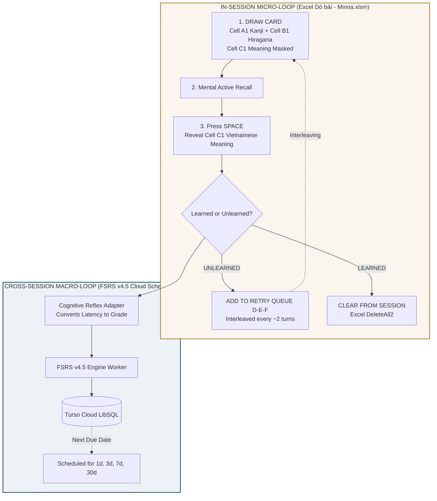
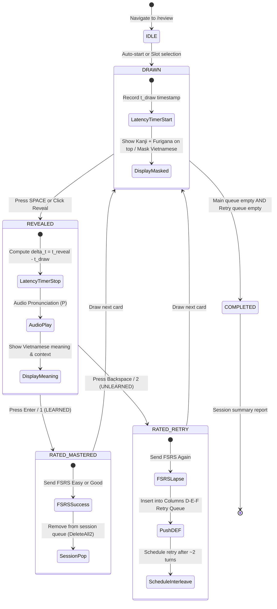

# MASTER PLAN: PHASE 10 - RAPID REFLEX MINNA DRILL STUDIO WITH FSRS
> **Project:** `japanese-srs-system` (Kiokudo · Japanese Cognitive SRS Engine)  
> **Plan Code:** `PHASE-10-DO-BAI-MIGRATION`  
> **Version:** `2.0.0-CULTURAL-PORTALS-AND-COMPLETE-DOBAI-PLANNING`  
> **Status:** PLANNING PHASE (Strictly Planning & Wireframe Specification · Zero Code Execution)  
> **Primary References:**  
>   1. `D:\JLPT\Dò bài - Minna.xlsm` (4 VBA Macros & 5 Worksheets - Rapid Reflex Drill & Columns D-E-F Retry Queue)  
>   2. `D:\semester-5\JPD133\Tổng Hợp Từ Vựng & Ngữ Pháp Tiếng Nhật JPD133 - Minna no Nihongo - Studocu.html` (JPD133 8 Core Curriculum Slots)  
> **Technical Specifications:** [doc/DO_BAI_LEARNING_SPECIFICATION.md](file:///d:/project/japanese-srs-system/doc/DO_BAI_LEARNING_SPECIFICATION.md) & [doc/SYSTEM_UI_UX_SKETCH_SPECIFICATION.md](file:///d:/project/japanese-srs-system/doc/SYSTEM_UI_UX_SKETCH_SPECIFICATION.md)  
> **Governing Charter:** [AGENTS.md](file:///d:/project/japanese-srs-system/AGENTS.md)  
> **Core Objective:** Transition study experience from 3D Karuta flashcards to rapid reflex Minna retrieval practice while preserving 100% of cognitive research, FSRS v4.5 scheduling algorithms, and database integrity.  
> **Inviolable Principle:** Zero Backend Regression — 100% Turso schema preservation, 100% FSRS mathematical invariants, 100% of 676 cards preserved, 21/21 Vitest test suites passing (111 tests).

---

## 1. SCOPE & RESEARCH INVARIANCE CHARTER

### Inviolable Commandments (Agents Rules Reference)
1. **Zero Backend & Schema Regression (Dieu ran 1):** Absolutely NO schema alterations in `src/db/schema.ts`, NO new migrations. In-session retry queues (Columns D-E-F) and unlearned tracking are handled strictly in client-side memory state and IndexedDB (`dexie`).
2. **Planning Gating (Dieu ran 2):** During planning tasks, DO NOT execute code or modify product source code in `src/app/` or `src/components/`. All operations remain in documentation (`planning/*.md`, `doc/*.md`).
3. **Cognitive Research & FSRS v4.5 Preservation (Dieu ran 3):**
   - **FSRS v4.5 Math Engine:** Preserve DSR model (Difficulty - Stability - Retrievability), Ebbinghaus decay, and dedicated Web Worker (`useFsrsScheduler`).
   - **Bjork Retrieval Latency Dynamics:** Measure exact recall latency $\Delta t = t_{\text{Reveal}} - t_{\text{Draw}}$ (ms) to quantify Storage vs. Retrieval strength.
   - **Cognitive Load Theory:** Eliminate extraneous load (no 3D card flips, no 4-button hesitation). Single-screen rapid reflex with binary feedback (Learned / Unlearned) converted automatically by algorithm.
   - **Dual Coding Theory:** Visual channel (Kanji Mincho, Hiragana Maru Gothic, Wagara patterns) + Auditory channel (Washi sounds, Tokyo pitch accent synthesis).
   - **Atomic Information & Context $i+1$:** Maintain Cloze deletion `{{c1::...}}`, example sentences, and Sino-Vietnamese readings.
   - **Tokyo Pitch Accent:** Preserve pitch accent contours.
4. **100% Green Tests (Dieu ran 4):** All 21 Vitest suites (111 tests) must remain green, and `<JapaneseArtBackdrop ... />` must be preserved in review views.
5. **Offline-First & SRE Stability (Dieu ran 5):** Cache ratings locally in Dexie IndexedDB and sync in background.
6. **Traditional Wa-Style & British Heritage Aesthetics (Dieu ran 6):**
   - Zero icons and emojis.
   - English UI chrome, controls, and buttons.
   - Vietnamese educational definitions, notes, and examples.
   - Hiragana furigana line directly above every Kanji + Vietnamese meaning.
   - Dynamic Red-to-Green Ombre metrics.
   - Traditional Nippon colors: Bengara (`#9E3223`), Shu-iro (`#B5301E`), Matcha (`#386641`), Aizome (`#16253B`), Kincha (`#AF7E36`), Washi (`#FAF8F5`).

---

## 2. COGNITIVE RESEARCH HERITAGE & DUAL-LOOP ARCHITECTURE

### 2.1. The 4 Cognitive Pillars

1. **Cognitive Load Theory (Sweller):**
   - *Previous Flashcard bottleneck:* Extraneous load from 3D card flipping delays and cognitive hesitation choosing between 4 buttons (`Again`, `Hard`, `Good`, `Easy`).
   - *Minna Rapid Drill solution:* Flat, zero-layout-shift single screen. Binary mental decision: "Do I know this word or not?" Granular grading is offloaded to the objective latency measurement engine.

2. **Bjork Desirable Difficulties & Latency Dynamics:**
   - Active neural retrieval practice: Cell C1 (Vietnamese meaning) is completely masked upon drawing ($C_1 = \emptyset$), forcing neural search.
   - Latency interval $\Delta t = t_{\text{Reveal}} - t_{\text{Draw}}$:
     - $\Delta t < 1.5\text{s}$: High retrieval strength -> `FSRS Easy (Grade 4)`.
     - $1.5\text{s} \le \Delta t \le 6.0\text{s}$: Desirable difficulty recall -> `FSRS Good (Grade 3)`.
     - $\Delta t > 6.0\text{s}$: Effortful recall -> `FSRS Hard (Grade 2)`.
     - Marked Unlearned: Retrieval lapse -> `FSRS Again (Grade 1)`.

3. **Dual Coding Theory (Paivio):**
   - Visual: Large Shippori Mincho Kanji, Zen Maru Gothic Furigana, Wagara motifs.
   - Auditory: Tactile Washi paper reveal sound, Web Speech API native Tokyo pronunciation.

4. **Minimum Information & Context $i+1$ (Krashen):**
   - Contextual sentences and grammar formulas displayed below meaning upon reveal.

### 2.2. Dual-Loop Architectural Blueprint



* **Micro-Loop (In-Session):** Learner finishes every session having mastered 100% of cards in today's batch via automatic interleaving of Columns D-E-F.
* **Macro-Loop (Cross-Session):** FSRS schedules future reviews at optimal forgetting intervals across days, weeks, and months.

---

## 3. ARCHITECTURE & DATA PIPELINE

### 3.1. Finite State Machine (FSM) of Drill Session



### 3.2. Cognitive Reflex to FSRS Mathematical Grade Conversion Matrix

| User Action | Latency Interval ($\Delta t$) | FSRS Grade | Mathematical Impact on Stability ($S$) | In-Session Handling |
| :--- | :--- | :--- | :--- | :--- |
| **LEARNED** | $\Delta t < 1.5\text{s}$ (Instant reflex) | **`Easy` (Grade 4)** | $S_{\text{new}} = S \cdot (1 + \text{bonus} \cdot 1.3)$ | Cleared from session immediately |
| **LEARNED** | $1.5\text{s} \le \Delta t \le 6.0\text{s}$ (Standard recall) | **`Good` (Grade 3)** | $S_{\text{new}} = S \cdot (1 + \text{bonus})$ | Cleared from session immediately |
| **LEARNED** | $\Delta t > 6.0\text{s}$ (Effortful recall) | **`Hard` (Grade 2)** | $S_{\text{new}} = S \cdot 1.15$ | Cleared from session immediately |
| **UNLEARNED** | Any duration | **`Again` (Grade 1)** | $S_{\text{lapse}} = w_{11} \cdot D^{-w_{12}} \dots$ | **Pushed to Columns D-E-F Retry Queue** |

### 3.3. JPD133 Curriculum Slot Hierarchy (8 Core Slots)

Stored transparently in existing `tags: text('tags')` column without database schema alterations:
* `Slot 1`: Family & Residence (`両親`, `父`, `母`, `兄`, `弟`, `姉`, `妹`...)
* `Slot 2`: Appearance & Physical Traits (`背が高い`, `髪が長い`...)
* `Slot 3`: Items & Giving/Receiving (`あげます`, `もらいます`, `くれます`...)
* `Slot 4`: Hobbies, Actions & Frequency (`趣味`, `映画`, `読書`...)
* `Slot 5`: Dictionary Form Verbs $V\text{る}$ (Group 1, 2, 3 verb classifications)
* `Slot 6`: Capabilities & Potential (`できます`, `泳ぐことができます`...)
* `Slot 8`: Connected Actions $V\text{て}$ (`食べて`, `行って`, `見て`...)
* `Slot 10`: Directions, Rules & Permission (`Vてもいいですか`, `もうVましたか`...)

---

## 4. UI/UX WIREFRAME & LAYOUT ARCHITECTURE (SYNCHRONIZED WITH V4.0.0 SPEC)

### 4.0. Dual Cultural Home Landing Portals (`/`)

#### Screen 0A: Classic British Cultural Home (`/` when EN selected)
* Purely decorative and atmospheric cultural greeting portal.
* **Zero functional widgets** (No card queues, no review buttons, no study statistics).
* Victorian Oxford/Cambridge library, dark mahogany, antique brass, Cicero & Francis Bacon inscriptions.

#### Screen 0B: Traditional Japanese Cultural Home (`/` when JA selected)
* Purely decorative and atmospheric cultural greeting portal.
* **Zero functional widgets** (No card queues, no review buttons, no study statistics).
* Zen Rock Garden (Karesansui), Engawa Veranda, Tokonoma Alcove, Matsuo Basho Haiku.

---

### 4.1. Desktop Rapid Reflex Drill Board (2-Column Bento Grid: 72% / 28%)

```
+--------------------------------------------------------------------------------------------------------------------+
| MINNA DRILL STUDIO                           Progress: [=========......] 14/45  | Mode: [Forward JA -> VI v] | Audio|
| CURRICULUM SLOT:  [All]  [Slot 1]  [Slot 2]  [Slot 3 (Active)]  [Slot 4]  [Slot 5]  [Slot 6]  [Slot 8]  [Slot 10]    |
+--------------------------------------------------------------------------------------------------------------------+
|                                                                                    |                               |
|   ======================== MAIN DRILL VIEW (72% WIDTH) ===========================   |  === RETRY QUEUE (28%) ===  |
|   |                                                                            |   |                               |
|   |   +--------------------------------------------------------------------+   |   |  UNLEARNED RETRY QUEUE        |
|   |   |  TAG: JPD133 · Slot 3 · Giving / Receiving                         |   |   |  (Interleaved during session) |
|   |   |                                                                    |   |   |                               |
|   |   |                               あげる                               |   |   |  1. じしょ                    |
|   |   |                               上　げる                             |   |   |     辞　書   (từ điển)        |
|   |   |             (cho, tặng - tôi cho người khác)                       |   |   |     [Retry in 1 turn]         |
|   |   |                                                                    |   |   |                               |
|   |   |             あげる (あげます)     [ Audio (P) ]                    |   |   |  2. てちょう                  |
|   |   |                                                                    |   |   |     手　帳   (sổ tay)         |
|   |   |   - - - - - - - - - - - - - - - - - - - - - - - - - - - - - - - -  |   |   |     [Retry in 3 turns]        |
|   |   |                                                                    |   |   |                               |
|   |   |   [ VIETNAMESE MEANING & CONTEXT EXAMPLES (MASKED OR EXPANDED) ]   |   |   |  3. おみやげ                  |
|   |   |   cho, tặng (tôi cho người khác)                                   |   |   |     お土産   (quà lưu niệm)   |
|   |   |   Ví dụ: 私は山田さんに本をあげました。                            |   |   |     [Retry in 4 turns]        |
|   |   |   (Tôi đã tặng sách cho bạn Yamada.)                               |   |   |                               |
|   |   +--------------------------------------------------------------------+   |   |  ---------------------------  |
|   |                                                                            |   |  Total Queue: 3 cards         |
|   |   Bjork Latency: 1.1s  •  Grade: FSRS Easy             [ Undo (Z) ]        |   |  [Clear all to complete]      |
|   |                                                                            |   |                               |
|   |   +---------------------------------+  +-------------------------------+   |   |                               |
|   |   |    UNLEARNED (Bksp / 2)         |  |     LEARNED (Enter / 1)       |   |   |                               |
|   |   |    • Queue into Retry Queue     |  |     • Increase FSRS Stability |   |   |                               |
|   |   |    • Interleaved after ~2 turns |  |     • Draw next card          |   |   |                               |
|   |   +---------------------------------+  +-------------------------------+   |   |                               |
|   ==============================================================================   =================================
|                                                                                                                    |
|   [ HOTKEYS:  Space: Reveal Answer  |  Enter / 1: Learned  |  Bksp / 2: Unlearned  |  Z: Undo  |  P: Audio ]           |
+--------------------------------------------------------------------------------------------------------------------+
```

---

### 4.2. State 1: Drawn Card / Masked Answer (Active Neural Retrieval)

```
+---------------------------------------------------------------------------------------+
|  TAG: JPD133 · Slot 3 · Giving & Receiving                        Card Progress: 14/45|
|                                                                                       |
|                                       あげる                                          |
|                                       上　げる                                        |
|                             (cho, tặng - tôi tặng người khác)                         |
|                                                                                       |
|                                  あげる (あげます)                                    |
|                                  [ Audio Play (P) ]                                   |
|                                                                                       |
|   + - - - - - - - - - - - - - - - - - - - - - - - - - - - - - - - - - - - - - - - +   |
|   |  MASKED VIETNAMESE MEANING                                                    |   |
|   |                                                                               |   |
|   |     Recall meaning in memory... Press SPACE or click below to REVEAL ANSWER   |   |
|   |                                                                               |   |
|   + - - - - - - - - - - - - - - - - - - - - - - - - - - - - - - - - - - - - - - - +   |
|                                                                                       |
|   Measuring Bjork retrieval latency...                                                |
|                                                                                       |
|   +-------------------------------------------------------------------------------+   |
|   |                                                                               |   |
|   |                     [  REVEAL MEANING (Press Space)  ]                        |   |
|   |                                                                               |   |
|   +-------------------------------------------------------------------------------+   |
|                                                                                       |
|      (Learned & Unlearned action buttons are disabled until answer is revealed)       |
+---------------------------------------------------------------------------------------+
```

---

### 4.3. State 2: Revealed & Latency Evaluation (Bjork Dynamics & Ombre Feedback)

```
+---------------------------------------------------------------------------------------+
|  TAG: JPD133 · Slot 3 · Giving & Receiving                        Card Progress: 14/45|
|                                                                                       |
|                                       あげる                                          |
|                                       上　げる                                        |
|                             (cho, tặng - tôi tặng người khác)                         |
|                                                                                       |
|                                  あげる (あげます)                                    |
|                                  [ Audio Playing... ]                                 |
|                                                                                       |
|   +-------------------------------------------------------------------------------+   |
|   |  PRIMARY MEANING (VIETNAMESE):                                                |   |
|   |  cho, tặng (tôi cho người khác)                                               |   |
|   |  • Cấu trúc: [Người cho] は [Người nhận] に N を あげます                     |   |
|   |                                                                               |   |
|   |  CONTEXT SENTENCE (i+1):                                                      |   |
|   |  私は山田さんに本をあげました。 (Tôi đã tặng sách cho bạn Yamada.)            |   |
|   +-------------------------------------------------------------------------------+   |
|                                                                                       |
|   Retrieval Latency: 1.1s  •  Grade: [ FSRS Easy (Fast Recall) ]                      |
|                                                                                       |
|   +---------------------------------------+   +-----------------------------------+   |
|   |                                       |   |                                   |   |
|   |       UNLEARNED                       |   |       LEARNED                     |   |
|   |       (Backspace / Key 2)             |   |       (Enter / Key 1)             |   |
|   |       • Queue into Columns D-E-F      |   |       • Increase FSRS Stability   |   |
|   |       • Retry scheduled in ~2 turns   |   |       • Draw next new card        |   |
|   |                                       |   |                                   |   |
|   +---------------------------------------+   +-----------------------------------+   |
|                                                                                       |
|                               [ Undo Misclick (Ctrl+Z / Z) ]                          |
+---------------------------------------------------------------------------------------+
```

---

### 4.4. State 3: Reverse Drill (Vietnamese -> Japanese Recall)

```
+---------------------------------------------------------------------------------------+
|  DRILL MODE: REVERSE (VIETNAMESE -> JAPANESE)                     Card Progress: 08/45|
|                                                                                       |
|                                cho, tặng (tôi tặng người khác)                        |
|                                Ngữ cảnh: Tặng sách cho Yamada                         |
|                                                                                       |
|   + - - - - - - - - - - - - - - - - - - - - - - - - - - - - - - - - - - - - - - - +   |
|   |  MASKED JAPANESE KANJI & HIRAGANA                                             |   |
|   |     Recall Kanji & Kana in memory... Press SPACE to VERIFY                    |   |
|   + - - - - - - - - - - - - - - - - - - - - - - - - - - - - - - - - - - - - - - - +   |
|                                                                                       |
|   +-------------------------------------------------------------------------------+   |
|   |                     [  REVEAL JAPANESE ANSWER (Space)  ]                      |   |
|   +-------------------------------------------------------------------------------+   |
+---------------------------------------------------------------------------------------+
```

---

### 4.5. Mobile Responsive Drill Layout (Width 390px Thumb Zone)

```
+-----------------------------------------+
| [KIOKUDO] Minna Drill Board      [14/45]|
+-----------------------------------------+
| [All] [Slot 3: Giving/Receiving] [Slot 4|
+-----------------------------------------+
|                                         |
|                 あげる                  |
|                 上　げる                |
|      (cho, tặng - tôi cho người khác)   |
|                                         |
|            あげる (あげます)            |
|               [ Audio (P) ]             |
|                                         |
|  +-----------------------------------+  |
|  | cho, tặng (tôi cho người khác)    |  |
|  | 私は山田さんに本をあげました。    |  |
|  +-----------------------------------+  |
|                                         |
|  Latency: 1.1s • FSRS Easy              |
|                                         |
|  +-----------------------------------+  |
|  |   LEARNED (Matcha Green)          |  |
|  +-----------------------------------+  |
|  |   UNLEARNED (Shu-iro Red)         |  |
|  +-----------------------------------+  |
|                                         |
|  +-----------------------------------+  |
|  | Retry Queue: 3 items [Expand]     |  |
|  | 1. 辞書 • 2. 手帳 • 3. お土産     |  |
|  +-----------------------------------+  |
+-----------------------------------------+
```

---

### 4.6. Ergonomic Hotkeys Mapping

| Key Code | Target Interaction | Visual Feedback | Cognitive Purpose |
| :--- | :--- | :--- | :--- |
| `Space` | Toggle Reveal / Mask | 0ms instant transition, Washi paper sound | Thumbs resting on spacebar |
| `Enter` or `1` | Mark **LEARNED** | Matcha Green button ripple, next card drawn | Right index or numpad reflex |
| `Backspace` or `2` | Mark **UNLEARNED** | Shu-iro Red button ripple, item queued to D-E-F | Error acknowledgement |
| `P` | Pronounce Headword | Web Speech API speech synthesis (`ja-JP`) | Auditory reinforcement |
| `Z` or `Ctrl+Z` | Undo last rating | Pop previous card from history stack | Misclick protection |

---

## 5. WORK BREAKDOWN STRUCTURE (WBS)

### SPRINT 1: CORE RAPID DRILL STUDIO & DUAL-LOOP ENGINE (P0 CORE)
* **WBS-10.1 (DoBaiDesk Component Integration):**
  * Integrate into `src/app/review/page.tsx` while strictly preserving `<JapaneseArtBackdrop ... />`.
  * Display Kanji, Furigana on top, masked Vietnamese meaning box.
* **WBS-10.2 (Hotkey Controller Engine):**
  * Wire up IME-safe listener for `Space`, `Enter`/`1`, `Backspace`/`2`, `Z`, `P`.
* **WBS-10.3 (In-Session Columns D-E-F Retry Queue):**
  * Implement client-side `unlearnedList` state with 2-turn interleaving algorithm.

### SPRINT 2: BI-DIRECTIONAL MODES, JPD133 SLOTS & BJORK LATENCY (P1 HIGH)
* **WBS-10.4 (Bi-directional Practice Modes):**
  * Forward mode: Japanese -> Vietnamese.
  * Reverse mode: Vietnamese -> Japanese.
* **WBS-10.5 (JPD133 Slot Curriculum Tracker):**
  * Slot filter chips `[All]`, `[Slot 1]`, `[Slot 2]`, ... `[Slot 10]`.
* **WBS-10.6 (Bjork Latency Dynamics & Grade Adapter):**
  * Measure $\Delta t = t_{\text{Reveal}} - t_{\text{Draw}}$ and map to FSRS Easy/Good/Hard.

### SPRINT 3: WA-STYLE MODERNITY, OMBRE METRICS & AUDIO (P2 MEDIUM)
* **WBS-10.7 (Red-to-Green Dynamic Ombre Feedback):**
  * Linear gradient between Bengara Red (`#9E3223`) and Matcha Green (`#386641`).
* **WBS-10.8 (Dual Coding Audio Orchestration):**
  * Washi paper flip sound + Web Speech API Japanese synthesis.

### SPRINT 4: TEST AUTOMATION & QUALITY GATES (P3 QUALITY)
* **WBS-10.9 (Vitest Automated Test Suite):**
  * Author `tests/do-bai-engine.test.ts` covering FSM transitions, retry queue interleaving, and latency conversion.
  * Ensure all 21 existing test suites (111 tests) remain 100% GREEN.
* **WBS-10.10 (Release Gating):**
  * `npx tsc --noEmit` reports 0 errors.
  * `npm test` achieves 100% pass.

---

## 6. PROJECT RISK MATRIX & MITIGATION

| Technical Risk | Severity | Likelihood | Mitigation Strategy |
| :--- | :---: | :---: | :--- |
| **IME Key Conflict (Japanese input)** | High | High | Check `e.isComposing` and ignore drill hotkeys when composing. |
| **Infinite Retry Loop on difficult cards** | Medium | Low | Cap max in-session repetitions at 3 before postponing to next session. |
| **Session Loss on accidental refresh** | High | Medium | Persist active session queue and retry list to `sessionStorage`. |
| **Outlier Latency (user walks away)** | Medium | Medium | Cap valid latency at 15s to prevent skewing FSRS stability weights. |
| **Visual test regression on backdrop** | High | Low | Strictly preserve `<JapaneseArtBackdrop ... />` in review component. |

---

## 7. DEFINITION OF READY FOR IMPLEMENTATION
Planning phase is completed and ready for execution upon explicit user command:
- [x] All 6 Inviolable Commandments from `AGENTS.md` respected.
- [x] 100% Zero icons and emojis across all specs.
- [x] English UI chrome and Vietnamese educational content standardized.
- [x] Furigana line directly above every Kanji + Vietnamese meaning.
- [x] Red-to-Green Ombre metrics specified.
- [x] Dual Cultural Home Portals documented (Screen 0A British, Screen 0B Japanese).
- [x] Full Excel `D:\JLPT\Dò bài - Minna.xlsm` macro and worksheet mapping defined.
- [x] 21/21 Vitest suites (111 tests) currently 100% GREEN.
- [x] TypeScript compiles with 0 errors.
