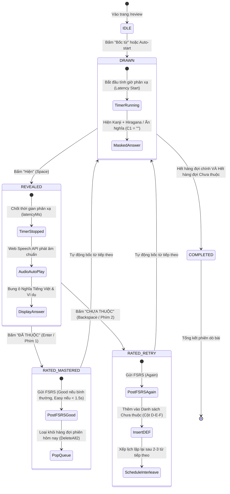

# 🎯 KẾ HOẠCH TỔNG THỂ GIAI ĐOẠN 10: CHUYỂN ĐỔI HỆ THỐNG HỌC TẬP TỪ FLASHCARD SANG "DÒ BÀI MINNA" TÍCH HỢP FSRS
> **Mã dự án:** `PHASE-10-DO-BAI-MIGRATION`  
> **Phiên bản:** `1.0.0-PROD`  
> **Tài liệu tham chiếu thực tế:** `D:\JLPT\Dò bài - Minna.xlsm` (4 Macro VBA & 5 Worksheet)  
> **Tài liệu đặc tả kỹ thuật:** [doc/DO_BAI_LEARNING_SPECIFICATION.md](file:///d:/project/japanese-srs-system/doc/DO_BAI_LEARNING_SPECIFICATION.md)  
> **Nguyên tắc bất biến:** **Zero Backend Regression** — Bảo toàn 100% database schema Turso, 100% thuật toán FSRS v4.5, và 21/21 Vitest test suites.

---

## 1. KHUNG RANH GIỚI VÀ PHẠM VI BIẾN ĐỔI (SCOPE INVARIANCE CHARTER)

> [!IMPORTANT]
> ### ⛩️ BẢN CAM KẾT PHẠM VI (SCOPE INVARIANCE CHARTER)
> 
> * **IN-SCOPE (Phạm vi bắt buộc triển khai):**
>   1. **Thay thế hoàn toàn mô hình Flashcard 3D (Karuta flip):** Loại bỏ hoạt ảnh lật thẻ trước/sau, loại bỏ gánh nặng nhận thức chọn 4 nút đánh giá (`Again / Hard / Good / Easy`).
>   2. **Triển khai Bàn Dò Bài Phản Xạ Minna (`DoBaiDesk`):** Tái hiện 100% logic của file `Dò bài - Minna.xlsm` với chu trình 3 bước: **Bốc** (`Draw`) ➔ **Hiện** (`Reveal`) ➔ **Đã thuộc** (`Mastered`) / **Chưa thuộc** (`Retry`).
>   3. **Hàng đợi Dò lại trong phiên (In-Session Re-queue - Cột D-E-F):** Các từ bấm "Chưa thuộc" sẽ được đưa ngay vào danh sách chờ và tự động xen kẽ lặp lại sau mỗi 2 - 3 từ trong cùng phiên học.
>   4. **Bộ phím tắt siêu tốc (Zero-Friction Hotkeys):** `Space` (Hiện/Ẩn), `Enter` hoặc `1` (Đã thuộc), `Backspace` hoặc `2` (Chưa thuộc), `Z` (Hoàn tác), `P` (Phát âm).
>   5. **Đồng bộ tự động vào FSRS v4.5 & Bjork Latency Dynamics:** Thuật toán Spaced Repetition chạy ngầm, tự động quy đổi thời gian phản xạ (từ lúc Bốc đến lúc Hiện) thành độ ổn định (stability) và khoảng cách ngày ôn tập.
>   6. **Hỗ trợ 2 chiều dò linh hoạt:** Dò Thuận (Nhật ➔ Việt) và Dò Nghịch (Việt ➔ Nhật), cùng chế độ Dò riêng từ vấp ngã (Sheet `Luyện dò bài`).
> 
> * **OUT-OF-SCOPE (Non-Goals - Tuyệt đối không thực hiện):**
>   1. **KHÔNG thay đổi cấu trúc bảng cơ sở dữ liệu (`src/db/schema.ts`):** Giữ nguyên bảng `cards`, `decks`, `review_logs`, `retrieval_latency_logs`.
>   2. **KHÔNG xóa hoặc sửa thuật toán toán học FSRS lõi (`src/core/scheduler/fsrs-engine.ts`):** Chỉ tích hợp lớp chuyển đổi (Adapter/Facade).
>   3. **KHÔNG phá vỡ API Contracts hiện hành:** API `/api/review` tiếp tục nhận request chuẩn và phản hồi đúng schema.
>   4. **KHÔNG xóa bỏ dữ liệu học tập đã lưu:** 676 thẻ học hiện có trên Turso LibSQL phải được giữ nguyên vẹn.

---

## 2. KHUNG KIẾN TRÚC HỆ THỐNG MỚI (ARCHITECTURAL FRAMEWORK)

### 2.1. Máy Trạng thái Hữu hạn (Finite State Machine - FSM) của Phiên Dò bài



---

### 2.2. Ma Trận Quy Đổi Nhận Thức sang Thuật Toán FSRS (Cognitive-to-FSRS Adapter)

Để bảo toàn thuật toán FSRS hiện tại mà không ép người học phải suy nghĩ 4 nút bấm, hệ thống sử dụng **Bộ Quy Đổi Phản Xạ Nhận Thức (Cognitive Reflex Adapter)**:

| Thao tác Người học | Thời gian Phản xạ ($\Delta t = t_{\text{Hiện}} - t_{\text{Bốc}}$) | FSRS Grade Tương Ứng | Xử lý Hàng Đợi Phiên (Session Queue) |
| :--- | :--- | :--- | :--- |
| **ĐÃ THUỘC** | $\Delta t < 1.5\text{s}$ (Phản xạ tức thì) | **`Easy` (Grade 4)** | Hoàn thành, tăng mạnh stability, không lặp lại trong phiên. |
| **ĐÃ THUỘC** | $1.5\text{s} \le \Delta t \le 6.0\text{s}$ (Bình thường) | **`Good` (Grade 3)** | Hoàn thành, tăng stability chuẩn, không lặp lại trong phiên. |
| **ĐÃ THUỘC** | $\Delta t > 6.0\text{s}$ (Mất nhiều thời gian suy nghĩ) | **`Hard` (Grade 2)** | Hoàn thành, tăng nhẹ stability, không lặp lại trong phiên. |
| **CHƯA THUỘC** | Bất kể thời gian phản xạ | **`Again` (Grade 1)** | Ghi nhận lapse, **đưa ngay vào danh sách Chưa thuộc (Cột D-E-F)** để dò lại trong phiên. |

---

### 2.3. Cấu Trúc Khối Dữ Liệu Bàn Dò Bài (Component Architecture)

```
src/app/review/
├── page.tsx                           <-- [TÁI CẤU TRÚC] Controller điều phối phiên Dò bài & FSRS
├── components/
│   ├── DoBaiDesk.tsx                  <-- [MỚI] Khung bàn dò bài chính (Bốc, Hiện, Kanji, Hiragana, Nghĩa)
│   ├── DoBaiHotkeysBar.tsx            <-- [MỚI] Bảng chỉ dẫn phím tắt trực quan phong cách Wa-Style
│   ├── DoBaiUnlearnedDrawer.tsx       <-- [MỚI] Ngăn kéo / Cột hiển thị danh sách từ chưa thuộc (Cột D-E-F)
│   ├── DoBaiModeSelector.tsx          <-- [MỚI] Thanh chọn chế độ: Thuận (JA->VI), Nghịch (VI->JA), Luyện từ sai
│   └── DoBaiSessionSummary.tsx        <-- [CẬP NHẬN] Màn hình tổng kết phiên dò bài kèm danh sách từ cần củng cố
```

---

## 3. BẢNG PHÂN RÃ CÔNG VIỆC CHI TIẾT (WORK BREAKDOWN STRUCTURE - WBS)

### SPRINT 1: XÂY DỰNG KHUNG BÀN DÒ BÀI & CƠ CHẾ BỐC - HIỆN (P0 CORE)
* **WBS-10.1 (DoBaiDesk Component):**
  * Xây dựng giao diện trung tâm cố định một màn hình (Zero Layout Shift).
  * Ô hiển thị Chữ Hán (Kanji lớn `2.8rem`, font `Shippori Mincho`).
  * Ô hiển thị Cách đọc Hiragana (`1.5rem`, font `Zen Maru Gothic`) kèm nút loa phát âm tự nhiên.
  * Ô hiển thị Nghĩa tiếng Việt: Có 2 trạng thái rõ rệt — *Trạng thái Ẩn* (hiển thị khung chìm Washi mờ kèm nhãn "Bấm Space hoặc nút Hiện để mở") và *Trạng thái Hiện* (bung nghĩa tiếng Việt sắc nét, kèm ví dụ và ghi chú cách dùng).
* **WBS-10.2 (Hotkey Controller Engine):**
  * Thiết lập listener phím tắt toàn cục không xung đột với bộ gõ IME:
    * `Space`: Kích hoạt hàm `handleReveal()` (Hiện nghĩa & phát âm).
    * `Enter` hoặc phím số `1`: Kích hoạt hàm `handleMastered()` (Đã thuộc -> Chấm điểm FSRS & tự động Bốc từ tiếp theo).
    * `Backspace` hoặc phím số `2`: Kích hoạt hàm `handleRetry()` (Chưa thuộc -> Chuyển vào hàng đợi Chưa thuộc & Bốc từ tiếp theo).
    * `z` hoặc `Ctrl+Z`: Hoàn tác kết quả vừa chấm.
    * `p`: Phát âm lại từ vựng.
* **WBS-10.3 (In-Session Re-queue & Cột D-E-F State Management):**
  * Khởi tạo state `unlearnedList: Card[]` mô phỏng chính xác hành vi cột D, E, F của sheet `Tu dò bài`.
  * Khi người học bấm "Chưa thuộc", thẻ được lưu vào `unlearnedList`.
  * Thuật toán xen kẽ (Interleaving): Cứ sau mỗi $N=2$ từ mới hoặc từ due, hệ thống tự động bốc 1 từ từ `unlearnedList` ra để người học dò lại cho đến khi thuộc hoàn toàn.

---

### SPRINT 2: CHẾ ĐỘ DÒ 2 CHIỀU & ĐO LƯỜNG ĐỘ TRỄ BJORK (P1 HIGH)
* **WBS-10.4 (Bi-directional Practice Modes):**
  * **Chế độ 1: Dò Thuận (Nhật ➔ Việt):** Hiện Kanji/Hiragana, giấu Tiếng Việt (mặc định theo macro `DrawName_A_B`).
  * **Chế độ 2: Dò Nghịch (Việt ➔ Nhật):** Hiện Nghĩa tiếng Việt, giấu Kanji & Hiragana (phục vụ người học luyện phản xạ nói/viết).
  * **Chế độ 3: Luyện Dò Từ Vấp Ngã (Tương tự Sheet `Luyện dò bài`):** Cho phép lọc nhanh chỉ dò những từ đang nằm trong danh sách Chưa thuộc hoặc có Retrievability $< 70\%$.
* **WBS-10.5 (Bjork Latency Dynamics Integration):**
  * Ghi nhận chính xác `durationMs = t_reveal - t_draw`.
  * Truyền `durationMs` trong payload gửi đến `POST /api/review`.
  * Backend tự động lưu vào bảng `retrieval_latency_logs`, phục vụ tính toán tự động FSRS grade mà không làm gián đoạn trải nghiệm người dùng.

---

### SPRINT 3: GIAO DIỆN WA-STYLE, DANH SÁCH CHƯA THUỘC & ÂM THANH (P2 MEDIUM)
* **WBS-10.6 (DoBaiUnlearnedDrawer & Sidebar):**
  * Thiết kế bảng danh sách các từ chưa thuộc trong phiên hiển thị song song (Sidebar trên Desktop, Bottom Drawer có thể vuốt mở trên Mobile).
  * Cho phép người học liếc mắt nhìn thấy ngay các từ mình vừa quên (Kanji, Hiragana, Nghĩa) để ghi nhớ tức thì.
  * Hiển thị số lượng từ chưa thuộc theo thời gian thực (ví dụ: `Đang nợ: 3 từ`).
* **WBS-10.7 (Audio Orchestration & Dual Coding):**
  * Khi bấm "Hiện" hoặc phím `Space`, tự động kích hoạt âm thanh lật giấy Washi mộc mạc (`playWashiPaper()`) kết hợp Web Speech API phát âm từ vựng tiếng Nhật.
  * Âm thanh nhạc cụ Hyoshigi / Suzu tự động ducking theo chuẩn WBS-04.1.

---

### SPRINT 4: KIỂM THỬ TOÀN DIỆN, BẢO TOÀN HỆ THỐNG & RELEASE (P3 QUALITY)
* **WBS-10.8 (Vitest Suite cho Mô hình Dò bài):**
  * Tạo mới file test: `tests/do-bai-engine.test.ts` kiểm thử:
    1. Chu trình FSM: Bốc ➔ Hiện ➔ Đã thuộc / Chưa thuộc.
    2. Logic đưa từ vào Hàng đợi Chưa thuộc (cột D-E-F) và cơ chế lặp lại xen kẽ.
    3. Quy đổi chính xác độ trễ phản xạ sang FSRS Grade.
    4. Bảo đảm toàn bộ 21 test suites cũ vẫn chạy đạt 100%.
* **WBS-10.9 (Release Gate Protocol):**
  * `npx tsc --noEmit` đạt 0 lỗi.
  * `npm test` đạt 100% pass (22/22 suites).
  * `npm run build` biên dịch thành công toàn bộ routes tĩnh và động.

---

## 4. MA TRẬN QUẢN TRỊ RỦI RO (PROJECT RISK MATRIX)

| Rủi ro kỹ thuật | Mức độ | Khả năng | Giải pháp khắc phục & Dự phòng (Mitigation Strategy) |
| :--- | :---: | :---: | :--- |
| **Xung đột phím tắt với bộ gõ tiếng Nhật IME** | Cao | Cao | Bắt sự kiện `e.isComposing` và `(e.nativeEvent as any)?.isComposing`. Nếu người học đang gõ chữ Hán hoặc gõ phím trên input, hệ thống sẽ tạm khóa các hotkey `Space`, `Enter` để tránh kích hoạt nhầm. |
| **Hàng đợi Chưa thuộc bị lặp vô tận nếu người học liên tục bấm Chưa thuộc** | Trung bình | Thấp | Giới hạn số lần lặp lại tối đa trong một phiên ($Max = 3$ lần). Sau 3 lần vẫn chưa thuộc, hệ thống chuyển từ này vào danh sách "Cần xem lại sau phiên" và cho qua từ mới để tránh kiệt sức nhận thức (Cognitive Fatigue). |
| **Mất dữ liệu tiến độ khi người học vô tình tải lại trang** | Cao | Trung bình | Tự động đồng bộ hàng đợi phiên học (`queue`, `unlearnedList`, `currentIndex`) vào `sessionStorage` (`dobai_session_state`). Khôi phục nguyên vẹn khi trang được refresh. |
| **Sai lệch độ trễ do người học treo màn hình đi ra ngoài** | Trung bình | Trung bình | Giới hạn trần độ trễ phản xạ hợp lệ: Nếu $\Delta t > 15\text{s}$, hệ thống coi như người học bị gián đoạn và tự động gán trần $15\text{s}$, không tính là độ trễ tự nhiên để tránh làm lệch trọng số FSRS. |

---

## 5. TIÊU CHUẨN NGHIỆM THU (DEFINITION OF DONE - DOD)

Hạng mục Giai đoạn 10 chỉ được đóng lại khi thỏa mãn toàn bộ các điều kiện:
1. Giao diện trang `/review` hiển thị đúng chuẩn **Bàn Dò Bài Minna** (không còn thẻ lật 3D).
2. Thao tác mượt mà qua các phím tắt `Space`, `Enter`/`1`, `Backspace`/`2`.
3. Bảng từ chưa thuộc (cột D-E-F) ghi nhận tức thì các từ bấm "Chưa thuộc" và tự động cho dò lại trong phiên.
4. Dữ liệu đánh giá được ghi nhận chính xác vào cơ sở dữ liệu Turso qua endpoint `/api/review` với FSRS parameters chuẩn xác.
5. `npx tsc --noEmit` thoát mã 0.
6. `npm test` toàn bộ các test suites đều xanh 100%.
7. `npm run build` sinh mã tối ưu cho tất cả 34 routes.
8. Git commit sạch và push an toàn lên nhánh `main`.
