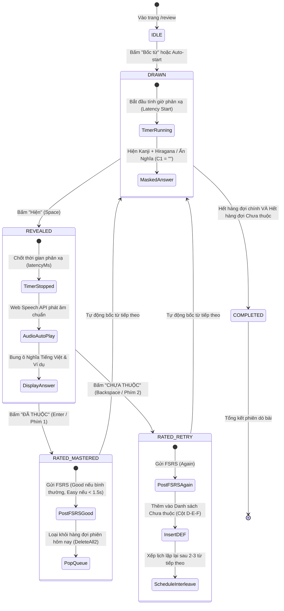
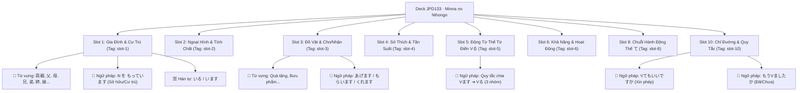

# 🎯 KẾ HOẠCH TỔNG THỂ GIAI ĐOẠN 10: CHUYỂN ĐỔI HỆ THỐNG HỌC TẬP TỪ FLASHCARD SANG "DÒ BÀI MINNA" TÍCH HỢP FSRS
> **Mã dự án:** `PHASE-10-DO-BAI-MIGRATION`  
> **Phiên bản:** `1.2.0-PLANNING`  
> **Trạng thái:** 📋 **ĐANG TRONG BƯỚC LẬP KẾ HOẠCH CHI TIẾT (ĐÃ GỘP TÍNH NĂNG THEO DÕI SLOT JPD133 - CHỜ DUYỆT THỰC THI)**  
> **Tài liệu tham chiếu thực tế:**  
>   1. `D:\JLPT\Dò bài - Minna.xlsm` (4 Macro VBA & 5 Worksheet - Mô hình Dò bài phản xạ & Cột nợ D-E-F)  
>   2. `D:\semester-5\JPD133\Tổng Hợp Từ Vựng & Ngữ Pháp Tiếng Nhật JPD133 - Minna no Nihongo - Studocu.html` (Phân phối 8 Slot học kỳ 5 Minna)  
> **Tài liệu đặc tả kỹ thuật:** [doc/DO_BAI_LEARNING_SPECIFICATION.md](file:///d:/project/japanese-srs-system/doc/DO_BAI_LEARNING_SPECIFICATION.md)  
> **Điều lệ ràng buộc Agent:** [AGENTS.md](file:///d:/project/japanese-srs-system/AGENTS.md) & [.agents/rules/SYSTEM_CONSTRAINTS.md](file:///d:/project/japanese-srs-system/.agents/rules/SYSTEM_CONSTRAINTS.md)  
> **Cam kết cốt lõi:** **Kế thừa 100% công trình nghiên cứu khoa học nhận thức, thuật toán FSRS v4.5 và hạ tầng SRS đã xây dựng từ các giai đoạn trước (Phases 1-9), chuyển hóa trọn vẹn vào trải nghiệm phản xạ Dò bài.**  
> **Nguyên tắc bất biến:** **Zero Backend Regression** — Bảo toàn 100% database schema Turso, 100% logic FSRS v4.5, 100% dữ liệu 676 thẻ học, và 21/21 Vitest test suites.

---

## 1. KHUNG RANH GIỚI VÀ PHẠM VI BIẾN ĐỔI (SCOPE INVARIANCE CHARTER)

> [!IMPORTANT]
> ### ⛩️ BẢN CAM KẾT PHẠM VI & BẢO TỒN NGHIÊN CỨU (SCOPE & RESEARCH INVARIANCE CHARTER)
> 
> * **KẾ THỪA NGUYÊN VẸN CÁC CÔNG TRÌNH NGHIÊN CỨU & THUẬT TOÁN SRS (Research Invariants):**
>   1. **Thuật toán Spaced Repetition FSRS v4.5:** Giữ nguyên 100% mô hình toán học DSR (Difficulty - Stability - Retrievability), công thức suy giảm trí nhớ Ebbinghaus, và cơ chế tính toán ngày ôn tập tối ưu.
>   2. **Khoa học Nhận thức Bjork (Retrieval Latency Dynamics):** Tiếp tục đo lường chính xác độ trễ phản xạ ($\Delta t$) từ lúc Bốc đến lúc Hiện để định lượng Storage Strength vs. Retrieval Strength.
>   3. **Thuyết Tải Nhận Thức (Cognitive Load Theory):** Loại bỏ tải ngoại lai (Extraneous Load) của thẻ xoay 3D và sự phân vân chọn 4 nút đánh giá chủ quan; chuyển sang nhận diện phản xạ 2 nút (Đã thuộc / Chưa thuộc) và để thuật toán tự động quy đổi FSRS grade.
>   4. **Thuyết Mã Hóa Kép (Dual Coding Theory):** Duy trì đồng thời thị giác (Chữ Hán thư pháp Mincho, Furigana Maru Gothic, Wagara pattern, đồ thị Pitch Accent) và thính giác (âm thanh Washi, Hyoshigi, Suzu, Web Speech API phát âm chuẩn Tokyo).
>   5. **Nguyên lý Nguyên tử & Ngữ cảnh $i+1$ (Cloze Deletion):** Giữ nguyên bộ phân tách Cloze `{{c1::...}}`, câu ví dụ ngữ cảnh, và bộ phân tích âm Hán Việt `parseCardDetails`.
>   6. **Hạ tầng Ngoại tuyến Dexie.js (Offline-First):** Tiếp tục lưu trữ đệm trong IndexedDB và tự động đồng bộ ngầm khi có mạng.
>   7. **Mỹ học Wa-Style & Nghệ thuật Bản địa:** Bảo tồn các lớp hình nền nghệ thuật `<JapaneseArtBackdrop ... />` theo đúng kiểm thử mỹ học `art-backdrop.test.ts`.
> 
> * **IN-SCOPE (Phạm vi chuyển đổi Giao diện & Trải nghiệm):**
>   1. **Loại bỏ mô hình Flashcard 3D lật mặt:** Thay thế thẻ bài Karuta xoay lật bằng Bàn Dò Bài Phản Xạ 1 màn hình cố định (`DoBaiDesk`).
>   2. **Triển khai Chu trình Dò bài Minna 3 bước:** **Bốc** (`Draw`) ➔ **Hiện** (`Reveal`) ➔ **Đã thuộc** (`Mastered`) / **Chưa thuộc** (`Retry`).
>   3. **Tích hợp Hàng đợi Lặp lại trong phiên (Micro-loop - Cột D-E-F Excel):** Các từ bấm "Chưa thuộc" được đưa ngay vào danh sách chờ và tự động xen kẽ lặp lại sau mỗi 2 - 3 từ cho đến khi thuộc hẳn trong phiên.
>   4. **Bộ phím tắt công thái học siêu tốc:** `Space` (Hiện/Ẩn), `Enter`/`1` (Đã thuộc), `Backspace`/`2` (Chưa thuộc), `Z` (Hoàn tác), `P` (Phát âm).
>   5. **Hỗ trợ 2 chiều dò:** Dò Thuận (Nhật ➔ Việt) và Dò Nghịch (Việt ➔ Nhật), cùng chế độ Dò riêng từ nợ (Sheet `Luyện dò bài`).
>   6. **Theo dõi Tiến độ & Dò Bài Phân Tầng Theo Slot Học JPD133 (JPD133 Slot-based Tracking):**
>      * Bóc tách và gắn thẻ hệ thống thẻ học JPD133 theo 8 Slot chuẩn từ tài liệu `D:\semester-5\JPD133\...Studocu.html` (Slot 1: Gia Đình, Slot 2: Ngoại hình/Tính cách, Slot 3: Cho/Nhận, Slot 4: Sở thích, Slot 5: Động từ Thể từ điển Vる, Slot 6: Khả năng, Slot 8: Thể て liên kết, Slot 10: Chỉ đường, Cảm giác & Xin phép/Cấm đoán/Đã chưa).
>      * Bổ sung thanh chọn Slot (Slot Filter Tabs: `[Tất cả] [Slot 1] [Slot 2]... [Slot 10]`) trong Bàn Dò Bài `/review`.
>      * Đo lường % Mastery theo từng Slot độc lập.
> 
> * **OUT-OF-SCOPE (Non-Goals - Tuyệt đối không thay đổi):**
>   1. **KHÔNG thay đổi cấu trúc bảng cơ sở dữ liệu (`src/db/schema.ts`):** Tính năng theo dõi Slot JPD133 tận dụng 100% cột `tags: text('tags')` sẵn có lưu mảng JSON `["jpd133", "slot-1", ...]`. Giữ nguyên bảng `cards`, `decks`, `review_logs`, `retrieval_latency_logs`.
>   2. **KHÔNG sửa đổi thuật toán toán học FSRS lõi (`src/core/scheduler/fsrs-engine.ts`):** Chỉ tích hợp lớp chuyển đổi (Adapter/Facade).
>   3. **KHÔNG thay đổi API Contracts:** Endpoint `/api/review` tiếp tục nhận request và phản hồi chuẩn schema.
>   4. **KHÔNG xóa bỏ hoặc làm mất dữ liệu học tập:** 676 thẻ học hiện có trên Turso LibSQL được bảo toàn tuyệt đối.
>   5. **KHÔNG thực thi mã nguồn khi người dùng chưa phê duyệt:** Mọi hành động trong bước này chỉ tập trung hoàn thiện kế hoạch và đặc tả.

---

## 2. KẾ THỪA TOÀN DIỆN CÔNG TRÌNH NGHIÊN CỨU KHOA HỌC NHẬN THỨC & THUẬT TOÁN SRS/FSRS NỀN TẢNG

> [!NOTE]
> ### 🏛️ TỔNG HỢP DI SẢN NGHIÊN CỨU & NGUYÊN LÝ CHUYỂN HÓA
> Phương pháp **Dò Bài Minna** không phủ định các công trình nghiên cứu đồ sộ từ Giai đoạn 1 đến Giai đoạn 9 (Cognitive Science, FSRS v4.5, Bjork Latency, Dual Coding, Cloze Deletion, Pitch Accent, SRE Offline-First), mà ngược lại, **nó đóng vai trò là "chiếc vỏ công thái học hoàn hảo"** giúp giải phóng tối đa sức mạnh của các thuật toán nhận thức này mà không làm phiền hay tạo áp lực lên người học.

### 2.1. Bốn Trụ Cột Khoa Học Nhận Thức Được Bảo Lưu Tuyệt Đối (Cognitive Pillars)

1. **Thuyết Tải Nhận Thức (Cognitive Load Theory - Sweller):**
   * *Vấn đề của Flashcard 3D cũ:* Tạo ra **Tải ngoại lai (Extraneous Cognitive Load)** không cần thiết: Người học phải đợi hiệu ứng lật thẻ xoay vòng 3D, phân vân chủ quan giữa 4 nút `Again`, `Hard`, `Good`, `Easy` ("Từ này mình nhớ hơi chậm thì là Hard hay Good?").
   * *Giải pháp Dò Bài Minna:* Triệt tiêu 100% tải ngoại lai. Giao diện phẳng 1 màn hình cố định (Zero Layout Shift). Não bộ chỉ tập trung vào 1 câu hỏi duy nhất: **"Từ này mình ĐÃ THUỘC hay CHƯA THUỘC?"**. Mọi sự phân cấp vi mô về độ nhớ được giao toàn quyền cho thuật toán đo thời gian phản xạ khách quan.

2. **Khó Khăn Mong Muốn & Động Lực Học Độ Trễ Phản Xạ (Bjork's Desirable Difficulties & Latency Dynamics):**
   * *Nguyên lý Robert Bjork:* Phân biệt rạch ròi giữa **Sức mạnh Truy xuất (Retrieval Strength)** và **Sức mạnh Lưu trữ (Storage Strength)**. Việc hồi tưởng một từ khi chưa nhìn thấy đáp án chính là hình thức rèn luyện củng cố thần kinh mạnh mẽ nhất (Retrieval Practice).
   * *Cơ chế Dò Bài:*
     * Khi thẻ được **Bốc**, ô nghĩa tiếng Việt bị che mờ hoàn toàn ($C_1 = \emptyset$), ép buộc não bộ kích hoạt mạng lưới nơ-ron để tự tìm kiếm ý nghĩa.
     * Đồng hồ đo độ trễ $\Delta t = t_{\text{Hiện}} - t_{\text{Bốc}}$ ghi nhận chính xác từng mili-giây.
     * Người học nhớ ra tức thì ($\Delta t < 1.5\text{s}$) phản ánh Retrieval Strength cực cao $\rightarrow$ Tự động xếp hạng `FSRS Easy`.
     * Người học nhớ ra sau nỗ lực suy nghĩ ($1.5\text{s} \le \Delta t \le 6.0\text{s}$) đại diện cho Desirable Difficulty lý tưởng $\rightarrow$ Xếp hạng `FSRS Good`.
     * Người học mất nhiều thời gian ($> 6.0\text{s}$) $\rightarrow$ Xếp hạng `FSRS Hard`.

3. **Thuyết Mã Hóa Kép (Dual-Coding Theory - Paivio):**
   * Não bộ ghi nhớ từ vựng tiếng Nhật tốt nhất khi kích hoạt đồng thời 2 kênh: **Thị giác (Visual Channel)** và **Thính giác (Verbal/Auditory Channel)**.
   * *Bảo tồn trong Dò Bài:*
     * Kênh thị giác: Chữ Hán Kanji thư pháp lớn (`Shippori Mincho`), Hiragana tròn trịa (`Zen Maru Gothic`), đồ thị cao độ ngữ âm Tokyo (`PitchAccentGraph`), hoa văn giấy Washi và nền mộc bản Ukiyo-e (`JapaneseArtBackdrop`).
     * Kênh thính giác: Âm thanh lật giấy Washi mộc mạc khi bung đáp án, tiếng gõ phách Hyoshigi dứt khoát khi bốc từ, tiếng chuông đồng Suzu khi hoàn thành phiên, và Web Speech API phát âm chuẩn xác ngữ âm bản xứ.

4. **Nguyên Lý Thông Tin Tối Thiểu & Ngữ Cảnh $i+1$ (Cloze Deletion & Krashen Input Hypothesis):**
   * Giữ nguyên bộ giải mã cú pháp đục lỗ Cloze `parseClozeSegments` và `stripCloze`.
   * Các mẫu ngữ pháp (ví dụ: `【文法 N5】...`) và câu ví dụ ngữ cảnh $i+1$ vẫn được hiển thị nguyên vẹn ngay bên dưới ô nghĩa tiếng Việt khi người học bấm "Hiện", đảm bảo từ vựng luôn gắn liền với ngữ cảnh giao tiếp tự nhiên.

---

### 2.2. Bảo Tồn 100% Thuật Toán Spaced Repetition FSRS v4.5 (Mathematical Invariants)

Hệ thống tiếp tục sử dụng thư viện chuẩn `ts-fsrs` và Dedicated Web Worker chạy ngầm, không sửa đổi bất kỳ công thức toán học nào:

* **Mô hình DSR (Difficulty - Stability - Retrievability):**
  * Độ khó ($D \in [1, 10]$): Đo lường độ phức tạp cố hữu của từ vựng.
  * Độ ổn định ($S \ge 0.1$ ngày): Khoảng thời gian để xác suất nhớ giảm còn $90\%$.
  * Khả năng gợi nhớ ($R(t, S)$) theo quy luật suy giảm Ebbinghaus:
    $$R(t, S) = \left(1 + \text{FACTOR} \cdot \frac{t}{S}\right)^{-\text{DECAY}}$$
* **Hàm chuyển dịch trạng thái khi người học bấm "ĐÃ THUỘC" (Review Success):**
  $$S_{\text{new}}(D, S, R, G) = S \cdot \left(1 + e^{w_8} \cdot (11 - D) \cdot S^{-w_9} \cdot (e^{w_{10} \cdot (1 - R)} - 1) \cdot \text{grade\_bonus}\right)$$
* **Hàm suy giảm khi người học bấm "CHƯA THUỘC" (Lapse / Forget):**
  $$S_{\text{lapse}}(D, S, R) = w_{11} \cdot D^{-w_{12}} \cdot \left((S + 1)^{w_{13}} - 1\right) \cdot e^{w_{14} \cdot (1 - R)}$$
* **Lập lịch ngày ôn tập tiếp theo ($I$):**
  $$I(r, S) = \frac{S}{\text{FACTOR}} \cdot \left(r^{-1/\text{DECAY}} - 1\right)$$
* **Dedicated Web Worker (`useFsrsScheduler`):** Tính toán trước toàn bộ các khoảng cách ngày `scheduled_days` cho thẻ kế tiếp mà không tiêu tốn tài nguyên main-thread, bảo đảm tốc độ 60fps mượt mà.

---

### 2.3. Mô Hình Hợp Nhất 2 Vòng Lặp: Micro-Loop (Excel) + Macro-Loop (FSRS Cloud)

Sự kết hợp giữa Excel `Dò bài - Minna.xlsm` và thuật toán FSRS tạo nên **Mô hình 2 Vòng Lặp Bổ Trợ Hoàn Hảo (Dual-Loop Synergy)** giải quyết triệt để khuyết tật của từng hệ thống đơn lẻ:

```mermaid
flowchart TB
    subgraph MicroLoop ["VÒNG LẶP VI MÔ: TRONG PHIÊN HỌC (IN-SESSION MICRO-LOOP)"]
        direction TB
        Boc[1. BỐC TỪ<br/>Kanji + Hiragana] --> SuyNghi[2. Tự nhẩm nghĩa tiếng Việt]
        SuyNghi --> Hien[3. Bấm HIỆN<br/>Đối chiếu đáp án]
        Hien --> PhanXac{Đã thuộc hay Chưa?}
        
        PhanXac -- CHƯA THUỘC (Lapse) --> DEF[LƯU VÀO CỘT D-E-F<br/>Danh sách nợ trong phiên]
        DEF -. Thuật toán Xen kẽ .-> Boc
        PhanXac -- ĐÃ THUỘC (Mastered) --> MasteredInSession[XÓA KHỎI PHIÊN DÒ<br/>(DeleteAll2)]
    end

    subgraph MacroLoop ["VÒNG LẶP VĨ MÔ: XUYÊN THỜI GIAN (CROSS-SESSION MACRO-LOOP)"]
        direction TB
        Adapter[Bộ Quy Đổi Phản Xạ Nhận Thức<br/>Cognitive Reflex Adapter]
        FSRSEngine[Động cơ FSRS v4.5]
        TursoDB[(Turso Cloud LibSQL)]
        
        PhanXac --> Adapter
        Adapter --> FSRSEngine
        FSRSEngine --> TursoDB
        TursoDB -. Lên lịch Due sau 1d, 3d, 7d, 30d .-> NextSession[Phiên ôn tập tương lai]
    end

    style MicroLoop fill:#FAF6EE,stroke:#AF7E36,stroke-width:2px
    style MacroLoop fill:#EDF2F7,stroke:#1E4B75,stroke-width:2px
```

* **Vấn đề của SRS/Anki thuần túy:** Khi người học bấm "Again", thẻ bị đẩy sang ngày hôm sau hoặc chỉ xuất hiện sau 10 phút. Nếu trong phiên có 40 từ, người học dễ dàng "quên mất là mình vừa quên từ nào", không có cảm giác sở hữu danh sách lỗi sai.
* **Vấn đề của Excel thuần túy:** Tách được cột D-E-F rất hay, nhưng **hoàn toàn thủ công và không có thuật toán giãn cách thời gian**. Người học không biết bao giờ thì từ này sẽ bị quên trở lại để xếp lịch ôn sau 3 ngày hay 1 tuần.
* **Giải pháp hợp nhất:**
  * **Vòng lặp Vi mô (Trong phiên):** Đảm bảo người học rời khỏi bàn học với **100% từ đã được thuộc ngay hôm nay** thông qua cơ chế lặp lại xen kẽ cột D-E-F.
  * **Vòng lặp Vĩ mô (Xuyên thời gian):** FSRS chịu trách nhiệm tính toán ngày gọi lại từ vựng vào đúng thời điểm nơ-ron chuẩn bị suy yếu, đảm bảo trí nhớ dài hạn bền vững.

---

### 2.4. Bảo Tồn Hạ Tầng SRE & Khả Năng Vận Hành Ngoại Tuyến (Offline-First Invariants)

1. **Hạ tầng Cục bộ Dexie.js (IndexedDB):**
   * Nếu người học mất kết nối mạng giữa chừng, toàn bộ các lượt chấm phản xạ từ Bàn Dò Bài được ghi nhận tức thì vào IndexedDB qua `recordPendingReview`.
   * Khi phát hiện có mạng trở lại (`online` event), hệ thống ngầm đẩy dữ liệu về server qua `syncPendingReviewsToServer` mà không làm gián đoạn buổi học.
2. **Bảo tồn Dữ liệu & An Toàn Backend (Zero Schema Regression):**
   * Không sửa đổi bất kỳ cột nào của bảng `cards`, `decks`, `review_logs`, `retrieval_latency_logs`.
   * 676 thẻ học Minna, Kanji, Ngữ pháp đang vận hành trên Turso production được bảo lưu nguyên vẹn 100%.
3. **Bảo đảm Kiểm thử Tự động (Vitest Test Suite Invariants):**
   * Giữ vững 21 test suites (111 unit & integration tests).
   * Đặc biệt bảo tồn `<JapaneseArtBackdrop ... />` trong trang review để vượt qua bài kiểm tra mỹ thuật `tests/art-backdrop.test.ts`.

---

## 3. KHUNG KIẾN TRÚC HỆ THỐNG MỚI (ARCHITECTURAL FRAMEWORK)

### 3.1. Máy Trạng thái Hữu hạn (Finite State Machine - FSM) của Phiên Dò bài



---

### 3.2. Ma Trận Quy Đổi Nhận Thức sang Thuật Toán FSRS (Cognitive-to-FSRS Adapter)

Để bảo toàn thuật toán FSRS hiện tại mà không ép người học phải suy nghĩ 4 nút bấm, hệ thống sử dụng **Bộ Quy Đổi Phản Xạ Nhận Thức (Cognitive Reflex Adapter)**:

| Thao tác Người học | Thời gian Phản xạ ($\Delta t = t_{\text{Hiện}} - t_{\text{Bốc}}$) | FSRS Grade Tương Ứng | Xử lý Hàng Đợi Phiên (Session Queue) |
| :--- | :--- | :--- | :--- |
| **ĐÃ THUỘC** | $\Delta t < 1.5\text{s}$ (Phản xạ tức thì) | **`Easy` (Grade 4)** | Hoàn thành, tăng mạnh stability, không lặp lại trong phiên. |
| **ĐÃ THUỘC** | $1.5\text{s} \le \Delta t \le 6.0\text{s}$ (Bình thường) | **`Good` (Grade 3)** | Hoàn thành, tăng stability chuẩn, không lặp lại trong phiên. |
| **ĐÃ THUỘC** | $\Delta t > 6.0\text{s}$ (Mất nhiều thời gian suy nghĩ) | **`Hard` (Grade 2)** | Hoàn thành, tăng nhẹ stability, không lặp lại trong phiên. |
| **CHƯA THUỘC** | Bất kể thời gian phản xạ | **`Again` (Grade 1)** | Ghi nhận lapse, **đưa ngay vào danh sách Chưa thuộc (Cột D-E-F)** để dò lại trong phiên. |

---

---

### 3.3. Cấu Trúc Dữ Liệu & Phân Nhóm Thẻ Theo Slot Học JPD133 (Slot Curriculum Hierarchy)

Để phục vụ nhu cầu bám sát chương trình học kỳ 5 trên lớp theo tài liệu `D:\semester-5\JPD133\Tổng Hợp Từ Vựng & Ngữ Pháp Tiếng Nhật JPD133 - Minna no Nihongo - Studocu.html`, hệ thống xây dựng mô hình phân tầng thẻ học theo **8 Slot học cốt lõi**:



#### Ma Trận Định Danh Thẻ Theo Slot (Tag-based Storage Invariant):
* Thay vì tạo bảng mới làm gãy database schema, hệ thống sử dụng trường **`tags: text('tags')`** đã có sẵn trong bảng `cards`.
* Chuỗi JSON Tag chuẩn hóa:
  * Thẻ từ vựng Slot 1: `["jpd133", "slot-1", "vocab", "family"]`
  * Thẻ ngữ pháp Slot 3: `["jpd133", "slot-3", "grammar", "cho-nhan"]`
  * Thẻ Hán tự Slot 4: `["jpd133", "slot-4", "kanji"]`
* **Cơ chế truy vấn linh hoạt:**
  * Lấy toàn bộ JPD133: `GET /api/cards?deck=grammar_jpd133`
  * Lấy riêng theo Slot: `GET /api/cards?deck=grammar_jpd133&slot=3` (truy vấn nhanh qua `tags LIKE '%"slot-3"%'` hoặc lọc trực tiếp trong Dexie IndexedDB).

---

## 4. SKETCH DESIGN & THIẾT KẾ CÔNG THÁI HỌC BỐ CỤC (WIREFRAME & LAYOUT ARCHITECTURE)

Nhằm đảm bảo trải nghiệm học tập vượt trội, loại bỏ hoàn toàn cảm giác cồng kềnh của Flashcard 3D và chuyển hóa xuất sắc tinh thần của file Excel `Dò bài - Minna.xlsm`, dưới đây là bản phác thảo chi tiết bố cục (Sketch Design) cho toàn bộ các trạng thái giao diện trên Desktop và Mobile:

### 4.1. Phác thảo Tổng thể Không gian Bàn Dò Bài (Desktop 2-Column Bento Grid)

Trên màn hình Desktop ($> 980\text{px}$), giao diện tổ chức theo cấu trúc Bento Grid 2 cột:
* **Cột Trái (Chiếm 72% bề ngang):** Khung Bàn Dò Bài Phản Xạ Trung Tâm (`DoBaiDesk`) và Bảng phím tắt công thái học (`DoBaiHotkeysBar`).
* **Cột Phải (Chiếm 28% bề ngang):** Thanh Dock Từ Chưa Thuộc Trong Phiên (`DoBaiUnlearnedDrawer` — Cột D-E-F Excel) hiển thị trực tiếp các từ đang nợ để não bộ ghi nhận ngay tức thì.

```
+-------------------------------------------------------------------------------------------------------------+
| 🎋 JPD133 - Minna            |  Tiến độ: [████████░░░░░░░] 14/45  |  Chế độ: [Thuận JA➔VI ▾]  |  🎐 Âm thanh|
| 🔖 LỌC THEO SLOT:  [Tất cả]  [Slot 1]  [Slot 2]  [★ Slot 3]  [Slot 4]  [Slot 5]  [Slot 6]  [Slot 8]  [Slot 10]|
+-------------------------------------------------------------------------------------------------------------+
|                                                                             |                               |
|   ========================= KHUNG DÒ BÀI CHÍNH (72%) ====================   |  === CỘT TỪ CHƯA THUỘC (28%) ===
|   |                                                                     |   |                               |
|   |   +-------------------------------------------------------------+   |   |  📋 TỪ ĐANG NỢ (CỘT D-E-F)    |
|   |   |  TAG: JPD133 · Slot 3 · Cho / Nhận (Ageru/Kureru/Morau)     |   |   |  (Tự động lặp lại xen kẽ)     |
|   |   |                                                             |   |   |                               |
|   |   |                   私                  わたし     🔊         |   |   |  1. 辞書 (じしょ)             |
|   |   |                (Kanji)              (Hiragana)              |   |   |     từ điển                   |
|   |   |                                                             |   |   |     [⏳ Sắp lặp lại sau 1 từ] |
|   |   |   - - - - - - - - - - - - - - - - - - - - - - - - - - - -   |   |   |                               |
|   |   |                                                             |   |   |  2. 手帳 (てちょう)           |
|   |   |   [ KHUNG NGHĨA TIẾNG VIỆT & NGỮ CẢNH: CHE MỜ HOẶC MỞ ]     |   |   |     sổ tay                    |
|   |   |   tôi (Ngôi thứ I số ít)                                    |   |   |     [⏳ Sắp lặp lại sau 3 từ] |
|   |   |   Ví dụ: 私はベトナム人です。                               |   |   |                               |
|   |   +-------------------------------------------------------------+   |   |  3. [お] 土産 (おみやげ)      |
|   |                                                                     |   |     quà                       |
|   |   [ ⏱️ Phản xạ: 1.2s ]                           [ ↩ Hoàn tác (Z) ]  |   |     [⏳ Sắp lặp lại sau 4 từ] |
|   |                                                                     |   |                               |
|   |   +---------------------------+   +-----------------------------+   |   |  ---------------------------  |
|   |   |  ✕ CHƯA THUỘC (Bksp / 2)  |   |   ✓ ĐÃ THUỘC (Enter / 1)    |   |   |  ⚡ Tổng nợ: 3 từ             |
|   |   |  (Đưa vào cột nợ D-E-F)   |   |   (FSRS Good/Easy & Bốc mới)|   |   |  (Thuộc hết mới hoàn thành!)  |
|   |   +---------------------------+   +-----------------------------+   |   |                               |
|   =======================================================================   |                               |
|                                                                             |                               |
|   [ CHỈ DẪN PHÍM TẮT:  Space: Hiện/Ẩn  |  Enter/1: Đã thuộc  |  Bksp/2: Chưa thuộc  |  Z: Hoàn tác  |  P: Loa ]    |
+-------------------------------------------------------------------------------------------------------------+
```

---

### 4.2. Sketch Chi tiết Trạng thái 1: "BỐC TỪ" (State: Drawn / Masked Answer)

Khi vừa bắt đầu hoặc sau khi chốt từ trước, hệ thống bốc từ ngẫu nhiên từ hàng đợi. Lúc này, **Nghĩa tiếng Việt bị giấu hoàn toàn** để kích hoạt phản xạ tự nhớ:

```
+---------------------------------------------------------------------------------------+
|  JLPT N5 · BÀI 1                                                   Thẻ thứ: 14 / 45   |
|                                                                                       |
|                                 私                                                    |
|                                                                                       |
|                              わたし                                                   |
|                                                                                       |
|                             [ 🔊 Nghe phát âm (P) ]                                   |
|                                                                                       |
|   +-------------------------------------------------------------------------------+   |
|   |  🔒 NGHĨA TIẾNG VIỆT & NGỮ CẢNH                                               |   |
|   |                                                                               |   |
|   |     [ 👁️‍🗨️ Nhẩm nghĩa trong đầu... Bấm SPACE hoặc nút dưới để HIỆN NGHĨA ]     |   |
|   |                                                                               |   |
|   +-------------------------------------------------------------------------------+   |
|                                                                                       |
|   ⏱️ Đang đo độ trễ phản xạ: 0.9s...                                                  |
|                                                                                       |
|   +-------------------------------------------------------------------------------+   |
|   |                                                                               |   |
|   |                     [  👁️  HIỆN NGHĨA TIẾNG VIỆT  (Phím Space)  ]             |   |
|   |                                                                               |   |
|   +-------------------------------------------------------------------------------+   |
|                                                                                       |
|      (Nút Đã thuộc & Chưa thuộc đang ở trạng thái mờ chờ bạn xem đáp án)              |
+---------------------------------------------------------------------------------------+
```

* **Đặc điểm mỹ học:** Khung nghĩa mang màu giấy Washi mờ (`rgba(250, 248, 245, 0.6)`), viền nét đứt thanh mảnh gợi ý vị trí đáp án, triệt tiêu hoàn toàn Layout Shift khi mở.

---

### 4.3. Sketch Chi tiết Trạng thái 2: "HIỆN NGHĨA" (State: Revealed / Active Comparison)

Ngay khi bấm phím `Space` hoặc nhấn nút **[Hiện nghĩa]**, khung nghĩa bung ra tức thì (0ms jank), âm thanh lật giấy xột xoạt Washi vang lên và Web Speech API tự động phát âm:

```
+---------------------------------------------------------------------------------------+
|  JLPT N5 · BÀI 1                                                   Thẻ thứ: 14 / 45   |
|                                                                                       |
|                                 私                                                    |
|                                                                                       |
|                              わたし                                                   |
|                                                                                       |
|                             [ 🔊 Đang phát âm... ]                                    |
|                                                                                       |
|   +-------------------------------------------------------------------------------+   |
|   |  📖 NGHĨA CHÍNH:                                                              |   |
|   |  tôi (Đại từ nhân xưng ngôi thứ I số ít)                                      |   |
|   |                                                                               |   |
|   |  💬 CÂU VÍ DỤ MINH HỌA:                                                       |   |
|   |  私はベトナム人です。 (Tôi là người Việt Nam.)                                |   |
|   +-------------------------------------------------------------------------------+   |
|                                                                                       |
|   ⏱️ Thời gian phản xạ: 1.2s  •  Đánh giá: Phản xạ tức thì (FSRS Easy)               |
|                                                                                       |
|   +---------------------------------------+   +-----------------------------------+   |
|   |                                       |   |                                   |   |
|   |       ✕  CHƯA THUỘC                   |   |       ✓  ĐÃ THUỘC                 |   |
|   |       (Backspace / Phím 2)            |   |       (Enter / Phím 1)            |   |
|   |       • Lưu vào cột nợ D-E-F          |   |       • Tăng stability FSRS       |   |
|   |       • Sẽ bốc lại sau 2 từ           |   |       • Chuyển từ mới ngay        |   |
|   |                                       |   |                                   |   |
|   +---------------------------------------+   +-----------------------------------+   |
|                                                                                       |
|                          [ ↩ Hoàn tác bấm nhầm (Ctrl+Z / Z) ]                         |
+---------------------------------------------------------------------------------------+
```

* **Cơ chế màu sắc nhận thức:**
  * Nút **ĐÃ THUỘC:** Nền xanh Matcha sâu (`#386641`), chữ trắng tương phản cao, đổ bóng nhẹ.
  * Nút **CHƯA THUỘC:** Nền đỏ son Shu-iro cổ điển (`#B5301E`), biểu tượng chữ `✕` dứt khoát.

---

### 4.4. Sketch Chi tiết Trạng thái 3: "DÒ NGHỊCH" (State: Reverse Drill VI ➔ JA)

Phục vụ nhu cầu luyện tập nói, viết và phản xạ dịch Việt - Nhật:

```
+---------------------------------------------------------------------------------------+
|  CHẾ ĐỘ: DÒ NGHỊCH (VIỆT ➔ NHẬT)                                  Thẻ thứ: 08 / 45   |
|                                                                                       |
|                         bác sĩ (nghề nghiệp)                                          |
|                         Gợi ý ngữ cảnh: Người khám chữa bệnh tại bệnh viện            |
|                                                                                       |
|   +-------------------------------------------------------------------------------+   |
|   |  🔒 CHỮ HÁN & CÁCH ĐỌC TIẾNG NHẬT                                             |   |
|   |                                                                               |   |
|   |     [ 👁️‍🗨️ Tự nhẩm Kanji & Hiragana... Bấm SPACE để ĐỐI CHIẾU ]                  |   |
|   |                                                                               |   |
|   +-------------------------------------------------------------------------------+   |
|                                                                                       |
|   +-------------------------------------------------------------------------------+   |
|   |                  [  👁️  HIỆN ĐÁP ÁN TIẾNG NHẬT  (Phím Space)  ]                 |   |
|   +-------------------------------------------------------------------------------+   |
+---------------------------------------------------------------------------------------+
```

---

### 4.5. Sketch Bố cục Trên Thiết Bị Di Động (Mobile Responsive < 768px)

Trên smartphone, không gian màn hình hẹp được tối ưu hóa theo trục dọc:

```
+-----------------------------------------+
| [🎋 JPD133]  14/45 [████░░]   [🎐] [✕]  |
+-----------------------------------------+
|                                         |
|                 私                      |
|                                         |
|               わたし                    |
|             [ 🔊 Loa ]                  |
|                                         |
|  +-----------------------------------+  |
|  | tôi (Ngôi thứ I số ít)            |  |
|  | 私はベトナム人です。               |  |
|  +-----------------------------------+  |
|                                         |
|  ⏱️ Phản xạ: 1.1s                        |
|                                         |
|  +-----------------------------------+  |
|  |    📋 3 từ đang nợ (Chạm để xem)  |  |
|  +-----------------------------------+  |
|                                         |
|  +-------------------+-----------------+
|  |  ✕ CHƯA THUỘC     |  ✓ ĐÃ THUỘC     |
|  |  (Cột nợ D-E-F)   |  (Thuộc lòng)   |
|  +-------------------+-----------------+
|  |    [ 👁️ BẤM HIỆN / ĐỔI MẶT ]        |
+-----------------------------------------+
```

* Nút chạm đạt tiêu chuẩn ngón tay cái: chiều cao tối thiểu $52\text{px}$, vùng đệm $12\text{px}$, phím chuyển đổi Hiện/Ẩn đặt ngay tầm với thuận tiện nhất.

---

### 4.6. Bảng Thông Số Thiết Kế Hệ Thống (Design Tokens & Typography)

| Khối giao diện | Thuộc tính Style | Giá trị Token & CSS | Ý nghĩa thẩm mỹ Wa-Style |
| :--- | :--- | :--- | :--- |
| **Nền Bàn Dò Bài** | `background` | `var(--washi-base, #FAF8F5)` | Giấy Washi tự nhiên, giảm chói mắt khi học đêm |
| **Chữ Hán Kanji** | `font-family`, `font-size` | `var(--font-mincho), serif`, `3.2rem` (`52px`) | Uy nghi, đậm nét thư pháp Shodo truyền thống |
| **Cách đọc Hiragana** | `font-family`, `font-size` | `var(--font-maru), sans-serif`, `1.6rem` (`26px`) | Tròn trịa, mềm mại, dễ đọc ngay cả ở khoảng cách xa |
| **Khung Đáp Án** | `border`, `border-radius` | `1.5px solid #E8E2D8`, `14px` | Khung viền mộc bản mộc mạc, bo góc công thái học |
| **Nút ĐÃ THUỘC** | `background`, `color` | `#386641` (Matcha sâu), `#FFFFFF` | Cảm giác thành tựu vững chãi, khích lệ tâm lý |
| **Nút CHƯA THUỘC** | `background`, `color` | `#B5301E` (Đỏ son Shu-iro), `#FFFFFF` | Báo hiệu cần chú ý mà không gây ức chế tiêu cực |
| **Thanh Cột Nợ** | `background` | `rgba(235, 242, 223, 0.6)` | Màu lá trà non nhẹ nhàng, phân tách rõ ràng với bàn dò |

---

## 5. BẢNG PHÂN RÃ CÔNG VIỆC CHI TIẾT (WORK BREAKDOWN STRUCTURE - WBS)

### SPRINT 1: XÂY DỰNG KHUNG BÀN DÒ BÀI & CƠ CHẾ BỐC - HIỆN (P0 CORE)
* **WBS-10.1 (DoBaiDesk Component):**
  * Xây dựng giao diện trung tâm cố định một màn hình (Zero Layout Shift).
  * Ô hiển thị Chữ Hán (Kanji lớn `2.8rem`, font `Shippori Mincho`).
  * Ô hiển thị Cách đọc Hiragana (`1.5rem`, font `Zen Maru Gothic`) kèm nút loa phát âm tự nhiên.
  * Ô hiển thị Nghĩa tiếng Việt: Có 2 trạng thái rõ rệt — *Trạng thái Ẩn* (hiển thị khung chìm Washi mờ kèm nhãn "Bấm Space hoặc nút Hiện để mở") và *Trạng thái Hiện* (bung nghĩa tiếng Việt sắc nét, kèm ví dụ và ghi chú cách dùng).
* **WBS-10.2 (Hotkey Controller Engine):**
  * Thiết lập listener phím tắt toàn cục không xung đột với bộ gõ IME:
    * `Space`: Kích hoạt hàm `handleReveal()` (Hiện nghĩa & phát âm).
    * `Enter` hoặc phím số `1`: Kích hoạt hàm `handleMastered()` (Đã thuộc -> Chấm điểm FSRS & tự động Bốc từ tiếp theo).
    * `Backspace` hoặc phím số `2`: Kích hoạt hàm `handleRetry()` (Chưa thuộc -> Chuyển vào hàng đợi Chưa thuộc & Bốc từ tiếp theo).
    * `z` hoặc `Ctrl+Z`: Hoàn tác kết quả vừa chấm.
    * `p`: Phát âm lại từ vựng.
* **WBS-10.3 (In-Session Re-queue & Cột D-E-F State Management):**
  * Khởi tạo state `unlearnedList: Card[]` mô phỏng chính xác hành vi cột D, E, F của sheet `Tu dò bài`.
  * Khi người học bấm "Chưa thuộc", thẻ được lưu vào `unlearnedList`.
  * Thuật toán xen kẽ (Interleaving): Cứ sau mỗi $N=2$ từ mới hoặc từ due, hệ thống tự động bốc 1 từ từ `unlearnedList` ra để người học dò lại cho đến khi thuộc hoàn toàn.

---

### SPRINT 2: CHẾ ĐỘ DÒ 2 CHIỀU & ĐO LƯỜNG ĐỘ TRỄ BJORK (P1 HIGH)
* **WBS-10.4 (Bi-directional Practice Modes):**
  * **Chế độ 1: Dò Thuận (Nhật ➔ Việt):** Hiện Kanji/Hiragana, giấu Tiếng Việt (mặc định theo macro `DrawName_A_B`).
  * **Chế độ 2: Dò Nghịch (Việt ➔ Nhật):** Hiện Nghĩa tiếng Việt, giấu Kanji & Hiragana (phục vụ người học luyện phản xạ nói/viết).
  * **Chế độ 3: Luyện Dò Từ Vấp Ngã (Tương tự Sheet `Luyện dò bài`):** Cho phép lọc nhanh chỉ dò những từ đang nằm trong danh sách Chưa thuộc hoặc có Retrievability $< 70\%$.
* **WBS-10.4b (JPD133 Slot Tracker & Tagging Pipeline):**
  * Xây dựng component `DoBaiSlotFilter.tsx`: Thanh chọn Slot linh hoạt (`[Tất cả]`, `[Slot 1]`, `[Slot 2]`, `[Slot 3]`, `[Slot 4]`, `[Slot 5]`, `[Slot 6]`, `[Slot 8]`, `[Slot 10]`) hiển thị khi chọn deck JPD133.
  * Chuẩn hóa và gán tag `slot-1` đến `slot-10` cho toàn bộ từ vựng, Hán tự và cấu trúc ngữ pháp JPD133 bám sát tài liệu Studocu (`Tổng Hợp Từ Vựng & Ngữ Pháp Tiếng Nhật JPD133 - Minna no Nihongo - Studocu.html`).
  * Hỗ trợ lọc tức thì tại client hoặc qua API parameter `GET /api/cards?deck=grammar_jpd133&slot=3`.
  * Đo lường và hiển thị tỷ lệ thuộc (% Mastery) theo từng Slot độc lập.
* **WBS-10.5 (Bjork Latency Dynamics Integration):**
  * Ghi nhận chính xác `durationMs = t_reveal - t_draw`.
  * Truyền `durationMs` trong payload gửi đến `POST /api/review`.
  * Backend tự động lưu vào bảng `retrieval_latency_logs`, phục vụ tính toán tự động FSRS grade mà không làm gián đoạn trải nghiệm người dùng.

---

### SPRINT 3: GIAO DIỆN WA-STYLE, DANH SÁCH CHƯA THUỘC & ÂM THANH (P2 MEDIUM)
* **WBS-10.6 (DoBaiUnlearnedDrawer & Sidebar):**
  * Thiết kế bảng danh sách các từ chưa thuộc trong phiên hiển thị song song (Sidebar trên Desktop, Bottom Drawer có thể vuốt mở trên Mobile).
  * Cho phép người học liếc mắt nhìn thấy ngay các từ mình vừa quên (Kanji, Hiragana, Nghĩa) để ghi nhớ tức thì.
  * Hiển thị số lượng từ chưa thuộc theo thời gian thực (ví dụ: `Đang nợ: 3 từ`).
* **WBS-10.7 (Audio Orchestration & Dual Coding):**
  * Khi bấm "Hiện" hoặc phím `Space`, tự động kích hoạt âm thanh lật giấy Washi mộc mạc (`playWashiPaper()`) kết hợp Web Speech API phát âm từ vựng tiếng Nhật.
  * Âm thanh nhạc cụ Hyoshigi / Suzu tự động ducking theo chuẩn WBS-04.1.

---

### SPRINT 4: KIỂM THỬ TOÀN DIỆN, BẢO TOÀN HỆ THỐNG & RELEASE (P3 QUALITY)
* **WBS-10.8 (Vitest Suite cho Mô hình Dò bài):**
  * Tạo mới file test: `tests/do-bai-engine.test.ts` kiểm thử:
    1. Chu trình FSM: Bốc ➔ Hiện ➔ Đã thuộc / Chưa thuộc.
    2. Logic đưa từ vào Hàng đợi Chưa thuộc (cột D-E-F) và cơ chế lặp lại xen kẽ.
    3. Quy đổi chính xác độ trễ phản xạ sang FSRS Grade.
    4. Bảo đảm toàn bộ 21 test suites cũ vẫn chạy đạt 100%.
* **WBS-10.9 (Release Gate Protocol):**
  * `npx tsc --noEmit` đạt 0 lỗi.
  * `npm test` đạt 100% pass (22/22 suites).
  * `npm run build` biên dịch thành công toàn bộ routes tĩnh và động.

---

## 6. MA TRẬN QUẢN TRỊ RỦI RO (PROJECT RISK MATRIX)

| Rủi ro kỹ thuật | Mức độ | Khả năng | Giải pháp khắc phục & Dự phòng (Mitigation Strategy) |
| :--- | :---: | :---: | :--- |
| **Xung đột phím tắt với bộ gõ tiếng Nhật IME** | Cao | Cao | Bắt sự kiện `e.isComposing` và `(e.nativeEvent as any)?.isComposing`. Nếu người học đang gõ chữ Hán hoặc gõ phím trên input, hệ thống sẽ tạm khóa các hotkey `Space`, `Enter` để tránh kích hoạt nhầm. |
| **Hàng đợi Chưa thuộc bị lặp vô tận nếu người học liên tục bấm Chưa thuộc** | Trung bình | Thấp | Giới hạn số lần lặp lại tối đa trong một phiên ($Max = 3$ lần). Sau 3 lần vẫn chưa thuộc, hệ thống chuyển từ này vào danh sách "Cần xem lại sau phiên" và cho qua từ mới để tránh kiệt sức nhận thức (Cognitive Fatigue). |
| **Mất dữ liệu tiến độ khi người học vô tình tải lại trang** | Cao | Trung bình | Tự động đồng bộ hàng đợi phiên học (`queue`, `unlearnedList`, `currentIndex`) vào `sessionStorage` (`dobai_session_state`). Khôi phục nguyên vẹn khi trang được refresh. |
| **Sai lệch độ trễ do người học treo màn hình đi ra ngoài** | Trung bình | Trung bình | Giới hạn trần độ trễ phản xạ hợp lệ: Nếu $\Delta t > 15\text{s}$, hệ thống coi như người học bị gián đoạn và tự động gán trần $15\text{s}$, không tính là độ trễ tự nhiên để tránh làm lệch trọng số FSRS. |

---

## 7. TIÊU CHUẨN NGHIỆM THU (DEFINITION OF DONE - DOD)

Hạng mục Giai đoạn 10 chỉ được đóng lại khi thỏa mãn toàn bộ các điều kiện:
1. Giao diện trang `/review` hiển thị đúng chuẩn **Bàn Dò Bài Minna** (không còn thẻ lật 3D).
2. Thao tác mượt mà qua các phím tắt `Space`, `Enter`/`1`, `Backspace`/`2`.
3. Bảng từ chưa thuộc (cột D-E-F) ghi nhận tức thì các từ bấm "Chưa thuộc" và tự động cho dò lại trong phiên.
4. Dữ liệu đánh giá được ghi nhận chính xác vào cơ sở dữ liệu Turso qua endpoint `/api/review` với FSRS parameters chuẩn xác.
5. `npx tsc --noEmit` thoát mã 0.
6. `npm test` toàn bộ các test suites đều xanh 100%.
7. `npm run build` sinh mã tối ưu cho tất cả 34 routes.
8. Hỗ trợ lọc và dò bài mượt mà theo từng Slot học của bộ JPD133 (Slot 1, 2, 3, 4, 5, 6, 8, 10).
9. Git commit sạch và push an toàn lên nhánh `main`.
