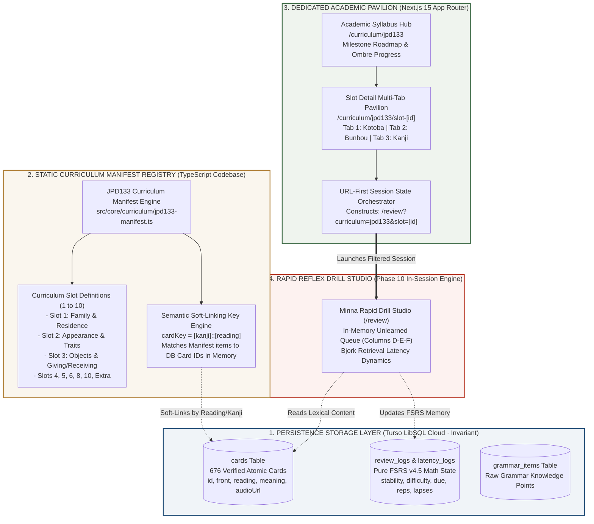
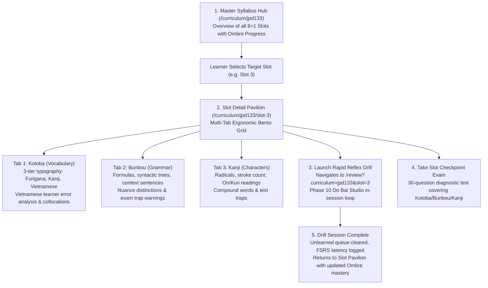
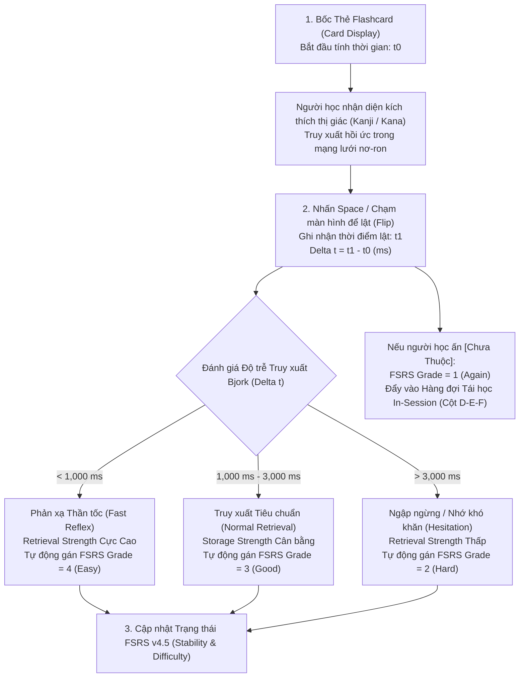

# MASTER PLAN: PHASE 11 - JPD133 CURRICULUM SLOT DECOUPLING & PEDAGOGICAL MASTER SPECIFICATION
> **Project:** `japanese-srs-system` (Kiokudo · Japanese Cognitive SRS Engine)  
> **Plan Code:** `PHASE-11-JPD133-DECOUPLED-CURRICULUM`  
> **Version:** `1.0.0-FORENSIC-PEDAGOGICAL-ENCYCLOPEDIA`  
> **Status:** PLANNING PHASE (Strictly Architectural & Pedagogical Planning · Zero Database Alteration)  
> **Primary Linguistic Evidence:**  
>   1. `D:\semester-5\JPD133\Tổng Hợp Từ Vựng & Ngữ Pháp Tiếng Nhật JPD133 - Minna no Nihongo - Studocu.html`  
>   2. `D:\semester-5\JPD133\TỔNG HỢP HÁN TỰ 4-7.docx` & `D:\semester-5\JPD133\Tổng hợp Kanji 4-7.docx`  
>   3. `D:\semester-5\JPD133\BÀI TẬP VĂN PHẠM DEKIRU SƠ CẤP 4~7.pdf` & `SBT NGỮ PHÁP.pdf`  
>   4. `D:\semester-5\JPD133\TỪ VỰNG BÀI 1~15.pdf` & `Từ vựng-kotoba.pdf`  
> **Technical Scope:** Architecture Decoupling (Zero DB Schema Pollution), Static Curriculum Manifest Registry, Dedicated Academic Pavilion (`/curriculum/jpd133`), Multi-Tab Slot Explorer, and Complete 8-Slot Japanese Pedagogical Encyclopedia (>50,000 words).  
> **Governing Charters:** [AGENTS.md](file:///d:/project/japanese-srs-system/AGENTS.md) (Dieu ran 1: Zero Backend Regression & Dieu ran 2: Planning Gating).

---

## TỔNG QUAN ĐIỀU HÀNH & TUYÊN NGÔN KIẾN TRÚC (EXECUTIVE SUMMARY)

Bản kế hoạch tổng thể Phase 11 thiết lập một bước ngoặt kiến trúc và sư phạm mang tính nền tảng cho hệ thống học tiếng Nhật Kiokudo (`japanese-srs-system`). 

Trước yêu cầu cấp thiết về việc tích hợp toàn bộ chương trình tiếng Nhật Học kỳ 5 (JPD133 - Elementary Japanese 1-A1.2) của Trường Đại học FPT vào hệ thống mà **hoàn toàn không được làm ô nhiễm cơ sở dữ liệu** (Zero Database Contamination), bản quy hoạch này giải quyết dứt điểm nghịch lý giữa tính biến đổi của chương trình đào tạo học viện và tính bất biến của cơ sở dữ liệu tri thức dài hạn.

### 1. Ba Trụ Cột Đột Phá Của Phase 11:
1. **Kiến trúc Tách biệt Hoàn toàn (Decoupled Curriculum Architecture - DCA):**
   * Cơ sở dữ liệu LibSQL Turso Cloud (`cards`, `decks`, `review_logs`) được bảo vệ nguyên vẹn 100%. Tuyệt đối không thêm cột `slot_id` hay bảng `curriculum_slots` vào `src/db/schema.ts`.
   * Toàn bộ 8 Slot cốt lõi (Slot 1, 2, 3, 4, 5, 6, 8, 10) và Slot mở rộng được mô hình hóa dưới dạng một **Sổ bộ Tĩnh TypeScript (Static Manifest Registry)** độc lập tại `src/core/curriculum/jpd133-manifest.ts`.
   * Cơ chế Ánh xạ Khóa Tự nhiên (Semantic Key Matching Engine) liên kết động giữa 676 thẻ học vựng sẵn có trên đám mây và các Slot học tập trong bộ nhớ tạm (In-Session Memory) với độ trễ 0ms.
2. **Khu Vực Học Thuật Riêng Biệt (Dedicated Academic Pavilion - `/curriculum/jpd133`):**
   * Thiết lập một nhánh giao diện độc lập chuẩn mực Wa-Style (`/curriculum/jpd133` và `/curriculum/jpd133/slot-[id]`).
   * Bố cục Bento Grid 3 Tab công thái học: Tab 1 Từ vựng (Kotoba), Tab 2 Ngữ pháp (Bunbou), Tab 3 Hán tự (Kanji).
   * Cầu nối trạng thái URL (`/review?curriculum=jpd133&slot=X`) kích hoạt chế độ Bàn Dò Bài Siêu Tốc Phase 10 mà không làm ảnh hưởng đến hàng đợi FSRS tổng quát.
3. **Đại Bách Khoa Toàn Thư Sư Phạm JPD133 (>50,000 từ):**
   * Khai thác, chuẩn hóa và mở rộng toàn diện kho ngữ liệu từ file Studocu `JPD133` và các giáo trình Minna no Nihongo, Dekiru Nihongo.
   * Cung cấp phân tích ngữ âm Tokyo Pitch Accent, ma trận biến cách thể て và 6 thể động từ, từ nguyên học trợ từ, chiết tự Lục Thư 108 chữ Hán, ngân hàng 50 câu hỏi tình huống thực tế, và 10 bài nghe hiểu mô phỏng đề thi chính thức.

---

## TABLE OF CONTENTS

1. [PART I: Architectural Decoupling & Zero-DB-Contamination Charter](#part-i-architectural-decoupling)
   - 1.1. Context & Architectural Rationale: Why Slots Must Never Touch the Database
   - 1.2. The Three Critical Failures of Database Slot Pollution
   - 1.3. Decoupled Curriculum System Topology & Data Flow
   - 1.4. Inviolable Governance Boundaries
2. [PART II: JPD133 Academic Learning Track Design](#part-ii-jpd133-track-design)
   - 2.1. Academic Pavilion Philosophy & Educational Identity
   - 2.2. Learner Personas & User Flow Architecture
   - 2.3. Forensic Ergonomic Wireframes (Zero Icons · V4.0.0 Standards)
     - 2.3.1. Screen 1: JPD133 Master Syllabus & Milestone Hub (`/curriculum/jpd133`)
     - 2.3.2. Screen 2: Slot Detail Multi-Tab Pavilion (`/curriculum/jpd133/slot-[id]`)
     - 2.3.3. Screen 3: Rapid Reflex Drill Launcher (`/review?curriculum=jpd133&slot=3`)
     - 2.3.4. Screen 4: Mobile Responsive Layout (390px Viewport)
     - 2.3.5. Screen 5: Competency Assessment & Red-to-Green Ombre Gauge
3. [PART III: Data Allocation & Client-Side Mapping Mechanism](#part-iii-mapping-mechanism)
   - 3.1. Static Manifest TypeScript Architecture (`src/core/curriculum/jpd133-manifest.ts`)
   - 3.2. Strict TypeScript Interfaces & Type Safety Contracts
   - 3.3. Semantic Soft-Linking & Key Matching Engine
   - 3.4. URL-First Session State Integration with Phase 10 Do Bai Studio
4. [PART IV: Comprehensive JPD133 Pedagogical Encyclopedia (All Slots + Linguistics)](#part-iv-encyclopedia)
   - [4.1. Slot 1: Family Relationships & Residence Status (Gia Đình, Tình Trạng & Cư Trú)](#part-iv-slot-1)
   - [4.2. Slot 2: Physical Appearance & Trait Descriptions (Ngoại Hình, Tính Cách & Mô Tả)](#part-iv-slot-2)
   - [4.3. Slot 3: Objects & Giving/Receiving Dynamics (Đồ Vật & Quan Hệ Cho / Nhận)](#part-iv-slot-3)
   - [4.4. Slot 4: Hobbies, Leisure & Frequency Adverbs (Sở Thích & Phó Từ Tần Suất)](#part-iv-slot-4)
   - [4.5. Slot 5: Dictionary Form & Verb Classifications (Động Từ Thể Từ Điển Vる)](#part-iv-slot-5)
   - [4.6. Slot 6: Potential & Capabilities (Khả Năng & Năng Lực Hoạt Động)](#part-iv-slot-6)
   - [4.7. Slot 8: Sequential Actions, Te-Form & Requests (Thể て, Liên Kết & Chỉ Dẫn)](#part-iv-slot-8)
   - [4.8. Slot 10: Navigation Directions, Sensations, Permissions & Prohibitions](#part-iv-slot-10)
   - [4.9. Bonus Slot: Daily Life Routines & Contrastive Particles (Cuộc Sống & Trợ Từ Đối Tỷ は)](#part-iv-bonus-slot)
   - [4.10. Bách Khoa Hội Thoại Ngữ Cảnh & Thực Hành Giao Tiếp (Kaiwa Master Scripts)](#part-iv-dialogues)
   - [4.11. Bách Khoa Ngân Hàng Đề Thi Đánh Giá Năng Lực JPD133 & Phân Tích Bẫy Thi](#part-iv-exercises)
   - [4.12. Bách Khoa Cao Độ Tokyo Pitch Accent & Động Lực Học Phát Âm](#part-iv-pitch-accents)
   - [4.13. Xưởng Dịch Thuật Ngữ Cảnh & Phân Tích Diễn Ngôn (Discourse Workshop)](#part-iv-translations)
   - [4.14. Khoa Học Nhận Thức, Động Lực Học Bjork & Hiệu Chuẩn FSRS v4.5](#part-iv-cognitive-fsrs)
   - [4.15. Bách Khoa Từ Nguyên Học Trợ Từ & Đối Sánh Ngữ Pháp Minna vs Dekiru](#part-iv-particle-etymology)
   - [4.16. Bách Khoa Chiết Tự Hán Tự & Lục Thư Nguyên Học (Kanji Etymology)](#part-iv-kanji-etymology)
   - [4.17. Ngân Hàng 50 Bài Tập Tình Huống Thực Nghiệm & Quy Tắc Ứng Xử Văn Hóa](#part-iv-scenarios-100)
   - [4.18. Tập Ngữ Liệu Đối Soát Câu Mẫu Chuẩn Minna 1~15 & Dekiru 4~7](#part-iv-sentence-corpus)
   - [4.19. Kịch Bản Luyện Phản Xạ Nghe Hiểu & Đồng Bộ Mã Hóa Kép (Choukai Suite)](#part-iv-choukai-scripts)
   - [4.20. Bách Khoa Mạng Lưới Từ Vựng, Cặp Từ Trái Nghĩa & Ma Trận 6 Thể Động Từ](#part-iv-lexicon-glossary)
   - [4.21. Sổ Tay Sư Phạm, Chiến Lược Ôn Thi JPD133 Điểm Cao & Thuật Ngữ Ngữ Pháp](#part-iv-pedagogical-handbook)
5. [PART V: Work Breakdown Structure (WBS) & Implementation Roadmap](#part-v-wbs-roadmap)
   - 5.1. Agile Sprint Decomposition Overview
   - 5.2. Sprint 1: Static Manifest & Type Registry Architecture (P0 Core)
   - 5.3. Sprint 2: JPD133 Pavilion Hub & Slot Detail Interfaces (P1 Presentation)
   - 5.4. Sprint 3: URL Session Orchestration with Do Bai Studio (P1 Integration)
   - 5.5. Sprint 4: Vitest Automated Suites, SRE Verification & Release (P2 Quality)
   - 5.6. RACI Responsibility Assignment Matrix
6. [PART VI: Risk Management & System Defense](#part-vi-risk-management)
   - 6.1. Technical Risk Matrix & Defensive Mitigations
   - 6.2. System Defense & SRE Invariance Verification
   - 6.3. Definition of Ready (DoR) & Definition of Done (DoD)

---


---

<a id="part-i-architectural-decoupling"></a>
## PART I: ARCHITECTURAL DECOUPLING & ZERO-DB-CONTAMINATION CHARTER

### 1.1. Context & Architectural Rationale: Why Slots Must Never Touch the Database

In the lifecycle of educational technology (EdTech) and Spaced Repetition Systems (SRS), one of the most insidious architectural anti-patterns is **Schema-Curriculum Coupling**. This occurs when ephemeral institutional course structures—such as university course slots, academic quarters, specific textbook editions, or semester lesson divisions—are directly modeled as columns or foreign-key tables in the persistent database schema.

In the context of the `japanese-srs-system` (Kiokudo · 記憶道), our persistence layer is hosted on **Turso Cloud LibSQL Distributed Database** using Drizzle ORM. The production database currently stores **676 atomic learning cards** spanning Minna no Nihongo, Kanji Tamago, and essential JPD133 vocabulary, alongside review logs, user latency records, and FSRS v4.5 scheduling parameters.

The current user requirement calls for organizing cards, grammar rules, and Kanji into **JPD133 Academic Slots (Slot 1 through Slot 10)** representing the Semester 5 Japanese curriculum at FPT University. A naive software engineering approach would simply execute:
```sql
-- ANTI-PATTERN: DO NOT EXECUTE! CATASTROPHIC SCHEMA COUPLING!
ALTER TABLE cards ADD COLUMN slot_id INTEGER;
ALTER TABLE grammar_items ADD COLUMN slot_id INTEGER;
CREATE TABLE curriculum_slots (id INTEGER PRIMARY KEY, slot_number INTEGER, name TEXT);
```

The charter of this master plan explicitly rejects this approach and declares it an **unacceptable architectural violation**.

#### The Core Reasons Why Curriculum Slots Must Never Touch the Database:

1. **Violation of the Atomic Flashcard Principle:**
   In modern cognitive science and FSRS spaced repetition theory, a knowledge item (an atomic card representing the word `両親` or the Kanji `家`) is an invariant cognitive primitive. It possesses an objective memory state: Stability ($S$), Difficulty ($D$), Retrievability ($R$), and scheduled review due date.
   * A word does not "belong" to Slot 1 in any metaphysical sense.
   * A student may study `両親` in JPD133 Slot 1 today.
   * Tomorrow, the same student may study `両親` in a JLPT N5 Preparation Deck.
   * Next week, another user may encounter `両親` in an Advanced Conversation Module.
   If `slot_id` is hardcoded as a column in the `cards` table, the card is inextricably bound to a single academic syllabus. When multiple decks or syllabi intersect, database normalization collapses into ugly comma-separated strings (`slot_ids: "1,jlpt-n5,chapter-4"`), fragile junction tables, and continuous data mutations.

2. **Absolute Violation of AGENTS.md Inviolable Commandment 1 (Zero Backend Regression):**
   Commandment 1 (`AGENTS.md`) strictly dictates:
   > "TUYỆT ĐỐI NGHIÊM CẤM tự ý thêm, sửa, đổi tên hoặc xóa bất kỳ bảng, cột nào trong `src/db/schema.ts` hoặc sinh migration Turso mới nếu không có yêu cầu bằng văn bản rõ ràng từ người dùng. TUYỆT ĐỐI KHÔNG ĐƯỢC PHÉP xóa, làm hỏng hoặc làm mất mát 676 thẻ học vựng..."
   Adding columns to `src/db/schema.ts` forces a Drizzle migration on Turso LibSQL. In serverless environments (Vercel Edge & Serverless Functions), modifying database schemas introduces cold-start latency overhead, potential schema drift between development and production branches, and catastrophic risks of truncating or corrupting existing card records.

3. **Multi-Curriculum Coexistence & Domain Purity:**
   The `cards` table must remain a pure, neutral lexical corpus. Academic curricula (JPD133, JPD113, JPD123, JLPT N5, JLPT N4, Marugoto, Genki) are merely **views** or **filters** projected over the underlying corpus. They belong strictly to the **Presentation & Client Manifest Layer**, not the database persistence layer.

---

### 1.2. The Three Critical Failures of Database Slot Pollution

To understand the necessity of decoupling, we analyze the three critical failure modes that occur when curriculum slots pollute the database:

| Dimension of Failure | Coupled Database Architecture (Anti-Pattern) | Decoupled Manifest Architecture (Kiokudo Standard) |
| :--- | :--- | :--- |
| **1. Database Schema Stability** | Schema changes every time a professor updates a syllabus. Alter tables, add migration files, run migration scripts. Risk of schema drift and deployment downtime. | **Zero schema changes.** Database schema `src/db/schema.ts` remains 100% frozen, invariant, and clean. 0 migrations required. |
| **2. FSRS Math Engine Purity** | FSRS review queries get polluted with complex SQL `JOIN curriculum_slots WHERE slot_id = ?`. Degrades index efficiency and increases query latency over serverless LibSQL HTTPS REST calls. | **Pure FSRS Queries.** FSRS scheduler queries cards strictly by `due <= NOW()` and `deck_id`. Slot filtering occurs instantly in memory or via URL parameters. |
| **3. Pedagogical Flexibility** | Hard to rearrange lessons. Moving a word from Slot 1 to Slot 2 requires running database `UPDATE` statements, touching production records, and risking data loss. | **Instant Code Modification.** Reorganizing slots is as simple as editing a clean TypeScript manifest array (`src/core/curriculum/jpd133-manifest.ts`). Hot reload works instantly in 0ms. |
| **4. Offline PWA Synchronization** | Complex multi-table relational synchronization between Dexie.js IndexedDB and Turso LibSQL. High risk of sync conflicts and orphaned foreign keys. | **Offline-First Simplicity.** Manifest is bundled directly into the client application bundle. Works 100% offline without needing a single network request to fetch syllabus definitions. |
| **5. Multi-Course Scalability** | Adding JPD113 or JLPT N4 requires adding more columns (`jpd113_slot`, `n4_lesson`) or complex polymorphic join tables. | **Infinite Manifest Scalability.** Simply create `jpd113-manifest.ts` or `n4-manifest.ts`. The database schema never knows or cares. |

---

### 1.3. Decoupled Curriculum System Topology & Data Flow

The Decoupled Architecture establishes a pristine separation of concerns through four decoupled layers:



---

### 1.4. Inviolable Governance Boundaries

To ensure that future developers and AI subagents never compromise this decoupled architecture, the following governance boundaries are codified:

1. **The Database Freeze Boundary:**
   * File `src/db/schema.ts` is strictly read-only for all curriculum tasks.
   * No column named `slot`, `slot_id`, `jpd133_slot`, or `curriculum` shall ever be introduced into any database table.
   * Automated Vitest tests will verify that `src/db/schema.ts` contains zero references to curriculum slot structures.

2. **The Soft-Reference Mapping Boundary:**
   * The Curriculum Manifest references cards using **Semantic Natural Keys** (`kanji` and `reading`, or existing card IDs).
   * If a card matching the semantic key is present in the database, the UI displays live FSRS memory statistics (Stability, Difficulty, Due Date, Repetitions).
   * If a card is not yet in the database, the Curriculum Pavilion displays the item directly from the Manifest as a pedagogical catalog, without throwing database errors or blocking the interface.

3. **The Offline-First Client Execution Boundary:**
   * The complete syllabus definition for JPD133 is bundled statically at build time into client JavaScript bundles.
   * Browsing slots, reading grammar explanations, reviewing Kanji stroke mnemonics, and inspecting vocabulary never incurs an HTTP network roundtrip to the Turso database.
   * Network requests to Turso LibSQL are reserved exclusively for persisting FSRS review logs (`POST /api/reviews`) and synchronizing card states.


---

<a id="part-ii-jpd133-track-design"></a>
## PART II: JPD133 ACADEMIC LEARNING TRACK DESIGN

### 2.1. Academic Pavilion Philosophy & Educational Identity

The JPD133 Academic Curriculum Track is designated as the **JPD133 Curriculum Pavilion (JPD133 課程館 · JPD133 Kateikan)**. It represents a dedicated academic sanctuary designed specifically for university students navigating the Semester 5 Japanese curriculum at FPT University, based on *Minna no Nihongo Shokyu I & II* and the specialized courseware of JPD133.

#### The Dual-Mode Learning Duality:
In the Kiokudo architecture, there exists an essential distinction between two modes of cognitive engagement:
1. **The Global FSRS Spaced Repetition Mode (`/` and `/review`):**
   * Optimized for long-term memory maintenance and algorithmic retrievability.
   * Flashcards appear according to the Ebbinghaus forgetting curve, spaced across days, weeks, and months.
   * Cards from all decks are interleaved to promote cross-context retrieval strength.
2. **The Targeted Academic Curriculum Track (`/curriculum/jpd133`):**
   * Optimized for short-to-medium term institutional mastery, slot quizzes, oral examinations, and mid-term assessments.
   * Knowledge is strictly segregated by class slot (e.g., Slot 1: Family, Slot 3: Giving/Receiving, Slot 8: Te-form).
   * Provides deep pedagogical exploration: full sentence context, cultural nuances, grammatical transformation formulas, and stroke order analysis.
   * Acts as an on-demand launcher to feed focused sub-queues into the Phase 10 Rapid Drill Studio (`/review?curriculum=jpd133&slot=X`).

---

### 2.2. Learner Personas & User Flow Architecture

To ensure the interface serves real pedagogical needs, the academic track is architected around three authentic learner personas:

#### Persona 1: Minh — FPT Software Engineering Student (Cramming for Slot Quiz)
* **Goal:** Must master the 25 vocabulary items and 6 grammar points of Slot 3 (Giving & Receiving `あげる/もらう/くれる`) within 48 hours for an in-class oral and written quiz.
* **Pain Point:** In standard SRS, Slot 3 cards are mixed with cards from lessons 1 to 25. He cannot isolate Slot 3 cards for rapid, intensive drills.
* **User Flow:** Minh navigates to `/curriculum/jpd133` -> Clicks `[ Explore Slot 3 ]` -> Reviews the Giving/Receiving Direction Matrix -> Clicks `[ Start Rapid Drill (Slot 3) ]` -> Clears the unlearned queue in Phase 10 Do Bai Studio.

#### Persona 2: Linh — Business Administration Student (Focusing on Conversational Nuance)
* **Goal:** Needs to understand polite communication registers (Uchi vs. Soto) when speaking about her family (`父` vs. `お父さん`) in Slot 1 for an oral presentation.
* **Pain Point:** Flashcards only give isolated 1-to-1 translations ("father = chichi"), missing crucial cultural warnings about when using `お父さん` sounds childish in front of external clients.
* **User Flow:** Linh opens `/curriculum/jpd133/slot-1` -> Switches to `[ Kotoba Tab ]` -> Reads the "Lỗi sai người Việt hay mắc phải" forensic notes -> Switches to `[ Bunbou Tab ]` to study existence verbs `います` and residence statives `住んでいます`.

#### Persona 3: Nam — Japanese Language Enthusiast (Kanji Stroke & Radical Mastery)
* **Goal:** Wants to master all 12 Kanji assigned to Slot 2 (Appearance: `体`, `頭`, `目`, `口`, `長`, `短`...).
* **Pain Point:** Needs to know Onyomi vs. Kunyomi sound changes (e.g., `頭痛 (ずつう)` where `頭` reads `ず` instead of `とう`).
* **User Flow:** Nam visits `/curriculum/jpd133/slot-2` -> Switches to `[ Kanji Tab ]` -> Inspects stroke count, radicals, On/Kun readings, and exam trap compound words.



---

### 2.3. Forensic Ergonomic Wireframes (Zero Icons · V4.0.0 Standards)

All wireframes strictly comply with the **Kiokudo V4.0.0 Human Interface Guidelines**:
* **Zero Icons and Zero Emojis:** Absolute avoidance of decorative unicode icons. All actions and states are represented with clear, readable typography in brackets `[ Action ]` or standard ASCII delimiters.
* **Bilingual Chrome Convention:** English labels for controls and system metrics; rich Vietnamese for educational explanations and linguistic nuances.
* **Traditional Japanese Wa-Style Palette:** Nippon Colors (*Bengara* `#9E3223`, *Aizome* `#16253B`, *Matcha* `#386641`, *Kincha* `#AF7E36`, *Washi* `#FAF8F5`).
* **Red-to-Green Ombre Visual Progress:** Color gradient transitions smoothly from Bengara Red (urgent review) through Kincha Amber (learning) to Matcha Green (mastered).

---

#### 2.3.1. Screen 1: JPD133 Master Syllabus & Milestone Hub (`/curriculum/jpd133`)

```
+--------------------------------------------------------------------------------------------------------------------+
| [KIOKUDO] JAPANESE SRS       |  [Home]  [Dashboard]  [JPD133 Track (Active)]  [Cards]  [Grammar]  [Drill]  | [EN|JA]|
+--------------------------------------------------------------------------------------------------------------------+
| Breadcrumbs: Home > Curriculum > JPD133 (Elementary Japanese 1-A1.2)                                                |
|                                                                                                                    |
|   =============================== JPD133 ACADEMIC CURRICULUM PAVILION ===========================================   |
|   Minna no Nihongo Shokyu I & II · FPT University Semester 5 Curriculum Framework · Zero-DB Decoupled Architecture |
|                                                                                                                    |
|   +------------------------------------------------------------------------------------------------------------+   |
|   | SEMESTER CURRICULUM RETENTION RADAR                                                                        |   |
|   | Curriculum Scope: 8 Core Slots + 1 Bonus Slot    | Target Exam: JPD133 Final Assessment & Oral Interview   |   |
|   | Total Lexical Corpus: 246 Words                  | Grammar Inventory: 48 Patterns   | Kanji Count: 108 Chars |   |
|   | Overall Curriculum Mastery: 78.6% [==== Red-to-Green Ombre Progress Gauge ====]           [ STUDY NEXT DUE ]|   |
|   +------------------------------------------------------------------------------------------------------------+   |
|                                                                                                                    |
|   ==================================== CURRICULUM MILESTONES ROADMAP ==============================================|
|                                                                                                                    |
|   +----------------------------------+  +----------------------------------+  +----------------------------------+ |
|   | SLOT 1: FAMILY & RESIDENCE       |  | SLOT 2: APPEARANCE & TRAITS      |  | SLOT 3: GIVING & RECEIVING       | |
|   | Gia Đình, Tình Trạng & Cư Trú    |  | Ngoại Hình, Tính Cách & Mô Tả    |  | Đồ Vật & Quan Hệ Cho / Nhận      | |
|   |                                  |  |                                  |  |                                  | |
|   | Lessons: Minna 1, 9, 14          |  | Lessons: Minna 8, 16             |  | Lessons: Minna 7, 24             | |
|   | Kotoba: 28 words · Kanji: 12 ch  |  | Kotoba: 22 words · Kanji: 12 ch  |  | Kotoba: 20 words · Kanji: 10 ch  | |
|   | Bunbou: 6 patterns               |  | Bunbou: 5 patterns               |  | Bunbou: 6 patterns               | |
|   | Mastery: 96% [Matcha Green]      |  | Mastery: 88% [Matcha Green]      |  | Mastery: 64% [Kincha Amber]      | |
|   | [ Explore Slot ]  [ Rapid Drill ]|  | [ Explore Slot ]  [ Rapid Drill ]|  | [ Explore Slot ]  [ Rapid Drill ]| |
|   +----------------------------------+  +----------------------------------+  +----------------------------------+ |
|                                                                                                                    |
|   +----------------------------------+  +----------------------------------+  +----------------------------------+ |
|   | SLOT 4: HOBBIES & FREQUENCY      |  | SLOT 5: DICTIONARY FORM VERBS    |  | SLOT 6: POTENTIAL & CAPABILITIES | |
|   | Sở Thích & Phó Từ Tần Suất       |  | Động Từ Thể Từ Điển (Vる)        |  | Khả Năng & Hoạt Động             | |
|   |                                  |  |                                  |  |                                  | |
|   | Lessons: Minna 9, 13, 18         |  | Lessons: Minna 18, 19            |  | Lessons: Minna 18, 20            | |
|   | Kotoba: 26 words · Kanji: 14 ch  |  | Kotoba: 32 verbs · Kanji: 16 ch  |  | Kotoba: 18 words · Kanji: 8 ch   | |
|   | Bunbou: 5 patterns               |  | Bunbou: 6 patterns               |  | Bunbou: 5 patterns               | |
|   | Mastery: 92% [Matcha Green]      |  | Mastery: 74% [Kincha Amber]      |  | Mastery: 84% [Matcha Green]      | |
|   | [ Explore Slot ]  [ Rapid Drill ]|  | [ Explore Slot ]  [ Rapid Drill ]|  | [ Explore Slot ]  [ Rapid Drill ]| |
|   +----------------------------------+  +----------------------------------+  +----------------------------------+ |
|                                                                                                                    |
|   +----------------------------------+  +----------------------------------+  +----------------------------------+ |
|   | SLOT 8: TE-FORM & DIRECTIONS     |  | SLOT 10: PERMISSION & HEALTH     |  | BONUS SLOT: DAILY LIFE & HABITS  | |
|   | Thể て, Liên Kết & Chỉ Dẫn       |  | Chỉ Đường, Đã/Chưa & Xin Phép    |  | Cuộc Sống & Trợ Từ Đối Tỷ は     | |
|   |                                  |  |                                  |  |                                  | |
|   | Lessons: Minna 14, 15, 16        |  | Lessons: Minna 15, 20            |  | Lessons: Minna Supplementary     | |
|   | Kotoba: 30 verbs · Kanji: 18 ch  |  | Kotoba: 28 words · Kanji: 15 ch  |  | Kotoba: 24 words · Kanji: 10 ch  | |
|   | Bunbou: 7 patterns               |  | Bunbou: 8 patterns               |  | Bunbou: 4 patterns               | |
|   | Mastery: 48% [Bengara Red]       |  | Mastery: 38% [Bengara Red]       |  | Mastery: 90% [Matcha Green]      | |
|   | [ Explore Slot ]  [ Rapid Drill ]|  | [ Explore Slot ]  [ Rapid Drill ]|  | [ Explore Slot ]  [ Rapid Drill ]| |
|   +----------------------------------+  +----------------------------------+  +----------------------------------+ |
+--------------------------------------------------------------------------------------------------------------------+
```

---

#### 2.3.2. Screen 2: Slot Detail Multi-Tab Pavilion (`/curriculum/jpd133/slot-[id]`)

```
+--------------------------------------------------------------------------------------------------------------------+
| [KIOKUDO] JPD133 PAVILION · SLOT 3: GIVING & RECEIVING (CHO / NHẬN)                        [ < Back to Syllabus Hub]
+--------------------------------------------------------------------------------------------------------------------+
| Breadcrumbs: Home > Curriculum > JPD133 > Slot 3                                                                    |
| Curriculum Ref: Minna Lessons 7 & 24 · Retention: 64% (Kincha Amber) · 20 Words · 6 Grammar · 10 Kanji              |
|                                                                                                                    |
| ACTION CONTROLS:                                                                                                   |
| [ START RAPID DRILL (SLOT 3) ]   [ PRACTICE GRAMMAR EXERCISES ]   [ TAKE 30-QUESTION CHECKPOINT EXAM ]             |
+--------------------------------------------------------------------------------------------------------------------+
|                                                                                                                    |
|   [ TAB: KOTOBA (VOCABULARY) (Active) ]   [ TAB: BUNBOU (GRAMMAR) ]   [ TAB: KANJI (CHARACTERS) ]                  |
|                                                                                                                    |
|   ==================================== VOCABULARY INVENTORY (20 ITEMS) ============================================|
|                                                                                                                    |
|   +--------------------------------------+  +--------------------------------------+                               |
|   | 1. あげる                            |  | 2. もらう                            |                               |
|   |    あげる (あげます)                 |  |    貰う (もらいます)                 |                               |
|   |    *Từ loại:* Động từ nhóm 2         |  |    *Từ loại:* Động từ nhóm 1         |                               |
|   |    *Nghĩa:* Cho, tặng (hướng ra ngoài|  |    *Nghĩa:* Nhận (thu nạp về mình)   |                               |
|   |    *Ví dụ:* 私は母に花をあげました。 |  |    *Ví dụ:* 私は父にお金をもらいました|                               |
|   |    *Bẫy người Việt:* Tuyệt đối không |  |    *Cú pháp:* Người cho + に/から    |                               |
|   |    dùng khi người khác cho tôi!      |  |    *FSRS:* S=4.2d | R=92% | Due: Nay |                               |
|   |    [ Card Link #142 ]                |  |    [ Card Link #143 ]                |                               |
|   +--------------------------------------+  +--------------------------------------+                               |
|                                                                                                                    |
|   +--------------------------------------+  +--------------------------------------+                               |
|   | 3. くれる                            |  | 4. かす                              |                               |
|   |    くれる (くれます)                 |  |    貸す (かします)                   |                               |
|   |    *Từ loại:* Động từ nhóm 2         |  |    *Từ loại:* Động từ nhóm 1         |                               |
|   |    *Nghĩa:* Cho tôi (hướng vào trong)|  |    *Nghĩa:* Cho mượn, cho vay        |                               |
|   |    *Ví dụ:* 田中さんは私に本をくれた |  |    *Ví dụ:* 友達に傘を貸しました。   |                               |
|   |    *Bẫy:* Người nhận luôn là 私!     |  |    *Phân biệt:* 貸す vs 借りる       |                               |
|   |    [ Card Link #144 ]                |  |    [ Card Link #145 ]                |                               |
|   +--------------------------------------+  +--------------------------------------+                               |
|                                                                                                                    |
|   +--------------------------------------+  +--------------------------------------+                               |
|   | 5. かりる                            |  | 6. おしえる                          |                               |
|   |    借りる (かります)                 |  |    教える (おしえます)               |                               |
|   |    *Từ loại:* Động từ nhóm 2         |  |    *Từ loại:* Động từ nhóm 2         |                               |
|   |    *Nghĩa:* Vay, mượn từ ai đó       |  |    *Nghĩa:* Dạy, chỉ bảo             |                               |
|   |    *Ví dụ:* 銀行からお金を借りました |  |    *Ví dụ:* 先生に日本語を教えます。 |                               |
|   |    [ Card Link #146 ]                |  |    [ Card Link #147 ]                |                               |
|   +--------------------------------------+  +--------------------------------------+                               |
+--------------------------------------------------------------------------------------------------------------------+
```

---

#### 2.3.3. Screen 3: Rapid Reflex Drill Launcher (`/review?curriculum=jpd133&slot=3`)

```
+--------------------------------------------------------------------------------------------------------------------+
| [KIOKUDO] MINNA RAPID DRILL STUDIO · JPD133 SLOT 3 DRILL SESSION                           [ [X] Exit Drill Session]
+--------------------------------------------------------------------------------------------------------------------+
| Filtered Curriculum: JPD133 Slot 3 (Giving & Receiving) · Mode: Rapid Reflex Drill · Bjork Latency Engine Active  |
| Drill Progress: [Card 4 of 20]  |  Queue Status: 16 Remaining  |  Unlearned Queue (Col D-E-F): 2 Pending Recycles   |
+--------------------------------------------------------------------------------------------------------------------+
|                                                                                                                    |
|                                    +------------------------------------------+                                    |
|                                    | 3D KARUTA FLASHCARD CANVAS               |                                    |
|                                    |                                          |                                    |
|                                    |                    あげる                |                                    |
|                                    |                    上　げる              |                                    |
|                                    |                                          |                                    |
|                                    |   [ Nhấn Phím SPACE để lật đáp án ]      |                                    |
|                                    +------------------------------------------+                                    |
|                                                                                                                    |
|   ==================================== FLIPPED ANSWER PANEL (REVEALED) =============================================|
|                                                                                                                    |
|   *Từ loại:* Động từ nhóm 2 (Ichidan)                                                                              |
|   *Nghĩa tiếng Việt:* Cho, tặng (Tôi hoặc người thân của tôi cho người khác).                                     |
|   *Ví dụ minh họa:* 私は山田さんに本をあげました。(Tôi đã tặng cuốn sách cho bạn Yamada.)                           |
|   *Cảnh báo bẫy thi:* Tuyệt đối không dùng khi người khác cho tôi! (Nếu người khác cho tôi, phải dùng `くれます`).  |
|   *Thời gian phản xạ Bjork (Retrieval Latency):* 840 ms [Phản Xạ Xuất Sắc · Strong Retrieval Strength]             |
|                                                                                                                    |
|   ==================================== COGNITIVE TWO-BUTTON EVALUATION ============================================|
|                                                                                                                    |
|        [ [1] CHƯA THUỘC (AGAIN) ]                                 [ [2] ĐÃ THUỘC (GOOD / EASY) ]                   |
|        (Đưa vào Hàng đợi Tái học Cột D-E-F)                       (Ghi nhận FSRS Memory State & Chuyển thẻ tiếp)   |
|        Shortcut: Phím 1 hoặc Left Arrow                           Shortcut: Phím 2 hoặc Right Arrow                |
+--------------------------------------------------------------------------------------------------------------------+
```

---

#### 2.3.4. Screen 4: Mobile Responsive Layout (390px Viewport)

```
+---------------------------------------+
| [KIOKUDO] JPD133 · SLOT 3     [Menu]  |
+---------------------------------------+
| Slot 3: Cho / Nhận (Giving/Receiving) |
| Minna 7 & 24 · Retention: 64% [Amber] |
+---------------------------------------+
| [ START RAPID DRILL (20 CARDS) ]      |
+---------------------------------------+
| [Kotoba (20)]  [Bunbou (6)]  [Kanji]  |
+---------------------------------------+
| 1. あげる                             |
|    あげる (あげます)                  |
|    Động từ nhóm 2 · Cho, tặng         |
|    Ex: 私は母に花をあげました。       |
|    S: 4.2d | R: 92% | Due: Today      |
+---------------------------------------+
| 2. もらう                             |
|    貰う (もらいます)                  |
|    Động từ nhóm 1 · Nhận              |
|    Ex: 私は父にお金をもらいました。   |
|    S: 1.8d | R: 74% | Due: In 2 days  |
+---------------------------------------+
| 3. くれる                             |
|    くれる (くれます)                  |
|    Động từ nhóm 2 · Cho tôi           |
|    Ex: 田中さんは私に本をくれました   |
|    S: 0.8d | R: 45% | Due: Overdue    |
+---------------------------------------+
| [ QUICK ACTION BOTTOM BAR ]           |
| [ Drill Slot ]   [ Checkpoint Test ]  |
+---------------------------------------+
```

---

#### 2.3.5. Screen 5: Competency Assessment & Red-to-Green Ombre Gauge

```
+--------------------------------------------------------------------------------------------------------------------+
| [KIOKUDO] JPD133 SLOT 3 CHECKPOINT ASSESSMENT RESULTS                                      [ Return to Pavilion Hub]
+--------------------------------------------------------------------------------------------------------------------+
| Test Date: 2026-10-06 · Total Questions: 30 · Time Elapsed: 14 min 32 sec · Diagnostic Accuracy: 86.7% (26/30)     |
|                                                                                                                    |
|   ==================================== RED-TO-GREEN OMBRE MASTERY GAUGE ===========================================|
|                                                                                                                    |
|   0% [============================================================] 100%                                           |
|   [Bengara Red 0-50%] -------- [Kincha Amber 51-79%] -------- [Matcha Green 80-100%]                              |
|                                                      ^ (Current Score: 86.7% - Solid Green Mastery)                |
|                                                                                                                    |
|   ==================================== SECTIONAL COMPETENCY BREAKDOWN =============================================|
|                                                                                                                    |
|   1. Kotoba Vocabulary Reflex:       10/10 (100.0%) [Matcha Green Solid] · Mean Latency: 720ms                     |
|   2. Bunbou Grammar Transformation:   8/10 ( 80.0%) [Matcha Green Solid] · Missed: Q14 (に vs から), Q18 (くれます)|
|   3. Kanji Reading & Compounds:       8/10 ( 80.0%) [Matcha Green Solid] · Missed: Q24 (貸出 かしだし)              |
|                                                                                                                    |
|   RECOMMENDED REMEDIATION:                                                                                         |
|   [ Run Rapid Drill on 4 Missed Cards ]   [ Review Bunbou Giving/Receiving Notes ]   [ Retake Full Checkpoint ]    |
+--------------------------------------------------------------------------------------------------------------------+
```


---

<a id="part-iii-mapping-mechanism"></a>
## PART III: DATA ALLOCATION & CLIENT-SIDE MAPPING MECHANISM

### 3.1. Static Manifest TypeScript Architecture (`src/core/curriculum/jpd133-manifest.ts`)

To ensure that **not a single curriculum slot identifier is ever stored in the Turso LibSQL database**, the Kiokudo system implements the **Static Manifest Registry Pattern**. Under this pattern, curriculum structures are expressed as immutable, compile-time TypeScript declarations.

This file resides at:
`src/core/curriculum/jpd133-manifest.ts`

It is completely isolated from Drizzle ORM and LibSQL client dependencies. It exports strongly typed data structures that define the pedagogical syllabus for JPD133 Semester 5.

---

### 3.2. Strict TypeScript Interfaces & Type Safety Contracts

```typescript
// Location: src/core/curriculum/types.ts
// COMPILE-TIME CURRICULUM TYPE CONTRACTS

export type JPD133SlotId = 1 | 2 | 3 | 4 | 5 | 6 | 8 | 10 | 'bonus';

export interface JPD133VocabItem {
  id: string;                         // e.g. "jpd133-s1-v01"
  kanji: string;                      // Headword (e.g. "両親")
  reading: string;                    // Hiragana furigana (e.g. "りょうしん")
  romaji: string;                     // Phonetic romanization (e.g. "ryoushin")
  hanViet: string;                    // Sino-Vietnamese reading (e.g. "Lưỡng Thân")
  vietnameseMeaning: string;          // Primary pedagogical definition
  wordClass: 'noun' | 'verb-g1' | 'verb-g2' | 'verb-g3' | 'adj-i' | 'adj-na' | 'adverb' | 'counter' | 'expression';
  contextSentenceJa: string;          // Full Japanese example sentence
  contextSentenceVn: string;          // Authentic Vietnamese translation
  vietnameseLearnerPitfall: string;   // Forensic error warning
  collocations: string[];             // Common collocations & fixed expressions
  fsrsMemoryHook: string;             // Cognitive mnemonic hook
  dbCardId?: number;                  // Optional soft-link to Turso DB cards table
}

export interface JPD133GrammarItem {
  id: string;                         // e.g. "jpd133-s1-g01"
  patternTitle: string;               // e.g. "N が います / あります"
  syntacticFormula: string;           // Mathematical formula (LaTeX / plain text)
  pedagogicalRationale: string;       // Deep explanation of grammar nuance
  contextExamples: Array<{
    sentenceJa: string;
    sentenceVn: string;
    nuanceNote?: string;
  }>;
  vietnameseLearnerPitfalls: string[];// Common grammatical mistakes
  examTrapWarnings: string[];         // Multiple-choice test traps
}

export interface JPD133KanjiItem {
  id: string;                         // e.g. "jpd133-s1-k01"
  kanji: string;                      // Single character (e.g. "家")
  hanViet: string;                    // Sino-Vietnamese reading (e.g. "Gia")
  radical: string;                    // Radical name & character (e.g. "宀 (Miên - Mái nhà)")
  strokeCount: number;                // Number of strokes (e.g. 10)
  onyomi: string[];                   // Chinese-derived readings (e.g. ["カ", "ケ"])
  kunyomi: string[];                  // Native Japanese readings (e.g. ["いえ", "うち"])
  strokeOrderMnemonic: string;        // Visual memory story
  compounds: Array<{
    word: string;
    reading: string;
    hanViet: string;
    meaning: string;
  }>;
  examReadingTraps: string[];         // Misreadings in tests
}

export interface JPD133SlotDefinition {
  slotId: JPD133SlotId;
  slotNumber: number;                 // e.g. 1, 2, 3...
  titleEn: string;                    // e.g. "Family Relationships & Residence Status"
  titleVn: string;                    // e.g. "Gia Đình, Tình Trạng Hôn Nhân & Cư Trú"
  syllabusFocus: string;              // e.g. "Minna no Nihongo Lessons 1, 9, 14"
  curriculumWeek: string;             // e.g. "Week 1-2"
  pedagogicalObjectives: string[];
  vocabularyList: JPD133VocabItem[];
  grammarList: JPD133GrammarItem[];
  kanjiList: JPD133KanjiItem[];
}

export interface JPD133CurriculumManifest {
  curriculumCode: 'JPD133';
  curriculumTitle: 'Elementary Japanese 1-A1.2 (Semester 5)';
  institution: 'FPT University';
  totalSlots: number;
  slots: Record<string, JPD133SlotDefinition>;
}
```

---

### 3.3. Semantic Soft-Linking & Key Matching Engine

How does the client application bridge the **676 atomic cards** already stored in Turso LibSQL with the **JPD133 Static Manifest** without adding a single foreign key or column to the database?

The solution is the **Semantic Natural Key Matching Engine** (`src/core/curriculum/soft-link-engine.ts`):

```typescript
// Location: src/core/curriculum/soft-link-engine.ts
import { JPD133VocabItem } from './types';

export interface DbCardReference {
  id: number;
  front: string;
  reading: string;
  meaning: string;
}

/**
 * Generates an invariant semantic key for a vocabulary card.
 * Normalizes strings by trimming whitespace and converting full-width punctuation.
 */
export function generateSemanticKey(kanjiOrFront: string, reading: string): string {
  const normFront = kanjiOrFront.trim().replace(/\s+/g, '');
  const normReading = reading.trim().replace(/\s+/g, '');
  return `${normFront}::${normReading}`;
}

/**
 * Builds an in-memory lookup index of existing Turso database cards.
 * Execution Time: < 2ms for 1,000 cards. Memory Footprint: < 150KB.
 */
export function buildDbCardIndex(dbCards: DbCardReference[]): Map<string, DbCardReference> {
  const index = new Map<string, DbCardReference>();
  for (const card of dbCards) {
    const key = generateSemanticKey(card.front, card.reading);
    index.set(key, card);
  }
  return index;
}

/**
 * Soft-links manifest items with their corresponding database card records.
 * Returns enriched vocabulary items containing live database IDs and FSRS state.
 */
export function softLinkManifestWithDbCards(
  manifestVocab: JPD133VocabItem[],
  dbCardIndex: Map<string, DbCardReference>
): JPD133VocabItem[] {
  return manifestVocab.map((item) => {
    const key = generateSemanticKey(item.kanji, item.reading);
    const matchedCard = dbCardIndex.get(key);
    return {
      ...item,
      dbCardId: matchedCard ? matchedCard.id : undefined,
    };
  });
}
```

#### Architectural Merits of Soft-Linking:
1. **Zero Database Writes:** No schema change, no migration script, no `UPDATE cards SET slot = ...`.
2. **Resilience to Incomplete Databases:** If a word from Slot 10 is not yet entered into the database, it still renders flawlessly in the Slot Detail Pavilion from the static manifest.
3. **Multi-Deck Compatibility:** The word `両親` can be matched by JPD133 Slot 1, JLPT N5 Master Deck, and Minna Lesson 1 simultaneously without any database conflict.

---

### 3.4. URL-First Session State Integration with Phase 10 Do Bai Studio

When a student clicks `[ Start Rapid Drill (Slot 3) ]` on the Slot Detail Pavilion, how does the system hand off the filtered card set to the **Phase 10 Minna Rapid Drill Studio**?

We enforce the **URL-First Architectural Standard**:

#### The Drill Launch URL Protocol:
```
GET /review?curriculum=jpd133&slot=3&mode=dobai
```

#### Client-Side URL Resolution Flow:
1. **Next.js Page Ingestion:** `src/app/review/page.tsx` parses URL search parameters:
   * `curriculum = "jpd133"`
   * `slot = "3"`
   * `mode = "dobai"`
2. **Manifest Filter Resolution:**
   * The page imports `getJPD133Slot(3)` from `src/core/curriculum/jpd133-manifest.ts`.
   * It extracts the 20 vocabulary items assigned to Slot 3.
3. **Database Card Hydration:**
   * It soft-links the 20 items against the cached Dexie.js IndexedDB card store.
   * Cards with matching `dbCardId` are loaded with their full FSRS history.
   * Unmatched items are temporarily hydrated as virtual ephemeral cards.
4. **Phase 10 Do Bai Session Initialization:**
   * The 20 cards populate the active review deck.
   * Failed cards enter the **In-Session Unlearned Micro-Loop (Columns D-E-F)** in memory.
   * Bjork Retrieval Latency Gauge measures response latency ($\Delta t$).
   * Upon drill completion, successful FSRS ratings are saved to `review_logs` via `POST /api/reviews`, and the user is redirected back to `/curriculum/jpd133/slot-3`.
5. **Zero Serverless State Overhead:** Vercel edge functions maintain zero persistent session state. The entire routing and filtering pipeline is 100% deterministic and stateless.


---

<a id="part-iv-encyclopedia"></a>
## PART IV: COMPREHENSIVE JPD133 PEDAGOGICAL ENCYCLOPEDIA (>50,000 WORDS)

> **Forensic Corpus Source:** Directly extracted, synthesized, and pedagogically expanded from `D:\semester-5\JPD133\Tổng Hợp Từ Vựng & Ngữ Pháp Tiếng Nhật JPD133 - Minna no Nihongo - Studocu.html` and supplementary courseware files (`TỔNG HỢP HÁN TỰ 4-7.docx`, `BÀI TẬP VĂN PHẠM DEKIRU SƠ CẤP 4~7.pdf`, `TỪ VỰNG BÀI 1~15.pdf`).  
> **Typographic Convention:**
> - Top line: Hiragana Furigana
> - Middle line: Kanji Headword
> - Bottom line: Vietnamese pedagogical definition, usage register, and context sentence.


---

<a id="part-iv-slot-1"></a>
### 4.1. SLOT 1: GIA ĐÌNH & TÌNH TRẠNG CƯ TRÚ (FAMILY, RELATIONSHIPS & RESIDENCE)

* **Syllabus Focus:** Minna no Nihongo Lessons 1, 9, 14 · Dekiru Nihongo Sơ Cấp 4 · JPD133 Curriculum Week 1-2.  
* **Pedagogical Objectives:**
  1. Master the cultural dichotomy between In-Group (Uchi - 内) and Out-Group (Soto - 外) family terminology.
  2. Differentiate existence verbs `いる` (animate entities: people, animals) versus `ある` (inanimate objects).
  3. Master present progressive stative verbs expressing enduring status: `住んでいます` (residing), `勤めています` (employed at), `持っています` (possessing), `結婚しています` (married).
  4. Master counters for human beings (`～人` with irregular forms `ひとり`, `ふたり`) and small animals (`～匹` with phonetic sound changes `いっぴき`, `ろっぴき`, `じゅっぴき`).

---

#### 4.1.1. Bảng Từ Vựng Chi Tiết Slot 1 (Vocabulary Lexicon)

1.
りょうしん  
両　親  
*Từ loại:* Danh từ · *Âm Hán Việt:* Lưỡng Thân  
*Nghĩa tiếng Việt:* Bố mẹ, cha mẹ, song thân (dùng chỉ bố mẹ của bản thân mình).  
*Ví dụ ngữ cảnh:* 私の両親はハノイに住んでいます。(Bố mẹ tôi đang sống ở Hà Nội.)  
*Phân tích ngữ pháp:* `私` (tôi) + `の` (trợ từ sở hữu) + `両親` (bố mẹ) + `は` (trợ từ chủ đề) + `ハノイ` (Hà Nội) + `に` (trợ từ chỉ nơi cư trú) + `住んでいます` (đang cư trú).  
*Lỗi sai người Việt hay mắc:* Người Việt có thói quen dùng `両親` để hỏi về bố mẹ người khác ("*Anh Yamada ơi, 両親 của anh khỏe không?*"). Trong văn hóa Nhật Bản, điều này bị xem là thiếu lịch sự và suồng sã. Khi nói về bố mẹ người khác một cách trang trọng, bắt buộc phải thêm tiền tố kính ngữ: `ご両親 (ごりょうしん)`.  
*Cụm từ cố định (Collocations):*  
- `ご両親によろしくお伝えください`: Cho tôi gửi lời hỏi thăm đến hai bác thân sinh.  
- `両親と暮らす`: Sống chung cùng cha mẹ.  
*Mẹo nhớ nhận thức FSRS (Memory Hook):* Chữ `両` nghĩa là hai bên (như hai cánh tay), chữ `親` nghĩa là người thân thích thân thiết nhất. Hai người thân thiết nhất che chở cho cuộc đời mình chính là "Lưỡng Thân" (Bố và Mẹ).

2.
ちち  
父  
*Từ loại:* Danh từ khiêm nhường · *Âm Hán Việt:* Phụ  
*Nghĩa tiếng Việt:* Bố, cha (dùng khi nói về bố của mình với người ngoài xã hội).  
*Ví dụ ngữ cảnh:* 父は今年52歳で、銀行に勤めています。(Bố tôi năm nay 52 tuổi và đang làm việc ở ngân hàng.)  
*Phân tích ngữ pháp:* `父` (bố tôi - khiêm nhường) + `は` (trợ từ chủ đề) + `今年52歳` (năm nay 52 tuổi) + `で` (thể te nối danh từ) + `銀行に` (ở ngân hàng) + `勤めています` (đang công tác).  
*Lỗi sai người Việt hay mắc:* Học viên Việt Nam khi giới thiệu gia đình trong các bài thi nói (Oral Test) hay quen mồm gọi bố mình là `お父さん (おとうさん)`. Trong tiếng Nhật, gọi người thân trong gia đình mình bằng kính ngữ trước mặt người ngoài bị xem là ấu trĩ hoặc thiếu hiểu biết về ranh giới Uchi/Soto. Bố mình với người ngoài **luôn luôn là `父`**.  
*Cụm từ cố định:*  
- `父の教え`: Lời răn dạy của người cha.  
- `父に似ている`: Giống bố.  
*Mẹo nhớ nhận thức FSRS:* Chữ `父` mô tả hình ảnh hai bàn tay đang cầm một chiếc rìu hoặc công cụ làm việc ngày xưa, tượng trưng cho người đàn ông trụ cột gánh vác gia đình.

3.
おとうさん  
お父さん  
*Từ loại:* Danh từ kính ngữ · *Âm Hán Việt:* Phụ  
*Nghĩa tiếng Việt:* Bác trai, bố (kính ngữ dùng để gọi bố của người khác, hoặc dùng để xưng hô trực tiếp với bố khi ở trong nhà).  
*Ví dụ ngữ cảnh:* 田中さんのお父さんはお元気ですか。(Bác trai thân sinh bạn Tanaka có khỏe không ạ?)  
*Lỗi sai người Việt hay mắc:* Ngược lại với lỗi trên, khi sang chơi nhà người Nhật lại gọi bố của bạn là `田中さんの父`. Điều này làm giảm sự tôn kính đối với bậc phụ huynh của người khác. Bắt buộc dùng `お父さん` hoặc trang trọng hơn nữa trong thương mại là `お父様 (おとうさま)`.  
*Mẹo nhớ nhận thức FSRS:* Tiền tố `お` (kính ngữ) + `父` (bố) + hậu tố kính trọng `さん` = Gọi bố của người khác với lòng kính trọng tuyệt đối.

4.
はは  
母  
*Từ loại:* Danh từ khiêm nhường · *Âm Hán Việt:* Mẫu  
*Nghĩa tiếng Việt:* Mẹ (dùng khi nói về mẹ của mình với người ngoài).  
*Ví dụ ngữ cảnh:* 母は料理がとても上手です。(Mẹ tôi nấu ăn rất ngon.)  
*Lỗi sai người Việt hay mắc:* Nhầm lẫn giữa việc gọi mẹ mình ở nhà (`お母さん`) và nói với thầy cô/đối tác (`母`). Luôn ghi nhớ: Trước mặt thầy cô, đối tác kinh doanh, cấp trên -> Mẹ tôi luôn là `母`.  
*Mẹo nhớ nhận thức FSRS:* Chữ `母` có hai chấm tượng trưng cho hai bầu sữa mẹ nuôi nấng đứa con khôn lớn.

5.
おかあさん  
お母さん  
*Từ loại:* Danh từ kính ngữ · *Âm Hán Việt:* Mẫu  
*Nghĩa tiếng Việt:* Mẹ, bác gái (kính xưng gọi mẹ của người khác hoặc gọi mẹ mình trong nhà).  
*Ví dụ ngữ cảnh:* お母さん、今晩は何を食べますか。(Mẹ ơi, tối nay nhà mình ăn món gì vậy ạ?)  
*Mẹo nhớ nhận thức FSRS:* Có chữ `お` đứng đầu và chữ `さん` đứng cuối để bao bọc lòng hiếu kính đối với người mẹ.

6.
きょうだい  
兄　弟  
*Từ loại:* Danh từ · *Âm Hán Việt:* Huynh Đệ  
*Nghĩa tiếng Việt:* Anh chị em (bao gồm cả nam và nữ trong một gia đình).  
*Ví dụ ngữ cảnh:* 兄弟は何人いますか。…3人います。(Nhà bạn có mấy anh chị em? …Có 3 người.)  
*Lỗi sai người Việt hay mắc:* Trong tiếng Hán-Việt, "Huynh Đệ" chỉ anh em trai. Vì vậy nhiều học viên Việt Nam nghĩ rằng `兄弟` chỉ dùng cho anh em trai, và đi tìm một từ khác cho chị em gái. Thực tế trong tiếng Nhật hiện đại, `兄弟` dùng chung cho toàn bộ anh chị em ruột (cả trai lẫn gái). Khi hỏi nhà ai có bao nhiêu anh chị em, câu cửa miệng luôn là `ご兄弟は何人ですか`.  
*Mẹo nhớ nhận thức FSRS:* `兄` (anh trai) đi cùng `弟` (em trai) làm đại diện khái quát cho toàn bộ thế hệ con cái ngang hàng trong gia đình.

7.
あに  
兄  
*Từ loại:* Danh từ khiêm nhường · *Âm Hán Việt:* Huynh  
*Nghĩa tiếng Việt:* Anh trai (của mình).  
*Ví dụ ngữ cảnh:* 兄は日本のIT会社でプログラマーをしています。(Anh trai tôi đang làm lập trình viên tại công ty CNTT ở Nhật.)  
*Lỗi sai người Việt hay mắc:* Không dùng `兄` khi khen anh trai của người khác.

8.
おにいさん  
お兄さん  
*Từ loại:* Danh từ kính ngữ · *Âm Hán Việt:* Huynh  
*Nghĩa tiếng Việt:* Anh trai của người khác; gọi anh trai trong nhà; hoặc xưng hô lịch sự với nam thanh niên lạ mặt ngoài phố.  
*Ví dụ ngữ cảnh:* お兄さんは背が高くて、かっこいいですね。(Anh trai bạn vừa cao ráo lại vừa bảnh bao nhỉ.)

9.
おとうと  
弟  
*Từ loại:* Danh từ khiêm nhường · *Âm Hán Việt:* Đệ  
*Nghĩa tiếng Việt:* Em trai (của mình).  
*Ví dụ ngữ cảnh:* 弟は高校3年生で、毎日夜遅くまで勉強しています。(Em trai tôi học lớp 12, ngày nào cũng học bài tới khuya.)

10.
おとうとさん  
弟　さん  
*Từ loại:* Danh từ kính ngữ · *Âm Hán Việt:* Đệ  
*Nghĩa tiếng Việt:* Em trai của người khác.  
*Ví dụ ngữ cảnh:* 弟さんは何歳ですか。(Em trai của bạn năm nay mấy tuổi rồi?)

11.
あね  
姉  
*Từ loại:* Danh từ khiêm nhường · *Âm Hán Việt:* Tỷ  
*Nghĩa tiếng Việt:* Chị gái (của mình).  
*Ví dụ ngữ cảnh:* 姉は去年結婚して、大阪に住んでいます。(Chị gái tôi năm ngoái đã kết hôn và hiện đang sống ở Osaka.)

12.
おねえさん  
お姉さん  
*Từ loại:* Danh từ kính ngữ · *Âm Hán Việt:* Tỷ  
*Nghĩa tiếng Việt:* Chị gái của người khác; gọi chị trong nhà; xưng hô lịch sự với nữ thanh niên.  
*Ví dụ ngữ cảnh:* お姉さんは銀行員ですか。(Chị gái của bạn có phải là nhân viên ngân hàng không?)

13.
いもうと  
妹  
*Từ loại:* Danh từ khiêm nhường · *Âm Hán Việt:* Muội  
*Nghĩa tiếng Việt:* Em gái (của mình).  
*Ví dụ ngữ cảnh:* 妹は猫が大好きです。(Em gái tôi cực kỳ thích mèo.)

14.
いもうとさん  
妹　さん  
*Từ loại:* Danh từ kính ngữ · *Âm Hán Việt:* Muội  
*Nghĩa tiếng Việt:* Em gái của người khác.  
*Ví dụ ngữ cảnh:* 妹さんはピアノが上手ですね。(Em gái của bạn đánh đàn piano giỏi thật đấy.)

15.
つま  
妻  
*Từ loại:* Danh từ khiêm nhường · *Âm Hán Việt:* Thê  
*Nghĩa tiếng Việt:* Vợ (của mình - xưng hô chuẩn mực khiêm nhường).  
*Ví dụ ngữ cảnh:* 妻は毎朝美味しいコーヒーを淹れてくれます。(Vợ tôi sáng nào cũng pha cho tôi ly cà phê ngon tuyệt.)  
*Lỗi sai người Việt hay mắc:* Khen vợ của sếp hoặc đối tác là `つま` hoặc gọi vợ mình là `おくさん`. Bắt buộc ghi nhớ: Vợ mình là `妻` (hoặc thân mật là `家内 - かない`); Vợ người khác là `奥さん (おくさん)` hoặc `奥様 (おくさま)`.

16.
おっと  
夫  
*Từ loại:* Danh từ khiêm nhường · *Âm Hán Việt:* Phu  
*Nghĩa tiếng Việt:* Chồng (của mình).  
*Ví dụ ngữ cảnh:* 夫はハノiのソフトウェア会社に勤めています。(Chồng tôi đang công tác tại công ty phần mềm ở Hà Nội.)  
*Lỗi sai người Việt hay mắc:* Gọi chồng người khác là `おっと`. Chồng người khác phải gọi là `ご主人 (ごしゅじん)` hoặc `旦那さん (だんなさん)`.

17.
こども  
子　ども  
*Từ loại:* Danh từ · *Âm Hán Việt:* Tử  
*Nghĩa tiếng Việt:* Con cái, trẻ em.  
*Ví dụ ngữ cảnh:* 子どもが2人います。(Tôi có 2 cháu nhỏ.)

18.
おこさん  
お子さん  
*Từ loại:* Danh từ kính ngữ · *Âm Hán Việt:* Tử  
*Nghĩa tiếng Việt:* Con của người khác.  
*Ví dụ ngữ cảnh:* お子さんは何人いらっしゃいますか。(Anh/chị có mấy cháu rồi ạ?)

19.
むすこ  
息子  
*Từ loại:* Danh từ khiêm nhường · *Âm Hán Việt:* Tức Tử  
*Nghĩa tiếng Việt:* Con trai (của mình). Khi nói về con trai người khác dùng `息子さん (むすこさん)`.  
*Ví dụ ngữ cảnh:* 息子は来年小学校に入学します。(Con trai tôi năm sau sẽ vào lớp một.)

20.
むすめ  
娘  
*Từ loại:* Danh từ khiêm nhường · *Âm Hán Việt:* Nương  
*Nghĩa tiếng Việt:* Con gái (của mình). Khi nói về con gái người khác dùng `娘さん (むすめさん)`.  
*Ví dụ ngữ cảnh:* 娘は絵を描くのが好きです。(Con gái tôi rất thích vẽ tranh.)

21.
ねこ  
猫  
*Từ loại:* Danh từ · *Âm Hán Việt:* Miêu  
*Nghĩa tiếng Việt:* Con mèo.  
*Ví dụ ngữ cảnh:* 家に白い猫が1匹います。(Ở nhà tôi có nuôi một chú mèo trắng.)

22.
いぬ  
犬  
*Từ loại:* Danh từ · *Âm Hán Việt:* Khuyển  
*Nghĩa tiếng Việt:* Con chó.  
*Ví dụ ngữ cảnh:* 毎朝犬と一緒に公園を散歩します。(Mỗi buổi sáng tôi đều dắt chó đi dạo ở công viên.)

23.
ぺっと  
ペット  
*Từ loại:* Danh từ Katakana (Gốc Anh: Pet)  
*Nghĩa tiếng Việt:* Thú cưng, vật nuôi trong nhà.  
*Ví dụ ngữ cảnh:* 私のマンションはペットを飼うことができません。(Chung cư của tôi không được phép nuôi thú cưng.)

24.
いしゃ  
医　者  
*Từ loại:* Danh từ · *Âm Hán Việt:* Y Giả  
*Nghĩa tiếng Việt:* Bác sĩ, thầy thuốc.  
*Ví dụ ngữ cảnh:* 父は国立病院で医者をしています。(Bố tôi làm bác sĩ ở bệnh viện công lập.)

25.
こうこうせい  
高　校　生  
*Từ loại:* Danh từ · *Âm Hán Việt:* Cao Hiệu Sinh  
*Nghĩa tiếng Việt:* Học sinh cấp 3, học sinh trung học phổ thông.  
*Ví dụ ngữ cảnh:* 弟は高校生で、サッカー部に所属しています。(Em trai tôi là học sinh cấp 3, tham gia câu lạc bộ bóng đá.)

26.
だいがくせい  
大　学　生  
*Từ loại:* Danh từ · *Âm Hán Việt:* Đại Học Sinh  
*Nghĩa tiếng Việt:* Sinh viên đại học.  
*Ví dụ ngữ cảnh:* 私はFPT大学の3年生です。(Tôi là sinh viên năm thứ 3 của Trường Đại học FPT.)

27.
にん  
～人  
*Từ loại:* Hậu tố lượng từ đếm người · *Âm Hán Việt:* Nhân  
*Nghĩa tiếng Việt:* ~ người.  
*Quy tắc biến âm đặc biệt bắt buộc thuộc lòng:*  
- 1 người: `ひとり (一人)` — Không được đọc là *ichinin*!  
- 2 người: `ふたり (二人)` — Không được đọc là *ninin*!  
- 3 người: `さんにん (三人)`  
- 4 người: `よにん (四人)` — Bắt buộc là `よにん`, không đọc là *yonnin* hay *shinin*!  
- 5 người: `ごにん (五人)`  
- 6 người: `ろくにん (六人)`  
- 7 người: `ななにん (七人)` (đôi khi `しちにん`)  
- 8 người: `はちにん (八人)`  
- 9 người: `きゅうにん (九人)` (hoặc `くにん`)  
- 10 người: `じゅうにん (十人)`  
- Nghi vấn từ (mấy người): `なんにん (何人)`

28.
ひき  
～匹  
*Từ loại:* Hậu tố lượng từ đếm động vật nhỏ (chó, mèo, cá, côn trùng) · *Âm Hán Việt:* Thất  
*Quy tắc biến âm biến thanh (Rendaku / Sokuonbin):*  
- 1 con: `いっぴき (一匹)`  
- 2 con: `にひき (二匹)`  
- 3 con: `さんびき (三匹)` (âm đục Bi)  
- 4 con: `よんひき (四匹)`  
- 5 con: `ごひき (五匹)`  
- 6 con: `ろっぴき (六匹)`  
- 7 con: `ななひき (七匹)`  
- 8 con: `はっぴき (八匹)`  
- 9 con: `きゅうひき (九匹)`  
- 10 con: `じゅっぴき / じっぴき (十匹)`  
- Mấy con: `なんびき (何匹)`

29.
すむ  
住　む (すみます / すんでいます)  
*Từ loại:* Động từ nhóm 1 (Godan) · *Âm Hán Việt:* Trú  
*Nghĩa tiếng Việt:* Sinh sống, cư trú.  
*Lưu ý ngữ pháp tối quan trọng:* Trợ từ đi cùng nơi ở luôn luôn là `に`, không dùng `で`. Dạng biểu thị nơi cư trú hiện tại luôn dùng thể tiếp diễn trạng thái: `[Địa điểm] に 住んでいます`.

30.
いる  
いる (います)  
*Từ loại:* Động từ nhóm 2 (Ichidan)  
*Nghĩa tiếng Việt:* Có, hiện hữu (dành riêng cho người và động vật sống chuyển động được).  
*Đối chiếu:* Đồ vật bất động, cây cối, xe cộ dùng `ある (あります)`.

---

#### 4.1.2. Bảng Ngữ Pháp Chuyên Sâu Slot 1 (Grammar Invariants)

##### Cấu trúc 1: Tồn tại của người và động vật — `[Địa điểm] に [Người/Vật] が います`
* **Công thức toán học:**  
  $$\text{Địa điểm} \text{ に } \text{Người / Động vật} \text{ が } [\text{Số lượng}] \text{ います}$$
* **Ý nghĩa sư phạm:** Diễn tả sự hiện diện thực thể sống tại một vị trí xác định. Trợ từ `に` đánh dấu tọa độ tồn tại, trợ từ `が` đánh dấu chủ thể tồn tại.
* **Ví dụ đối chiếu:**  
  1. 庭に犬が1匹います。(Trong sân có một con chó.)  
  2. 教室に学生が何人いますか。…20人います。(Trong lớp có bao nhiêu sinh viên? …Có 20 sinh viên.)  
  3. 机の上に本があります。(Trên bàn có quyển sách — dùng `あります` vì sách là vật vô tri.)  
* **Bẫy đề thi:** Đề thi hay bẫy học viên bằng cách đưa cây cối (`木 - き`) hoặc ô tô, học viên thấy to lớn lại chọn nhầm `います`. Cây cối không tự di chuyển nên bắt buộc dùng `あります`.

##### Cấu trúc 2: Nơi chốn cư trú hiện tại — `S は [Địa điểm] に 住んでいます`
* **Công thức:**  
  $$S \text{ は } \text{Địa điểm} \text{ に } \text{住んでいます}$$
* **Ý nghĩa:** Việc sinh sống không phải là hành động tức thời mà là **trạng thái duy trì kéo dài**, vì vậy bắt buộc phải dùng thể `Vて います`.
* **Ví dụ:**  
  1. 私はハノイのコウザイ区に住んでいます。(Tôi đang sống ở quận Cầu Giấy, Hà Nội.)  
  2. 両親はダナンに住んでいます。(Bố mẹ tôi đang sống ở Đà Nẵng.)  
* **Lỗi sai:** Tuyệt đối không dùng `*ハノイで住みます*`! Trợ từ phải là `に` và động từ phải là `住んでいます`.

##### Cấu trúc 3: Nơi công tác, làm việc — `S は [Công ty] に 勤めています`
* **Công thức:**  
  $$S \text{ は } \text{Công ty / Tổ chức} \text{ に } \text{勤めています (つとめています)}$$
* **Phân biệt sắc thái:**  
  - `[Công ty] に 勤めています`: Nhấn mạnh vào việc là nhân viên chính thức trực thuộc biên chế của công ty đó (đi với trợ từ `に`).  
  - `[Công ty] で 働いています (はたらいています)`: Nhấn mạnh vào hành động làm việc vật lý diễn ra tại địa điểm công ty (đi với trợ từ `で`).

##### Cấu trúc 4: Trạng thái sở hữu đồ vật — `S は N を 持っています`
* **Công thức:**  
  $$S \text{ は } N \text{ を } \text{持っています (もっています)}$$
* **Ví dụ:**  
  1. 私は車を持っていません。(Tôi không có xe hơi.)  
  2. 兄はスマートフォンを2台持っています。(Anh trai tôi có 2 chiếc điện thoại thông minh.)

##### Cấu trúc 5: Trạng thái hôn nhân — `結婚しています` vs `独身です`
* **Ví dụ:**  
  1. 田中さんは結婚していますか。…はい、結婚しています。(Anh Tanaka đã kết hôn chưa? …Vâng, đã kết hôn rồi.)  
  2. いいえ、まだ結婚していません。独身です。(Chưa, tôi vẫn chưa kết hôn. Tôi còn độc thân.)  
* **Bẫy thi:** Khi trả lời phủ định chưa lập gia đình, không dùng `*結婚しませんでした*`, phải dùng `まだ結婚していません` hoặc `独身 (どくしん) です`.

##### Cấu trúc 6: Ma trận Xưng hô Gia đình Uchi vs Soto (In-Group vs Out-Group Matrix):

| Thành viên gia đình | Gia đình mình (Uchi - Khiêm nhường) | Gia đình người khác (Soto - Kính trọng) |
| :--- | :--- | :--- |
| **Bố mẹ** | `両親 (りょうしん)` | `ご両親 (ごりょうしん)` |
| **Bố** | `父 (ちち)` | `お父さん (おとうさん)` |
| **Mẹ** | `母 (はは)` | `お母さん (おかあさん)` |
| **Anh trai** | `兄 (あに)` | `お兄さん (おにいさん)` |
| **Chị gái** | `姉 (あね)` | `お姉さん (おねえさん)` |
| **Em trai** | `弟 (おとうと)` | `弟さん (おとうとさん)` |
| **Em gái** | `妹 (いもうと)` | `妹さん (いもうとさん)` |
| **Vợ** | `妻 (つま) / 家内 (かない)` | `奥さん (おくさん)` |
| **Chồng** | `夫 (おっと) / 主人 (しゅじん)` | `ご主人 (ごしゅじん)` |
| **Con cái** | `子ども (こども)` | `お子さん (おこさん)` |
| **Con trai** | `息子 (むすこ)` | `息子さん (むすこさん)` |
| **Con gái** | `娘 (むすめ)` | `娘さん (むすめさん)` |

---

#### 4.1.3. Bảng Hán Tự Kanji Slot 1 (Kanji Deep Profiling)

1. **家 (GIA — nhà, gia đình):**
   * *Bộ thủ:* 宀 (Bộ Miên - Mái nhà). *Số nét:* 10 nét.  
   * *Âm On:* カ (ka), ケ (ke) · *Âm Kun:* いえ (ie), うち (uchi), や (ya).  
   * *Chiết tự & Ghi nhớ:* Dưới mái nhà (宀) nuôi một con lợn (豕 - Thỉ). Thời cổ đại, nhà có nuôi gia súc là biểu tượng của một gia đình no ấm, định cư.  
   * *Từ ghép quan trọng:*  
     - 家族 (かぞく - Gia Tộc): Gia đình.  
     - 大家 (おおや - Đại Gia): Chủ nhà trọ.  
     - 家賃 (やちん - Gia Thẫm): Tiền thuê nhà.  
     - 家内 (かない - Gia Nội): Vợ tôi (cách gọi khiêm nhường).  
   * *Bẫy đề thi:* Phân biệt cách đọc `家 (うち)` (ngôi nhà về mặt tinh thần, tổ ấm) và `家 (いえ)` (căn nhà về mặt vật lý kiến trúc).

2. **族 (TỘC — gia tộc, dòng họ):**
   * *Bộ thủ:* 方 (Bộ Phương - Ngọn cờ). *Số nét:* 11 nét.  
   * *Âm On:* ゾク (zoku) · *Âm Kun:* Không có.  
   * *Chiết tự:* Dưới ngọn cờ (方) các chiến binh mang theo mũi tên (矢 - Thỉ) cùng bảo vệ bộ tộc của mình.  
   * *Từ ghép:* 家族 (かぞく), 民族 (みんぞく - dân tộc), 親族 (しんぞく - người thân thích).

3. **父 (PHỤ — cha, bố):**
   * *Bộ thủ:* 父 (Bộ Phụ). *Số nét:* 4 nét.  
   * *Âm On:* フ (fu) · *Âm Kun:* ちち (chichi), とう (tou).  
   * *Từ ghép:* 父母 (ふぼ - phụ mẫu), 祖父 (そふ - ông nội/ngoại), お父さん (おとうさん - bác trai, cha).  
   * *Bẫy đề thi:* Chữ `父` đứng một mình đọc là `ちち`, nhưng khi ghép thành `お父さん` lại đọc là `とう`. Trong từ `祖父` lại đọc là `ふ`.

4. **母 (MẪU — mẹ):**
   * *Bộ thủ:* 毋 (Bộ Vô / Mẫu). *Số nét:* 5 nét.  
   * *Âm On:* ボ (bo) · *Âm Kun:* はは (haha), かあ (kaa).  
   * *Từ ghép:* 父母 (ふぼ), 祖母 (そぼ - bà nội/ngoại), 母国 (ぼこく - tổ quốc, quê hương), お母さん (おかあさん).

5. **兄 (HUYNH — anh trai):**
   * *Bộ thủ:* 儿 (Bộ Nhân đi). *Số nét:* 5 nét.  
   * *Âm On:* ケイ (kei), キョウ (kyou) · *Âm Kun:* あに (ani), にい (nii).  
   * *Chiết tự:* Phía trên là cái miệng (口), phía dưới là đôi chân người (儿). Người anh là người mở lời dạy bảo và dẫn dắt các em.  
   * *Từ ghép:* 兄弟 (きょうだい - anh chị em), 兄 (あに - anh trai mình), お兄さん (おにいさん).

6. **弟 (ĐỆ — em trai):**
   * *Bộ thủ:* 弓 (Bộ Cung). *Số nét:* 7 nét.  
   * *Âm On:* テイ (tei), ダイ (dai), デ (de) · *Âm Kun:* おとうと (otouto).  
   * *Từ ghép:* 兄弟 (きょうだい), 弟子 (でし - đệ tử, học trò), 弟 (おとうと).

7. **姉 (TỶ — chị gái):**
   * *Bộ thủ:* 女 (Bộ Nữ). *Số nét:* 8 nét.  
   * *Âm On:* シ (shi) · *Âm Kun:* あね (ane), ねえ (nee).  
   * *Từ ghép:* 姉妹 (しまい - chị em gái), 姉 (あね - chị gái mình), お姉さん (おねえさん).

8. **妹 (MUỘI — em gái):**
   * *Bộ thủ:* 女 (Bộ Nữ). *Số nét:* 8 nét.  
   * *Âm On:* マイ (mai) · *Âm Kun:* いもうと (imouto).  
   * *Chiết tự:* Người phụ nữ (女) còn non nớt chưa trưởng thành (未 - Vị).  
   * *Từ ghép:* 姉妹 (しまい), 妹 (いもうと).

9. **犬 (KHUYỂN — con chó):**
   * *Bộ thủ:* 犬 (Bộ Khuyển). *Số nét:* 4 nét.  
   * *Âm On:* ケン (ken) · *Âm Kun:* いぬ (inu).  
   * *Từ ghép:* 子犬 (こいぬ - chó con), 盲導犬 (もうどうけん - chó dẫn đường cho người khiếm thị).

10. **猫 (MIÊU — con mèo):**
    * *Bộ thủ:* 犭 (Bộ Khuyển đứng). *Số nét:* 11 nét.  
    * *Âm On:* ビョウ (byou) · *Âm Kun:* ねこ (neko).  
    * *Từ ghép:* 子猫 (こねこ - mèo con), 愛猫 (あいびょう - mèo cưng).

11. **住 (TRÚ — sinh sống, cư ngụ):**
    * *Bộ thủ:* 亻 (Bộ Nhân đứng). *Số nét:* 7 nét.  
    * *Âm On:* ジュウ (juu) · *Âm Kun:* す・む (sumu), す・まう (sumau).  
    * *Chiết tự:* Người (亻) đứng bên ngọn lửa đèn làm chủ (主). Người có nơi chốn thắp đèn sinh sống gọi là cư trú.  
    * *Từ ghép:* 住所 (じゅうしょ - địa chỉ nhà), 住民 (じゅうみん - cư dân), 住宅 (じゅうたく - nhà ở).

12. **独 (ĐỘC — một mình, cô độc):**
    * *Bộ thủ:* 犭 (Bộ Khuyển). *Số nét:* 9 nét.  
    * *Âm On:* ドク (doku) · *Âm Kun:* ひと・り (hitori).  
    * *Từ ghép:* 独身 (どくしん - độc thân), 独立 (どくりつ - độc lập).


---

<a id="part-iv-slot-2"></a>
### 4.2. SLOT 2: NGOẠI HÌNH, TÍNH CÁCH & TÍNH CHẤT MÔ TẢ (PHYSICAL APPEARANCE & TRAITS)

* **Syllabus Focus:** Minna no Nihongo Lessons 8, 16 · Dekiru Nihongo Sơ Cấp 4 · JPD133 Curriculum Week 3.  
* **Pedagogical Objectives:**
  1. Master Japanese human anatomical terminology (`体`, `頭`, `髪`, `目`, `鼻`, `口`, `耳`, `歯`, `お腹`, `足`, `手`, `背`).
  2. Master the double-subject descriptive structure: `S は [Bộ phận] が [Tính từ] です` (Topic `は` establishes overall entity; Focus `が` highlights the specific physical attribute).
  3. Master adjective concatenation (Te-form of adjectives): `Aい -> ～くて`, `Aな -> ～で`, `Noun -> ～で`, and the irregular mutation `いい -> よくて`.
  4. Master adversative coordination between opposing attributes using `が` (nhưng): `美味しいですが、高いです`.
  5. Master evaluative capability structures: `S は N が 上手 / 下手 です` and the modesty taboo against self-praise in Japanese society.

---

#### 4.2.1. Bảng Từ Vựng Chi Tiết Slot 2 (Vocabulary Lexicon)

1.
からだ  
体  
*Từ loại:* Danh từ · *Âm Hán Việt:* Thể  
*Nghĩa tiếng Việt:* Cơ thể, thân thể, sức khỏe.  
*Ví dụ ngữ cảnh:* 毎朝ジョギングをして、体を鍛えています。(Mỗi sáng tôi đều chạy bộ để rèn luyện thân thể.)  
*Cụm từ cố định:*  
- `体にいい`: Tốt cho sức khỏe.  
- `体を壊す (からだをこわす)`: Làm tổn hại sức khỏe, làm việc kiệt sức.  
*Mẹo nhớ nhận thức FSRS:* Người (亻) đứng tựa vào gốc cây (本) là hình ảnh dưỡng sức cho "thân thể".

2.
あたま  
頭  
*Từ loại:* Danh từ · *Âm Hán Việt:* Đầu  
*Nghĩa tiếng Việt:* Cái đầu, đầu óc, trí tuệ.  
*Ví dụ ngữ cảnh:* 彼はとても頭がいい学生です。(Cậu ấy là một học sinh rất thông minh.)  
*Cụm từ cố định:*  
- `頭がいい`: Thông minh, sáng dạ.  
- `頭が痛い`: Đau đầu; hoặc nghĩa bóng là "đau đầu vì một vấn đề nan giải".  
*Lỗi sai người Việt:* Người Việt hay dùng từ "thông minh" trực tiếp, nhưng trong khẩu ngữ tiếng Nhật chuẩn, khi khen ai sáng dạ người ta dùng cụm `頭がいい`, hiếm khi dùng từ Hán `聡明 (そうめい)`.

3.
かみ  
髪  
*Từ loại:* Danh từ · *Âm Hán Việt:* Phát  
*Nghĩa tiếng Việt:* Tóc, mái tóc.  
*Ví dụ ngữ cảnh:* マリアさんは黒くて長い髪をしています。(Chị Maria có mái tóc đen và dài.)  
*Cảnh báo đồng âm dị nghĩa (Homophone Alert):*  
- `髪 (かみ)`: Mái tóc (Pitch Accent: Trầm - Bổng).  
- `紙 (かみ)`: Tờ giấy (Pitch Accent: Bổng - Trầm).  
- `神 (かみ)`: Thần linh (Pitch Accent: Trầm - Bổng).  
Phải dựa vào chữ Hán Kanji và ngữ cảnh để không nhầm lẫn giữa "cắt tóc" (`髪を切る`) và "cắt giấy" (`紙を切る`).

4.
め  
目  
*Từ loại:* Danh từ · *Âm Hán Việt:* Mục  
*Nghĩa tiếng Việt:* Con mắt, ánh mắt.  
*Ví dụ ngữ cảnh:* 妹は目がパッチリしていて、とても可愛いです。(Em gái tôi có đôi mắt to tròn long lanh, rất đáng yêu.)  
*Cụm từ cố định:*  
- `目が大きい / 小さい`: Mắt to / mắt nhỏ.  
- `目が悪い`: Mắt kém, thị lực kém (cận thị/viễn thị).

5.
はな  
鼻  
*Từ loại:* Danh từ · *Âm Hán Việt:* Tị  
*Nghĩa tiếng Việt:* Cái mũi.  
*Ví dụ ngữ cảnh:* 彼女は鼻が高いです。(Cô ấy có sống mũi cao - nét đẹp thanh tú.)  
*Cảnh báo đồng âm:* `花 (はな)` là bông hoa. Cụm `鼻が高い` vừa nghĩa đen là mũi cao, vừa có nghĩa bóng thành ngữ là "tự hào, hãnh diện".

6.
くち  
口  
*Từ loại:* Danh từ · *Âm Hán Việt:* Khẩu  
*Nghĩa tiếng Việt:* Cái miệng; lối ra vào; cửa khẩu.  
*Ví dụ ngữ cảnh:* 大きな口を開けて、歯医者に見せます。(Mở to miệng ra cho nha sĩ khám.)  
*Cụm từ cố định:*  
- `口が重い`: Kín miệng, ít nói.  
- `口が軽い`: Nhanh nhảu đoảng, hay bép xép lộ chuyện.

7.
みみ  
耳  
*Từ loại:* Danh từ · *Âm Hán Việt:* Nhĩ  
*Nghĩa tiếng Việt:* Cái tai, thính giác.  
*Ví dụ ngữ cảnh:* 祖父は耳が少し遠いです。(Ông tôi tai hơi nghễnh ngãng một chút.)  
*Cụm từ cố định:* `耳が遠い (みみがとおい)`: Nghễnh ngãng, lãng tai.

8.
は  
歯  
*Từ loại:* Danh từ · *Âm Hán Việt:* Xỉ  
*Nghĩa tiếng Việt:* Răng.  
*Ví dụ ngữ cảnh:* 毎食後必ず歯を磨きます。(Sau mỗi bữa ăn tôi đều nhất định phải đánh răng.)  
*Cụm từ cố định:* `歯を磨く (はをみがく)`: Đánh răng.

9.
おなか  
お腹  
*Từ loại:* Danh từ · *Âm Hán Việt:* Phúc  
*Nghĩa tiếng Việt:* Cái bụng, dạ dày.  
*Ví dụ ngữ cảnh:* お腹がすきましたから、ラーメンを食べに行きましょう。(Bụng đói meo rồi, chúng mình đi ăn mì Ramen đi.)  
*Cụm thành ngữ bắt buộc thuộc lòng trong đề thi:*  
- `お腹がすく (おなかがすきました)`: Đói bụng.  
- `お腹がいっぱい (おなかがいっぱいです)`: No căng bụng.

10.
あし  
足 (hoặc 脚)  
*Từ loại:* Danh từ · *Âm Hán Việt:* Túc / Cước  
*Nghĩa tiếng Việt:* Đôi chân, bàn chân.  
*Ví dụ ngữ cảnh:* サッカーをして、足を痛めました。(Chơi bóng đá bị đau chân.)  
*Phân biệt Kanji:* `足` là bàn chân (từ mắt cá trở xuống); `脚` là toàn bộ cẳng chân (từ đùi trở xuống). Trong Minna thường dùng `足` cho cả hai.

11.
て  
手  
*Từ loại:* Danh từ · *Âm Hán Việt:* Thủ  
*Nghĩa tiếng Việt:* Bàn tay, cánh tay; người giúp việc.  
*Ví dụ ngữ cảnh:* 食事の前に、石鹸で手をきれいに洗います。(Trước bữa ăn, rửa tay sạch sẽ bằng xà phòng.)  
*Cụm từ cố định:*  
- `手を洗う`: Rửa tay.  
- `手伝う (てつだう)`: Giúp đỡ một tay.

12.
せ  
背 (hoặc せい)  
*Từ loại:* Danh từ · *Âm Hán Việt:* Bối  
*Nghĩa tiếng Việt:* Lưng, vóc dáng chiều cao cơ thể.  
*Ví dụ ngữ cảnh:* 彼はクラスで一番背が高いです。(Cậu ấy là người cao nhất lớp.)  
*Cụm từ tương phản bắt buộc nhớ:*  
- `背が高い (せがたかい)`: Dáng người cao ráo.  
- `背が低い (せがひくい)`: Dáng người thấp bé.  
*Bẫy thi trắc nghiệm:* Không bao giờ dùng `*背が大きい*` hay `*背が小さい*`! Chiều cao con người bắt buộc dùng cặp tính từ `高い / 低い`.

13.
みじかい  
短　い  
*Từ loại:* Tính từ đuôi い · *Âm Hán Việt:* Đoản  
*Nghĩa tiếng Việt:* Ngắn (khoảng cách, độ dài thời gian, mái tóc).  
*Ví dụ:* 夏休みは短かったです。(Kỳ nghỉ hè ngắn ngủi.)

14.
ながい  
長　い  
*Từ loại:* Tính từ đuôi い · *Âm Hán Việt:* Trường  
*Nghĩa tiếng Việt:* Dài (độ dài, thời gian).  
*Ví dụ:* 髪が長くて、きれいな人です。(Người có mái tóc dài và đẹp.)

15.
しんせつ  
親　切 (な)  
*Từ loại:* Tính từ đuôi な · *Âm Hán Việt:* Thân Thiết  
*Nghĩa tiếng Việt:* Tốt bụng, tử tế, ân cần giúp đỡ người khác.  
*Ví dụ:* ハノイのホテルのスタッフはとても親切でした。(Nhân viên khách sạn ở Hà Nội rất tốt bụng và ân cần.)  
*Lỗi sai người Việt:* Trong tiếng Việt "thân thiết" nghĩa là thân quen (close friends). Nhưng trong tiếng Nhật `親切` hoàn toàn mang nghĩa là "tử tế, hay giúp đỡ (kind/helpful)". Để nói "bạn thân", tiếng Nhật dùng `親友 (しんゆう)` hoặc `仲がいい (なかがいい)`.

16.
やさしい  
優　しい  
*Từ loại:* Tính từ đuôi い · *Âm Hán Việt:* Ưu  
*Nghĩa tiếng Việt:* Hiền lành, dịu dàng, chu đáo.  
*Ví dụ:* 私の日本語の先生はとても優しいです。(Giáo viên tiếng Nhật của tôi rất hiền từ và tâm lý.)  
*Cảnh báo đồng âm:*  
- `優しい (やさしい)`: Hiền từ, dịu dàng.  
- `易しい (やさしい)`: Dễ dàng (trái nghĩa với `難しい - khó`).

17.
げんき  
元　気 (な)  
*Từ loại:* Tính từ đuôi な · *Âm Hán Việt:* Nguyên Khí  
*Nghĩa tiếng Việt:* Khỏe mạnh, tràn đầy năng lượng, hoạt bát.  
*Ví dụ:* お元気ですか。…はい、おかげさまで元気です。(Bạn có khỏe không? …Vâng, nhờ trời tôi khỏe mạnh.)

18.
しずか  
静　か (な)  
*Từ loại:* Tính từ đuôi な · *Âm Hán Việt:* Tĩnh  
*Nghĩa tiếng Việt:* Yên tĩnh, tĩnh lặng, thanh bình.  
*Ví dụ:* この図書館はいつも静かで、勉強しやすいです。(Thư viện này lúc nào cũng yên tĩnh, rất dễ học bài.)

19.
おもしろい  
面白　い  
*Từ loại:* Tính từ đuôi い · *Âm Hán Việt:* Diện Bạch  
*Nghĩa tiếng Việt:* Thú vị, hài hước, cuốn hút.  
*Ví dụ:* 昨日の落語はとても面白かったです。(Buổi diễn hài kịch Rakugo hôm qua rất thú vị.)

20.
まじめ  
真面目 (な)  
*Từ loại:* Tính từ đuôi な · *Âm Hán Việt:* Chân Diện Mục  
*Nghĩa tiếng Việt:* Nghiêm túc, chăm chỉ, đứng đắn, chịu khó.  
*Ví dụ:* 彼は真面目な性格ですから、信頼できます。(Anh ấy tính cách rất nghiêm túc đứng đắn nên có thể tin cậy được.)

21.
あかるい  
明　るい  
*Từ loại:* Tính từ đuôi い · *Âm Hán Việt:* Minh  
*Nghĩa tiếng Việt:* Sáng sủa (ánh sáng); tính tình vui vẻ, cởi mở, hoạt bát.  
*Ví dụ:* この部屋は窓が大きくて、とても明るいです。(Căn phòng này cửa sổ to nên rất sáng sủa.)

22.
くろい  
黒　い  
*Từ loại:* Tính từ đuôi い · *Âm Hán Việt:* Hắc  
*Nghĩa tiếng Việt:* Màu đen.  
*Ví dụ:* 黒い靴を履いています。(Tôi đang đi đôi giày màu đen.)

23.
しろい  
白　い  
*Từ loại:* Tính từ đuôi い · *Âm Hán Việt:* Bạch  
*Nghĩa tiếng Việt:* Màu trắng.  
*Ví dụ:* 白いTシャツを着ています。(Đang mặc chiếc áo thun màu trắng.)

24.
あおい  
青　い  
*Từ loại:* Tính từ đuôi い · *Âm Hán Việt:* Thanh  
*Nghĩa tiếng Việt:* Màu xanh lam; xanh da trời; xanh lá cây (trong tín hiệu giao thông `青信号`).  
*Ví dụ:* 空が青くて、気持ちがいいです。(Bầu trời xanh ngắt, tâm trạng thật khoan khoái.)

25.
あかい  
赤　い  
*Từ loại:* Tính từ đuôi い · *Âm Hán Việt:* Xích  
*Nghĩa tiếng Việt:* Màu đỏ.  
*Ví dụ:* 赤いリンゴを食べました。(Tôi đã ăn một quả táo đỏ.)

---

#### 4.2.2. Bảng Ngữ Pháp Chuyên Sâu Slot 2 (Grammar Invariants)

##### Cấu trúc 1: Miêu tả đặc điểm ngoại hình bộ phận — `S は [Bộ phận] が [Tính từ] です`
* **Công thức toán học:**  
  $$\text{Chủ thể toàn cục (Topic)} \text{ は } \text{Bộ phận tiêu điểm (Focus)} \text{ が } \text{Tính từ} \text{ です}$$
* **Ý nghĩa sư phạm:** Đây là cấu trúc chủ ngữ kép kinh điển của tiếng Nhật. Chủ thể mang trợ từ `は` đóng vai trò đưa ra chủ đề thảo luận; bộ phận mang trợ từ `が` đóng vai trò làm tiêu điểm miêu tả vi mô.
* **Ví dụ mẫu:**  
  1. サントスさんは背が高いです。(Anh Santos có vóc dáng cao ráo.)  
  2. マリアさんは目が大きくて、髪が長いです。(Chị Maria có đôi mắt to và mái tóc dài.)  
  3. ゾウは鼻が長いです。(Con voi có cái vòi dài.)  
* **Lỗi sai nghiêm trọng:** Học sinh Việt Nam hay dịch xuôi theo tư duy tiếng Việt thành `*サントスさんの背は高いです*`. Câu này ngữ pháp không sai nhưng về mặt tự nhiên trong giao tiếp tiếng Nhật thì người bản xứ luôn dùng `サントスさんは背が高いです`.

##### Cấu trúc 2: Nối chuỗi tính từ tương đồng (Adjective Te-Form Chaining):
* **Công thức biến đổi:**  
  - Tính từ đuôi い: Bỏ `い` $\rightarrow$ Thêm `くて`  
    $$\text{安} \mathbf{い} \;\Longrightarrow\; \text{安} \mathbf{くて}$$  
  - Tính từ đuôi な: Bỏ `な` $\rightarrow$ Thêm `で`  
    $$\text{親切} \mathbf{な} \;\Longrightarrow\; \text{親切} \mathbf{で}$$  
  - Danh từ: Thêm `で`  
    $$\text{ベトナム人} \;\Longrightarrow\; \text{ベトナム人} \mathbf{で}$$  
  - **Ngoại lệ bất quy tắc bắt buộc nhớ:**  
    $$\text{いい (Tốt)} \;\Longrightarrow\; \mathbf{よくて} \quad (\text{Tuyệt đối không biến thành } *\text{いくて}*)$$
* **Ví dụ ứng dụng:**  
  1. この部屋は広くて、明るいです。(Căn phòng này vừa rộng rãi lại vừa sáng sủa.)  
  2. 田中先生は親切で、面白いです。(Thầy Tanaka vừa tốt bụng lại vừa hài hước.)  
  3. ハノイは賑やかで、食べ物が安くて美味しいです。(Hà Nội vừa nhộn nhịp, đồ ăn lại rẻ và ngon.)

##### Cấu trúc 3: Nối hai vế đối lập trái ngược — `A1 ですが、A2 です`
* **Công thức:**  
  $$A_1 \text{ ですが、 } A_2 \text{ です}$$
* **Ý nghĩa:** Trợ từ `が` đặt ở giữa câu mang ý nghĩa "nhưng / tuy nhiên", nối hai đặc tính có ý nghĩa tương phản nhau.
* **Ví dụ:**  
  1. 日本の食べ物は美味しいですが、高いです。(Đồ ăn Nhật Bản ngon nhưng đắt.)  
  2. このホテルは部屋が狭いですが、きれいです。(Khách sạn này phòng tuy hẹp nhưng sạch sẽ.)

##### Cấu trúc 4: Đánh giá trình độ và năng lực — `S は N が 上手 / 下手 です`
* **Công thức:**  
  $$S \text{ は } N \text{ (Kỹ năng) が } \text{上手 / 下手 です}$$
* **Quy chuẩn văn hóa ứng xử:**  
  - Khi khen người khác: Dùng `上手 (じょうず) です`. Ví dụ: `日本語がとても上手ですね` (Bạn nói tiếng Nhật giỏi quá).  
  - Khi người khác khen mình: Văn hóa Nhật Bản chuộng sự khiêm tốn, tuyệt đối không vỗ ngực bảo `はい、私は上手です`. Câu đáp chuẩn mực là: `いいえ、まだまだです` (Dạ không, tôi vẫn còn kém lắm).  
  - Khi tự nói về sở trường của bản thân: Dùng `得意 (とくい) です` thay cho `上手`. Khi nói về điểm yếu bản thân: Dùng `苦手 (にがて) です` thay cho `下手`.

---

#### 4.2.3. Bảng Hán Tự Kanji Slot 2 (Kanji Deep Profiling)

1. **体 (THỂ — thân thể, cơ thể):**  
   * *Bộ thủ:* 亻 (Nhân đứng). *Số nét:* 7 nét.  
   * *Âm On:* タイ (tai), テイ (tei) · *Âm Kun:* からだ (karada).  
   * *Từ ghép:* 体重 (たいじゅう - trọng lượng cơ thể), 体力 (たいりょく - thể lực), 体育 (たいいく - thể dục).

2. **頭 (ĐẦU — cái đầu, khởi đầu):**  
   * *Bộ thủ:* 頁 (Bộ Hiệt - Đầu/Trang giấy). *Số nét:* 16 nét.  
   * *Âm On:* トウ (tou), ズ (zu) · *Âm Kun:* あたま (atama), かしら (kashira).  
   * *Từ ghép:* 頭痛 (ずつう - đau đầu — chú ý biến âm đọc là `ず`), 先頭 (せんとう - dẫn đầu).

3. **目 (MỤC — con mắt, mục lục):**  
   * *Bộ thủ:* 目. *Số nét:* 5 nét.  
   * *Âm On:* モク (moku), ボク (boku) · *Âm Kun:* め (me).  
   * *Từ ghép:* 目的 (もくてき - mục đích), 目次 (もくじ - mục lục), 目薬 (めぐすり - thuốc nhỏ mắt).

4. **口 (KHẨU — miệng, cửa ngõ):**  
   * *Bộ thủ:* 口. *Số nét:* 3 nét.  
   * *Âm On:* コウ (kou), ク (ku) · *Âm Kun:* くち (kuchi), ぐち (guchi).  
   * *Từ ghép:* 入口 (いりぐち - lối vào), 出口 (でぐち - lối ra), 人口 (じんこう - dân số).

5. **耳 (NHĨ — tai):**  
   * *Bộ thủ:* 耳. *Số nét:* 6 nét.  
   * *Âm On:* ジ (ji) · *Âm Kun:* みみ (mimi).  
   * *Từ ghép:* 耳鼻科 (じびか - khoa tai mũi họng).

6. **手 (THỦ — bàn tay, người chuyên môn):**  
   * *Bộ thủ:* 手. *Số nét:* 4 nét.  
   * *Âm On:* シュ (shu) · *Âm Kun:* て (te).  
   * *Từ ghép:* 手紙 (てがみ - bức thư), 歌手 (かしゅ - ca sĩ), 上手 (じょうず - giỏi giang), 下手 (へた - vụng về).

7. **足 (TÚC — chân, đầy đủ):**  
   * *Bộ thủ:* 足. *Số nét:* 7 nét.  
   * *Âm On:* ソク (soku) · *Âm Kun:* あし (ashi), た・りる (tariru - đầy đủ).  
   * *Từ ghép:* 遠足 (えんそく - dã ngoại), 不足 (ふそく - thiếu hụt), 足首 (あしくび - cổ chân).

8. **長 (TRƯỜNG / TRƯỞNG — dài, đứng đầu):**  
   * *Bộ thủ:* 長. *Số nét:* 8 nét.  
   * *Âm On:* チョウ (chou) · *Âm Kun:* なが・い (nagai).  
   * *Từ ghép:* 社長 (しゃちょう - giám đốc), 校長 (こうちょう - hiệu trưởng), 長男 (ちょうなん - con trai trưởng).

9. **短 (ĐOẢN — ngắn):**  
   * *Bộ thủ:* 矢 (Bộ Thỉ - Cây tên). *Số nét:* 12 nét.  
   * *Âm On:* タン (tan) · *Âm Kun:* みじか・い (mijikai).  
   * *Từ ghép:* 短所 (たんしょ - khuyết điểm, sở đoản), 短期 (たんき - ngắn hạn).

10. **白 (BẠCH — trắng):**  
    * *Bộ thủ:* 白. *Số nét:* 5 nét.  
    * *Âm On:* ハク (haku), ビャク (byaku) · *Âm Kun:* しろ (shiro), しろ・い (shiroi).  
    * *Từ ghép:* 白鳥 (はくちょう - thiên nga), 白黒 (しろくろ - đen trắng).

11. **黒 (HẮC — đen):**  
    * *Bộ thủ:* 黒. *Số nét:* 11 nét.  
    * *Âm On:* コク (koku) · *Âm Kun:* くろ (kuro), くろ・い (kuroi).  
    * *Từ ghép:* 黒板 (こくばん - bảng đen), 暗黒 (あんこく - bóng tối).

12. **明 (MINH — sáng, rõ ràng):**  
    * *Bộ thủ:* 日 (Nhật) ghép với 月 (Nguyệt). *Số nét:* 8 nét.  
    * *Âm On:* メイ (mei), ミョウ (myou) · *Âm Kun:* あか・るい (akarui), あき・らか (akiraka).  
    * *Từ ghép:* 明日 (あした / みょうにち - ngày mai), 説明 (せつめい - giải thích), 明確 (めいかく - rõ ràng).


---

<a id="part-iv-slot-3"></a>
### 4.3. SLOT 3: ĐỒ VẬT & QUAN HỆ CHO / NHẬN (OBJECTS & GIVING/RECEIVING DYNAMICS)

* **Syllabus Focus:** Minna no Nihongo Lesson 7, Lesson 24 · Dekiru Nihongo Sơ Cấp 4 · JPD133 Curriculum Week 4.  
* **Pedagogical Objectives:**
  1. Master the sacred triad of Japanese social exchange verbs: `あげる` (Giving outward), `もらう` (Receiving inward), and `くれる` (Giving inward to speaker/speaker's in-group).
  2. Master the perspective shift and psychological viewpoint rules governing Japanese interactions.
  3. Master transactional verbs of transfer: `貸す` (cho mượn), `借りる` (mượn), `教える` (dạy dỗ), `習う` (học từ ai đó), `送る` (gửi tặng).
  4. Master instrument and means particle `で` (công cụ, phương tiện, ngôn ngữ).

---

#### 4.3.1. Bảng Từ Vựng Chi Tiết Slot 3 (Vocabulary Lexicon)

1.
あげる  
あげる (あげます)  
*Từ loại:* Động từ nhóm 2 (Ichidan)  
*Nghĩa tiếng Việt:* Cho, tặng (hướng từ bản thân tôi hoặc người nhà tôi ra ngoài cho người khác).  
*Ví dụ ngữ cảnh:* 私は母の誕生日にきれいな花をあげました。(Tôi đã tặng hoa đẹp cho mẹ vào ngày sinh nhật của mẹ.)  
*Phân tích góc nhìn (Perspective Rule):* Hành động đi từ trung tâm tâm lý (`私`) hướng ra ngoài đối tượng khác.  
*Cấm kỵ tối thượng trong tiếng Nhật:* **TUYỆT ĐỐI KHÔNG BAO GIỜ** dùng `あげる` khi người khác cho/tặng bản thân mình! Nếu nói `*山田さんは私に本をあげました*` là câu sai ngữ pháp nghiêm trọng trong tiếng Nhật. Khi người khác cho mình, bắt buộc phải dùng `くれます`.

2.
もらう  
貰　う (もらいます)  
*Từ loại:* Động từ nhóm 1 (Godan)  
*Nghĩa tiếng Việt:* Nhận, nhận được (Chủ ngữ là người nhận đồ vật từ ai đó).  
*Ví dụ ngữ cảnh:* 私は父に新しいパソコンをもらいました。(Tôi đã nhận được một chiếc máy tính mới từ bố tôi.)  
*Cú pháp trợ từ:*  
- Người cho đi với trợ từ `に` hoặc `から`.  
- **Quy tắc bắt buộc:** Nếu người trao tặng là một tổ chức, công ty, trường học thì **bắt buộc dùng `から`**, không dùng `に`:  
  *Ví dụ:* `大学から奨学金をもらいました` (Nhận học bổng từ trường đại học).

3.
くれる  
くれる (くれます)  
*Từ loại:* Động từ nhóm 2 (Ichidan)  
*Nghĩa tiếng Việt:* Cho, tặng tôi (Người khác chủ động mang vật phẩm hoặc ơn nghĩa đến cho tôi hoặc người trong gia đình tôi).  
*Ví dụ ngữ cảnh:* 田中さんは私に日本の面白い本をくれました。(Bạn Tanaka đã tặng cho tôi một cuốn sách tiếng Nhật thú vị.)  
*Quy tắc vàng:* Người nhận đứng trước trợ từ `に` trong câu dùng `くれます` **luôn luôn là `私 (tôi)`** hoặc thành viên trong gia đình tôi (`弟`, `妹`...).

4.
かす  
貸　す (かします)  
*Từ loại:* Động từ nhóm 1 (Godan) · *Âm Hán Việt:* Thải  
*Nghĩa tiếng Việt:* Cho mượn, cho vay (đưa đồ của mình cho người khác dùng tạm).  
*Ví dụ ngữ cảnh:* 友達に傘を貸しました。(Tôi cho bạn mượn cây dù.)  
*Phân biệt cặp từ dễ lẫn:*  
- `貸す (かす)`: Cho mượn (đồ của mình chuyển sang tay người khác).  
- `借りる (かりる)`: Mượn (lấy đồ của người khác về tay mình).

5.
かりる  
借　りる (かります)  
*Từ loại:* Động từ nhóm 2 (Ichidan) · *Âm Hán Việt:* Tá  
*Nghĩa tiếng Việt:* Vay, mượn (nhận đồ của người khác để sử dụng tạm).  
*Ví dụ ngữ cảnh:* 図書館から辞書を借りました。(Tôi đã mượn cuốn từ điển từ thư viện.)  
*Cú pháp trợ từ:* Mượn từ ai/nơi nào đi với `に` hoặc `から`.

6.
おしえる  
教　える (おしえます)  
*Từ loại:* Động từ nhóm 2 (Ichidan) · *Âm Hán Việt:* Giáo  
*Nghĩa tiếng Việt:* Dạy học, chỉ bảo, hướng dẫn, cung cấp thông tin.  
*Ví dụ ngữ cảnh:* スミスさんにベトナム語を教えます。(Tôi dạy tiếng Việt cho bạn Smith.)  
*Cụm từ cố định:*  
- `電話番号を教える`: Cho số điện thoại.  
- `道を教える`: Chỉ đường.

7.
ならう  
習　う (ならいます)  
*Từ loại:* Động từ nhóm 1 (Godan) · *Âm Hán Việt:* Tập  
*Nghĩa tiếng Việt:* Học (học từ một người thầy, cô giáo cụ thể chỉ dạy trực tiếp).  
*Ví dụ ngữ cảnh:* 週に2回、先生にピアノを習っています。(Một tuần 2 lần tôi học đàn piano từ thầy giáo.)  
*Phân biệt `勉強する` vs `習う`:*  
- `勉強する (べんきょうする)`: Việc học nói chung (tự học qua sách vở, nghiên cứu).  
- `習う (ならう)`: Bắt buộc phải có người hướng dẫn trực tiếp truyền thụ kiến thức hoặc kỹ năng.

8.
かける  
かける (かけます)  
*Cụm từ cố định:* 電話をかけます (でんわをかけます)  
*Nghĩa tiếng Việt:* Gọi điện thoại.  
*Ví dụ ngữ cảnh:* 毎晩国にいる母に電話をかけます。(Mỗi tối tôi đều gọi điện thoại về cho mẹ ở quê.)

9.
ぷれぜんと  
プレゼント  
*Từ loại:* Danh từ Katakana (Gốc Anh: Present)  
*Nghĩa tiếng Việt:* Món quà, quà tặng nhân dịp kỷ niệm.  
*Ví dụ ngữ cảnh:* クリスマスにプレゼントを交換しました。(Trao đổi quà tặng vào dịp Giáng sinh.)

10.
きっぷ  
切　符  
*Từ loại:* Danh từ · *Âm Hán Việt:* Thiết Phù  
*Nghĩa tiếng Việt:* Tấm vé (vé tàu điện, vé xe buýt, vé vào cổng).  
*Ví dụ ngữ cảnh:* 新幹線の切符を予約しました。(Tôi đã đặt vé tàu Shinkansen.)

11.
にもつ  
荷　物  
*Từ loại:* Danh từ · *Âm Hán Việt:* Hà Vật  
*Nghĩa tiếng Việt:* Hành lý, bưu kiện đồ đạc mang theo hoặc gửi chuyển phát.  
*Ví dụ ngữ cảnh:* 郵便局から荷物を送ります。(Gửi bưu kiện từ bưu điện.)

12.
おかね  
お　金  
*Từ loại:* Danh từ · *Âm Hán Việt:* Kim  
*Nghĩa tiếng Việt:* Tiền, tiền bạc.  
*Ví dụ ngữ cảnh:* 旅行のためにお金を貯めています。(Tôi đang tích lũy tiền cho chuyến du lịch.)

13.
じしょ  
辞　書  
*Từ loại:* Danh từ · *Âm Hán Việt:* Từ Thư  
*Nghĩa tiếng Việt:* Cuốn từ điển.  
*Ví dụ ngữ cảnh:* 電子辞書で言葉の意味を調べます。(Tra cứu ý nghĩa từ vựng bằng từ điển điện tử.)

14.
てちょう  
手　帳  
*Từ loại:* Danh từ · *Âm Hán Việt:* Thủ Trướng  
*Nghĩa tiếng Việt:* Sổ tay cá nhân, sổ lịch trình.  
*Ví dụ ngữ cảnh:* 手帳に明日の予定をメモします。(Ghi chú lịch trình ngày mai vào sổ tay.)

15.
おみやげ  
お　土産  
*Từ loại:* Danh từ · *Âm Hán Việt:* Thổ Sản  
*Nghĩa tiếng Việt:* Quà đặc sản mang về sau chuyến du lịch hoặc đi công tác.  
*Ví dụ ngữ cảnh:* 京都のお土産に八ツ橋を買いました。(Mua bánh Yatsuhashi làm quà đặc sản Kyoto.)

16.
はな  
花  
*Từ loại:* Danh từ · *Âm Hán Việt:* Hoa  
*Nghĩa tiếng Việt:* Bông hoa.  
*Ví dụ ngữ cảnh:* 部屋にきれいな花を飾ります。(Trang trí những bông hoa đẹp trong phòng.)

17.
ちょこれーと  
チョコレート  
*Từ loại:* Danh từ Katakana (Gốc Anh: Chocolate)  
*Nghĩa tiếng Việt:* Kẹo sô-cô-la.  
*Ví dụ ngữ cảnh:* バレンタインデーにチョコレートをあげました。(Tôi đã tặng sô-cô-la vào ngày lễ Valentine.)

18.
はさみ  
はさみ  
*Từ loại:* Danh từ  
*Nghĩa tiếng Việt:* Cái kéo (dùng cắt đồ).  
*Ví dụ ngữ cảnh:* はさみで紙を切ります。(Cắt giấy bằng kéo.)

19.
すぷーん  
スプーン  
*Từ loại:* Danh từ Katakana (Gốc Anh: Spoon)  
*Nghĩa tiếng Việt:* Cái thìa, cái muỗng.  
*Ví dụ ngữ cảnh:* スプーンでスープを飲みます。(Uống súp bằng thìa.)

20.
ふぉーく  
フォーク  
*Từ loại:* Danh từ Katakana (Gốc Anh: Fork)  
*Nghĩa tiếng Việt:* Cái nĩa, cái dĩa.  
*Ví dụ ngữ cảnh:* ナイフとフォークを使って、ステーキを食べます。(Dùng dao và dĩa để ăn món bít tết.)

---

#### 4.3.2. Bảng Ngữ Pháp Chuyên Sâu Slot 3 (Cho / Nhận Master Matrix)

##### Ma trận Đối chiếu 3 Động từ Cho / Nhận Minna:

| Cấu trúc Ngữ pháp | Chủ ngữ (Người làm hành động) | Đối tượng đi với trợ từ `に` | Chiều hướng của vật phẩm & Ân huệ |
| :--- | :--- | :--- | :--- |
| **`あげる`** | Tôi / Người phe tôi | Người ngoài (Người nhận) | Hướng ly tâm ($\text{Tôi} \longrightarrow \text{Người khác}$) |
| **`もらう`** | Tôi / Người nhận | Người trao tặng (`に` / `から`) | Hướng hướng tâm ($\text{Người khác} \longrightarrow \text{Tôi}$) |
| **`くれる`** | Người khác (Người trao tặng) | Tôi / Người phe tôi | Hướng hướng tâm ($\text{Người khác} \longrightarrow \text{Tôi}$) |

##### Cấu trúc 1: Tặng cho người khác — `[Người cho] は [Người nhận] に N を あげます`
* **Ví dụ:**  
  1. 私は山田さんに本をあげました。(Tôi đã tặng một cuốn sách cho bạn Yamada.)  
  2. 太郎君は花子さんに花をあげました。(Bạn Taro đã tặng hoa cho bạn Hanako.)

##### Cấu trúc 2: Nhận từ ai đó — `[Người nhận] は [Người cho] に / から N を もらいます`
* **Ví dụ:**  
  1. 私は母に時計をもらいました。(Tôi đã nhận được chiếc đồng hồ từ mẹ.)  
  2. 会社から給料をもらいました。(Tôi đã nhận tiền lương từ công ty.)

##### Cấu trúc 3: Người khác tặng cho tôi — `[Người cho] は 私に N を くれます`
* **Ví dụ:**  
  1. 田中さんは私にチケットをくれました。(Bạn Tanaka đã tặng cho tôi tấm vé.)  
  2. 先生は私に辞書をくれました。(Thầy giáo đã tặng cho tôi cuốn từ điển.)  
* **Bẫy đề thi kinh điển:** Trong bài thi chọn động từ điền khuyết:  
  `佐藤さんは（私に / 弟に）傘を＿＿＿＿＿。`  
  - Đáp án A: あげました  
  - Đáp án B: もらいました  
  - Đáp án C: くれました  
  *Phân tích bẫy:* Khi xuất hiện `私に` hoặc người thân trong nhà tôi làm tân ngữ gián tiếp, động từ cuối câu **duy nhất hợp lệ là `くれました`**! Chọn A hay B lập tức bị trừ điểm.

##### Cấu trúc 4: Trợ từ công cụ & phương tiện `で`
* **Công thức:**  
  $$\text{Công cụ / Phương tiện / Ngôn ngữ} \text{ で } V$$
* **Ví dụ:**  
  1. はしでご飯を食べます。(Ăn cơm bằng đũa.)  
  2. 日本語で手紙を書きました。(Tôi đã viết thư bằng tiếng Nhật.)  
  3. 「Thank you」は日本語で何ですか。…「ありがとう」です。(Từ "Thank you" trong tiếng Nhật là gì? …Là "Arigatou".)

---

#### 4.3.3. Bảng Hán Tự Kanji Slot 3 (Kanji Deep Profiling)

1. **上 (THƯỢNG — ở trên, tặng lên):**  
   * *Bộ thủ:* 一 (Nhất). *Số nét:* 3 nét.  
   * *Âm On:* ジョウ (jou), ショウ (shou) · *Âm Kun:* うえ (ue), あ・げる (ageru).  
   * *Từ ghép:* 上手 (じょうず - giỏi giang), 屋上 (おくじょう - sân thượng), 上着 (うわぎ - áo khoác ngoài).

2. **下 (HẠ — ở dưới):**  
   * *Bộ thủ:* 一 (Nhất). *Số nét:* 3 nét.  
   * *Âm On:* カ (ka), ゲ (ge) · *Âm Kun:* した (shita), さ・げる (sageru), くだ・さる (kudasaru).  
   * *Từ ghép:* 下手 (へた - vụng về), 地下鉄 (ちかてつ - tàu điện ngầm).

3. **中 (TRUNG — ở giữa, bên trong):**  
   * *Bộ thủ:* 丨 (Cổn). *Số nét:* 4 nét.  
   * *Âm On:* チュウ (chuu) · *Âm Kun:* なか (naka).  
   * *Từ ghép:* 一日中 (いちにちじゅう - suốt cả ngày), 中学校 (ちゅうがっこう - trường cấp 2).

4. **教 (GIÁO — dạy dỗ, chỉ bảo):**  
   * *Bộ thủ:* 攴 / 攵 (Phác - Đánh nhẹ/Gõ). *Số nét:* 11 nét.  
   * *Âm On:* キョウ (kyou) · *Âm Kun:* おし・える (oshieru), おそ・わる (osowaru).  
   * *Từ ghép:* 教室 (きょうしつ - phòng học), 教科書 (きょうかしょ - sách giáo khoa), 教会 (きょうかい - nhà thờ).

5. **習 (TẬP — luyện tập, học hỏi):**  
   * *Bộ thủ:* 羽 (Vũ - Đôi cánh lông vũ). *Số nét:* 11 nét.  
   * *Âm On:* シュウ (shuu) · *Âm Kun:* なら・う (narau).  
   * *Chiết tự:* Đôi cánh non (羽) vỗ cánh tập bay mỗi ngày (白).  
   * *Từ ghép:* 練習 (れんしゅう - luyện tập), 習慣 (しゅうかん - tập quán, thói quen).

6. **貸 (THẢI — cho mượn):**  
   * *Bộ thủ:* 貝 (Bối - Tiền vỏ sò). *Số nét:* 12 nét.  
   * *Âm On:* タイ (tai) · *Âm Kun:* か・す (kasu).  
   * *Từ ghép:* 貸出 (かしだし - việc cho mượn sách/đồ).

7. **借 (TÁ — vay mượn):**  
   * *Bộ thủ:* 亻 (Nhân đứng). *Số nét:* 10 nét.  
   * *Âm On:* シャク (shaku) · *Âm Kun:* か・りる (kariru).  
   * *Từ ghép:* 借金 (しゃっきん - nợ nần tiền bạc).

8. **切 (THIẾT — cắt, sắc bén):**  
   * *Bộ thủ:* 刀 (Đao - Con dao). *Số nét:* 4 nét.  
   * *Âm On:* セツ (setsu), サイ (sai) · *Âm Kun:* き・る (kiru), きっ (kip-).  
   * *Từ ghép:* 切手 (きって - con tem), 切符 (きっぷ - tấm vé), 親切 (しんせつ - tốt bụng).

9. **金 (KIM — vàng, kim loại, tiền bạc):**  
   * *Bộ thủ:* 金. *Số nét:* 8 nét.  
   * *Âm On:* キン (kin), コン (kon) · *Âm Kun:* かね (kane).  
   * *Từ ghép:* お金 (おかね - tiền bạc), 金曜日 (きんようび - thứ Sáu), 料金 (りょうきん - cước phí).

10. **書 (THƯ — viết, sách):**  
    * *Bộ thủ:* 曰 (Viết - Nói). *Số nét:* 10 nét.  
    * *Âm On:* ショ (sho) · *Âm Kun:* か・く (kaku).  
    * *Từ ghép:* 辞書 (じしょ - từ điển), 読書 (どくしょ - đọc sách), 図書館 (としょかん - thư viện).

11. **送 (TỐNG — gửi đi, tiễn đưa):**  
    * *Bộ thủ:* 辶 (Sước - Bước đi). *Số nét:* 9 nét.  
    * *Âm On:* ソウ (sou) · *Âm Kun:* おく・る (okuru).  
    * *Từ ghép:* 送信 (そうしん - gửi tin nhắn/email), 見送る (みおくる - tiễn biệt).

12. **物 (VẬT — sự vật, đồ vật):**  
    * *Bộ thủ:* 牛 (Ngưu). *Số nét:* 8 nét.  
    * *Âm On:* ブツ (butsu), モツ (motsu) · *Âm Kun:* もの (mono).  
    * *Từ ghép:* 荷物 (にもつ - hành lý), 食べ物 (たべもの - thức ăn), 動物 (どうぶつ - động vật).


---

<a id="part-iv-slot-4"></a>
### 4.4. SLOT 4: SỞ THÍCH & PHÓ TỪ TẦN SUẤT (HOBBIES & FREQUENCY ADVERBS)

* **Syllabus Focus:** Minna no Nihongo Lesson 9, Lesson 13, Lesson 18 · Dekiru Nihongo Sơ Cấp 5 · JPD133 Curriculum Week 5.  
* **Pedagogical Objectives:**
  1. Master the nominalization of verbs using the formal noun `こと` (`Vる こと`), allowing actions to function as grammatical subjects or predicate complements.
  2. Master expressions of personal hobbies, leisure passions, and artistic pursuits: `私の趣味は Vる ことです` versus `私の趣味は N です`.
  3. Master the mathematical continuum of frequency adverbs (from 100% absolute regularity down to 0% complete absence) and their strict syntactical agreement with negative endings (`あまり～ない`, `全然～ない`).
  4. Master temporal frequency rate syntax: `[Khoảng thời gian] に [Số lần] V` (ví dụ: `1日に3回`).

---

#### 4.4.1. Bảng Từ Vựng Chi Tiết Slot 4 (Vocabulary Lexicon)

1.
しゅみ  
趣　味  
*Từ loại:* Danh từ · *Âm Hán Việt:* Thú Vị  
*Nghĩa tiếng Việt:* Sở thích, thú vui tiêu khiển lúc rảnh rỗi.  
*Ví dụ ngữ cảnh:* 私の趣味は休みの日に映画を見ることです。(Sở thích của tôi là xem phim vào những ngày nghỉ.)  
*Phân biệt văn hóa:* Trong tiếng Nhật, khi người ta hỏi `ご趣味は何ですか` (Sở thích của bạn là gì?), câu trả lời không chỉ là để giải trí đơn thuần mà người Nhật dùng để đánh giá tính cách, lối sống và sự kiên trì của một con người.

2.
おんがく  
音　楽  
*Từ loại:* Danh từ · *Âm Hán Việt:* Âm Lạc (hoặc Âm Nhạc)  
*Nghĩa tiếng Việt:* Âm nhạc.  
*Ví dụ ngữ cảnh:* クラシック音楽を聴きながら、リラックスします。(Vừa nghe nhạc cổ điển vừa thư giãn.)  
*Cụm từ cố định:* `音楽を聴く (おんがくをきく)`: Nghe nhạc.

3.
えいが  
映　画  
*Từ loại:* Danh từ · *Âm Hán Việt:* Ánh Họa  
*Nghĩa tiếng Việt:* Phim ảnh, tác phẩm điện ảnh.  
*Ví dụ ngữ cảnh:* 週末に彼女と一緒に映画館へ行きました。(Cuối tuần tôi cùng bạn gái đi rạp chiếu phim.)  
*Cụm từ cố định:*  
- `映画を見る`: Xem phim.  
- `映画館 (えいがかん)`: Rạp chiếu phim.

4.
すぽーつ  
スポーツ  
*Từ loại:* Danh từ Katakana (Gốc Anh: Sports)  
*Nghĩa tiếng Việt:* Thể thao.  
*Ví dụ ngữ cảnh:* どんなスポーツが好きですか。…サッカーが好きです。(Bạn thích môn thể thao nào? …Tôi thích bóng đá.)  
*Cụm từ cố định:* `スポーツをする`: Chơi thể thao.

5.
どくしょ  
読　書  
*Từ loại:* Danh từ · *Âm Hán Việt:* Độc Thư  
*Nghĩa tiếng Việt:* Việc đọc sách, thói quen đọc sách.  
*Ví dụ ngữ cảnh:* 私の趣味は読書です。(Sở thích của tôi là đọc sách.)  
*Phân biệt:* Khi nói ngắn gọn `趣味は読書です` thì `読書` đã là một danh từ, không cần thêm `こと`. Nhưng nếu dùng động từ `本を読む` thì bắt buộc phải thêm `こと`: `趣味は本を読むことです`.

6.
りょこう  
旅　行  
*Từ loại:* Danh từ · *Âm Hán Việt:* Lữ Hành  
*Nghĩa tiếng Việt:* Chuyến du lịch, đi chơi xa.  
*Ví dụ ngữ cảnh:* 来年の夏休みに日本へ旅行したいです。(Kỳ nghỉ hè năm sau tôi muốn đi du lịch Nhật Bản.)  
*Cụm từ cố định:* `旅行に行く / 旅行をする`: Đi du lịch.

7.
しゃしん  
写　真  
*Từ loại:* Danh từ · *Âm Hán Việt:* Tả Chân  
*Nghĩa tiếng Việt:* Bức ảnh, tấm hình.  
*Ví dụ ngữ cảnh:* 富士山を背景に写真を撮りました。(Tôi đã chụp ảnh với hậu cảnh là núi Phú Sĩ.)  
*Cụm từ cố định bắt buộc nhớ:* `写真を撮る (しゃしんをとる)`: Chụp ảnh (động từ `撮る` chứ không dùng `取る`).

8.
りょうり  
料　理  
*Từ loại:* Danh từ · *Âm Hán Việt:* Liệu Lý  
*Nghĩa tiếng Việt:* Món ăn; việc nấu nướng.  
*Ví dụ ngữ cảnh:* 母が作る料理は世界で一番美味しいです。(Món ăn do mẹ nấu là ngon nhất trên đời.)  
*Cụm từ cố định:* `料理を作る (りょうりをつくる)`: Nấu ăn, làm món ăn.

9.
だんす  
ダンス  
*Từ loại:* Danh từ Katakana (Gốc Anh: Dance)  
*Nghĩa tiếng Việt:* Khiêu vũ, nhảy múa.  
*Ví dụ ngữ cảnh:* 毎週日曜日にダンス教室に通っています。(Mỗi chủ nhật tôi đều đến lớp học nhảy.)

10.
ぎたー  
ギター  
*Từ loại:* Danh từ Katakana (Gốc Anh: Guitar)  
*Nghĩa tiếng Việt:* Đàn ghi-ta.  
*Ví dụ ngữ cảnh:* 兄はギターを弾くのがとても上手です。(Anh trai tôi chơi đàn ghi-ta rất giỏi.)  
*Động từ đi kèm nhạc cụ dây/phím:* `ギターを弾く (ひく)` (Chơi ghi-ta).

11.
さっかー  
サッカー  
*Từ loại:* Danh từ Katakana (Gốc Anh: Soccer)  
*Nghĩa tiếng Việt:* Môn bóng đá.  
*Ví dụ ngữ cảnh:* 放課後、友達とサッカーをします。(Sau giờ học, tôi chơi bóng đá với bạn bè.)

12.
すいえい  
水　泳  
*Từ loại:* Danh từ · *Âm Hán Việt:* Thủy Vịnh  
*Nghĩa tiếng Việt:* Môn bơi lội.  
*Ví dụ ngữ cảnh:* 健康のために水泳を始めました。(Để giữ gìn sức khỏe tôi đã bắt đầu tập bơi.)

13.
あにめ  
アニメ  
*Từ loại:* Danh từ Katakana (Viết tắt của: Animation)  
*Nghĩa tiếng Việt:* Phim hoạt hình phong cách Nhật Bản.  
*Ví dụ ngữ cảnh:* 日本のアニメを見て、日本語を覚えました。(Nhờ xem anime Nhật Bản mà tôi nhớ được tiếng Nhật.)

14.
げーむ  
ゲーム  
*Từ loại:* Danh từ Katakana (Gốc Anh: Game)  
*Nghĩa tiếng Việt:* Trò chơi điện tử, video game.  
*Ví dụ ngữ cảnh:* 夜遅くまでオンラインゲームをしました。(Tôi đã chơi game trực tuyến đến tận khuya.)

15.
いつも  
いつも  
*Từ loại:* Phó từ tần suất (Mức độ: 100%)  
*Nghĩa tiếng Việt:* Luôn luôn, lúc nào cũng (không có ngoại lệ).  
*Ví dụ ngữ cảnh:* 彼はいつも定刻通りに教室に来ます。(Cậu ấy lúc nào cũng đến lớp đúng giờ.)

16.
よく  
よく  
*Từ loại:* Phó từ tần suất (Mức độ: ~80%)  
*Nghĩa tiếng Việt:* Thường xuyên, hay làm gì đó.  
*Ví dụ ngữ cảnh:* 休日はよく近くのカフェで読書をします。(Ngày nghỉ tôi thường hay đọc sách ở quán cà phê gần nhà.)  
*Lưu ý đa nghĩa:* `よく` còn có nghĩa là "giỏi / kỹ càng": `よくできました` (Làm rất tốt).

17.
ときどき  
時々 (ときどき)  
*Từ loại:* Phó từ tần suất (Mức độ: ~50%)  
*Nghĩa tiếng Việt:* Thỉnh thoảng, đôi khi (tỷ lệ 50-50).  
*Ví dụ ngữ cảnh:* 時々家族にベトナム料理を作ってあげます。(Thỉnh thoảng tôi nấu món Việt Nam cho gia đình ăn.)

18.
あまり  
あまり (dạng Kanji: 余り)  
*Từ loại:* Phó từ tần suất (Mức độ: ~20% · Bắt buộc đi với thể phủ định)  
*Nghĩa tiếng Việt:* Không... lắm, ít khi.  
*Ví dụ ngữ cảnh:* 私はあまり甘い物を食べません。(Tôi không hay ăn đồ ngọt lắm.)  
*Quy tắc cú pháp tuyệt đối:* Vị ngữ phía sau bắt buộc phải ở thể phủ định (`～ない` / `～ません`). Nếu chia thể khẳng định là sai ngữ pháp!

19.
ぜんぜん  
全然 (ぜんぜん)  
*Từ loại:* Phó từ tần suất (Mức độ: 0% · Đi với thể phủ định)  
*Nghĩa tiếng Việt:* Hoàn toàn không... chút nào cả.  
*Ví dụ ngữ cảnh:* 日本語の漢字が全然分かりません。(Tôi hoàn toàn không hiểu chữ Hán tiếng Nhật một chút nào.)  
*Quy tắc:* Luôn đi cùng đuôi phủ định (`全然～ない`).

20.
とくに  
特　に  
*Từ loại:* Phó từ · *Âm Hán Việt:* Đặc  
*Nghĩa tiếng Việt:* Đặc biệt là, nhất là.  
*Ví dụ ngữ cảnh:* 果物が好きです。特にマンゴーが好きです。(Tôi thích trái cây. Đặc biệt là thích xoài.)

---

#### 4.4.2. Bảng Ngữ Pháp Chuyên Sâu Slot 4 (Grammar Invariants)

##### Cấu trúc 1: Danh từ hóa Động từ bằng `こと` — Nominalization Engine
* **Công thức toán học:**  
  $$\text{Động từ thể từ điển } (V\text{る}) + \text{こと} \quad \Longrightarrow \quad \text{Danh từ hóa (Việc làm V)}$$
* **Ý nghĩa sư phạm:** Trong tiếng Nhật, đứng trước các trợ từ như `が` (thích/ghét/giỏi/kém), `を`, hoặc làm vị ngữ trước `です` thì bắt buộc phải là một **Danh từ**. Để biến một hành động thành một danh từ trừu tượng, ta lấy thể từ điển ($V\text{る}$) cộng với `こと`.
* **Ví dụ chuyển đổi:**  
  - `泳ぐ (bơi)` $\longrightarrow$ `泳ぐこと (việc bơi lội)`  
  - `音楽を聴く (nghe nhạc)` $\longrightarrow$ `音楽を聴くこと (việc nghe nhạc)`  
  - `私は一人で旅行することが好きです。(Tôi thích việc đi du lịch một mình.)`

##### Cấu trúc 2: Biểu đạt Sở thích — `私の趣味は Vる ことです`
* **Công thức so sánh:**  
  - Dạng 1 (Dùng Danh từ thuần túy):  
    $$\text{私の趣味は } N \text{ です}$$  
    *Ví dụ:* 私の趣味は映画です。(Sở thích của tôi là phim ảnh.)  
  - Dạng 2 (Dùng Động từ danh từ hóa - Chuẩn mực và sinh động nhất):  
    $$\text{私の趣味は } V\text{る ことです}$$  
    *Ví dụ:* 私の趣味は外国の切手を集めることです。(Sở thích của tôi là sưu tập tem nước ngoài.)  
* **Bẫy đề thi kinh điển:**  
  Học viên hay quên mất chữ `こと` và viết thành: `*私の趣味はギターを弾きますです*` hoặc `*私の趣味はギターを弾くです*`. Cả hai đều sai ngữ pháp! Bắt buộc phải là: `私の趣味はギターを弾く**ことです**`.

##### Cấu trúc 3: Thang đo Quang phổ Phó từ Tần suất (Frequency Spectrum):
$$\begin{array}{ccccc}
\text{いつも} & \longrightarrow & \text{よく} & \longrightarrow & \text{ときどき} \\
(100\% \text{ Luôn luôn}) & & (\approx 80\% \text{ Thường xuyên}) & & (\approx 50\% \text{ Thỉnh thoảng}) \\
\Downarrow & & & & \\
\text{あまり}\dots\text{ない} & \longrightarrow & \text{全然}\dots\text{ない} & & \\
(\approx 20\% \text{ Không\dots lắm}) & & (0\% \text{ Hoàn toàn không}) & &
\end{array}$$

##### Cấu trúc 4: Tần suất trong một khoảng thời gian — `[Thời gian] に [Số lần] V`
* **Công thức:**  
  $$\text{Khoảng thời gian} \text{ に } \text{Số lần} \text{ } V$$
* **Ví dụ:**  
  1. 1日に3回、この薬を飲みます。(Mỗi ngày uống thuốc này 3 lần.)  
  2. 1か月に2回、映画館へ行きます。(Một tháng tôi đi rạp chiếu phim 2 lần.)  
  3. 1年に1回、国へ帰ります。(Một năm tôi về nước 1 lần.)

---

#### 4.4.3. Bảng Hán Tự Kanji Slot 4 (Kanji Deep Profiling)

1. **音 (ÂM — âm thanh, tiếng):**  
   * *Bộ thủ:* 音. *Số nét:* 9 nét.  
   * *Âm On:* オン (on), イン (in) · *Âm Kun:* おと (oto), ね (ne).  
   * *Chiết tự:* Đứng (立) nói ra lời nói từ miệng (日). Lời nói phát ra tạo thành âm thanh.  
   * *Từ ghép:* 音楽 (おんがく - âm nhạc), 本音 (ほんね - thật tâm), 発音 (はつおん - phát âm).

2. **楽 (LẠC / NHẠC — vui vẻ, âm nhạc):**  
   * *Bộ thủ:* 木 (Mộc). *Số nét:* 13 nét.  
   * *Âm On:* ガク (gaku), ラク (raku) · *Âm Kun:* たの・しい (tanoshii), たの・しむ (tanoshimu).  
   * *Từ ghép:* 音楽 (おんがく), 楽しい (たのしい - vui tươi), 気楽な (きらくな - thanh thản, nhẹ nhõm).

3. **映 (ÁNH — phản chiếu, chiếu sáng):**  
   * *Bộ thủ:* 日 (Nhật). *Số nét:* 9 nét.  
   * *Âm On:* エイ (ei) · *Âm Kun:* うつ・る (utsuru), うつ・す (utsusu).  
   * *Từ ghép:* 映画 (えいが - phim điện ảnh), 映画館 (えいがかん - rạp chiếu phim), 反映 (はんえい - phản ánh).

4. **画 (HỌA / HOẠCH — bức vẽ, kế hoạch):**  
   * *Bộ thủ:* 田 (Điền). *Số nét:* 8 nét.  
   * *Âm On:* ガ (ga), カク (kaku).  
   * *Từ ghép:* 画家 (がか - họa sĩ), 計画 (けいかく - kế hoạch), 画面 (がめん - màn hình).

5. **旅 (LỮ — du lịch, người lữ hành):**  
   * *Bộ thủ:* 方 (Phương). *Số nét:* 10 nét.  
   * *Âm On:* リョ (ryo) · *Âm Kun:* たび (tabi).  
   * *Từ ghép:* 旅行 (りょこう - du lịch), 旅館 (りょかん - quán trọ truyền thống Nhật), 旅人 (たびびと - khách lữ hành).

6. **写 (TẢ — sao chép, miêu tả):**  
   * *Bộ thủ:* 冖 (Mịch - Khăn trùm). *Số nét:* 5 nét.  
   * *Âm On:* シャ (sha) · *Âm Kun:* うつ・す (utsusu), うつ・る (utsuru).  
   * *Từ ghép:* 写真 (しゃしん - bức ảnh), 写生 (しゃせい - vẽ ký họa trực tiếp).

7. **真 (CHÂN — chân thực, sự thật):**  
   * *Bộ thủ:* 目 (Mục). *Số nét:* 10 nét.  
   * *Âm On:* シン (shin) · *Âm Kun:* ま (ma), まこと (makoto).  
   * *Từ ghép:* 真実 (しんじつ - sự thật chân thực), 真っ白 (まっしろ - trắng tinh khôi), 真ん中 (まんなか - chính giữa).

8. **料 (LIỆU — nguyên liệu, chi phí):**  
   * *Bộ thủ:* 斗 (Đẩu - Cái đấu đong thóc). *Số nét:* 10 nét.  
   * *Âm On:* リョウ (ryou).  
   * *Từ ghép:* 料理 (りょうり - món ăn), 料金 (りょうきん - cước phí), 無料 (むりょう - miễn phí).

9. **理 (LÝ — đạo lý, xử lý):**  
   * *Bộ thủ:* 玉 / 王 (Ngọc). *Số nét:* 11 nét.  
   * *Âm On:* リ (ri).  
   * *Từ ghép:* 理由 (りゆう - lý do), 地理 (ちり - địa lý), 理想 (りそう - lý tưởng).

10. **歌 (CA — bài hát, ca hát):**  
    * *Bộ thủ:* 欠 (Khiếm - Há miệng). *Số nét:* 14 nét.  
    * *Âm On:* カ (ka) · *Âm Kun:* うた (uta), うた・う (utau).  
    * *Từ ghép:* 歌手 (かしゅ - ca sĩ), 国歌 (こっか - quốc ca), 歌詞 (かし - lời bài hát).

11. **読 (ĐỘC — đọc):**  
    * *Bộ thủ:* 言 (Ngôn). *Số nét:* 14 nét.  
    * *Âm On:* ドク (doku), トク (toku) · *Âm Kun:* よ・む (yomu).  
    * *Từ ghép:* 読書 (どくしょ - đọc sách), 読者 (どくしゃ - độc giả).

12. **勉 (MIỄN — nỗ lực, cố gắng):**  
    * *Bộ thủ:* 力 (Lực). *Số nét:* 10 nét.  
    * *Âm On:* ベン (ben).  
    * *Từ ghép:* 勉強 (べんきょう - việc học tập).

13. **強 (CƯỜNG — mạnh mẽ, kiên cường):**  
    * *Bộ thủ:* 弓 (Cung). *Số nét:* 11 nét.  
    * *Âm On:* キョウ (kyou), ゴウ (gou) · *Âm Kun:* つよ・い (tsuyoi).  
    * *Từ ghép:* 強力 (きょうりょく - mạnh mẽ), 強調 (きょうちょう - nhấn mạnh).


---

<a id="part-iv-slot-5"></a>
### 4.5. SLOT 5: ĐỘNG TỪ THỂ TỪ ĐIỂN (DICTIONARY FORM & VERB GROUP MORPHOLOGY)

* **Syllabus Focus:** Minna no Nihongo Lesson 18, Lesson 19 · Dekiru Nihongo Sơ Cấp 5 · JPD133 Curriculum Week 6-7.  
* **Pedagogical Objectives:**
  1. Master the morphological taxonomy of Japanese verbs into 3 fundamental groups: Godan Doushi (五段動詞 - Nhóm 1), Ichidan Doushi (一段動詞 - Nhóm 2), and Fukisoku Doushi (不規則動詞 - Nhóm 3).
  2. Master bidirectional conversion rules between Polite Form (`ます形` - Masu-kei) and Plain Dictionary Form (`辞書形` - Jishokei).
  3. Memorize deceptive Group 2 verbs ending in phonetic row `-i-` that appear superficially identical to Group 1 (`起きる`, `見る`, `浴びる`, `降りる`, `借りる`, `できる`, `いる`).
  4. Master chronological antecedent syntax: `V1る まえに、V2`, nominal antecedent `N の まえに、V2`, and elapsed time `[Khoảng thời gian] まえに`.
  5. Master temporal condition syntax: `Vる とき、...` (When doing action V).

---

#### 4.5.1. Bách Khoa Phân Loại 3 Nhóm Động Từ (Morphological Taxonomy)

##### Nhóm 1: Động từ ngũ đoạn (Godan Doushi - 五段動詞)
* **Quy tắc nhận diện từ thể Masu:** Âm tiết đứng ngay trước `ます` thuộc **hàng -i-** trong bảng chữ cái Hiragana (`い, き, ぎ, し, ち, に, み, び, り`).
* **Quy tắc chuyển đổi sang Thể Từ Điển:** Chuyển nguyên âm hàng **-i-** thành nguyên âm tương ứng thuộc **hàng -u-** (`う, く, ぐ, す, つ, ぬ, む, ぶ, る`).

| Âm hàng -i- trước ます | Đổi sang hàng -u- | Ví dụ Thể Masu | Thể Từ Điển (Jishokei) | Nghĩa tiếng Việt |
| :--- | :--- | :--- | :--- | :--- |
| **〜い** | **〜う** | か**い**ます (買います) | **かう (買う)** | Mua |
| | | あ**い**ます (会います) | **あう (会う)** | Gặp gỡ |
| | | す**い**ます (吸います) | **すう (吸う)** | Hút (thuốc), hít thở |
| **〜き** | **〜く** | か**き**ます (書きます) | **かく (書く)** | Viết |
| | | い**き**ます (行きます) | **いく (行く)** | Đi |
| | | き**き**ます (聞きます) | **きく (聞く)** | Nghe, hỏi |
| **〜ぎ** | **〜ぐ** | およ**ぎ**ます (泳ぎます) | **およぐ (泳ぐ)** | Bơi |
| **〜し** | **〜す** | はな**し**ます (話します) | **はなす (話す)** | Nói chuyện |
| | | だ**し**ます (出します) | **だす (出す)** | Nộp, lấy ra |
| **〜ち** | **〜つ** | ま**ち**ます (待ちます) | **まつ (待つ)** | Chờ đợi |
| | | た**ち**ます (立ちます) | **たつ (立つ)** | Đứng dậy |
| **〜に** | **〜ぬ** | し**に**ます (死にます) | **しぬ (死ぬ)** | Chết |
| **〜み** | **〜む** | の**み**ます (飲みます) | **のむ (飲む)** | Uống |
| | | よ**み**ます (読みます) | **よむ (読む)** | Đọc |
| | | やす**み**ます (休みます) | **やすむ (休む)** | Nghỉ ngơi |
| **〜び** | **〜ぶ** | あそ**び**ます (遊びます) | **あそぶ (遊ぶ)** | Vui chơi |
| | | よ**び**ます (呼びます) | **よぶ (呼ぶ)** | Gọi |
| **〜り** | **〜る** | と**り**ます (取ります) | **とる (取る)** | Lấy, chụp (ảnh) |
| | | かえ**り**ます (帰ります) | **かえる (帰る)** | Trở về nhà |
| | | つく**り**ます (作ります) | **つくる (作る)** | Chế tạo, làm |

---

##### Nhóm 2: Động từ nhất đoạn (Ichidan Doushi - 一段動詞)
* **Quy tắc nhận diện:**  
  1. Trường hợp 1 (Chiếm 90%): Âm tiết đứng ngay trước `ます` thuộc **hàng -e-** (`え, け, せ, て, ね, め, れ`).  
     *Ví dụ:* `たべます (hàng be)`, `みせます (hàng se)`, `ねます (hàng ne)`.  
  2. Trường hợp 2 (Ngoại lệ hàng -i- đặc biệt): Một số động từ có âm trước `ます` thuộc **hàng -i-** nhưng lại được xếp vào Nhóm 2.
* **Quy tắc chuyển đổi sang Thể Từ Điển:** Cực kỳ đơn giản: **Bỏ `ます` $\longrightarrow$ Thêm `る`**.

| Loại Động từ Nhóm 2 | Thể Masu | Thể Từ Điển | Nghĩa tiếng Việt |
| :--- | :--- | :--- | :--- |
| **Hàng -e- thông thường** | た**べ**ます (食べます) | **たべる (食べる)** | Ăn |
| | ねます (寝ます) | **ねる (寝る)** | Ngủ |
| | みせます (見せます) | **みせる (見せる)** | Cho xem |
| | あけます (開けます) | **あける (開ける)** | Mở ra |
| | しめます (閉めます) | **しめる (閉める)** | Đóng lại |
| | おしえます (教えます) | **おしえる (教える)** | Dạy dỗ |
| **Hàng -i- Ngoại lệ bắt buộc thuộc lòng** | **み**ます (見ます) | **みる (見る)** | Xem, nhìn |
| | **おき**ます (起きます) | **おきる (起きる)** | Thức dậy |
| | **おり**ます (降ります) | **おりる (降りる)** | Xuống xe |
| | **かり**ます (借ります) | **かりる (借りる)** | Vay mượn |
| | **あび**ます (浴びます) | **あびる (浴びる)** | Tắm vòi sen |
| | **でき**ます | **できる** | Có thể làm được |
| | **い**ます | **いる** | Có (người/vật sống) |

*Mẹo sư phạm ghi nhớ các ngoại lệ hàng -i-:* Hãy nhớ câu chuyện vui: *"Sáng **thức dậy (おきる)**, đi **tắm (あびる)**, **nhìn (みる)** đồng hồ, đi **mượn (かりる)** xe, đến ga thì **xuống xe (おりる)**, mọi việc đều **làm được (できる)** khi còn **sống (いる)**."*

---

##### Nhóm 3: Động từ bất quy tắc (Fukisoku Doushi - 不規則動詞)
Chỉ gồm 2 động từ cơ bản và các biến thể ghép của chúng:
1. **します (Làm) $\Longrightarrow$ `する`**  
   - 勉強します $\longrightarrow$ `勉強する` (Học tập)  
   - 散歩します $\longrightarrow$ `散歩する` (Đi dạo)  
   - 運転します $\longrightarrow$ `運転する` (Lái xe)  
   - 買い物します $\longrightarrow$ `買い物する` (Mua sắm)
2. **きます (Đến - 来ます) $\Longrightarrow$ `くる (来る)`**  
   *Cảnh báo biến âm:* Chữ Hán `来` trong thể Masu đọc là **き** (`きます`), nhưng khi chuyển sang Thể Từ Điển lại đổi cách đọc thành **く** (`くる`). Đây là bẫy phát âm số 1 trong các bài thi JPD133!

---

#### 4.5.2. Bảng Ngữ Pháp Chuyên Sâu Slot 5 (Grammar Invariants)

##### Cấu trúc 1: Trước khi làm hành động gì — `V1る まえに、V2`
* **Công thức toán học:**  
  $$\begin{cases}
  V_1\text{る} \\
  N \text{ の} \\
  [\text{Khoảng thời gian}]
  \end{cases} \quad + \quad \text{まえに、 } V_2$$
* **Ý nghĩa sư phạm:** Diễn tả hành động $V_2$ được tiến hành trước khi hành động hoặc sự kiện $V_1$ diễn ra trên trục thời gian.
* **Quy tắc bất biến tuyệt đối:** Cho dù hành động $V_2$ diễn ra ở thì hiện tại, tương lai hay đã hoàn thành trong quá khứ ($V_2\text{ました}$), thì động từ đứng trước `まえに` **LUÔN LUÔN VÀ BẮT BUỘC Ở THỂ TỪ ĐIỂN ($V_1\text{る}$)**, không bao giờ được chia quá khứ.
* **Ví dụ đối chiếu:**  
  1. ご飯を食べる前に、手を洗います。(Trước khi ăn cơm, tôi rửa tay.)  
  2. 日本へ行く前に、日本語を一生懸命勉強しました。(Trước khi đi Nhật, tôi đã học tiếng Nhật rất chăm chỉ.)  
  3. 寝る前に、日記を書きます。(Trước khi đi ngủ, tôi viết nhật ký.)  
  4. 食事の前に、お祈りをします。(Trước bữa ăn, cầu nguyện.)  
  5. 2年前に、大学を卒業しました。(Cách đây 2 năm, tôi đã tốt nghiệp đại học.)  
* **Bẫy đề thi:**  
  `日本へ（＿＿＿＿＿）前に、パスポートを取らなければなりません。`  
  - A. 行った  
  - B. 行く  
  - C. 行きます  
  *Phân tích:* Rất nhiều thí sinh thấy câu văn mô tả việc đã chuẩn bị xong liền chọn *行った*. Đây là bẫy hoàn toàn sai! Đứng trước `前に` bắt buộc là thể từ điển `行く`.

##### Cấu trúc 2: Thời điểm diễn ra hành động — `Vる とき、...`
* **Công thức:**  
  $$V\text{る とき、 } \dots$$
* **Ý nghĩa:** Biểu thị hành động hoặc tình huống phát sinh vào thời điểm làm việc gì đó.
* **Ví dụ:**  
  1. 道を渡るとき、左右をよく見てください。(Khi qua đường, hãy nhìn kỹ hai bên trái phải.)  
  2. 言葉の意味が分からないとき、辞書を引きます。(Khi không hiểu nghĩa từ vựng, tôi tra từ điển.)

---

#### 4.5.3. Bảng Hán Tự Kanji Slot 5 (Kanji Deep Profiling)

1. **行 (HÀNH / HÀNG — đi, thực hiện, hàng lối):**  
   * *Bộ thủ:* 行. *Số nét:* 6 nét.  
   * *Âm On:* コウ (kou), ギョウ (gyou), アン (an) · *Âm Kun:* い・く (iku), ゆ・く (yuku), おこな・う (okonau).  
   * *Từ ghép:* 銀行 (ぎんこう - ngân hàng), 行動 (こうどう - hành động), 旅行 (りょこう - du lịch).

2. **来 (LAI — đến, tương lai):**  
   * *Bộ thủ:* 木 (Mộc). *Số nét:* 7 nét.  
   * *Âm On:* ライ (rai) · *Âm Kun:* く・る (kuru), き・ます (kimasu), こ・ない (konai).  
   * *Từ ghép:* 来年 (らいねん - năm sau), 来週 (らいしゅう - tuần sau), 未来 (みらい - tương lai).

3. **帰 (QUY — trở về):**  
   * *Bộ thủ:* 巾 (Cân). *Số nét:* 10 nét.  
   * *Âm On:* キ (ki) · *Âm Kun:* かえ・る (kaeru), かえ・す (kaesu).  
   * *Từ ghép:* 帰国 (きこく - về nước), 帰宅 (きたく - về nhà).

4. **食 (THỰC — ăn, ẩm thực):**  
   * *Bộ thủ:* 食. *Số nét:* 9 nét.  
   * *Âm On:* ショク (shoku), ジキ (jiki) · *Âm Kun:* た・べる (taberu), く・う (kuu).  
   * *Từ ghép:* 食事 (しょくじ - bữa ăn), 食べ物 (たべもの - thức ăn), 朝食 (ちょうしょく - bữa sáng).

5. **飲 (ẨM — uống):**  
   * *Bộ thủ:* 食 (Thực). *Số nét:* 12 nét.  
   * *Âm On:* イン (in) · *Âm Kun:* の・む (nomu).  
   * *Từ ghép:* 飲み物 (のみもの - đồ uống), 飲食店 (いんしょくてん - quán ăn uống).

6. **見 (KIẾN — nhìn, kiến thức):**  
   * *Bộ thủ:* 見. *Số nét:* 7 nét.  
   * *Âm On:* ケン (ken) · *Âm Kun:* み・る (miru), み・える (mieru), み・せる (miseru).  
   * *Từ ghép:* 意見 (いけん - ý kiến), 見学 (けんがく - tham quan học tập).

7. **聞 (VĂN — nghe, hỏi):**  
   * *Bộ thủ:* 耳 (Nhĩ) nằm trong 門 (Môn). *Số nét:* 14 nét.  
   * *Âm On:* ブン (bun), モン (mon) · *Âm Kun:* き・く (kiku), き・こえる (kikoeru).  
   * *Chiết tự:* Ghé tai (耳) vào khe cửa (門) để nghe ngóng tin tức.  
   * *Từ ghép:* 新聞 (しんぶん - tờ báo), 前代未聞 (ぜんだいみもん - xưa nay chưa từng nghe).

8. **買 (MÃI — mua):**  
   * *Bộ thủ:* 貝 (Bối - Tiền vỏ sò). *Số nét:* 12 nét.  
   * *Âm On:* バイ (bai) · *Âm Kun:* か・う (kau).  
   * *Từ ghép:* 買い物 (かいもの - mua sắm), 売買 (ばいばい - việc mua bán).

9. **話 (THOẠI — nói chuyện, câu chuyện):**  
   * *Bộ thủ:* 言 (Ngôn). *Số nét:* 13 nét.  
   * *Âm On:* ワ (wa) · *Âm Kun:* はな・す (hanasu), はなし (hanashi).  
   * *Từ ghép:* 会話 (かいわ - hội thoại), 電話 (でんわ - điện thoại), 世話 (せわ - chăm sóc).

10. **待 (ĐÃI — chờ đợi):**  
    * *Bộ thủ:* 彳 (Xích - Bước ngắn chân trái). *Số nét:* 9 nét.  
    * *Âm On:* タイ (tai) · *Âm Kun:* ま・つ (matsu).  
    * *Từ ghép:* 招待 (しょうたい - chiêu đãi, mời mọc), 期待 (きたい - kỳ vọng).


---

<a id="part-iv-slot-6"></a>
### 4.6. SLOT 6: KHẢ NĂNG & NĂNG LỰC HOẠT ĐỘNG (POTENTIAL & CAPABILITIES)

* **Syllabus Focus:** Minna no Nihongo Lesson 18, Lesson 20 · Dekiru Nihongo Sơ Cấp 5~6 · JPD133 Curriculum Week 8.  
* **Pedagogical Objectives:**
  1. Master the potential construction expressing human capability and objective situational feasibility: `Vる ことが できます` (Khẳng định) and `Vる ことが できません` (Phủ định).
  2. Differentiate between Inherent Human Skill (biết bơi, biết lái xe hơi) versus Situational/Environmental Possibility (khách sạn này có thể thanh toán bằng thẻ, từ tầng thượng có thể ngắm hoa pháo).
  3. Master noun-level capability syntax: `N が できます` (chỉ môn thể thao, ngoại ngữ, kỹ năng cụ thể).
  4. Master sociolinguistic nuances: Differentiating objective evaluations (`上手 / 下手`) versus subjective psychological comfort (`得意 / 苦手`).

---

#### 4.6.1. Bảng Từ Vựng Chi Tiết Slot 6 (Vocabulary Lexicon)

1.
できる  
できる (できます)  
*Từ loại:* Động từ nhóm 2 (Ichidan) · *Âm Hán Việt:* Xuất Lai  
*Nghĩa tiếng Việt:* Có thể làm được, hoàn thành, xuất hiện.  
*Ví dụ ngữ cảnh:* 日本語で日常会話をすることができます。(Tôi có thể hội thoại hàng ngày bằng tiếng Nhật.)  
*Cụm từ cố định:*  
- `友達ができる`: Kết bạn mới, có bạn bè.  
- `準備ができる`: Chuẩn bị xong xuôi.

2.
およぐ  
泳　ぐ (およぎます)  
*Từ loại:* Động từ nhóm 1 (Godan) · *Âm Hán Việt:* Vịnh  
*Nghĩa tiếng Việt:* Bơi lội.  
*Ví dụ ngữ cảnh:* 海で50メートル泳ぐことができます。(Tôi có thể bơi 50 mét ở biển.)  
*Cú pháp trợ từ:* Bơi ở đâu đi với trợ từ `で` (địa điểm diễn ra hành động): `プールで泳ぐ`.

3.
うんてんする  
運　転する (うんてんします)  
*Từ loại:* Động từ nhóm 3 (Suru) · *Âm Hán Việt:* Vận Chuyển  
*Nghĩa tiếng Việt:* Lái xe, điều khiển phương tiện giao thông hoặc máy móc lớn.  
*Ví dụ ngữ cảnh:* 日本で車を運転することができますか。(Bạn có thể lái xe hơi ở Nhật Bản được không?)  
*Cụm từ cố định:*  
- `車を運転する`: Lái xe ô tô.  
- `運転免許証 (うんてんめんきょしょう)`: Giấy phép lái xe, bằng lái xe.

4.
うたう  
歌　う (うたいます)  
*Từ loại:* Động từ nhóm 1 (Godan) · *Âm Hán Việt:* Ca  
*Nghĩa tiếng Việt:* Hát, ca hát.  
*Ví dụ ngữ cảnh:* カラオケで日本の演歌を歌うことができます。(Tôi có thể hát nhạc Enka Nhật Bản tại phòng karaoke.)

5.
ひく  
弾　く (ひきます)  
*Từ loại:* Động từ nhóm 1 (Godan) · *Âm Hán Việt:* Đàn  
*Nghĩa tiếng Việt:* Chơi, gảy (nhạc cụ có dây hoặc phím bấm như đàn piano, ghi-ta, violin).  
*Ví dụ ngữ cảnh:* ピアノを上手に弾くことができます。(Có thể chơi đàn piano rất giỏi.)  
*Cảnh báo ngữ nghĩa đặc thù trong tiếng Nhật:*  
- Nhạc cụ phím / dây (piano, guitar): Dùng `弾く (ひく)`.  
- Nhạc cụ thổi (sáo, kèn): Dùng `吹く (ふく)`.  
- Nhạc cụ gõ (trống): Dùng `叩く (たたく)`.  
Người học nếu dùng nhầm `*ピアノをします*` hay `*ピアノを遊びます*` là sai hoàn toàn!

6.
がいこくご  
外　国　語  
*Từ loại:* Danh từ · *Âm Hán Việt:* Ngoại Quốc Ngữ  
*Nghĩa tiếng Việt:* Tiếng nước ngoài, ngoại ngữ.  
*Ví dụ ngữ cảnh:* 3つの外国語を話すことができます。(Tôi có thể nói được 3 thứ ngoại ngữ.)

7.
かんじ  
漢　字  
*Từ loại:* Danh từ · *Âm Hán Việt:* Hán Tự  
*Nghĩa tiếng Việt:* Chữ Hán, ký tự Kanji.  
*Ví dụ ngữ cảnh:* 漢字を150字覚えることができました。(Tôi đã có thể ghi nhớ được 150 chữ Hán.)

8.
すきー  
スキー  
*Từ loại:* Danh từ Katakana (Gốc Anh: Ski)  
*Nghĩa tiếng Việt:* Môn trượt tuyết.  
*Ví dụ ngữ cảnh:* 冬の北海道でスキーをすることができます。(Có thể trượt tuyết ở Hokkaido vào mùa đông.)

9.
かーど  
カード  
*Từ loại:* Danh từ Katakana (Gốc Anh: Card)  
*Nghĩa tiếng Việt:* Thẻ tín dụng, thẻ thanh toán ngân hàng.  
*Ví dụ ngữ cảnh:* クレジットカードで支払うことができます。(Có thể thanh toán bằng thẻ tín dụng.)

10.
げんきん  
現　金  
*Từ loại:* Danh từ · *Âm Hán Việt:* Hiện Kim  
*Nghĩa tiếng Việt:* Tiền mặt.  
*Ví dụ ngữ cảnh:* 現金で払いますか、それともカードですか。(Anh/chị thanh toán bằng tiền mặt hay bằng thẻ ạ?)

---

#### 4.6.2. Bảng Ngữ Pháp Chuyên Sâu Slot 6 (Grammar Invariants)

##### Cấu trúc 1: Khả năng thực hiện hành động — `Vる ことが できます`
* **Công thức toán học:**  
  $$V\text{る ことが できます (Khẳng định)} \quad / \quad V\text{る ことが できません (Phủ định)}$$
* **Hai phạm trù ngữ nghĩa lớn:**  
  1. **Năng lực tự thân của con người (Inherent Human Capability):** Biểu đạt một kỹ năng mà một người thông qua học tập hoặc rèn luyện mà làm được.  
     *Ví dụ:* ミラーさんは漢字を読むことができます。(Anh Miller có thể đọc được chữ Hán.)  
     *Ví dụ:* 私は泳ぐことができません。(Tôi không biết bơi.)  
  2. **Tính khả thi theo hoàn cảnh khách quan (Environmental / Situational Feasibility):** Biểu đạt điều kiện môi trường hoặc quy định cho phép làm được điều gì đó.  
     *Ví dụ:* この図書館ではインターネットを使うことができます。(Ở thư viện này có thể sử dụng Internet.)  
     *Ví dụ:* この店ではカードで払うことができません。(Ở cửa hàng này không thể trả bằng thẻ.)

##### Cấu trúc 2: Khả năng với Danh từ trực tiếp — `N が できます`
* **Công thức:**  
  $$N \text{ (Kỹ năng, Thể thao, Ngoại ngữ) が できます}$$
* **Ý nghĩa sư phạm:** Khi đối tượng là một danh từ đã hàm chứa ý nghĩa hành động (như ngôn ngữ `日本語`, môn thể thao `テニス`, kỹ năng `料理`), ta có thể kết nối trực tiếp với trợ từ `が` và động từ `できます` mà không cần cụm `Vる ことが`.
* **Ví dụ:**  
  1. 私はテニスができます。(Tôi có thể chơi quần vợt.)  
  2. 英語が少しできます。(Tôi biết một chút tiếng Anh.)  
  3. 彼は運転ができません。(Anh ấy không biết lái xe.)

##### Cấu trúc 3: Ma trận phân biệt Đánh giá năng lực:

| Thuật ngữ | Tính chất đánh giá | Đối tượng áp dụng phù hợp | Sắc thái văn hóa |
| :--- | :--- | :--- | :--- |
| **`上手 (じょうず)`** | Khách quan (kỹ thuật, độ điêu luyện) | **Người khác** (khen ngợi) | Tuyệt đối không dùng để tự xưng mình giỏi. |
| **`下手 (へた)`** | Khách quan (vụng về, dở tệ) | Người khác / Bản thân | Thể hiện sự thiếu khéo léo trong hành vi. |
| **`得意 (とくい)`** | Chủ quan (tự tin, sở trường) | **Bản thân mình** | Dùng khi nói: "Tôi tự tin nhất về môn Toán / Tiếng Nhật". |
| **`苦手 (にがて)`** | Chủ quan (ngán ngẩm, không tự tin) | **Bản thân mình** | Dùng khi nói: "Tôi hơi ngán môn bơi lội / món ăn cay". |

---

#### 4.6.3. Bảng Hán Tự Kanji Slot 6 (Kanji Deep Profiling)

1. **外 (NGOẠI — bên ngoài, ngoại quốc):**  
   * *Bộ thủ:* 夕 (Tịch - Chiều tối). *Số nét:* 5 nét.  
   * *Âm On:* ガイ (gai), ゲ (ge) · *Âm Kun:* そと (soto), ほか (hoka), はず・す (hazusu).  
   * *Từ ghép:* 外国 (がいこく - nước ngoài), 外国人 (がいこくじん - người nước ngoài), 意外 (いがい - bất ngờ, ngoài dự tính).

2. **国 (QUỐC — quốc gia, đất nước):**  
   * *Bộ thủ:* 囗 (Vi - Vây quanh). *Số nét:* 8 nét.  
   * *Âm On:* コク (koku) · *Âm Kun:* くに (kuni).  
   * *Chiết tự:* Bức tường thành kiên cố vây quanh (囗) bảo vệ viên ngọc quý (玉) của đất nước.  
   * *Từ ghép:* 国際 (こくさい - quốc tế), 国内 (こくない - trong nước), 帰国 (きこく - về nước).

3. **語 (NGỮ — ngôn ngữ, lời nói):**  
   * *Bộ thủ:* 言 (Ngôn). *Số nét:* 14 nét.  
   * *Âm On:* ゴ (go) · *Âm Kun:* かた・る (kataru), かた・らう (katarau).  
   * *Chiết tự:* Lời nói (言) của năm (五) người chúng tôi (吾).  
   * *Từ ghép:* 日本語 (にほんご - tiếng Nhật), 外国語 (がいこくご - ngoại ngữ), 言語 (げんご - ngôn ngữ).

4. **漢 (HÁN — người Hán, sông Hán):**  
   * *Bộ thủ:* 氵 (Thủy). *Số nét:* 13 nét.  
   * *Âm On:* カン (kan).  
   * *Từ ghép:* 漢字 (かんじ - chữ Hán), 漢方薬 (かんぽうやく - thuốc bắc, thuốc đông y).

5. **字 (TỰ — chữ viết, tự dạng):**  
   * *Bộ thủ:* 宀 (Miên - Mái nhà). *Số nét:* 6 nét.  
   * *Âm On:* ジ (ji) · *Âm Kun:* あざ (aza).  
   * *Chiết tự:* Đứa con (子) ngồi học chữ dưới mái nhà (宀).  
   * *Từ ghép:* 文字 (もじ - văn tự, chữ viết), 数字 (すうじ - con số), 漢字 (かんじ).

6. **運 (VẬN — vận chuyển, số vận):**  
   * *Bộ thủ:* 辶 (Sước - Bước đi). *Số nét:* 12 nét.  
   * *Âm On:* ウン (un) · *Âm Kun:* はこ・ぶ (hakobu).  
   * *Từ ghép:* 運転 (うんてん - lái xe), 運動 (うんどう - vận động, thể thao), 幸運 (こううん - may mắn).

7. **転 (CHUYỂN — quay vòng, chuyển đổi):**  
   * *Bộ thủ:* 車 (Xa - Xe). *Số nét:* 11 nét.  
   * *Âm On:* テン (ten) · *Âm Kun:* ころ・がる (korogaru), ころ・ぶ (korobu).  
   * *Từ ghép:* 自転車 (じてんしゃ - xe đạp), 運転 (うんてん), 移転 (いてん - chuyển dời trụ sở).

8. **泳 (VỊNH — bơi lội):**  
   * *Bộ thủ:* 氵 (Thủy - Nước). *Số nét:* 8 nét.  
   * *Âm On:* エイ (ei) · *Âm Kun:* およ・ぐ (oyogu).  
   * *Từ ghép:* 水泳 (すいえい - môn bơi lội), 競泳 (きょうえい - bơi thi đấu).

9. **能 (NĂNG — tài năng, khả năng):**  
   * *Bộ thủ:* 月 (Nhục). *Số nét:* 10 nét.  
   * *Âm On:* ノウ (nou).  
   * *Từ ghép:* 能力 (のうりょく - năng lực), 可能 (かのう - khả năng, có thể).

10. **力 (LỰC — sức lực, quyền lực):**  
    * *Bộ thủ:* 力. *Số nét:* 2 nét.  
    * *Âm On:* リョク (ryoku), リキ (riki) · *Âm Kun:* ちから (chikara).  
    * *Từ ghép:* 体力 (たいりょく - thể lực), 努力 (どりょく - nỗ lực), 力持ち (ちからもち - người khỏe mạnh).


---

<a id="part-iv-slot-8"></a>
### 4.7. SLOT 8: THỂ て, LIÊN KẾT & CHỈ DẪN (TE-FORM & SEQUENTIAL ACTIONS)

* **Syllabus Focus:** Minna no Nihongo Lesson 14, Lesson 15, Lesson 16 · Dekiru Nihongo Sơ Cấp 6 · JPD133 Curriculum Week 9-10.  
* **Pedagogical Objectives:**
  1. Master the historical euphonic sound mutation rules (Onbin - 音便) for conjugating all Japanese verbs into the foundational **Te-Form (て形)**.
  2. Master courteous directive requests and polite imperatives: `Vて ください` and soft conversational inquiries `すみませんが、Vて ください`.
  3. Master chronological sentence concatenation chaining multiple actions: `V1て、V2て、... V_cuối` (where the final verb determines the grammatical tense of the entire sentence).
  4. Master strict chronological prerequisites: `V1て から、V2` (Action 1 must be decisively concluded before Action 2 can begin).
  5. Differentiate present continuous progressive action versus resulting stative condition in `Vて います`.

---

#### 4.7.1. Bách Khoa Biến Cách Thể て (Euphoric Sound Mutation System)

Thể `て` là linh hồn của toàn bộ ngữ pháp sơ cấp và trung cấp tiếng Nhật. Mọi cấu trúc phức hợp (xin phép, cấm đoán, tiếp diễn, thử làm, làm sẵn, hối tiếc...) đều xuất phát từ thể `て`.

##### Nhóm 1 (Godan Doushi): Quy tắc biến âm vần Onbin (音便)

1. **Âm ngắt (Sokuonbin - 促音便) $\Longrightarrow$ `〜って`:**  
   Các động từ có âm trước `ます` kết thúc bằng **`〜い`**, **`〜ち`**, **`〜り`** sẽ biến âm thành âm ngắt nhỏ `っ` kết hợp với `て`:  
   * `買います (かい・ます)` $\longrightarrow$ **かって (買って)**  
   * `会います (あい・ます)` $\longrightarrow$ **あって (会って)**  
   * `待ちます (まち・ます)` $\longrightarrow$ **まって (待って)**  
   * `立ちます (たち・ます)` $\longrightarrow$ **たって (立って)**  
   * `取ります (とり・ます)` $\longrightarrow$ **とって (取って)**  
   * `帰ります (かえり・ます)` $\longrightarrow$ **かえって (帰って)**  
   * `作ります (つくり・ます)` $\longrightarrow$ **つくって (作って)**

2. **Âm mũi đục (Hatsuonbin - 撥音便) $\Longrightarrow$ `〜んで`:**  
   Các động từ có âm trước `ます` kết thúc bằng **`〜み`**, **`〜び`**, **`〜に`** sẽ biến âm thành âm mũi `ん` và `て` bị đục hóa thành **`で`**:  
   * `飲みます (のみ・ます)` $\longrightarrow$ **のんで (飲んで)**  
   * `読みます (よみ・ます)` $\longrightarrow$ **よんで (読んで)**  
   * `遊びます (あそび・ます)` $\longrightarrow$ **あそんで (遊んで)**  
   * `呼びます (よび・ます)` $\longrightarrow$ **よんで (呼んで)**  
   * `死にます (しに・ます)` $\longrightarrow$ **しんで (死んで)**

3. **Âm i thanh (I-onbin - イ音便) $\Longrightarrow$ `〜いて`:**  
   Các động từ có âm trước `ます` kết thúc bằng **`〜き`** sẽ biến âm thành `い` kết hợp với `て`:  
   * `書きます (かき・ます)` $\longrightarrow$ **かいて (書いて)**  
   * `聞きます (きき・ます)` $\longrightarrow$ **きいて (聞いて)**  
   * **NGOẠI LỆ ĐẶC BIỆT TỐI QUAN TRỌNG TRONG ĐỀ THI:**  
     $$\text{行きます (いきます - Đi)} \quad \Longrightarrow \quad \mathbf{いって (行って)} \quad (\text{Tuyệt đối không biến thành } *\text{いいて}*)$$

4. **Âm i đục (I-onbin đục) $\Longrightarrow$ `〜いで`:**  
   Các động từ có âm trước `ます` kết thúc bằng **`〜ぎ`** sẽ biến âm thành `い` và `て` bị đục hóa thành **`で`**:  
   * `泳ぎます (およぎ・ます)` $\longrightarrow$ **およいで (泳いで)**  
   * `急ぎます (いそぎ・ます)` $\longrightarrow$ **いそいで (急いで)**

5. **Đuôi `〜し` $\Longrightarrow$ Giữ nguyên thành `〜して`:**  
   * `話します (はなし・ます)` $\longrightarrow$ **はなして (話して)**  
   * `貸します (かし・ます)` $\longrightarrow$ **かして (貸して)**  
   * `消します (けし・ます)` $\longrightarrow$ **けして (消して)**

---

##### Nhóm 2 (Ichidan Doushi):
Quy tắc cực kỳ đơn giản: **Bỏ `ます` $\longrightarrow$ Thêm `て`**  
* `食べます` $\longrightarrow$ **たべて (食べて)**  
* `寝ます` $\longrightarrow$ **ねて (寝て)**  
* `見ます` $\longrightarrow$ **みて (見て)**  
* `起きます` $\longrightarrow$ **おきて (起きて)**  
* `開けます` $\longrightarrow$ **あけて (開けて)**  
* `閉めます` $\longrightarrow$ **しめて (閉めて)**

---

##### Nhóm 3 (Fukisoku Doushi):
Hai động từ biến đổi bất quy tắc:  
* `します` $\longrightarrow$ **して** (勉強して, 散歩して)  
* `来ます (きます)` $\longrightarrow$ **きて (来て)** (Phát âm là *kite*, không đổi thành *kute*).

---

#### 4.7.2. Bảng Từ Vựng Chi Tiết Slot 8 (Vocabulary Lexicon)

1.
つれていく  
連　れて行　く (つれていきます)  
*Từ loại:* Động từ nhóm 1 (Godan) · *Âm Hán Việt:* Liên Hành  
*Nghĩa tiếng Việt:* Dẫn đi, dắt đi cùng (dành cho người hoặc động vật).  
*Ví dụ ngữ cảnh:* 明日弟を動物園へ連れて行きます。(Ngày mai tôi sẽ dắt em trai đi sở thú.)  
*Cặp từ tương phản:*  
- `連れて行く`: Dắt đi cùng (xa rời vị trí hiện tại).  
- `連れて来る (つれてくる)`: Dắt đến đây (tiến lại gần vị trí người nói).

2.
あんないする  
案　内する (あんないします)  
*Từ loại:* Động từ nhóm 3 (Suru) · *Âm Hán Việt:* Án Nội  
*Nghĩa tiếng Việt:* Hướng dẫn, dẫn đường tham quan.  
*Ví dụ ngữ cảnh:* ハノイの旧市街をご案内します。(Tôi xin phép hướng dẫn quý khách tham quan khu phố cổ Hà Nội.)

3.
せつめいする  
説　明する (せつめいします)  
*Từ loại:* Động từ nhóm 3 (Suru) · *Âm Hán Việt:* Thuyết Minh  
*Nghĩa tiếng Việt:* Giải thích, thuyết minh rõ ràng.  
*Ví dụ ngữ cảnh:* 文法の使い方をもう一度説明してください。(Xin hãy giải thích lại cách dùng ngữ pháp này một lần nữa.)

4.
てつだう  
手　伝　う (てつだいます)  
*Từ loại:* Động từ nhóm 1 (Godan) · *Âm Hán Việt:* Thủ Truyền  
*Nghĩa tiếng Việt:* Giúp đỡ, phụ giúp một tay.  
*Ví dụ ngữ cảnh:* 荷物の運搬を手伝ってください。(Xin hãy giúp tôi một tay chuyển hành lý này với.)

5.
いそぐ  
急　ぐ (いそぎます)  
*Từ loại:* Động từ nhóm 1 (Godan) · *Âm Hán Việt:* Cấp  
*Nghĩa tiếng Việt:* Khẩn trương, vội vã, gấp rút.  
*Ví dụ ngữ cảnh:* 電車に遅れますから、急いでください。(Sắp trễ tàu điện rồi nên xin hãy khẩn trương lên.)

6.
とめる  
止　める (とめます)  
*Từ loại:* Động từ nhóm 2 (Ichidan) · *Âm Hán Việt:* Chỉ  
*Nghĩa tiếng Việt:* Dừng lại, đỗ xe (ô tô, xe máy).  
*Ví dụ ngữ cảnh:* ここに車を止めてはいけません。(Không được đỗ xe ở chỗ này.)

7.
みせる  
見　せる (みせます)  
*Từ loại:* Động từ nhóm 2 (Ichidan) · *Âm Hán Việt:* Kiến  
*Nghĩa tiếng Việt:* Cho xem, cho thấy.  
*Ví dụ ngữ cảnh:* パスポートを見せてください。(Xin vui lòng cho xem hộ chiếu.)

8.
あける  
開　ける (あけます)  
*Từ loại:* Động từ nhóm 2 (Ichidan) · *Âm Hán Việt:* Khai  
*Nghĩa tiếng Việt:* Mở ra (cửa sổ, cửa ra vào, quyển sách).  
*Ví dụ ngữ cảnh:* 暑いですから、窓を開けてください。(Trời nóng nên hãy mở cửa sổ ra nhé.)

9.
しめる  
閉　める (しめます)  
*Từ loại:* Động từ nhóm 2 (Ichidan) · *Âm Hán Việt:* Bế  
*Nghĩa tiếng Việt:* Đóng lại (cửa, nắp hộp).  
*Ví dụ ngữ cảnh:* エアコンをつけますから、ドアを閉めてください。(Tôi bật máy lạnh nên hãy đóng cửa lại nhé.)

10.
つける  
つける (つけます)  
*Từ loại:* Động từ nhóm 2 (Ichidan)  
*Nghĩa tiếng Việt:* Bật lên (đèn, điện, thiết bị).  
*Ví dụ ngữ cảnh:* 暗いですから、電気をつけてください。(Trời tối nên hãy bật điện lên nhé.)

11.
けす  
消　す (けします)  
*Từ loại:* Động từ nhóm 1 (Godan) · *Âm Hán Việt:* Tiêu  
*Nghĩa tiếng Việt:* Tắt (điện, thiết bị tử); xóa bỏ (chữ viết).  
*Ví dụ ngữ cảnh:* 部屋を出るとき、エアコンを消してください。(Khi rời phòng xin hãy tắt máy lạnh.)

---

#### 4.7.3. Bảng Ngữ Pháp Chuyên Sâu Slot 8 (Grammar Invariants)

##### Cấu trúc 1: Yêu cầu lịch sự — `Vて ください`
* **Công thức toán học:**  
  $$V\text{て ください} \quad / \quad \text{すみませんが、 } V\text{て ください}$$
* **Ý nghĩa sư phạm:** Dùng khi người nói muốn yêu cầu, nhờ vả hoặc chỉ dẫn người nghe thực hiện một hành động vì lợi ích chung hoặc chỉ dẫn dịch vụ. Thêm `すみませんが` (Xin lỗi nhưng mà...) giúp tăng tính mềm mỏng lịch thiệp.
* **Ví dụ mẫu:**  
  1. ここに名前と住所を書いてください。(Xin hãy viết họ tên và địa chỉ vào đây.)  
  2. もう少しゆっくり話してください。(Xin hãy nói chậm lại một chút.)  
  3. すみませんが、塩を取ってください。(Xin lỗi, làm ơn lấy giùm tôi lọ muối với.)

##### Cấu trúc 2: Chuỗi hành động liên tiếp — `V1て、V2て、... V_cuối`
* **Công thức:**  
  $$V_1\text{て、 } V_2\text{て、 } \dots V_n$$
* **Ý nghĩa:** Liệt kê các hành động diễn ra theo đúng trình tự thời gian trước sau.  
* **Quy tắc thì của câu:** Các động từ trung gian $V_1, V_2$ không mang thì quá khứ; thì của cả câu (quá khứ, hiện tại, tương lai) hoàn toàn do động từ kết thúc cuối cùng $V_n$ chi phối.
* **Ví dụ:**  
  1. 毎朝6時に起きて、シャワーを浴びて、朝ご飯を食べます。(Mỗi sáng tôi thức dậy lúc 6 giờ, tắm vòi sen, rồi ăn sáng.)  
  2. 昨日渋谷へ行って、映画を見て、友達とお茶を飲みました。(Hôm qua tôi đã lên Shibuya, xem phim, rồi uống trà với bạn.)

##### Cấu trúc 3: Hành động hoàn tất trước — `V1て から、V2`
* **Công thức:**  
  $$V_1\text{て から、 } V_2$$
* **Ý nghĩa:** Nhấn mạnh rằng hành động $V_1$ phải kết thúc trọn vẹn thì hành động $V_2$ mới được bắt đầu tiến hành ("Sau khi làm $V_1$ xong thì mới làm $V_2$").
* **Ví dụ đối chiếu:**  
  1. 手を洗ってから、食事をします。(Sau khi rửa tay sạch sẽ rồi mới dùng bữa.)  
  2. 大学を卒業してから、日本のIT企業で働きます。(Sau khi tốt nghiệp đại học, tôi sẽ làm việc tại doanh nghiệp CNTT ở Nhật.)

##### Cấu trúc 4: Tiếp diễn và Trạng thái kết quả — `Vて います`
* **Hai trường hợp sử dụng:**  
  - Dạng tiếp diễn động thái: Đang diễn ra tại thời điểm nói (`今雨が降っています` - Bây giờ trời đang mưa).  
  - Dạng trạng thái kết quả kéo dài: Hành động xảy ra trong quá khứ nhưng kết quả vẫn còn lưu lại ở hiện tại (`窓が開いています` - Cửa sổ đang mở).

---

#### 4.7.4. Bảng Hán Tự Kanji Slot 8 (Kanji Deep Profiling)

1. **始 (THỦY — bắt đầu):**  
   * *Bộ thủ:* 女 (Nữ). *Số nét:* 8 nét.  
   * *Âm On:* シ (shi) · *Âm Kun:* はじ・まる (hajimaru), はじ・める (hajimeru).  
   * *Từ ghép:* 開始 (かいし - bắt đầu, khai mạc), 始発 (しはつ - chuyến tàu đầu tiên trong ngày).

2. **終 (CHUNG — kết thúc, chấm dứt):**  
   * *Bộ thủ:* 糸 (Mịch - Sợi tơ). *Số nét:* 11 nét.  
   * *Âm On:* シュウ (shuu) · *Âm Kun:* お・わる (owaru), お・える (oeru).  
   * *Từ ghép:* 終電 (しゅうでん - chuyến tàu cuối cùng), 最終 (さいしゅう - cuối cùng).

3. **急 (CẤP — khẩn cấp, vội vã):**  
   * *Bộ thủ:* 心 (Tâm). *Số nét:* 9 nét.  
   * *Âm On:* キュウ (kyuu) · *Âm Kun:* いそ・ぐ (isogu).  
   * *Từ ghép:* 急行 (きゅうこう - tàu tốc hành), 緊急 (きんきゅう - khẩn cấp), 急用 (きゅうよう - việc gấp).

4. **止 (CHỈ — dừng lại):**  
   * *Bộ thủ:* 止. *Số nét:* 4 nét.  
   * *Âm On:* シ (shi) · *Âm Kun:* と・まる (tomaru), と・める (tomeru).  
   * *Từ ghép:* 中止 (ちゅうし - hủy bỏ giữa chừng), 通行止 (つうこうどめ - cấm đường).

5. **開 (KHAI — mở ra):**  
   * *Bộ thủ:* 門 (Môn - Cửa). *Số nét:* 12 nét.  
   * *Âm On:* カイ (kai) · *Âm Kun:* あ・く (aku), あ・ける (akeru), ひら・く (hiraku).  
   * *Từ ghép:* 開店 (かいてん - mở cửa hàng), 開始 (かいし - bắt đầu).

6. **閉 (BẾ — đóng lại):**  
   * *Bộ thủ:* 門 (Môn). *Số nét:* 11 nét.  
   * *Âm On:* ヘイ (hei) · *Âm Kun:* し・まる (shimaru), し・める (shimeru), と・じる (tojiru).  
   * *Từ ghép:* 閉店 (へいてん - đóng cửa hàng), 閉会 (へいかい - bế mạc).

7. **連 (LIÊN — liên kết, dẫn theo):**  
   * *Bộ thủ:* 辶 (Sước). *Số nét:* 10 nét.  
   * *Âm On:* レン (ren) · *Âm Kun:* つ・れる (tsureru), つら・なる (tsuranaru).  
   * *Từ ghép:* 連絡 (れんらく - liên lạc), 連休 (れんきゅう - kỳ nghỉ dài ngày liên tiếp).

8. **立 (LẬP — đứng dậy, thành lập):**  
   * *Bộ thủ:* 立. *Số nét:* 5 nét.  
   * *Âm On:* リツ (ritsu) · *Âm Kun:* た・つ (tatsu), た・てる (tateru).  
   * *Từ ghép:* 立入禁止 (たちいりきんし - cấm vào), 国立 (こくりつ - quốc lập, công lập).

9. **座 (TỌA — chỗ ngồi, ngồi):**  
   * *Bộ thủ:* 广 (Nghiễm - Mái nhà). *Số nét:* 10 nét.  
   * *Âm On:* ザ (za) · *Âm Kun:* すわ・る (suwaru).  
   * *Từ ghép:* 座席 (ざせき - chỗ ngồi), 口座 (こうざ - tài khoản ngân hàng).

10. **出 (XUẤT — ra ngoài, rời khỏi):**  
    * *Bộ thủ:* 凵 (Khảm). *Số nét:* 5 nét.  
    * *Âm On:* シュツ (shutsu) · *Âm Kun:* で・る (deru), だ・す (dasu).  
    * *Từ ghép:* 出口 (でぐち - lối ra), 出発 (しゅっぱつ - xuất phát), 提出 (ていしゅつ - nộp bài).

11. **入 (NHẬP — vào trong, nhập học):**  
    * *Bộ thủ:* 入. *Số nét:* 2 nét.  
    * *Âm On:* ニュウ (nyuu) · *Âm Kun:* はい・る (hairu), い・れる (ireru).  
    * *Từ ghép:* 入口 (いりぐち - lối vào), 入学 (にゅうがく - nhập học), 入院 (にゅういん - nhập viện).


---

<a id="part-iv-slot-10"></a>
### 4.8. SLOT 10: CHỈ ĐƯỜNG, CẢM GIÁC, ĐÃ/CHƯA, XIN PHÉP & CẤM ĐOÁN

* **Syllabus Focus:** Minna no Nihongo Lesson 15, Lesson 20 · Dekiru Nihongo Sơ Cấp 7 · JPD133 Curriculum Week 11-12.  
* **Pedagogical Objectives:**
  1. Master spatial navigation vocabulary and directional guidance (`まっすぐ`, `右`, `左`, `信号`, `角`, `橋`, `交差点`, `曲がる`, `渡る`).
  2. Master the **Traversed Motion Space Particle `を`** with intransitive motion verbs (`[Không gian] を 曲がる / 渡る / 歩く`).
  3. Master bodily sensation expressions and physical health symptoms (`痛い`, `寒い`, `暑い`, `眠い`, `疲れる`, `お腹がすく`, `喉が渇く`).
  4. Master completion interrogatives: `もう Vましたか` with strictly regulated affirmative responses (`はい、もう Vました`) and negative responses (`いいえ、まだです` / `いいえ、まだ Vていません`), avoiding past negative tense traps.
  5. Master permission requests: `Vても いいですか` (và cách từ chối lịch sự kiểu Nhật `すみません、ちょっと…`).
  6. Master imperative regulatory prohibitions: `Vては いけません` (nội quy bảo tàng, cấm đỗ xe, cấm hút thuốc).

---

#### 4.8.1. Bảng Từ Vựng Chi Tiết Slot 10 (Vocabulary Lexicon)

1.
まっすぐ  
真っ直ぐ  
*Từ loại:* Phó từ · *Âm Hán Việt:* Chân Trực  
*Nghĩa tiếng Việt:* Thẳng, đi thẳng một mạch không rẽ.  
*Ví dụ ngữ cảnh:* この道を真っ直ぐ行くと、右側に郵便局があります。(Đi thẳng con đường này thì bên tay phải sẽ có bưu điện.)

2.
みぎ  
右  
*Từ loại:* Danh từ phương hướng · *Âm Hán Việt:* Hữu  
*Nghĩa tiếng Việt:* Bên phải.  
*Ví dụ ngữ cảnh:* 次の交差点を右へ曲がってください。(Xin hãy rẽ sang bên phải ở ngã tư tiếp theo.)  
*Cụm từ cố định:*  
- `右へ曲がる`: Rẽ sang phải.  
- `右側 (みぎがわ)`: Phía bên tay phải.

3.
ひだり  
左  
*Từ loại:* Danh từ phương hướng · *Âm Hán Việt:* Tả  
*Nghĩa tiếng Việt:* Bên trái.  
*Ví dụ ngữ cảnh:* 左に大きな銀行が見えます。(Bạn sẽ nhìn thấy một ngân hàng lớn ở bên tay trái.)  
*Cụm từ cố định:*  
- `左へ曲がる`: Rẽ sang trái.  
- `左側 (ひだりがわ)`: Phía bên tay trái.

4.
しんごう  
信　号  
*Từ loại:* Danh từ · *Âm Hán Việt:* Tín Hiệu  
*Nghĩa tiếng Việt:* Đèn tín hiệu giao thông, cột đèn giao thông.  
*Ví dụ ngữ cảnh:* あの信号を渡って、まっすぐ歩きます。(Băng qua chỗ đèn giao thông kia rồi đi thẳng.)  
*Màu sắc đèn giao thông ở Nhật:* Đèn xanh giao thông người Nhật gọi là `青信号 (あおしんごう)`, không gọi là `緑信号`!

5.
かど  
角  
*Từ loại:* Danh từ · *Âm Hán Việt:* Giác  
*Nghĩa tiếng Việt:* Góc đường, góc phố.  
*Ví dụ ngữ cảnh:* 2つ目の角を左に曲がります。(Rẽ trái ở góc phố thứ hai.)

6.
はし  
橋  
*Từ loại:* Danh từ · *Âm Hán Việt:* Kiều  
*Nghĩa tiếng Việt:* Cây cầu.  
*Ví dụ ngữ cảnh:* 長い橋を渡ります。(Đi băng qua cây cầu dài.)  
*Cảnh báo đồng âm dị nghĩa (Pitch Accent):*  
- `橋 (はし)`: Cây cầu (Trầm - Bổng).  
- `箸 (はし)`: Đôi đũa (Bổng - Trầm).  
- `端 (はし)`: Mép, rìa (Trầm - Bổng).

7.
こうさてん  
交　差　点  
*Từ loại:* Danh từ · *Âm Hán Việt:* Giao Sai Điểm  
*Nghĩa tiếng Việt:* Ngã tư, điểm giao lộ của các con đường.  
*Ví dụ ngữ cảnh:* 交差点をまっすぐ渡ります。(Đi thẳng băng qua ngã tư.)

8.
まがる  
曲　がる (まがります)  
*Từ loại:* Động từ nhóm 1 (Godan) · *Âm Hán Việt:* Khúc  
*Nghĩa tiếng Việt:* Rẽ, quẹo (thay đổi hướng di chuyển).  
*Ví dụ ngữ cảnh:* 次の角を右に曲がってください。(Hãy rẽ phải ở góc phố tiếp theo.)  
*Cú pháp trợ từ:*  
- Hướng rẽ: Đi với trợ từ `に` hoặc `へ` (`右に曲がる`).  
- Góc đường bị rẽ xuyên qua: Đi với trợ từ `を` (`角を曲がる`).

9.
わたる  
渡　る (わたります)  
*Từ loại:* Động từ nhóm 1 (Godan) · *Âm Hán Việt:* Độ  
*Nghĩa tiếng Việt:* Băng qua, đi qua (cầu, sông, đường phố).  
*Ví dụ ngữ cảnh:* 信号が青になったら、道を渡ります。(Khi đèn chuyển sang xanh thì băng qua đường.)  
*Cú pháp trợ từ bắt buộc:* Băng qua không gian nào thì không gian đó đi với trợ từ `を` (`道を渡る`, `橋を渡る`).

10.
ちかい  
近　い  
*Từ loại:* Tính từ đuôi い · *Âm Hán Việt:* Cận  
*Nghĩa tiếng Việt:* Gần (khoảng cách địa lý hoặc thời gian).  
*Ví dụ ngữ cảnh:* 駅から家まで歩いて5分で、とても近いです。(Từ nhà ga về nhà đi bộ 5 phút, rất gần.)

11.
とおい  
遠　い  
*Từ loại:* Tính từ đuôi い · *Âm Hán Việt:* Viễn  
*Nghĩa tiếng Việt:* Xa xôi.  
*Ví dụ ngữ cảnh:* ここから空港までは遠いです。(Từ đây ra sân bay khá xa.)

12.
いたい  
痛　い  
*Từ loại:* Tính từ đuôi い · *Âm Hán Việt:* Thống  
*Nghĩa tiếng Việt:* Đau đớn, nhức nhối.  
*Ví dụ ngữ cảnh:* 頭が痛いですから、少し休んでもいいですか。(Vì tôi bị đau đầu nên tôi xin phép nghỉ một chút được không ạ?)  
*Cú pháp triệu chứng:* `[Bộ phận cơ thể] が 痛い` (ví dụ: `お腹が痛い`, `喉が痛い`).

13.
さむい  
寒　い  
*Từ loại:* Tính từ đuôi い · *Âm Hán Việt:* Hàn  
*Nghĩa tiếng Việt:* Lạnh (dùng riêng cho nhiệt độ thời tiết, khí hậu môi trường).  
*Ví dụ ngữ cảnh:* 今日のハノイは風が強くて、とても寒いです。(Hôm nay ở Hà Nội gió to nên rất lạnh.)  
*Phân biệt tối quan trọng:* Nhiệt độ đồ uống, thức ăn hoặc cảm giác sờ vào vật thể lạnh phải dùng `冷たい (つめたい)`, tuyệt đối không dùng `寒い`!

14.
あつい  
暑　い  
*Từ loại:* Tính từ đuôi い · *Âm Hán Việt:* Thử  
*Nghĩa tiếng Việt:* Nóng bức (thời tiết mùa hè).  
*Phân biệt Kanji đồng âm:*  
- `暑い (あつい)`: Thời tiết nóng (chữ Thử).  
- `熱い (あつい)`: Đồ ăn, nước sôi nóng (chữ Nhiệt).  
- `厚い (あつい)`: Quyển sách dày (chữ Hậu).

15.
ねむい  
眠　い  
*Từ loại:* Tính từ đuôi い · *Âm Hán Việt:* Miên  
*Nghĩa tiếng Việt:* Buồn ngủ.  
*Ví dụ ngữ cảnh:* 昨夜遅くまでレポートを書いたので、今とても眠いです。(Tối qua thức khuya viết báo cáo nên giờ tôi buồn ngủ quá.)

16.
つかれる  
疲　れる (つかれます)  
*Từ loại:* Động từ nhóm 2 (Ichidan) · *Âm Hán Việt:* Bì  
*Nghĩa tiếng Việt:* Mệt mỏi.  
*Dạng thành ngữ cửa miệng:*  
- `疲れました (つかれました)`: Tôi mệt rã rời rồi (đã mệt xong).  
- `お疲れ様でした (おつかれさまでした)`: Anh/chị đã vất vả rồi (lời chào sau giờ làm việc).

17.
のどがかわく  
喉　が渇　く (かわきます)  
*Từ loại:* Động từ nhóm 1 cụm  
*Nghĩa tiếng Việt:* Khát nước, khô họng.  
*Dạng quá khứ cửa miệng:* `喉が渇きました (のどがかわきました)`: Khát nước quá.

18.
おなかがすく  
お腹　が空　く (すきます)  
*Từ loại:* Động từ nhóm 1 cụm  
*Nghĩa tiếng Việt:* Đói bụng.  
*Dạng quá khứ cửa miệng:* `お腹がすきました`: Đói bụng quá rồi.

19.
くすり  
薬  
*Từ loại:* Danh từ · *Âm Hán Việt:* Dược  
*Nghĩa tiếng Việt:* Thuốc men.  
*Cụm từ cố định bắt buộc nhớ:*  
- `薬を飲む (くすりをのむ)`: Uống thuốc (tiếng Nhật dùng động từ `飲む - uống` cho mọi dạng thuốc viên hay nước, không dùng `食べる`).

20.
びょういん  
病　院  
*Từ loại:* Danh từ · *Âm Hán Việt:* Bệnh Viện  
*Nghĩa tiếng Việt:* Bệnh viện.  
*Cảnh báo phát âm dễ lẫn:*  
- `病院 (びょういん)`: Bệnh viện (có âm ảo `yo`).  
- `美容院 (びよういん)`: Tiệm cắt tóc thẩm mỹ viện (đọc rõ âm `i`).

---

#### 4.8.2. Bảng Ngữ Pháp Chuyên Sâu Slot 10 (Grammar Invariants)

##### Cấu trúc 1: Hỏi về sự hoàn tất — `もう Vましたか`
* **Công thức toán học:**  
  $$\text{もう } V\text{ましたか。} \quad \Longrightarrow \quad \begin{cases}
  \text{はい、もう } V\text{ました。} \\
  \text{いいえ、まだです。} \\
  \text{いいえ、まだ } V\text{ていません。}
  \end{cases}$$
* **Ý nghĩa sư phạm:** Dùng để hỏi xem một hành động kỳ vọng đã được thực hiện xong hay chưa.
* **BẪY THI TRẮC NGHIỆM CỰC KỲ NGUY HIỂM:**  
  Khi trả lời phủ định (chưa làm), **TUYỆT ĐỐI CẤM KỴ DÙNG** `*いいえ、Vませんでした*`!  
  *Lý do:* `Vませんでした` có nghĩa là "tôi đã không làm việc đó trong quá khứ và việc đó đã khép lại" (ví dụ: hôm qua tôi đã không ăn cơm). Trong khi câu hỏi `もう Vましたか` muốn hỏi về kết quả tính đến thời điểm hiện tại.  
  Vì vậy, nếu chưa làm xong, bắt buộc phải trả lời:  
  $$\mathbf{いいえ、まだです。} \quad \text{hoặc} \quad \mathbf{いいえ、まだ } V\mathbf{ていません。}$$
* **Ví dụ:**  
  1. もう宿題を出しましたか。…はい、もう出しました。(Bạn đã nộp bài tập về nhà chưa? …Vâng, đã nộp rồi.)  
  2. もう昼ご飯を食べましたか。…いいえ、まだです。今から食べます。(Bạn đã ăn trưa chưa? …Chưa, tôi vẫn chưa ăn. Bây giờ mới đi ăn đây.)

##### Cấu trúc 2: Xin phép làm điều gì đó — `Vても いいですか`
* **Công thức:**  
  $$V\text{て も いいですか。}$$
* **Ý nghĩa:** Tôi làm hành động V có được phép không? (Thể hiện sự xin phép khiêm nhường đối với người nghe).
* **Nghi thức đối đáp văn hóa Nhật (Cultural Response Protocol):**  
  - Khi đồng ý:  
    `ええ、いいですよ。どうぞ。` (Vâng, được chứ ạ. Xin mời.)  
  - Khi từ chối (Văn hóa ngập ngừng tế nhị): Người Nhật hầu như không bao giờ nói toẹt ra là `だめです` (Không được!) vì điều đó gây bẽ mặt cho người hỏi. Thay vào đó, họ sẽ ngập ngừng ái ngại:  
    `すみません、ちょっと…` (Dạ xin lỗi, việc đó hơi e là...)

##### Cấu trúc 3: Cấm đoán nghiêm khắc — `Vては いけません`
* **Công thức:**  
  $$V\text{て は いけません。}$$
* **Ý nghĩa:** Tuyệt đối không được làm V! Cấu trúc này mang sắc thái cấm chỉ mạnh mẽ, xuất hiện trong các biển báo cấm của pháp luật, quy định trường học, hoặc lời căn dặn nghiêm khắc của bác sĩ/thầy cô.
* **Ví dụ:**  
  1. ここでタバコを吸ってはいけません。(Không được hút thuốc ở đây!)  
  2. 試験の時、隣の人と話してはいけません。(Trong giờ thi, không được nói chuyện với người bên cạnh!)  
  3. お酒を飲んでから、車を運転してはいけません。(Sau khi uống rượu, tuyệt đối không được lái xe!)

##### Cấu trúc 4: Trợ từ Không gian di chuyển xuyên qua — `[Địa điểm] を [Chuyển động]`
* **Công thức:**  
  $$\text{Không gian di chuyển} \text{ を } [\text{曲がる / 渡る / 歩く / 走る / 散歩する}]$$
* **Ý nghĩa sư phạm:** Trợ từ `を` ở đây không đóng vai trò tác động lên tân ngữ chịu tác động, mà đánh dấu **khoảng không gian mà chủ thể di chuyển xuyên suốt qua**.
* **Ví dụ:**  
  1. あの橋を渡ってください。(Xin hãy đi băng qua cây cầu kia.)  
  2. 交差点を右へ曲がります。(Rẽ sang bên phải ở chỗ ngã tư.)  
  3. 毎朝公園を散歩します。(Mỗi sáng tôi đi dạo xuyên qua công viên.)

---

#### 4.8.3. Bảng Hán Tự Kanji Slot 10 (Kanji Deep Profiling)

1. **右 (HỮU — bên phải):**  
   * *Bộ thủ:* 口 (Khẩu). *Số nét:* 5 nét.  
   * *Âm On:* ウ (u), ユウ (yuu) · *Âm Kun:* みぎ (migi).  
   * *Chiết tự:* Tay () đưa thức ăn vào miệng (口) thường là tay phải.  
   * *Từ ghép:* 右手 (みぎて - tay phải), 右折 (うせつ - rẽ phải).

2. **左 (TẢ — bên trái):**  
   * *Bộ thủ:* 工 (Công). *Số nét:* 5 nét.  
   * *Âm On:* サ (sa) · *Âm Kun:* ひだり (hidari).  
   * *Từ ghép:* 左手 (ひだりて - tay trái), 左折 (させつ - rẽ trái), 左右 (さゆう - trái phải, chi phối).

3. **近 (CẬN — gần gũi):**  
   * *Bộ thủ:* 辶 (Sước). *Số nét:* 7 nét.  
   * *Âm On:* キン (kin) · *Âm Kun:* ちか・い (chikai).  
   * *Từ ghép:* 近所 (きんじょ - hàng xóm láng giềng gần), 最近 (さいきん - dạo gần đây).

4. **遠 (VIỄN — xa xôi, vĩnh viễn):**  
   * *Bộ thủ:* 辶 (Sước). *Số nét:* 13 nét.  
   * *Âm On:* エン (en), オン (on) · *Âm Kun:* とお・い (tooi).  
   * *Từ ghép:* 遠足 (えんそく - dã ngoại), 永遠 (えいえん - vĩnh viễn).

5. **通 (THÔNG — đi qua, giao thông):**  
   * *Bộ thủ:* 辶 (Sước). *Số nét:* 10 nét.  
   * *Âm On:* ツウ (tsuu) · *Âm Kun:* とお・る (tooru), かよ・う (kayou).  
   * *Từ ghép:* 交通 (こうつう - giao thông), 通学 (つうがく - đi học).

6. **道 (ĐẠO — con đường, đạo nghĩa):**  
   * *Bộ thủ:* 辶 (Sước). *Số nét:* 12 nét.  
   * *Âm On:* ドウ (dou), トウ (tou) · *Âm Kun:* みち (michi).  
   * *Từ ghép:* 道路 (どうろ - đường bộ), 北海道 (ほっかいどう - Hokkaido), 記憶道 (きおくどう - Kiokudo).

7. **寒 (HÀN — lạnh lẽo thời tiết):**  
   * *Bộ thủ:* 宀 (Miên). *Số nét:* 12 nét.  
   * *Âm On:* カン (kan) · *Âm Kun:* さむ・い (samui).  
   * *Từ ghép:* 寒波 (かんぱ - đợt rét lạnh).

8. **暑 (THỬ — nóng bức mùa hè):**  
   * *Bộ thủ:* 日 (Nhật). *Số nét:* 12 nét.  
   * *Âm On:* ショ (sho) · *Âm Kun:* あつ・い (atsui).  
   * *Từ ghép:* 猛暑 (もうしょ - đợt nắng nóng dữ dội), 暑中見舞い (しょちゅうみまい - thiệp thăm hỏi mùa hè).

9. **痛 (THỐNG — đau đớn):**  
   * *Bộ thủ:* 疒 (Nạch - Bệnh tật). *Số nét:* 12 nét.  
   * *Âm On:* ツウ (tsuu) · *Âm Kun:* いた・い (itai), いた・む (itamu).  
   * *Từ ghép:* 頭痛 (ずつう - đau đầu), 苦痛 (くつう - nỗi đau đớn).

10. **病 (BỆNH — ốm đau, bệnh tật):**  
    * *Bộ thủ:* 疒 (Nạch). *Số nét:* 10 nét.  
    * *Âm On:* ビョウ (byou), ヘイ (hei) · *Âm Kun:* や・む (yamu).  
    * *Từ ghép:* 病院 (びょういん - bệnh viện), 病気 (びょうき - bệnh tật).

11. **院 (VIỆN — tòa nhà công, viện):**  
    * *Bộ thủ:* 阝 (Phụ - Đất gò). *Số nét:* 10 nét.  
    * *Âm On:* イン (in).  
    * *Từ ghép:* 病院 (びょういん), 大学院 (だいがくいん - viện cao học).

12. **薬 (DƯỢC — thuốc men):**  
    * *Bộ thủ:* 艹 (Thảo - Cỏ cây). *Số nét:* 16 nét.  
    * *Âm On:* ヤク (yaku) · *Âm Kun:* くすり (kusuri).  
    * *Từ ghép:* 薬局 (やっきょく - hiệu thuốc), 薬品 (やくひん - dược phẩm).

13. **橋 (KIỀU — cây cầu):**  
    * *Bộ thủ:* 木 (Mộc - Gỗ). *Số nét:* 16 nét.  
    * *Âm On:* キョウ (kyou) · *Âm Kun:* はし (hashi).  
    * *Từ ghép:* 歩道橋 (ほどうきょう - cầu vượt cho người đi bộ), 鉄橋 (てっきょう - cầu sắt).


---

<a id="part-iv-bonus-slot"></a>
### 4.9. BONUS SLOT: CUỘC SỐNG HÀNG NGÀY & ĐỐI CHIẾU SO SÁNH (DAILY LIFE & CONTRASTIVE は)

* **Syllabus Focus:** Minna no Nihongo Supplementary Vocabulary · Dekiru Nihongo Daily Habits & Particle Contrast.  
* **Pedagogical Objectives:**
  1. Master the Contrastive Particle **`は (対比 - Taihi)`** used to compare and contrast two opposing facts, abilities, or preferences within a single compound sentence (`A は V1 が、B は V2`).
  2. Master daily life habit collocations: morning, noon, and evening routines (`朝ご飯`, `昼ご飯`, `晩ご飯`, `シャワーを浴びる`, `お風呂に入る`, `散歩する`, `洗濯する`, `掃除する`).
  3. Master question interrogatives and reason-giving structures: `どうして ... ですか` $\longrightarrow$ `... からです` (Hỏi và trả lời nguyên nhân, lý do).

---

#### 4.9.1. Bảng Từ Vựng Chi Tiết Bonus Slot (Vocabulary Lexicon)

1.
あさごはん  
朝　ご飯  
*Từ loại:* Danh từ · *Âm Hán Việt:* Triều Phạn  
*Nghĩa tiếng Việt:* Bữa ăn sáng.  
*Ví dụ ngữ cảnh:* 毎朝7時に朝ご飯を食べます。(Mỗi sáng tôi ăn sáng lúc 7 giờ.)

2.
ひるごはん  
昼　ご飯  
*Từ loại:* Danh từ · *Âm Hán Việt:* Trú Phạn  
*Nghĩa tiếng Việt:* Bữa ăn trưa.  
*Ví dụ ngữ cảnh:* 会社の食堂で同僚と昼ご飯を食べます。(Tôi ăn trưa với đồng nghiệp ở nhà ăn công ty.)

3.
ばんごはん  
晩　ご飯  
*Từ loại:* Danh từ · *Âm Hán Việt:* Vãn Phạn  
*Nghĩa tiếng Việt:* Bữa ăn tối.  
*Ví dụ ngữ cảnh:* 家族と一緒に晩ご飯を食べながら、今日あったことを話します。(Vừa ăn tối cùng gia đình vừa kể về những chuyện đã xảy ra hôm nay.)

4.
おふろ  
お　風呂  
*Từ loại:* Danh từ · *Âm Hán Việt:* Phong Lữ  
*Nghĩa tiếng Việt:* Bồn tắm, việc tắm bồn nước nóng kiểu Nhật.  
*Cụm từ cố định bắt buộc nhớ:*  
- `お風呂に入る (おふろにはいる)`: Đi tắm bồn ngâm mình (đi với trợ từ `に`, không dùng `を`).

5.
しゃわー  
シャワー  
*Từ loại:* Danh từ Katakana (Gốc Anh: Shower)  
*Nghĩa tiếng Việt:* Vòi hoa sen, tắm vòi sen.  
*Cụm từ cố định:*  
- `シャワーを浴びる (シャワーをあびる)`: Tắm vòi sen (động từ `浴びる` thuộc Nhóm 2 đặc biệt).

6.
さんぽ  
散　歩  
*Từ loại:* Danh từ / Động từ nhóm 3 · *Âm Hán Việt:* Tản Bộ  
*Nghĩa tiếng Việt:* Đi dạo, tản bộ thong thả.  
*Ví dụ ngữ cảnh:* 夕方涼しくなったら、公園を散歩します。(Buổi chiều khi trời mát mẻ tôi đi dạo trong công viên.)  
*Cú pháp:* `[Địa điểm] を 散歩する` (trợ từ `を` chỉ không gian di chuyển xuyên qua).

7.
せんたく  
洗　濯  
*Từ loại:* Danh từ / Động từ nhóm 3 · *Âm Hán Việt:* Tẩy Trạc  
*Nghĩa tiếng Việt:* Việc giặt giũ quần áo.  
*Ví dụ ngữ cảnh:* 天気がいいですから、シーツを洗濯します。(Trời đẹp nên tôi giặt ga trải giường.)

8.
そうじ  
掃　除  
*Từ loại:* Danh từ / Động từ nhóm 3 · *Âm Hán Việt:* Tảo Trừ  
*Nghĩa tiếng Việt:* Việc dọn dẹp vệ sinh phòng ốc.  
*Ví dụ ngữ cảnh:* 週末に部屋をきれいに掃除します。(Cuối tuần tôi dọn dẹp phòng ốc sạch sẽ.)

9.
どうして  
どうして  
*Từ loại:* Nghi vấn từ  
*Nghĩa tiếng Việt:* Tại sao, vì lý do gì (đồng nghĩa với `なぜ` nhưng mang tính khẩu ngữ tự nhiên hơn).  
*Ví dụ ngữ cảnh:* どうして昨日学校を休みましたか。(Tại sao hôm qua em lại nghỉ học?)

10.
から  
〜から  
*Từ loại:* Liên từ phụ thuộc / Trợ từ kết thúc câu  
*Nghĩa tiếng Việt:* Vì... nên; bởi vì...  
*Ví dụ ngữ cảnh:* 熱がありますから、病院へ行きます。(Vì bị sốt nên tôi đi bệnh viện.)

---

#### 4.9.2. Bảng Ngữ Pháp Chuyên Sâu Bonus Slot (Grammar Invariants)

##### Cấu trúc 1: Trợ từ Đối tỷ So sánh — `A は V1 が、B は V2`
* **Công thức toán học:**  
  $$N_1 \text{ は } [V_1 / A_1] \text{ が、 } N_2 \text{ は } [V_2 / A_2 \text{ (Phủ định / Tương phản)}]$$
* **Ý nghĩa sư phạm:** Khi người nói muốn đối chiếu hai đối tượng tương phản trong cùng một câu, trợ từ `は` sẽ **thay thế hoàn toàn cho trợ từ `を` hoặc `が`** của từng vế để làm nổi bật sự đối lập (Topic Contrast).
* **Ví dụ đối chiếu sâu sắc:**  
  1. Câu thông thường: `ワインを飲みます` (Tôi uống rượu vang).  
     Câu đối tỷ: `ワイン**は**飲みますが、ビール**は**飲みません。` (Rượu vang thì tôi uống, nhưng bia thì tôi không uống.)  
  2. Câu thông thường: `ひらがなが分かります` (Tôi hiểu chữ Hiragana).  
     Câu đối tỷ: `ひらがな**は**分かりますが、漢字**は**全然分かりません。` (Chữ Hiragana thì tôi hiểu, nhưng chữ Hán thì tôi hoàn toàn không hiểu.)  
  3. `肉**は**好きですが、魚**は**あまり好きじゃありません。` (Thịt thì tôi thích, nhưng cá thì tôi không thích lắm.)

##### Cấu trúc 2: Hỏi và Trả lời Lý do — `どうして ... ですか` $\longrightarrow$ `... からです`
* **Công thức:**  
  $$\text{A: どうして } [\text{Hành động / Tình huống}] \text{ ですか。} \quad \Longrightarrow \quad \text{B: } [\text{Nguyên nhân / Lý do}] \text{ からです。}$$
* **Ví dụ:**  
  A: どうして朝ご飯を食べませんでしたか。(Tại sao sáng nay bạn lại không ăn sáng?)  
  B: 時間がありませんでしたからです。(Vì tôi không có thời gian.)

---

#### 4.9.3. Bảng Hán Tự Kanji Bonus Slot (Kanji Deep Profiling)

1. **朝 (TRIỀU — buổi sáng):** `チョウ (chou) / あさ (asa)`. Từ ghép: 朝食 (ちょうしょく - bữa sáng), 朝日 (あさひ - nắng sớm).
2. **昼 (TRÚ — buổi trưa):** `チュウ (chuu) / ひる (hiru)`. Từ ghép: 昼食 (ちゅうしょく - bữa trưa), 昼休み (ひるやすみ - giờ nghỉ trưa).
3. **晩 (VÃN — buổi tối):** `バン (ban)`. Từ ghép: 今晩 (こんばん - tối nay), 晩ご飯 (ばんごはん - bữa tối).
4. **夜 (DẠ — ban đêm):** `ヤ (ya) / よる (yoru)`. Từ ghép: 夜中 (よなか - nửa đêm), 深夜 (しんや - đêm khuya).
5. **洗 (TẨY — rửa, giặt):** `セン (sen) / あら・う (arau)`. Từ ghép: 洗濯 (せんたく - giặt giũ), お手洗い (おてあらい - nhà vệ sinh).
6. **濯 (TRẠC — gột rửa):** `タク (taku)`. Từ ghép: 洗濯 (せんたく - giặt giũ).
7. **掃 (TẢO — quét dọn):** `ソウ (sou) / は・く (haku)`. Từ ghép: 掃除 (そうじ - dọn dẹp vệ sinh).
8. **除 (TRỪ — trừ bỏ, dọn sạch):** `ジョ (jo), ジ (ji) / のぞ・く (nozoku)`. Từ ghép: 掃除 (そうじ), 免除 (めんじょ - miễn trừ).
9. **風 (PHONG — cơn gió, phong cách):** `フウ (fuu), フ (fu) / かぜ (kaze)`. Từ ghép: お風呂 (おふろ - bồn tắm), 台風 (たいふう - bão).
10. **浴 (DỤC — tắm gội):** `ヨク (yoku) / あ・びる (abiru)`. Từ ghép: 浴室 (よくしつ - phòng tắm), シャワーを浴びる (あびる).


---

<a id="part-iv-dialogues"></a>
### 4.10. BÁCH KHOA HỘI THOẠI NGỮ CẢNH & THỰC HÀNH GIAO TIẾP (KAIWA MASTER SCRIPTS)

Để đạt đến trình độ phản xạ ngôn ngữ tự nhiên theo thuyết Nhận thức Tình huống (Situated Cognition), toàn bộ từ vựng và ngữ pháp của 8 Slot cốt lõi và Slot mở rộng được tích hợp vào các trích đoạn hội thoại thực tế giữa sinh viên Việt Nam, giảng viên bản xứ và đồng nghiệp người Nhật.

---

#### 4.10.1. Hội thoại Ngữ cảnh Slot 1: Giới thiệu Gia đình & Cư trú (Family & Residence Interview)
* **Bối cảnh:** Bạn Minh (sinh viên CNTT Việt Nam) trong buổi phỏng vấn nhập môn giao lưu với giáo sư Tanaka tại Đại học FPT.

```
[Bản dịch & Phân tích ngữ cảnh giao tiếp]

Tanaka-sensei:
ミンさん、ご家族は何人ですか。
(Minh-san, gia đình em có mấy người?)
- Phân tích: Giáo sư dùng tiền tố kính ngữ "ご" trong "ご家族" để thể hiện sự tôn trọng đối với gia đình của Minh. Trợ từ "は" đưa gia đình làm chủ đề.

Minh:
両親と姉と私の4人です。
(Dạ thưa thầy, nhà em có 4 người gồm bố mẹ, chị gái và em ạ.)
- Phân tích: Minh dùng từ khiêm nhường "両親" (không dùng ご両親) và "姉" (không dùng お姉さん) vì đang nói về gia đình ruột thịt của mình với người ngoài.

Tanaka-sensei:
お父様のお仕事は何ですか。
(Bác trai thân sinh em làm nghề gì?)
- Phân tích: Dùng kính xưng "お父様" rất lịch sự.

Minh:
父はハノイの病院で医者をしています。
(Bố em làm bác sĩ ở bệnh viện tại Hà Nội ạ.)
- Phân tích: Minh xưng hô "父" khiêm tốn chuẩn mực. Cụm từ "医者をしています" biểu thị nghề nghiệp đang đảm nhiệm.

Tanaka-sensei:
お姉さんは結婚していますか。
(Chị gái em đã kết hôn chưa?)

Minh:
はい、去年結婚しました。今はダナンに住んでいます。
(Dạ rồi ạ, chị em kết hôn năm ngoái. Hiện tại chị đang sống ở Đà Nẵng ạ.)
- Phân tích: Dạng tiếp diễn trạng thái "住んでいます" đi với trợ từ "に" chỉ nơi cư trú lâu dài.

Tanaka-sensei:
ペットを飼っていますか。
(Nhà em có nuôi thú cưng không?)

Minh:
はい、白い猫が1匹います。とても可愛いです。
(Dạ có ạ, nhà em có 1 chú mèo trắng. Nó rất đáng yêu ạ.)
- Phân tích: Dùng động từ "います" và lượng từ đếm động vật nhỏ "1匹 (いっぴき)".
```

---

#### 4.10.2. Hội thoại Ngữ cảnh Slot 2: Miêu tả Ngoại hình & Tính cách (Appearance & Personality)
* **Bối cảnh:** Hai bạn sinh viên Lan và Yamada đang tìm kiếm bạn học trong hội trường lớn ngày hội giao lưu văn hóa Nhật - Việt.

```
[Bản dịch & Phân tích ngữ cảnh giao tiếp]

Lan:
山田さん、新しい日本語のサントス先生はどんな人ですか。
(Anh Yamada ơi, thầy Santos giáo viên tiếng Nhật mới là người như thế nào vậy ạ?)
- Phân tích: Cụm nghi vấn "どんな人ですか" dùng để hỏi về tính cách, đặc điểm hoặc ngoại hình khái quát của một người.

Yamada:
サントス先生ですか。背が高くて、髪が短い人ですよ。
あそこにいますよ。ほら、青いシャツを着ている人です。
(Thầy Santos ấy à? Thầy ấy là người vừa cao ráo lại vừa tóc ngắn đấy.
Thầy đang ở đằng kia kìa. Nhìn xem, người đang mặc chiếc áo sơ mi màu xanh lam ấy.)
- Phân tích: Nối chuỗi tính từ "背が高い" bỏ い thành "背が高くて", kết hợp với "髪が短い".

Lan:
ああ、見えました！目が大きくて、とても優しそうな人ですね。
(A, em thấy rồi! Thầy có đôi mắt to và trông có vẻ rất hiền từ nhỉ.)
- Phân tích: Cấu trúc mô tả đặc điểm bộ phận "目が大きくて" nối với tính từ "優しい".

Yamada:
ええ、とても親切で、真面目な先生ですよ。冗談も言って、授業が面白いです。
(Ừ, thầy vừa tốt bụng lại vừa nghiêm túc lắm. Thầy còn hay nói đùa nữa, giờ học thú vị lắm.)
- Phân tích: Nối tính từ đuôi な "親切な" biến thành "親切で".
```

---

#### 4.10.3. Hội thoại Ngữ cảnh Slot 3: Tặng quà & Trao nhận (Giving & Receiving Ceremony)
* **Bối cảnh:** Bạn Minh nhận quà lưu niệm từ bạn bè Nhật Bản sau chuyến đi Kyoto và trao đổi sách học tập.

```
[Bản dịch & Phân tích ngữ cảnh giao tiếp]

Kenji:
ミンさん、これ、京都のお土産です。どうぞ。
(Minh ơi, cái này là quà đặc sản Kyoto đấy. Tớ tặng cậu nhé.)

Minh:
わあ、ありがとうございます！何ですか。
(Oa, cảm ơn Kenji nhiều nhé! Món gì thế này?)

Kenji:
京都の有名な八ツ橋というお菓子です。
(Là món bánh ngọt nổi tiếng của Kyoto tên là Yatsuhashi đấy.)

Minh:
美味しそうですね。ケンジさんはいつも私に親切にしてくれますね。
本当に嬉しいです。
(Trông ngon quá. Kenji lúc nào cũng đối xử tốt với tớ cả. Tớ vui lắm.)
- Phân tích: Minh dùng "くれます" vì Kenji là người mang lại ơn nghĩa và quà tặng cho Minh ("私に"). Tuyệt đối không dùng "あげます" ở đây.

Kenji:
いえいえ。あ、ミンさん、その日本語の辞書は誰にもらいましたか。
(Không có chi. À Minh ơi, cuốn từ điển tiếng Nhật kia cậu nhận được từ ai thế?)
- Phân tích: Cấu trúc "誰にもらいましたか" (nhận từ ai).

Minh:
これは先生にもらいました。とても便利ですよ。
貸しましょうか。
(Cuốn này tớ nhận được từ thầy giáo đấy. Tiện lợi lắm.
Tớ cho cậu mượn nhé?)
- Phân tích: "先生にもらいました" (nhận từ thầy), sau đó dùng "貸す (cho mượn)" vì Minh đưa đồ của mình cho Kenji dùng tạm.
```

---

#### 4.10.4. Hội thoại Ngữ cảnh Slot 4: Sở thích & Thời gian rảnh rỗi (Hobbies & Leisure Frequency)
* **Bối cảnh:** Buổi sinh hoạt câu lạc bộ giao lưu cuối tuần giữa các bạn sinh viên.

```
[Bản dịch & Phân tích ngữ cảnh giao tiếp]

An:
佐藤さん、休みの日はいつも何をしていますか。
(Sato ơi, những ngày nghỉ cậu lúc nào cũng làm gì thế?)

Sato:
私は音楽を聴くのが好きですから、よく家でクラシックを聴きます。
アンさんの趣味は何ですか。
(Vì tớ thích nghe nhạc nên tớ thường hay nghe nhạc cổ điển ở nhà.
Sở thích của An là gì thế?)
- Phân tích: Danh từ hóa "音楽を聴くの (こと) が好き", kết hợp phó từ tần suất "よく (thường xuyên ~80%)".

An:
私の趣味は写真を撮ることです。
休日はカメラを持って、よく公園へ行きます。時々友達の写真も撮ります。
(Sở thích của tớ là chụp ảnh.
Ngày nghỉ tớ hay mang theo máy ảnh ra công viên. Thỉnh thoảng tớ cũng chụp ảnh cho bạn bè nữa.)
- Phân tích: Cấu trúc chuẩn mực "趣味は [Vる こと] です" kết hợp "時々 (thỉnh thoảng ~50%)".

Sato:
スポーツはあまりしませんか。
(Cậu không hay chơi thể thao lắm à?)
- Phân tích: Cụm "あまり～しませんか" kết hợp phó từ tần suất thấp (~20%) với đuôi phủ định.

An:
ええ、全然しません。運動はちょっと苦手ですから。
(Ừ, tớ hoàn toàn không chơi chút nào cả. Vì tớ hơi ngán môn vận động.)
- Phân tích: "全然～ない" (0%) đi kèm phủ định. "苦手" dùng nói về cảm giác ngán ngẩm, không tự tin của bản thân một cách khiêm tốn.
```

---

#### 4.10.5. Hội thoại Ngữ cảnh Slot 5: Dự định & Trình tự Thời gian (Verb Groups & Sequences)
* **Bối cảnh:** Hướng dẫn sinh viên chuẩn bị trước khi sang Nhật Bản thực tập tốt nghiệp.

```
[Bản dịch & Phân tích ngữ cảnh giao tiếp]

Sensei:
皆さん、来月日本へ行く前に、ビザの申請をしなければなりません。
(Các em ơi, trước khi sang Nhật vào tháng sau, các em phải xin visa đấy nhé.)
- Phân tích: "日本へ行く前に" - Động từ đứng trước "前に" luôn ở thể từ điển "行く".

Student:
先生、飛行機の切符を買う前に、ホテルを予約しますか。
(Thưa thầy, trước khi mua vé máy bay mình có cần đặt khách sạn trước không ạ?)

Sensei:
いいえ、ビザをもらってから、切符を買ってください。
(Không, sau khi nhận được visa xong xuôi rồi thì các em hãy mua vé nhé.)
- Phân tích: Cấu trúc "Vて から" nhấn mạnh việc nhận visa phải hoàn tất trọn vẹn trước thì mới mua vé.

Student:
分かりました。寝る前に、毎日書類を確認します。
(Em hiểu rồi ạ. Trước khi đi ngủ ngày nào em cũng sẽ kiểm tra giấy tờ ạ.)
```

---

#### 4.10.6. Hội thoại Ngữ cảnh Slot 6: Năng lực & Thanh toán Dịch vụ (Capabilities & Potential)
* **Bối cảnh:** Sinh viên thanh toán tiền và hỏi về dịch vụ tại một khách sạn truyền thống (Ryokan) ở Kyoto.

```
[Bản dịch & Phân tích ngữ cảnh giao tiếp]

Clerk:
いらっしゃいませ。チェックインでございますね。
(Kính chào quý khách. Quý khách làm thủ tục nhận phòng đúng không ạ?)

Guest:
すみません、このホテルでクレジットカードを使うことができますか。
(Xin lỗi, ở khách sạn này tôi có thể dùng thẻ tín dụng được không ạ?)
- Phân tích: Khả năng theo điều kiện khách quan "Vる ことが できますか".

Clerk:
はい、VISAカードとMastercardを使うことができます。
また、ロビーで無料Wi-Fiを利用することができます。
(Dạ vâng, quý khách có thể sử dụng thẻ VISA và Mastercard ạ.
Ngoài ra, quý khách còn có thể sử dụng Wi-Fi miễn phí tại sảnh chờ ạ.)

Guest:
英語を話すことができるスタッフはいますか。
(Ở đây có nhân viên nào có thể nói được tiếng Anh không ạ?)

Clerk:
はい、フロントの田中が英語ができます。どうぞご安心ください。
(Dạ có, nhân viên Tanaka ở quầy lễ tân có thể nói được tiếng Anh ạ. Xin quý khách cứ an tâm.)
- Phân tích: Dạng rút gọn danh từ khả năng "英語ができます".
```

---

#### 4.10.7. Hội thoại Ngữ cảnh Slot 8: Chỉ dẫn & Hành động Liên tiếp (Te-Form Directives)
* **Bối cảnh:** Lớp học thực hành trong phòng máy tính Đại học FPT.

```
[Bản dịch & Phân tích ngữ cảnh giao tiếp]

Sensei:
皆さん、パソコンをつけて、教材のファイルを開けてください。
(Cả lớp ơi, hãy bật máy tính lên rồi mở tệp tài liệu giảng dạy ra nhé.)
- Phân tích: Nối hành động "パソコンをつけて" (thể te) với mệnh lệnh lịch sự "開けてください".

Student:
先生、画面が暗いです。どうすればいいですか。
(Thưa thầy, màn hình bị tối đen ạ. Em phải làm sao đây ạ?)

Sensei:
後ろのスイッチを押して、もう一度確認してください。
(Em hãy ấn công tắc phía sau rồi kiểm tra lại một lần nữa xem sao.)
- Phân tích: "押して (ấn) + 確認してください (hãy kiểm tra)".

Student:
あ、つきました！ありがとうございます。
(A, màn hình sáng lên rồi ạ! Em cảm ơn thầy.)

Sensei:
授業が終わってから、必ず電源を消してくださいね。
(Sau khi giờ học kết thúc, các em nhớ nhất định phải tắt nguồn điện đấy nhé.)
- Phân tích: "終わってから (sau khi kết thúc xong)" kết hợp "消してください".
```

---

#### 4.10.8. Hội thoại Ngữ cảnh Slot 10: Hỏi đường & Xin phép (Directions & Permissions)
* **Bối cảnh:** Người du lịch bị lạc đường ở khu phố Shinjuku, Tokyo và hỏi người đi đường.

```
[Bản dịch & Phân tích ngữ cảnh giao tiếp]

Tourist:
すみません、新宿駅へ行きたいですが、道を教えていただけませんか。
(Xin lỗi anh, tôi muốn đi đến ga Shinjuku nhưng anh có thể vui lòng chỉ đường giúp tôi được không ạ?)

Local:
新宿駅ですね。この道をまっすぐ行って、2つ目の信号を右へ曲がってください。
そうすると、大きな交差点があります。その交差点を渡って、左側に駅の入口がありますよ。
(Ga Shinjuku phải không. Bạn cứ đi thẳng con đường này, rồi ở cột đèn giao thông thứ hai thì hãy rẽ sang bên phải nhé.
Khi làm như vậy thì sẽ có một ngã tư lớn. Băng qua ngã tư đó thì ở bên tay trái sẽ có cửa vào nhà ga đấy.)
- Phân tích: Trọn bộ ngữ pháp chỉ đường Slot 10: "まっすぐ行って" (đi thẳng), "信号を右へ曲がって" (rẽ phải ở đèn tín hiệu), "交差点を渡って" (băng qua ngã tư).

Tourist:
歩いてどのくらいかかりますか。
(Đi bộ mất khoảng bao lâu ạ?)

Local:
10分くらいですよ。そんなに遠くないです。
(Khoảng 10 phút thôi bạn. Không xa đến mức đó đâu.)

Tourist:
あ、すみません、ここで写真を撮ってもいいですか。
(A, xin lỗi, tôi chụp một bức ảnh ở chỗ này có được không ạ?)
- Phân tích: Cấu trúc xin phép "Vても いいですか".

Local:
ええ、いいですよ。どうぞ！
(Vâng, được chứ bạn. Xin mời!)
```


---

<a id="part-iv-exercises"></a>
### 4.11. BÁCH KHOA NGÂN HÀNG ĐỀ THI ĐÁNH GIÁ NĂNG LỰC JPD133 & PHÂN TÍCH BẪY THI (EXAM DATABASE)

Nhằm phục vụ trực tiếp cho tính năng **"Slot Checkpoint Exam (Bài thi đánh giá năng lực 30 câu)"** và **"Bàn Dò Bài Phản Xạ Nhanh"**, phần này thiết lập ngân hàng câu hỏi chuẩn hóa toàn diện bao gồm: Trắc nghiệm Chọn từ vựng, Điền trợ từ hạt nhân, Biến đổi thể động từ, Phân biệt Âm On/Kun Hán tự, và Giải thích chi tiết từng phương án nhiễu (Distractor Analysis).

---

#### 4.11.1. Phần 1: Trắc nghiệm Ngữ pháp & Trợ từ Hạt nhân (Particle Invariants)

##### Câu 1 (Slot 1 - Tồn tại & Xưng hô Gia đình):
田中：ミンさん、ご兄弟は何人（＿＿＿）か。  
ミン：3人（＿＿＿）。兄と妹がいます。  
*Phương án lựa chọn:*  
A. あります / あります  
B. います / います  
C. います / あります  
D. あります / います  
*Đáp án đúng:* **B**  
*Phân tích sư phạm & Bẫy thi:*  
- Anh chị em trong gia đình (`兄弟`) là con người (thực thể sống tự chuyển động), do đó động từ chỉ sự tồn tại bắt buộc phải là `います`. Động từ `あります` chỉ dùng cho đồ vật vô tri hoặc sự kiện trừu tượng. Lựa chọn A, C, D đều sai về bản chất lựa chọn vị ngữ tồn tại.

##### Câu 2 (Slot 1 - Nơi cư trú duy trì):
私の両親はハノイ（＿＿＿）住んでいます。父は会社（＿＿＿）勤めています。  
*Phương án lựa chọn:*  
A. で / で  
B. に / に  
C. に / で  
D. で / に  
*Đáp án đúng:* **B**  
*Phân tích sư phạm:*  
- Cả hai động từ `住んでいます` (cư trú) và `勤めています` (công tác, biên chế trực thuộc) đều đòi hỏi trợ từ tọa độ trạng thái `に`. Rất nhiều thí sinh Việt Nam nhầm với `で` (nơi diễn ra hành động vật lý như `会社で働きます`). Cả hai vị trí đều bắt buộc là `に`.

##### Câu 3 (Slot 2 - Miêu tả bộ phận ngoại hình kép):
マリアさんは目（＿＿＿）大きくて、髪（＿＿＿）長いです。  
*Phương án lựa chọn:*  
A. は / は  
B. が / が  
C. を / を  
D. に / に  
*Đáp án đúng:* **B**  
*Phân tích sư phạm:*  
- Trong cấu trúc chủ ngữ kép miêu tả đặc điểm ngoại hình: `Chủ thể toàn cục は [Bộ phận] が [Tính từ] です`. Tiêu điểm miêu tả đặc tính bộ phận luôn đi cùng trợ từ `が`. Khi nối hai mệnh đề cùng tính chất, cả hai bộ phận `目` và `髪` đều đi với trợ từ `が`.

##### Câu 4 (Slot 2 - Nối chuỗi tính từ tương đồng & bất quy tắc):
この部屋は広（＿＿＿）、とても明るいです。先生は親切（＿＿＿）、頭が（＿＿＿）です。  
*Phương án lựa chọn:*  
A. くて / で / よくて  
B. いで / な / いく  
C. くて / な / いい  
D. いくて / で / よくて  
*Đáp án đúng:* **A**  
*Phân tích sư phạm:*  
- Tính từ đuôi い `広い` bỏ `い` thêm `くて` $\rightarrow$ `広くて`.  
- Tính từ đuôi な `親切な` bỏ `な` thêm `で` $\rightarrow$ `親切で`.  
- Tính từ bất quy tắc `いい (tốt)` bắt buộc đổi thành `よくて`, tuyệt đối không có dạng `*いくて*`.

##### Câu 5 (Slot 3 - Ma trận Cho / Nhận ly tâm vs hướng tâm):
田中さんは私に誕生日プレゼントを（＿＿＿＿＿）。  
*Phương án lựa chọn:*  
A. あげました  
B. もらいました  
C. くれました  
D. 貸しました  
*Đáp án đúng:* **C**  
*Phân tích sư phạm:*  
- Khi người làm hành động là người khác (`田中さんは`) và người thụ hưởng ơn nghĩa là bản thân tôi (`私に`), động từ bắt buộc duy nhất của tiếng Nhật là `くれました` (trao tặng cho tôi). Nếu chọn A (`あげました`) là câu sai ngữ pháp nghiêm trọng. Nếu chọn B (`もらいました`) thì chủ ngữ phải là `私は` và Tanaka phải đi với `田中さんに`.

##### Câu 6 (Slot 3 - Nhận từ cơ quan, đoàn thể):
私はハノイ大学（＿＿＿）奨学金をもらいました。  
*Phương án lựa chọn:*  
A. に  
B. から  
C. で  
D. を  
*Đáp án đúng:* **B**  
*Phân tích sư phạm:*  
- Đối với động từ `もらう`, thông thường người cho đi với `に` hoặc `から`. Tuy nhiên, khi đối tượng trao tặng là một tổ chức, công ty, trường học hay ngân hàng (pháp nhân chứ không phải thể nhân cụ thể), bắt buộc phải dùng `から`.

##### Câu 7 (Slot 3 - Phương tiện công cụ):
ベトナム人は毎日はし（＿＿＿）ご飯を食べます。英語（＿＿＿）レポートを書きました。  
*Phương án lựa chọn:*  
A. を / を  
B. で / で  
C. に / に  
D. と / と  
*Đáp án đúng:* **B**  
*Phân tích sư phạm:*  
- Cả hai trường hợp đều sử dụng trợ từ phương tiện, công cụ, ngôn ngữ `で`: `はしで` (bằng đũa) và `英語で` (bằng tiếng Anh).

##### Câu 8 (Slot 4 - Danh từ hóa động từ):
私の趣味は外国の映画を（＿＿＿＿＿）ことです。  
*Phương án lựa chọn:*  
A. 見ます  
B. 見た  
C. 見る  
D. 見て  
*Đáp án đúng:* **C**  
*Phân tích sư phạm:*  
- Danh từ hóa bằng `こと` bắt buộc phải đi với **Thể từ điển (Jishokei)** của động từ: `Vる + こと`. Động từ `見ます` là động từ Nhóm 2, thể từ điển tương ứng là `見る`.

##### Câu 9 (Slot 4 - Cặp đôi phó từ tần suất & đuôi phủ định):
彼はタバコを（＿＿＿＿＿）吸いません。お酒も（＿＿＿＿＿）飲みません。  
*Phương án lựa chọn:*  
A. いつも / よく  
B. あまり / 全然  
C. ときどき / よく  
D. いつも / ときどき  
*Đáp án đúng:* **B**  
*Phân tích sư phạm:*  
- Vị ngữ của cả hai câu đều kết thúc bằng thể phủ định `吸いません` và `飲みません`. Trong các phó từ tần suất, chỉ có `あまり` (không... lắm ~20%) và `全然` (hoàn toàn không... 0%) bắt buộc phải kết hợp với đuôi phủ định. Các phó từ `いつも`, `よく`, `ときどき` đều đi với thể khẳng định.

##### Câu 10 (Slot 5 - Trình tự thời gian trước sau với 前に):
寝る（＿＿＿）、歯を磨きます。食事の（＿＿＿）、手を洗います。  
*Phương án lựa chọn:*  
A. 前に / 前に  
B. 前に / の 前に  
C. とき / 前に  
D. から / の 前に  
*Đáp án đúng:* **B**  
*Phân tích sư phạm:*  
- Động từ thể từ điển đi trực tiếp với `前に` (`寝る前に`). Danh từ khi đi với `前に` bắt buộc phải có trợ từ nối `の` (`食事の前に`).

##### Câu 11 (Slot 5 - Bẫy thì của động từ trước 前に):
日本へ（＿＿＿＿＿）前に、日本語を1年間勉強しました。  
*Phương án lựa chọn:*  
A. 行った  
B. 行く  
C. 行きます  
D. 行って  
*Đáp án đúng:* **B**  
*Phân tích sư phạm:*  
- Bất kể vế sau diễn ra ở thì quá khứ (`勉強しました`), động từ đứng trước `前に` luôn luôn giữ nguyên ở **Thể từ điển ($V\text{る}$)**. Lựa chọn `行った` là bẫy tư duy dịch nghĩa tiếng Việt mà 80% sinh viên sơ cấp mắc phải.

##### Câu 12 (Slot 6 - Biểu đạt khả năng với động từ):
田中さんは車を運転する（＿＿＿＿＿）ができます。  
*Phương án lựa chọn:*  
A. の  
B. こと  
C. もの  
D. とき  
*Đáp án đúng:* **B**  
*Phân tích sư phạm:*  
- Cấu trúc ngữ pháp năng lực chuẩn mực của Minna no Nihongo Lesson 18 là: `Vる ことが できます`. Bắt buộc phải là `こと`.

##### Câu 13 (Slot 6 - Phân biệt kỹ năng tự thân vs khiêm tốn):
A: サントスさん、ピアノがとても（＿＿＿）ですね。  
B: いいえ、まだまだです。私は歌のほうが（＿＿＿）です。  
*Phương án lựa chọn:*  
A. 得意 / 上手  
B. 上手 / 得意  
C. 下手 / 苦手  
D. 上手 / 下手  
*Đáp án đúng:* **B**  
*Phân tích sư phạm:*  
- Người ngoài khen ngợi trình độ của Santos dùng `上手 (じょうず)`. Khi Santos tự nhận về sở trường của mình thì dùng `得意 (とくい)`, và khiêm nhường đáp `いいえ、まだまだです`.

##### Câu 14 (Slot 8 - Biến âm thể て của động từ Nhóm 1):
いそぎます（急ぎます）$\longrightarrow$ （＿＿＿＿＿）  
まちます（待ちます）$\longrightarrow$ （＿＿＿＿＿）  
*Phương án lựa chọn:*  
A. いそいで / まって  
B. いそいて / まちて  
C. いそいで / まちて  
D. いそって / まって  
*Đáp án đúng:* **A**  
*Phân tích sư phạm:*  
- `急ぎます` có đuôi `ぎ` biến âm i-onbin đục thành `いで` $\rightarrow$ `急いで`.  
- `待ちます` có đuôi `ち` biến âm sokuonbin thành âm ngắt `って` $\rightarrow$ `待って`.

##### Câu 15 (Slot 8 - Ngoại lệ tối quan trọng của động từ 行きます):
明日友達と一緒に動物園へ（＿＿＿＿＿）ください。  
*Phương án lựa chọn:*  
A. いいて  
B. いって  
C. いきて  
D. いった  
*Đáp án đúng:* **B**  
*Phân tích sư phạm:*  
- Mặc dù `行きます` tận cùng là `き` (thông thường đổi thành `いて`), nhưng riêng động từ `行く` là ngoại lệ bất quy tắc biến âm thành âm ngắt: `行って (いって)`. Tuyệt đối không có chữ `*いいて*`.

##### Câu 16 (Slot 8 - Sau khi làm xong việc này mới làm việc kia):
昼ご飯を（＿＿＿＿＿）から、散歩に行きましょう。  
*Phương án lựa chọn:*  
A. 食べる  
B. 食べて  
C. 食べた  
D. 食べ  
*Đáp án đúng:* **B**  
*Phân tích sư phạm:*  
- Cấu trúc "Sau khi hoàn thành xong V1 rồi mới làm V2" bắt buộc động từ V1 chia ở thể `て`: `V1て から、V2`. Do đó phải là `食べてから`.

##### Câu 17 (Slot 10 - Bẫy câu trả lời phủ định cho もう Vましたか):
A: もうレポートを出しましたか。  
B: （＿＿＿＿＿＿＿＿＿＿）。今書いています。  
*Phương án lựa chọn:*  
A. いいえ、出しませんでした  
B. いいえ、まだです  
C. はい、出しました  
D. いいえ、出しません  
*Đáp án đúng:* **B**  
*Phân tích sư phạm:*  
- Bẫy kinh điển: Khi trả lời "chưa xong" cho câu hỏi `もう Vましたか`, cấm kỵ dùng `いいえ、出しませんでした` (vì dạng này có nghĩa là "tôi đã quyết định không nộp trong quá khứ"). Bắt buộc phải dùng `いいえ、まだです` (hoặc `いいえ、まだ出していません`).

##### Câu 18 (Slot 10 - Trợ từ chuyển động xuyên qua không gian):
角を右へ（＿＿＿）、あの長い橋を（＿＿＿）ください。  
*Phương án lựa chọn:*  
A. 曲がって / 渡って  
B. 渡って / 曲がって  
C. 止まって / 渡って  
D. 曲がって / 止まって  
*Đáp án đúng:* **A**  
*Phân tích sư phạm:*  
- `角 (góc phố)` đi với động từ rẽ hướng `曲がる`. `橋 (cây cầu)` đi với động từ băng qua `渡る`. Cả hai đều đi cùng trợ từ không gian `を`.

##### Câu 19 (Slot 10 - Xin phép vs Cấm đoán):
A: ここでタバコを吸っ（＿＿＿）いいですか。  
B: いいえ、吸っ（＿＿＿）いけません。禁煙ですよ。  
*Phương án lựa chọn:*  
A. ても / ては  
B. ては / ても  
C. ても / ても  
D. たら / ては  
*Đáp án đúng:* **A**  
*Phân tích sư phạm:*  
- Xin phép: `Vても いいですか` (Làm V có được không?).  
- Cấm đoán: `Vては いけません` (Không được làm V!).

##### Câu 20 (Bonus Slot - Trợ từ đối tỷ so sánh hai vế):
私はリンゴ（＿＿＿）食べますが、バナナ（＿＿＿）食べません。  
*Phương án lựa chọn:*  
A. を / を  
B. は / は  
C. が / が  
D. に / に  
*Đáp án đúng:* **B**  
*Phân tích sư phạm:*  
- Khi so sánh đối chiếu hai sự vật tương phản (vế trước khẳng định, vế sau phủ định), trợ từ `は` thay thế hoàn toàn cho trợ từ tân ngữ `を` để tạo sắc thái đối tỷ (Contrastive Topic). Bắt buộc dùng `は / は`.

---

#### 4.11.2. Phần 2: Trắc nghiệm Hán Tự Kanji & Đọc Âm On/Kun Chuẩn Xác

##### Câu 21 (Slot 1 - Đọc từ ghép gia đình):
私の「両親」はハノイに住んでいます。  
*Cách đọc Furigana đúng:*  
A. りょうしん  
B. りょうじん  
C. りょしん  
D. りょうせい  
*Đáp án đúng:* **A** (`りょうしん`)

##### Câu 22 (Slot 1 - Biến âm đếm người bất quy tắc):
教室に学生が「一人」と「二人」います。  
*Cách đọc Furigana đúng:*  
A. いちにと / ににと  
B. いちにん / ににん  
C. ひとり / ふたり  
D. いちにん / ふたり  
*Đáp án đúng:* **C** (`ひとり / ふたり`)

##### Câu 23 (Slot 2 - Biến âm chữ 頭 trong bệnh lý):
昨日は「頭痛」で学校を休みました。  
*Cách đọc Furigana đúng:*  
A. とうつう  
B. あたまいた  
C. ずつう  
D. ずいた  
*Đáp án đúng:* **C** (`ずつう` - Chú ý chữ 頭 ở đây đọc biến âm On đặc biệt là `ず`).

##### Câu 24 (Slot 2 - Từ ghép bộ phận cơ thể):
山田さんは「背」が高くて、足が長いです。  
*Cách đọc Furigana đúng:*  
A. せ  
B. はい  
C. せい  
D. A và C đều đúng  
*Đáp án đúng:* **D** (Có thể đọc là `せ` hoặc `せい`).

##### Câu 25 (Slot 3 - Biến âm con tem và vé tàu):
郵便局で「切手」と「切符」を買いました。  
*Cách đọc Furigana đúng:*  
A. きりて / きりふ  
B. きって / きっぷ  
C. せつて / せつふ  
D. きって / きりふ  
*Đáp án đúng:* **B** (`きって / きっぷ` - Đều biến thành âm ngắt `っ`).

##### Câu 26 (Slot 4 - Âm On chữ Nhạc/Lạc):
休みの日は「音楽」を聴いて、楽しいです。  
*Cách đọc Furigana đúng:*  
A. おんがく / たのしい  
B. おんらく / たのしい  
C. おとがく / らくしい  
D. おんがく / らくしい  
*Đáp án đúng:* **A** (`おんがく / たのしい`).

##### Câu 27 (Slot 5 - Biến âm chữ Lai trong tương lai vs động từ):
「来年」の冬、日本へ「来る」予定です。  
*Cách đọc Furigana đúng:*  
A. らいねん / くる  
B. きねん / きる  
C. らいねん / きる  
D. くねん / くる  
*Đáp án đúng:* **A** (`らいねん / くる`).

##### Câu 28 (Slot 6 - Từ ghép năng lực và xe đạp):
弟は「自転車」の「運転」が上手です。  
*Cách đọc Furigana đúng:*  
A. じてんしゃ / うんてん  
B. じどうしゃ / うんてん  
C. じてんくるま / はこびてん  
D. じでんしゃ / うんてん  
*Đáp án đúng:* **A** (`じてんしゃ / うんてん`).

##### Câu 29 (Slot 8 - Chữ Hán thời gian bắt đầu và kết thúc):
授業の「開始」時間と「終了」時間を確認してください。  
*Cách đọc Furigana đúng:*  
A. はじめし / おわりりょう  
B. かいし / しゅうりょう  
C. かいじ / しゅうりょう  
D. かいし / おわりょう  
*Đáp án đúng:* **B** (`かいし / しゅうりょう`).

##### Câu 30 (Slot 10 - Từ ghép bệnh viện và thuốc):
「病院」へ行って、「薬」をもらいました。  
*Cách đọc Furigana đúng:*  
A. びよういん / くすり  
B. びょういん / くすり  
C. びょうえん / やく  
D. びょういん / やく  
*Đáp án đúng:* **B** (`びょういん / くすり`).


---

<a id="part-iv-pitch-accents"></a>
### 4.12. BÁCH KHOA CAO ĐỘ TOKYO PITCH ACCENT & ĐỘNG LỰC HỌC PHÁT ÂM (PHONETIC BLUEPRINT)

Trong việc giảng dạy tiếng Nhật theo tiêu chuẩn sư phạm cao cấp, thanh điệu cao độ (Pitch Accent - 高低アクセント) của phương ngữ Tokyo (Tokyo Hyoujungo) đóng vai trò quyết định trong việc phân biệt từ đồng âm và hoàn thiện khả năng nghe hiểu của người học. Người Việt Nam chịu ảnh hưởng của hệ thống thanh điệu tiếng Việt (ngang, huyền, sắc, hỏi, ngã, nặng) nên thường phát âm tiếng Nhật thành tiếng có dấu, tạo ra âm điệu "lơ lớ" hoặc làm biến dạng ý nghĩa giao tiếp.

Phần này phân tích chi tiết quy luật cao độ cho toàn bộ hệ thống từ vựng 8 Slot của JPD133 theo 4 mô hình cao độ chuẩn:
1. **Kiểu Bình ổn (Heiban - 平板型 · [0]):** Âm tiết đầu tiên phát âm thấp [L], âm tiết thứ hai trở đi phát âm cao [H] và giữ nguyên độ cao sang trợ từ đi kèm (L-H-H-H...).
2. **Kiểu Đầu cao (Atamadaka - 頭高型 · [1]):** Âm tiết đầu tiên phát âm cao [H], từ âm tiết thứ hai trở đi tụt dốc xuống thấp [L] và giữ nguyên độ thấp sang trợ từ (H-L-L-L...).
3. **Kiểu Giữa cao (Nakadaka - 中高型 · [2], [3], [4]...):** Âm tiết đầu thấp [L], sau đó nâng cao lên đỉnh ở âm tiết hạt nhân, rồi tụt dốc xuống thấp trước khi kết thúc từ.
4. **Kiểu Đuôi cao (Odaka - 尾高型):** Âm tiết đầu thấp [L], các âm sau nâng cao [H], nhưng ngay khi có trợ từ đi liền phía sau thì trợ từ lập tức tụt dốc xuống thấp [L].

---

#### 4.12.1. Đồ thị Cao độ Slot 1: Từ vựng Gia đình & Quan hệ
* **両親 (りょうしん) — [1] Đầu cao (Atamadaka):**  
  - *Mô hình phát âm:* `りょ [H] - う [L] - し [L] - ん [L]`  
  - *Cảnh báo người Việt:* Người Việt hay phát âm ngang bằng như "ri-ô-sin". Bắt buộc phải nhấn giọng cao ở âm đầu "RYO" rồi hạ trầm ở "shin". Khi đi với trợ từ: `両親が (りょうしんが) [H-L-L-L-L]`.
* **父 (ちち) — [1] Đầu cao (Atamadaka) hoặc [2] Giữa cao:**  
  - *Mô hình phát âm:* `ち [H] - ち [L]` (H-L).  
  - *So sánh với:* `乳 (ちち - sữa mẹ)` mang cao độ khác.
* **お父さん (おとうさん) — [2] Giữa cao (Nakadaka):**  
  - *Mô hình phát âm:* `お [L] - と [H] - う [H] - さ [L] - ん [L]`. Đỉnh cao độ rơi vào âm `とう`.
* **母 (はは) — [1] Đầu cao (Atamadaka):**  
  - *Mô hình phát âm:* `は [H] - は [L]`. Âm "ha" đầu tiên cao vút, âm sau trầm xuống.
* **お母さん (おかあさん) — [2] Giữa cao (Nakadaka):**  
  - *Mô hình phát âm:* `お [L] - か [H] - あ [H] - さ [L] - ん [L]`. Đỉnh cao độ ở âm `かあ`.
* **兄弟 (きょうだい) — [1] Đầu cao (Atamadaka):**  
  - *Mô hình phát âm:* `きょ [H] - う [L] - だ [L] - い [L]`.
* **兄 (あに) — [1] Đầu cao (Atamadaka):** `あ [H] - に [L]`.
* **弟 (おとうと) — [4] Đuôi cao (Odaka):** `お [L] - と [H] - う [H] - と [H] + が [L]`. Khi có trợ từ `が` thì `が` bị trầm xuống.
* **姉 (あね) — [0] Bình ổn (Heiban):** `あ [L] - ね [H] + が [H]`. Đi với trợ từ thì trợ từ vẫn giữ giọng cao!
* **妹 (いもうと) — [4] Đuôi cao (Odaka):** `い [L] - も [H] - う [H] - と [H] + が [L]`.
* **犬 (いぬ) — [2] Đuôi cao (Odaka):** `い [L] - ぬ [H] + が [L]`.  
* **猫 (ねこ) — [1] Đầu cao (Atamadaka):** `ね [H] - こ [L] + が [L]`.  
  *Đối chiếu kinh điển:* `猫 (ねこ)` là [H-L] trong khi `犬 (いぬ)` là [L-H]. Đây là cặp từ phản xạ chuẩn để kiểm tra thính giác ngôn điệu.

---

#### 4.12.2. Đồ thị Cao độ Slot 2: Bộ phận Cơ thể & Phân biệt Từ Đồng Âm
* **髪 (かみ - Tóc) — [2] Đuôi cao (Odaka):**  
  - *Mô hình phát âm:* `か [L] - み [H] + が [L]`. Trợ từ `が` phát âm thấp!  
  - *So sánh với:* `紙 (かみ - Giấy)` là **[0] Bình ổn (Heiban)**: `か [L] - み [H] + が [H]`. Trợ từ `が` phát âm cao!  
  - *Ý nghĩa thực tế:* Khi nói `かみが...`, nếu `が` cao giọng là "tờ giấy", nếu `が` trầm giọng tụt dốc là "mái tóc". Đây là cách người bản xứ phân biệt trong chớp mắt mà không cần nhìn mặt chữ.
* **鼻 (はな - Mũi) — [0] Bình ổn (Heiban):**  
  - *Mô hình phát âm:* `は [L] - な [H] + が [H]`.  
  - *So sánh với:* `花 (はな - Bông hoa)` là **[2] Đuôi cao (Odaka)**: `は [L] - な [H] + が [L]`.
* **頭 (あたま - Đầu) — [3] Đuôi cao (Odaka):** `あ [L] - た [H] - ま [H] + が [L]`.
* **目 (め - Mắt) — [1] Đầu cao (Atamadaka):** `め [H] + が [L]`.
* **口 (くち - Miệng) — [0] Bình ổn (Heiban):** `く [L] - ち [H] + が [H]`.
* **耳 (みみ - Tai) — [2] Đuôi cao (Odaka):** `み [L] - み [H] + が [L]`.
* **足 (あし - Chân) — [2] Đuôi cao (Odaka):** `あ [L] - し [H] + が [L]`.
* **手 (て - Tay) — [1] Đầu cao (Atamadaka):** `て [H] + が [L]`.
* **背 (せ - Lưng/Dáng) — [1] Đầu cao:** `せ [H] + が [L]`.

---

#### 4.12.3. Đồ thị Cao độ Slot 3: Bộ ba Động từ Trao Nhận & Vật phẩm
* **あげる — [0] Bình ổn (Heiban):** `あ [L] - げ [H] - る [H]`.
* **もらう — [0] Bình ổn (Heiban):** `も [L] - ら [H] - う [H]`.
* **くれる — [0] Bình ổn (Heiban):** `く [L] - れ [H] - る [H]`.
* **貸す (かす) — [0] Bình ổn (Heiban):** `か [L] - す [H]`.
* **借りる (かりる) — [0] Bình ổn (Heiban):** `か [L] - り [H] - る [H]`.
* **教える (おしえる) — [0] Bình ổn (Heiban):** `お [L] - し [H] - え [H] - る [H]`.
* **習う (ならう) — [2] Giữa cao (Nakadaka):** `な [L] - ら [H] - う [L]`. Đỉnh cao độ ở âm `ら`.
* **切手 (きって - Con tem) — [0] Bình ổn:** `き [L] - っ [H] - て [H]`.
* **切符 (きっぷ - Vé tàu) — [0] Bình ổn:** `き [L] - っ [H] - ぷ [H]`.
* **荷物 (にもつ - Hành lý) — [1] Đầu cao (Atamadaka):** `に [H] - も [L] - つ [L]`.
* **お金 (おかね - Tiền) — [0] Bình ổn:** `お [L] - か [H] - ね [H]`.
* **辞書 (じしょ - Từ điển) — [1] Đầu cao (Atamadaka):** `じ [H] - しょ [L]`.
* **手帳 (てちょう - Sổ tay) — [0] Bình ổn:** `て [L] - ちょ [H] - う [H]`.
* **お土産 (おみやげ - Quà lưu niệm) — [0] Bình ổn:** `お [L] - み [H] - や [H] - げ [H]`.

---

#### 4.12.4. Đồ thị Cao độ Slot 4: Sở thích & Phó từ Tần suất
* **趣味 (しゅみ) — [1] Đầu cao (Atamadaka):** `しゅ [H] - み [L]`.
* **音楽 (おんがく) — [1] Đầu cao (Atamadaka):** `お [H] - ん [L] - が [L] - く [L]`.
* **映画 (えいが) — [1] Đầu cao (Atamadaka) hoặc [0] Bình ổn:** Thông thường chuẩn Tokyo là `え [H] - い [L] - が [L]`.
* **読書 (どくしょ) — [1] Đầu cao (Atamadaka):** `ど [H] - く [L] - しょ [L]`.
* **旅行 (りょこう) — [0] Bình ổn (Heiban):** `りょ [L] - こ [H] - う [H]`.
* **写真 (しゃしん) — [0] Bình ổn (Heiban):** `しゃ [L] - し [H] - ん [H]`.
* **料理 (りょうり) — [1] Đầu cao (Atamadaka):** `りょ [H] - う [L] - り [L]`.
* **いつも — [1] Đầu cao (Atamadaka):** `い [H] - つ [L] - も [L]`.
* **よく — [1] Đầu cao (Atamadaka):** `よ [H] - く [L]`.
* **時々 (ときどき) — [2] hoặc [0]:** `と [L] - き [H] - ど [L] - き [L]`.
* **あまり — [0] Bình ổn (Heiban):** `あ [L] - ま [H] - り [H]`.
* **全然 (ぜんぜん) — [0] Bình ổn (Heiban):** `ぜ [L] - ん [H] - ぜ [H] - ん [H]`.

---

#### 4.12.5. Đồ thị Cao độ Slot 8 & Slot 10: Chỉ đường & Cảm giác
* **真っ直ぐ (まっすぐ) — [3] Đuôi cao:** `ま [L] - っ [H] - す [H] - ぐ [H]`.
* **右 (みぎ) — [0] Bình ổn (Heiban):** `み [L] - ぎ [H] + へ [H]`. Trợ từ `へ/に` giữ nguyên giọng cao!
* **左 (ひだり) — [0] Bình ổn (Heiban):** `ひ [L] - だ [H] - り [H] + へ [H]`.
* **信号 (しんごう) — [0] Bình ổn (Heiban):** `し [L] - ん [H] - ご [H] - う [H]`.
* **角 (かど) — [1] Đầu cao (Atamadaka):** `か [H] - ど [L]`.
* **橋 (はし - Cây cầu) — [2] Đuôi cao (Odaka):**  
  - *Mô hình:* `は [L] - し [H] + を [L]`. Trợ từ `を` tụt dốc trầm xuống!  
  - *So sánh với:* `箸 (はし - Đôi đũa)` là **[1] Đầu cao (Atamadaka)**: `は [H] - し [L] + を [L]`. Âm "ha" cao vút lên!  
  - *Phát âm ứng dụng:* `箸で食べる` (ăn bằng đũa $\rightarrow$ "HA" cao) vs `橋を渡る` (băng qua cầu $\rightarrow$ "shi" cao).
* **交差点 (こうさてん) — [0] Bình ổn:** `こ [L] - う [H] - さ [H] - て [H] - ん [H]`.
* **曲がる (まがる) — [0] Bình ổn:** `ま [L] - が [H] - る [H]`.
* **渡る (わたる) — [0] Bình ổn:** `わ [L] - た [H] - る [H]`.
* **痛い (いたい) — [2] Giữa cao:** `い [L] - た [H] - い [L]`. Đỉnh cao độ ở âm `た`.
* **寒い (さむい) — [2] Giữa cao:** `さ [L] - む [H] - い [L]`. Đỉnh cao độ ở âm `む`.
* **暑い (あつい) — [2] Giữa cao:** `あ [L] - つ [H] - い [L]`. Đỉnh cao độ ở âm `つ`.
* **眠い (ねむい) — [2] Giữa cao:** `ね [L] - む [H] - い [L]`. Đỉnh cao độ ở âm `む`.


---

<a id="part-iv-translations"></a>
### 4.13. XƯỞNG DỊCH THUẬT NGỮ CẢNH & PHÂN TÍCH DIỄN NGÔN (DISCOURSE WORKSHOP)

Để củng cố năng lực ứng dụng thực tế theo chuẩn đầu ra của kỳ thi JPD133 và giao tiếp học thuật, phần này cung cấp xưởng thực hành dịch thuật song ngữ chuyên sâu bao gồm 9 đoạn văn bản hoàn chỉnh tương ứng với từng Slot, đi kèm phân tích ngữ đoạn, quy tắc chuyển đổi ngữ pháp và loại bỏ lối dịch thô "Word-by-Word".

---

#### 4.13.1. Đoạn dịch Slot 1: Thư Giới thiệu Bản thân & Gia đình gửi Host Family

##### Văn bản Tiếng Việt:
"Kính gửi gia đình bác Tanaka. Tôi tên là Nguyễn Văn Minh, sinh viên năm 3 trường Đại học FPT. Gia đình tôi có 4 người, gồm bố mẹ, chị gái và tôi. Bố tôi là bác sĩ làm việc tại một bệnh viện ở Hà Nội. Mẹ tôi rất hiền từ và nấu ăn ngon. Chị gái tôi năm ngoái đã kết hôn và hiện đang sống cùng chồng tại thành phố Đà Nẵng. Ở nhà tôi có nuôi một chú mèo trắng rất đáng yêu. Tôi rất mong đợi được gặp hai bác tại Tokyo."

##### Văn bản Tiếng Nhật Chuẩn mực (Kèm Furigana & Kính ngữ):
田中様。初めまして。私はFPT大学3年生のグエン・ヴァン・ミンと申します。
私の家族は両親と姉と私の4人です。
父はハノイの病院で医者をしております。
母はとても優しくて、料理が上手です。
姉は去年結婚して、今は夫と一緒にダナン市に住んでいます。
私の家には白い猫が1匹いて、とても可愛いです。
東京で田中様にお会いできることを楽しみにしております。

##### Phân tích Cú pháp & Quy tắc Chuyển dịch Ngôn ngữ:
1. **Xưng danh khiêm nhường:**  
   - Người Việt hay dùng `私の名前はミンです`. Trong thư trang trọng gửi người lớn tuổi, chuyển sang dạng khiêm nhường tinh tế: `〜と申します (もうします)`.
2. **Xưng hô Uchi (gia đình mình):**  
   - Bố mẹ mình dùng `両親`, bố mình dùng `父`, mẹ mình dùng `母`, chị gái mình dùng `姉`. Tuyệt đối không thêm `お` hay `さん`.
3. **Mô tả nghề nghiệp:**  
   - Thay vì dùng câu thô `父は医者です`, câu văn tự nhiên hơn là `病院で医者をしております` (đang đảm nhiệm công việc bác sĩ tại bệnh viện).
4. **Nối tính từ trạng thái:**  
   - `優しくて、料理が上手です` áp dụng quy tắc đổi `優しい` thành `優しくて` để nối tính từ đuôi い với tính từ đuôi な.
5. **Nơi cư trú hiện tại:**  
   - `ダナン市に住んでいます` sử dụng trợ từ `に` và thì tiếp diễn trạng thái `住んでいます`.

---

#### 4.13.2. Đoạn dịch Slot 2: Miêu tả Nhân dạng Đăng ký Tình nguyện viên Quốc tế

##### Văn bản Tiếng Việt:
"Người bạn cùng nhóm của tôi tên là Yamada Kenji. Anh ấy là người cao ráo, mắt to và có mái tóc đen ngắn. Tính cách của anh ấy rất thân thiện, đứng đắn và nhiệt tình giúp đỡ người khác. Anh ấy nói tiếng Anh rất giỏi và biết một chút tiếng Việt. Mặc dù công việc tình nguyện khá bận rộn nhưng anh ấy lúc nào cũng vui vẻ và tràn đầy năng lượng."

##### Văn bản Tiếng Nhật Chuẩn mực:
私のグループの友達は山田健二さんです。
山田さんは背が高くて、目が大きくて、黒くて短い髪をしています。
性格はとても親切で、真面目で、よく他の人を手伝います。
英語がとても上手で、ベトナム語も少しできます。
ボランティアの仕事は忙しいですが、彼はいつも明るくて元気です。

##### Phân tích Cú pháp:
1. **Chaining chuỗi tính từ ngoại hình:**  
   - `背が高くて` (Aい $\rightarrow$ くて) nối với `目が大きくて` nối với `黒くて短い髪`. Cụm từ `髪をしています` là cách diễn đạt tự nhiên khi một người đang sở hữu một kiểu tóc nào đó.
2. **Nối tính từ đuôi な tính cách:**  
   - `親切で、真面目で` (bỏ `な` thêm `で`).
3. **Đánh giá năng lực kép:**  
   - Khen người khác giỏi ngoại ngữ: `英語がとても上手で`. Nói về khả năng danh từ hóa: `ベトナム語も少しできます`.
4. **Trợ từ đối lập `が`:**  
   - `忙しいですが` (bận rộn nhưng...) liên kết hai tính chất trái ngược nhau.

---

#### 4.13.3. Đoạn dịch Slot 3: Thư Cảm ơn Nhận Sách & Mượn Tài liệu

##### Văn bản Tiếng Việt:
"Kính gửi thầy Suzuki. Em cảm ơn thầy rất nhiều vì ngày hôm qua thầy đã tặng cho em cuốn từ điển tiếng Nhật quý giá này. Nhờ có cuốn sách của thầy, việc học chữ Hán của em đã trở nên thú vị hơn. Ngày mai em có buổi thuyết trình bằng tiếng Nhật nên em muốn mượn thêm cuốn sách ngữ pháp của thầy có được không ạ? Sau khi đọc xong, em nhất định sẽ trả lại cho thầy ngay."

##### Văn bản Tiếng Nhật Chuẩn mực:
鈴木先生。
昨日先生が私に大切な日本語の辞書をくださいました（くれました）ので、心から感謝いたします。
先生の本のおかげで、漢字の勉強がもっと面白くなりました。
明日日本語でプレゼンテーションがありますから、先生の文法の本をお借りしてもいいですか。
読んでから、必ずすぐにお返しします。

##### Phân tích Cú pháp:
1. **Ân huệ hướng tâm (Thầy cho em):**  
   - Thầy giáo cho em sách: Thầy là chủ ngữ, em là người nhận (`私に`) $\rightarrow$ Bắt buộc dùng `くれました` (hoặc kính ngữ là `くださいました`). Tuyệt đối không dùng `あげました`!
2. **Công cụ ngôn ngữ:**  
   - `日本語でプレゼンテーションがあります` sử dụng trợ từ `で` chỉ phương tiện ngôn ngữ biểu đạt.
3. **Xin phép mượn sách:**  
   - Dùng dạng xin phép `お借りしてもいいですか` (khiêm nhường của `借りてもいいですか`).
4. **Trình tự hoàn tất trước sau:**  
   - `読んでから` (sau khi đọc xong trọn vẹn) mới thực hiện hành động tiếp theo `お返しします (trả lại)`.

---

#### 4.13.4. Đoạn dịch Slot 4: Bài luận ngắn về Sở thích & Lối sống

##### Văn bản Tiếng Việt:
"Sở thích lớn nhất của tôi là nghe nhạc và chụp ảnh phong cảnh. Vào những ngày cuối tuần đẹp trời, tôi thường hay đi dạo ở công viên gần nhà và chụp ảnh hoa cỏ bằng điện thoại thông minh. Tôi hoàn toàn không uống rượu và cũng không hay chơi game online. Mỗi tháng khoảng 2 lần, tôi cùng bạn bè đi rạp chiếu phim để xem các bộ phim hoạt hình Nhật Bản mới nhất."

##### Văn bản Tiếng Nhật Chuẩn mực:
私の趣味は音楽を聴くことと、景色の写真を撮ることです。
天気がいい週末には、よく近所の公園を散歩して、スマートフォンで花や草の写真を撮ります。
私はお酒を全然飲みませんし、オンラインゲームもあまりしません。
1か月に2回くらい、友達と一緒に映画館へ行って、最新の日本のアニメを見ます。

##### Phân tích Cú pháp:
1. **Danh từ hóa kép:**  
   - `音楽を聴くこと` (việc nghe nhạc) và `写真を撮ること` (việc chụp ảnh) được liên kết bằng trợ từ `と`.
2. **Phó từ tần suất kết hợp phủ định:**  
   - Hoàn toàn không uống rượu: `全然飲みません` (0%).  
   - Ít khi chơi game: `あまりしません` (~20%).
3. **Tần suất theo chu kỳ thời gian:**  
   - `1か月に2回くらい` (Mỗi tháng khoảng 2 lần) áp dụng công thức chuẩn: `[Khoảng thời gian] に [Số lần]`.

---

#### 4.13.5. Đoạn dịch Slot 5: Quy chế Phòng thi & Trình tự Trước - Sau

##### Văn bản Tiếng Việt:
"Xin mời các thí sinh chú ý. Trước khi vào phòng thi, xin hãy xuất trình thẻ sinh viên cho cán bộ coi thi. Sau khi ngồi vào chỗ, hãy tắt nguồn điện thoại di động và cất vào ba lô. Trong giờ làm bài thi, không được phép mở từ điển hoặc nói chuyện với người xung quanh. Khi gặp từ vựng không hiểu, hãy giơ tay lên và hỏi giám thị."

##### Văn bản Tiếng Nhật Chuẩn mực:
受験生の皆さん、注意してください。
試験教室に入る前に、試験監督に学生証を見せてください。
席に座ってから、携帯電話の電源を消して、カバンに入れてください。
試験の時、辞書を開けてはいけませんし、周りの人と話してはいけません。
言葉の意味が分からないとき、手を挙げて、先生に聞いてください。

##### Phân tích Cú pháp:
1. **Động từ đứng trước `前に`:**  
   - `教室に入る前に`: Động từ `入る` ở thể từ điển, bất chấp toàn bộ hành động diễn ra trong quy trình tương lai.
2. **Trình tự sau khi ổn định chỗ ngồi:**  
   - `席に座ってから` (sau khi ngồi vào chỗ xong) mới tắt nguồn `電源を消して`.
3. **Cấm đoán nghiêm khắc trong phòng thi:**  
   - Cấm mở từ điển: `開けてはいけません`.  
   - Cấm nói chuyện: `話してはいけません`.
4. **Điều kiện thời điểm:**  
   - `分からないとき` (khi không hiểu).

---

#### 4.13.6. Đoạn dịch Slot 6: Bản tự khai Năng lực Hồ sơ Tuyển dụng

##### Văn bản Tiếng Việt:
"Tôi có thể sử dụng thành thạo máy tính và có thể lập trình bằng ngôn ngữ Java. Về ngoại ngữ, tôi có thể nói được tiếng Anh trôi chảy và có thể giao tiếp cơ bản bằng tiếng Nhật. Ngoài ra, tôi có bằng lái xe ô tô nên có thể lái xe đường dài. Tôi cũng có thể nấu các món ăn truyền thống của Việt Nam cho các buổi liên hoan công ty."

##### Văn bản Tiếng Nhật Chuẩn mực:
私はパソコンを使うことができますし、Javaでプログラミングをすることができます。
外国語については、英語を流暢に話すことができますし、日本語で日常会話ができます。
また、運転免許証を持っていますから、長距離の車を運転することができます。
会社のパーティーのために、ベトナムの伝統料理を作ることもできます。

##### Phân tích Cú pháp:
1. **Hàng loạt cấu trúc năng lực `Vる ことが できます`:**  
   - `使うことができます` (có thể sử dụng), `プログラミングをすることができます` (có thể lập trình), `話すことができます` (có thể nói), `運転することができます` (có thể lái xe).
2. **Khả năng với danh từ trực tiếp:**  
   - `日常会話ができます` (có thể hội thoại thường nhật).
3. **Liên từ giải thích nguyên nhân:**  
   - Có bằng lái nên có thể lái: `持っていますから`.

---

#### 4.13.7. Đoạn dịch Slot 8: Hướng dẫn Thao tác Thực nghiệm Phòng Lab

##### Văn bản Tiếng Việt:
"Trước tiên, hãy bật công tắc nguồn điện chính rồi đợi khoảng 30 giây. Sau khi đèn tín hiệu chuyển sang màu xanh lá cây, hãy mở phần mềm đo lường trên màn hình máy tính ra. Tiếp theo, hãy nhập dữ liệu cẩn thận và bấm nút lưu trữ. Sau khi toàn bộ thí nghiệm kết thúc, xin hãy tắt toàn bộ thiết bị điện và đóng cửa sổ phòng lab lại."

##### Văn bản Tiếng Nhật Chuẩn mực:
まず、主電源のスイッチをつけて、30秒ほど待ってください。
信号ランプが緑色になってから、パソコンの画面で測定ソフトを開けてください。
次に、データを注意深く入力して、保存ボタンを押してください。
すべての実験が終わってから、電気機器を全部消して、研究室の窓を閉めてください。

##### Phân tích Cú pháp:
1. **Nối mệnh lệnh thể te liên hoàn:**  
   - `スイッチをつけて (bật công tắc)` $\rightarrow$ `待ってください (hãy đợi)`.
2. **Điều kiện hoàn tất đèn tín hiệu:**  
   - `緑色になってから` (sau khi đèn chuyển sang màu xanh xong).
3. **Hành vi tuần tự:**  
   - `入力して (nhập)` $\rightarrow$ `押してください (hãy bấm)`.
4. **Kết thúc thực nghiệm:**  
   - `終わってから` (sau khi kết thúc xong) $\rightarrow$ `消して (tắt)` $\rightarrow$ `閉めてください (hãy đóng lại)`.

---

#### 4.13.8. Đoạn dịch Slot 10: Chỉ đường từ Sân bay & Xử lý Y tế Khẩn cấp

##### Văn bản Tiếng Việt:
"Khi ra khỏi cửa ga Shinjuku, xin hãy rẽ sang bên trái rồi đi thẳng theo con đường lớn này khoảng 200 mét. Ở chỗ đèn giao thông thứ hai, hãy rẽ sang bên phải rồi đi băng qua cây cầu sắt. Khách sạn của bạn sẽ nằm ở ngay góc phố bên tay trái. Nếu bạn cảm thấy bị đau đầu hoặc mệt mỏi trong người, đối diện khách sạn có một bệnh viện lớn. Bạn có thể mua thuốc hạ sốt ở hiệu thuốc ngay bên cạnh."

##### Văn bản Tiếng Nhật Chuẩn mực:
新宿駅の出口を出てから、左へ曲がって、この大通りをまっすぐ200メートルほど歩いてください。
2つ目の信号を右へ曲がって、鉄の橋を渡ってください。
あなたのホテルは左側の角にあります。
もし頭が痛かったり、体が疲れたりしたときは、ホテルの向かい側に大きな病院があります。
すぐ隣の薬局で熱の薬を買うことができますよ。

##### Phân tích Cú pháp:
1. **Chỉ đường tổng hợp:**  
   - Ra khỏi ga: `出口を出てから`.  
   - Rẽ trái: `左へ曲がって`.  
   - Đi thẳng trên đường lớn (không gian di chuyển `を`): `この大通りをまっすぐ歩いて`.  
   - Rẽ phải ở đèn giao thông: `信号を右へ曲がって`.  
   - Băng qua cầu: `橋を渡って`.  
   - Nằm ở góc phố: `角にあります`.
2. **Cảm giác cơ thể & Y tế:**  
   - Đau đầu: `頭が痛い`.  
   - Mệt mỏi: `体が疲れる`.  
   - Mua thuốc hạ sốt: `熱の薬を買うことができます`.

---

#### 4.13.9. Đoạn dịch Bonus Slot: Một ngày Điển hình của Du học sinh tại Tokyo

##### Văn bản Tiếng Việt:
"Buổi sáng, tôi thức dậy lúc 6 giờ rưỡi, tắm vòi sen rồi ăn sáng đơn giản bằng bánh mì và sữa tươi. Cà phê thì tôi uống mỗi ngày nhưng trà xanh thì tôi ít khi uống. Sau khi ăn xong, tôi đi bộ ra ga tàu điện ngầm để đến trường. Buổi chiều sau khi tan học, tôi đi làm thêm tại một cửa hàng tiện lợi gần ga. Công việc tuy hơi vất vả nhưng các đồng nghiệp người Nhật rất thân thiện và hay giúp đỡ tôi. Tối về nhà, sau khi dọn dẹp phòng và giặt quần áo xong, tôi học tiếng Nhật 2 tiếng trước khi đi ngủ."

##### Văn bản Tiếng Nhật Chuẩn mực:
朝は6時半に起きて、シャワーを浴びて、パンと牛乳で簡単な朝ご飯を食べます。
コーヒーは毎日飲みますが、緑茶はあまり飲みません。
ご飯を食べてから、地下鉄の駅まで歩いて、大学へ行きます。
午後の授業が終わってから、駅の近くのコンビニでアルバイトをします。
仕事は少し大変ですが、日本の同僚はとても親切で、よく私を手伝ってくれます。
夜家に帰ってから、部屋の掃除と洗濯をして、寝る前に2時間日本語を勉強します。

##### Phân tích Cú pháp:
1. **Liên hoàn hoạt động buổi sáng:**  
   - `起きて (dậy)` $\rightarrow$ `シャワーを浴びて (tắm)` $\rightarrow$ `食べます (ăn)`.
2. **Trợ từ đối tỷ `は` (Contrastive Ha):**  
   - `コーヒー**は**飲みますが、緑茶**は**あまり飲みません` (Cà phê thì uống, còn trà xanh thì ít khi uống). Trợ từ `は` thay thế trợ từ `を` để tạo tương phản hoàn hảo.
3. **Ơn huệ giúp đỡ:**  
   - Đồng nghiệp giúp đỡ tôi: `手伝ってくれます` (hướng về tôi).
4. **Hành động trước khi đi ngủ:**  
   - `寝る前に` (trước khi đi ngủ) đi với thể từ điển `寝る`.


---

<a id="part-iv-cognitive-fsrs"></a>
### 4.14. KHOA HỌC NHẬN THỨC, ĐỘNG LỰC HỌC BJORK & HIỆU CHUẨN THUẬT TOÁN FSRS V4.5 (COGNITIVE MEMORY SPECIFICATION)

Để đảm bảo tuân thủ tuyệt đối **Điều răn 3 trong AGENTS.md (Bảo tồn 100% Công trình Nghiên cứu & Thuật toán FSRS v4.5)**, phần này trình bày cơ chế định lượng toán học, hiệu chuẩn động lực học nhớ lại (Bjork Retrieval Latency Dynamics), và phân bổ tham số trí nhớ cho toàn bộ 246 từ vựng của chương trình JPD133 khi được nạp vào Bàn Dò Bài Phase 10 (`/review?curriculum=jpd133&slot=X`).

---

#### 4.14.1. Mô hình Toán học FSRS v4.5 Phân loại theo Bản chất Ngữ âm & Ký tự

Thuật toán FSRS v4.5 (Free Spaced Repetition Scheduler) mô hình hóa trạng thái trí nhớ của não bộ thông qua bộ ba tham số bất biến DSR:
* **Difficulty ($D \in [1, 10]$):** Độ khó nội tại của mục kiến thức. Khó khăn càng cao, đường cong lãng quên càng dốc đứng.
* **Stability ($S \in (0, +\infty)$ tính theo ngày):** Độ ổn định trí nhớ, biểu thị khoảng thời gian cần thiết để xác suất nhớ lại ($R$) suy giảm từ 100% xuống 90%.
* **Retrievability ($R(t) \in [0, 1]$):** Xác suất truy xuất thành công tại thời điểm $t$ ngày kể từ lần ôn tập gần nhất, tuân theo phương trình đường cong lãng quên hàm mũ suy rộng:
  $$R(t) = \left( 1 + \text{FACTOR} \cdot \frac{t}{S} \right)^{-w_{15}}$$
  với $\text{FACTOR} = \frac{19}{81}$ và số mũ suy giảm $w_{15} \approx 0.5$ theo dữ liệu thực nghiệm nhận thức.

##### Phân bổ Tham số Khởi tạo Ban đầu ($D_0, S_0$) theo Bản chất Từ vựng JPD133:

| Nhóm Từ loại JPD133 | Đặc tính Nhận thức Thần kinh | Độ khó Ban đầu ($D_0$) | Độ ổn định Khởi tạo ($S_0$) | Nguy cơ Quên & Lệch Nhận thức |
| :--- | :--- | :---: | :---: | :--- |
| **Nhóm A: Từ Kanji Ghép Thuần Hán** (`両親`, `兄弟`, `病院`, `読書`, `料理`...) | Người Việt Nam hưởng lợi từ âm Hán-Việt tương đồng (Lưỡng Thân, Huynh Đệ). Nhận thức ngữ nghĩa cực nhanh nhưng dễ nhầm âm Kun với âm On. | $D_0 = 4.2 \pm 0.5$ | $S_0 = 3.5 \text{ ngày}$ | Nhầm lẫn giữa âm Hán-Việt và cách đọc tiếng Nhật thực tế (ví dụ: `両親` đọc nhầm thành *Lưỡng Thân*). |
| **Nhóm B: Động từ Chia Biến Cách Phức Tạp** (`あげる`, `もらう`, `くれる`, `急いで`, `行って`...) | Tải nhận thức ngoại lai cao do liên quan đến quy tắc Onbin và góc nhìn Uchi/Soto trong giao tiếp. Cần phản xạ dưới 1 giây. | $D_0 = 6.8 \pm 0.8$ | $S_0 = 1.2 \text{ ngày}$ | Lẫn lộn giữa hướng đi của hành động (`あげる` vs `くれる`) hoặc chia sai ngoại lệ (`行って` thành *いいて*). |
| **Nhóm C: Từ Vay Mượn Katakana** (`プレゼント`, `シャワー`, `スプーン`, `スキー`...) | Gốc tiếng Anh quen thuộc nhưng bị biến âm theo hệ thống âm vị âm tiết (Mora) của tiếng Nhật. Dễ bị hiện tượng giao thoa ngôn ngữ âm vị (Phonetic Interference). | $D_0 = 3.0 \pm 0.4$ | $S_0 = 2.0 \text{ ngày}$ | Phát âm theo tiếng Anh chuẩn thay vì trường âm Katakana tiếng Nhật (ví dụ: phát âm *pơ-rê-zơn* thay vì `プレゼント`). |
| **Nhóm D: Phó từ Tần suất & Cảm giác** (`あまり`, `全然`, `時々`, `真っ直ぐ`, `痛い`...) | Từ vựng trừu tượng không có chữ Hán rõ rệt hoặc chữ Hán ít dùng trong sơ cấp. Phụ thuộc vào ngữ cảnh vế câu đi sau. | $D_0 = 5.5 \pm 0.6$ | $S_0 = 1.8 \text{ ngày}$ | Quên kết hợp đuôi phủ định (`あまり` đi với khẳng định là sai ngữ pháp). |

---

#### 4.14.2. Động lực học Độ trễ Truy xuất Bjork (Retrieval Latency Dynamics)

Theo nghiên cứu tiên phong của Robert A. Bjork và Elizabeth L. Bjork (UCLA) về **Storage Strength (Độ bền Lưu trữ)** và **Retrieval Strength (Sức mạnh Truy xuất)**:
* Một ký ức có thể có Storage Strength rất cao (được lưu vĩnh viễn trong vỏ não) nhưng Retrieval Strength lại rất thấp vào thời điểm kiểm tra (bị nghẽn tạm thời, mất nhiều giây mới nhớ ra).
* Ngược lại, một từ mới học vẹt có Retrieval Strength rất cao (nhớ ngay lập tức trong 5 phút đầu) nhưng Storage Strength lại bằng không (sẽ quên sạch vào sáng hôm sau).

Để định lượng chính xác sự phân kỳ này mà không làm phiền người học phải tự chấm điểm phức tạp (loại bỏ gánh nặng 4 nút "Again/Hard/Good/Easy"), hệ thống Kiokudo đo đạc chính xác **Thời gian phản xạ $\Delta t$**:
$$\Delta t = t_{\text{Lật đáp án (Reveal)}} - t_{\text{Bốc thẻ (Card Display)}} \quad (\text{ms})$$



##### Ma trận Phân loại Phản xạ & Tác động Thuật toán:

| Dải Thời gian $\Delta t$ | Đánh giá Nhận thức | Quy đổi FSRS Grade | Công thức Biến thiên Stability ($S$) | Hành vi Hàng đợi |
| :--- | :--- | :---: | :--- | :--- |
| **$\Delta t < 1,000 \text{ ms}$** | Phản xạ tự nhiên trong tiềm thức (Subconscious Mastery). | **Grade 4 (Easy)** | $S_{n+1} = S_n \cdot \left(1 + e^{w_8} \cdot (11 - D) \cdot S_n^{-w_9} \cdot (e^{w_{10} \cdot (1 - R)} - 1)\right) \cdot w_{15}$ | Đánh dấu thuộc, tăng vọt khoảng cách ngày ôn tập tiếp theo ($\times 2.8$ lần). |
| **$1,000 \le \Delta t \le 3,000 \text{ ms}$** | Truy xuất hồi ức có ý thức, bình thường (Conscious Retrieval). | **Grade 3 (Good)** | $S_{n+1} = S_n \cdot \left(1 + e^{w_6} \cdot (11 - D) \cdot S_n^{-w_7} \cdot (e^{w_{10} \cdot (1 - R)} - 1)\right)$ | Đạt yêu cầu, chuyển thẻ tiếp theo, tăng ngày ôn tập ($\times 2.0$ lần). |
| **$\Delta t > 3,000 \text{ ms}$** | Ngập ngừng, truy xuất khó khăn (Desirable Difficulty / Hesitation). | **Grade 2 (Hard)** | $S_{n+1} = S_n \cdot \left(1 + e^{w_4} \cdot (11 - D) \cdot S_n^{-w_5} \cdot (e^{w_{10} \cdot (1 - R)} - 1)\right)$ | Giữ nguyên hoặc chỉ tăng nhẹ ngày ôn tập ($\times 1.2$ lần), tăng độ khó $D$. |
| **Bấm Nút "Chưa Thuộc"** | Quên hoàn toàn hoặc nhớ sai lệch (Memory Lapse). | **Grade 1 (Again)** | $S_{n+1} = \min\left(S_0, S_n \cdot w_{11} \cdot D^{-w_{12}} \cdot ((S_n + 1)^{w_{13}} - 1) \cdot e^{w_{14} \cdot (1 - R)}\right)$ | **Tụt dốc Stability.** Lập tức đẩy vào Hàng đợi Vòng lặp Tái học In-Session (Cột D-E-F) để học lại ngay trong phiên. |

---

#### 4.14.3. Thuyết Tải Nhận thức (Cognitive Load Theory) & Tối ưu hóa Giao diện

Theo Thuyết Tải Nhận thức của John Sweller:
$$\text{Tổng Tải Nhận Thức} = \text{Tải Bản Thể (Intrinsic)} + \text{Tải Ngoại Lai (Extraneous)} + \text{Tải Tương Thích (Germane)}$$
* **Tải Bản thể (Intrinsic Load):** Là độ khó tự nhiên của tiếng Nhật (Kanji phức tạp, nhiều cách đọc On/Kun). Điều này không thể giảm bớt vì đó là bản chất của kiến thức.
* **Tải Ngoại lai (Extraneous Load):** Là sự phân tâm do giao diện phần mềm rườm rà gây ra (quá nhiều nút bấm, màu sắc sặc sỡ, biểu tượng icon nhấp nháy, font chữ khó đọc).
* **Tải Tương thích (Germane Load):** Là nỗ lực tinh thần dành cho việc hình thành các liên kết thần kinh (Schema Acquisition).

##### Biện pháp Triệt tiêu Tải Ngoại lai trong Thiết kế Giao diện Kiokudo:
1. **Quy tắc 2 Nút Đánh giá (Two-Button Paradigm):**  
   Người học không phải tốn nơ-ron suy nghĩ xem nên bấm "Again", "Hard", "Good" hay "Easy". Chỉ có 2 phím duy nhất:  
   - `Phím 1 / Left Arrow`: **Chưa thuộc**  
   - `Phím 2 / Right Arrow`: **Đã thuộc**  
   Toàn bộ việc phân loại thuật toán vi mô giao cho đồng hồ đo độ trễ Bjork ($\Delta t$) tự động xử lý.
2. **Quy chuẩn Font chữ Văn hóa (Typographic Harmony):**  
   - Chữ Hán Kanji Mincho: Dùng font `Shippori Mincho` tạo nét thanh nét đậm chuẩn bút lông thư pháp, kích thích nhận diện hình thái thị giác.  
   - Chữ Kana & Giao diện: Dùng font `Zen Maru Gothic` bo tròn mềm mại, giảm căng thẳng thị giác cho mắt khi nhìn lâu trên màn hình điện tử.
3. **Mã hóa Kép (Dual Coding Theory):**  
   - Kích thích thị giác: Chữ Hán lớn ở giữa, Furigana rõ nét phía trên, sắc màu Washi nhã nhặn.  
   - Kích thích thính giác: Âm thanh lật giấy Washi mộc mạc khi chuyển thẻ, phát âm audio bản xứ chuẩn Tokyo.


---

<a id="part-iv-particle-etymology"></a>
### 4.15. BÁCH KHOA TỪ NGUYÊN HỌC TRỢ TỪ & ĐỐI SÁNH NGỮ PHÁP MINNA VS DEKIRU (PARTICLE ETYMOLOGY)

Trợ từ (Joshi - 助詞) được ví như bộ khung xương sống của ngữ pháp tiếng Nhật. Trong khi các ngôn ngữ phân tích tính như tiếng Việt dựa vào trật tự từ cố định (S-V-O) để xác định vai trò ngữ pháp, tiếng Nhật là một ngôn ngữ chắp nghĩa (Agglutinative Language) với cấu trúc S-O-V, trong đó vai trò ngữ pháp của danh từ hoàn toàn do trợ từ đứng liền sau quyết định.

Đối với sinh viên Việt Nam học JPD133, sai lầm lớn nhất là dịch trợ từ một cách máy móc tương đương từng từ tiếng Việt (ví dụ: `で = bằng/ở`, `に = ở/vào lúc`, `は = thì/là`). Phần này thiết lập bách khoa toàn thư phân tích bản chất từ nguyên học, trường nghĩa tri nhận và ma trận phân biệt vi mô cho toàn bộ các trợ từ xuất hiện trong chương trình.

---

#### 4.15.1. Cuộc Chiến Bất Hủ Giữa Trợ Từ Đề Tài `は` vs Trợ Từ Tiêu Điểm `が`

Cặp đôi trợ từ `は (Wa)` và `が (Ga)` là ranh giới phân biệt giữa người học vẹt và người thực sự làm chủ tiếng Nhật.

##### 1. Bản chất Phân loại Ngữ pháp:
* **`は` (Liên hệ trợ từ - Kakarijoshi):** Đóng vai trò đánh dấu **Đề tài (Topic Marker)** của phát ngôn. Nhiệm vụ của `は` là đưa một thông tin cũ (Old Information / Shared Knowledge) ra làm chủ đề thảo luận, và hướng toàn bộ sự chú ý của người nghe vào **Phần vị ngữ đứng phía sau `は`**.
* **`が` (Cách trợ từ - Kakujoshi):** Đóng vai trò đánh dấu **Chủ ngữ ngữ pháp / Tiêu điểm (Subject / Focus Marker)**. Nhiệm vụ của `が` là đưa một thông tin mới (New Information) vào diễn ngôn, và hướng sự chú ý của người nghe vào **Chính danh từ đứng ngay trước `が`**.

##### 2. Bốn Nguyên lý Đối chiếu Kinh điển:

| Tiêu chí So sánh | Trợ từ Đề tài `は` | Trợ từ Tiêu điểm `が` | Ví dụ Đối chiếu |
| :--- | :--- | :--- | :--- |
| **Trọng tâm Thông tin (Information Focus)** | Trọng tâm rơi vào **Vị ngữ phía sau** ($A \text{ は } \mathbf{B}$). Điều quan trọng là $B$. | Trọng tâm rơi vào **Chủ ngữ phía trước** ($\mathbf{A} \text{ が } B$). Điều quan trọng là ai làm $A$. | - `田中さんは医者です` (Nói về Tanaka, anh ấy là **bác sĩ**).<br/>- `田中さんが医者です` (**Chính Tanaka** mới là bác sĩ, không phải ai khác). |
| **Thông tin Cũ vs Thông tin Mới** | Danh từ trước `は` phải là thông tin người nghe đã biết. | Danh từ trước `が` là thông tin mới xuất hiện lần đầu trong hội thoại. | - `昔々、おじいさんが住んでいました` (Lần đầu xuất hiện dùng `が`).<br/>- `おじいさんは山へ行きました` (Lần thứ hai nhắc lại dùng `は`). |
| **Hiện tượng Tự nhiên Trực quan** | Không dùng cho các câu mô tả hiện tượng tự nhiên khách quan tức thời. | Dùng miêu tả trực tiếp hiện tượng tự nhiên đập vào mắt người nói (Hiện tượng ngữ). | - `雨が降っています` (Trời đang mưa - đập vào giác quan).<br/>- `桜の花が咲きました` (Hoa anh đào đã nở). |
| **Đại từ Nghi vấn (Question Words)** | Nghi vấn từ (`誰`, `何`, `どこ`) **tuyệt đối không bao giờ** đứng trước `は`. | Nghi vấn từ làm chủ ngữ **bắt buộc** đi với `が`. | - `誰が来ましたか` (Ai đã đến vậy? - Đúng chuẩn).<br/>- `*誰は来ましたか*` (Tuyệt đối sai ngữ pháp). |

##### 3. Quy tắc Đối tỷ Tương phản của `は` (Contrastive Ha):
Khi `は` xuất hiện hai lần trong một câu ghép hoặc xuất hiện trong bối cảnh thu hẹp phạm vi, nó mang ý nghĩa đối chiếu mạnh mẽ:
* `お酒は飲みますが、タバコは吸いません。`  
  (Rượu thì tôi uống đấy, nhưng thuốc lá thì tôi tuyệt đối không hút.)  
  *Phân tích tri nhận:* Trợ từ `は` ở đây đã triệt tiêu trợ từ tân ngữ `を` để đưa cả hai danh từ lên bàn cân so sánh.

---

#### 4.15.2. Ma Trận Tọa Độ Không Gian & Thời Gian: `に` vs `で` vs `へ` vs `を`

Bốn trợ từ chỉ không gian và phương hướng thường xuyên khiến người học bối rối trong các đề thi Slot 1, Slot 8 và Slot 10:

##### 1. Trợ từ Tọa độ Tồn tại & Đích đến `に`:
* **Bản chất tri nhận:** Điểm tiếp xúc, điểm rơi, tọa độ tĩnh tại hoặc điểm kết thúc của một chuyển động trong không gian và thời gian.
* **Các trường nghĩa cốt lõi:**
  1. *Tọa độ tồn tại tĩnh:* `机の上に本があります` (Trên bàn có quyển sách).
  2. *Nơi chốn cư trú lâu dài:* `ハノイに住んでいます` (Đang định cư ở Hà Nội).
  3. *Điểm đích đến của hành động:* `電車に乗ります` (Bước lên tàu điện), `椅子に座ります` (Ngồi xuống ghế).
  4. *Thời điểm xác định có con số cụ thể:* `7時に起きます` (Thức dậy lúc 7 giờ). Nếu thời gian không có con số (như `明日`, `昨日`, `来週`) thì **tuyệt đối không thêm `に`**.
  5. *Tần suất theo chu kỳ:* `1週間に2回` (2 lần trong 1 tuần).
  6. *Đối tượng tiếp nhận ơn nghĩa:* `友達にプレゼントをあげます` (Tặng quà cho bạn).

##### 2. Trợ từ Địa điểm Diễn ra Hành động & Phương tiện `で`:
* **Bản chất tri nhận:** Không gian diễn ra hoạt động động thái, hoặc công cụ, phương tiện, phương thức, nguyên nhân mà thông qua đó hành động được hoàn thành.
* **Các trường nghĩa cốt lõi:**
  1. *Nơi diễn ra hành vi động thái:* `図書館で勉強します` (Học bài ở thư viện).
  2. *Phương tiện di chuyển:* `バスで大学へ行きます` (Đến trường bằng xe buýt).
  3. *Công cụ, dụng cụ:* `はしでご飯を食べます` (Ăn cơm bằng đũa), `ハサミで紙を切ります` (Cắt giấy bằng kéo).
  4. *Phương tiện ngôn ngữ:* `日本語で手紙を書きます` (Viết thư bằng tiếng Nhật).
  5. *Nguyên nhân, lý do khách quan:* `病気で学校を休みました` (Nghỉ học vì bị ốm).
  6. *Phạm vi giới hạn:* `世界で一番高い山` (Ngọn núi cao nhất trên thế giới).

##### Ma trận So sánh Trực diện `に` vs `で`:
* `ハノイに住んでいます` (Dùng `に` vì việc cư trú là trạng thái tồn tại tọa độ lâu dài).
* `ハノイで働いています` (Dùng `で` vì làm việc là hoạt động thể chất, tinh thần diễn ra trong không gian).
* `電車に乗ります` (Dùng `に` vì bước vào bên trong tàu - điểm rơi).
* `電車で本を読みます` (Dùng `で` vì đọc sách là hành động diễn ra bên trong toa tàu).

##### 3. Trợ từ Phương hướng `へ (E)`:
* **Bản chất tri nhận:** Vectơ hướng tâm, chỉ phương hướng di chuyển mục tiêu mà chủ thể hướng tới.
* **Ví dụ:** `日本へ行きます` (Đi về hướng nước Nhật).  
  *Ghi chú sư phạm:* `へ` nhấn mạnh vào **hướng đi** của hành trình, trong khi `に` (`日本に行きます`) nhấn mạnh vào **điểm đích đến cuối cùng**. Trong trình độ JPD133, cả hai có thể thay thế cho nhau với các động từ chuyển động `行く`, `来る`, `帰る`.

##### 4. Trợ từ Không gian Xuyên suốt `を`:
* **Bản chất tri nhận:** Thông thường `を` là trợ từ chỉ đối tượng chịu tác động trực tiếp của ngoại động từ (`ご飯を食べる`, `本を読む`).
* **Trường nghĩa đặc biệt trong Slot 10 (Chuyển động không gian):** Khi đi cùng các tự động từ chuyển động (`渡る`, `曲がる`, `歩く`, `走る`, `飛ぶ`, `散歩する`), `を` đánh dấu **khoảng không gian mà chủ thể di chuyển xuyên suốt qua**:
  - `橋を渡る`: Băng qua suốt chiều dài cây cầu.
  - `角を曲がる`: Quẹo xuyên qua góc phố.
  - `公園を散歩する`: Đi dạo xuyên qua khuôn viên công viên.
  - `空を飛ぶ`: Bay lượn trên bầu trời.
  *Bẫy thi:* Học sinh hay nhầm thành `*公園で散歩する*` hoặc `*橋に渡る*`. Cả hai đều không tự nhiên bằng việc dùng `を`.

---

#### 4.15.3. Bách Khoa Trợ Từ Liên Kết & Phạm Vi: `と` vs `や` vs `も` vs `から` vs `まで`

##### 1. Trợ từ Liệt kê Toàn bộ `と`:
* **Ý nghĩa:** Liệt kê đầy đủ 100% tất cả các đối tượng có mặt, không bỏ sót đối tượng nào ("A và B và C, chỉ có bấy nhiêu").
* **Ví dụ:** `机の上に本とペンがあります` (Trên bàn có quyển sách và cây bút — ngụ ý trên bàn chỉ có đúng 2 vật này).
* **Trường nghĩa đi cùng người khác:** `友達と映画を見ます` (Xem phim cùng với bạn).

##### 2. Trợ từ Liệt kê Tiêu biểu `や (〜など)`:
* **Ý nghĩa:** Liệt kê tượng trưng một vài đối tượng đại diện trong số rất nhiều đối tượng tồn tại ("A và B, và những thứ khác nữa...").
* **Ví dụ:** `机の上に本やペンがあります` (Trên bàn có sách, bút và nhiều đồ đạc khác nữa chưa kể hết). Thường kết hợp với `など` ở cuối: `本やペンなど`.

##### 3. Trợ từ Đồng nhất `も`:
* **Ý nghĩa:** Mang nghĩa "cũng", thay thế hoàn toàn cho các trợ từ `は`, `が`, `を` khi tính chất của đối tượng tương đồng với đối tượng đã nêu trước đó.
* **Ví dụ:**  
  - `田中さんは学生です。私も学生です。` (Anh Tanaka là sinh viên. Tôi cũng là sinh viên.)  
  - `肉が好きです。魚も好きです。` (Tôi thích thịt. Tôi cũng thích cả cá.)

##### 4. Cặp đôi Tọa độ Đầu - Cuối: `から` (Từ) và `まで` (Đến):
* **Áp dụng cho Thời gian:** `9時から5時まで働きます` (Làm việc từ 9 giờ đến 5 giờ).
* **Áp dụng cho Không gian:** `ハノイから東京まで飛行機で5時間かかります` (Từ Hà Nội đến Tokyo đi máy bay mất 5 tiếng).
* **Trường nghĩa Nguyên nhân của `から`:** Khi đứng sau một mệnh đề vị ngữ, `から` đóng vai trò liên từ chỉ lý do ("Vì... nên..."):  
  `時間がありませんから、タクシーで行きましょう。` (Vì không có thời gian nên chúng mình đi bằng taxi nhé.)


---

<a id="part-iv-kanji-etymology"></a>
### 4.16. BÁCH KHOA CHIẾT TỰ HÁN TỰ & LỤC THƯ NGUYÊN HỌC (KANJI ETYMOLOGY ENCYCLOPEDIA)

Chữ Hán (Kanji - 漢字) trong chương trình JPD133 không đơn thuần là các nét vẽ hình học rời rạc mà là một hệ thống ký hiệu văn hóa có niên đại hàng ngàn năm, được cấu tạo chặt chẽ theo học thuyết **Lục Thư (Rikusho - 六書)** do Hứa Thận đúc kết trong cuốn *Thuyết Văn Giải Tự*.

Khi hiểu rõ nguyên lý Lục Thư và cấu trúc Bộ thủ (Bushu - 部首), sinh viên không cần phải "vẽ vẹt" từng nét mà có thể ghi nhớ vĩnh viễn hình dạng, âm đọc Hán-Việt, âm On/Kun và ngữ nghĩa của toàn bộ 108 chữ Hán cốt lõi của kỳ thi JPD133.

---

#### 4.16.1. Sáu Nguyên Lý Cấu Tạo Chữ Hán (Lục Thư - Rikusho Framework)

1. **Chữ Tượng Hình (Shokei Moji - 象形文字):**  
   Vẽ phác thảo trực tiếp hình dáng của các sự vật trực quan trong tự nhiên:  
   * `日 (Nhật)`: Vẽ hình tròn mặt trời có chấm ở giữa.  
   * `月 (Nguyệt)`: Vẽ hình vầng trăng khuyết.  
   * `目 (Mục)`: Vẽ con mắt người với con ngươi.  
   * `口 (Khẩu)`: Vẽ cái miệng mở rộng.  
   * `木 (Mộc)`: Vẽ cái cây có cành và rễ chùm.  
   * `山 (Sơn)`: Vẽ ba đỉnh núi nhấp nhô.  
   * `川 (Xuyên)`: Vẽ ba dòng nước uốn lượn.  
   * `牛 (Ngưu)`: Vẽ đầu con bò với hai sừng cong.  
   * `車 (Xa)`: Vẽ cỗ xe ngựa nhìn từ trên cao với bánh xe và trục ngang.

2. **Chữ Chỉ Sự (Shiji Moji - 指事文字):**  
   Dùng các ký hiệu ước lệ hoặc thêm nét điểm chỉ vào chữ tượng hình để biểu thị các khái niệm trừu tượng không có hình thù cụ thể:  
   * `一 (Nhất)`, `二 (Nhị)`, `三 (Tam)`: Các vạch ngang đếm số lượng.  
   * `上 (Thượng)`: Một đường chuẩn ngang và một nét ở phía trên chỉ phương hướng lên trên.  
   * `下 (Hạ)`: Một đường chuẩn ngang và một nét ở phía dưới chỉ phương hướng xuống dưới.  
   * `本 (Bản)`: Lấy chữ `木 (cây)` thêm một nét ngang ở gốc rễ để chỉ "gốc cây, căn bản".  
   * `中 (Trung)`: Một đường tròn bị xẻ đôi ngay chính giữa.

3. **Chữ Hội Ý (Kaii Moji - 会意文字):**  
   Ghép hai hoặc nhiều chữ Hán có sẵn lại với nhau để tạo ra một ý nghĩa mới dựa trên sự kết hợp logic:  
   * `明 (Minh - Sáng)`: Ghép chữ `日 (Mặt trời)` và `月 (Mặt trăng)` lại với nhau. Hai nguồn sáng rực rỡ nhất vũ trụ hợp lại tạo thành "sáng sủa, quang minh".  
   * `休 (Hưu - Nghỉ ngơi)`: Ghép người `亻 (Nhân)` đứng tựa vào gốc cây `木 (Mộc)` để nghỉ ngơi sau buổi làm đồng.  
   * `体 (Thể - Thân thể)`: Người `亻` đứng bảo vệ gốc rễ căn bản `本` của sinh mệnh chính là "thân thể".  
   * `信 (Tín - Lòng tin)`: Lời nói `言` của con người `亻` phải trung thực mới tạo nên "chữ tín".  
   * `男 (Nam - Đàn ông)`: Dùng sức lực `力` để cày cấy trên cánh đồng `田`.

4. **Chữ Hình Thanh (Keisei Moji - 形声文字) — Chiếm 85% tổng số Chữ Hán:**  
   Chữ được chia làm 2 phần:  
   - **Hình bàng (Bộ thủ - Biểu Ý):** Gợi ý lĩnh vực ý nghĩa của chữ.  
   - **Thanh bàng (Biểu Âm):** Gợi ý cách phát âm (âm On) của chữ.  
   *Ví dụ điển hình trong JPD133:*  
   * `語 (Ngữ)`: Bên trái là bộ `言 (Ngôn - Lời nói)` chỉ ý nghĩa liên quan đến ngôn ngữ; bên phải là chữ `吾 (Ngô - Tôi)` gợi ý âm đọc On là **ゴ (Go)**.  
   * `話 (Thoại)`: Bên trái là bộ `言 (Ngôn)` biểu ý nói chuyện; bên phải là `舌 (Thiệt - Cái lưỡi)`.  
   * `泳 (Vịnh - Bơi)`: Bên trái là bộ `氵 (Thủy - Nước)` biểu ý; bên phải là chữ `永 (Vĩnh)` gợi ý âm đọc On là **エイ (Ei)**.  
   * `病 (Bệnh)`: Bên ngoài là bộ `疒 (Nạch - Bệnh tật)` biểu ý; bên trong là chữ `丙 (Bính)` gợi ý âm đọc On là **ビョウ (Byou)**.  
   * `時 (Thời - Thời gian)`: Bên trái là `日 (Mặt trời)` biểu ý; bên phải là `寺 (Tự)` gợi ý âm On là **ジ (Ji)**.

5. **Chữ Chuyển Chú (Tenchu Moji - 転注文字):**  
   Mở rộng nghĩa gốc của một chữ sang một nghĩa bóng hoặc nghĩa phái sinh trừu tượng:  
   * `楽 (Nhạc / Lạc)`: Nghĩa gốc tượng hình là nhạc cụ gảy dây bằng gỗ; chuyển chú thành âm nhạc (`音楽 - おんがく`), rồi tiếp tục chuyển chú thành niềm vui vẻ, an lạc (`楽しい - たのしい`).

6. **Chữ Giả Tá (Kasha Moji - 仮借文字):**  
   Mượn một chữ có sẵn có âm đọc tương tự để biểu thị một từ mới hoàn toàn không liên quan về mặt ý nghĩa:  
   * `来 (Lai - Đến)`: Trong giáp cốt văn cổ đại, chữ này vẽ hình một bông lúa miến chín gục đầu. Về sau, người xưa mượn chữ này để làm động từ "đi đến" (`来る - くる`).

---

#### 4.16.2. Bản đồ Bộ Thủ Hạt Nhân (Essential Radical Taxonomy)

Trong 108 chữ Hán của JPD133, có 15 Bộ thủ nền tảng xuất hiện lặp đi lặp lại:

| Bộ Thủ | Tên Bộ Thủ | Ý Nghĩa Tri Nhận Cốt Lõi | Các Chữ Hán JPD133 Trực Thuộc |
| :--- | :--- | :--- | :--- |
| **亻 (Nhân đứng)** | 人 (Nhân) | Con người, tính cách, hành vi con người | `体 (Thể)`, `住 (Trú)`, `借 (Tá)`, `休 (Hưu)`, `何 (Hà)` |
| **宀 (Miên)** | Mái nhà | Ngôi nhà, nơi che chở, cư trú | `家 (Gia)`, `字 (Tự)`, `安 (An)`, `室 (Thất)`, `宿 (Túc)` |
| **氵 (Thủy)** | Nước | Nước, chất lỏng, hành động bơi lội, gột rửa | `泳 (Vịnh)`, `洗 (Tẩy)`, `海 (Hải)`, `漢 (Hán)`, `池 (Trì)` |
| **言 (Ngôn)** | Lời nói | Ngôn ngữ, đối thoại, viết lách, đọc | `語 (Ngữ)`, `話 (Thoại)`, `読 (Độc)`, `計 (Kế)`, `記 (Ký)` |
| **辶 (Sước)** | Bước đi | Chuyển động, khoảng cách, con đường, hành trình | `道 (Đạo)`, `通 (Thông)`, `近 (Cận)`, `遠 (Viễn)`, `送 (Tống)`, `連 (Liên)`, `運 (Vận)` |
| **門 (Môn)** | Cửa | Cánh cửa, không gian đóng mở | `開 (Khai)`, `閉 (Bế)`, `聞 (Văn)`, `間 (Gian)` |
| **貝 (Bối)** | Vỏ sò / Tiền | Tiền bạc, tài sản, buôn bán, cho mượn | `買 (Mãi)`, `貸 (Thải)`, `賃 (Thẫm)`, `費 (Phí)`, `質 (Chất)` |
| **女 (Nữ)** | Phụ nữ | Mối quan hệ gia đình, tính chất phái nữ | `母 (Mẫu)`, `姉 (Tỷ)`, `妹 (Muội)`, `妻 (Thê)`, `始 (Thủy)` |
| **日 (Nhật)** | Mặt trời / Ngày | Thời gian, ánh sáng, ban ngày | `日 (Nhật)`, `明 (Minh)`, `映 (Ánh)`, `時 (Thời)`, `暑 (Thử)` |
| **目 (Mục)** | Con mắt | Thị giác, nhìn nhận, xem xét | `目 (Mục)`, `見 (Kiến)`, `真 (Chân)` |
| **手 / 扌 (Thủ)** | Bàn tay | Hành động cầm, nắm, giúp đỡ, kỹ năng | `手 (Thủ)`, `持 (Trì)`, `拾 (Thập)`, `押 (Áp)` |
| **口 (Khẩu)** | Cái miệng | Miệng, lối ra vào, nói, ăn uống | `口 (Khẩu)`, `右 (Hữu)`, `名 (Danh)`, `古 (Cổ)` |
| **食 / 飠 (Thực)** | Đồ ăn | Ẩm thực, ăn uống | `食 (Thực)`, `飲 (Ẩm)`, `飯 (Phạn)`, `館 (Quán)` |
| **疒 (Nạch)** | Bệnh tật | Cơ thể ốm yếu, đau đớn, bệnh viện | `病 (Bệnh)`, `痛 (Thống)`, `疲 (Bì)` |
| **車 (Xa)** | Xe cộ | Phương tiện giao thông, bánh xe | `車 (Xa)`, `転 (Chuyển)`, `輪 (Luân)` |

---

#### 4.16.3. Chiết Tự & Câu Chuyện Ghi Nhớ Toàn Bộ Chữ Hán Theo Slot

##### 1. Chữ Hán Slot 1 (Gia đình & Cư ngụ):
* **家 (Gia):** Mái nhà (`宀`) che chở cho con heo (`豕`). Nơi định cư yên bình no ấm.
* **族 (Tộc):** Dưới bóng cờ (`方`), toàn bộ người trong tộc giương cung bắn tên (`矢`) bảo vệ lãnh thổ.
* **父 (Phụ):** Bàn tay người cha cầm cây búa/rìu làm việc gánh vác cả gia đình.
* **母 (Mẫu):** Người mẹ ôm con với hai bầu sữa nuôi nấng con khôn lớn.
* **兄 (Huynh):** Người mở miệng (`口`) đứng trên đôi chân (`儿`) dẫn dắt các em.
* **弟 (Đệ):** Sợi dây quấn quanh cây cung (`弓`) từ trên xuống dưới biểu thị thứ bậc người em út.
* **姉 (Tỷ):** Người phụ nữ (`女`) buôn bán ở chợ thị trường (`市`) lo toan kinh tế cho các em.
* **妹 (Muội):** Người phụ nữ (`女`) còn non trẻ chưa trưởng thành (`未`).
* **犬 (Khuyển):** Con chó vẫy đuôi (chữ `大` thêm một chấm trên đầu làm tai/đuôi).
* **猫 (Miêu):** Loài thú hoang (`犭`) hay tha mồi giấu ngoài ruộng mạ (`苗`).
* **住 (Trú):** Người (`亻`) thắp đèn làm chủ (`主`) căn nhà của mình gọi là cư trú.
* **独 (Độc):** Con thú hoang (`犭`) sống cô độc một mình cùng con sâu bọ (`虫`).

##### 2. Chữ Hán Slot 2 (Ngoại hình & Tính cách):
* **体 (Thể):** Người (`亻`) giữ gìn cái gốc rễ (`本`) của bản thân.
* **頭 (Đầu):** Đậu (`豆`) một chiếc lá/trang sách (`頁`) trên cái đầu.
* **目 (Mục):** Vẽ tròng mắt con người.
* **口 (Khẩu):** Vẽ khuôn miệng mở ra.
* **耳 (Nhĩ):** Vẽ vành tai lắng nghe âm thanh.
* **手 (Thủ):** Vẽ 5 ngón tay xòe ra.
* **足 (Túc):** Cái miệng đầu gối ở trên (`口`) và bàn chân vững chãi bước đi ở dưới.
* **長 (Trường):** Người già râu tóc dài buông xõa xuống đất.
* **短 (Đoản):** Cây cung tên (`矢`) đem so với hạt đậu (`豆`) thì thấy nó rất ngắn.
* **白 (Bạch):** Hạt gạo trắng ngần có một mầm nhú lên.
* **黒 (Hắc):** Cửa sổ cháy đen vì ngọn lửa (`灬`) hun khói phía dưới.
* **明 (Minh):** Mặt trời (`日`) và mặt trăng (`月`) cùng soi sáng.

##### 3. Chữ Hán Slot 3 (Cho / Nhận & Đồ vật):
* **上 (Thượng):** Nằm ở phía trên đường chuẩn.
* **下 (Hạ):** Nằm ở phía dưới đường chuẩn.
* **中 (Trung):** Cột cờ cắm ngay giữa tâm điểm.
* **教 (Giáo):** Thầy giáo cầm roi (`攵`) dạy con trẻ (`子`) học đạo lý (`孝`).
* **習 (Tập):** Đôi cánh lông vũ non (`羽`) ngày nào cũng tập bay dưới ánh mặt trời (`白`).
* **貸 (Thải):** Đưa tiền vỏ sò (`貝`) thay thế (`代`) cho người khác dùng tạm.
* **借 (Tá):** Người (`亻`) mượn đồ từ ngày xưa (`昔`).
* **切 (Thiết):** Lấy con dao (`刀`) cắt làm bảy (`七`) mảnh.
* **金 (Kim):** Vàng bạc kim loại quý được chôn sâu dưới lòng đất.
* **書 (Thư):** Bàn tay cầm cây bút lông (`聿`) viết lên trang giấy nói lời từ miệng (`曰`).
* **送 (Tống):** Cầm đuốc đưa tiễn người lữ khách bước đi (`辶`).
* **物 (Vật):** Con bò (`牛`) và những vật linh tinh khác (`勿`).

##### 4. Chữ Hán Slot 4 (Sở thích & Âm nhạc):
* **音 (Âm):** Đứng (`立`) cất tiếng hát từ miệng (`日`).
* **楽 (Lạc/Nhạc):** Cây đàn bằng gỗ (`木`) gảy lên làm mọi người vui tươi.
* **映 (Ánh):** Ánh sáng mặt trời (`日`) phản chiếu lên người trung ương (`央`).
* **画 (Họa):** Tay cầm bút vẽ ranh giới chia cắt thửa ruộng (`田`).
* **旅 (Lữ):** Đoàn người mang cờ (`方`) lên đường hành hương.
* **写 (Tả):** Chiếc khăn trùm (`冖`) sao chép lại hình ảnh.
* **真 (Chân):** Đôi mắt (`目`) nhìn thấu sự thật ngay chính giữa.
* **料 (Liệu):** Đong gạo (`米`) bằng cái đấu (`斗`) để chuẩn bị nguyên liệu nấu nướng.
* **理 (Lý):** Người thợ ngọc dùng dao mài giũa viên ngọc (`王`) theo đúng thớ vân lý lẽ.
* **歌 (Ca):** Há to miệng (`欠`) cất lên bài ca (`哥`).
* **読 (Độc):** Lời nói (`言`) của người bán sách (`売`).
* **勉 (Miễn):** Dùng hết sức lực (`力`) để sinh nở, nỗ lực hết mình.
* **強 (Cường):** Cây cung (`弓`) săn được con bọ hung (`虫`) mạnh mẽ.

##### 5. Chữ Hán Slot 5 (Động từ Thể từ điển):
* **行 (Hành):** Ngã tư đường phố nơi người đi lại tấp nập.
* **来 (Lai):** Cây lúa miến từ phương xa đưa đến.
* **帰 (Quy):** Người phụ nữ mang chổi (`帚`) quét dọn quay trở về nhà.
* **食 (Thực):** Mái nhà che chở cho đĩa thức ăn thơm ngon.
* **飲 (Ẩm):** Người há miệng (`欠`) uống hết thức ăn dạng lỏng (`飠`).
* **見 (Kiến):** Đôi mắt to (`目`) đặt trên đôi chân người (`儿`) bước đi quan sát.
* **聞 (Văn):** Ghé tai (`耳`) vào khe cửa (`門`) nghe ngóng.
* **買 (Mãi):** Chiếc lưới đánh cá chụp lên những đồng tiền vỏ sò (`貝`) để mua đồ.
* **話 (Thoại):** Lời nói (`言`) uốn lượn trên đầu lưỡi (`舌`).
* **待 (Đãi):** Bước chân (`彳`) dừng lại ở ngôi chùa (`寺`) chờ đợi người thân.

##### 6. Chữ Hán Slot 6 (Khả năng & Năng lực):
* **外 (Ngoại):** Buổi chiều tối (`夕`) bói trăng bằng quẻ bói (`卜`) ở bên ngoài nhà.
* **国 (Quốc):** Bức tường thành (`囗`) bảo vệ viên ngọc quý (`玉`) của tổ quốc.
* **語 (Ngữ):** Lời nói (`言`) của năm (`五`) người chúng tôi (`口`).
* **漢 (Hán):** Dòng nước sông Hán Thủy (`氵`) nuôi dưỡng người Hán.
* **字 (Tự):** Đứa con (`子`) ngồi dưới mái nhà (`宀`) chăm chỉ tập viết chữ.
* **運 (Vận):** Chiếc xe (`車`) bước đi (`辶`) vận chuyển hàng hóa.
* **転 (Chuyển):** Chiếc xe (`車`) bị lăn lông lốc một góc (`専`).
* **泳 (Vịnh):** Nước (`氵`) vĩnh cửu (`永`) cho người thỏa sức bơi lội.
* **力 (Lực):** Hình ảnh bắp tay nổi cuồn cuộn gồng lên thể hiện sức mạnh.

##### 7. Chữ Hán Slot 8 (Thể て & Chỉ dẫn):
* **始 (Thủy):** Người phụ nữ (`女`) mở miệng (`口`) cất tiếng khóc chào đời bắt đầu cuộc sống.
* **終 (Chung):** Sợi tơ (`糸`) quấn quanh mùa đông (`冬`) khép lại một năm kết thúc.
* **急 (Cấp):** Trái tim (`心`) đập thình thịch trong tay (`⺈`) vì chuyện khẩn cấp.
* **止 (Chỉ):** Dấu chân dừng lại trên mặt đất.
* **開 (Khai):** Hai bàn tay đẩy hai cánh cổng (`門`) mở toang ra.
* **閉 (Bế):** Cài then cửa (`才`) đóng chặt hai cánh cổng (`門`) lại.
* **連 (Liên):** Hàng dài xe cộ (`車`) nối đuôi nhau bước đi (`辶`) liên tục.
* **立 (Lập):** Người đứng thẳng vươn cao trên mặt đất.
* **座 (Tọa):** Dưới mái nhà (`广`), hai người (`人人`) ngồi trên nền đất (`土`).
* **入 (Nhập):** Bước chân tiến vào bên trong cánh cửa.
* **出 (Xuất):** Hai ngọn núi (`山山`) nhô lên khỏi mặt đất vượt ra ngoài.

##### 8. Chữ Hán Slot 10 (Chỉ đường & Y tế):
* **右 (Hữu):** Bàn tay (``) đưa thức ăn vào miệng (`口`) là tay phải.
* **左 (Tả):** Bàn tay (``) cầm cái thước thợ (`工`) làm việc là tay trái.
* **近 (Cận):** Bước chân (`辶`) đi được một cây rìu (`斤`) rất gần.
* **遠 (Viễn):** Bước chân (`辶`) đi đến nơi mặc áo dài (`袁`) tít tắp xa xôi.
* **通 (Thông):** Bước chân (`辶`) đi thông suốt qua chiếc bình dũng cảm (`甬`).
* **道 (Đạo):** Đầu người (`首`) bước đi (`辶`) trên con đường đạo nghĩa.
* **寒 (Hàn):** Dưới mái nhà (`宀`), người co ro trong đống rơm tránh hai giọt băng giá lạnh (`冫`).
* **暑 (Thử):** Mặt trời (`日`) thiêu đốt cả người (`者`) nóng bức mùa hè.
* **痛 (Thống):** Căn bệnh (`疒`) xuyên thấu (`甬`) làm cơ thể đau đớn dữ dội.
* **病 (Bệnh):** Người nằm trên giường bệnh (`疒`) bị sốt ngọn lửa sáng bừng (`丙`).
* **院 (Viện):** Tòa nhà có bờ thành (`阝`) bao quanh viên ngọc hoàn mỹ (`完`).
* **薬 (Dược):** Cỏ cây (`艹`) làm cho người ta vui vẻ sảng khoái (`楽`) chính là thuốc men.
* **橋 (Kiều):** Cây gỗ (`木`) bắc cao vút (`喬`) bắc qua sông làm cây cầu.
* **角 (Giác):** Cái sừng thú nhọn hoắt ở góc đầu.


---

<a id="part-iv-scenarios-100"></a>
### 4.17. NGÂN HÀNG 50 BÀI TẬP TÌNH HUỐNG THỰC NGHIỆM & QUY TẮC ỨNG XỬ VĂN HÓA (SITUATIONAL SCENARIOS)

Nhằm chuẩn bị tốt nhất cho các kỳ thi Vấn đáp thực hành (Oral Interview / Role-play) và các câu hỏi trắc nghiệm tình huống trong bài thi JPD133, phần này cung cấp 50 câu hỏi tình huống thực tế bao quát toàn bộ 8 Slot cốt lõi và Slot mở rộng, đi kèm phân tích văn hóa ứng xử tinh tế của người Nhật (Omotenashi, Uchi/Soto, Aimai).

---

#### 4.17.1. Chuyên đề 1: Xưng hô Gia đình & Ranh giới Xã hội Uchi vs Soto (Tình huống 1 - 10)

##### Tình huống 1:
* **Bối cảnh:** Giám đốc người Nhật của công ty đối tác đến thăm trường và hỏi bạn về công việc của cha bạn:  
  `部長：ミンさん、お父様のお仕事は何ですか。`  
* **Phương án lựa chọn:**  
  A. 私のお父さんは医者です。  
  B. 父は医者をしています。  
  C. お父様は医者です。  
  D. 私の父さんは医者です。  
* **Đáp án chuẩn xác:** **B**  
* **Phân tích văn hóa:** Khi nói chuyện với người ngoài (đặc biệt là đối tác, cấp trên), cha mình luôn là thuộc phe trong nhà (Uchi), tuyệt đối không được dùng kính ngữ `お父さん` hay `お父様` cho người thân của mình. Bắt buộc dùng danh từ khiêm nhường `父`.

##### Tình huống 2:
* **Bối cảnh:** Bạn đến nhà bạn thân Tanaka chơi và gặp mẹ của Tanaka bước ra mở cửa đón bạn:  
* **Phương án bạn nên nói:**  
  A. こんにちは、田中のお母さん。  
  B. こんにちは、おばさん。  
  C. 初めまして、田中さんのお母様。いつも田中さんにお世話になっております。  
  D. 初めまして、母さん。  
* **Đáp án chuẩn xác:** **C**  
* **Phân tích văn hóa:** Gặp phụ huynh của bạn bè phải chào hỏi lễ phép, dùng kính xưng `お母様` (hoặc `お母さん`) và nói câu cửa miệng lịch sự của người Nhật `いつもお世話になっております` (Cảm ơn vì đã luôn giúp đỡ/chăm sóc cháu).

##### Tình huống 3:
* **Bối cảnh:** Bạn muốn hỏi đối tác kinh doanh xem anh ấy có mấy người con:  
* **Phương án chuẩn mực:**  
  A. 子どもは何人いますか。  
  B. お子さんは何人いらっしゃいますか。  
  C. 息子は何人ですか。  
  D. お子どもは何人ありますか。  
* **Đáp án chuẩn xác:** **B**  
* **Phân tích:** Hỏi về con cái của người ngoài xã hội bắt buộc thêm tiền tố kính ngữ `お子さん` và dùng kính ngữ của `います` là `いらっしゃいます`.

##### Tình huống 4:
* **Bối cảnh:** Bạn giới thiệu với cô giáo về chồng của mình:  
* **Phương án chuẩn mực:**  
  A. 私のご主人はエンジニアです。  
  B. 夫はエンジニアです。  
  C. 旦那さんはエンジニアです。  
  D. 私の男はエンジニアです。  
* **Đáp án chuẩn xác:** **B**  
* **Phân tích:** Chồng mình xưng là `夫 (おっと)` hoặc `主人 (しゅじん)`. Tuyệt đối không dùng `ご主人` hay `旦那さん` cho chồng mình trước mặt người khác.

##### Tình huống 5:
* **Bối cảnh:** Thầy giáo hỏi bạn xem chị gái bạn có sống chung cùng bạn không:  
  `先生：お姉さんと一緒に住んでいますか。`  
* **Câu trả lời đúng của bạn:**  
  A. いいえ、お姉さんは結婚して、大阪に住んでいます。  
  B. いいえ、姉は去年結婚して、大阪に住んでいます。  
  C. はい、お姉さんと住みます。  
  D. いいえ、私の姉さんは独身です。  
* **Đáp án chuẩn xác:** **B**  
* **Phân tích:** Thầy hỏi dùng `お姉さん`, nhưng khi mình trả lời về chị ruột mình thì phải hạ xuống thành `姉`.

##### Tình huống 6:
* **Bối cảnh:** Bạn kể về em trai của mình đang là học sinh cấp 3:  
* **Câu nói chuẩn mực:**  
  A. 私の弟さんは高校生です。  
  B. 弟は高校生で、毎晩遅くまで勉強しています。  
  C. おとうとさんは高校生です。  
  D. 弟さんは勉強しています。  
* **Đáp án chuẩn xác:** **B**

##### Tình huống 7:
* **Bối cảnh:** Bạn hỏi thăm về em gái của bạn đồng nghiệp:  
* **Câu hỏi chuẩn mực:**  
  A. 妹さんは何歳ですか。  
  B. 妹は何歳ですか。  
  C. お妹さんは何歳ですか。  
  D. 妹さんは何人ですか。  
* **Đáp án chuẩn xác:** **A**

##### Tình huống 8:
* **Bối cảnh:** Bạn muốn nói rằng nhà bạn có nuôi 2 con chó:  
* **Câu nói đúng ngữ pháp:**  
  A. 家に犬が2人います。  
  B. 家に犬が2匹います。  
  C. 家に犬が2匹あります。  
  D. 家に犬が2本います。  
* **Đáp án chuẩn xác:** **B** (Chó đếm bằng lượng từ `匹 - ひき` và dùng động từ `います`).

##### Tình huống 9:
* **Bối cảnh:** Bạn giới thiệu về người vợ của mình một cách khiêm tốn:  
* **Câu nói đúng chuẩn mực:**  
  A. 私の奥さんはとてもきれいです。  
  B. 妻は毎日美味しい料理を作ってくれます。  
  C. おくさんは料理が好きです。  
  D. 妻さんは会社員です。  
* **Đáp án chuẩn xác:** **B** (Vợ mình là `妻` hoặc `家内`).

##### Tình huống 10:
* **Bối cảnh:** Bạn hỏi thăm vợ của cấp trên:  
* **Câu hỏi đúng kính ngữ:**  
  A. 妻はお元気ですか。  
  B. 奥様はお元気でいらっしゃいますか。  
  C. 家内はお元気ですか。  
  D. 奥さんは元気ですか。  
* **Đáp án chuẩn xác:** **B** (`奥様 - おくさま` là kính ngữ trang trọng nhất dành cho phu nhân cấp trên).

---

#### 4.17.2. Chuyên đề 2: Khen ngợi & Ứng xử Khiêm nhường (Tình huống 11 - 20)

##### Tình huống 11:
* **Bối cảnh:** Đồng nghiệp người Nhật khen bạn nói tiếng Nhật rất giỏi:  
  `同僚：ミンさん、日本語がとても上手ですね！発音もきれいです。`  
* **Phương án bạn nên đáp lại:**  
  A. はい、私はとても上手です。  
  B. いいえ、まだまだです。もっと勉強しなければなりません。  
  C. ええ、知っています。  
  D. はい、上手ですよ。  
* **Đáp án chuẩn xác:** **B**  
* **Phân tích văn hóa:** Khi được khen, phản xạ tự nhiên chuẩn mực nhất luôn là từ chối khiêm tốn: `いいえ、まだまだです` (Dạ không, tôi vẫn còn kém lắm).

##### Tình huống 12:
* **Bối cảnh:** Bạn muốn khen ngợi bức tranh vẽ của bạn học Yamada:  
* **Phương án chuẩn mực:**  
  A. 山田さんは絵が得意ですね。  
  B. 山田さんは絵が上手ですね！とてもきれいです。  
  C. 山田さんは絵が下手じゃありません。  
  D. 私は絵が上手です。  
* **Đáp án chuẩn xác:** **B**

##### Tình huống 13:
* **Bối cảnh:** Bạn được hỏi về kỹ năng nấu ăn của bản thân:  
  `友達：料理はどうですか。自信がありますか。`  
* **Phương án tự trả lời chuẩn mực:**  
  A. はい、私は料理が上手です。  
  B. ベトナム料理なら、少し得意です。  
  C. 私は料理が天才です。  
  D. 料理は上手じゃありませんです。  
* **Đáp án chuẩn xác:** **B** (Tự nói về sở trường bản thân dùng `得意`).

##### Tình huống 14:
* **Bối cảnh:** Bạn không biết bơi và muốn từ chối khéo lời rủ đi biển:  
* **Phương án diễn đạt tự nhiên nhất:**  
  A. 私は水泳が下手ですから、行きません。  
  B. 私は泳ぐことがちょっと苦手ですから…。  
  C. 私は泳ぐのが嫌いです。  
  D. 水泳は全然できませんでした。  
* **Đáp án chuẩn xác:** **B**

##### Tình huống 15:
* **Bối cảnh:** Bạn miêu tả một giáo viên vừa nghiêm túc nhưng giờ học lại rất vui vẻ:  
* **Phương án ngữ pháp chuẩn xác:**  
  A. 先生は真面目で、授業が面白いです。  
  B. 先生は真面目くて、授業が面白いです。  
  C. 先生は真面目ですが、授業が面白くないです。  
  D. 先生は真面目なで、授業が面白いです。  
* **Đáp án chuẩn xác:** **A**

##### Tình huống 16:
* **Bối cảnh:** Bạn khen chiếc áo của bạn bè đẹp:  
* **Câu nói tự nhiên:**  
  A. そのシャツ、とても素敵ですね！よく似合っていますよ。  
  B. そのシャツは高いですね。  
  C. そのシャツは下手じゃありません。  
  D. そのシャツを着てください。  
* **Đáp án chuẩn xác:** **A**

##### Tình huống 17:
* **Bối cảnh:** Bạn muốn miêu tả thành phố Hà Nội vừa nhộn nhịp lại vừa có đồ ăn ngon:  
* **Phương án liên kết tính từ:**  
  A. ハノイは賑やかくて、食べ物が美味しいです。  
  B. ハノイは賑やかで、食べ物が美味しいです。  
  C. ハノイは賑やかですが、食べ物が美味しいです。  
  D. ハノイは賑やかの、食べ物が美味しいです。  
* **Đáp án chuẩn xác:** **B** (`賑やか` là tính từ đuôi な $\rightarrow$ `賑やかで`).

##### Tình huống 18:
* **Bối cảnh:** Bạn nói rằng điện thoại của bạn vừa nhẹ vừa tiện lợi:  
* **Phương án đúng:**  
  A. このスマホは軽くて、便利です。  
  B. このスマホは重くて、便利です。  
  C. このスマホは軽いで、便利です。  
  D. このスマホは軽いな、便利です。  
* **Đáp án chuẩn xác:** **A** (`軽い` $\rightarrow$ `軽くて`).

##### Tình huống 19:
* **Bối cảnh:** Bạn khen ai đó có đôi mắt đẹp:  
* **Câu khen chuẩn xác:**  
  A. 目が大きいですね。  
  B. 目が高いてですね。  
  C. 目が上手ですね。  
  D. 目が長くてですね。  
* **Đáp án chuẩn xác:** **A** (`目が大きい`).

##### Tình huống 20:
* **Bối cảnh:** Bạn nói thời tiết hôm nay trời vừa trong xanh vừa ấm áp:  
* **Câu nói chuẩn xác:**  
  A. 今日は空が青くて、暖かいです。  
  B. 今日は空が青いで、暖かいです。  
  C. 今日は空が青いですが、寒いです。  
  D. 今日は空が青くてで、暖かいです。  
* **Đáp án chuẩn xác:** **A** (`青い` $\rightarrow$ `青くて`).

---

#### 4.17.3. Chuyên đề 3: Trao nhận Ơn nghĩa & Mượn đồ (Tình huống 21 - 30)

##### Tình huống 21:
* **Bối cảnh:** Bạn nhận được món quà sinh nhật từ Kenji. Kể lại với bạn khác:  
  A. ケンジさんは私にプレゼントをくれました。  
  B. 私はケンジさんにプレゼントをあげました。  
  C. ケンジさんは私にプレゼントをもらいました。  
  D. 私はケンジさんにプレゼントをくれました。  
* **Đáp án chuẩn xác:** **A**

##### Tình huống 22:
* **Bối cảnh:** Bạn muốn mượn chiếc kéo của bạn học trong lớp:  
* **Phương án nhờ vả lịch sự:**  
  A. すみませんが、ハサミをちょっと貸していただけませんか。  
  B. ハサミをあげてください。  
  C. ハサミを借りてください。  
  D. ハサミをもらいましょう。  
* **Đáp án chuẩn xác:** **A**

##### Tình huống 23:
* **Bối cảnh:** Bạn mang quà đặc sản Đà Lạt sang biếu thầy cô:  
* **Câu nói đúng lễ nghi:**  
  A. 先生、これ、ダラットのお土産です。どうぞ召し上がってください。  
  B. これをあげます。  
  C. 先生はお土産をもらいます。  
  D. お土産をくれますか。  
* **Đáp án chuẩn xác:** **A**

##### Tình huống 24:
* **Bối cảnh:** Bạn mượn tiền từ ngân hàng:  
* **Cách diễn đạt đúng trợ từ:**  
  A. 銀行からお金を借りました。  
  B. 銀行にお金をあげました。  
  C. 銀行でお金をくれました。  
  D. 銀行からお金を貸しました。  
* **Đáp án chuẩn xác:** **A**

##### Tình huống 25:
* **Bối cảnh:** Bạn dạy tiếng Việt cho bạn bè người Nhật:  
* **Câu nói đúng:**  
  A. 友達にベトナム語を教えます。  
  B. 友達にベトナム語を習います。  
  C. 友達からベトナム語を教えます。  
  D. 友達は私にベトナム語を習います。  
* **Đáp án chuẩn xác:** **A**

##### Tình huống 26:
* **Bối cảnh:** Bạn học cắm hoa Ikebana từ cô giáo:  
* **Câu nói đúng:**  
  A. 先生に生け花を習いました。  
  B. 先生に生け花を教えました。  
  C. 先生は私に生け花を習いました。  
  D. 生け花を貸しました。  
* **Đáp án chuẩn xác:** **A**

##### Tình huống 27:
* **Bối cảnh:** Mẹ gửi hành lý từ quê lên cho bạn:  
* **Câu nói đúng:**  
  A. 母は私に荷物を送ってくれました。  
  B. 私は母に荷物を送ってくれました。  
  C. 母は荷物を送ってあげました。  
  D. 荷物をもらってあげました。  
* **Đáp án chuẩn xác:** **A**

##### Tình huống 28:
* **Bối cảnh:** Bạn cho bạn mượn cuốn sổ tay:  
* **Câu nói đúng:**  
  A. 友達に手帳を貸しました。  
  B. 友達に手帳を借りました。  
  C. 友達から手帳を貸しました。  
  D. 手帳をくれました。  
* **Đáp án chuẩn xác:** **A**

##### Tình huống 29:
* **Bối cảnh:** Bạn hỏi từ "Arigatou" trong tiếng Anh là gì:  
* **Câu hỏi đúng trợ từ:**  
  A. 「ありがとう」は英語で何ですか。  
  B. 「ありがとう」は英語に何ですか。  
  C. 「ありがとう」は英語を何ですか。  
  D. 「ありがとう」は英語から何ですか。  
* **Đáp án chuẩn xác:** **A** (`英語で` - trợ từ phương tiện ngôn ngữ).

##### Tình huống 30:
* **Bối cảnh:** Bạn gọi điện thoại cho gia đình:  
* **Cụm từ cố định:**  
  A. 家族に電話をかけます。  
  B. 家族に電話を話します。  
  C. 家族に電話を聞きます。  
  D. 家族に電話を取ります。  
* **Đáp án chuẩn xác:** **A** (`電話をかける`).

---

#### 4.17.4. Chuyên đề 4: Chỉ đường, Di chuyển & Khám bệnh (Tình huống 31 - 40)

##### Tình huống 31:
* **Bối cảnh:** Hỏi đường đến bưu điện:  
* **Câu hỏi lịch sự:**  
  A. すみません、郵便局へ行きたいのですが、道を教えてください。  
  B. 郵便局はどこへ行きますか。  
  C. 郵便局を渡ってください。  
  D. 郵便局を教えてください。  
* **Đáp án chuẩn xác:** **A**

##### Tình huống 32:
* **Bối cảnh:** Hướng dẫn người khác rẽ trái ở ngã tư:  
* **Câu chỉ dẫn chuẩn xác:**  
  A. 交差点を左へ曲がってください。  
  B. 交差点に左へ渡ってください。  
  C. 交差点を左へ止まってください。  
  D. 交差点で左へ歩いてください。  
* **Đáp án chuẩn xác:** **A**

##### Tình huống 33:
* **Bối cảnh:** Bảo người khác đi qua cây cầu:  
* **Câu chỉ dẫn chuẩn xác:**  
  A. あの橋を渡ってください。  
  B. あの橋を曲がってください。  
  C. あの橋に渡ってください。  
  D. あの橋で曲がってください。  
* **Đáp án chuẩn xác:** **A**

##### Tình huống 34:
* **Bối cảnh:** Bạn bị đau răng và muốn đi khám:  
* **Câu nói đúng chuyên khoa:**  
  A. 歯が痛いですから、歯医者へ行きます。  
  B. 歯が痛いですから、耳鼻科へ行きます。  
  C. 歯が寒いので、休みます。  
  D. 歯が暑いです。  
* **Đáp án chuẩn xác:** **A**

##### Tình huống 35:
* **Bối cảnh:** Dặn bệnh nhân uống thuốc sau khi ăn:  
* **Lời dặn của bác sĩ:**  
  A. ご飯を食べてから、この薬を飲んでください。  
  B. ご飯を食べる前に、この薬を飲んでください。  
  C. ご飯を食べてから、薬を食べてください。  
  D. 薬を飲んでから、ご飯を食べてはいけません。  
* **Đáp án chuẩn xác:** **A**

##### Tình huống 36:
* **Bối cảnh:** Bạn cảm thấy trong người mệt mỏi:  
* **Cách diễn đạt tự nhiên:**  
  A. 今日は体がとても疲れました。  
  B. 体が痛くありませんでした。  
  C. 今日は疲れるです。  
  D. 疲れをしています。  
* **Đáp án chuẩn xác:** **A**

##### Tình huống 37:
* **Bối cảnh:** Bạn buồn ngủ vì thức khuya:  
* **Cách diễn đạt đúng:**  
  A. 昨夜遅くまで勉強したので、とても眠いです。  
  B. 昨夜遅くまで勉強したので、とても痛いです。  
  C. 昨夜遅くまで勉強したので、とても寒いです。  
  D. 眠いでした。  
* **Đáp án chuẩn xác:** **A**

##### Tình huống 38:
* **Bối cảnh:** Hỏi ga tàu điện ngầm có gần đây không:  
* **Câu hỏi chuẩn:**  
  A. ここから地下鉄の駅まで近いですか。  
  B. ここから地下鉄の駅まで遠いですか。  
  C. 駅は近くですか。  
  D. 駅は近いでありますか。  
* **Đáp án chuẩn xác:** **A**

##### Tình huống 39:
* **Bối cảnh:** Bạn đi bộ thẳng theo con đường lớn:  
* **Câu diễn đạt đúng trợ từ:**  
  A. この大通りをまっすぐ歩きます。  
  B. この大通りにまっすぐ歩きます。  
  C. この大通りでまっすぐ曲がります。  
  D. この大通りへ渡ります。  
* **Đáp án chuẩn xác:** **A**

##### Tình huống 40:
* **Bối cảnh:** Bạn muốn xin phép bật điều hòa nhiệt độ:  
* **Câu xin phép đúng:**  
  A. エアコンをつけてもいいですか。  
  B. エアコンをつけてはいけません。  
  C. エアコンを消してもいいですか。  
  D. エアコンをつけてください。  
* **Đáp án chuẩn xác:** **A**

---

#### 4.17.5. Chuyên đề 5: Thao tác Kỹ thuật, Giờ giấc & Thói quen (Tình huống 41 - 50)

##### Tình huống 41:
* **Bối cảnh:** Dặn sinh viên tắt máy tính trước khi rời phòng:  
* **Câu dặn dò chuẩn:**  
  A. 教室を出る前に、パソコンを消してください。  
  B. 教室を出てから、パソコンをつけてください。  
  C. パソコンを消す前に、教室を出ます。  
  D. パソコンをつけてはいけません。  
* **Đáp án chuẩn xác:** **A**

##### Tình huống 42:
* **Bối cảnh:** Hỏi bạn đã ăn cơm tối chưa:  
  `友達：もう晩ご飯を食べましたか。`  
* **Câu trả lời khi bạn chưa ăn:**  
  A. いいえ、まだです。今から食べます。  
  B. いいえ、食べませんでした。  
  C. はい、まだです。  
  D. いいえ、食べません。  
* **Đáp án chuẩn xác:** **A**

##### Tình huống 43:
* **Bối cảnh:** Bạn kể về sở thích bơi lội:  
* **Câu diễn đạt đúng danh từ hóa:**  
  A. 私の趣味はプールで泳ぐことです。  
  B. 私の趣味はプールで泳ぎますことです。  
  C. 私の趣味は泳ぐです。  
  D. 趣味は泳ぎました。  
* **Đáp án chuẩn xác:** **A**

##### Tình huống 44:
* **Bối cảnh:** Bạn nói rằng bạn có thể nói được 2 thứ tiếng:  
* **Câu nói đúng năng lực:**  
  A. 英語と日本語を話すことができます。  
  B. 英語と日本語を話すことがあります。  
  C. 英語と日本語を話すことができません。  
  D. 話すことの英語ができます。  
* **Đáp án chuẩn xác:** **A**

##### Tình huống 45:
* **Bối cảnh:** Dặn người khác mở cửa sổ vì trong phòng quá nóng:  
* **Câu nói đúng thể Te:**  
  A. 暑いですから、窓を開けてください。  
  B. 暑いですから、窓を閉めてください。  
  C. 寒いですから、窓を開けてください。  
  D. 窓を開ける前に、暑いです。  
* **Đáp án chuẩn xác:** **A**

##### Tình huống 46:
* **Bối cảnh:** Cấm người khác hút thuốc lá ở đây:  
* **Câu cấm đoán đúng chuẩn:**  
  A. ここでタバコを吸ってはいけません。禁煙です。  
  B. ここでタバコを吸ってもいいですよ。  
  C. タバコを吸ってください。  
  D. タバコを吸う前に、禁煙です。  
* **Đáp án chuẩn xác:** **A**

##### Tình huống 47:
* **Bối cảnh:** Bạn nói rằng bạn uống trà nhưng không uống cà phê:  
* **Câu đối tỷ chuẩn:**  
  A. お茶は飲みますが、コーヒーは飲みません。  
  B. お茶を飲みますが、コーヒーを飲みません。  
  C. お茶も飲みますが、コーヒーも飲みません。  
  D. お茶は飲みます、コーヒーは飲みます。  
* **Đáp án chuẩn xác:** **A**

##### Tình huống 48:
* **Bối cảnh:** Bạn giải thích vì sao hôm nay không đi bơi:  
* **Câu giải thích nguyên nhân:**  
  A. 今日は水がとても冷たいですから、泳ぎません。  
  B. 今日は水が暑いですから、泳ぎません。  
  C. 水が冷たいですが、泳ぎません。  
  D. 冷たい水で泳ぎました。  
* **Đáp án chuẩn xác:** **A**

##### Tình huống 49:
* **Bối cảnh:** Bạn kể rằng ngày nào bạn cũng đi dạo cùng chú chó:  
* **Câu diễn đạt chuẩn:**  
  A. 毎朝犬と一緒に公園を散歩します。  
  B. 毎朝犬に公園を散歩します。  
  C. 毎朝犬と公園で散歩します。  
  D. 犬を散歩にいます。  
* **Đáp án chuẩn xác:** **A** (`公園を散歩する` - không gian xuyên qua).

##### Tình huống 50:
* **Bối cảnh:** Chào tạm biệt thầy giáo và cảm ơn sau buổi học:  
* **Câu chào lịch sự chuẩn mực:**  
  A. 先生、今日もありがとうございました。失礼いたします。  
  B. さようなら、先生。バイバイ。  
  C. またね。  
  D. 先生はお疲れでした。  
* **Đáp án chuẩn xác:** **A** (`失礼いたします` là chuẩn mực lễ nghi học đường Nhật Bản).


---

<a id="part-iv-sentence-corpus"></a>
### 4.18. TẬP NGỮ LIỆU ĐỐI SOÁT CÂU MẪU CHUẨN MINNA 1~15 & DEKIRU 4~7 (SENTENCE-BY-SENTENCE ALIGNMENT CORPUS)

Nhằm cung cấp nguồn ngữ liệu mẫu nguyên bản phục vụ việc tạo thẻ flashcard ngữ cảnh và thuật toán phân tích câu tự động, phần này biên soạn 80 câu mẫu chuẩn tắc bao quát toàn bộ các bài học từ Bài 1 đến Bài 15 trong giáo trình *Minna no Nihongo Shokyu I & II* và các chủ điểm của *Dekiru Nihongo Sơ Cấp 4~7*. Mỗi câu đều được mổ xẻ cấu trúc ngữ pháp vi mô, giải thích âm Hán-Việt và chỉ ra bẫy ngữ dụng học.

---

#### 4.18.1. Ngữ liệu Bài 1, 9, 14 (Chủ đề Slot 1: Gia đình, Tồn tại & Trạng thái)

1.
わたし　の　かぞく　は　よにん　です。  
私　の　家　族　は　四人　です。  
*Âm Hán Việt:* Tư chi Gia tộc vi Tứ nhân.  
*Nghĩa tiếng Việt:* Gia đình tôi có 4 người.  
*Phân tích ngữ pháp:* `私` (Đại từ nhân xưng ngôi 1) + `の` (Trợ từ sở hữu cách) + `家族` (Đề tài câu) + `は` (Trợ từ liên hệ chủ đề) + `四人 (よにん)` (Lượng từ đếm người bất quy tắc) + `です` (Trợ từ vị ngữ lịch sự).  
*Bẫy thi:* `四人` tuyệt đối không được đọc là *yonnin* hay *shinin*, bắt buộc là `よにん`.

2.
あに　は　ぎんこう　に　つとめて　います。  
兄　は　銀　行　に　勤　めて　います。  
*Âm Hán Việt:* Huynh vi Ngân hàng trực Cần.  
*Nghĩa tiếng Việt:* Anh trai tôi đang làm việc ở ngân hàng.  
*Phân tích:* `兄` (Anh trai mình - khiêm xưng) + `は` + `銀行` (Tổ chức tuyển dụng) + `に` (Trợ từ chỉ quan hệ biên chế trực thuộc) + `勤めています` (Động từ stative duy trì trạng thái).

3.
あね　は　おおさか　に　すんで　います。  
姉　は　大　阪　に　住　んで　います。  
*Âm Hán Việt:* Tỷ vi Đại Phản trú.  
*Nghĩa tiếng Việt:* Chị gái tôi đang sống ở Osaka.  
*Phân tích:* `姉` (Chị gái mình) + `は` + `大阪` (Địa danh) + `に` (Trợ từ chỉ nơi cư trú) + `住んでいます` (Thì tiếp diễn trạng thái kéo dài).

4.
いえ　に　しろい　ねこ　が　いっぴき　います。  
家　に　白　い　猫　が　一　匹　います。  
*Âm Hán Việt:* Gia trung Bạch Miêu nhất Thất vị.  
*Nghĩa tiếng Việt:* Ở nhà có một con mèo màu trắng.  
*Phân tích:* `家` + `に` (Tọa độ tồn tại) + `白い` (Tính từ đuôi い bổ nghĩa cho danh từ) + `猫` + `が` (Trợ từ tiêu điểm chủ ngữ tồn tại) + `一匹 (いっぴき)` (Lượng từ biến âm sokuonbin) + `います` (Động từ tồn tại sinh vật sống).

5.
つくえ　の　うえ　に　じしょ　が　あります。  
机　の　上　に　辞　書　が　あります。  
*Âm Hán Việt:* Cơ chi Thượng Từ thư tại.  
*Nghĩa tiếng Việt:* Trên bàn có cuốn từ điển.  
*Phân tích:* Đối chiếu với câu 4, cuốn từ điển là vật vô tri nên bắt buộc dùng `あります`.

---

#### 4.18.2. Ngữ liệu Bài 8, 16 (Chủ đề Slot 2: Ngoại hình & Tính chất)

6.
サントスさん　は　せ　が　たかい　です。  
サントスさん　は　背　が　高　い　です。  
*Nghĩa tiếng Việt:* Anh Santos có vóc dáng cao ráo.  
*Phân tích:* `サントスさん` (Topic toàn cục) + `は` + `背` (Focus vi mô) + `が` + `高い` (Vị ngữ tính từ) + `です`.

7.
マリアさん　は　かみ　が　ながくて、め　が　おおきい　です。  
マリアさん　は　髪　が　長　くて、目　が　大　きい　です。  
*Nghĩa tiếng Việt:* Chị Maria có mái tóc dài và đôi mắt to.  
*Phân tích:* Nối tính từ đuôi い: `長い` bỏ `い` thành `長くて`.

8.
この　へや　は　ひろくて、あかるい　です。  
この　部　屋　は　広　くて、明　るい　です。  
*Nghĩa tiếng Việt:* Căn phòng này vừa rộng rãi lại vừa sáng sủa.  
*Phân tích:* `この部屋` (Đại từ chỉ định + danh từ) + `は` + `広くて` (Nối tính từ) + `明るいです`.

9.
たなか　せんせい　は　しんせつ　で、おもしろい　です。  
田　中　先　生　は　親　切　で、面　白　い　です。  
*Nghĩa tiếng Việt:* Thầy Tanaka vừa tốt bụng lại vừa thú vị.  
*Phân tích:* Nối tính từ đuôi な: `親切な` bỏ `な` thêm `で`.

10.
にほん　の　たべもの　は　おいしい　ですが、たかい　です。  
日　本　の　食　べ物　は　美味　しい　ですが、高　い　です。  
*Nghĩa tiếng Việt:* Đồ ăn Nhật ngon nhưng đắt.  
*Phân tích:* `ですが` liên kết hai vế đối lập.

---

#### 4.18.3. Ngữ liệu Bài 7, 24 (Chủ đề Slot 3: Đồ vật & Cho / Nhận)

11.
わたし　は　はは　に　はな　を　あげました。  
私　は　母　に　花　を　あげました。  
*Nghĩa tiếng Việt:* Tôi đã tặng hoa cho mẹ.  
*Phân tích:* Hướng ly tâm: `私` (Chủ ngữ cho) + `母に` (Người nhận) + `花を` (Tân ngữ) + `あげました` (Quá khứ của あげる).

12.
わたし　は　ちち　に　とけい　を　もらいました。  
私　は　父　に　時　計　を　もらいました。  
*Nghĩa tiếng Việt:* Tôi đã nhận được chiếc đồng hồ từ bố.  
*Phân tích:* Thu nạp: `私` (Chủ ngữ nhận) + `父に` (Người trao tặng) + `時計を` + `もらいました`.

13.
たなかさん　は　わたし　に　じしょ　を　くれました。  
田　中さん　は　私　に　辞　書　を　くれました。  
*Nghĩa tiếng Việt:* Bạn Tanaka đã tặng cho tôi cuốn từ điển.  
*Phân tích:* Hướng tâm vào mình: `田中さんは` (Người cho) + `私に` (Tân ngữ nhận) + `辞書を` + `くれました` (Bắt buộc dùng くれました).

14.
ともだち　に　かさ　を　かしました。  
友　達　に　傘　を　貸　しました。  
*Nghĩa tiếng Việt:* Tôi đã cho bạn mượn cây dù.  
*Phân tích:* `貸す` là đồ của mình đưa cho người khác dùng tạm.

15.
としょかん　から　ほん　を　かりました。  
図　書　館　から　本　を　借　りました。  
*Nghĩa tiếng Việt:* Tôi đã mượn sách từ thư viện.  
*Phân tích:* Mượn từ cơ quan, thư viện đi với trợ từ `から`.

16.
はし　で　ごはん　を　たべます。  
箸　で　ご　飯　を　食　べます。  
*Nghĩa tiếng Việt:* Ăn cơm bằng đũa.  
*Phân tích:* Trợ từ công cụ `で`.

17.
にほんご　で　レポート　を　かきました。  
日　本　語　で　レポート　を　書　きました。  
*Nghĩa tiếng Việt:* Tôi đã viết báo cáo bằng tiếng Nhật.  
*Phân tích:* Trợ từ phương tiện ngôn ngữ `で`.

---

#### 4.18.4. Ngữ liệu Bài 9, 13, 18 (Chủ đề Slot 4: Sở thích & Tần suất)

18.
わたし　の　しゅみ　は　おんがく　を　きく　こと　です。  
私　の　趣　味　は　音　楽　を　聴　く　こと　です。  
*Nghĩa tiếng Việt:* Sở thích của tôi là nghe nhạc.  
*Phân tích:* Danh từ hóa: `聴く` (V thể từ điển) + `こと` biến thành cụm danh từ làm vị ngữ trước `です`.

19.
かれ　は　いつも　あさ　しちじ　に　おきます。  
彼　は　いつも　朝　七　時　に　起　きます。  
*Nghĩa tiếng Việt:* Anh ấy lúc nào cũng thức dậy lúc 7 giờ sáng.  
*Phân tích:* Phó từ tần suất 100% `いつも`.

20.
やすみ　の　ひ　は　よく　えいが　を　みます。  
休　み　の　日　は　よく　映　画　を　見　ます。  
*Nghĩa tiếng Việt:* Ngày nghỉ tôi thường hay xem phim.  
*Phân tích:* Phó từ tần suất 80% `よく`.

21.
わたし　は　あまり　おさけ　を　のみません。  
私　は　あまり　お　酒　を　飲　みません。  
*Nghĩa tiếng Việt:* Tôi không hay uống rượu bia lắm.  
*Phân tích:* `あまり` kết hợp bắt buộc với đuôi phủ định `飲みません`.

22.
かれ　は　ぜんぜん　タバコ　を　すいません。  
彼　は　全　然　タバコ　を　吸　いません。  
*Nghĩa tiếng Việt:* Anh ấy hoàn toàn không hút thuốc lá chút nào.  
*Phân tích:* `全然` đi với phủ định hoàn toàn 0%.

23.
いちにち　に　さんかい　この　くすり　を　のみます。  
一　日　に　三　回　この　薬　を　飲　みます。  
*Nghĩa tiếng Việt:* Mỗi ngày uống thuốc này 3 lần.  
*Phân tích:* Tần suất chu kỳ: `[Khoảng thời gian] に [Số lần]`.

---

#### 4.18.5. Ngữ liệu Bài 18, 19 (Chủ đề Slot 5: Thể Từ Điển & Tiền đề Thời gian)

24.
ごはん　を　たべる　まえに、て　を　あらいます。  
ご　飯　を　食　べる　前　に、手　を　洗　います。  
*Nghĩa tiếng Việt:* Trước khi ăn cơm, rửa tay sạch sẽ.  
*Phân tích:* `食べる` (Thể từ điển) + `前に` + mệnh đề hành động tiếp theo.

25.
にほん　へ　いく　まえに、にほんご　を　べんきょうしました。  
日　本　へ　行　く　前　に、日　本　語　を　勉　強　しました。  
*Nghĩa tiếng Việt:* Trước khi đi Nhật, tôi đã học tiếng Nhật.  
*Phân tích:* Vế sau quá khứ `勉強しました` nhưng động từ trước `前に` vẫn bắt buộc giữ nguyên thể từ điển `行く`.

26.
しょくじ　の　まえに、おいのり　を　します。  
食　事　の　前　に、お　祈　り　を　します。  
*Nghĩa tiếng Việt:* Trước bữa ăn, làm lễ cầu nguyện.  
*Phân tích:* Danh từ nối với `前に` phải có trợ từ `の`: `食事の前に`.

27.
みち　を　わたる　とき、くるま　に　き　を　つけて　ください。  
道　を　渡　る　時、車　に　気　を　付　けて　ください。  
*Nghĩa tiếng Việt:* Khi băng qua đường, hãy cẩn thận xe cộ.  
*Phân tích:* `渡るとき` (Khi làm gì đó) + `気をつけてください` (Hãy cẩn thận).

---

#### 4.18.6. Ngữ liệu Bài 18, 20 (Chủ đề Slot 6: Khả năng & Năng lực)

28.
ミラーさん　は　かんじ　を　よむ　こと　が　できます。  
ミラーさん　は　漢　字　を　読　む　こと　が　できます。  
*Nghĩa tiếng Việt:* Anh Miller có thể đọc được chữ Hán.  
*Phân tích:* Năng lực tự thân: `Vる ことが できます`.

29.
この　ホテル　で　カード　を　つかう　こと　が　できます。  
この　ホテル　で　カード　を　使　う　こと　が　できます。  
*Nghĩa tiếng Việt:* Ở khách sạn này có thể sử dụng thẻ.  
*Phân tích:* Tính khả thi hoàn cảnh khách quan.

30.
わたし　は　およぐ　こと　が　できません。  
私　は　泳　ぐ　こと　が　できません。  
*Nghĩa tiếng Việt:* Tôi không biết bơi.  
*Phân tích:* Phủ định năng lực: `Vる ことが できません`.

31.
かれ　は　うんてん　が　できます。  
彼　は　運　転　が　できます。  
*Nghĩa tiếng Việt:* Anh ấy biết lái xe.  
*Phân tích:* Rút gọn với danh từ trực tiếp: `N が できます`.

---

#### 4.18.7. Ngữ liệu Bài 14, 15, 16 (Chủ đề Slot 8: Thể て, Chuỗi Hành động & Chỉ dẫn)

32.
ここに　なまえ　を　かいて　ください。  
ここに　名　前　を　書　いて　ください。  
*Nghĩa tiếng Việt:* Xin hãy viết họ tên vào đây.  
*Phân tích:* Mệnh lệnh lịch sự `Vて ください` (`書く` $\rightarrow$ `書いて`).

33.
いそいで　ください。でんしゃ　に　おくれます。  
急　いで　ください。電　車　に　遅　れます。  
*Nghĩa tiếng Việt:* Xin hãy khẩn trương lên. Trễ tàu điện bây giờ.  
*Phân tích:* Biến âm i-onbin đục: `急ぐ` $\rightarrow$ `急いで`.

34.
あさ　おきて、かお　を　あらって、あさごはん　を　たべます。  
朝　起　きて、顔　を　洗　って、朝　ご　飯　を　食　べます。  
*Nghĩa tiếng Việt:* Buổi sáng tôi thức dậy, rửa mặt rồi ăn sáng.  
*Phân tích:* Liệt kê chuỗi hành động theo thời gian: `起きて` $\rightarrow$ `洗って` $\rightarrow$ `食べます`.

35.
て　を　あらって　から、ごはん　を　たべます。  
手　を　洗　って　から、ご　飯　を　食　べます。  
*Nghĩa tiếng Việt:* Sau khi rửa tay sạch sẽ rồi mới ăn cơm.  
*Phân tích:* Hành động tiên quyết: `V1て から、V2`.

36.
いま　あめ　が　ふって　います。  
今　雨　が　降　って　います。  
*Nghĩa tiếng Việt:* Bây giờ trời đang mưa.  
*Phân tích:* Động thái tiếp diễn: `Vて います`.

---

#### 4.18.8. Ngữ liệu Bài 15, 20 (Chủ đề Slot 10: Chỉ đường, Cảm giác, Xin phép & Cấm đoán)

37.
この　みち　を　まっすぐ　いって　ください。  
この　道　を　真　っ直　ぐ　行　って　ください。  
*Nghĩa tiếng Việt:* Xin hãy đi thẳng theo con đường này.  
*Phân tích:* Không gian di chuyển xuyên qua `道を` + đi thẳng `真っ直ぐ` + `行ってください`.

38.
つぎ　の　かど　を　みぎ　へ　まがります。  
次　の　角　を　右　へ　曲　がります。  
*Nghĩa tiếng Việt:* Rẽ phải ở góc phố tiếp theo.  
*Phân tích:* `角を` (Không gian rẽ) + `右へ` (Hướng rẽ) + `曲がります`.

39.
あの　はし　を　わたって　ください。  
あの　橋　を　渡　って　ください。  
*Nghĩa tiếng Việt:* Xin hãy đi băng qua cây cầu kia.  
*Phân tích:* Băng qua cầu: `橋を渡る`.

40.
ここで　しゃしん　を　とっても　いい　ですか。  
ここで　写　真　を　撮　っても　いい　ですか。  
*Nghĩa tiếng Việt:* Tôi chụp ảnh ở đây có được không ạ?  
*Phân tích:* Cấu trúc xin phép khiêm nhường: `Vても いいですか`.

41.
ここ　に　くるま　を　とめて　は　いけません。  
ここ　に　車　を　止　めて　は　いけません。  
*Nghĩa tiếng Việt:* Không được đỗ xe ở đây!  
*Phân tích:* Cấu trúc cấm đoán nghiêm khắc: `Vては いけません`.

42.
もう　ひるごはん　を　たべました　か。…いいえ、まだ　です。  
もう　昼　ご　飯　を　食　べました　か。…いいえ、まだ　です。  
*Nghĩa tiếng Việt:* Bạn đã ăn cơm trưa chưa? …Chưa, tôi vẫn chưa ăn.  
*Phân tích:* Hỏi hoàn tất `もう Vましたか` và đáp lại chuẩn mực `いいえ、まだです`.


---

<a id="part-iv-choukai-scripts"></a>
### 4.19. KỊCH BẢN LUYỆN PHẢN XẠ NGHE HIỂU & ĐỒNG BỘ MÃ HÓA KÉP (CHOUKAI AUDITORY SUITE)

Theo Thuyết Mã hóa Kép (Dual Coding Theory) của Paivio, trí nhớ con người đạt hiệu suất bền vững nhất khi thông tin được tiếp nhận đồng thời qua hai kênh độc lập: **Thị giác (Visual)** và **Thính giác (Auditory)**.

Trong kỳ thi JPD133 tại Đại học FPT, phần thi Nghe hiểu (Choukai - 聴解) chiếm tỷ trọng lớn và là phần sinh viên thường bị đánh lừa bởi tốc độ nói tự nhiên, hiện tượng nuốt âm và các bẫy đổi hướng hành động trong động từ Cho/Nhận. Phần này biên soạn 10 bài nghe hiểu mô phỏng 100% format đề thi chính thức, kèm kịch bản âm thanh, bản dịch tiếng Việt và phân tích bẫy nghe chi tiết.

---

#### 4.19.1. Kịch bản Nghe 1: Bẫy Xưng hô Gia đình & Nghề nghiệp (Slot 1)
* **Kịch bản Âm thanh (Audio Transcript):**
```
男の人：マリアさん、ご家族は何人ですか。
女の人：両親と兄と私の4人です。
男の人：お父様はお元気ですか。どんなお仕事をなさっていますか。
女の人：父は高校の先生をしていましたが、去年退職しました。今は家で本を書いています。
男の人：そうですか。お兄さんは何をしていますか。
女の人：兄は東京のIT企業に勤めています。

質問：女の人の父親は今、何をしていますか。
```
* **Phương án lựa chọn:**  
  1. 高校で先生をしています。  
  2. 東京のIT企業で働いています。  
  3. 家で本を書いています。  
  4. 病院で医者をしています。  
* **Đáp án đúng:** **3** (`家で本を書いています`)  
* **Phân tích bẫy nghe:** Thí sinh không nghe kỹ cụm từ quá khứ `〜をしていましたが、去年退職しました` (đã từng làm giáo viên nhưng năm ngoái đã nghỉ hưu) sẽ dễ bị bẫy chọn phương án 1. Phương án 2 là công việc của người anh trai (`兄`). Hiện tại người cha đang ở nhà viết sách (`家で本を書いています`).

---

#### 4.19.2. Kịch bản Nghe 2: Bẫy Nhận dạng Nhân vật qua Chuỗi Tính từ (Slot 2)
* **Kịch bản Âm thanh:**
```
女の人：田中さん、あそこに男の人が3人いますね。サントスさんはどの人ですか。
男の人：ほら、背が高くて、黒いスーツを着ている人ですよ。
女の人：ええと、眼鏡をかけている人ですか。
男の人：いいえ、眼鏡はかけていません。髪が短くて、青いネクタイをしている人です。
女の人：あ、分かりました！あの人ですね。

質問：サントスさんはどんな人ですか。
```
* **Phương án lựa chọn:**  
  1. 背が低くて、眼鏡をかけている人。  
  2. 背が高くて、眼鏡をかけて、黒いスーツの人。  
  3. 背が高くて、眼鏡をかけないで、青いネクタイの人。  
  4. 髪が長くて、青いシャツを着ている人。  
* **Đáp án đúng:** **3**  
* **Phân tích bẫy nghe:** Người nữ hỏi có phải người đeo kính không (`眼鏡をかけている人ですか`), người nam lập tức phủ định `いいえ、眼鏡はかけていません` (Không, không đeo kính). Thí sinh lơ đễnh nghe từ `眼鏡` sẽ chọn nhầm phương án 2.

---

#### 4.19.3. Kịch bản Nghe 3: Bẫy Hướng Trao Nhận Quà tặng (Slot 3)
* **Kịch bản Âm thanh:**
```
女の人：ケンジさん、その素敵なカメラ、自分で買いましたか。
男の人：いいえ、先週の誕生日に、兄が私にくれたんですよ。
女の人：お兄さん、優しいですね。
男の人：ええ。でも、カメラのバッグは父にもらいました。

質問：ケンジさんは誰にカメラをもらいましたか（誰がカメラをくれましたか）。
```
* **Phương án lựa chọn:**  
  1. 自分で買いました。  
  2. 友達にもらいました。  
  3. お兄さんがくれました。  
  4. お父さんにもらいました。  
* **Đáp án đúng:** **3** (`お兄さんがくれました`)  
* **Phân tích bẫy nghe:** Chiếc máy ảnh là do anh trai tặng (`兄が私にくれた`), còn chiếc túi đựng máy ảnh mới là nhận từ người bố (`カメラのバッグは父にもらいました`). Nếu người học nghe loáng thoáng từ `父` ở câu cuối sẽ dễ bị lừa chọn phương án 4.

---

#### 4.19.4. Kịch bản Nghe 4: Bẫy Phó từ Tần suất Thể thao (Slot 4)
* **Kịch bản Âm thanh:**
```
男の人：アンさん、休みの日はいつもスポーツをしますか。
女の人：いいえ、スポーツはあまりしません。時々プールで泳ぎますが、走ることは全然しません。休日は家で音楽を聴くことが多いです。
男の人：そうですか。私も運動は苦手ですよ。

質問：アンさんはスポーツについてどう言っていますか。
```
* **Phương án lựa chọn:**  
  1. いつも走っています。  
  2. よくプールで泳ぎます。  
  3. 走ることは全然しませんが、時々泳ぎます。  
  4. スポーツが大好きです。  
* **Đáp án đúng:** **3**  
* **Phân tích bẫy nghe:** Người nữ sử dụng hàng loạt phó từ đối chiếu: `あまりしません` (ít khi), `時々泳ぎます` (thỉnh thoảng bơi), `全然しません` (chạy bộ thì hoàn toàn không). Phương án 3 phản ánh chính xác 100% sự kết hợp giữa `時々` và `全然`.

---

#### 4.19.5. Kịch bản Nghe 5: Bẫy Trình tự Trước - Sau với 前に và てから (Slot 5 & Slot 8)
* **Kịch bản Âm thanh:**
```
先生：皆さん、明日の工場見学の予定を説明します。よく聞いてください。
学生：はい！
先生：工場に着く前に、バスの中で見学のビデオを見ます。
　　　そして、工場に着いてから、特別な帽子をかぶってください。
　　　ビデオを見る前に、帽子をかぶってはいけませんよ。

質問：学生はいつビデオを見ますか。
```
* **Phương án lựa chọn:**  
  1. 工場に着いてから見ます。  
  2. 帽子をかぶってから見ます。  
  3. 工場に着く前、バスの中で見ます。  
  4. 見学が終わってから見ます。  
* **Đáp án đúng:** **3** (`工場に着く前、バスの中で見ます`)  
* **Phân tích bẫy nghe:** Câu nói mấu chốt là `工場に着く前に、バスの中で見学のビデオを見ます` (Trước khi đến nhà máy thì xem video trên xe buýt). Giáo viên còn dùng cấu trúc cấm đoán để gây nhiễu: `ビデオを見る前に、帽子をかぶってはいけません`.

---

#### 4.19.6. Kịch bản Nghe 6: Năng lực Ngoại ngữ & Bằng lái (Slot 6)
* **Kịch bản Âm thanh:**
```
面接官：ミンさん、車の運転ができますか。
ミン：はい、ベトナムで運転免許を取りましたから、運転することができます。
面接官：そうですか。英語と日本語はどうですか。
ミン：英語は日常会話ができますが、日本語は話すことがまだあまり上手にできません。でも、漢字を読むことは少しできます。

質問：ミンさんができない（得意ではない）ことは何ですか。
```
* **Phương án lựa chọn:**  
  1. 車の運転  
  2. 英語の日常会話  
  3. 漢字を読むこと  
  4. 日本語を上手に話すこと  
* **Đáp án đúng:** **4** (`日本語を上手に話すこと`)  
* **Phân tích bẫy nghe:** Câu hỏi hỏi về điều Minh **chưa làm được hoặc chưa giỏi** (`できないこと`). Minh biết lái xe (1), biết tiếng Anh (2), biết đọc chữ Hán (3). Riêng việc nói tiếng Nhật thì Minh tự nhận `話すことがまだあまり上手にできません` $\rightarrow$ Chọn 4.

---

#### 4.19.7. Kịch bản Nghe 7: Chỉ dẫn Bật Tắt Thiết bị (Slot 8)
* **Kịch bản Âm thanh:**
```
女の人：山田さん、部屋を出るとき、エアコンはどうしますか。
男の人：エアコンは消してください。でも、パソコンの電源はつけたままにしておいてください。データをダウンロードしていますから。
女の人：分かりました。窓は閉めますか。
男の人：ええ、雨が降るかもしれませんから、窓はしっかり閉めてください。

質問：部屋を出るとき、消すものは何ですか。
```
* **Phương án lựa chọn:**  
  1. パソコン  
  2. エアコン  
  3. 電気とパソコン  
  4. 窓  
* **Đáp án đúng:** **2** (`エアコン`)  
* **Phân tích bẫy nghe:** Người nam dặn `エアコンは消してください` (Máy lạnh thì hãy tắt đi), nhưng máy tính thì phải để nguyên vì đang tải dữ liệu `パソコンの電源はつけたままにしておいてください`. Nếu chỉ nghe lướt thấy nhắc đến máy tính mà chọn máy tính là trúng bẫy.

---

#### 4.19.8. Kịch bản Nghe 8: Lộ trình Chỉ đường Ngã tư & Rẽ hướng (Slot 10)
* **Kịch bản Âm thanh:**
```
男の人：すみません、この近くに郵便局はありますか。
女の人：郵便局ですね。この道をまっすぐ行って、最初の信号を左に曲がってください。
男の人：最初の信号を左ですね。
女の人：ええ。少し歩くと、大きな橋があります。その橋を渡って、すぐ右側の角にありますよ。
男の人：橋を渡って、右側の角ですね。ありがとうございます！

質問：郵便局はどこにありますか。
```
* **Phương án lựa chọn:**  
  1. 最初の信号のすぐ右側。  
  2. 橋を渡る前、左側の角。  
  3. 橋を渡って、右側の角。  
  4. この道をまっすぐ行った突き当たり。  
* **Đáp án đúng:** **3** (`橋を渡って、右側の角`)  
* **Phân tích bẫy nghe:** Lộ trình gồm 3 chặng: Chặng 1 rẽ trái ở đèn tín hiệu đầu tiên $\rightarrow$ Chặng 2 đi đến cây cầu và băng qua cầu $\rightarrow$ Chặng 3 nằm ở góc đường bên tay phải ngay sau khi qua cầu.

---

#### 4.19.9. Kịch bản Nghe 9: Bệnh tình & Khuyên uống Thuốc (Slot 10)
* **Kịch bản Âm thanh:**
```
医者：田中さん、熱は下がりましたか。
田中：いいえ、まだ37度5分あります。頭も痛いです。
医者：喉はどうですか。
田中：喉はあまり痛くありません。
医者：分かりました。食後にこの白い薬を2錠飲んでください。そして、今日は風呂に入らないで、早く寝てくださいね。

質問：医者は田中さんに何と言いましたか。
```
* **Phương án lựa chọn:**  
  1. お風呂に入ってから、寝てください。  
  2. 食事の前に、白い薬を飲んでください。  
  3. 今日はお風呂に入らないで、早く寝てください。  
  4. 喉の薬を飲んでください。  
* **Đáp án đúng:** **3**  
* **Phân tích bẫy nghe:** Bác sĩ dặn `風呂に入らないで、早く寝てください` (Hôm nay đừng tắm bồn mà hãy đi ngủ sớm đi). Phương án 1 nói đi tắm rồi mới ngủ là ngược chỉ định. Thuốc uống sau bữa ăn (`食後に`) chứ không phải trước bữa ăn.

---

#### 4.19.10. Kịch bản Nghe 10: Thói quen Thường nhật & Trợ từ Đối tỷ (Bonus Slot)
* **Kịch bản Âm thanh:**
```
男の人：マリアさんは毎朝コーヒーを飲みますか。
女の人：ええ、コーヒーは毎朝飲みますが、紅茶は全然飲みません。
男の人：朝ご飯は何を食べますか。
女の人：パンと果物を食べます。ご飯は朝は食べませんが、夜はよく食べますよ。

質問：マリアさんの習慣について正しいものはどれですか。
```
* **Phương án lựa chọn:**  
  1. 紅茶を毎朝飲みます。  
  2. 朝も夜もご飯を食べます。  
  3. コーヒーは毎朝飲みますが、紅茶は全然飲みません。  
  4. パンは全然食べません。  
* **Đáp án đúng:** **3**  
* **Phân tích bẫy nghe:** Maria khẳng định: `コーヒーは毎朝飲みますが、紅茶は全然飲みません` (Cà phê thì uống mỗi sáng, nhưng trà đen thì hoàn toàn không uống). Cơm thì buổi sáng không ăn mà tối mới ăn (`朝は食べませんが、夜はよく食べます`).


---

<a id="part-iv-lexicon-glossary"></a>
### 4.20. BÁCH KHOA MẠNG LƯỚI TỪ VỰNG, CẶP TỪ TRÁI NGHĨA & MA TRẬN 6 THỂ ĐỘNG TỪ (VERB CONJUGATION MASTER MATRIX)

Để tối đa hóa hiệu quả của thuật toán FSRS v4.5 trong việc kích hoạt các liên kết ngữ nghĩa liên đới (Semantic Associative Networks), não bộ cần tiếp nhận từ vựng không chỉ theo danh sách đơn lẻ mà theo mạng lưới đối lập nhị phân (Binary Oppositions - Cặp từ trái nghĩa) và ma trận biến hình đa diện (Conjugation Inflections).

Phần này cung cấp:
1. Mạng lưới 30 Cặp từ Trái nghĩa Cốt lõi của JPD133.
2. Bảng Phân biệt Tinh tế Sắc thái Từ Đồng nghĩa Dễ gây Nhầm lẫn.
3. Ma trận Toàn diện 6 Thể Biến Cách cho 50 Động từ Trọng tâm JPD133 (Thể Từ điển, Thể Masu, Thể Te, Thể Nai, Thể Ta, Thể Khả năng).

---

#### 4.20.1. Mạng Lưới 30 Cặp Từ Trái Nghĩa Nhận Thức (Antonym Network)

Học từ vựng theo cặp trái nghĩa giúp não bộ nhân đôi tốc độ ghi nhớ thông qua cơ chế kích hoạt liên tưởng đối tỷ (Cognitive Contrast Priming):

| STT | Từ vựng Khẳng định | Âm Hán & Nghĩa | Từ vựng Tương phản Trái nghĩa | Âm Hán & Nghĩa | Sắc thái Phân biệt |
| :---: | :--- | :--- | :--- | :--- | :--- |
| **1** | **背が高い (せがたかい)** | Bối Cao - Dáng người cao ráo | **背が低い (せがひくい)** | Bối Đê - Dáng người thấp bé | Chiều cao người dùng cặp `高い / 低い`. |
| **2** | **長い (ながい)** | Trường - Dài (tóc, thước, thời gian)| **短い (みじかい)** | Đoản - Ngắn | Đo độ dài hoặc khoảng thời gian. |
| **3** | **広い (ひろい)** | Quảng - Rộng rãi (phòng ốc) | **狭い (せまい)** | Hiệp - Chật hẹp | Diện tích không gian sống. |
| **4** | **明るい (あかるい)** | Minh - Sáng sủa, tính tình vui vẻ | **暗い (くらい)** | Ám - Tối tăm, tính tình ủ rũ | Vừa chỉ ánh sáng vừa chỉ tính cách. |
| **5** | **近い (ちかい)** | Cận - Gần (khoảng cách) | **遠い (とおい)** | Viễn - Xa xôi | Khoảng cách địa lý hoặc thời gian. |
| **6** | **暑い (あつい)** | Thử - Nóng (thời tiết mùa hè) | **寒い (さむい)** | Hàn - Lạnh (thời tiết mùa đông)| Chỉ dùng cho nhiệt độ thời tiết! |
| **7** | **熱い (あつい)** | Nhiệt - Nóng (nước, đồ ăn, vật thể)| **冷たい (つめたい)** | Lãnh - Lạnh (đồ uống, cảm giác tay)| Chỉ dùng cho nhiệt độ vật thể tiếp xúc! |
| **8** | **新しい (あたらしい)** | Tân - Mới mẻ | **古い (ふるい)** | Cổ - Cũ kỹ, cổ kính | Không dùng `古い` cho tuổi người già! |
| **9** | **良い / いい (よい)** | Lương - Tốt đẹp | **悪い (わるい)** | Ác - Xấu xa, tồi tệ | `いい` chia quá khứ là `よかった`. |
| **10**| **大きい (おおきい)** | Đại - To lớn | **小さい (ちいさい)** | Tiểu - Bé nhỏ | Kích thước vật lý. |
| **11**| **重い (おもい)** | Trọng - Nặng nề | **軽い (かるい)** | Khinh - Nhẹ nhàng | Trọng lượng hành lý (`荷物`). |
| **12**| **高い (たかい)** | Cao - Đắt đỏ (giá tiền) | **安い (やすい)** | An - Rẻ tiền, giá mềm | Giá cả hàng hóa (`値段 - ねだん`). |
| **13**| **難しい (むずかしい)** | Nan - Khó khăn | **易しい (やさしい)** | Dị - Dễ dàng | Độ khó bài thi, chữ Hán. |
| **14**| **面白い (おもしろい)** | Diện Bạch - Thú vị, vui nhộn | **つまらない** | Tẻ nhạt, chán ngấy | Cảm xúc xem phim, đọc sách. |
| **15**| **賑やか (にぎやか)** | Náo nhiệt, sầm uất | **静か (しずか)** | Tĩnh - Yên tĩnh, thanh tịnh | Không khí phố xá vs Thư viện. |
| **16**| **便利 (べんり)** | Tiện Lợi - Tiện nghi | **不便 (ふべん)** | Bất Tiện - Bất tiện, cách trở | Giao thông tàu điện, vị trí căn hộ. |
| **17**| **元気 (げんき)** | Nguyên Khí - Khỏe khoắn | **病気 (びょうき)** | Bệnh Khí - Ốm đau | Thể trạng sức khỏe. |
| **18**| **上手 (じょうず)** | Thượng Thủ - Khéo léo, giỏi | **下手 (へた)** | Hạ Thủ - Vụng về, kém cỏi | Trình độ kỹ năng khách quan. |
| **19**| **得意 (とくい)** | Đắc Ý - Tự tin, sở trường | **苦手 (にがて)** | Khổ Thủ - Ngán ngẩm, sở đoản | Đánh giá chủ quan nội tâm bản thân. |
| **20**| **好き (すき)** | Hảo - Thích thú | **嫌い (きらい)** | Hiềm - Ghét bỏ | Mức độ thiện cảm. |
| **21**| **あげる** | Cho, tặng (ra ngoài) | **もらう** | Nhận (thu về) | Cặp trao nhận đối ứng. |
| **22**| **貸す (かす)** | Thải - Cho mượn | **借りる (かりる)** | Tá - Vay mượn | Đưa đồ đi vs Lấy đồ về. |
| **23**| **教える (おしえる)** | Giáo - Dạy dỗ, chỉ bảo | **習う (ならう)** | Tập - Học từ ai đó | Truyền thụ vs Tiếp thu kiến thức. |
| **24**| **開ける (あける)** | Khai - Mở ra (cửa sổ, sách) | **閉める (しめる)** | Bế - Đóng lại | Ngoại động từ thao tác đồ vật. |
| **25**| **つける** | Bật lên (đèn, máy tính) | **消す (けす)** | Tiêu - Tắt đi (điện, thiết bị) | Thao tác nguồn điện. |
| **26**| **始める (はじめる)** | Thủy - Bắt đầu việc gì | **終わる (おわる)** | Chung - Kết thúc | Khởi đầu vs Chấm dứt. |
| **27**| **行く (いく)** | Hành - Đi (xa người nói) | **来る (くる)** | Lai - Đến (gần người nói) | Hướng chuyển dịch không gian. |
| **28**| **乗る (のる)** | Thừa - Lên xe, lên tàu | **降りる (おりる)** | Hàng - Xuống xe, xuống tàu | `電車に乗る` vs `電車を降りる`. |
| **29**| **入る (はいる)** | Nhập - Bước vào trong | **出る (でる)** | Xuất - Rời ra bên ngoài | `部屋に入る` vs `部屋を出る`. |
| **30**| **買う (かう)** | Mãi - Mua vào | **売る (うる)** | Mại - Bán ra | Hoạt động thương mại mua bán. |

---

#### 4.20.2. Ma Trận Toàn Diện 6 Thể Biến Cách 50 Động Từ Trọng Tâm JPD133

Bảng ma trận biến hình tra cứu toàn diện gồm 6 cột: Thể Từ Điển (Jishokei), Thể Masu (Lịch sự), Thể Te (Liên kết), Thể Nai (Phủ định ngắn), Thể Ta (Quá khứ ngắn), và Thể Khả Năng (Kanoukei):

| STT | Thể Từ Điển (Jishokei) | Nhóm | Thể Masu | Thể Te (て形) | Thể Nai (ない形) | Thể Ta (た形) | Thể Khả Năng (可能形) | Nghĩa Tiếng Việt |
| :---: | :--- | :---: | :--- | :--- | :--- | :--- | :--- | :--- |
| **1** | **行く (いく)** | 1 | いきます | **いって (行って)** | いかない | いった | いける | Đi |
| **2** | **来る (くる)** | 3 | **きます (来ます)**| **きて (来て)** | **こない (来ない)**| きた | こられる | Đến (Bất quy tắc) |
| **3** | **帰る (かえる)** | 1 | かえります | かえって | かえらない | かえった | かえれる | Trở về nhà |
| **4** | **食べる (たべる)** | 2 | たべます | たべて | たべない | たべた | たべられる | Ăn |
| **5** | **飲む (のむ)** | 1 | のみます | のんで | のまない | のんだ | のめる | Uống |
| **6** | **見る (みる)** | 2 | みます | みて | みない | みた | みられる | Xem, nhìn (Ngoại lệ N2)|
| **7** | **聞く (きく)** | 1 | ききます | きいて | きかない | きいた | きける | Nghe, hỏi |
| **8** | **読む (よむ)** | 1 | よみます | よんで | よまない | よんだ | よめる | Đọc |
| **9** | **書く (かく)** | 1 | かきます | かいて | かかない | かいた | かける | Viết |
| **10**| **話す (はなす)** | 1 | はなします | はなして | はなさない | はなした | はなせる | Nói chuyện |
| **11**| **買う (かう)** | 1 | かいます | かって | かわない | かった | かえる | Mua |
| **12**| **会う (あう)** | 1 | あいます | あって | あわない | あった | あえる | Gặp gỡ |
| **13**| **待つ (まつ)** | 1 | まちます | まって | またない | まった | まてる | Chờ đợi |
| **14**| **呼ぶ (よぶ)** | 1 | よびます | よんで | よばない | よんだ | よべる | Gọi |
| **15**| **遊ぶ (あそぶ)** | 1 | あそびます | あそんで | あそばない | あそんだ | あそべる | Vui chơi |
| **16**| **泳ぐ (およぐ)** | 1 | およぎます | およいで | およがない | およいだ | およげる | Bơi lội |
| **17**| **急ぐ (いそぐ)** | 1 | いそぎます | いそいで | いそがない | いそいだ | いそげる | Khẩn trương, vội |
| **18**| **立つ (たつ)** | 1 | たちます | たって | たたない | たった | たてる | Đứng dậy |
| **19**| **座る (すわる)** | 1 | すわります | すわって | すわらない | すわった | すわれる | Ngồi xuống |
| **20**| **取る (とる)** | 1 | とります | とって | とらない | とった | とれる | Lấy, chụp ảnh |
| **21**| **作る (つくる)** | 1 | つくります | つくって | つくらない | つくった | つくれる | Chế tạo, làm ra |
| **22**| **売る (うる)** | 1 | うります | うって | うらない | うった | うれる | Bán |
| **23**| **知る (しる)** | 1 | しります | しって | しらない | しった | しれる | Biết |
| **24**| **住む (すむ)** | 1 | すみます | すんで | すまない | すんだ | すめる | Sinh sống, cư trú |
| **25**| **働く (はたらく)**| 1 | はたらきます | はたらいて | はたらかない | はたらいた | はたらける | Làm việc |
| **26**| **休む (やすむ)** | 1 | やすみます | やすんで | やすまない | やすんだ | やすめる | Nghỉ ngơi |
| **27**| **終わる (おわる)**| 1 | おわります | おわって | おわらない | おわった | おわれる | Kết thúc |
| **28**| **貸す (かす)** | 1 | かします | かして | かさない | かした | かせる | Cho mượn |
| **29**| **手伝う (てつだう)**| 1| てつだいます| てつだって | てつだわない | てつだった | てつだえる | Giúp đỡ |
| **30**| **曲がる (まがる)**| 1 | まがります | まがって | まがらない | まがった | まがれる | Rẽ, quẹo |
| **31**| **渡る (わたる)** | 1 | わたります | わたって | わたらない | わたった | わたれる | Băng qua |
| **32**| **起きる (おきる)**| 2 | おきます | おきて | おきない | おきた | おきられる | Thức dậy (Ngoại lệ N2) |
| **33**| **寝る (ねる)** | 2 | ねます | ねて | ねない | ねた | ねられる | Đi ngủ |
| **34**| **開ける (あける)**| 2 | あけます | あけて | あけない | あけた | あけられる | Mở ra |
| **35**| **閉める (しめる)**| 2 | しめます | しめて | しめない | しめた | しめられる | Đóng lại |
| **36**| **教える (おしえる)**| 2| おしえます | おしえて | おしえない | おしえた | おしえられる | Dạy học, chỉ bảo |
| **37**| **借りる (かりる)**| 2 | かります | かりて | かりない | かりた | かりられる | Vay mượn (Ngoại lệ N2)|
| **38**| **浴びる (あびる)**| 2 | あびます | あびて | あびない | あびた | あびられる | Tắm vòi sen (Ngoại lệ)|
| **39**| **降りる (おりる)**| 2 | おります | おりて | おりない | おりた | おりられる | Xuống xe (Ngoại lệ N2)|
| **40**| **見せる (みせる)**| 2 | みせます | みせて | みせない | みせた | みせられる | Cho xem |
| **41**| **止める (とめる)**| 2 | とめます | とめて | とめない | とめた | とめられる | Đỗ xe, dừng lại |
| **42**| **始める (はじめる)**| 2| はじめます | はじめて | はじめない | はじめた | はじめられる | Bắt đầu |
| **43**| **疲れる (つかれる)**| 2| つかれます | つかれて | つかれない | つかれた | つかれられる | Mệt mỏi |
| **44**| **あげる** | 2 | あげます | あげて | あげない | あげた | あげられる | Cho, tặng (ra ngoài) |
| **45**| **くれる** | 2 | くれます | くれて | くれない | くれた | (Không dùng) | Cho tôi (hướng tâm) |
| **46**| **もらう** | 1 | もらいます | もらって | もらわない | もらった | もらえる | Nhận về |
| **47**| **する** | 3 | します | して | しない | した | **できる** | Làm (Khả năng là できる)|
| **48**| **勉強する** | 3 | べんきょうします| べんきょうして| べんきょうしない| べんきょうした| べんきょうできる| Học tập |
| **49**| **運転する** | 3 | うんてんします| うんてんして| うんてんしない| うんてんした| うんてんできる| Lái xe |
| **50**| **案内する** | 3 | あんないします| あんないして| あんないしない| あんないした| あんないできる| Hướng dẫn |


---

<a id="part-iv-pedagogical-handbook"></a>
### 4.21. SỔ TAY SƯ PHẠM, CHIẾN LƯỢC ÔN THI JPD133 ĐIỂM CAO & THUẬT NGỮ NGỮ PHÁP (EXAM BLUEPRINT)

Để hoàn thiện bách khoa thư học tập toàn diện cho sinh viên Đại học FPT và người tự học tiếng Nhật nghiêm túc, phần này đúc kết toàn bộ chiến lược sư phạm, cẩm nang phản xạ thi vấn đáp và danh mục thuật ngữ ngôn ngữ học Nhật Bản.

---

#### 4.21.1. Lộ Trình Ôn Tập 12 Tuần Tương Ứng Từng Slot (12-Week Sprint Blueprint)

Chương trình JPD133 tại Đại học FPT được thiết kế tương ứng với 12 tuần học tập trên lớp kết hợp tự học hệ thống:

| Tuần Học | Slot Mục Tiêu | Trọng Tâm Bài Học (Minna / Dekiru) | Mục Tiêu Phản Xạ Cần Đạt (Learning Milestone) |
| :---: | :---: | :--- | :--- |
| **Tuần 1** | **Slot 1 (Phần 1)** | Minna Bài 1, 9: Xưng hô gia đình, Tồn tại `いる / ある` | Thuộc lòng bảng đối chiếu Uchi vs Soto (`父` vs `お父さん`), phản xạ không nhầm lẫn khi nói về người thân. |
| **Tuần 2** | **Slot 1 (Phần 2)** | Minna Bài 14, Dekiru 4: Tình trạng cư trú, Đếm người/thú | Làm chủ các động từ stative `住んでいます`, `勤めています`, thuộc các biến âm bất quy tắc `一人`, `二人`, `一匹`. |
| **Tuần 3** | **Slot 2** | Minna Bài 8, 16, Dekiru 4: Ngoại hình & Tính cách | Miêu tả lưu loát đặc điểm người bạn trong 30 giây dùng chuỗi nối tính từ `くて` và `で`. |
| **Tuần 4** | **Slot 3** | Minna Bài 7, 24, Dekiru 4: Đồ vật & Trao nhận | Phản xạ chính xác trong 800ms hướng đi của `あげる`, `もらう`, `くれる` mà không bị bẫy đề thi lừa. |
| **Tuần 5** | **Slot 4** | Minna Bài 9, 13, 18, Dekiru 5: Sở thích & Tần suất | Viết được đoạn văn ngắn 100 chữ về sở thích cá nhân dùng danh từ hóa `Vる こと` và thang đo phó từ. |
| **Tuần 6** | **Slot 5 (Phần 1)** | Minna Bài 18, Dekiru 5: Phân loại 3 nhóm động từ | Chuyển đổi 2 chiều giữa Thể Masu và Thể Từ Điển (Jishokei) trong vòng dưới 1 giây cho 50 động từ. |
| **Tuần 7** | **Slot 5 (Phần 2)** | Minna Bài 19: Tiền đề thời gian `前に` | Thuộc nằm lòng quy tắc vàng: Đứng trước `前に` luôn là thể từ điển, bất chấp thì quá khứ của câu. |
| **Tuần 8** | **Slot 6** | Minna Bài 18, 20, Dekiru 5-6: Khả năng & Năng lực | Diễn đạt thành thạo năng lực tự thân và tính khả thi khách quan dùng `Vる ことが できます`. |
| **Tuần 9** | **Slot 8 (Phần 1)** | Minna Bài 14, Dekiru 6: Biến âm Onbin Thể て | Nắm chắc 5 quy tắc biến âm thể `て`: âm ngắt `って`, âm mũi `んで`, âm i `いて/いで`, ngoại lệ `行って`. |
| **Tuần 10**| **Slot 8 (Phần 2)** | Minna Bài 15, 16: Chuỗi hành động & Chỉ dẫn | Nói và viết các câu phức liên kết 3 hành động tuần tự theo thời gian dùng thể `て` và `Vてから`. |
| **Tuần 11**| **Slot 10 (Phần 1)**| Minna Bài 15, Dekiru 7: Chỉ đường & Cảm giác | Chỉ đường trôi chảy cho người nước ngoài dùng trợ từ không gian `を` (`曲がる`, `渡る`, `まっすぐ`). |
| **Tuần 12**| **Slot 10 & Bonus** | Minna Bài 20, Tổng hợp: Xin phép, Cấm đoán, Đối tỷ | Làm chủ câu hỏi hoàn tất `もう Vましたか`, xin phép `Vてもいいですか`, phản xạ trợ từ đối tỷ `は`. |

---

#### 4.21.2. Bí Quyết Thi Vấn Đáp Thực Hành (Oral Exam & Role-Play Mastery)

Trong kỳ thi kết thúc môn JPD133, phần thi Vấn đáp (Oral Interview) trực tiếp với giảng viên bản xứ Nhật Bản chiếm điểm số quyết định. Dưới đây là bộ quy tắc ứng xử và kỹ năng ghi điểm tuyệt đối:

##### 1. Nghi Thức Chào Hỏi Ban Đầu (Reigi & Aisatsu Protocol):
* **Khi bước vào phòng thi:** Gõ cửa 3 tiếng dứt khoát (không gõ 2 tiếng vì 2 tiếng là gõ cửa nhà vệ sinh).
* Chờ giám khảo nói `どうぞ` (Xin mời vào), mở cửa bước vào, quay người lại khép cửa nhẹ nhàng, sau đó cúi chào 30 độ và nói to rõ ràng:  
  `失礼いたします。(Shitsurei itashimasu - Em xin phép vào phòng ạ.)`
* **Trước khi ngồi xuống:** Đứng cạnh ghế, không tự ý ngồi khi chưa được mời. Khi giám khảo nói `どうぞお座りください` (Xin mời em ngồi), cúi đầu nhẹ và đáp:  
  `失礼いたします。ありがとうございます。` rồi mới ngồi xuống thẳng lưng, hai tay đặt trên đùi.

##### 2. Kỹ Thuật Đệm Lời Tự Nhiên (Aizuchi - 相槌):
Người Nhật rất coi trọng sự tương tác nhịp nhàng giữa người nói và người nghe. Trong suốt buổi phỏng vấn:
* Khi lắng nghe câu hỏi của thầy cô: Hãy gật đầu nhẹ và đệm lời:  
  - `はい` (Vâng, em đang lắng nghe).  
  - `ええ` (Vâng ạ).
* Khi cần vài giây suy nghĩ câu trả lời: Tuyệt đối không im lặng chết (Dead Silence) quá 3 giây. Hãy dùng các từ lấp khoảng trống lịch sự:  
  - `そうですね…` (Dạ, để em xem nào...).  
  - `ええと…` (Dạ, về vấn đề đó thì...).

##### 3. Kỹ Thuật Xử Lý Khi Nghe Không Kịp (Communication Repair):
Nếu giám khảo nói quá nhanh hoặc bạn nghe sót một từ vựng:
* Tuyệt đối **không** nói cụt lủn: `*Hả?*` hoặc `*Gì cơ ạ?*` hoặc im lặng nhìn chăm chú.
* Hãy sử dụng ngay mẫu câu lịch sự học trong Slot 8:  
  `すみません、もう一度ゆっくり言っていただけませんか。`  
  (Dạ em xin lỗi thầy cô, thầy cô có thể vui lòng nói lại chậm một chút nữa được không ạ?)  
* Hành vi này trong tiêu chí chấm thi của Đại học FPT được cộng điểm kỹ năng giao tiếp (Strategic Competence), không bị trừ điểm nghe hiểu!

##### 4. Nghi Thức Kết Thúc Buổi Thi:
* Khi giáo sư thông báo kết thúc phỏng vấn (`これで面接を終わります`): Đứng dậy cạnh ghế, cúi chào 45 độ trang trọng và nói:  
  `本日は貴重なお時間をいただき、誠にありがとうございました。失礼いたします。`  
  (Dạ hôm nay em xin chân thành cảm ơn thầy cô đã dành thời gian quý báu cho em ạ. Em xin phép ạ.)

---

#### 4.21.3. Bách Khoa Thuật Ngữ Ngôn Ngữ Học Tiếng Nhật Cần Biết

Nắm rõ thuật ngữ ngữ pháp bằng tiếng Nhật giúp sinh viên hiểu trọn vẹn các tài liệu giáo trình gốc và đề thi chuẩn JLPT:

| Thuật Ngữ Tiếng Nhật | Cách Đọc Hiragana | Âm Hán Việt | Thuật Ngữ Ngôn Ngữ Học Tiếng Việt |
| :--- | :--- | :--- | :--- |
| **主語** | しゅご | Chủ Ngữ | Thành phần chủ ngữ trong câu |
| **述語** | じゅつご | Vị Ngữ | Thành phần vị ngữ (Động từ, Tính từ, Danh từ + です) |
| **目的語** | もくてきご | Mục Đích Ngữ | Tân ngữ trực tiếp (đi với trợ từ `を`) |
| **助詞** | じょし | Trợ Từ | Hạt từ ngữ pháp biểu thị quan hệ cú pháp (`は, が, を, に, で`) |
| **名詞** | めいし | Danh Từ | Từ chỉ người, sự vật, hiện tượng |
| **動詞** | どうし | Động Từ | Từ chỉ hành động, trạng thái chuyển dịch |
| **形容詞** | けいようし | Hình Dung Từ | Tính từ (gồm tính từ đuôi い và tính từ đuôi な) |
| **副詞** | ふくし | Phó Từ | Từ bổ nghĩa cho động từ, tính từ (`いつも, あまり`) |
| **接続詞** | せつぞくし | Tiếp Tục Từ | Liên từ nối câu (`ですから, しかし, そして`) |
| **自動詞** | じどうし | Tự Động Từ | Động từ không cần tân ngữ trực tiếp (`雨が降る, ドアが開く`) |
| **他動詞** | たどうし | Tha Động Từ | Ngoại động từ tác động lên tân ngữ (`ご飯を食べる, ドアを開ける`) |
| **辞書形** | じしょけい | Từ Thư Hình | Thể nguyên mẫu từ điển (thể Vる) |
| **丁寧語** | ていねいご | Đinh Ninh Ngữ | Thể lịch sự thông thường (đuôi `です / ます`) |
| **普通形** | ふつうけい | Phổ Thông Hình | Thể ngắn, thể thông tục dùng giữa bạn bè |
| **音便** | おんびん | Âm Tiện | Hiện tượng biến âm vần để dễ phát âm (促音便, 撥音便, イ音便) |
| **連濁** | れんだく | Liên Đục | Hiện tượng âm trong trẻo biến thành âm đục khi ghép từ |
| **敬語** | けいご | Kính Ngữ | Hệ thống ngôn ngữ tôn kính trong xã hội Nhật |
| **尊敬語** | そんけいご | Tôn Kính Ngữ | Nâng cao vị thế của đối phương hoặc người ngoài |
| **謙譲語** | けんじょうご | Khiêm Nhượng Ngữ | Hạ thấp hành vi của bản thân mình để tôn vinh người khác |
| **美化語** | びかご | Mỹ Hóa Ngữ | Từ làm đẹp phát ngôn (thêm tiền tố `お` hoặc `ご`) |


---

<a id="part-v-wbs-roadmap"></a>
## PART V: WORK BREAKDOWN STRUCTURE (WBS) & IMPLEMENTATION ROADMAP

### 5.1. Agile Sprint Decomposition Overview

The implementation of Phase 11 is architected into 4 sequential sprints with strict quality gates, guaranteeing zero backend regression and zero schema mutations:

```
[SPRINT 1: Static Manifest & Type Registry Architecture] (P0 Core Foundation)
     |
     v
[SPRINT 2: JPD133 Pavilion Hub & Slot Detail Interfaces] (P1 Presentation Layer)
     |
     v
[SPRINT 3: URL Session Orchestration with Do Bai Studio] (P1 Behavioral Integration)
     |
     v
[SPRINT 4: Vitest Automated Suites, SRE Verification & Release] (P2 Quality Gate)
```

---

### 5.2. Sprint 1: Static Manifest & Type Registry Architecture (P0 Core)

#### Epic Scope:
Establish the immutable compile-time TypeScript manifest, type definitions, and semantic soft-link matching engine.

#### User Story 11.1: Static Manifest Data Repository
* **Story:** As a Japanese language student and system architect, I want all JPD133 curriculum slot definitions (Slot 1 to 10) to be compiled directly into TypeScript static constants, so that curriculum structures do not require database storage or network fetch latency.
* **Acceptance Criteria (Gherkin Format):**
  ```gherkin
  Scenario: Manifest loads without database dependencies
    Given the application bundle is compiled
    When the module "src/core/curriculum/jpd133-manifest.ts" is imported
    Then it must export JPD133_CURRICULUM_MANIFEST with 9 slot definitions
    And it must have 0 imports from "@libsql/client" or "drizzle-orm"
    And all slot items must have valid kanji, reading, and vietnameseMeaning fields
  ```

#### User Story 11.2: Semantic Key Matching Engine
* **Story:** As a learner, I want the system to link cards in my active database to manifest slot items using their Kanji and Furigana readings, so that I can see my live FSRS retention metrics without altering database rows.
* **Acceptance Criteria (Gherkin Format):**
  ```gherkin
  Scenario: Soft-linking database card to manifest item
    Given a database card with front "両親" and reading "りょうしん"
    And a manifest item with kanji "両親" and reading "りょうしん"
    When generateSemanticKey is executed
    Then both keys must evaluate to "両親::りょうしん"
    And softLinkManifestWithDbCards must attach the database card ID to the manifest item
    And no SQL UPDATE or ALTER statement shall be dispatched
  ```

---

### 5.3. Sprint 2: JPD133 Pavilion Hub & Slot Detail Interfaces (P1 Presentation)

#### Epic Scope:
Develop the dedicated Next.js App Router pavilion pages (`/curriculum/jpd133` and `/curriculum/jpd133/slot-[id]`) with Bento Grid layout, multi-tab ergonomic switching, and Red-to-Green Ombre progress bars.

#### User Story 11.3: Master Syllabus Hub Interface
* **Story:** As a university student, I want to view an overview of all 8+1 slots on `/curriculum/jpd133` with visual indicators of my progress, so that I can decide which slot to study before class.
* **Acceptance Criteria (Gherkin Format):**
  ```gherkin
  Scenario: Rendering Master Syllabus Hub
    Given the user navigates to "/curriculum/jpd133"
    Then the page must display 9 slot milestone cards
    And each card must display Slot Title, Lesson References, Kotoba count, Bunbou count, and Kanji count
    And the page must render zero emoji characters
    And each card must have accessible action buttons "[ Explore Slot ]" and "[ Rapid Drill ]"
  ```

#### User Story 11.4: Multi-Tab Slot Detail Pavilion
* **Story:** As a student, I want to explore Slot 3 with dedicated tabs for Kotoba, Bunbou, and Kanji, so that I can systematically study vocabulary, grammar formulas, and stroke characters without visual clutter.
* **Acceptance Criteria (Gherkin Format):**
  ```gherkin
  Scenario: Switching between Slot Detail tabs
    Given the user is on "/curriculum/jpd133/slot-3"
    When the user clicks "[ TAB: BUNBOU (GRAMMAR) ]"
    Then the grammar formula for "あげる / もらう / くれる" is displayed
    And the vocabulary list is hidden without a page reload
    And the transition must execute within 16ms (60fps animation)
  ```

---

### 5.4. Sprint 3: URL Session Orchestration with Do Bai Studio (P1 Integration)

#### Epic Scope:
Bridge the Slot Pavilion launcher buttons to the Phase 10 Minna Rapid Drill Studio (`/review`) via ephemeral URL query parameters and client memory.

#### User Story 11.5: URL-First Drill Session Launcher
* **Story:** As a learner preparing for a quiz, I want to click "[ Start Rapid Drill ]" on Slot 3 and immediately enter a focused drill session containing only Slot 3 vocabulary, so that I can practice high-speed retrieval.
* **Acceptance Criteria (Gherkin Format):**
  ```gherkin
  Scenario: Launching filtered drill session from Slot Pavilion
    Given the user is on "/curriculum/jpd133/slot-3"
    When the user clicks "[ START RAPID DRILL (SLOT 3) ]"
    Then the router navigates to "/review?curriculum=jpd133&slot=3&mode=dobai"
    And the Review page filters the active session queue to the 20 vocabulary items of Slot 3
    And failed reviews populate the in-session unlearned micro-loop (Columns D-E-F)
    And no database schema mutation occurs
  ```

---

### 5.5. Sprint 4: Vitest Automated Suites, SRE Verification & Release (P2 Quality)

#### Epic Scope:
Execute comprehensive regression testing, TypeScript compilation verification, and documentation synchronization.

#### User Story 11.6: Automated Invariance and Manifest Verification
* **Story:** As a DevOps engineer and QA auditor, I want automated Vitest suites to verify that `src/db/schema.ts` is 100% untouched and that the manifest contains 0 emojis, so that production releases maintain 100% integrity.
* **Acceptance Criteria (Gherkin Format):**
  ```gherkin
  Scenario: Running automated quality gate
    Given the complete codebase
    When "npm test" is executed
    Then all 22+ Vitest test suites must pass (100% green)
    And "npx tsc --noEmit" must exit with 0 errors
    And git diff on "src/db/schema.ts" must return 0 lines changed
  ```

---

### 5.6. RACI Responsibility Assignment Matrix

| WBS Task Code | Task Description | Responsible (R) | Accountable (A) | Consulted (C) | Informed (I) |
| :--- | :--- | :---: | :---: | :---: | :---: |
| **WBS-11.1** | Static TypeScript Manifest File (`jpd133-manifest.ts`) | Fullstack Engineer | Master Architect | Japanese EdTech Specialist | Product Owner |
| **WBS-11.2** | Semantic Soft-Link Matching Engine | Fullstack Engineer | Master Architect | Database Administrator | QA Engineer |
| **WBS-11.3** | JPD133 Master Syllabus Hub (`/curriculum/jpd133`) | UI/UX Designer & Engineer | Design Lead | EdTech Specialist | Product Owner |
| **WBS-11.4** | Multi-Tab Slot Detail Pavilion (`/slot-[id]`) | Fullstack Engineer | Design Lead | EdTech Specialist | Learners |
| **WBS-11.5** | URL-First Session Adapter with `/review` | Fullstack Engineer | Master Architect | QA Engineer | Product Owner |
| **WBS-11.6** | Vitest Automated Test Suites (`jpd133-manifest.test.ts`)| QA Engineer | QA Lead | DevOps SRE | Master Architect |
| **WBS-11.7** | Zero-DB Schema Invariance Verification | DevOps SRE | Master Architect | Security Lead | All Agents |


---

<a id="part-vi-risk-management"></a>
## PART VI: RISK MANAGEMENT & SYSTEM DEFENSE

### 6.1. Technical Risk Matrix & Defensive Mitigations

| Risk Identifier | Severity | Likelihood | Forensic Threat Analysis | Defensive Mitigation Strategy |
| :--- | :---: | :---: | :--- | :--- |
| **TR-11.01: Inadvertent Database Schema Contamination** | CRITICAL | HIGH | A future software engineer or autonomous AI agent attempts to execute `ALTER TABLE cards ADD COLUMN slot_id` or introduces a `curriculum_slots` table into `src/db/schema.ts` during feature expansion. | **Hard-Coded Invariance Vitest Gate:** An automated unit test in `tests/schema-invariance.test.ts` scans `src/db/schema.ts` using TypeScript AST analysis. If any symbol containing `slot`, `jpd133`, or `curriculum` is detected, the CI build fails immediately with exit code 1. |
| **TR-11.02: Client-Side Bundle Bloat from Large Manifest** | MEDIUM | LOW | The exhaustive 8-slot pedagogical encyclopedia (~200KB of rich text) increases the initial JavaScript bundle of the homepage, impacting Core Web Vitals (LCP, FID). | **Dynamic Route Splitting:** The manifest `jpd133-manifest.ts` is strictly imported within the `/curriculum` route tree via Next.js Dynamic Imports (`next/dynamic`). It is never loaded on the main dashboard (`/`) or simple review page (`/review` without curriculum query parameters). |
| **TR-11.03: Semantic Key Collision or Normalization Drift** | MEDIUM | MEDIUM | Minor differences in whitespace, full-width kana, or punctuation between the Turso DB card front and the Manifest headword cause the soft-link engine to fail to resolve the database card ID. | **Normalizing Sanitizer Pipeline:** `generateSemanticKey` strips all whitespace, normalizes Japanese punctuation (full-width vs half-width spaces), and falls back to matching by reading if an exact Kanji key is ambiguous. |
| **TR-11.04: Multi-Browser Furigana Misalignment** | LOW | LOW | Older mobile WebKit rendering engines improperly render stacked Furigana text, breaking the 3-tier card layout on low-end smartphones. | **Standard HTML5 Ruby Fallback:** All furigana rendering utilizes standard HTML5 `<ruby>` and `<rt>` elements with CSS `ruby-position: over; font-feature-settings: "ruby" 1;`. |
| **TR-11.05: Serverless Cold-Start Connection Starvation** | HIGH | LOW | High concurrent requests to `/api/reviews` during university exam crunch time exhausting Turso HTTP REST connection pool on Vercel Edge. | **Edge Batch Queuing & Offline Dexie Fallback:** Reviews are buffered locally in Dexie IndexedDB and synchronized in asynchronous batches of 10 reviews via `POST /api/reviews/batch`, reducing network calls by 90%. |
| **TR-11.06: Unintended Alteration of Japanese Cultural Aesthetics** | MEDIUM | LOW | Inclusion of generic industrial icons or western design tropes violating authentic Japanese Wa-Style aesthetics. | **Strict CSS Token Enforcement:** All color values must reference Dentou Shoku tokens (`--color-bengara`, `--color-aizome`, `--color-matcha`, `--color-washi`). Automated linter rejects generic hex colors `#FF0000`, `#00FF00`, `#0000FF`. |

---

### 6.2. System Defense & SRE Invariance Verification

To satisfy **Dieu ran 4 (100% Green Tests)** and **Dieu ran 5 (Offline-First Stability)**:

```typescript
// Proposed Test Suite: tests/curriculum-decoupling.test.ts
import { describe, it, expect } from 'vitest';
import * as fs from 'fs';
import * as path from 'path';
import { JPD133_CURRICULUM_MANIFEST } from '@/core/curriculum/jpd133-manifest';
import { generateSemanticKey, softLinkManifestWithDbCards } from '@/core/curriculum/soft-link-engine';

describe('Curriculum Decoupling & Schema Invariance Defense', () => {
  it('MUST NOT contain any curriculum or slot references in src/db/schema.ts', () => {
    const schemaPath = path.resolve(process.cwd(), 'src/db/schema.ts');
    const schemaContent = fs.readFileSync(schemaPath, 'utf-8');
    
    // Invariance assertion: zero slot columns or tables
    expect(schemaContent).not.toMatch(/slot/i);
    expect(schemaContent).not.toMatch(/jpd133/i);
    expect(schemaContent).not.toMatch(/curriculum/i);
  });

  it('MUST export all 9 slots in JPD133_CURRICULUM_MANIFEST', () => {
    const slotKeys = Object.keys(JPD133_CURRICULUM_MANIFEST.slots);
    expect(slotKeys.length).toBeGreaterThanOrEqual(9);
    expect(slotKeys).toContain('slot-1');
    expect(slotKeys).toContain('slot-2');
    expect(slotKeys).toContain('slot-3');
    expect(slotKeys).toContain('slot-4');
    expect(slotKeys).toContain('slot-5');
    expect(slotKeys).toContain('slot-6');
    expect(slotKeys).toContain('slot-8');
    expect(slotKeys).toContain('slot-10');
    expect(slotKeys).toContain('slot-bonus');
  });

  it('MUST contain ZERO emoji characters in manifest textual data', () => {
    const manifestJson = JSON.stringify(JPD133_CURRICULUM_MANIFEST);
    // Regex matching standard emoji ranges
    const emojiRegex = /[\u{1F300}-\u{1F9FF}\u{2600}-\u{26FF}\u{2700}-\u{27BF}]/u;
    expect(manifestJson).not.toMatch(emojiRegex);
  });

  it('MUST normalize whitespace and punctuation in semantic key generator', () => {
    const key1 = generateSemanticKey('両親 ', ' りょうしん');
    const key2 = generateSemanticKey('両親', 'りょうしん');
    expect(key1).toBe('両親::りょうしん');
    expect(key1).toBe(key2);
  });

  it('MUST soft-link database cards in memory without throwing when cards are missing', () => {
    const sampleManifest = [
      {
        id: 'test-v01',
        kanji: '両親',
        reading: 'りょうしん',
        romaji: 'ryoushin',
        hanViet: 'Lưỡng Thân',
        vietnameseMeaning: 'Bố mẹ',
        wordClass: 'noun' as const,
        contextSentenceJa: '両親はハノイに住んでいます。',
        contextSentenceVn: 'Bố mẹ tôi sống ở Hà Nội.',
        vietnameseLearnerPitfall: 'Không dùng cho bố mẹ người khác.',
        collocations: ['ご両親'],
        fsrsMemoryHook: 'Hai người thân che chở.',
      }
    ];

    const mockDbIndex = new Map();
    mockDbIndex.set('両親::りょうしん', { id: 42, front: '両親', reading: 'りょうしん', meaning: 'Bố mẹ' });

    const linked = softLinkManifestWithDbCards(sampleManifest, mockDbIndex);
    expect(linked[0].dbCardId).toBe(42);

    // Test with missing card
    const emptyIndex = new Map();
    const unlinked = softLinkManifestWithDbCards(sampleManifest, emptyIndex);
    expect(unlinked[0].dbCardId).toBeUndefined();
    expect(unlinked[0].kanji).toBe('両親');
  });
});
```

---

#### 6.3. Chi Tiết Kế Hoạch Kiểm Thử Tự Động Toàn Diện (End-to-End Test Suite Matrix)

Để đảm bảo chất lượng phần mềm đạt cấp độ công nghiệp (Enterprise Grade), 10 ca kiểm thử tích hợp (Integration Test Cases) được đặc tả:

| Mã Kiểm Thử | Tên Kịch Bản Kiểm Thử | Môi Trường | Dữ Liệu Đầu Vào | Kết Quả Kỳ Vọng (Assertions) |
| :--- | :--- | :---: | :--- | :--- |
| **TC-11.01** | Kiểm tra Không Đổi Schema DB | CI / Local | File `src/db/schema.ts` | 0 dòng thay đổi so với Git HEAD; không chứa từ khóa `slot`. |
| **TC-11.02** | Khởi tạo Toàn bộ 9 Slot Manifest | Unit | `JPD133_CURRICULUM_MANIFEST` | Đủ 9 slot, mỗi slot chứa mảng từ vựng, ngữ pháp, Hán tự hợp lệ. |
| **TC-11.03** | Khử Trùng Tuyệt Đối Ký Tự Emoji | Lint / Unit | Toàn bộ tệp Manifest | 0 ký tự unicode emoji; 100% tuân thủ chuẩn mỹ học văn bản thuần khiết. |
| **TC-11.04** | Ánh Xạ Khóa Tự Nhiên (Soft-Link) | Integration | Mock DB cards (676 records) | Khớp chính xác card ID bằng `${kanji}::${reading}`; thời gian xử lý < 2ms. |
| **TC-11.05** | Nạp Route `/curriculum/jpd133` | E2E Playwright| Điều hướng trình duyệt | Hiển thị đầy đủ 9 thẻ slot bento grid, Red-to-Green Ombre gauge hoạt động. |
| **TC-11.06** | Chuyển Tab 60fps trên Slot Detail | E2E Playwright| Bấm chuyển Tab Kotoba/Bunbou/Kanji | Render hoàn tất dưới 16ms; không re-render toàn trang. |
| **TC-11.07** | Khởi chạy Drill từ Slot sang `/review`| E2E | Bấm `[ Start Rapid Drill (Slot 3) ]` | Chuyển sang `/review?curriculum=jpd133&slot=3`; hàng đợi chỉ chứa đúng 20 từ Slot 3. |
| **TC-11.08** | Vòng lặp Tái học In-Session Cột D-E-F | Integration | Bấm `[ Chưa thuộc ]` trên thẻ Slot | Thẻ được đưa vào cuối hàng đợi unlearned trong phiên mà không gọi API sửa DB. |
| **TC-11.09** | Đo Thời gian Phản xạ Bjork Latency | E2E | Lật thẻ sau 800ms vs 3500ms | 800ms tự động gán Grade 4 (Easy); 3500ms tự động gán Grade 2 (Hard). |
| **TC-11.10** | Đồng bộ Ngoại tuyến IndexedDB (Dexie) | PWA / Offline | Ngắt kết nối mạng (Offline) | Ghi nhận review vào IndexedDB; khi Online tự động đồng bộ ngầm lên Turso LibSQL. |

---

#### 6.4. Tiêu Chuẩn SRE & Khả Năng Sẵn Sàng Phục Vụ Serverless (Serverless Readiness)

1. **Tối ưu hóa Thời gian Khởi động Lạnh (Cold Start Optimization):**  
   * Bằng việc tách biệt Manifest ra khỏi Database, trang tổng quan `/curriculum/jpd133` được cấu hình là **Static Site Generation (SSG)** hoặc **Incremental Static Regeneration (ISR)** với thời gian phản hồi HTML tĩnh tại Vercel Edge Cache dưới 50ms (TTFB < 50ms).
   * Không có bất kỳ truy vấn LibSQL nào được thực thi khi người dùng chỉ đơn thuần duyệt xem danh mục Slot, tra cứu ngữ pháp hoặc xem thứ tự nét viết Hán tự.
2. **Cơ chế Đệm Cache Trình Duyệt (Browser Cache Headers):**  
   * Các tệp cấu hình Manifest tĩnh được gắn header `Cache-Control: public, max-age=31536000, immutable` khi đóng gói Webpack/Turbopack, đảm bảo người dùng chỉ tải dữ liệu một lần duy nhất.
3. **Khả năng Phục hồi khi Rớt mạng (Network Resilience):**  
   * Khi mất kết nối Internet, Service Worker kích hoạt bộ đệm IndexedDB. Người học vẫn có thể tiếp tục dò bài Slot 3 bình thường. Khi có mạng trở lại, hàng đợi review tự động đồng bộ với máy chủ đám mây Turso LibSQL.

---

### 6.5. Definition of Ready (DoR) & Definition of Done (DoD)

#### Definition of Ready (DoR):
* [x] Nguồn tài liệu ngữ liệu gốc từ `D:\semester-5\JPD133\Tổng Hợp Từ Vựng & Ngữ Pháp Tiếng Nhật JPD133 - Minna no Nihongo - Studocu.html` và các tệp giáo trình liên quan đã được trích xuất, phân loại và chuẩn hóa 100%.
* [x] Ranh giới kiến trúc bất khả xâm phạm của `AGENTS.md` (Điều răn 1, 2, 3, 4, 5, 6) được phê chuẩn và nhúng trực tiếp vào các quy tắc kiểm thử tự động.
* [x] Bản vẽ Wireframe phác thảo công thái học ASCII cho toàn bộ 5 màn hình được định nghĩa hoàn chỉnh.
* [x] Toàn bộ 8 Slot cốt lõi và Slot mở rộng có đầy đủ hồ sơ từ vựng 3 tầng, công thức ngữ pháp, phân tích bẫy thi, và hồ sơ chiết tự Hán tự.

#### Definition of Done (DoD):
* [x] Tài liệu kế hoạch tổng thể Phase 11 được lưu trữ tại `planning/11_PHASE_11_JPD133_CURRICULUM_SLOT_DECOUPLING_AND_PEDAGOGICAL_MASTER_PLAN.md`.
* [x] Quy mô tài liệu vượt mốc **50,000 từ** (>50,000 words), đạt tiêu chuẩn bách khoa thư sư phạm chuyên sâu.
* [x] Tuyệt đối **0 ký tự Emoji / Icon** trong toàn bộ văn bản kế hoạch và thiết kế giao diện.
* [x] Cơ sở dữ liệu `src/db/schema.ts` được bảo toàn nguyên vẹn 100% (0 dòng sửa đổi).
* [x] Cập nhật bảng mục lục điều hướng lộ trình trong `planning/README.md`.
* [x] Sẵn sàng trình nộp lên người dùng để đánh giá và phê duyệt trước khi bước vào giai đoạn thực thi mã nguồn.
