# 📚 THƯ VIỆN QUY HOẠCH & KẾ HOẠCH HỆ THỐNG TOÀN DIỆN (CONSOLIDATED MASTER PLANNING REPOSITORY)
## Dự án: Japanese SRS System · 記憶道 (FSRS Spaced Repetition Engine)
## Thư mục duy nhất: `D:\project\japanese-srs-system\planning`

---

### 📌 GIỚI THIỆU & MỤC TIÊU TÁI CẤU TRÚC TÀI LIỆU
Thực hiện chỉ đạo tái cấu trúc tài liệu quy hoạch: **Gom tất cả tài liệu planning vào một folder duy nhất (`/planning`), và những plan cùng giai đoạn thì gộp lại thành 1 file duy nhất**. 

Toàn bộ các tài liệu đã được chuẩn hóa, loại bỏ trùng lặp, biên tập thống nhất và phân tầng hoàn chỉnh theo 9 Giai đoạn Phát triển:

```
planning/
├── README.md                                           # [TÀI LIỆU NÀY] Mục lục tổng hợp & Lộ trình 9 giai đoạn
├── 01_PHASE_1_WA_STYLE_UI_REDESIGN.md                  # Giai đoạn 1: Tái thiết kế Giao diện Wa-Style (Gộp 9 tệp)
├── 02_PHASE_2_DECK_BASED_SRS_AND_AGENT_WORKFLOW.md     # Giai đoạn 2: Ôn tập Phân tách Bộ thẻ & Phối hợp Đa Agent (Gộp 3 tệp)
├── 03_PHASE_3_JAPANESE_GRAPHIC_DESIGN_AND_WA_ART.md    # Giai đoạn 3: Đồ họa Hiện đại & Tranh Hội họa Wa-Art (Gộp 2 tệp)
├── 04_PHASE_4_COGNITIVE_SCIENCE_AND_FOUR_PILLARS.md    # Giai đoạn 4: Khoa học Nhận thức & 4 Trụ Cột FSRS (Gộp 6 tệp)
├── 05_PHASE_5_KIRIE_PAPER_CUTOUT_AND_WAVE_REDESIGN.md  # Giai đoạn 5: Nghệ thuật Cắt giấy Kirie & Mobile Nav (Gộp 2 tệp)
├── 06_PHASE_6_PERFORMANCE_OPTIMIZATION_AND_SRE.md      # Giai đoạn 6: Kỹ thuật Hiệu năng & Giám sát Telemetry (Gộp 10 tệp)
├── 07_PHASE_7_JPD133_GRAMMAR_LEARNING_ENGINE.md        # Giai đoạn 7: Động cơ Ngữ pháp JPD133 Bunbou Engine (Gộp 4 tệp)
├── 08_PHASE_8_ENGLISH_IELTS_TRACKING.md                # Giai đoạn 8: Hệ thống Theo dõi Tiếng Anh & Khảo thí IELTS
├── 09_PHASE_9_UI_UX_AUDIT_AND_COMPREHENSIVE_REDESIGN_PLAN.md # Giai đoạn 9: Kiểm toán Toàn diện UI/UX (>50k từ) & Lộ trình Đại tu
└── audit-modules/                                      # 12 Mô-đun Kiểm toán Chuyên sâu Độc lập
```

---

### 🗺️ BẢNG ĐIỀU HƯỚNG 9 GIAI ĐOẠN QUY HOẠCH CHI TIẾT

| Giai đoạn | Tên Tài liệu Quy hoạch | Số tệp đã gộp | Trọng tâm & Sản phẩm bàn giao cốt lõi | Trạng thái |
| :---: | :--- | :---: | :--- | :---: |
| **Phase 1** | **[01_PHASE_1_WA_STYLE_UI_REDESIGN.md](01_PHASE_1_WA_STYLE_UI_REDESIGN.md)** | **9 tệp** (00 đến 08) | Bản tuyên ngôn mỹ học Wabi-Sabi, Hệ Nippon Colors, Wagara SVG Data URIs, Cánh hoa Sakura, Hoạt họa Inkan son đỏ, Daruma điểm mắt, Tái thiết kế 4 màn hình (Honmaru, Tanzakucho, Shodo Desk, Karuta Review). | Hoàn thành |
| **Phase 2** | **[02_PHASE_2_DECK_BASED_SRS_AND_AGENT_WORKFLOW.md](02_PHASE_2_DECK_BASED_SRS_AND_AGENT_WORKFLOW.md)** | **3 tệp** (09, 10, Playbook) | Phân tách không gian hàng đợi độc lập theo bộ thẻ (Deck Segregation), URL-First Session State, Ma trận phân định trách nhiệm 6 vai trò kỹ sư và Cẩm nang 8 kỹ năng Antigravity Agents. | Hoàn thành |
| **Phase 3** | **[03_PHASE_3_JAPANESE_GRAPHIC_DESIGN_AND_WA_ART.md](03_PHASE_3_JAPANESE_GRAPHIC_DESIGN_AND_WA_ART.md)** | **2 tệp** (11, 12) | Bóc tách đồ họa Wa-Modern Bento Grid, Trục kép Tate/Yoko-gaki, Phân bổ 13 tác phẩm hội họa mộc bản Ukiyo-e, Rinpa, Yuzen vào toàn bộ các trang giao diện với độ mờ tinh tế và hiệu ứng Washi Paper. | Hoàn thành |
| **Phase 4** | **[04_PHASE_4_COGNITIVE_SCIENCE_AND_FOUR_PILLARS.md](04_PHASE_4_COGNITIVE_SCIENCE_AND_FOUR_PILLARS.md)** | **6 tệp** (13 đến 18) | Nâng cấp Khoa học Nhận thức chuyên sâu với 4 Trụ Cột: Lập lịch thích ứng FSRS 21 tham số, Thuật toán xen kẽ ngữ nghĩa LECTOR, Đồ thị chữ Hán hình thanh KanjiCompass Graph, Tương tác 4 cấp độ và Extension thu thập dữ liệu. | Hoàn thành |
| **Phase 5** | **[05_PHASE_5_KIRIE_PAPER_CUTOUT_AND_WAVE_REDESIGN.md](05_PHASE_5_KIRIE_PAPER_CUTOUT_AND_WAVE_REDESIGN.md)** | **2 tệp** (19, 20) | Ngôn ngữ thiết kế cắt giấy thủ công Washi Kirie, Lớp sóng biển 3D đổ bóng đa tầng `kirie-shadow-deep`, Màu chàm Aizome `#20507B`, Thanh điều hướng nổi KirieBottomNav và tối ưu hóa di động 60fps. | Hoàn thành |
| **Phase 6** | **[06_PHASE_6_PERFORMANCE_OPTIMIZATION_AND_SRE.md](06_PHASE_6_PERFORMANCE_OPTIMIZATION_AND_SRE.md)** | **10 tệp** (perf 00-07, Index, Readme) | Kiểm toán kiến trúc toàn diện, Tối ưu Next.js 15 App Router, Nén tài nguyên WebP/AVIF, Giảm thiểu độ trễ Turso Cloud qua HTTPS REST, Bộ nhớ đệm Offline IndexedDB, Audio Pool và Hệ thống Giám sát Telemetry RUM. | Hoàn thành |
| **Phase 7** | **[07_PHASE_7_JPD133_GRAMMAR_LEARNING_ENGINE.md](07_PHASE_7_JPD133_GRAMMAR_LEARNING_ENGINE.md)** | **4 tệp** (Plan, Encyclopedia, Bank, Checkpoint) | Trích xuất toàn diện 2 tài liệu giáo trình JPD133, Thiết kế 3 bảng DDL ngữ pháp, 32 cấu trúc chi tiết, 204 câu hỏi bài tập kèm lời giải, 96 thẻ FSRS ngữ pháp, Bộ giao diện `/grammar`, `/grammar/[lessonId]`, `/grammar/practice` và đồng bộ Turso Cloud. | Hoàn thành |
| **Phase 8** | **[08_PHASE_8_ENGLISH_IELTS_TRACKING.md](08_PHASE_8_ENGLISH_IELTS_TRACKING.md)** | **1 tệp** | Xây dựng hệ thống theo dõi tiến độ học tiếng Anh/IELTS độc lập, ERD mở rộng (Sessions, Logs, Mistakes, Vocab), Mỹ học British Classic và chuẩn bị kiến trúc đồng bộ thẻ FSRS tương lai. | Hoàn thành |
| **Phase 9** | **[09_PHASE_9_UI_UX_AUDIT_AND_COMPREHENSIVE_REDESIGN_PLAN.md](09_PHASE_9_UI_UX_AUDIT_AND_COMPREHENSIVE_REDESIGN_PLAN.md)** | **12 mô-đun** (>52,500 từ) | Báo cáo kiểm toán toàn diện 14 trang màn hình theo ma trận 4 chiều (Thừa, Thiếu, Sai, Lỗi hiển thị), 111 khiếm khuyết được đánh số ID khoa học, triệt tiêu 100% rác nhận thức, ảo hóa danh mục thẻ, vật lý lật Karuta và lộ trình 4 Sprints Zero-Backend-Regression. | Hoàn thành |
| **Phase 10** | **[10_PHASE_10_DO_BAI_MINNA_LEARNING_SYSTEM_MIGRATION_PLAN.md](10_PHASE_10_DO_BAI_MINNA_LEARNING_SYSTEM_MIGRATION_PLAN.md)** | **1 tệp** | Chuyển đổi toàn diện trải nghiệm học tập từ Flashcard 3D sang Bàn Dò bài Minna (kế thừa Dò bài - Minna.xlsm: Bốc -> Hiện -> Đã thuộc / Chưa thuộc), Hàng đợi lặp lại trong phiên (Cột D-E-F), bảo toàn 100% thuật toán FSRS v4.5 và đo lường độ trễ Bjork Latency. | 📋 Đang Lập Kế Hoạch Chi Tiết |

---

### 🛡️ ĐIỀU LỆ RÀNG BUỘC TOÀN HỆ THỐNG DÀNH CHO AI AGENTS
Mọi Agent hoặc Kỹ sư khi làm việc trên kho mã nguồn này **BẮT BUỘC** phải tuân thủ nghiêm ngặt 6 Điều Răn Tối Cao tại:
👉 **[`AGENTS.md`](../AGENTS.md)** và **[`.agents/rules/SYSTEM_CONSTRAINTS.md`](../.agents/rules/SYSTEM_CONSTRAINTS.md)** (Ngăn chặn phá vỡ Database Schema, cấm vi phạm thuật toán FSRS, cấm tự ý thực thi khi đang ở bước lập kế hoạch).

---

### 🏗️ SƠ ĐỒ TIẾN HÓA KIẾN TRÚC TOÀN DIỆN (SYSTEM ARCHITECTURE EVOLUTION)

```mermaid
graph TD
    classDef phase1 fill:#FAF8F5,stroke:#88A752,stroke-width:2px,color:#1F2421;
    classDef phase2 fill:#EBF2DF,stroke:#6E8A3C,stroke-width:2px,color:#1F2421;
    classDef phase3 fill:#F5EBE6,stroke:#D9381E,stroke-width:2px,color:#1F2421;
    classDef phase4 fill:#E6F0FA,stroke:#1B4268,stroke-width:2px,color:#1F2421;
    classDef phase5 fill:#E8F4F8,stroke:#20507B,stroke-width:2px,color:#1F2421;
    classDef phase6 fill:#FFF8E7,stroke:#D97706,stroke-width:2px,color:#1F2421;
    classDef phase7 fill:#F0FDF4,stroke:#15803D,stroke-width:2px,color:#1F2421;
    classDef phase8 fill:#FDFBF7,stroke:#002147,stroke-width:2px,color:#1F2421;
    classDef phase9 fill:#FFF5F5,stroke:#9E3223,stroke-width:2px,color:#1F2421;
    classDef phase10 fill:#F5F9F7,stroke:#20507B,stroke-width:2px,color:#1F2421;

    subgraph P1 ["Phase 1: Mỹ học Wa-Style & Giao diện Cốt lõi"]
        A1["Nippon Colors Token & Wagara"]:::phase1 --> A2["4 Màn hình Cốt lõi (Dashboard, Cards, Review, New)"]:::phase1
    end

    subgraph P2 ["Phase 2: Bộ thẻ & Phối hợp Đa Agent"]
        B1["Deck Segregation & URL-First"]:::phase2 --> B2["8 Kỹ năng Agent Collaboration Playbook"]:::phase2
    end

    subgraph P3 ["Phase 3: Đồ họa Wa-Modern & Tranh Mộc bản"]
        C1["Bento Grid & Trục kép Tate/Yoko"]:::phase3 --> C2["Phân bổ 13 Tác phẩm Ukiyo-e / Rinpa"]:::phase3
    end

    subgraph P4 ["Phase 4: Khoa học Nhận thức & 4 Trụ Cột FSRS"]
        D1["Pillar 1: FSRS 21 Params + LECTOR"]:::phase4
        D2["Pillar 2: KanjiCompass Graph"]:::phase4
        D3["Pillar 3: AI Semantic Evaluator"]:::phase4
        D4["Pillar 4: Automated Mining Extension"]:::phase4
    end

    subgraph P5 ["Phase 5: Nghệ thuật Kirie & Mobile Wave"]
        E1["Kirie Shadow Deep & Màu Chàm Aizome"]:::phase5 --> E2["5 Linh kiện Kirie & KirieBottomNav"]:::phase5
    end

    subgraph P6 ["Phase 6: Hiệu năng Cao & SRE Telemetry"]
        F1["Turso HTTPS REST Latency Optimization"]:::phase6 --> F2["Core Web Vitals & RUM Telemetry"]:::phase6
    end

    subgraph P7 ["Phase 7: Động cơ Ngữ pháp JPD133 Bunbou"]
        G1["32 Mẫu ngữ pháp & 204 Bài tập SBT"]:::phase7 --> G2["FSRS Grammar Cards (640 Cards Total) & Turso Cloud"]:::phase7
    end

    subgraph P8 ["Phase 8: Hệ thống Theo dõi Tiếng Anh & IELTS"]
        H1["Global Language Switcher & British Classic Design"]:::phase8 --> H2["IELTS Sessions, Practice Logs & Scalable ERD"]:::phase8
    end

    subgraph P9 ["Phase 9: Kiểm toán Toàn diện UI/UX & Tái thiết kế Công thái học"]
        I1["Ma trận Lỗi 4 Chiều (111 Defects) & Khung Tâm lý Học Nhận thức"]:::phase9 --> I2["Lộ trình 4 Sprints Đại tu & Cam kết Zero-Backend-Regression"]:::phase9
    end

    subgraph P10 ["Phase 10: Chuyển đổi Mô hình Dò bài Minna & Tích hợp FSRS"]
        J1["Bàn Dò Bài Phản Xạ Minna (Bốc -> Hiện -> Thuộc / Chưa thuộc)"]:::phase10 --> J2["In-Session Retry Queue (Cột D-E-F) & Bjork Latency FSRS"]:::phase10
    end

    P1 --> P2 --> P3 --> P4 --> P5 --> P6 --> P7 --> P8 --> P9 --> P10
```



---

### 🛡️ CAM KẾT CHẤT LƯỢNG & RÀNG BUỘC KỸ THUẬT (ENGINEERING INVARIANTS)
1. **Zero Backend Regression:** Tuyệt đối không làm thay đổi các bảng cơ sở dữ liệu đã ổn định (`cards`, `decks`, `review_logs`). Mọi bảng mới được mở rộng an toàn bằng DDL tách biệt.
2. **Kiểm thử tự động đạt 100%:** Luôn duy trì vượt qua toàn bộ 21 test suites (111 bài kiểm thử) trước bất kỳ lần bàn giao hoặc đẩy mã nguồn lên môi trường Production.
3. **Mỹ học Wabi-Sabi chuẩn mực:** Mọi tính năng mới bắt buộc áp dụng thống nhất các Design Tokens trong hệ thống màu sắc Nippon Colors, font chữ Mincho/Maru và các họa tiết Wagara truyền thống.

