# ⛩️ PHẦN 1: BẢN TUYÊN NGÔN KIỂM TOÁN UI/UX TOÀN DIỆN & KHUNG PHƯƠNG PHÁP LUẬN
## DỰ ÁN: JAPANESE SRS SYSTEM · 記憶道 (FSRS COGNITIVE REPETITION ENGINE)
### GIAI ĐOẠN 9: ĐẠI KIỂM TOÁN GIAO DIỆN & TRẢI NGHIỆM NGƯỜI DÙNG TOÀN HỆ THỐNG
#### Tệp tài liệu cấu phần: `planning/audit-modules/01_FRAMEWORK_AND_METHODOLOGY.md`

---

### 1.1 TẦM NHÌN, SỨ MỆNH & BẢN TUYÊN NGÔN CHẤT LƯỢNG GIAO DIỆN (EXECUTIVE DECLARATION)

Hệ thống **記憶道 (Kiokudō - Japanese SRS System)** được định vị là một kiệt tác công nghệ giáo dục (EdTech Masterwork), kết tinh giữa **Khoa học Nhận thức Hiện đại (FSRS-4.5 Spaced Repetition, LECTOR Interleaving, Desirable Difficulties)** và **Mỹ học Truyền thống Phù Tang (Wabi-Sabi, Nippon Colors, Ukiyo-e Woodblock Art, Kirie Paper Cutouts)**. Sau khi trải qua 8 giai đoạn phát triển vũ bão từ nền tảng thẻ đơn giản đến động cơ ngữ pháp JPD133 và hệ thống theo dõi tiếng Anh IELTS, hệ thống đã tích lũy một khối lượng đồ sộ các thành phần giao diện, các lớp đồ họa nghệ thuật, các thẻ bài Karuta và các luồng tương tác đa tầng.

Tuy nhiên, sự phát triển nhanh chóng cũng tất yếu dẫn đến hiện tượng **Nợ kỹ thuật giao diện (UI Technical Debt)**, **Xung đột thẩm mỹ (Aesthetic Dissonance)**, **Tải nhận thức dư thừa (Extraneous Cognitive Load)**, và các **Lỗi hiển thị cục bộ (Visual Rendering Glitches)**. Người học tiếng Nhật khi ngồi vào bàn học không chỉ cần một thuật toán FSRS chính xác, mà quan trọng hơn, họ cần một **Không gian Thiền định Học tập (Zen Study Sanctuary)**: nơi mỗi pixel, mỗi khoảng trống (*Ma*), mỗi nét mực (*Sumi*), mỗi chuyển động lật thẻ đều hỗ trợ tối đa cho việc tập trung trí não, loại bỏ hoàn toàn mọi sự phân tâm thị giác và ức chế thao tác.

**Bản Tuyên Ngôn Kiểm Toán Giai Đoạn 9** thiết lập một cuộc tổng rà soát pháp y (Forensic UI/UX Audit) sâu rộng nhất trong lịch sử dự án. Không một màn hình nào, không một linh kiện nào, không một token màu sắc hay đoạn mã CSS nào được phép đứng ngoài phạm vi thanh tra. Mục tiêu tối thượng của Giai đoạn 9 là nhận diện, bóc tách và lập hồ sơ toàn bộ các khiếm khuyết giao diện theo một cấu trúc logic khoa học nghiêm ngặt, từ đó tạo tiền đề cho một cuộc đại cải tổ trải nghiệm người dùng hoàn hảo, đạt chuẩn mực Awwwards & Apple Design Awards nhưng vẫn tôn trọng tuyệt đối cam kết **Zero Backend Regression**.

---

### 1.2 TỨ DIỆN PHÂN LOẠI KHIẾM KHUYẾT GIAO DIỆN (THE FOURFOLD UI/UX DEFECT TAXONOMY)

Để loại bỏ hoàn toàn tính chủ quan trong việc đánh giá thiết kế, mọi khiếm khuyết phát hiện trong toàn bộ hệ thống bắt buộc phải được phân loại chuẩn hóa theo **Tứ Diện Khái Niệm (Orthogonal Fourfold Taxonomy)**:

```mermaid
graph TD
    classDef thuadef fill:#FEE2E2,stroke:#DC2626,stroke-width:2px,color:#7F1D1D;
    classDef thieudef fill:#FEF3C7,stroke:#D97706,stroke-width:2px,color:#78350F;
    classDef saidef fill:#DBEAFE,stroke:#2563EB,stroke-width:2px,color:#1E3A8A;
    classDef loihienthidef fill:#F3E8FF,stroke:#9333EA,stroke-width:2px,color:#581C87;

    ROOT["TỨ DIỆN PHÂN LOẠI KHIẾM KHUYẾT GIAO DIỆN (UI/UX DEFECT TAXONOMY)"]
    
    ROOT --> T1["1. THỪA (SUPERFLUOUS / REDUNDANT / BLOAT)"]:::thuadef
    ROOT --> T2["2. THIẾU (MISSING / DEFICIENT / VOIDS)"]:::thieudef
    ROOT --> T3["3. SAI (INCORRECT / INCOHERENT / MISMATCH)"]:::saidef
    ROOT --> T4["4. LỖI HIỂN THỊ (RENDERING GLITCHES / OVERFLOW / PERF)"]:::loihienthidef

    T1 --> T1_1["Visual Noise & Tranh chấp thị giác"]
    T1 --> T1_2["Nút bấm & Dải điều hướng trùng lặp"]
    T1 --> T1_3["Nội dung lặp lại giữa Prompt & Example"]
    T1 --> T1_4["Quá tải hiệu ứng nền (Overdraw)"]

    T2 --> T2_1["Thiếu Feedback trạng thái (Loading/Empty/Error)"]
    T2 --> T2_2["Thiếu Phím tắt thao tác bàn phím"]
    T2 --> T2_3["Thiếu Trợ năng ARIA & Focus States"]
    T2 --> T2_4["Thiếu Cơ chế Lưu nháp (Draft Persistence)"]

    T3 --> T3_1["Sai lệch Hệ màu Văn hóa (Nippon Colors)"]
    T3 --> T3_2["Sai lệch Phân cấp Typography (Mincho vs Maru)"]
    T3 --> T3_3["Sai logic Ngữ pháp & Trật tự Tate/Yoko"]
    T3 --> T3_4["Xung đột Thẩm mỹ Chéo (British vs Wa-Style)"]

    T4 --> T4_1["Tràn viền màn hình (Horizontal Overflow)"]
    T4 --> T4_2["Va chạm Z-Index & Điểm mù che khuất"]
    T4 --> T4_3["Rung giật bố cục (CLS - Cumulative Layout Shift)"]
    T4 --> T4_4["Sụt giảm FPS & Drop frames trên Mobile"]
```



#### 1. Nhóm Khiếm Khuyết "THỪA" (Superfluous / Redundant / Visual Bloat)
*   **Định nghĩa**: Bao gồm tất cả các phần tử thị giác, thành phần giao diện, nút bấm điều khiển, dải văn bản, hoặc hiệu ứng đồ họa xuất hiện không cần thiết, gây tranh chấp chú ý (Attention Competition), làm gia tăng Tải nhận thức ngoại lai (Extraneous Cognitive Load), hoặc nhân đôi thao tác của người học mà không đem lại giá trị sư phạm gia tăng.
*   **Biểu hiện điển hình trong codebase**:
    *   *Trùng lặp thành phần điều hướng*: Cùng lúc hiển thị cả Header cố định trên cùng và Thanh điều hướng nổi Kirie dưới đáy màn hình trên cùng một khung nhìn máy tính để bàn.
    *   *Dư thừa thông tin văn bản*: Phần giải thích câu ví dụ lặp lại 100% nguyên văn chuỗi ký tự của mặt trước thẻ (Ví dụ: `cleanExample === cleanFront` nhưng vẫn cố render khung ví dụ).
    *   *Bội thực hiệu ứng nền*: Cùng lúc kích hoạt lớp nền áp phích Nhật Bản (`JapanesePosterBackground`), lớp cánh hoa anh đào rơi (`SakuraBackground`), lớp sóng biển ukiyo-e (`JapaneseArtBackdrop`), và dải hoa văn Wagara, khiến mắt người học bị phân tán khỏi ký tự Hán tự trọng tâm.
    *   *Nút bấm đa dư*: Xuất hiện nhiều nút CTA cùng dẫn về một đích đến (ví dụ vừa có nút "Ôn tập" trên navbar, vừa có nút to giữa màn hình, vừa có nút ở từng bộ thẻ, vừa có nút ở thanh Kirie).

#### 2. Nhóm Khiếm Khuyết "THIẾU" (Missing / Deficient / Gaps & Voids)
*   **Định nghĩa**: Bao gồm tất cả các trạng thái tương tác (States), tín hiệu phản hồi (Feedback Cues), quy chuẩn trợ năng (Accessibility Attributes), affordance điều hướng, hoặc công cụ hỗ trợ nhận thức cần thiết bị bỏ quên, khiến người dùng rơi vào trạng thái bối rối, mất phương hướng, hoặc mất dữ liệu học tập.
*   **Biểu hiện điển hình trong codebase**:
    *   *Thiếu trạng thái phản hồi*: Không có Skeleton Loading hoặc Spinner khi tải dữ liệu từ Turso/API, màn hình bị khựng trắng (Blank Flash); không có Empty State hướng dẫn hành động khi một bộ thẻ chưa có dữ liệu.
    *   *Thiếu phím tắt công thái học*: Các màn hình kiểm tra điền từ hoặc luyện bài tập ngữ pháp thiếu phím tắt số `1, 2, 3, 4` hoặc `Space/Enter`, bắt buộc người học phải nhấc tay rời khỏi bàn phím để dùng chuột, phá vỡ trạng thái tập trung sâu (Flow State).
    *   *Thiếu lưu nháp an toàn (Draft Persistence)*: Màn hình tạo thẻ Shodo Desk hoặc phiếu điền đáp án IELTS không lưu trạng thái vào LocalStorage/IndexedDB; khi người dùng lỡ tay bấm F5 hoặc chuyển tab, toàn bộ nội dung dày công soạn thảo bị biến mất hoàn toàn.
    *   *Thiếu ngữ nghĩa trợ năng (ARIA Gaps)*: Các modal nổi, dropdown menu bộ thẻ, và nút phát âm thiếu thuộc tính `aria-expanded`, `aria-label`, `aria-live`, khiến trình đọc màn hình cho người khiếm thị không thể đọc được nội dung.
    *   *Thiếu chỉ dẫn phát âm & ngữ điệu*: Từ vựng Kanji thiếu đường biểu diễn cao độ Pitch Accent Contour hoặc thiếu chú âm Furigana Ruby, buộc người học phải đoán mò cách đọc.

#### 3. Nhóm Khiếm Khuyết "SAI" (Incorrect / Culturally Inauthentic / Semantically Incoherent)
*   **Định nghĩa**: Bao gồm các sai lệch về mặt chuẩn mực thiết kế, vi phạm nguyên tắc mỹ học truyền thống Nhật Bản (Wa-Style Invariants), sử dụng sai token màu sắc, ghép đôi sai phông chữ, bố cục sai trật tự đọc tự nhiên, hoặc mâu thuẫn ngữ nghĩa giữa các chế độ ngôn ngữ.
*   **Biểu hiện điển hình trong codebase**:
    *   *Sai lệch màu sắc văn hóa*: Tự tiện dùng mã màu HEX ngẫu nhiên của Tây phương (như màu xanh dương tươi `#0070F3`, màu đỏ tươi chói `#FF0000`) thay vì dùng bảng màu truyền thống Nippon Colors (`--bengara-red: #9E3223`, `--aizome-navy: #1B4268`, `--koke-matcha: #485642`).
    *   *Sai phân cấp phông chữ (Typographic Misalignment)*: Sử dụng phông chữ không chân hiện đại (`Inter`, `Plus Jakarta Sans`) để hiển thị tiêu đề thư pháp Hán tự cổ điển, hoặc ngược lại dùng phông chữ có chân `Shippori Mincho` cho các con số thống kê cần độ chính xác bảng biểu.
    *   *Sai trật tự đọc chữ dọc (Tate-gaki Glitches)*: Áp dụng thuộc tính `writing-mode: vertical-rl` nhưng không xử lý hướng xoay của các ký tự Latinh hoặc số Ả Rập, khiến chữ bị xoay ngang 90 độ một cách ngô nghê.
    *   *Rò rỉ giao diện chéo (Theme Leakage)*: Chế độ tiếng Anh IELTS áp đặt class `.english-mode` làm biến màu các trang tiếng Nhật, hoặc ngược lại các biểu tượng cổng Torii và hoa anh đào xuất hiện lạc lõng giữa phòng thi học thuật Cambridge.

#### 4. Nhóm Khiếm Khuyết "LỖI HIỂN THỊ & HIỆU NĂNG" (Visual Rendering Glitches & Performance Flaws)
*   **Định nghĩa**: Các lỗi thuần túy về mặt kỹ thuật dựng hình trình duyệt (Rendering Engine Bugs), vi phạm mô hình hộp CSS (CSS Box Model), tràn viền màn hình (Viewport Overflow), xung đột thứ tự lớp xếp chồng (Z-Index Collision), giật cục bố cục (Cumulative Layout Shift - CLS), và hiện tượng sụt giảm tốc độ khung hình dưới 60 FPS.
*   **Biểu hiện điển hình trong codebase**:
    *   *Xung đột lớp xếp chồng & Điểm mù che khuất*: Thanh điều hướng `KirieBottomNav` có `z-index: 100` che lấp hàng nút đánh giá FSRS hoặc che khuất chân trang; nút Chatbot FAB Sensei đè lên các nút hành động chính ở góc dưới bên phải màn hình di động.
    *   *Tràn viền màn hình di động (Horizontal Scrollbar Bug)*: Các chuỗi Hán tự dài hoặc các bảng chia động từ không có thuộc tính `overflow-x: auto` hoặc `word-break: break-word`, đẩy chiều rộng của thẻ vượt quá 100vw, sinh ra thanh cuộn ngang khó chịu trên iPhone/Android.
    *   *Rung giật bố cục khi nạp trang (CLS Violation)*: Hình ảnh tranh nghệ thuật Ukiyo-e hoặc phông chữ Google Fonts không đặt kích thước cố định trước hoặc thiếu cờ `display: swap`, gây giật nảy giao diện khi tải xong tài nguyên.
    *   *Nghẽn cổ chai GPU & Tụt khung hình (Frame Drops)*: Vòng lặp animation cánh hoa Sakura chạy liên tục bằng `setInterval` hoặc CSS không có `transform: translate3d()` và `will-change`, gây quá tải CPU trên các máy tính bảng và điện thoại tầm trung.

---

### 1.3 KHUNG LÝ THUYẾT NHẬN THỨC & CÔNG THÁI HỌC SƯ PHẠM (PEDAGOGICAL & ERGONOMIC FRAMEWORK)

Mọi phân tích khiếm khuyết trong tài liệu này đều được soi chiếu dưới ánh sáng của các định luật tâm lý học nhận thức và công thái học giao diện hàng đầu thế giới:

#### 1. Lý Thuyết Tải Nhận Thức (Sweller's Cognitive Load Theory - 1988)
*   **Tải nhận thức nội tại (Intrinsic Load)**: Độ khó tự thân của kiến thức tiếng Nhật (ví dụ: việc phân biệt giữa âm On/Kun của chữ 鬱 hoặc nhớ cách chia động từ bất quy tắc 行く $\rightarrow$ 行った). Nhiệm vụ của UI là **bảo toàn** độ khó này vì nó là trọng tâm của việc học.
*   **Tải nhận thức hữu ích (Germane Load)**: Nỗ lực trí não hướng vào việc xây dựng mô hình tư duy và liên kết ký ức dài hạn (FSRS Active Recall). UI phải **tối đa hóa** không gian cho Germane Load hoạt động.
*   **Tải nhận thức ngoại lai (Extraneous Load)**: Năng lượng não bộ bị lãng phí do phải đọc các nút bấm khó hiểu, giao diện rối rắm, màu sắc chói lọi, hoặc tìm kiếm nơi bấm nút. **Quy tắc vàng của Phase 9: Triệt tiêu 100% Extraneous Load!**

#### 2. Định Luật Hick-Hyman (Hick's Law: $T = b \cdot \log_2(n + 1)$)
*   Thời gian để người học đưa ra quyết định tỷ lệ thuận với số lượng lựa chọn có trên màn hình. Nếu trên Dashboard Honmaru có 15 liên kết dàn hàng ngang không phân cấp, người học sẽ mất từ 3 đến 5 giây chỉ để quyết định bấm vào đâu.
*   *Ứng dụng kiểm toán*: Tinh giản triệt để số lượng nút bấm ở mỗi màn hình, thiết lập thứ bậc thị giác đơn nhất (Single Primary Action).

#### 3. Định Luật Fitts (Fitts's Law: $MT = a + b \cdot \log_2(2D / W)$)
*   Thời gian di chuyển đến một mục tiêu tỷ lệ thuận với khoảng cách ($D$) và tỷ lệ nghịch với kích thước mục tiêu ($W$).
*   *Ứng dụng kiểm toán*: Các nút phản hồi cốt lõi của FSRS (`Again`, `Hard`, `Good`, `Easy`) và nút lật thẻ Karuta phải có kích thước tối thiểu $48 \times 48\text{px}$, nằm trong "Vùng ngón tay cái thuận tiện" (Thumb Zone) trên thiết bị di động, không được bắt người dùng với tay lên tận đỉnh màn hình.

#### 4. Định Luật Miller & Nguyên Tắc Tối Thiểu Thông Tin (Miller's $7 \pm 2$ & Minimum Information Principle)
*   Bộ nhớ làm việc (Working Memory) của con người chỉ chứa được tối đa từ 5 đến 9 đơn vị thông tin đồng thời.
*   *Ứng dụng kiểm toán*: Một thẻ học Karuta chỉ được phép kiểm tra đúng 1 đơn vị kiến thức nguyên tử (Atomicity). Việc nhồi nhét cả 5 nghĩa phái sinh, 3 câu ví dụ dài và toàn bộ bảng chia động từ vào chung 1 mặt thẻ là một tội đồ sư phạm, cần phải bị loại bỏ thông qua bộ phân rã tự động.

#### 5. Hiệu Ứng Phân Tán Chú Ý (Sweller's Split-Attention Effect)
*   Khi người học buộc phải chia tách thị giác giữa hai nguồn thông tin liên quan mật thiết nhưng đặt cách xa nhau trên màn hình (ví dụ: chữ Hán nằm ở góc trên bên trái, còn nghĩa tiếng Việt và nút nghe lại nằm ở tận góc dưới bên phải), não bộ sẽ bị quá tải vì phải liên tục đảo mắt và ghép nối thông tin trong trí nhớ ngắn hạn.
*   *Ứng dụng kiểm toán*: Cấu trúc cụm thông tin theo Nguyên tắc Gần gũi Gestalt (Law of Proximity), gom cụm Kanji, Furigana, Nghĩa và Nút Audio thành một khối thống nhất.

#### 6. Khoảng Thở Âm & Triết Lý Wabi-Sabi (*Ma* - 間)
*   Trong nghệ thuật Nhật Bản, khoảng trắng (*Ma*) không phải là không gian chết hay sự lãng phí diện tích, mà chính là "nhịp thở" của linh hồn tác phẩm. Một trang giao diện ken đặc chữ từ đầu đến cuối là biểu hiện của sự nghèo nàn mỹ cảm.
*   *Ứng dụng kiểm toán*: Tái lập khoảng đệm tối thiểu $24\text{px} - 32\text{px}$ giữa các khối nội dung, cho phép các nét chữ Hán phức tạp có đủ không gian để tỏa sáng và tạo cảm giác tĩnh tại (Zen Serenity) cho người học.

---

### 1.4 THANG ĐO MỨC ĐỘ NGHIÊM TRỌNG CỦA KHIẾM KHUYẾT (SEVERITY RATING MATRIX)

Để phục vụ cho việc lập kế hoạch sửa đổi và phân kỳ Sprint ở Phần 13, toàn bộ các khiếm khuyết được xếp hạng theo 4 cấp độ nghiêm trọng:

| Cấp độ | Tên gọi quốc tế | Định nghĩa & Tác động thực tế | Thời hạn khắc phục |
| :---: | :--- | :--- | :---: |
| **P0** | **Blocker / Critical** | Lỗi nghiêm trọng làm tê liệt trải nghiệm: Nút bấm bị che khuất hoàn toàn không thể bấm được; tràn viền vỡ khung trên thiết bị di động; mất trắng dữ liệu nhập nháp; chữ bị che lấp không đọc được câu hỏi. | Khắc phục ngay lập tức trong Sprint 9.1 |
| **P1** | **High Priority** | Vi phạm nghiêm trọng về mặt nhận thức hoặc sư phạm: Thiếu trạng thái phản hồi khiến người dùng không biết hệ thống đã lưu hay chưa; màu sắc tương phản quá thấp gây mỏi mắt sau 5 phút học; âm thanh bị trễ hoặc rè; thiếu phím tắt cốt lõi. | Khắc phục trong Sprint 9.2 |
| **P2** | **Medium Priority** | Khiếm khuyết về tính nhất quán và thẩm mỹ: Dư thừa visual noise; sử dụng sai phông chữ văn hóa; padding/margin không đồng đều; hoa văn nền quá đậm làm mờ chữ; thiếu tooltip giải thích thuật ngữ. | Khắc phục trong Sprint 9.3 |
| **P3** | **Low / Polish** | Các điểm tinh chỉnh vi mô (Micro-polish): Tinh chỉnh gia tốc hoạt họa (bezier timing curve); thêm hiệu ứng bóng đổ sợi dó Washi; cải thiện độ mượt mà khi hover chuột; chuẩn hóa thông điệp ngôn từ tinh tế hơn. | Khắc phục trong Sprint 9.4 |

---

### 1.5 CAM KẾT KỸ THUẬT & BIÊN GIỚI BẢO VỆ "ZERO BACKEND REGRESSION"

Một nguyên tắc bất khả xâm phạm xuyên suốt toàn bộ Giai đoạn 9:
1.  **Bảo Toàn 100% Cấu Trúc Backend**: Quá trình kiểm toán và sửa lỗi UI/UX tuyệt đối không được phép làm thay đổi các bảng cơ sở dữ liệu đã ổn định (`cards`, `decks`, `review_logs`, `grammar_lessons`, `grammar_patterns`, `grammar_exercises`, `eng_materials`, `ielts_sessions`).
2.  **Bảo Toàn Hợp Đồng API Routes**: Toàn bộ tham số đầu vào (Payloads), mã phản hồi HTTP, và cấu trúc DTO của các route `/api/cards`, `/api/review`, `/api/grammar`, `/api/telemetry` phải được giữ nguyên vẹn 100%.
3.  **Vượt Qua 100% Bộ Kiểm Thử Tự Động**: Bất kỳ giải pháp sửa đổi giao diện nào cũng phải đảm bảo toàn bộ **21 test suites (111 tests hiện tại)** trong thư mục `tests/` tiếp tục vượt qua trọn vẹn, không có bất kỳ một bài test nào bị vỡ hoặc bị vô hiệu hóa.

---


---

### 1.6 ĐỊNH LƯỢNG KHOA HỌC THẦN KINH & MA TRẬN 10 HEURISTICS CỦA JAKOB NIELSEN ÁP DỤNG CHO JAPANESE EDTECH

Để chuyển hóa triết lý trừu tượng thành các tiêu chí kiểm định có thể đo lường định lượng được, bộ khung kiểm toán Phase 9 thiết lập ma trận ánh xạ trực tiếp giữa 10 Nguyên tắc Công thái học Heuristics kinh điển của Jakob Nielsen và các đặc thù sư phạm của việc học tiếng Nhật:

#### 1. Nguyên tắc 1: Khả năng Nhận biết Trạng thái Hệ thống (Visibility of System Status)
* **Định luật khoa học thần kinh**: Độ trễ nhận thức (Cognitive Latency). Khi não bộ con người thực hiện một hành động (ví dụ: bấm nút chấm điểm thẻ FSRS), nếu không nhận được phản hồi thính giác/thị giác trong vòng **100 mili-giây**, não bộ sẽ sinh ra trạng thái nghi ngờ (Uncertainty Stress), làm gián đoạn trạng thái tập trung sâu (Flow State).
* **Tiêu chuẩn kiểm định trong hệ thống**:
  - Khi bấm lật thẻ: Hiệu ứng âm thanh phách gỗ Hyoshigi hoặc âm gõ Washi phải phát ra trong khoảng $0\text{ms} \le \Delta t \le 50\text{ms}$.
  - Khi đồng bộ thẻ ngoại tuyến qua IndexedDB: Phải có biểu tượng chip trạng thái hiển thị rõ ràng: `🔄 Đang lưu cục bộ` hoặc `✓ Đã đồng bộ với Turso Cloud`.
  - Khi sinh thẻ bằng AI Copilot: Tuyệt đối không để màn hình bị đơ cứng; phải có hiệu ứng vệt mực thư pháp lượn sóng (Calligraphy Shodo shimmer) thông báo tiến độ bóc tách ngữ nghĩa.

#### 2. Nguyên tắc 2: Tương thích giữa Hệ thống và Thế giới Thực (Match between System and the Real World)
* **Định luật khoa học thần kinh**: Mô hình Tâm trí Tương đồng (Mental Model Congruence). Người học tiếng Nhật tiếp cận ngôn ngữ này thông qua hình ảnh văn hóa truyền thống: thẻ bài Karuta thời Heian, giấy bản Washi sợi dó xơ thô, con dấu son Hanko chạm khắc gỗ, và bảng gỗ đền thờ Ema.
* **Tiêu chuẩn kiểm định trong hệ thống**:
  - Thẻ học không được thiết kế như những chiếc thẻ nhựa PVC vô cảm của các ứng dụng phương Tây; thẻ phải có vân giấy Washi mộc bản (`#FAF8F5`), viền chỉ vàng rơm Kin-cha (`#AF7E36`), và khi lật phải có trục xoay vật lý 3D tựa như động tác lật lá bài Karuta trên chiếu Tatami.
  - Màu sắc đánh giá phản ánh đúng tinh thần Nhật Bản: Bengara (`#9E3223`) là màu đất son truyền thống, Aizome (`#1B4268`) là sắc chàm của võ sĩ đạo, và Koke (`#485642`) là màu rêu phong thiền định.

#### 3. Nguyên tắc 3: Quyền Kiểm soát và Tự do của Người dùng (User Control and Freedom)
* **Định luật khoa học thần kinh**: Khả năng Đảo ngược Hành động (Action Reversibility). Nỗi sợ bấm nhầm (Fear of Irreversible Mistakes) là nguyên nhân hàng đầu gây ra sự căng thẳng thần kinh khi học tập tốc độ cao (Speed Review).
* **Tiêu chuẩn kiểm định trong hệ thống**:
  - Sau khi chấm điểm một thẻ học FSRS, người học LUÔN LUÔN có quyền bấm phím `Z` hoặc `Ctrl+Z` để hoàn tác (Undo) và chấm lại trong vòng 10 giây.
  - Mọi thao tác chỉnh sửa thẻ trong Shodo Desk hoặc xóa thẻ nháp đều phải có thông báo hoàn tác (Undo Toast) trước khi xóa vĩnh viễn khỏi CSDL SQLite/Turso.

#### 4. Nguyên tắc 4: Tính Nhất quán và Tiêu chuẩn hóa (Consistency and Standards)
* **Định luật khoa học thần kinh**: Định luật Chuyển giao Kỹ năng (Negative Transfer of Learning). Nếu cùng một chức năng (ví dụ: phát âm mẫu câu) ở trang Từ vựng dùng icon chiếc quạt giấy Sensu, nhưng ở trang Ngữ pháp lại dùng icon chiếc loa phát thanh phương Tây, người học sẽ mất thêm 250ms ở mỗi lần tương tác để tái định hướng nhận thức.
* **Tiêu chuẩn kiểm định trong hệ thống**:
  - Đồng bộ 100% linh kiện phát âm qua component duy nhất: `<JapaneseSpeakerButton />`.
  - Phông chữ hiển thị Hán tự thống nhất tuyệt đối: `Shippori Mincho` cho tự dạng và `Zen Maru Gothic` cho cách đọc âm chú Hiragana trên toàn bộ 14 trang màn hình.

#### 5. Nguyên tắc 5: Ngăn ngừa Sai sót (Error Prevention)
* **Định luật khoa học thần kinh**: Rào cản Nhận thức Thụ động (Passive Cognitive Guardrails). Việc cảnh báo trước khi sai lầm xảy ra có hiệu quả cao gấp 10 lần việc báo lỗi sau khi người dùng đã phạm sai lầm.
* **Tiêu chuẩn kiểm định trong hệ thống**:
  - Khi người học gõ Romaji vào ô Furigana (ví dụ: gõ `watashi`), hệ thống tự động chuyển đổi thành `わたし` qua WanaKana IME, triệt tiêu hoàn toàn khả năng lưu chuỗi ký tự Latinh vào trường cách đọc của thẻ.
  - Trong phần thi IELTS Writing, thước đo số từ tự động cảnh báo màu vàng khi bài viết dưới 150/250 từ trước khi người học bấm nút nộp bài.

#### 6. Nguyên tắc 6: Nhận diện Thay vì Nhớ lại (Recognition Rather than Recall)
* **Định luật khoa học thần kinh**: Tải bộ nhớ làm việc (Working Memory Preservation). Não bộ nhận diện các mẫu hình trực quan nhanh hơn gấp 5 lần so với việc phải lục lọi ký ức để nhớ lại các quy tắc trừu tượng.
* **Tiêu chuẩn kiểm định trong hệ thống**:
  - Khi chia động từ thể Te trong Võ đường Động từ, biểu đồ ma trận biến âm ngũ đoạn (`う, つ, る → って`) luôn có thể mở ra xem tức thì dưới dạng Sổ tay Makimono chỉ bằng 1 phím tắt hoặc 1 nút bấm nổi.
  - Mẫu cao độ Tokyo Pitch Accent được minh họa bằng biểu đồ uốn lượn SVG trực quan thay vì chỉ ghi con số khô khan `[0]`, `[1]`, `[2]`.

#### 7. Nguyên tắc 7: Tính Linh hoạt và Hiệu quả Sử dụng (Flexibility and Efficiency of Use)
* **Định luật khoa học thần kinh**: Phân nhánh Người dùng (User Bifurcation - Novice vs. Expert). Người học mới cần các chỉ dẫn trực quan rõ ràng; người học lâu năm cần tốc độ và phím tắt tối thượng.
* **Tiêu chuẩn kiểm định trong hệ thống**:
  - Người học mới có thể click chuột vào 4 nút sơn mài FSRS to rõ ràng ở đáy màn hình.
  - Người học kỳ cựu có thể dùng ngón tay đặt trên bàn phím: phím `Space` để lật thẻ, phím `1, 2, 3, 4` để chấm điểm, phím `R` để phát lại âm thanh, phím `E` để sửa nhanh nội dung thẻ.

#### 8. Nguyên tắc 8: Thẩm mỹ Tinh tế và Tối giản (Aesthetic and Minimalist Design)
* **Định luật khoa học thần kinh**: Tỷ lệ Tín hiệu trên Nhiễu (Signal-to-Noise Ratio - SNR). Trong giáo dục ngôn ngữ, tín hiệu (Signal) là Chữ Hán, Cách đọc, Nghĩa và Ngữ cảnh. Nhiễu (Noise) là các đường viền quá đậm, màu sắc chói lọi, các dải banner quảng bá không cần thiết.
* **Tiêu chuẩn kiểm định trong hệ thống**:
  - Tuân thủ nghiêm ngặt 7 nguyên lý mỹ học Wabi-Sabi Nhật Bản:
    1. **Kanso (簡素 - Giản tố)**: Tối giản, thanh lọc những chi tiết rườm rà.
    2. **Fukinsei (不均斉 - Bất quân tề)**: Bất đối xứng tự nhiên, bố cục Bento không cứng nhắc.
    3. **Shibui (渋い - Sáp vị)**: Vẻ đẹp sâu lắng, màu sắc nhã nhặn không phô trương.
    4. **Shizen (自然 - Tự nhiên)**: Chuyển động vật lý mượt mà như cánh hoa rơi, không giật cục.
    5. **Yugen (幽玄 - U huyền)**: Chiều sâu lắng đọng, khoảng mờ Kasumi tinh tế.
    6. **Datsuzoku (脱俗 - Thoát tục)**: Vượt lên các khuôn mẫu giao diện phần mềm công sở khô khan.
    7. **Seijaku (静寂 - Tĩnh tịch)**: Không gian thiền định yên ả tuyệt đối.

#### 9. Nguyên tắc 9: Giúp Người dùng Nhận biết, Chẩn đoán và Khắc phục Sai sót (Help Users Recognize, Diagnose, and Recover from Errors)
* **Định luật khoa học thần kinh**: Phản hồi Sư phạm Mang tính Xây dựng (Constructive Pedagogical Feedback). Khi làm sai, người học cần biết chính xác mình sai ở đâu và làm thế nào để sửa, thay vì một câu báo lỗi cộc lốc "Sai rồi".
* **Tiêu chuẩn kiểm định trong hệ thống**:
  - Khi chia sai động từ (ví dụ: `行く` chia thành `いいて`), hệ thống chỉ rõ: `⚠️ Điểm cần lưu ý: 行く là động từ ngoại lệ thuộc Nhóm 1, biến âm ngắt thành 行って (itte) thay vì biến âm i.`
  - Tuyệt đối cấm sử dụng các hộp thoại trình duyệt `window.alert()` hay `window.confirm()` thô cứng của hệ điều hành.

#### 10. Nguyên tắc 10: Trợ giúp và Tài liệu Hướng dẫn (Help and Documentation)
* **Định luật khoa học thần kinh**: Hướng dẫn Ngay tại Ngữ cảnh (Just-in-Time Contextual Guidance).
* **Tiêu chuẩn kiểm định trong hệ thống**:
  - Trợ giảng Sensei AI luôn túc trực ở góc màn hình, tự động nắm bắt ngữ cảnh trang hiện tại để trả lời thắc mắc của người học về từ vựng, ngữ pháp hay cách sử dụng thuật toán FSRS.

---

### 1.7 BẢNG TIÊU CHUẨN PHÁP Y HỒ SƠ KHIẾM KHUYẾT UI/UX CHUẨN ISO/IEC 25010 & WCAG 2.1

Mọi khiếm khuyết trong các phần sau của tài liệu đều được lập hồ sơ pháp y (Forensic Dossier) theo cấu trúc mẫu thống nhất sau:

```markdown
### [MÃ_KHIẾM_KHUYẾT]: [TÊN_KHIẾM_KHUYẾT_MÔ_TẢ_NGẮN_GỌN]
* **Vị trí tệp nguồn & Dòng mã**: `src/.../page.tsx:L123-L145`
* **Phân loại Tứ diện**: Thừa | Thiếu | Sai | Lỗi hiển thị & Hiệu năng
* **Mức độ nghiêm trọng**: P0 (Tối khẩn) | P1 (Cao) | P2 (Trung bình) | P3 (Thấp)
* **Tiêu chuẩn vi phạm**: WCAG 2.1 (SC x.x.x) | Nielsen Heuristic (#x) | Wabi-Sabi Invariant
* **Hiện trạng chi tiết (As-Is State)**:
  - Mô tả chính xác hành vi giao diện bị lỗi hoặc gây ức chế.
  - Trích dẫn đoạn mã TSX/CSS gây ra khiếm khuyết.
* **Hệ quả nhận thức & Sư phạm (Cognitive & Pedagogical Impact)**:
  - Phân tích dưới góc độ tâm lý học nhận thức, tải bộ nhớ làm việc và sự tập trung của người học.
* **Thiết kế mục tiêu sau khắc phục (To-Be State)**:
  - Đặc tả kiến trúc tương tác mới, bố cục layout và hoạt ảnh mong muốn.
* **Đoạn mã giải pháp đề xuất (Remediation Code Blueprint)**:
  - Trình bày mã nguồn TypeScript/React và CSS Module chuẩn chỉnh, sẵn sàng tích hợp mà không gây lỗi Backend.
```


*(Hết Phần 1 - Chuyển tiếp sang Phần 2: Kiểm toán Chi tiết Honmaru Dashboard)*
