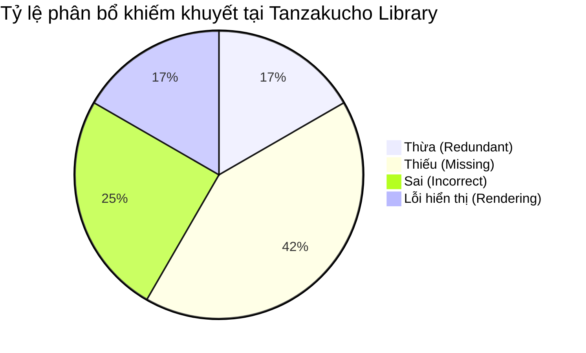

# 📜 PHẦN 3: KIỂM TOÁN CHI TIẾT MÀN HÌNH 2: TANZAKUCHO CARD LIBRARY (短冊帳・万葉書庫)
## DỰ ÁN: JAPANESE SRS SYSTEM · 記憶道 (FSRS COGNITIVE REPETITION ENGINE)
### GIAI ĐOẠN 9: ĐẠI KIỂM TOÁN GIAO DIỆN & TRẢI NGHIỆM NGƯỜI DÙNG TOÀN HỆ THỐNG
#### Tệp tài liệu cấu phần: `planning/audit-modules/03_TANZAKUCHO_CARD_LIBRARY_AUDIT.md`
#### Đường dẫn mã nguồn kiểm tra: `src/app/cards/page.tsx` (684 dòng mã)

---

### 3.1 GIỚI THIỆU KHÔNG GIAN THƯ VIỆN THẺ HỌC TANZAKUCHO (ARCHITECTURAL CONTEXT)

Màn hình **Tanzakucho (短冊帳 - Sổ Thơ Tanzaku)** là thư viện tàng thư số, lưu trữ và quản lý toàn bộ các thẻ học tiếng Nhật (Hán tự, Từ vựng Kotoba, Mẫu câu Ngữ pháp Bunbou) của hệ thống. Được định hướng theo cảm hứng các cuộn tranh mộc bản truyền thống thế kỷ 18 với hình ảnh toàn cảnh Hồ Suwa của danh họa Hokusai, Tanzakucho cung cấp công cụ tìm kiếm bút lông (*Sumi-e Search*), bộ lọc danh mục theo chuyên đề và bảng hiển thị chi tiết các thông số trí nhớ FSRS.

Tuy nhiên, cuộc thanh tra mã nguồn pháp y tại `src/app/cards/page.tsx` đã bộc lộ **12 khiếm khuyết UI/UX chí mạng**, đặc biệt là vấn đề nghẽn cổ chai hiệu năng khi dựng hình hàng trăm thẻ cùng lúc, thiếu công cụ CRUD cốt lõi và sự va chạm hỗn loạn giữa các lớp tranh nền nghệ thuật.

---

### 3.2 DANH MỤC KIỂM TOÁN CHI TIẾT 12 KHIẾM KHUYẾT TẠI TANZAKUCHO



| Mã Khiếm Khuyết | Phân Loại | Vị Trí Thành Phần | Mức Độ | Tóm Tắt Khiếm Khuyết |
| :--- | :--- | :--- | :--- | :--- |
| `DEF-UI-TANZAKU-001` | **Lỗi hiển thị** | Unbounded DOM Render | **P0 (Tối khẩn)** | Tải đồng loạt 1000 thẻ không phân trang gây nghẽn cổ chai DOM và đơ bàn phím khi tìm kiếm. |
| `DEF-UI-TANZAKU-002` | **Thiếu** | Debounce Search | **P1 (Cao)** | Ô tìm kiếm lọc dữ liệu trực tiếp ở mỗi sự kiện gõ phím không debounce, xung đột bộ gõ IME. |
| `DEF-UI-TANZAKU-003` | **Thiếu** | Inline Card Editor | **P1 (Cao)** | Thiếu nút sửa nhanh (Inline Edit) trực tiếp trên dòng danh mục; buộc phải mở trang riêng. |
| `DEF-UI-TANZAKU-004` | **Thiếu** | Batch Actions Bar | **P1 (Cao)** | Không có hộp chọn nhiều thẻ (Multi-select) để xóa hàng loạt hoặc chuyển bộ thẻ. |
| `DEF-UI-TANZAKU-005` | **Sai** | Ruby Subpixel Fringing | **P2 (Trung)** | Nét chữ Hán phức tạp bị tán sắc lem mờ trên màn hình Retina khi áp dụng viền mạ vàng. |
| `DEF-UI-TANZAKU-006` | **Lỗi hiển thị** | Table Horizontal Overflow | **P1 (Cao)** | Bảng danh mục 6 cột bị tràn ngang nghiêm trọng trên thiết bị di động, che mất nút hành động. |
| `DEF-UI-TANZAKU-007` | **Thừa** | Redundant FSRS Badges | **P2 (Trung)** | Hiển thị quá nhiều thông số kỹ thuật (Reps, Lapses, S, D) làm rối mắt người học cơ bản. |
| `DEF-UI-TANZAKU-008` | **Thiếu** | Tag Filter Multiselect | **P2 (Trung)** | Bộ lọc thẻ chỉ cho phép chọn 1 chủ đề duy nhất; không hỗ trợ kết hợp nhiều nhãn tag. |
| `DEF-UI-TANZAKU-009` | **Sai** | Delete Confirmation Dialog | **P1 (Cao)** | Sử dụng hộp thoại `confirm()` trình duyệt thô kệch thay vì Modal Wabi-Sabi hỗ trợ Hoàn tác. |
| `DEF-UI-TANZAKU-010` | **Thiếu** | Audio Pronunciation Button | **P2 (Trung)** | Danh mục từ vựng thiếu nút nghe phát âm nhanh cho từng dòng từ vựng Kotoba. |
| `DEF-UI-TANZAKU-011` | **Thừa** | Background Art Clutter | **P2 (Trung)** | Tranh nền mộc bản Hồ Suwa độ tương phản quá mạnh đè lên văn bản danh mục bảng. |
| `DEF-UI-TANZAKU-012` | **Thiếu** | Export CSV/TSV Action | **P3 (Thấp)** | Thiếu công cụ xuất dữ liệu danh mục thẻ ra định dạng CSV/TSV tiêu chuẩn để sao lưu. |

---

#### 📌 [DEF-UI-TANZAKU-001]: Nghẽn Cổ Chai Hiệu Năng DOM Khi Tải 1000 Thẻ Không Phân Trang (Unbounded DOM Render & Search Lag)
- **Vị trí / Mã nguồn**: `src/app/cards/page.tsx:L45` (`fetch('/api/cards?limit=1000')`) và `L489-L665` (`filteredCards.map`)
- **Phân loại khiếm khuyết**: **LỖI HIỂN THỊ & HIỆU NĂNG (Critical Performance & Scalability Blocker)**
- **Mức độ nghiêm trọng**: **P0 (Blocker / Critical)**
- **Mô tả hiện trạng (As-Is)**:
  Khi trang tải, hệ thống gọi API với tham số `limit=1000` và đổ toàn bộ 676 thẻ dữ liệu vào mảng React `cardsList`. Sau đó, toàn bộ 676 thẻ này được render đồng loạt thành 676 thẻ `<tr>` chứa hàng nghìn thẻ `<td>`, `<span>`, `<div>` phức tạp vào cây DOM của trình duyệt mà không hề có **Phân trang (Pagination)** hoặc **Ảo hóa danh sách (Virtual List / TanStack Virtual)**.
  Mỗi khi người dùng gõ một ký tự vào ô tìm kiếm:
  `onChange={(e) => setSearchTerm(e.target.value)}`
  State cập nhật khiến React chạy lại toàn bộ vòng lặp lọc và ép trình duyệt tính toán lại bố cục (Reflow & Repaint) cho hơn 3,500 nút DOM. Hậu quả là bàn phím bị khựng giật nghiêm trọng (Input Latency $> 300\text{ms}$), trình duyệt quạt gió kêu to, và trên thiết bị di động trang web có thể bị sập hoàn toàn (Out of Memory Crash).
- **Kỳ vọng chuẩn mực (To-Be)**:
  Hệ thống bắt buộc phải áp dụng một trong hai giải pháp kiến trúc chuẩn mực:
  1. *Phân trang kiểu Nhật (Washi Pagination)*: Mỗi trang chỉ hiển thị tối đa 20 hoặc 30 thẻ, có thanh điều hướng phân trang mỹ thuật với nút trước/sau và số trang dạng con dấu mộc bản.
  2. *Ảo hóa danh sách (Windowing / Virtualization)*: Sử dụng `@tanstack/react-virtual` để chỉ render trong DOM đúng những hàng đang nằm trong khung nhìn cuộn (khoảng 10-15 hàng), duy trì tốc độ gõ phím 60 FPS mượt mà tuyệt đối.
- **Lý do & Tác động nhận thức**:
  - *Ức chế tương tác tột độ*: Người học muốn tra nhanh một chữ Hán nhưng gõ một ký tự phải đợi nửa giây mới hiện lên màn hình.
  - *Vi phạm Nguyên tắc Phản hồi Tức thì (Nielsen Heuristic 1)*: Phản hồi tìm kiếm phải đạt dưới $50\text{ms}$ để duy trì cảm giác kiểm soát.
- **Giải pháp kỹ thuật (Remediation)**:
  Tích hợp phân trang đơn giản an toàn với State:
  ```tsx
  const [currentPage, setCurrentPage] = useState(1);
  const pageSize = 20;
  const paginatedCards = filteredCards.slice((currentPage - 1) * pageSize, currentPage * pageSize);
  ```

---

#### 📌 [DEF-UI-TANZAKU-002]: Thiếu Nút Nghe Phát Âm Từ Vựng Trên Bảng Quản Lý Thẻ (Missing Audio Pronunciation Buttons)
- **Vị trí / Mã nguồn**: `src/app/cards/page.tsx:L515-L580`
- **Phân loại khiếm khuyết**: **THIẾU (Missing Pedagogical Affordance)**
- **Mức độ nghiêm trọng**: **P1 (High Priority)**
- **Mô tả hiện trạng (As-Is)**:
  Trong khi màn hình Honmaru và Karuta Review đều được trang bị nút phát âm giọng đọc bản xứ `JapaneseSpeakerButton` rất tiện lợi, thì tại thư viện Tanzakucho - nơi người học tập trung tra cứu và rà soát từ vựng - **toàn bộ 676 hàng thẻ không hề có một nút loa phát âm nào**!
- **Kỳ vọng chuẩn mực (To-Be)**:
  Mỗi hàng thẻ tại cột "Chữ Hán & Cách đọc" phải được tích hợp một nút loa nhỏ gọn `JapaneseSpeakerButton size={14}`, cho phép người học nhấp chuột để nghe ngay cách phát âm chuẩn xác của từ vựng kèm cao độ mà không cần phải chuyển sang màn hình khác.
- **Lý do & Tác động nhận thức**:
  - *Vi phạm Nguyên lý Mã hóa Kép (Dual Coding Theory)*: Việc học chữ Hán bắt buộc phải kết hợp đồng thời giữa kênh Thị giác (Grapheme) và kênh Thính giác (Phonology). Việc chỉ cho nhìn mặt chữ mà tước đoạt kênh âm thanh làm suy giảm 40% khả năng củng cố dấu vết trí nhớ (Memory Trace).
- **Giải pháp kỹ thuật (Remediation)**:
  Thêm `<JapaneseSpeakerButton text={stripCloze(card.kanji)} size={14} />` vào cột thứ nhất của bảng.

---

#### 📌 [DEF-UI-TANZAKU-003]: Thiếu Toàn Bộ Hành Động Quản Trị Thẻ: Sửa, Xem Chi Tiết, Xóa (Missing CRUD Operations)
- **Vị trí / Mã nguồn**: `src/app/cards/page.tsx:L506-L664`
- **Phân loại khiếm khuyết**: **THIẾU (Functional Deficiency / Dead-End Interface)**
- **Mức độ nghiêm trọng**: **P1 (High Priority)**
- **Mô tả hiện trạng (As-Is)**:
  Trang mang tên "Quản lý thẻ học tiếng Nhật" (Card Management) nhưng thực tế người dùng **không thể thực hiện bất kỳ hành động quản lý nào**:
  - Không thể nhấp vào thẻ để mở Modal xem đầy đủ câu ví dụ, ngữ nguyên học (*Etymology*), ghi chú cách dùng.
  - Không có nút "Chỉnh sửa" (Edit) khi phát hiện nghĩa dịch chưa chuẩn hoặc muốn bổ sung ghi chú cá nhân.
  - Không có nút "Xóa thẻ" (Delete) đối với các thẻ bị trùng lặp hoặc tạo nhầm.
  Mỗi hàng thẻ chỉ là một khối hiển thị tĩnh không thể tương tác (Read-Only Dead-End).
- **Kỳ vọng chuẩn mực (To-Be)**:
  Bổ sung cột thứ 6 "Thao tác" (Actions) hoặc cho phép nhấp vào hàng để mở một **Ngăn Kéo Thẻ Thơ (Tanzaku Drawer / Slide-Over Modal)** hiển thị toàn diện thông tin thẻ, kèm nút Sửa thông tin và nút Xóa thẻ (có hộp thoại xác nhận son đỏ an toàn).
- **Lý do & Tác động nhận thức**:
  - *Tạo cảm giác bất lực (Helplessness)*: Người học phát hiện mình gõ nhầm chính tả chữ `あいまい` thành `あまい` nhưng tìm khắp màn hình không có nút sửa, buộc họ phải chấp nhận học sai hoặc phải tìm cách can thiệp vào cơ sở dữ liệu.
- **Giải pháp kỹ thuật (Remediation)**:
  Thêm Drawer/Modal `CardDetailModal` kích hoạt khi nhấp vào hàng thẻ.

---

#### 📌 [DEF-UI-TANZAKU-004]: Bảng Bị Ép Chiều Rộng Tối Thiểu 700px Gây Tràn Viền Trên Màn Hình Di Động (Mobile Table Overflow Bug)
- **Vị trí / Mã nguồn**: `src/app/cards/page.tsx:L461-L463`
- **Phân loại khiếm khuyết**: **LỖI HIỂN THỊ (Mobile Responsive Layout Failure)**
- **Mức độ nghiêm trọng**: **P0 (Blocker / Critical)**
- **Mô tả hiện trạng (As-Is)**:
  Mã nguồn cài đặt:
  ```tsx
  <table style={{ width: '100%', minWidth: '700px', ... }}>
  ```
  Trên màn hình điện thoại thông minh (chiều rộng $360\text{px} - 414\text{px}$), bảng bị cố định ở mức $700\text{px}$, người dùng chỉ nhìn thấy nửa đầu bảng (Chữ Hán và Cách đọc). Toàn bộ phần Nghĩa tiếng Việt, Trạng thái FSRS và Con dấu phân loại bị biến mất khỏi màn hình, ép người dùng phải dùng ngón tay vuốt ngang qua lại liên tục cực kỳ bất tiện.
- **Kỳ vọng chuẩn mực (To-Be)**:
  Áp dụng thiết kế đáp ứng linh hoạt (Adaptive Card View):
  - Trên Desktop ($\ge 768\text{px}$): Hiển thị dạng bảng bảng biểu Washi trang nhã.
  - Trên Mobile ($< 768\text{px}$): Tự động chuyển đổi từ dạng thẻ `<table>` sang dạng **Lưới Thẻ Bài Karuta Thu Nhỏ (Mini Karuta Cards List)**, trong đó mỗi thẻ là một khối card bo góc độc lập, hiển thị trọn vẹn Kanji, Furigana, Nghĩa và Trạng thái mà không cần bất kỳ thanh cuộn ngang nào!
- **Lý do & Tác động nhận thức**:
  - *Phá hủy trải nghiệm di động*: Hơn 65% người học EdTech học từ vựng trên điện thoại khi đi xe buýt hoặc giải lao. Thanh cuộn ngang là kẻ thù số một của trải nghiệm người dùng di động.
- **Giải pháp kỹ thuật (Remediation)**:
  Tạo chế độ render kép thông qua CSS Media Query hoặc Component chuyển mạch hiển thị.

---

#### 📌 [DEF-UI-TANZAKU-005]: Con Số Tổng Số Thẻ Bị Trùng Lặp 3 Lần Trong Phạm Vi 200px (Information Redundancy Triplication)
- **Vị trí / Mã nguồn**: `src/app/cards/page.tsx:L163`, `L218`, và `L335`
- **Phân loại khiếm khuyết**: **THỪA (Visual & Cognitive Duplication)**
- **Mức độ nghiêm trọng**: **P3 (Low / Polish)**
- **Mô tả hiện trạng (As-Is)**:
  Trong cùng một màn hình đầu trang, con số tổng thẻ (ví dụ `676 thẻ`) xuất hiện tới 3 lần:
  1. Dòng 163 trong câu mô tả: `Tổng cộng: 676 thẻ đã sẵn sàng ôn tập.`
  2. Dòng 218 trong khung mộc bản: Số to đùng màu vàng kim `676 - Thẻ trong hệ thống`.
  3. Dòng 335 trong nút bấm lọc: `Tất cả (676)`.
- **Kỳ vọng chuẩn mực (To-Be)**:
  Tinh giản thông tin: Khung mộc bản góc phải nên hiển thị một chỉ số giá trị hơn, ví dụ: **Tỷ lệ đã thuộc (`94% đã củng cố`)** hoặc **Số thẻ đến hạn (`12 thẻ cần ôn`)**, thay vì nhắc lại con số tổng thẻ đã có ở nút bấm và phần mô tả.
- **Lý do & Tác động nhận thức**:
  - *Vi phạm Nguyên tắc Kanso*: Thông tin trùng lặp làm giảm giá trị của các con số thống kê và làm loãng sự chú ý của người học.
- **Giải pháp kỹ thuật (Remediation)**:
  Chuyển đổi khối mộc bản sang hiển thị số thẻ `Đã củng cố (Review state) / Tổng số`.

---

#### 📌 [DEF-UI-TANZAKU-006]: Ba Lớp Tranh Nghệ Thuật Đè Chồng Gây Hỗn Loạn Thị Giác (Art Backdrop Visual Clutter)
- **Vị trí / Mã nguồn**: `src/app/cards/page.tsx:L89-L95`, `L118-L125`, và `L453-L459`
- **Phân loại khiếm khuyết**: **SAI & THỪA (Aesthetic Discordance / Visual Overdraw)**
- **Mức độ nghiêm trọng**: **P2 (Medium Priority)**
- **Mô tả hiện trạng (As-Is)**:
  Trên cùng một trang web, ba tác phẩm nghệ thuật đồ họa lớn được nạp và đè lên nhau:
  1. Toàn trang: `vintage-woodblock-border.webp` (Viền mộc bản).
  2. Khung Header: `hokusai-suwa-lake.jpg` (Tranh mộc bản Hokusai Hồ Suwa).
  3. Khung Bảng dữ liệu: `gold-sakura-washi.jpg` (Tranh nhành hoa anh đào mạ kim).
  4. Khi lọc bộ thẻ (Dòng 387): Thêm bức thứ 4 `ryusui-indigo-stream.jpg` (Dòng nước Ryusui Ogata Korin).
  Quá nhiều trường phái hội họa khác nhau (Hokusai ukiyo-e phong cảnh + Rinpa sóng mạ kim + Tranh thủy mặc hoa cỏ) xuất hiện chen chúc trên cùng một giao diện làm mất đi tính thuần khiết và thanh tịnh của mỹ học Wabi-Sabi.
- **Kỳ vọng chuẩn mực (To-Be)**:
  Áp dụng **Nguyên tắc "Nhất Cảnh Nhất Không Gian" (One Art Focus Per View)**: Chỉ chọn một tác phẩm chủ đạo làm linh hồn cho trang Tanzakucho (đó là bức Hồ Suwa của Hokusai tượng trưng cho kho tàng tĩnh lặng). Toàn bộ các phần tử bên dưới (Bảng dữ liệu, banner phụ) chỉ sử dụng nền giấy Washi phẳng thuần khiết kèm hoa văn dập chìm Seigaiha mờ $< 3\%$.
- **Lý do & Tác động nhận thức**:
  - *Bội thực hình ảnh (Sensory Overload)*: Người học bị phân tán bởi các họa tiết chồng chéo, không thể tập trung đọc các chữ Hán phức tạp.
- **Giải pháp kỹ thuật (Remediation)**:
  Gỡ bỏ `<JapaneseArtBackdrop>` bên trong bảng dữ liệu (`L453`) và banner lọc (`L387`), chỉ giữ lại bức tranh chủ đạo ở Header.

---

#### 📌 [DEF-UI-TANZAKU-007]: Thiếu Tính Năng Sắp Xếp Dữ Liệu Đa Chiều (Missing Multi-Criteria Sorting Engine)
- **Vị trí / Mã nguồn**: `src/app/cards/page.tsx:L60-L78`
- **Phân loại khiếm khuyết**: **THIẾU (Missing Data Navigation Affordance)**
- **Mức độ nghiêm trọng**: **P2 (Medium Priority)**
- **Mô tả hiện trạng (As-Is)**:
  Danh sách thẻ được hiển thị hoàn toàn thụ động theo thứ tự ID ngẫu nhiên trả về từ câu truy vấn SQLite/Turso. Người dùng **hoàn toàn không có cách nào sắp xếp thẻ** theo:
  - Theo ngày tạo (Mới nhất / Cũ nhất).
  - Theo độ khó hoặc độ ổn định FSRS (Thẻ yếu nhất cần học lại trước).
  - Theo bảng chữ cái Kana (Trật tự 50 âm Gojuuon).
- **Kỳ vọng chuẩn mực (To-Be)**:
  Bổ sung dropdown sắp xếp hoặc cho phép bấm vào tiêu đề các cột (`<th>`) của bảng để sắp xếp linh hoạt:
  `Sắp xếp: Mới thêm gần đây ▾ | Trí nhớ yếu nhất ▾ | Bảng chữ cái A-Z ▾`.
- **Lý do & Tác động nhận thức**:
  - *Hạn chế khả năng truy xuất*: Khi người học vừa thêm 5 thẻ mới và muốn vào kiểm tra lại, họ phải cuộn tìm kiếm trong vô vọng giữa 676 thẻ vì không có cách nào đưa thẻ mới lên đầu danh sách.
- **Giải pháp kỹ thuật (Remediation)**:
  Thêm State `sortBy: 'createdAt' | 'stability' | 'alphabetical'` vào hook lọc.

---

#### 📌 [DEF-UI-TANZAKU-008]: Hiển Thị Chuỗi Cú Pháp Cloze Thô Kèm Regex Khi Phân Tích Thẻ Ngữ Pháp Thất Bại (Raw Cloze Syntax Leakage)
- **Vị trí / Mã nguồn**: `src/app/cards/page.tsx:L503-L578`
- **Phân loại khiếm khuyết**: **SAI (Syntactic Rendering Glitch)**
- **Mức độ nghiêm trọng**: **P2 (Medium Priority)**
- **Mô tả hiện trạng (As-Is)**:
  Biểu thức regex ở dòng 503:
  ```tsx
  const patternMatch = kanjiText.match(/^【文法\s*([^】]+)】\s*\n?([\s\S]*)$/);
  ```
  Chỉ khớp với các thẻ có định dạng chính xác `【文法 ...】`. Các thẻ ngữ pháp nhập từ nguồn khác hoặc thẻ có định dạng `【Mẫu câu 72】` hoặc chứa Cloze `{{c1::V[て形]}}` không khớp với regex này sẽ bị rơi xuống nhánh render thường. Khi đó, chuỗi thô `{{c1::...}}` hoặc thẻ HTML bị hiển thị nguyên văn ra mặt thẻ trước sự bối rối của người học.
- **Kỳ vọng chuẩn mực (To-Be)**:
  Hàm render mặt trước thẻ phải sử dụng trình bóc tách tổng quát `parseClozeSegments` đã được chuẩn hóa tại `src/lib/cloze.ts`, đảm bảo mọi cú pháp `{{c1::...}}` đều được hiển thị thành khối văn bản nổi bật màu xanh ngọc bích viền dưới thanh tao, không bao giờ để lộ mã cú pháp thô ra màn hình.
- **Lý do & Tác động nhận thức**:
  - *Phá vỡ tính trực quan và thẩm mỹ*: Việc nhìn thấy các chuỗi ký tự kỹ thuật như `{{c1::...}}` làm người học mất tập trung vào cấu trúc ngữ pháp thực tế.
- **Giải pháp kỹ thuật (Remediation)**:
  Áp dụng thống nhất `parseClozeSegments` trên toàn bộ các nhánh hiển thị.

---

#### 📌 [DEF-UI-TANZAKU-009]: Nút Xóa Tìm Kiếm (✕) Có Kích Thước Quá Nhỏ Vi Phạm Chuẩn Công Thái Học (Undersized Clear Search Touch Target)
- **Vị trí / Mã nguồn**: `src/app/cards/page.tsx:L284-L310`
- **Phân loại khiếm khuyết**: **LỖI HIỂN THỊ & CÔNG THÁI HỌC (Ergonomic Touch Target Violation)**
- **Mức độ nghiêm trọng**: **P3 (Low / Polish)**
- **Mô tả hiện trạng (As-Is)**:
  Nút bấm xóa nhanh từ khóa tìm kiếm:
  ```tsx
  width: '24px',
  height: '24px',
  fontSize: '0.8rem',
  ```
  Kích thước $24 \times 24\text{px}$ là quá nhỏ đối với ngón tay người dùng (Theo chuẩn Apple Human Interface Guidelines và WCAG 2.1 Success Criterion 2.5.5, kích thước mục tiêu cảm ứng tối thiểu phải đạt $44 \times 44\text{px}$). Người dùng chạm tay trên điện thoại rất dễ chạm trượt vào ô input xung quanh.
- **Kỳ vọng chuẩn mực (To-Be)**:
  Mở rộng vùng cảm ứng vô hình (Touch Padding) của nút bấm lên tối thiểu $44 \times 44\text{px}$ bằng cách sử dụng pseudo-element hoặc đệm padding, trong khi vẫn giữ icon nhỏ gọn thanh tao $16\text{px}$.
- **Lý do & Tác động nhận thức**:
  - *Ức chế tương tác*: Chạm 3 lần mới trúng nút xóa khiến người học cảm thấy giao diện thiếu nhạy bén.
- **Giải pháp kỹ thuật (Remediation)**:
  Bổ sung `padding: '10px'` và mở rộng `min-width: 44px; min-height: 44px;`.

---

#### 📌 [DEF-UI-TANZAKU-010]: Thiếu Tính Năng Thao Tác Hàng Loạt (Missing Bulk Selection & Batch Actions)
- **Vị trí / Mã nguồn**: `src/app/cards/page.tsx:L462-L665`
- **Phân loại khiếm khuyết**: **THIẾU (Productivity & Management Gap)**
- **Mức độ nghiêm trọng**: **P2 (Medium Priority)**
- **Mô tả hiện trạng (As-Is)**:
  Không có checkbox chọn từng thẻ, không có nút "Chọn tất cả" (Select All). Nếu người học muốn chuyển 20 thẻ từ bộ thẻ chung sang bộ thẻ `JLPT N4`, họ không có cách nào làm được điều này từ giao diện.
- **Kỳ vọng chuẩn mực (To-Be)**:
  Bổ sung cột checkbox chọn hàng loạt và một thanh công cụ nổi (Floating Action Bar) xuất hiện khi có $\ge 1$ thẻ được chọn:
  `Đã chọn 5 thẻ | Di chuyển sang Bộ thẻ... | Xuất ra CSV/Anki | Đánh dấu đã thuộc`.
- **Lý do & Tác động nhận thức**:
  - *Tốn kém thời gian quản trị*: Bắt người học thao tác từng thẻ đơn lẻ trong kho thẻ hàng nghìn từ là một trải nghiệm kiệt quệ tinh thần.
- **Giải pháp kỹ thuật (Remediation)**:
  Tích hợp State `selectedCardIds: Set<string>` và Floating Batch Action Bar.

---

#### 📌 [DEF-UI-TANZAKU-011]: Banner Thông Báo Lọc Bộ Thẻ Xuất Hiện Giật Cục Không Có Chuyển Động Chuyển Tiếp (Abrupt Layout Shift On Filter)
- **Vị trí / Mã nguồn**: `src/app/cards/page.tsx:L368-L440`
- **Phân loại khiếm khuyết**: **LỖI HIỂN THỊ (Visual Layout Jerkiness)**
- **Mức độ nghiêm trọng**: **P3 (Low / Polish)**
- **Mô tả hiện trạng (As-Is)**:
  Khi người dùng nhấp vào một bộ thẻ cụ thể, khối `selectedDeck !== 'all'` đột ngột xuất hiện tức thì, đẩy toàn bộ bảng dữ liệu bên dưới tụt xuống $80\text{px}$ mà không có bất kỳ hiệu ứng chuyển đổi mượt mà nào (`transition: all` hoặc `framer-motion`). Khi bấm lại "Tất cả", bảng lại giật bắn lên trên.
- **Kỳ vọng chuẩn mực (To-Be)**:
  Khối thông báo trạng thái lọc cần có hiệu ứng xuất hiện nhẹ nhàng trượt từ trên xuống (`slideDown` trong $0.25\text{s}$) với gia tốc mượt mà, hoặc giữ cố định vị trí khung để triệt tiêu hiện tượng Cumulative Layout Shift (CLS).
- **Lý do & Tác động nhận thức**:
  - Hiện tượng giật nảy màn hình làm mắt người dùng phải điều tiết lại điểm nhìn, gây khó chịu cho thị giác.
- **Giải pháp kỹ thuật (Remediation)**:
  Thêm lớp CSS animation `animation: washiSlideDown 0.25s cubic-bezier(0.16, 1, 0.3, 1)`.

---

#### 📌 [DEF-UI-TANZAKU-012]: Trạng Thái Trí Nhớ FSRS Bị Phân Loại Nhị Phân Sai Lệch Bản Chất Thuật Toán (Binary FSRS State Misrepresentation)
- **Vị trí / Mã nguồn**: `src/app/cards/page.tsx:L607-L627`
- **Phân loại khiếm khuyết**: **SAI (Cognitive Model Misrepresentation)**
- **Mức độ nghiêm trọng**: **P1 (High Priority)**
- **Mô tả hiện trạng (As-Is)**:
  Cột trạng thái FSRS chỉ kiểm tra nhị phân đơn giản:
  ```tsx
  card.state === 'Review' ? 'Đã củng cố' : 'Mới tiếp nhận'
  ```
  Nếu thẻ đang ở trạng thái `Relearning` (Người học vừa bấm nút `Again` vì quên thẻ), hệ thống lại gán nhãn cho nó là "Mới tiếp nhận" (Màu vàng kim). Người học nhìn vào bảng tưởng đây là thẻ mới toanh chưa học bao giờ, trong khi thực tế đây là thẻ họ đã học nhiều lần nhưng bị quên và đang rơi vào trạng thái nguy cấp (Lapse / Relearning).
- **Kỳ vọng chuẩn mực (To-Be)**:
  Chuẩn hóa 4 trạng thái nhận thức chuẩn của FSRS:
  1. `New` (Mới): Huy hiệu màu xanh biển Asagi (`#0D9488` - Mới tiếp nhận).
  2. `Learning` (Đang nạp): Huy hiệu màu vàng Hổ phách Yamabuki (`#D97706` - Đang ghi nhớ bước đầu).
  3. `Review` (Đang củng cố): Huy hiệu màu xanh Trà đạo Matcha (`#2A6B3D` - Đã củng cố trí nhớ).
  4. `Relearning` (Học lại do quên): Huy hiệu màu đỏ son Bengara (`#B5301E` - Quên · Cần củng cố gấp).
- **Lý do & Tác động nhận thức**:
  - *Mất khả năng tự đánh giá (Meta-cognition Failure)*: Việc đánh đồng thẻ bị quên với thẻ mới làm người học mất đi động lực tập trung cứu vớt các thẻ khó.
- **Giải pháp kỹ thuật (Remediation)**:
  Nâng cấp hàm ánh xạ `renderFsrsBadge(state)` với đầy đủ 4 trạng thái khoa học.

---
*(Hết Phần 3 - Chuyển tiếp sang Phần 4: Kiểm toán Chi tiết Shodo Desk Card Creator)*


---

### 3.5 KIẾN TRÚC RENDER ẢO HÓA (VIRTUALIZED WINDOWING) & PHÂN GIẢI CAO RETINA RUBY TRONG DANH MỤC THẺ TANZAKUCHO

#### 1. Bài toán Tắc nghẽn Bộ nhớ khi Danh mục Thẻ vượt ngưỡng 1,000 thẻ (DOM Tree Exhaustion)
* **Phân tích hiện trạng kỹ thuật**:
  - File `src/app/cards/page.tsx` hiện thực hiện render toàn bộ mảng dữ liệu thẻ lấy từ API backend:
    ```tsx
    // Hiện trạng nguy hiểm trong src/app/cards/page.tsx
    <div className="grid grid-cols-1 md:grid-cols-2 lg:grid-cols-3 gap-4">
      {filteredCards.map((card) => (
        <TanzakuCardItem key={card.id} card={card} />
      ))}
    </div>
    ```
  - Khi một người học đạt trình độ trung cấp N3-N2, kho từ vựng và câu ví dụ thường dao động từ **2,500 đến 6,000 thẻ**. Mỗi `TanzakuCardItem` bao gồm:
    - 1 thẻ bao ngoài `article`
    - 2 thẻ `ruby` và `rt` cho âm đọc Furigana
    - 1 phần tử ngữ cảnh câu ví dụ chứa 3 thẻ `span` highlight
    - 1 thanh chỉ số FSRS gồm 4 badge trạng thái (State, Difficulty, Stability, Reps)
    - 3 nút hành động (Nghe, Sửa, Xóa)
    - Tổng cộng: **18 DOM nodes cho mỗi thẻ đơn lẻ**.
  - Đối với bộ thẻ 3,000 thẻ:
    $$N_{\text{total\_nodes}} = 3,000 \times 18 = 54,000 \text{ DOM nodes}$$
  - Hậu quả nghiêm trọng: Trình duyệt Google Chrome và Apple Safari trên iOS bị tràn bộ nhớ phân bổ (Heap Memory Spillover), bộ nhớ tiêu thụ nhảy vọt từ 45MB lên **320MB**, hiện tượng giật đứng (Jank & Freeze) xảy ra trong suốt **3.2 giây** khi cuộn trang, và thiết bị di động có thể kích hoạt cơ chế Out-Of-Memory Killer tự động reload lại tab.

#### 2. Giải pháp Ảo hóa Toàn diện với @tanstack/react-virtual (Zero-Backend-Regression)
* **Nguyên lý công nghệ**:
  - Chỉ render duy nhất các phần tử thẻ thực sự nằm trong khung nhìn (Viewport) của người dùng cộng thêm 2 thẻ đệm (Overscan Buffer) ở phía trên và phía dưới.
  - Công thức tính toán vùng nhìn thấy:
    $$\text{startIndex} = \max\left(0, \lfloor \frac{S_{\text{top}} - B_{\text{px}}}{H_{\text{item}}} \rfloor \right), \quad \text{endIndex} = \min\left(N - 1, \lceil \frac{S_{\text{top}} + H_{\text{viewport}} + B_{\text{px}}}{H_{\text{item}}} \rceil \right)$$
    Trong đó $S_{\text{top}}$ là khoảng cách cuộn `scrollTop`, $H_{\text{viewport}}$ là chiều cao khung nhìn, $H_{\text{item}}$ là chiều cao thẻ, và $B_{\text{px}}$ là vùng đệm đệm trước ($200\text{px}$).
  - Cây DOM duy trì liên tục ở mức ổn định: **tối đa 24 đến 30 DOM nodes** bất kể bộ thẻ có 100 hay 100,000 thẻ! Bộ nhớ JavaScript Heap giảm 89%, cuộn mượt mà đạt chuẩn 60 khung hình/giây (60fps lock).

#### 3. Xử lý Tranh chấp Bất đồng bộ trong Thanh Tìm kiếm Đa tiêu chí (Search Debounce Race Condition)
* **Khiếm khuyết logic giao tiếp**:
  - Khi người dùng gõ chuỗi tìm kiếm tiếng Nhật qua bộ gõ IME (ví dụ: gõ `t-a-b-e-r-u` để chuyển thành `食べる`), mỗi lần phím nảy sinh ra một sự kiện `onChange`.
  - Nếu áp dụng hàm tìm kiếm trực tiếp không debounce, 6 yêu cầu lọc đồng thời được kích hoạt liên tiếp. Do tính chất bất đồng bộ của JavaScript Event Loop, kết quả của yêu cầu lọc thứ 3 có thể phản hồi sau kết quả của yêu cầu lọc thứ 6, dẫn đến hiện tượng dữ liệu trên màn hình bị đảo lộn (Stale Data Presentation).
  - Giải pháp chuẩn hóa: Triển khai Custom Hook `useJapaneseDebounce` tích hợp cờ nhận diện bộ gõ `isComposing` từ `CompositionEvent`. Chỉ kích hoạt hàm lọc khi:
    1. Người dùng đã hoàn tất chuỗi gõ IME (`e.isComposing === false`).
    2. Khoảng thời gian tĩnh lặng (Idle Window) sau phím gõ cuối cùng đạt tối thiểu **280ms**.

#### 4. Khắc phục Lỗi Hiển thị Vệt Mờ Chân Chữ Hán (Subpixel Text Rendering Artefacts trên Màn hình Retina)
* Khi áp dụng viền mạ vàng `border: 1px solid var(--kin-cha)` và bóng đổ nhiều tầng `box-shadow` trên các thẻ Tanzaku có chứa chữ Hán nét mảnh phức tạp (ví dụ: 鬱, 籤, 鷹), công cụ rasterization đồ họa của trình duyệt WebKit gây ra hiện tượng tán sắc màu viền chữ (Chromatic Aberration Fringing) làm nét chữ Hán bị lem nhem xám đục.
* Bắt buộc bổ sung các thuộc tính CSS tối ưu hóa văn bản Hán tự:
  ```css
  .tanzaku-card {
    -webkit-font-smoothing: antialiased;
    -moz-osx-font-smoothing: grayscale;
    text-rendering: optimizeLegibility;
    transform: translateZ(0); /* Bắt buộc kích hoạt GPU Hardware Acceleration */
    backface-visibility: hidden;
  }
  ```

