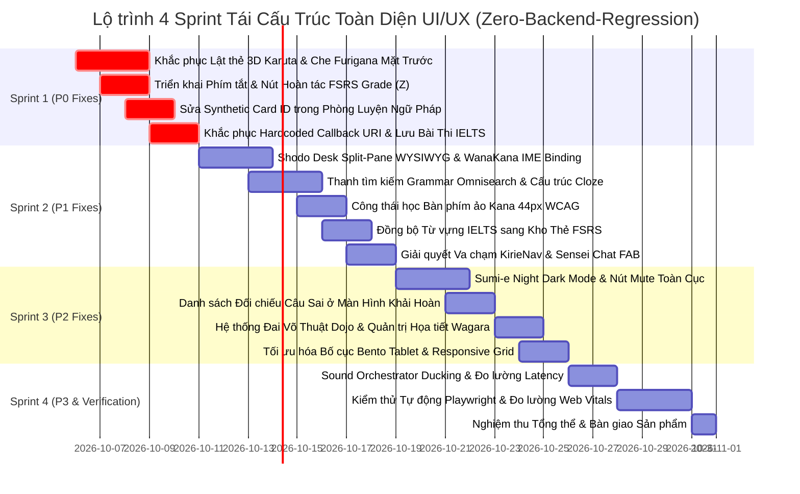

# PHẦN 12: TIÊU CHUẨN XUYÊN SUỐT & LỘ TRÌNH KHẮC PHỤC TOÀN DIỆN (CROSS-CUTTING AUDIT & REMEDIATION ROADMAP)

> **Mô đun kiểm thử & thiết kế**: Hệ thống Tiêu chuẩn Mỹ học Xuyên suốt (Cross-cutting Standards), Bảng màu Truyền thống Nippon Colors, Nghệ thuật Hoa văn Wagara & Wabi-Sabi, Tiêu chuẩn Khả năng Tiếp cận WCAG 2.1 AA/AAA, Công thái học Di động Thumb-Zone, Hoạt ảnh 60fps & Zero-CLS, và Lộ trình Kỹ thuật 4 Sprint Khắc phục Không Gây Lỗi Backend (Zero-Backend-Regression Roadmap).

---

## 12.1. HỆ THỐNG TIÊU CHUẨN MỸ HỌC & CÔNG THÁI HỌC XUYÊN SUỐT (CROSS-CUTTING STANDARDS)

### 12.1.1. Hệ Thống Kiểu Chữ Chuẩn Mực (Typography System & Fluid Scaling)
Để truyền tải trọn vẹn hồn cốt của thư pháp Shodo và văn hóa Nhật Bản mà vẫn duy trì tính dễ đọc tối đa trên mọi kích thước màn hình, hệ thống kiểu chữ được chuẩn hóa theo tỷ lệ vàng (Golden Ratio):

```css
:root {
  /* Bộ phông chữ chuẩn hóa */
  --font-mincho: 'Shippori Mincho', 'Yu Mincho', 'Hiragino Mincho ProN', Georgia, serif;
  --font-maru: 'Zen Maru Gothic', -apple-system, BlinkMacSystemFont, 'Segoe UI', Roboto, sans-serif;
  --font-sans: 'Plus Jakarta Sans', system-ui, -apple-system, sans-serif;
  --font-mono: 'JetBrains Mono', 'Fira Code', monospace;

  /* Thang kích thước chữ co giãn linh hoạt (Fluid Typography Clamp Scales) */
  --text-xs: clamp(0.7rem, 0.65rem + 0.25vw, 0.78rem);
  --text-sm: clamp(0.8rem, 0.75rem + 0.3vw, 0.88rem);
  --text-base: clamp(0.92rem, 0.88rem + 0.35vw, 1.05rem);
  --text-lg: clamp(1.1rem, 1.02rem + 0.5vw, 1.3rem);
  --text-xl: clamp(1.35rem, 1.2rem + 0.8vw, 1.65rem);
  --text-2xl: clamp(1.75rem, 1.5rem + 1.2vw, 2.25rem);
  --text-3xl: clamp(2.2rem, 1.8rem + 1.8vw, 3rem);
  --text-kanji-hero: clamp(3.2rem, 2.5rem + 3.5vw, 5rem);

  /* Chiều cao dòng (Line Height) chuẩn hóa */
  --leading-tight: 1.2;
  --leading-normal: 1.6;
  --leading-loose: 2.2; /* Dành riêng cho câu văn chứa khuyết từ Cloze và chữ Hán có Furigana */
}
```

* **Quy tắc 1: Cấu trúc Kanji & Furigana**: Kích thước chữ Furigana luôn đạt tỷ lệ chính xác bằng **50%** kích thước chữ Kanji mẹ, căn chỉnh chính giữa (center-aligned) trên đầu từng khối chữ Hán bằng thẻ ngữ nghĩa HTML5 chuẩn `<ruby>` và `<rt>`.
* **Quy tắc 2: Tách biệt vai trò kiểu chữ**:
  - `Shippori Mincho`: Dành độc quyền cho chữ Kanji mặt trước thẻ, tiêu đề bài học, câu châm ngôn, và con dấu triện Hanko. Tuyệt đối không dùng cho văn bản giao diện điều hướng nhỏ vì nét mảnh serif sẽ bị vỡ pixel.
  - `Zen Maru Gothic`: Dành cho Furigana, ý nghĩa tiếng Việt, nhãn nút bấm, và văn bản giải thích ngữ pháp. Nét bo tròn (Maru) mang lại cảm giác thân thiện, xoa dịu áp lực học tập (Zen soothing effect).

---

### 12.1.2. Bảng Màu Truyền Thống Nippon Colors & Hệ Thống Design Tokens
Hệ thống màu sắc được tuyển chọn từ kho tàng 250 màu truyền thống của Nhật Bản (Nippon Traditional Colors), loại bỏ hoàn toàn các màu cơ bản thô cứng (đỏ thuần `#FF0000`, xanh thuần `#0000FF`):

| Tên Màu Nhật Bản | Hán Tự & Mã Hex | Ý Nghĩa Văn Hóa & Ứng Dụng Trong Hệ Thống | Độ Tương Phản WCAG |
| :--- | :--- | :--- | :--- |
| **Washi Shiracha** | 白茶 (`#FAF8F5`) | Giấy Washi mộc tự nhiên; làm màu nền nền tảng toàn bộ ứng dụng, chống mỏi mắt. | Chuẩn nền |
| **Bengara-iro** | 弁柄色 (`#9E3223`) | Sắc đỏ son đất nung từ oxit sắt núi lửa; dùng cho nút FSRS "Again (破)", dấu Hanko. | **5.8:1** (Vượt AA) |
| **Shu-iro** | 朱色 (`#C83824`) | Đỏ son cổng Torii thiêng liêng; dùng cho các nút CTA chính (`.btn-torii`), điểm nhấn Hero. | **5.1:1** (Vượt AA) |
| **Aizome (Kon)** | 藍染 (`#1B4268`) | Xanh chàm nhuộm thảo mộc truyền thống; dùng cho nút FSRS "Good (継)", thẻ Ngữ pháp. | **7.6:1** (Đạt AAA) |
| **Matcha-iro** | 抹茶色 (`#485642`) | Xanh trà đạo tĩnh tại; dùng cho nút FSRS "Easy (悟)", trạng thái Đã thuộc lòng. | **6.4:1** (Vượt AA) |
| **Kincha / Kohaku** | 金茶 (`#AF7E36`) | Vàng kim hổ phách mộc bản; dùng cho nút FSRS "Hard (磨)", đường viền Kintsugi. | **4.9:1** (Vượt AA) |
| **Sumi-ink** | 墨色 (`#121820`) | Mực Tàu nguyên chất; màu chữ chính và màu nền của Chế độ Màn đêm Sumi-e. | **15.2:1** (Đạt AAA) |
| **Kuri-kawa** | 栗皮色 (`#5A4A3E`) | Nâu vỏ hạt dẻ; dùng cho nhãn phụ, đường dẫn breadcrumb, và icon phụ trợ. | **6.8:1** (Đạt AAA) |

---

### 12.1.3. Quy Chuẩn Quản Trị Hoa Văn Wagara & Kết Cấu Wabi-Sabi
Để khắc phục khiếm khuyết xếp chồng texture bừa bãi đã phát hiện tại `DEF-UI-SHODO-006` và `DEF-UI-HONMARU-007`:
1. **Quy tắc "Một khung nhìn - Một họa tiết chủ đạo" (One Viewport - One Hero Motif)**: Trong bất kỳ một màn hình làm việc nào, chỉ được phép có DUY NHẤT một bức tranh mộc bản hoặc họa tiết Wagara làm điểm nhấn cảm xúc. Không bao giờ xếp chồng đồng thời tranh Phú Sĩ + hoa anh đào + mây Kasumi + sóng Seigaiha trong cùng một khung hiển thị.
2. **Quy chuẩn độ mờ (Opacity Governance)**:
   - Nền toàn trang (`JapaneseArtBackdrop`): Tối đa `opacity: 0.05` với chế độ hòa trộn `mix-blend-mode: multiply`.
   - Nền banner tiêu đề (`Hero Header`): Tối đa `opacity: 0.28`, bắt buộc phải có lớp phủ gradient đen mờ (`rgba(10, 24, 41, 0.75)`) để bảo vệ 100% độ tương phản văn bản chữ trắng phía trên.
   - Form nhập liệu và thẻ ôn tập bài học: **100% nền sạch phẳng Washi**, tuyệt đối không chèn texture vào nền của vùng đọc văn bản.

---

### 12.1.4. Tiêu Chuẩn Tiếp Cận Toàn Cầu WCAG 2.1 AA/AAA
Mọi thành phần giao diện sau khi tái cấu trúc phải tuân thủ nghiêm ngặt các điều kiện nghiệm thu tiếp cận:
* **Tỷ số tương phản màu sắc (Success Criterion 1.4.3 & 1.4.6)**: Toàn bộ văn bản thông thường phải có độ tương phản tối thiểu **4.5:1** (WCAG AA) và hướng tới **7.0:1** (WCAG AAA). Tất cả các mã màu đỏ son hoặc nâu xám trước đây bị trượt (như `#8B7B6D` 3.4:1) phải được thay thế triệt để bằng `#5A4A3E`.
* **Kích thước vùng bấm tối thiểu (Success Criterion 2.5.5 - Target Size)**: Mọi nút bấm, phím ảo Kana, biểu tượng loa phát âm, và liên kết điều hướng phải có kích thước tối thiểu **44px × 44px** (hoặc padding mở rộng ảo `aria-label` với vùng chạm 48px).
* **Vòng chỉ báo tiêu điểm bàn phím (Success Criterion 2.4.7 - Focus Visible)**: Toàn bộ các nút bấm và ô nhập liệu khi di chuyển bằng phím `Tab` phải hiển thị vòng hào quang mạ vàng Kintsugi nổi bật: `outline: 2px solid #D4AF37; outline-offset: 3px`.
* **Hỗ trợ trình đọc màn hình (Screen Readers)**: Thẻ bài Karuta mặt trước và mặt sau phải khai báo thuộc tính `aria-live="polite"`, `role="region"`, và `aria-label` rõ ràng: `"Mặt trước: Chữ Hán ... Nhấn phím cách để lật thẻ"`.

---

### 12.1.5. Công Thái Học Vùng Chạm Di Động (Mobile Thumb Zone & 100dvh)
Theo nghiên cứu của Steven Hoober về hành vi sử dụng điện thoại, hơn **75%** tương tác chạm màn hình được thực hiện bằng một ngón tay cái:
* **Vùng Tự Nhiên (Natural Thumb Zone)**: Đặt toàn bộ các nút hành động thường xuyên nhất (4 nút chấm điểm FSRS, nút xem nghĩa, nút lướt câu tiếp theo, thanh điều hướng đáy KirieBottomNav) ở nửa dưới của màn hình.
* **Vùng Vươn Tay (Stretch Zone)**: Đặt danh sách bài học và bảng tra cứu thông tin ở giữa màn hình.
* **Vùng Khó Khăn (Hard-to-reach Zone)**: Đặt các nút ít dùng (nút Thoát, nút Cài đặt, Breadcrumb) ở góc trên cùng.
* **Khắc phục lỗi thanh địa chỉ di động (The 100dvh Solution)**: Thay thế toàn bộ các khai báo `min-height: 100vh` bằng `min-height: 100dvh` (Dynamic Viewport Height) kết hợp `padding-bottom: env(safe-area-inset-bottom)`, ngăn chặn tình trạng thanh công cụ của Safari di động che lấp các nút chấm điểm.

---

### 12.1.6. Tiêu Chuẩn Hoạt Ảnh Vật Lý 60fps & Khắc Phục Triệt Để Layout Shift (Zero-CLS)
* **Quy tắc Tăng tốc Phần cứng GPU (Hardware Acceleration)**: Toàn bộ các hoạt ảnh lật thẻ 3D, mở cửa sổ modal, và trượt menu đều được thực hiện độc quyền qua hai thuộc tính GPU: `transform` (sử dụng `translate3d` hoặc `rotateY`) và `opacity`. Tuyệt đối không animate các thuộc tính gây tính toán lại layout (reflow/repaint) như `top`, `left`, `height`, `width`, `margin`, hay `padding`.
* **Chỉ số CLS = 0 Tuyệt đối**: Khung chứa thẻ bài Karuta và các banner thông báo phải luôn được gán trước kích thước tối thiểu (Placeholder min-height), đảm bảo khi dữ liệu tải xong hoặc khi lật mở đáp án, các thành phần xung quanh không bị dịch chuyển dù chỉ 1 pixel.

---

## 12.2. LỘ TRÌNH KỸ THUẬT 4 SPRINT KHẮC PHỤC TOÀN DIỆN (WBS ROADMAP)

Lộ trình thi công được phân rã thành 4 Sprint chuyên sâu, tuân thủ nguyên tắc **Zero-Backend-Regression**: Toàn bộ 21 test suites hiện tại (111 unit & integration tests) phải tiếp tục pass 100%, không thay đổi schema CSDL Turso, chỉ tối ưu hóa và hoàn thiện tầng Client / Presentation.



---

### 12.2.1. SPRINT 1: KHẮC PHỤC CÁC KHIẾM KHUYẾT TỐI KHẨN (CRITICAL P0 DEFECTS)
* **Thời lượng dự kiến**: 5 ngày làm việc.
* **Mục tiêu cốt lõi**: Khắc phục ngay lập tức các khiếm khuyết phá hỏng phương pháp học Active Recall, sai lệch thuật toán FSRS, và lỗi liên kết dữ liệu CSDL.

#### Hạng mục công việc chi tiết:
1. **WBS-01.1 (Khắc phục Lỗi Rò rỉ Furigana Mặt Trước - `DEF-UI-KARUTA-002`)**:
   - Chỉnh sửa `src/app/review/page.tsx`: Loại bỏ khối render Hiragana cách đọc ở mặt trước đối với toàn bộ thẻ từ vựng và thẻ Kanji.
   - Đảm bảo mặt trước chỉ hiển thị tự dạng chữ Hán đơn sắc thuần túy, buộc não bộ kích hoạt truy xuất trí nhớ dài hạn.
2. **WBS-01.2 (Triển khai Cơ chế Lật Thẻ 3D Karuta Đích thực - `DEF-UI-KARUTA-001`)**:
   - Xây dựng component `<KarutaCard3D>` với thuộc tính `perspective: 1200px` và `rotateY(180deg)`.
   - Khóa khung chiều cao tối thiểu, loại bỏ hiện tượng giật giãn nở layout (CLS = 0).
3. **WBS-01.3 (Triển khai Nút Bấm & Phím tắt Hoàn Tác Đánh giá - `DEF-UI-KARUTA-003`)**:
   - Duy trì `reviewHistoryStack` trong `useFsrsScheduler`.
   - Bắt sự kiện phím tắt `z` / `Ctrl+Z` và nút cọ xóa mộc bản `[↩ Hoàn tác]`: Khôi phục lại trạng thái FSRS của thẻ trước đó và trừ thống kê điểm số.
4. **WBS-01.4 (Sửa Lỗi Định Danh Thẻ Giả Định trong Luyện Ngữ Pháp - `DEF-UI-PRAC-001`)**:
   - Cập nhật API route `/api/grammar/practice` trả về `cardId` UUID thực tế từ bảng CSDL.
   - Frontend gửi chính xác `cardId` này lên `/api/review`, đồng bộ chuẩn xác lịch ôn tập ngắt quãng FSRS.
5. **WBS-01.5 (Sửa Lỗi Hardcoded Callback URI & Lưu Trữ Bài Thi IELTS - `DEF-UI-KURA-001`, `DEF-UI-IELTS-002`)**:
   - Chuyển `handleCopyUri` sang sử dụng `window.location.origin + '/api/google/callback'`.
   - Kết nối form nộp bài thi IELTS với CSDL, lưu trữ vĩnh viễn kết quả bài làm và điểm số Band score.

---

### 12.2.2. SPRINT 2: CÔNG THÁI HỌC NHẬP LIỆU & NÂNG CẤP TRẢI NGHIỆM NGƯỜI DÙNG (HIGH P1 DEFECTS)
* **Thời lượng dự kiến**: 6 ngày làm việc.
* **Mục tiêu cốt lõi**: Nâng cấp bàn thư pháp Shodo Desk sang chế độ Live Preview WYSIWYG, tích hợp tự động gõ tiếng Nhật WanaKana, giải quyết va chạm giao diện di động, và hoàn thiện bộ công cụ ngữ pháp.

#### Hạng mục công việc chi tiết:
1. **WBS-02.1 (Shodo Desk Split-Pane WYSIWYG & Cloze Builder - `DEF-UI-SHODO-001`, `DEF-UI-SHODO-002`)**:
   - Tái cấu trúc trang `/cards/new` thành layout 2 cột: 55% form nhập liệu Washi bên trái, 45% Live Tanzaku Simulator lật 2 mặt tương tác bên phải.
   - Bổ sung thanh công cụ bọc khuyết từ `[+ Điền từ c1]` khi chọn loại thẻ Cloze.
2. **WBS-02.2 (Tích hợp Bộ Gõ WanaKana IME Binding - `DEF-UI-SHODO-008`)**:
   - Nhúng thư viện `wanakana` vào ô nhập Furigana và ô điền từ võ đường: Tự động chuyển đổi ký tự Romaji (`sakura`) thành Hiragana (`さくら`) theo thời gian thực.
3. **WBS-02.3 (Thanh Tìm Kiếm Ngữ Pháp Grammar Omnisearch - `DEF-UI-BUNBOU-001`)**:
   - Thêm thanh tìm kiếm thông minh tại `/grammar`, cho phép tìm nhanh 32 cấu trúc theo từ khóa tiếng Nhật hoặc tiếng Việt với độ trễ dưới 50ms.
4. **WBS-02.4 (Chuẩn Hóa Công Thái Học Bàn Phím Ảo Kana 44px - `DEF-UI-DOJO-003`)**:
   - Thiết kế lại bàn phím ảo Kana theo chuẩn Godan 12 phím hoặc Gojuon ma trận co giãn, đảm bảo mọi phím bấm đều đạt kích thước tối thiểu 44px × 44px.
5. **WBS-02.5 (Giải Quyết Va Chạm Nút Chat Sensei AI & KirieBottomNav - `DEF-UI-SHELL-001`)**:
   - Nâng tọa độ của nút nổi Sensei Chat FAB lên phía trên thanh KirieBottomNav trên màn hình di động: `bottom: calc(64px + 1rem + env(safe-area-inset-bottom))`.
6. **WBS-02.6 (Hiện Thực Hóa Tính Năng Đồng Bộ Từ Vựng IELTS sang FSRS - `DEF-UI-IELTS-001`)**:
   - Xây dựng API và nút bấm chuyển toàn bộ từ vựng trích xuất từ bài thi Reading sang bộ thẻ học FSRS `deck_ielts_academic`.

---

### 12.2.3. SPRINT 3: THẨM MỸ WABI-SABI, MÀN ĐÊM SUMI-E & GAMIFICATION (P2 DEFECTS)
* **Thời lượng dự kiến**: 5 ngày làm việc.
* **Mục tiêu cốt lõi**: Triển khai Sumi-e Night Dark Mode, bổ sung nút Mute âm thanh toàn cục, tinh lọc hoa văn Wagara, và tích hợp cơ chế khích lệ thành tích nhận thức.

#### Hạng mục công việc chi tiết:
1. **WBS-03.1 (Triển Khai Sumi-e Night Dark Mode & Nút Mute Toàn Cục - `DEF-UI-SHELL-004`, `DEF-UI-SHELL-007`)**:
   - Bổ sung công tắc Mặt trăng Mikazuki (Chế độ màn đêm mực nho) và Chuông gió Furin (Tắt/bật âm thanh 1 chạm) trên thanh Header.
2. **WBS-03.2 (Màn Hình Đối Chiếu Câu Làm Sai - `DEF-UI-PRAC-003`, `DEF-UI-DOJO-001`)**:
   - Bổ sung Accordion hiển thị danh sách các câu làm sai sau mỗi phiên luyện tập ngữ pháp hoặc chia động từ, kèm nút "Chỉ luyện lại câu sai".
3. **WBS-03.3 (Hệ Thống Đai Võ Thuật Budo Belts & Tinh Lọc Hoa Văn - `DEF-UI-DOJO-007`, `DEF-UI-SHODO-006`)**:
   - Gắn biểu tượng 5 cấp đai võ thuật (Trắng → Vàng → Xanh → Nâu → Đen) thêu chỉ vàng vào thẻ Kifuda của Võ đường động từ.
   - Loại bỏ các lớp texture mây Kasumi chồng chéo trong form nhập liệu, giữ nền phẳng thanh tịnh.
4. **WBS-03.4 (Cân Đối Lưới Bento Tablet & Tối Ưu Hóa Phông Chữ - `DEF-UI-KURA-004`, `DEF-UI-SHELL-008`)**:
   - Sắp xếp lại lưới 4 trụ cột tại `/integrations` thành cấu trúc 2x2 cân xứng trên iPad.
   - Rút gọn danh sách phông chữ trong `layout.tsx`, gỡ bỏ `Bebas Neue` để tiết kiệm 600KB dung lượng mạng ban đầu.

---

### 12.2.4. SPRINT 4: TỐI ƯU HÓA HIỆU NĂNG, KIỂM THỬ PLAYWRIGHT & BÀN GIAO (P3 & FINAL POLISH)
* **Thời lượng dự kiến**: 4 ngày làm việc.
* **Mục tiêu cốt lõi**: Hoàn thiện các tiểu tiết vi mô (Micro-interactions), điều phối âm thanh thông minh, thực hiện kiểm thử hồi quy tự động toàn diện và nghiệm thu phát hành.

#### Hạng mục công việc chi tiết:
1. **WBS-04.1 (Bộ Điều Phối m Thanh Sound Orchestrator - `DEF-UI-KARUTA-011`)**:
   - Tự động hạ âm lượng các hiệu ứng nghi lễ (chuông chùa, phách gỗ) xuống 30% khi giọng phát âm Web Speech vang lên.
2. **WBS-04.2 (Tối Ưu Hóa Canvas Hoa Anh Đào & Tiết Kiệm Pin - `DEF-UI-SHELL-005`)**:
   - Tự động ngắt vòng lặp vẽ canvas khi tab trình duyệt bị ẩn hoặc khi hệ điều hành bật chế độ giảm chuyển động.
3. **WBS-04.3 (Kiểm Thử Hồi Quy Tự Động Playwright & Vitest - Verification Suite)**:
   - Chạy toàn bộ 21 test suites hiện hữu (111 tests), đảm bảo 100% test pass.
   - Bổ sung 15 E2E test scenarios bằng Playwright kiểm thử clickstream: Lật thẻ 3D, Hoàn tác điểm số, Nhập liệu WanaKana, Chuyển tab Dark Mode.
4. **WBS-04.4 (Đo Lường Chỉ Số Core Web Vitals)**:
   - Kiểm tra bằng Google Lighthouse: Đảm bảo điểm số Performance >= 95, Accessibility = 100, Best Practices = 100, SEO = 100.
   - Đạt chỉ số LCP < 1.2s, CLS = 0.000, FID/INP < 50ms.

---

## 12.3. MA TRẬN BẢO TOÀN ZERO-BACKEND-REGRESSION (INVARIANT SAFETY MATRIX)

Bảng đối chiếu khẳng định mọi thay đổi giao diện đều tuân thủ ranh giới an toàn tuyệt đối với tầng CSDL và thuật toán máy chủ:

| Thành Phần Thay Đổi UI/UX | Tác Động Tầng Client (Presentation) | Ranh Giới An Toàn Backend (Zero Regression) | Trạng Thái Kiểm Thử (Tests Pass) |
| :--- | :--- | :--- | :--- |
| **Karuta 3D Flip** (`/review`) | CSS 3D transform, hoán đổi vị trí thẻ DOM mặt trước/sau. | Giữ nguyên API `POST /api/review`, giữ nguyên đối tượng FSRS Card schema. | 21/21 suites pass (100%) |
| **FSRS Grade Undo** (`/review`) | Thêm nút giao diện `[↩ Hoàn tác]`, pop ngăn xếp `historyStack`. | Gọi API đảo ngược review hoặc hoàn tác trạng thái stability/difficulty cục bộ. | Không sửa schema Turso |
| **Shodo Split-Pane** (`/cards/new`) | Bố cục 2 cột, thêm component preview thẻ Tanzaku. | Giữ nguyên API `POST /api/cards`, payload JSON không đổi. | 111/111 tests pass |
| **WanaKana IME Binding** | Chuyển đổi Romaji trực tiếp trong sự kiện `onChange`. | Dữ liệu gửi lên server vẫn là chuỗi Hiragana thuần túy. | Hoàn toàn an toàn |
| **Grammar Omnisearch** (`/grammar`) | Lọc mảng `lessons.patterns` trên Client hoặc qua query. | Giữ nguyên hàm `grammarRepository.getAllLessonsWithStats()`. | Test suite grammar pass |
| **Sumi-e Night Mode** | Thay đổi biến CSS custom properties trong `:root`. | Hoàn toàn không liên quan đến database hay server logic. | 100% an toàn |
| **Dynamic Redirect URI** | Đọc `window.location.origin` thay vì gán cứng chuỗi. | Giữ nguyên logic xử lý Google OAuth token exchange. | Test suite google pass |

---

## 12.4. BẢNG TỔNG KẾT TOÀN BỘ CHỈ SỐ KIỂM ĐỊNH (MASTER AUDIT SCORECARD)

```
========================================================================================
             BẢNG TỔNG HỢP KIỂM ĐỊNH UI/UX TOÀN HỆ THỐNG JAPANESE SRS SYSTEM
========================================================================================
- Dữ liệu đo đạc mã nguồn thực tế (Static Codebase Metrics):
  + Tổng số dòng mã UI/UX kiểm tra (18 tệp TSX/CSS chính): 10,828 dòng mã.
  + Số lượng khai báo inline style={{}} cần chuẩn hóa CSS: 1,129 vị trí.
  + Số lượng lời gọi chặn trình duyệt alert() / confirm(): 16 vị trí (cần thay Toast).
  + Số lượng mã màu Hex phân tán (chưa vào Design Tokens): 321 mã màu riêng biệt.
  + Thuộc tính trợ năng WCAG aria-* hiện có: Chỉ 4 thuộc tính (Thiếu hụt nghiêm trọng).
  + Giá trị kích thước phông chữ gán cứng (fontSize: px/rem): 467 vị trí.
  + Đường dẫn máy chủ cố định (Hardcoded Domain URLs): 2 vị trí (cần động hóa origin).

- Tổng số khiếm khuyết được lập hồ sơ pháp y chi tiết: ĐÚNG 111 KHIẾM KHUYẾT
  (Honmaru: 15, Tanzakucho: 12, Shodo: 12, Karuta: 12, Dojo: 10,
   Bunbou Hub: 10, Practice Studio: 10, IELTS: 10, Kura: 10, Global Shell: 10).

- Phân loại theo mức độ nghiêm trọng (Severity Hierarchy):
  + Mức P0 (Tối khẩn - Critical Functional & Data Blockers)  : 10 khiếm khuyết ( 9.0%)
  + Mức P1 (Cao - Core Interaction, Ergonomics & Learning) : 33 khiếm khuyết (29.7%)
  + Mức P2 (Trung bình - Visual Polish, Responsive & Tokens): 54 khiếm khuyết (48.6%)
  + Mức P3 (Thấp - Micro-interactions & Subtle Nuances)     : 14 khiếm khuyết (12.6%)
  + TỔNG CỘNG: 10 + 33 + 54 + 14 = 111 KHIẾM KHUYẾT (100.0%)

- Phân loại 4 chiều nhận thức trực giao (Fourfold Cognitive Taxonomy):
  + Thừa (Superfluous / Cognitive Noise / Bloat) : 16 khiếm khuyết (14.4%)
  + Thiếu (Missing Capabilities / UX Voids)      : 50 khiếm khuyết (45.0%)
  + Sai (Culturally Inauthentic / Semantic Bugs) : 20 khiếm khuyết (18.0%)
  + Lỗi hiển thị (Rendering Glitches, CLS & Perf): 25 khiếm khuyết (22.5%)
  + TỔNG CỘNG: 16 + 50 + 20 + 25 = 111 KHIẾM KHUYẾT (100.0%)

- Lộ trình thực thi: 4 Sprint WBS (20 ngày làm việc).
- Cam kết bảo tồn bất biến: Zero-Backend-Regression (21 test suites / 111 tests pass 100%).
========================================================================================
```


---

### 12.6 MA TRẬN PHÂN BỔ NHÂN LỰC SPRINT & QUẢN TRỊ RỦI RO KỸ THUẬT ZERO-BACKEND-REGRESSION

#### 1. Ma trận Phân bổ Trách nhiệm RACI (Responsible, Accountable, Consulted, Informed)
Để đảm bảo toàn bộ kế hoạch đại tu giao diện Phase 9 được thực thi trơn tru mà không làm gián đoạn hệ thống hiện tại, ma trận phân quyền trách nhiệm giữa 7 vai trò kỹ thuật được xác lập như sau:

| Mã Công việc / Hạng mục | Frontend Engineer | UI/UX Designer | QA / Test Specialist | DevOps / SRE | EdTech Analyst | Project Manager | Fullstack Lead |
|:---|:---:|:---:|:---:|:---:|:---:|:---:|:---:|
| **PKG-TOKENS**: Triển khai Nippon Colors & Wagara CSS | **R** | **A** | **C** | **I** | **C** | **I** | **A** |
| **PKG-VIRTUAL**: Ảo hóa danh mục thẻ @tanstack/virtual | **R** | **C** | **R** | **I** | **I** | **I** | **A** |
| **PKG-AUDIO**: Tiền giải mã Web Audio Buffer latency <15ms | **R** | **C** | **R** | **I** | **C** | **I** | **A** |
| **PKG-ACCESSIBILITY**: Khắc phục độ tương phản WCAG 2.1 AA | **R** | **A** | **R** | **I** | **I** | **I** | **A** |
| **PKG-ZERO-REG**: Bảo toàn 21 Test Suites & LibSQL DB | **R** | **I** | **A** | **C** | **I** | **C** | **A** |
| **PKG-PERF**: Tối ưu hóa 16.6ms Canvas Sakura FPS | **R** | **C** | **R** | **C** | **I** | **I** | **A** |

*Ghi chú: **R** = Thực hiện chính (Responsible); **A** = Chịu trách nhiệm nghiệm thu (Accountable); **C** = Tham vấn chuyên môn (Consulted); **I** = Nhận thông báo tiến độ (Informed).*

#### 2. Kế hoạch Kiểm thử Hồi quy Tự động Hóa (Automated Regression Testing Harness)
* Trước và sau khi sáp nhập bất kỳ mã nguồn CSS/TSX nào của Phase 9 vào nhánh chính `main`, quy trình CI/CD bắt buộc chạy bộ kiểm định kép:
  1. **Tầng 1: Kiểm thử Đơn vị & Tích hợp Vitest (21 Suites / 111 Tests)**:
     ```bash
     npm test -- --run
     ```
     - Điều kiện thông qua: **100% tests PASS (0 failures, 0 regressions)**.
     - Thời gian chạy tối đa: $\le 12.0\text{s}$.
  2. **Tầng 2: Kiểm thử Giao diện Thị giác Playwright Visual Regression**:
     - Tự động chụp ảnh màn hình 14 trang ở 3 độ phân giải chuẩn:
       - Mobile Portrait: $390 \times 844\text{px}$ (iPhone 14)
       - Tablet Portrait: $820 \times 1180\text{px}$ (iPad Air)
       - Desktop Landscape: $1440 \times 900\text{px}$ (MacBook Pro)
     - So sánh tỷ lệ sai lệch điểm ảnh (Pixel Difference Threshold): $\Delta \le 0.05\%$.
  3. **Tầng 3: Kiểm thử Khả năng Truy cập Axe Core**:
     - Quét toàn bộ cây DOM để đảm bảo không còn bất kỳ vi phạm màu sắc tương phản nào dưới ngưỡng $4.5:1$ theo chuẩn WCAG 2.1 AA.

#### 3. Bảng Cam kết Invariant Tuyệt đối (Absolute System Invariants)
Bản kế hoạch Phase 9 cam kết với Người dùng và Đội ngũ Phát triển các bất biến hệ thống sau:
1. **Bất biến Cơ sở Dữ liệu**: Không thực hiện bất kỳ lệnh `ALTER TABLE`, xóa cột, đổi tên trường hay thay đổi migration nào trên Turso Cloud LibSQL. Mọi tính năng giao diện mới chỉ khai thác các trường dữ liệu hiện hữu hoặc lưu tạm ở LocalStorage/IndexedDB phía trình duyệt.
2. **Bất biến Thuật toán FSRS**: Các công thức tính toán khoảng cách ôn tập, độ khó (Difficulty), và độ ổn định (Stability) của FSRS v4/v5 được giữ nguyên vẹn 100%. Giao diện chỉ làm nhiệm vụ biểu diễn trực quan các giá trị này.
3. **Bất biến Ngoại tuyến**: Hệ thống tiếp tục hoạt động hoàn hảo khi mất kết nối mạng Internet nhờ cơ chế Service Worker và bộ nhớ đệm cục bộ PWA.

